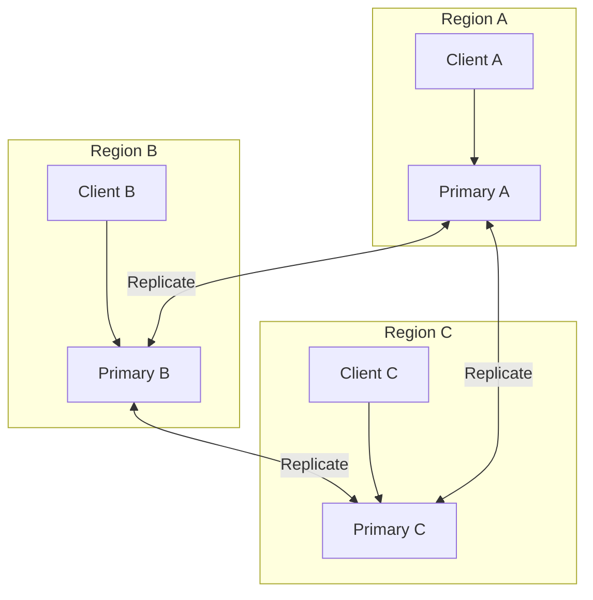
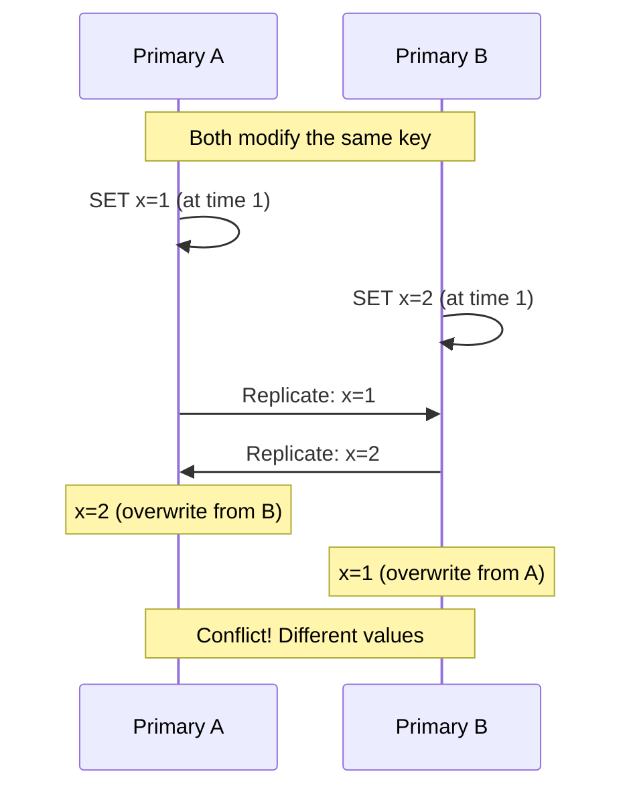
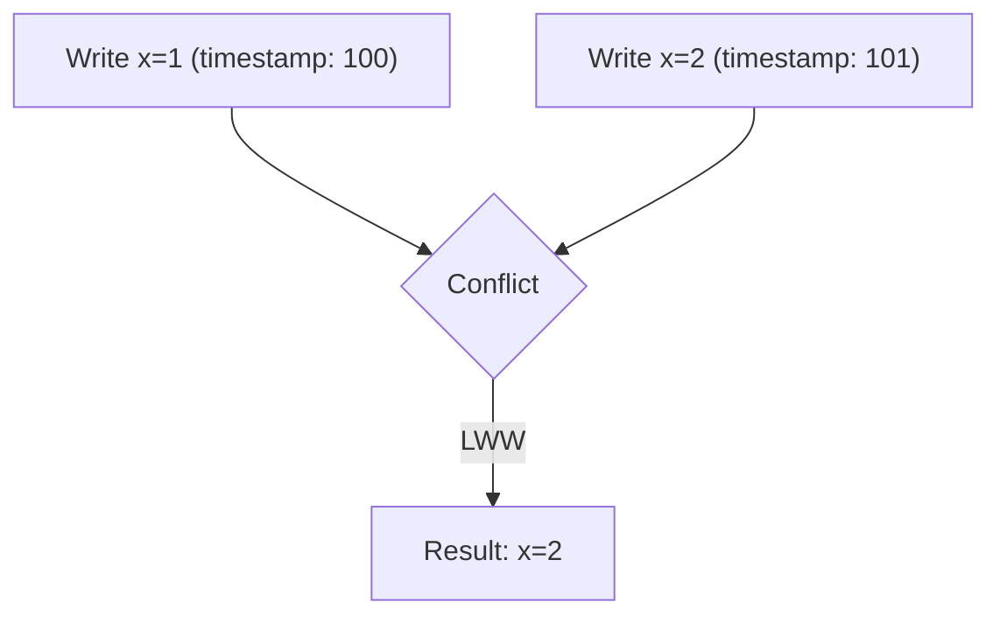
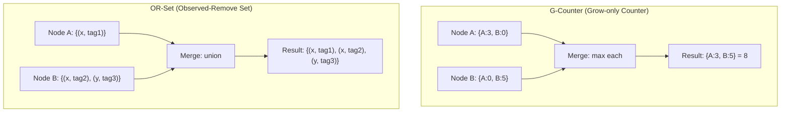
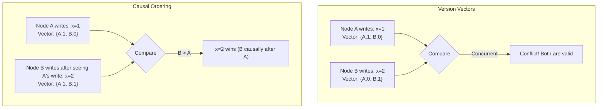
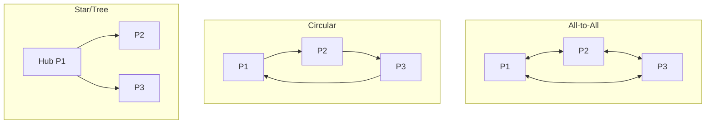

# Multi-Primary Replication

## Overview

Multi-primary (also called multi-leader or active-active) replication allows **multiple nodes to accept writes simultaneously**. Unlike primary-backup where only one node handles writes, multi-primary replication distributes write load across multiple primaries, each replicating to the others. This pattern is used for geo-distributed databases, offline-first applications, and high-availability systems.

## How It Works



Each primary accepts writes from its local clients and asynchronously replicates to other primaries.

## Use Cases

| Use Case | Why Multi-Primary |
|----------|------------------|
| **Multi-datacenter** | Each datacenter has its own primary for low latency |
| **Offline-first** | Each device has a local database that syncs when online |
| **High availability** | Writes continue even if one primary fails |
| **Collaborative editing** | Multiple users edit simultaneously |

## The Conflict Problem

The core challenge: **what happens when two primaries modify the same data simultaneously?**



## Conflict Resolution Strategies

### 1. Last-Write-Wins (LWW)

Each write gets a timestamp. The write with the latest timestamp wins.



**Pros**: Simple, deterministic, no coordination needed
**Cons**: Writes can be lost; clock skew causes issues; doesn't handle concurrent writes well

### 2. Merge Functions

Define a function that merges conflicting values:

```python
# Example: Set union merge
def merge(current, incoming):
    return current.union(incoming)

# Example: Counter merge (sum)
def merge(current, incoming):
    return current + incoming
```

### 3. CRDTs (Conflict-free Replicated Data Types)

Data structures that can be merged automatically without conflicts:



Common CRDTs:
| Type | Description | Example Use |
|------|-------------|-------------|
| **G-Counter** | Grow-only counter | Page views, likes |
| **PN-Counter** | Positive-Negative counter | Inventory |
| **G-Set** | Grow-only set | Tags, bookmarks |
| **OR-Set** | Add/remove set | Shopping cart |
| **LWW-Register** | Last-writer-wins register | User profile |
| **LWW-Element-Set** | LWW set | Configuration |

### 4. Application-Level Resolution

The application decides how to handle conflicts:

```python
def resolve_conflict(current, incoming):
    # Custom logic
    if current.version > incoming.version:
        return current
    elif incoming.priority == "urgent":
        return incoming
    else:
        return merge(current, incoming)
```

### 5. Version Vectors

Track causality using version vectors:



## Comparison of Strategies

| Strategy | Complexity | Data Loss | Deterministic | Use Case |
|----------|-----------|-----------|---------------|----------|
| **LWW** | Low | Possible | Yes | Simple systems |
| **CRDTs** | Medium | No | Yes | Counters, sets |
| **Version Vectors** | Medium | No | No (needs resolution) | General purpose |
| **Application** | High | Depends | Depends | Complex business logic |

## Multi-Primary Topologies



| Topology | Pros | Cons |
|----------|------|------|
| **All-to-All** | Low latency | Complex, duplicate messages |
| **Circular** | Simple | Single point of failure |
| **Star** | Centralized control | Hub failure affects all |

## Real-World Examples

| System | Multi-Primary? | Notes |
|--------|---------------|-------|
| **Cassandra** | Yes | All nodes are equal; tunable consistency |
| **DynamoDB** | Yes | Multi-region with last-writer-wins |
| **CouchDB** | Yes | Offline-first with version vectors |
| **MySQL Galera** | Yes | Synchronous multi-primary |
| **PostgreSQL BDR** | Yes | Bi-directional replication |
| **Google Spanner** | No | Single-primary with TrueTime |

## Interview Questions

1. **What is multi-primary replication and when would you use it?**
   - Multiple nodes accept writes simultaneously. Use for geo-distributed systems (low latency per region), offline-first apps, or high availability (writes survive single node failure).

2. **How do you handle write conflicts in multi-primary replication?**
   - Last-write-wins (simple but loses data), CRDTs (automatic merge), version vectors (detect conflicts, resolve manually or with custom logic), or application-level resolution.

3. **What are CRDTs?**
   - Conflict-free Replicated Data Types are data structures designed to merge automatically without coordination. Examples: G-Counter (grow-only counter), OR-Set (add/remove set), LWW-Register (last-writer-wins).

4. **What's the difference between LWW and version vectors?**
   - LWW uses timestamps to pick the latest write (simple but can lose concurrent writes). Version vectors track causality and can detect whether writes are concurrent or causally related.

5. **What is the CAP trade-off in multi-primary replication?**
   - Multi-primary is typically AP (available, partition-tolerant) — it sacrifices consistency for availability. During partitions, each partition can continue accepting writes, but conflicts must be resolved later.

## Common Mistakes

- Ignoring **conflict resolution** until it's too late
- Using LWW when concurrent writes matter (data loss)
- Not accounting for **clock skew** with timestamp-based resolution
- Assuming all conflicts are resolvable — sometimes human intervention is needed
- Forgetting about **replication lag** and its impact on reads

## Summary

Multi-primary replication enables high availability and geo-distributed writes by allowing multiple nodes to accept writes. The key challenge is conflict resolution when the same data is modified concurrently. Strategies range from simple (LWW) to sophisticated (CRDTs, version vectors). The choice depends on consistency requirements, data model, and application needs.

## Cross-References

- [Replication Overview](README.md) — Replication strategies comparison
- [Primary-Backup Replication](primary-backup.md) — Simpler alternative
- [Chain Replication](chain.md) — Strong consistency alternative
- [Quorum-Based Replication](quorum.md) — Tunable consistency
- [Consensus Algorithms](../consensus/README.md) — For coordination when needed
- [Message Queues](../messaging/queues.md) — For async replication
