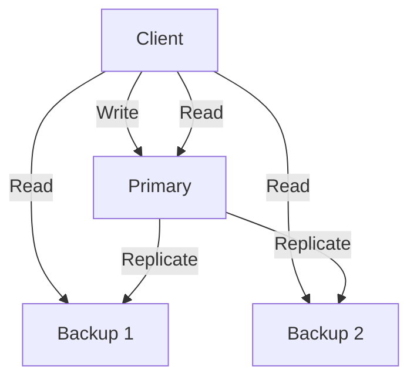
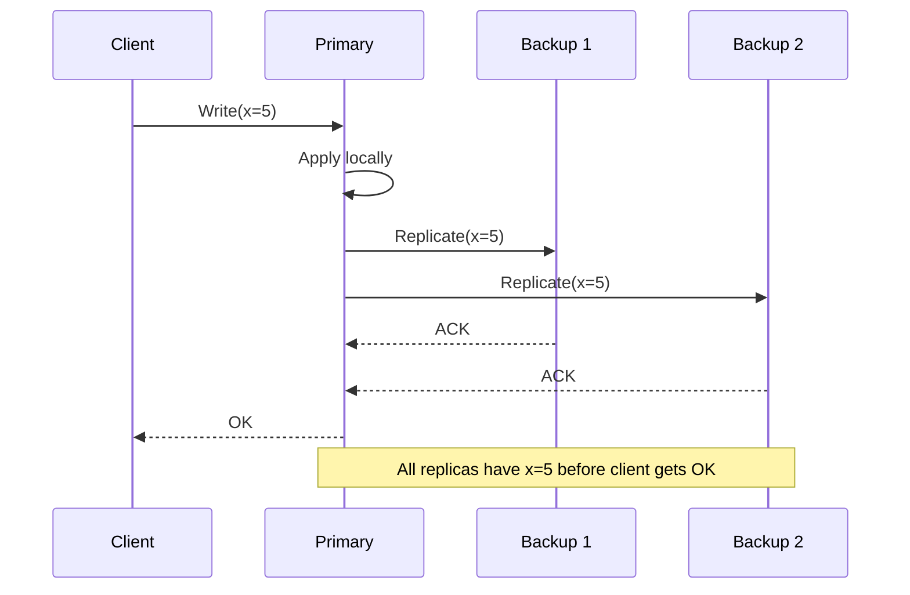
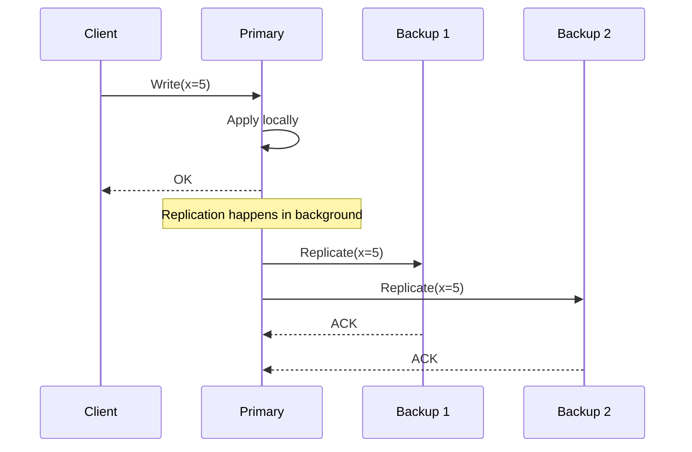
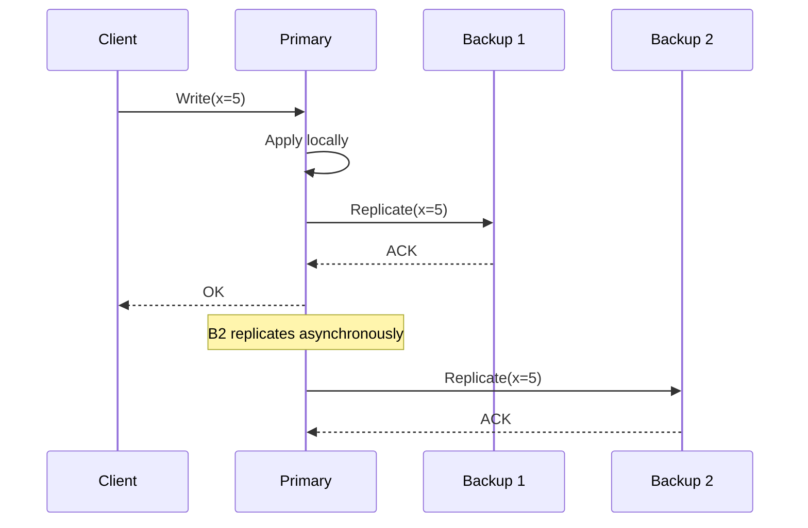
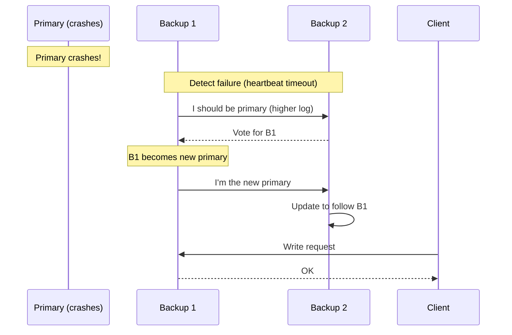
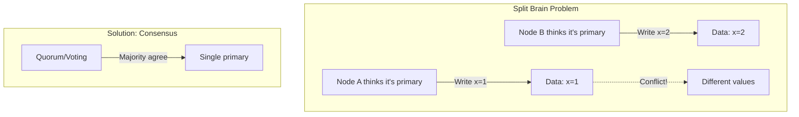
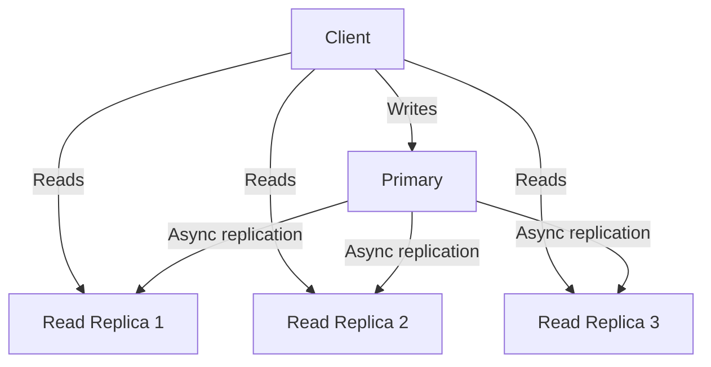

# Primary-Backup Replication

## Overview

Primary-backup (also called leader-follower or master-slave) replication is the simplest and most widely used replication strategy. One node is designated as the **primary** (leader) and handles all writes, while **backups** (followers) maintain copies of the data. This pattern is used by MySQL, PostgreSQL, MongoDB, Redis, and many other systems.

## How It Works

## Synchronous vs. Asynchronous Replication

### Synchronous Replication

**Pros**: Strong consistency — no data loss if primary crashes
**Cons**: Higher latency — must wait for slowest replica; reduced availability if a backup is down

### Asynchronous Replication

**Pros**: Low latency — client doesn't wait for replicas; higher availability
**Cons**: Data loss possible if primary crashes before replicating

### Semi-Synchronous Replication

**Pros**: Balance between consistency and latency
**Cons**: More complex to implement

## Comparison Table

| Aspect | Synchronous | Asynchronous | Semi-Synchronous |
|--------|------------|--------------|-----------------|
| **Consistency** | Strong | Eventual | Strong (w/ 1 backup) |
| **Write Latency** | High (waits for all) | Low (waits for none) | Medium (waits for some) |
| **Data Loss Risk** | None | Possible | Minimal |
| **Availability** | Lower | Higher | Medium |
| **Throughput** | Lower | Higher | Medium |

## Failover

When the primary crashes, a backup must be promoted:

### Failover Challenges

1. **Split brain**: Two nodes think they're primary
2. **Data loss**: Asynchronous replication may lose recent writes
3. **Client confusion**: Clients need to discover the new primary

### Preventing Split Brain

Solutions:
- **Fencing tokens**: Each primary gets a monotonically increasing token; old primaries can't accept writes
- **Quorum-based election**: Require majority vote to become primary
- **External coordinator**: Use ZooKeeper or etcd for leader election

## Read Replicas

Read replicas scale read throughput without affecting write performance. They may serve stale data.

## Real-World Examples

| System | Synchronous? | Notes |
|--------|-------------|-------|
| **MySQL** | Optional | Default is async; semi-sync available |
| **PostgreSQL** | Optional | Streaming replication (async by default) |
| **MongoDB** | Yes (majority) | Replica sets with majority write concern |
| **Redis** | Optional | Sentinel for failover |
| **Kafka** | Configurable | `min.insync.replicas` setting |

## Interview Questions

1. **What is primary-backup replication?**
   - One node (primary) handles writes and replicates to backups. Backups can serve reads. If primary fails, a backup is promoted.

2. **When would you choose synchronous over asynchronous replication?**
   - Synchronous: when data loss is unacceptable (financial systems). Asynchronous: when latency matters more than consistency (social media feeds).

3. **What is split brain and how do you prevent it?**
   - Split brain occurs when two nodes both think they're primary. Prevent with fencing tokens, quorum-based election, or external coordinators like ZooKeeper.

4. **How does failover work in primary-backup?**
   - Detect failure via heartbeat timeout. Elect a new primary (highest log or pre-configured priority). Update clients to use new primary. Handle any data loss from async replication.

5. **What is the consistency guarantee of asynchronous replication?**
   - Eventual consistency — backups will eventually have all writes, but may temporarily be behind. If primary crashes, recent writes may be lost.

## Common Mistakes

- Not planning for **failover** — what happens when the primary crashes?
- Ignoring **split brain** scenarios
- Assuming synchronous replication is always better — it has latency and availability costs
- Forgetting about **read-after-write consistency** when using read replicas
- Not considering **replication lag** when designing read paths

## Summary

Primary-backup replication is the foundation of most distributed databases. The primary handles writes, backups maintain copies, and failover promotes a backup when the primary fails. The choice between synchronous and asynchronous replication trades off consistency for latency and availability. Understanding failover, split brain, and consistency guarantees is essential for designing reliable systems.

## Cross-References

- [Replication Overview](README.md) — Where primary-backup fits
- [Multi-Primary Replication](multi-primary.md) — Writes to multiple primaries
- [Chain Replication](chain.md) — Strong consistency alternative
- [Quorum-Based Replication](quorum.md) — Tunable consistency
- [Consensus Algorithms](../consensus/README.md) — Used for leader election
- [Raft](../consensus/raft.md) — Primary-backup with consensus

## Cross References

- [Multi-Primary](multi-primary.md)
- [Quorum](quorum.md)
- [Consistency](../fundamentals/consistency.md)
- [DBMS Replication](../../dbms/distributed/replication.md)
