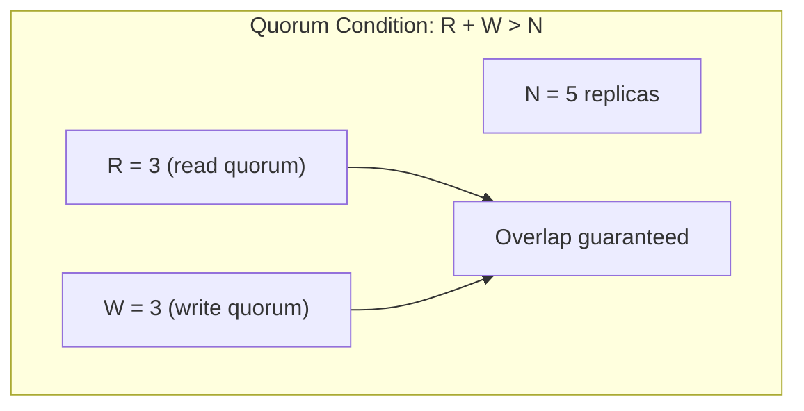
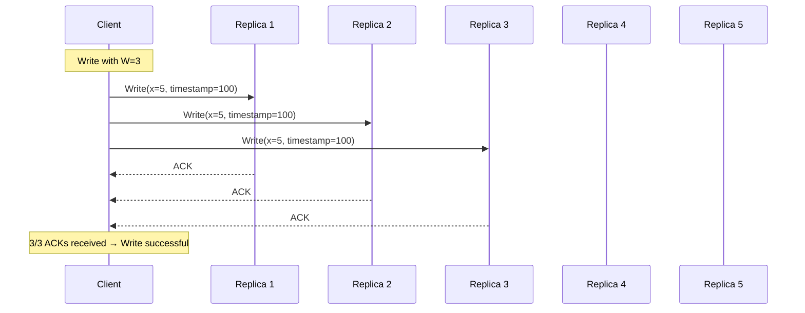
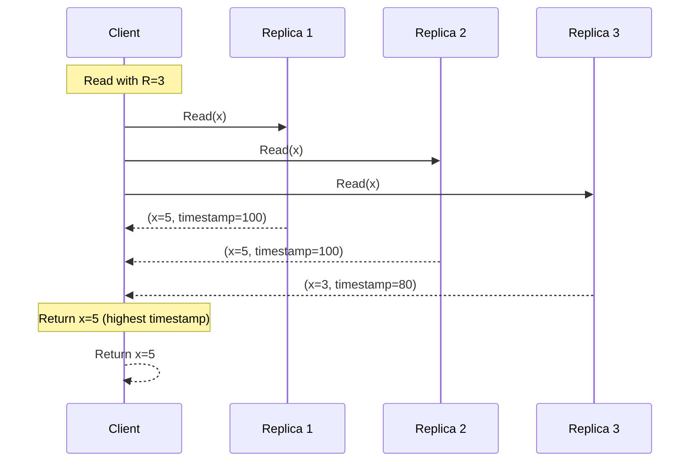
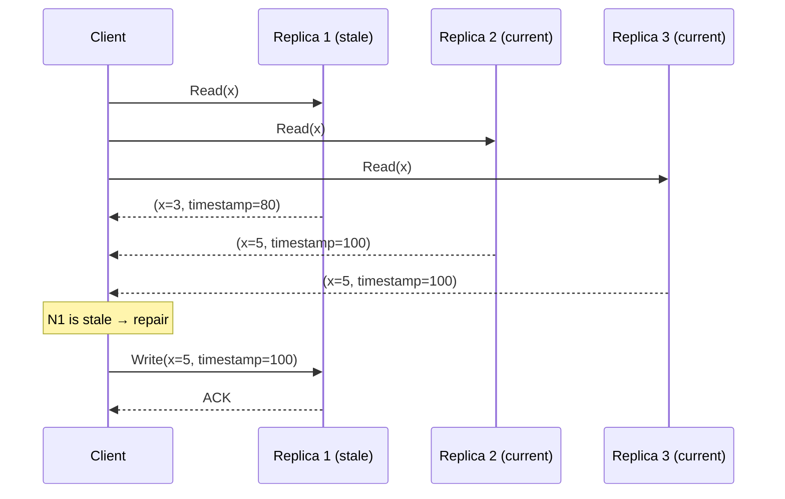
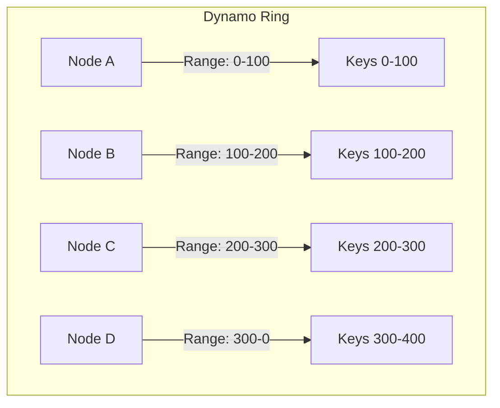
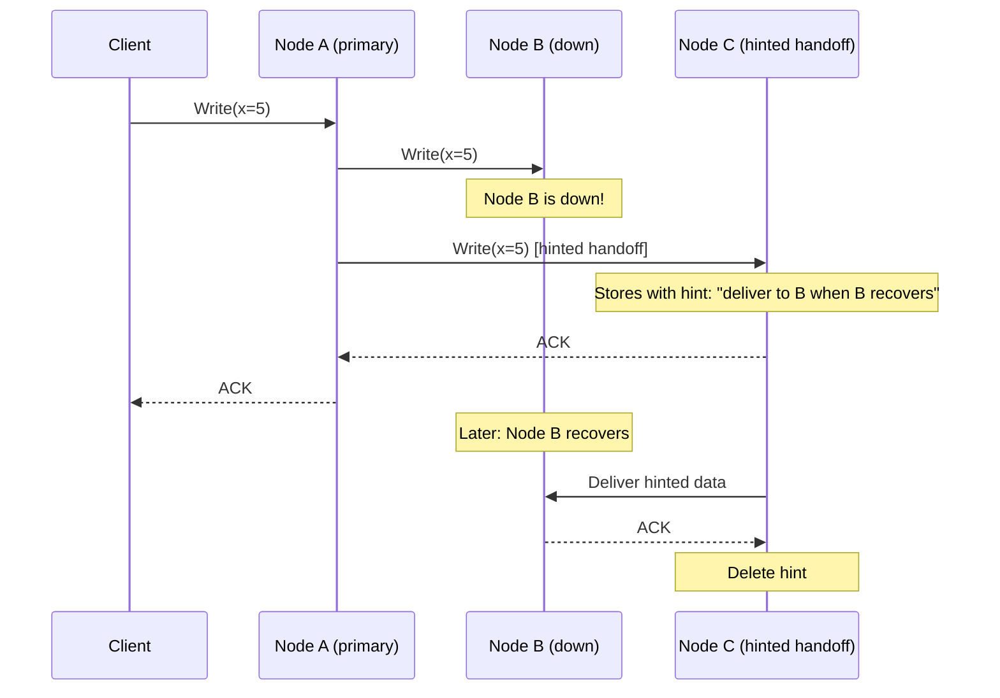

# Quorum-Based Replication

## Overview

Quorum-based replication is a flexible replication strategy that uses **voting** to achieve configurable consistency. By requiring reads and writes to contact a certain number of replicas (a quorum), the system can trade off between consistency, availability, and latency. This approach is used by Amazon Dynamo, Apache Cassandra, Riak, and Voldemort.

## The Quorum Principle

The key insight: if the sum of read quorum (R) and write quorum (W) exceeds the total replicas (N), then **every read quorum overlaps with every write quorum**, ensuring reads see the latest write.



## NRW Model

| Parameter | Description | Typical Values |
|-----------|-------------|----------------|
| **N** | Total number of replicas | 3-5 |
| **R** | Read quorum (nodes to read from) | 2-3 |
| **W** | Write quorum (nodes to write to) | 2-3 |

### Common Configurations

| Config | R | W | Consistency | Availability | Use Case |
|--------|---|---|-------------|-------------|----------|
| **Strong** | N | 1 | Strong | Low writes | Read-heavy, strong consistency |
| **Strong** | 1 | N | Strong | Low reads | Write-heavy, strong consistency |
| **Balanced** | (N+1)/2 | (N+1)/2 | Strong | Medium | Balanced workloads |
| **Eventual** | 1 | 1 | Eventual | High | High availability |

## How Quorum Reads and Writes Work

### Write Path



### Read Path



### Read Repair

If a read discovers stale replicas, it can **repair** them:



## Dynamo-Style Replication

Amazon Dynamo popularized quorum-based replication with several enhancements:

### Consistent Hashing Ring



### Sloppy Quorum and Hinted Handoff

When a node is unavailable, writes go to the next available node on the ring:



### Anti-Entropy with Merkle Trees

Replicas use Merkle trees to efficiently detect and resolve differences:

```mermaid
graph TD
    subgraph "Merkle Tree Comparison"
        R1["Replica 1 Root: abc123"] --> C1["Child 1: def456"]
        R1 --> C2["Child 2: ghi789"]
        
        R2["Replica 2 Root: abc124"] --> C3["Child 1: def456"]
        R2 --> C4["Child 2: ghi790"]
        
        C1 -.->|Match| C3
        C2 -.->|Mismatch!| C4
    end
    
    Note over C2,C4: Only sync subtree under Child 2
```

## Conflict Resolution in Quorum Systems

### Last-Write-Wins (LWW)

```python
def resolve_lww(values):
    return max(values, key=lambda v: v.timestamp)
```

### Vector Clocks

```python
def detect_conflict(v1, v2):
    # v1 and v2 are vector clocks
    if v1 > v2:
        return v1  # v1 is newer
    elif v2 > v1:
        return v2  # v2 is newer
    else:
        return CONFLICT  # Concurrent writes
```

## Quorum Condition Analysis

| R + W | Overlap? | Consistency |
|-------|----------|-------------|
| R + W > N | Yes | Strong |
| R + W = N | Possible no overlap | Eventual |
| R + W < N | No guarantee | Eventual |

### Examples with N=5

| R | W | R+W | Consistency | Write Latency | Read Latency |
|---|---|-----|-------------|---------------|--------------|
| 1 | 5 | 6 | Strong | High | Low |
| 5 | 1 | 6 | Strong | Low | High |
| 3 | 3 | 6 | Strong | Medium | Medium |
| 2 | 2 | 4 | Eventual | Low | Low |
| 1 | 1 | 2 | Eventual | Very Low | Very Low |

## Real-World Examples

| System | N | R | W | Notes |
|--------|---|---|---|-------|
| **Cassandra** | Configurable | Configurable | Configurable | CL.ONE, CL.QUORUM, CL.ALL |
| **DynamoDB** | 3 | 2 | 2 | Default strong consistency |
| **Riak** | Configurable | Configurable | Configurable | Default N=3, R=2, W=2 |
| **Voldemort** | Configurable | Configurable | Configurable | LinkedIn's key-value store |

## Interview Questions

1. **What is the quorum condition and why is it important?**
   - R + W > N ensures that every read quorum overlaps with every write quorum, guaranteeing that reads see the latest write. Without this, reads might miss recent writes.

2. **How do you choose R, W, and N values?**
   - N: replication factor (durability). R and W: trade-off between consistency and latency. For strong consistency: R + W > N. For lower latency: R=1, W=1 (eventual consistency).

3. **What is hinted handoff?**
   - When a target node is unavailable, writes go to another node with a "hint" (metadata indicating the intended recipient). When the target recovers, the hint is delivered and deleted.

4. **How does Dynamo-style replication handle conflicts?**
   - Typically uses vector clocks to detect concurrent writes. Conflicts are resolved using last-write-wins, application-specific resolution, or returning multiple versions to the client.

5. **What is read repair?**
   - During a read, if the client discovers stale replicas, it sends the latest value to them. This self-healing mechanism keeps replicas consistent over time.

6. **Compare quorum replication to primary-backup.**
   - Quorum: any node can coordinate reads/writes, tunable consistency, high availability. Primary-backup: single node coordinates writes, strong consistency, simpler but less available.

## Common Mistakes

- Setting R + W ≤ N without realizing it provides only eventual consistency
- Forgetting about **network partitions** — quorum systems can become unavailable if too many nodes are down
- Not considering **latency** — higher R and W values mean higher latency
- Ignoring **conflict resolution** — quorum systems can produce conflicts that need handling
- Assuming quorum reads always return the latest value — clock skew with LWW can cause issues

## Summary

Quorum-based replication uses voting (NRW model) to provide tunable consistency. The condition R + W > N guarantees strong consistency by ensuring read-write quorum overlap. Dynamo-style systems enhance this with consistent hashing, hinted handoff, and anti-entropy. The trade-off is between consistency (higher R, W) and availability/latency (lower R, W).

## Cross-References

- [Replication Overview](README.md) — Replication strategies comparison
- [Primary-Backup Replication](primary-backup.md) — Simpler alternative
- [Multi-Primary Replication](multi-primary.md) — Related conflict resolution
- [Chain Replication](chain.md) — Strong consistency alternative
- [Consistent Hashing](../partitioning/consistent-hashing.md) — Used in Dynamo-style systems
- [Consensus Algorithms](../consensus/README.md) — For stronger consistency guarantees

## Cross References

- [CAP Theorem](../fundamentals/cap.md)
- [Primary-Backup](primary-backup.md)
- [Consensus](../consensus/README.md)
- [DBMS Replication](../../dbms/distributed/replication.md)
