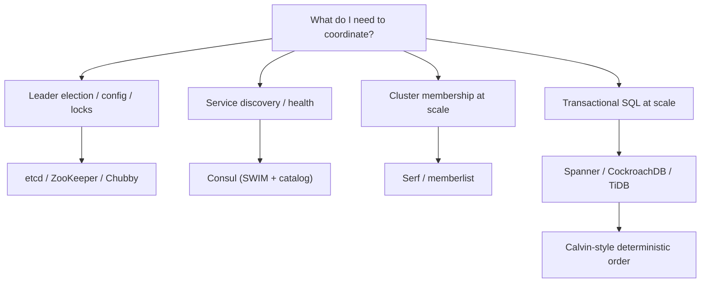

# Coordination Systems Internals

## Overview

This section complements the generic pages on consensus, replication, and consistency with the *internals of real coordination systems*: what etcd's WAL and MVCC tree actually do, how ZooKeeper's ZAB differs from Raft, what the Chubby paper and Consul's gossip pools implement, and how the distributed SQL engines (Spanner, CockroachDB, TiDB) and deterministic systems (Calvin/Fauna) order and verify transactions. Each page follows one rule: describe what the code or paper does, with numbers, and link back to the concept page that explains *why*. These systems dominate system-design interviews because interviewers ask "how would Kubernetes elect a leader?" or "why is ZooKeeper read-fast but write-slow?" — questions that only make sense at the internals level.

## How to Read This Section

- Start with the **decision table** below to map a workload to a system.
- Read the concept page first when a term is unfamiliar: [Consensus (advanced)](../advanced/consensus-advanced.md), [Raft](../consensus/raft.md), [ZAB](../consensus/zab.md), [Leases](../advanced/leases.md), [Clocks & ordering](../advanced/clocks-ordering.md).
- The verification page ([Consistency verification](./consistency-verification.md)) closes the loop: it shows how the guarantees these systems advertise are actually tested and broken.

## Which Coordinator Do I Pick?

| Requirement | First choice | Why | Internals page |
|---|---|---|---|
| Kubernetes-style leader election, config, small strong-consistent KV | **etcd** | Raft with linearizable reads (ReadIndex), MVCC revisions, watchable event history | [etcd internals](./etcd-internals.md) |
| ZooKeeper-shaped workloads: hierarchical metadata, ephemerals, big read fan-out | **ZooKeeper** | Local-replica reads (sequential consistency), ZAB broadcast, mature recipes | [ZooKeeper internals](./zookeeper-internals.md) |
| Global lock service with sessions, leases, and cache callbacks (Google-internal pattern) | **Chubby** | Paxos cell + 45 s session leases + coarse-grained lock advice | [Chubby & Consul](./chubby-and-consul.md) |
| Service discovery with health checks, DNS, multi-DC federation | **Consul** | SWIM gossip for node liveness, Raft catalog, blocking queries, health-check/gossip split | [Chubby & Consul](./chubby-and-consul.md) |
| Membership list for thousands of nodes with no strong consistency | **Serf / memberlist** | SWIM: indirect probes, suspicion, piggybacked dissemination, Lifeguard fixes | [memberlist & gossip](./memberlist-gossip.md) |
| Geo-distributed serializable SQL, low-latency reads anywhere | **Spanner** | TrueTime commit-wait, Paxos groups per tablet, directory placement | [Spanner internals](./spanner-internals.md) |
| Open-source serializable SQL deployable on any cloud/HW | **CockroachDB** | Multi-Raft + HLC, uncertainty intervals, parallel commits, DistSQL | [CockroachDB architecture](./cockroachdb-architecture.md) |
| HTAP: transactional SQL plus columnar analytics on fresh data | **TiDB** | TiKV Raft regions + PD TSO, TiFlash columnar learners, MPP execution | [TiDB architecture](./tidb-architecture.md) |
| Synchronous geo-replication on commodity hardware, deterministic order | **Calvin-style (Fauna, FDB heritage)** | Pre-ordered deterministic log replaces distributed commit | [Calvin & determinism](./calvin-and-deterministic.md) |
| Proving any of the above actually behaves as documented | **Jepsen / DST tooling** | Fault injection + checkers; deterministic simulation for exact replay | [Consistency verification](./consistency-verification.md) |

## Internals at a Glance

| System | Consensus / ordering | Storage engine | Read story | Watch/change story | Written in |
|---|---|---|---|---|---|
| etcd | Raft (etcd/raft library) | bbolt B+tree + WAL | Linearizable (ReadIndex/lease) or serial (local) | MVCC event history + watch streams | Go |
| ZooKeeper | ZAB (epochs + zxid) | In-memory tree + txn log/snapshots | Local replica (sequential consistency) | One-shot watches | Java |
| Chubby | Paxos cell (master) | In-memory + files on disk | Lease-consistent, cached with invalidations | Events + cache callbacks | C++ |
| Consul | Raft catalog + SWIM membership | In-memory state + snapshots | Blocking queries; default/consistent/stale modes | Blocking long-polls, watches, DNS | Go |
| memberlist/Serf | None (SWIM, weakly consistent) | In-memory membership map | Eventual, epidemic | Live event stream (join/leave/update) | Go |
| Spanner | Multi-Paxos per tablet + TrueTime | Distributed file-backed store | Snapshot reads at safe time | Change streams (Cloud Spanner) | C++ |
| CockroachDB | Multi-Raft + HLC timestamps | Pebble (LSM) | Leaseholder reads; follower reads at safe ts | Changefeeds (CDC) | Go |
| TiDB | Multi-Raft (TiKV) + PD TSO | RocksDB (row) / DeltaTree (TiFlash) | Leader or follower reads; TiDB compute layer | CDC (TiCDC) | Go/Rust |
| Calvin/Fauna | Deterministic replicated log | Calvn-specific storage; FDB-style layers in FDB | Reads at any consistent snapshot | Streams/log tails | Various |

## The Cross-Cutting Questions

Every page in this section answers the same five questions from an implementation angle, and interviewers rarely ask more than these five in a first round:

1. **Who decides order?** A single Raft/ZAB/Paxos leader (etcd, ZooKeeper, Chubby, Consul catalog), a timestamp oracle (PD, TrueTime, HLC), or a deterministic pre-sequencer (Calvin, FoundationDB's resolver).
2. **What do reads cost?** Quorum round trip (etcd linearizable), local replica (ZooKeeper, Consul stale mode), lease check (Chubby, Spanner, CockroachDB leaseholder), or snapshot at safe time (Spanner followers, TiDB followers).
3. **How do clients learn about change?** One-shot watches with re-registration (ZooKeeper), MVCC event streams with bookmarks (etcd), blocking queries (Consul), or polling a log tail.
4. **What breaks first under load?** fsync budget (etcd), single commit pipeline (ZooKeeper), lease/keepalive storms (Chubby, Consul health checks), or the timestamp oracle (PD, Spanner commit-wait).
5. **How do we know it works?** Formal specs, Jepsen analyses, deterministic simulation — see [consistency verification](./consistency-verification.md).

## Sizing the Decision Table to an Interview

For a system-design round, the table's second column is usually enough: "I'd use etcd because Kubernetes needs linearizable reads over small state and a watch stream" is a complete first answer. For a deep-dive round, interviewers drill into exactly one system's internals: expect the etcd fsync budget, ZooKeeper's stale-read semantics, Consul's two failure-detection planes, CockroachDB's uncertainty intervals, TiDB's percolator legacy, Spanner's commit-wait math, or Calvin's no-commit-protocol argument. The pages here each contain an Interview Questions section targeting those drills, and each cross-links the generic concept page so you can walk up and down the abstraction ladder.

A common trap is picking a coordinator by popularity instead of by failure semantics: memberlist/Serf is the wrong tool for locks (no consensus), ZooKeeper is the wrong tool for service discovery under churn (write path saturates), and Consul's health checks are the wrong tool if you need transactionally consistent config (catalog is not a linearizable KV in stale mode). The trade-off tables in each page exist to make those rejections precise.

## Interview Questions

1. **When would you choose ZooKeeper over etcd, given both provide strong consistency?** Choose ZooKeeper when the workload is read-heavy hierarchical metadata with clients that benefit from local-replica reads and one-shot watches (HBase, legacy Kafka); choose etcd when you need linearizable reads at reasonable cost (ReadIndex), MVCC event history with watch replays, and gRPC streaming — e.g., Kubernetes. The deciding questions are: do reads need to be linearizable (etcd ReadIndex vs ZooKeeper's stale-by-design reads), and what write throughput do you need (both saturate at roughly tens of thousands of writes/sec).
2. **Why is Consul a better service-discovery answer than etcd for a multi-DC microservices fleet?** Consul layers two failure-detection planes: SWIM gossip (LAN/WAN pools) detects *node* liveness cheaply at scale, while agent-local health checks capture *service* health without every consumer probing every instance. Its Raft catalog stays small because health state churn never hits consensus. etcd has no native multi-DC story and every check would translate into consensus traffic.
3. **If the interviewer says "just use Raft everywhere," what is the counter-example?** Membership and service health: Raft's write cost and availability floor are unnecessary for weakly consistent membership at thousands of nodes — SWIM gives constant per-node overhead and log-time dissemination without blocking on quorums. Conversely, locks and config must have consensus. The skill is matching consistency level to the object being coordinated.
4. **What single property distinguishes the distributed SQL engines in this section?** Who assigns transaction order: Spanner uses physical time (TrueTime + commit-wait), CockroachDB uses hybrid logical clocks with uncertainty intervals and restarts, TiDB uses a centralized timestamp oracle (PD TSO) over percolator-style 2PC, and Calvin replaces the question entirely by pre-sequencing a deterministic log. That one choice drives their latency profiles, hardware requirements, and failure recovery paths.
5. **How do you defend a coordinator choice when the Jepsen analyses have criticized all of them at some point?** Read the five clauses of every finding: system, version, configuration, workload, nemesis. etcd, ZooKeeper, and Consul have all shipped fixes after analyses; the defensible position is not "X is unbreakable" but "X version Y under config Z was tested against workload W, and we replicate that test in CI."

## Key Takeaways

- Coordination systems differ on five axes: who orders writes, what reads cost, how change is observed, what saturates first, and how it is verified.
- Strong consistency is a *per-object* decision: locks and config want consensus; membership and liveness want SWIM-style weak consistency; discovery wants a health model on top of either.
- etcd = Raft + MVCC event history; ZooKeeper = ZAB + local reads; Chubby = Paxos + leases; Consul = SWIM + Raft catalog + blocking queries; memberlist = SWIM only.
- The distributed SQL engines are one idea applied to ranges: many small consensus groups, ordered by time or by an oracle, with a metadata/placement layer (Spanner placement, CRDB range descriptors, TiKV PD).
- Deterministic ordering (Calvin, FoundationDB) trades ad-hoc query flexibility and pre-declared read/write sets for no distributed commit protocol and cheap geo-replication.
- Verification is part of the design: Jepsen-style fault injection and deterministic simulation (FoundationDB, TigerBeetle, Antithesis) are how these systems' guarantees are actually established.

## Cross-References

- [etcd internals](./etcd-internals.md) — Raft WAL/MVCC/ReadIndex; the Kubernetes metadata engine.
- [ZooKeeper internals](./zookeeper-internals.md) — ZAB epochs, stale local reads, one-shot watches, sessions.
- [Chubby & Consul](./chubby-and-consul.md) — Paxos cell with leases; SWIM gossip pools and the Raft catalog.
- [CockroachDB architecture](./cockroachdb-architecture.md) — ranges, HLC uncertainty intervals, parallel commits, DistSQL.
- [TiDB architecture](./tidb-architecture.md) — TiKV regions + PD, TiFlash learners, percolator 2PC legacy.
- [Spanner internals](./spanner-internals.md) — TrueTime commit-wait math, Paxos groups, F1, post-2017 changes.
- [Calvin & determinism](./calvin-and-deterministic.md) — sequencer/scheduler design, FaunaDB, when determinism wins.
- [memberlist & gossip](./memberlist-gossip.md) — SWIM implementation details, Lifeguard fixes, dissemination math.
- [Consistency verification](./consistency-verification.md) — Jepsen, Knossos, TigerBeetle VOPR, deterministic simulation.
- [Consensus (advanced)](../advanced/consensus-advanced.md) — ReadIndex/lease reads, joint consensus, HotStuff, SMR.
- [FoundationDB deep dive](../../dbms/advanced/foundationdb-deep-dive.md) — deterministic ordering via resolver, layered design.
- [Jepsen testing](../testing/jepsen.md) — the black-box fault-injection methodology in its own right.
