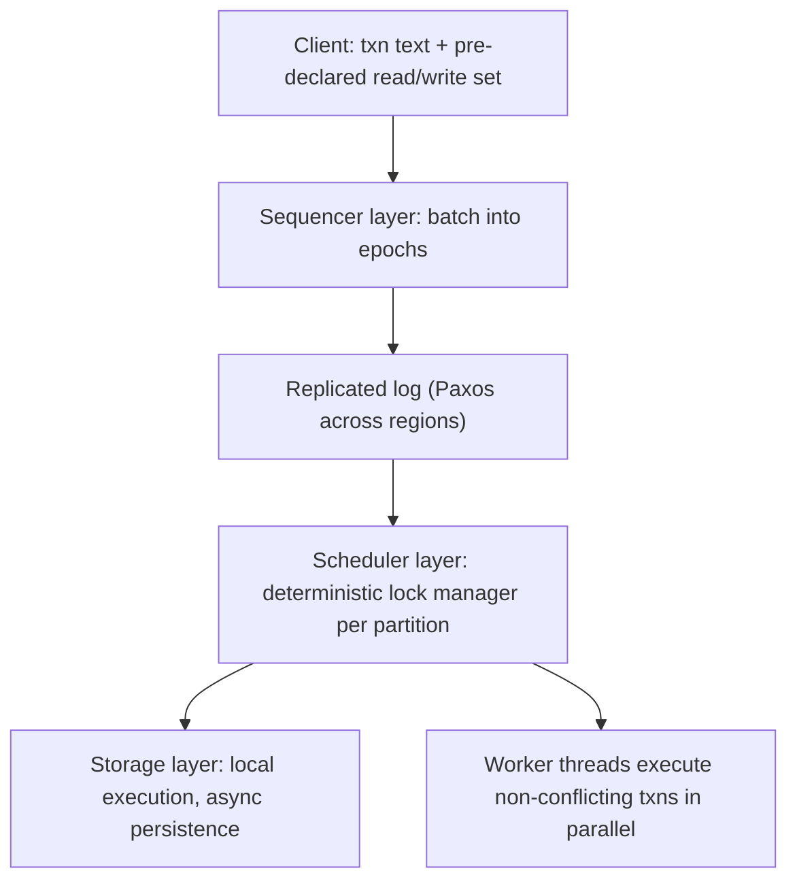

# Calvin and Deterministic Transaction Ordering

## Overview

The [Calvin overview page](../../dbms/advanced/calvin.md) covers the protocol's basic claim: pre-order transactions in a replicated log, then execute deterministically — no distributed commit protocol, no coordinating at execution time. This page is the internals complement: the three-layer design as the SIGMOD 2012 paper specifies it (sequencer, scheduler, storage), the deadlock and parallelism machinery (deterministic locking and OLLP), why the replicated log *is* the commit point, what batching does to latency, how Fauna implemented Calvin at scale, and the honest comparison against the Spanner/Percolator time-and-2PC school — including the workload shapes where determinism genuinely wins: synchronous geo-replication on cheap hardware. FoundationDB's resolver-based cousin design is contrasted throughout; see [FoundationDB deep dive](../../dbms/advanced/foundationdb-deep-dive.md).

## The Three Layers

Calvin's system paper partitions the machine into three cooperating layers, each with a narrow contract:

- **Sequencer layer**: accepts transactions (logic + pre-declared read/write set), batches them into fixed-length **epochs** (10 ms in the paper), and appends each batch to a globally replicated, totally ordered log. Sequencers may be per-shard with a forwarding layer for cross-shard transactions; the log — not any CPU in the system — is the serialization point.
- **Scheduler layer**: one scheduler per partition pulls its slice of each log batch, and acquires locks on its partition's keys **in log order** using a deterministic lock manager. Because every partition's scheduler processes the same global order, distributed deadlock is impossible by construction — a younger transaction can never hold a lock an older one needs while waiting on the older one's key (the order is total and identical everywhere). Transactions that would deadlock anyway are aborted and re-queued by the scheduler rather than negotiated with peers.
- **Storage layer**: executes and persists. The scheduler hands each transaction's storage requests to the local engine; since the write set was pre-declared, writes are applied without runtime coordination, and persistence to local disk happens asynchronously — durability already exists, because the *log* is durable and replicated.

The active/passive replica split completes the picture: **active replicas** participate in the log and execute; **passive replicas** only receive the log and reconstruct state by replay (used for fault tolerance or read-only clones without spending execution capacity). Failure recovery of an active replica is a log replay from its last applied position — there is no 2PC in-doubt state to reconstruct, ever.

## Why There Is No Distributed Commit Protocol

A traditional system discovers its commit decision *at the end*: 2PC locks participants during execution, then runs prepare/commit, and a coordinator crash between the phases leaves in-doubt transactions requiring heuristic resolution (the blocking problem formalized in [distributed transactions](../advanced/distributed-transactions.md)). Calvin moves the decision to the *beginning*: once the transaction's batch is durably in the replicated log, it is committed — the log position is the commit point. Execution afterward is a deterministic function of (log order, initial state), so replicas cannot disagree about outcomes, and a crashed node simply re-executes.

Three consequences follow, each interview-grade:

1. **No prepare phase, no lock-hold-during-2PC window.** Locks are held exactly for the duration of execution, bounded and predictable; there is no window where participants block on an in-doubt coordinator.
2. **Recovery is replay, not interrogation.** A recovering replica needs only the log; it never needs to ask other nodes "did transaction T commit?" because the answer is a log position.
3. **Replication is free and synchronous.** Geo-replicated deployments replicate the log across regions with synchronous acks; every replica converges because divergence is impossible — a claim no 2PC system can make without extra machinery.

The price is paid *before* execution: transactions must pre-declare read/write sets (or be wrapped in deterministic stored procedures that re-plan), and non-deterministic constructs (wall clock, randomness, external calls) must be pushed out of the execution path — external effects become log-recorded requests executed at deterministically chosen points.

## Parallelism: Deterministic Locking and OLLP

Determinism does not mean serial execution. Two mechanisms in the paper extract parallelism without sacrificing the deterministic order:

- **Deterministic lock manager**: locks are acquired in log order, but *non-conflicting* transactions within (and across) epochs execute concurrently; the lock manager is replicated conceptually — every scheduler derives the same lock decisions from the same log, so no cross-participant coordination occurs even for lock state.
- **OLLP (Optimistic Lockless Parallel Processing)**: transactions are executed speculatively and *in parallel* without taking locks, in log order; each transaction reads a snapshot, and if an earlier-in-log transaction wrote a key a later one read, the later one is re-executed against the updated state. A deterministic abort rule (based on which earlier transactions overlapped the read set) decides re-execution without any runtime communication. The paper reports OLLP recovering most of the parallelism of lock-based execution for workloads with modest contention, at the cost of occasional re-execution.

The scheduler also implements work-stealing across worker threads within a partition, and the storage layer's async writes keep execution off the disk's critical path. The headline number from the paper — hundreds of thousands of transactions per second per sequencer batch pipeline on commodity hardware, with 10 ms epoch batching — is what a single log can absorb when execution is coordination-free.

## Batching: The Latency Tax and Its Shape

The 10 ms epoch is Calvin's most visible constant: a transaction waits, on average, half an epoch to be batched, then the log round trip, then execution. In a single-region deployment this puts a floor of roughly 10–15 ms on transaction latency regardless of hardware speed — a deliberate trade of latency for throughput and simplicity, tuned by shortening epochs (which multiplies log-append overhead). In the paper's target deployment — **wide-area replication** — the story inverts: the WAN round trip between regions (tens of ms) dominates anyway, so the epoch's amortization is nearly free, and Calvin's synchronous WAN replication still delivers a deterministic, totally ordered database across continents on ordinary machines. The follow-up work "The Case for Determinism in Database Systems" (Thomson & Abadi) makes the deployment argument explicitly; Fauna's engineering material is the production version.

## Calvin on FaunaDB

Fauna implemented the Calvin protocol as the core of its globally distributed database, and its documentation is the best public production read-out of the design:

- A **global replicated log** orders all transactions across regions; each region's replicas follow it synchronously, so every region serves *strictly serializable* reads of the same total order without quorum reads on the query path.
- The **sequencer** lives in the region group holding log leadership; regions that lose connectivity keep serving reads at their last log position and rejoin by replay — availability behavior determined entirely by the log's replication topology.
- Fauna's query language is functional and set-oriented, which sidesteps Calvin's hardest requirement — pre-declared read/write sets for ad-hoc SQL — by evaluating queries against snapshots and encoding the determinism in the language and runtime rather than in user annotations.

The honest production notes: Calvin-shaped systems are superb for globally replicated, update-heavy workloads where every region should accept writes synchronously; they are awkward for workloads needing unbounded interactive queries with dynamic read sets, and the epoch batching makes sub-10 ms transaction latency unattainable by design. Fauna's later product pivots do not change the technical ledger — the implementation remains the reference for "Calvin in production."

## Calvin vs Spanner vs Percolator: Ordering, Commit, Hardware

| Dimension | Calvin | Spanner | Percolator (and TiDB) |
|---|---|---|---|
| Order decided by | Replicated log position (pre-execution) | TrueTime timestamps + Paxos | Central timestamp oracle + locks |
| Commit protocol | None — the log is the commit point | 2PC over Paxos + commit-wait | Percolator 2PC (primary lock) |
| Read/write sets | Pre-declared (or stored procedures) | Discovered at runtime | Discovered at runtime |
| Geo-replication | Synchronous log replication, deterministic convergence | Paxos groups per region + leader placement | None native (Bigtable replication) |
| Hardware requirement | Commodity machines, any WAN | GPS + atomic clocks (TrueTime) | Commodity + an oracle service |
| Latency profile | Epoch batching (≥ ~10 ms) + log RTT | Paxos RTT + commit-wait (~ε) | Multiple Bigtable RPCs; oracle RTT |
| Failure recovery | Log replay; no in-doubt state | 2PC recovery via lock-table records | Roll-forward from primary record |
| Weak spot | Dynamic read sets, interactive latency | Commit-wait; specialized hardware | Coordinator cleanup; staleness windows |

The philosophical difference in one sentence: Spanner makes *time* the ordering authority (and pays commit-wait), Percolator makes an *oracle* the authority (and pays coordination), Calvin makes the *log* the authority (and pays pre-declaration and batching). FoundationDB sits closer to Calvin than its designers admit in marketing: a resolver assigns a total order at commit and every replica applies in that order — but it discovers read/write sets at runtime via optimistic concurrency instead of requiring pre-declaration, which is exactly the hybrid summarized in [FoundationDB deep dive](../../dbms/advanced/foundationdb-deep-dive.md). TiDB and CockroachDB, meanwhile, are the oracle/HLC branches of the Percolator/Spanner lineage ([tidb-architecture](./tidb-architecture.md), [cockroachdb-architecture](./cockroachdb-architecture.md)).

## When Determinism Wins

Cases where the deterministic-log design is the *right* answer, not just a publishable one:

- **Synchronous geo-replication on cheap hardware.** No GPS, no atomic clocks, no TrueTime: Calvin achieves globally consistent transactions with Paxos-replicated logs over commodity WAN links — the Fauna deployment case, and the original paper's stated goal.
- **Disaster-recovery guarantees.** "Committed" means "in a replicated log with a quorum across regions"; RPO is zero by construction, and failover is a replay — there is no in-doubt transaction forensics.
- **Auditability and testing.** A deterministic order makes the database's history a first-class artifact: replicas can be diffed, execution can be simulated, and deterministic replay underpins verification approaches like FoundationDB's simulation testing (see [consistency verification](./consistency-verification.md)).
- **Consistent secondary systems.** Streams, caches, and derived stores consume the same log tail and converge identically — the ordering is a product feature.

And the honest counter-list, because interviews expect it: ad-hoc analytics over dynamic read sets (declare-then-execute fights exploratory queries), interactive latency below the epoch scale, workloads dominated by external side effects, and ecosystems whose tooling assumes interactive SQL with runtime discovery of accessed rows.

## Interview Questions

1. **Why does Calvin not need a distributed commit protocol?** Because the commit decision is made when the transaction's batch is durably appended to the replicated log — the log position is the commit point, before any execution. Execution is a deterministic function of log order, so replicas cannot diverge, recovery is replay rather than in-doubt resolution, and there is no prepare phase holding locks while a coordinator decides. The costs moved upstream: pre-declared read/write sets, deterministic transaction logic, and epoch-batched latency.
2. **How does Calvin avoid distributed deadlock without a deadlock detector?** Every partition's scheduler acquires locks in the same global log order, so the classic cycle (T1 holds A wants B while T2 holds B wants A) cannot form — if T1 precedes T2 in the log, T2's locks are acquired after T1's on every partition, everywhere. Transactions that would still conflict are aborted and re-queued deterministically. The order is total and identical at every replica, which is also why lock state needs no cross-participant communication.
3. **What does OLLP give up, and when is it worth it?** OLLP executes transactions speculatively without locks, in log order, re-executing any transaction whose read set was overlapped by an earlier writer — trading re-execution cost for lock-free parallelism. It is worth it when contention is moderate: most transactions never overlap, so throughput approaches parallel execution without lock-manager overhead; under heavy contention on hot keys it degrades toward serial re-execution, and the deterministic lock manager is the safer path. Both paths preserve the same total order.
4. **Compare Calvin's latency profile with Spanner's for a cross-region write.** Calvin: wait ≤ 10 ms for epoch batching, then one WAN log-append round trip (tens of ms), then execution — deterministic and identical for every region. Spanner: Paxos write to the group plus commit-wait (~ε, mean 4 ms, up to 7) — often shorter in a single-region placement, comparable or longer across regions, with leader placement deciding which region pays. The structural difference: Calvin charges the same latency everywhere (log position), Spanner charges by distance to the Paxos leader plus a fixed uncertainty tax.
5. **A team wants "Spanner-like" semantics but can only deploy on commodity VMs across three clouds. What do you recommend and why?** Not TrueTime — they cannot buy the hardware contract. The realistic options: CockroachDB (HLC + uncertainty intervals, restarts instead of commit-wait), TiDB (centralized TSO on etcd-backed PD), or a Calvin-style design (Fauna-style global log) if their workload can pre-declare reads/writes or use stored procedures and tolerate ~10 ms batching. The deciding questions are: can the workload tolerate a centralized oracle (PD), or pre-declaration (Calvin), or restarts under skew (HLC) — commodity hardware excludes only the TrueTime branch.
6. **How does FoundationDB differ from Calvin despite both being "deterministic"?** FDB discovers read/write sets at runtime with optimistic concurrency: reads are uncoordinated at arbitrary versions, and the resolver checks the read set against concurrent writes only at commit, assigning a total order then. Calvin requires the read/write set *before* the log append and locks keys at scheduling time. FDB thus supports interactive transactions with dynamic reads (at the cost of conflict-window aborts), while Calvin pre-pays for coordination-free execution and synchronous WAN replication. Same "one order, replay everywhere" philosophy, different discovery model.

## Key Takeaways

- Calvin's three layers — sequencer (epoch batches), scheduler (deterministic per-partition locking in log order), storage (async persistence) — turn "commit" into "durably in the replicated log."
- Determinism eliminates the distributed commit protocol, in-doubt transaction recovery, and replica divergence; it costs pre-declared read/write sets, deterministic logic, and epoch latency (~10 ms floor).
- Deterministic locking kills distributed deadlock by construction; OLLP recovers parallelism speculatively with deterministic re-execution.
- Batching is a latency-for-throughput trade that is nearly free in WAN deployments, where the WAN RTT dominates anyway.
- Fauna is the production Calvin: global log, strictly serializable reads everywhere, availability tied to log replication topology; its language design answers the pre-declaration problem.
- The ordering-authority taxonomy: log (Calvin), time (Spanner), oracle (Percolator/TiDB), HLC (CockroachDB), resolver-discovered order (FoundationDB) — name the authority and you have named the system.

## References

- Thomson, Diamond, Weng, Shao, Bernstein, Abadi, ["Calvin: Fast Distributed Transactions for Partitioned Data Stores"](https://doi.org/10.1145/2213836.2213838) (SIGMOD 2012)
- Thomson & Abadi, "The Case for Determinism in Database Systems" (VLDB 2017) — cited by title; the deployment argument for determinism
- [Fauna: Calvin — consistency without compromise](https://fauna.com/blog/calvin-consistency-without-compromise) — the production implementation's own explanation
- Daniel Abadi, ["Consistency, Consensus, and Calvin"](https://dbmsmusings.blogspot.com/2019/06/consistency-consensus-and-calvin.html) — the comparison essays this page paraphrases
- Zhou et al., ["FoundationDB: A Distributed Unbundled Transactional Key Value Store"](https://dl.acm.org/doi/10.1145/3448016.3457559) (SIGMOD 2021) — the resolver-based deterministic cousin
- Corbett et al., ["Spanner: Google's Globally-Distributed Database"](https://research.google/pubs/pub39966/) (OSDI 2012) — the time-based ordering contrast
- Peng & Dabek, ["Large-scale Incremental Processing Using Distributed Transactions and Notifications"](https://www.usenix.org/legacy/event/osdi10/tech/full_papers/Peng.pdf) (OSDI 2010) — the oracle-based contrast

## Cross-References

- [Calvin (overview)](../../dbms/advanced/calvin.md) — the protocol's basic claim and 2PC comparison, at survey depth.
- [FoundationDB deep dive](../../dbms/advanced/foundationdb-deep-dive.md) — deterministic ordering with runtime read-set discovery (the resolver design).
- [Spanner internals](./spanner-internals.md) — the TrueTime/commit-wait alternative to log-based ordering.
- [Percolator](../fundamentals/percolator.md) — the oracle-based 2PC lineage TiDB inherits.
- [TiDB architecture](./tidb-architecture.md) and [CockroachDB architecture](./cockroachdb-architecture.md) — the two production Multi-Raft SQL stacks this comparison table positions.
- [Distributed transactions](../advanced/distributed-transactions.md) — the 2PC blocking problem Calvin eliminates by design.
- [Consistency verification](./consistency-verification.md) — deterministic simulation, the testing methodology determinism enables.
