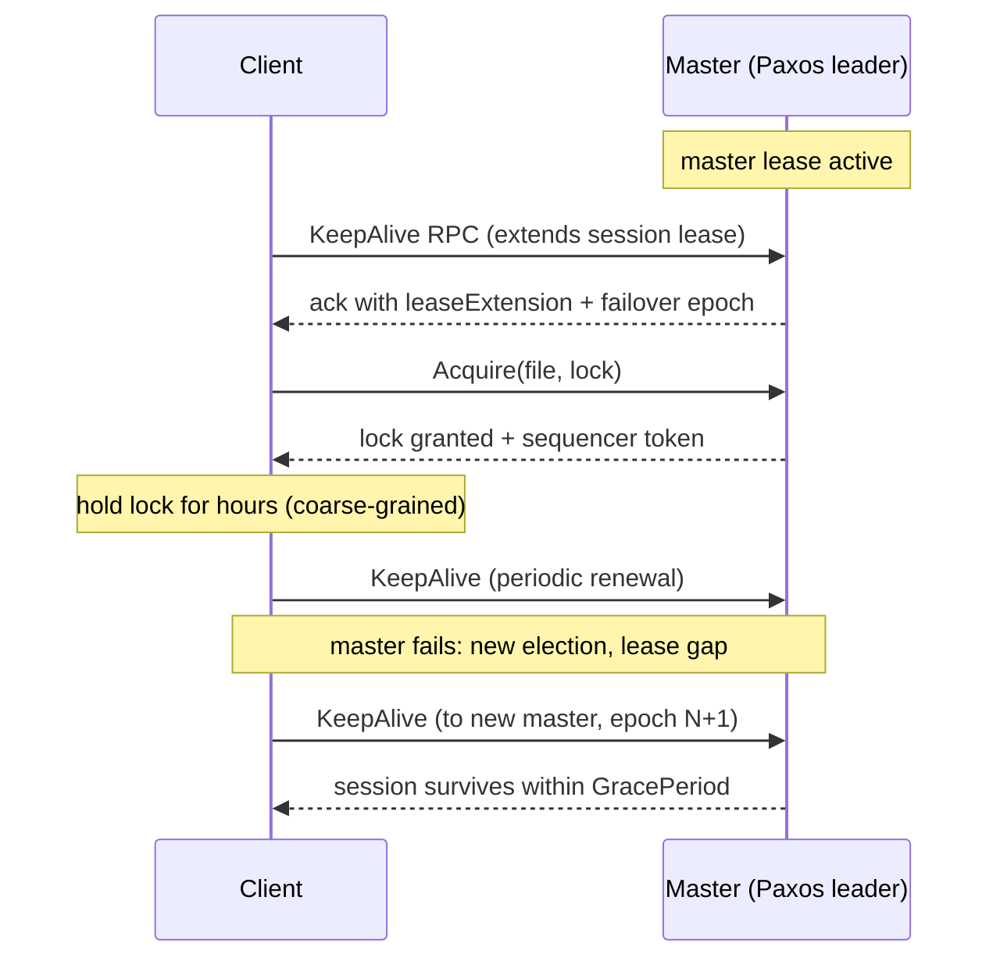
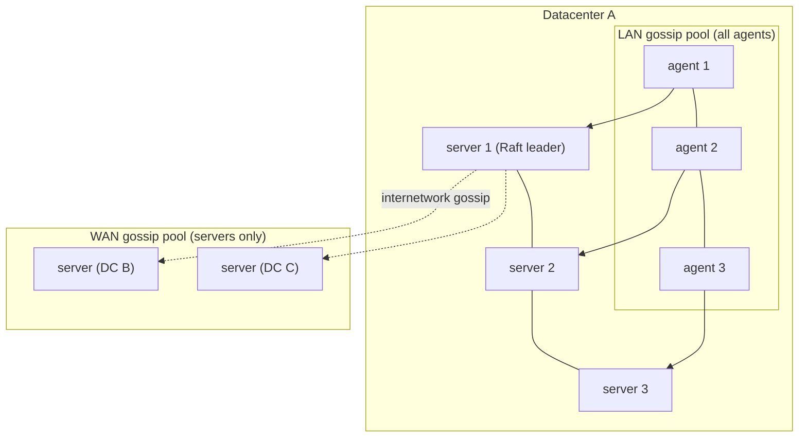

# Chubby and Consul: Two Generations of Coordination and Discovery

## Overview

Chubby (Google, OSDI 2006) is the ancestor of every modern coordination service: a Paxos-replicated lock-and-file system with sessions, leases, and cache callbacks that Google ran as a globally available service behind AdWords and Bigtable. Consul (HashiCorp, 2014) is its service-discovery-flavored descendant: a Raft catalog wrapped in SWIM gossip, health checks, blocking queries, and DNS. This page reads the Chubby paper as an internals document — the lease/keepalive/session machinery and the cell design — then dissects Consul's two failure-detection planes and its consistency modes, ending with a service-discovery trade-off table. For the generic gossip and lease concepts, see [SWIM membership](../fundamentals/swim-membership.md) and [leases](../advanced/leases.md).

## Chubby: The Cell

A Chubby **cell** is five (or seven) replicas, one of which is master. The master is elected by Paxos and holds its position by renewing a **master lease**: replicas grant the lease for a bounded interval and extend it via the keepalive mechanism, so the master can act without a Paxos round trip per request while followers know exactly when to begin an election. All data (files, locks, metadata) is replicated through the Paxos log; the master keeps a write-through in-memory state, and replicas take snapshots of the database to bound log length — the same log-plus-snapshot shape every SMR service since has used.

The namespace is a tree of files and directories, where files hold small byte strings (Chubby's docs warn against megabytes) and both support the familiar read/write/lock operations. What made Chubby notable was not the tree but what it was used for: Bigtable's row-range ownership, GFS/Colossus master election, and "Chubby cell = the datacenter's truth teller." The design guidelines in the paper — coarse-grained locks held for hours or days rather than microseconds, small files, 5-replica cells co-located with clients — are a checklist of what a coordination service can afford, and ZooKeeper/etcd inherit nearly all of it.

### Sessions, Keepalives, and the Grace Period

A Chubby session is a lease the master grants when a client first connects; the default lease is 45 seconds, adjusted within [12 s, 60 s] by measured load. The client sends **KeepAlive RPCs**; each extension returns the new lease expiry and lets the master feed the client a time to the next KeepAlive (the *keepalive interval*, typically ~12 s). If a client misses the deadline it must assume its session — and every lock it holds — is lost. The subtlety is the **grace period**: when connectivity is lost or the master fails over, a client may *hesitate* — extend its belief of the session locally — rather than immediately kill its session. Chubby's trick is to make both sides conservative: the master may not honor the session again until the grace period (default 45 s) has fully elapsed, and the client must stop acting on its locks until a successful KeepAlive. Correctness survives the overlap because any resource the lock protected is told to reject the stale holder (via sequencers) rather than trust the lock alone.

The master-failover case shows why the lease+grace design is more than a timeout: a new master must wait out the *old* master's lease before acting, clients must wait out the grace period before trusting renewed sessions, and sessions that fail to renew within the window are dropped along with their ephemeral-style state. Chubby's measured availability (the paper's numbers: cells with 5 replicas and clients reconnecting in seconds) rests on this disciplined two-sided clock. This is the same lease logic formalized in [leases](../advanced/leases.md) — Chubby is where it was first run at global scale.

### Sequencers and Cache Callbacks

Two Chubby mechanisms answer ZooKeeper's inherited weaknesses and belong in every comparison:

- **Sequencers**: when a client acquires a lock, the master returns a sequencer — `(lock name, acquisition sequence number, lock mode)`. Any *resource* protected by the lock can ask Chubby to validate the sequencer (or check it against a cheap monotonic counter) before acting, so a client whose session expired mid-operation is rejected by the resource, not merely outvoted by the next lock holder. This is the original fencing-token design, later generalized in [fencing tokens](../fundamentals/fencing-tokens.md).
- **Cache callbacks**: clients cache file data and metadata; the master tracks cache holders and, before modifying a file, blocks the write until it has invalidated every cache (clients acknowledge invalidation), all bounded by a **cache lease**. This lets thousands of clients read configuration without hammering the cell — read scalability without giving up coherent reads, the exact trade ZooKeeper declined by serving potentially-stale local reads.

The paper's honest conclusion — coarse-grained locks, small files, and clients that treat locks as advisory signals — is the design DNA of everything that followed, including the honest admission that most Chubby uses were not locks at all but a small, reliable, highly available name/data service.

## Consul: The Architecture

Consul splits its world into **datacenters**, each with 3–5 **server** agents (a Raft quorum holding the catalog) and any number of **client** agents (stateless forwarders with local state). Clients do not vote; they forward catalog writes to servers and serve local lookups, DNS, and health-check state. On top of that sits **Serf**, a SWIM implementation, running two separate gossip pools:

- The **LAN pool** connects every agent in a datacenter with fast (default 1 s) SWIM probes tuned for LAN latency; it carries member joins/leaves and failures inside the DC.
- The **WAN pool** connects only the servers of all datacenters with slower probes tuned for internet-scale latency; it carries datacenter-level liveness so cross-DC routing (and the WAN federation of the catalog) knows which DCs exist.

This one-protocol-two-parameterizations split is the practical answer to a question that sounds abstract in the SWIM paper: detection intervals must adapt to the network they run over, and a single pool mixing 1 ms LAN and 100 ms WAN links would either waste LAN speed or false-positive on WAN jitter. The memberlist-level details (indirect probes, suspicion, Lifeguard) are in [memberlist & gossip](./memberlist-gossip.md).

### Health Checks vs Gossip: Two Failure-Detection Planes

The most misunderstood part of Consul is that it runs *two independent detection systems answering different questions*:

| Plane | Answers | Runs on | Reaches consensus? | Failure mode |
|---|---|---|---|---|
| **Serf/SWIM gossip** | "Is this *node* reachable in the cluster?" | all agents (LAN) / servers (WAN) | No — weakly consistent membership | False positives on flaky links; Lifeguard mitigates |
| **Health checks** | "Is this *service* actually working?" (HTTP 200, TCP connect, TTL, script) | the node's local agent checks its own services | No — each check is local; results are anti-entropy-synced into the catalog | A healthy node hosting a failing service is marked unhealthy per-service, not per-node |

A node whose SWIM probes fail is marked failed in the LAN pool; a service whose HTTP check returns 500 is marked critical in the catalog while the node stays alive. The catalog write path is deliberately protected: check results are *not* Raft writes per check execution — the local agent owns check execution and syncs resulting state to the servers through anti-entropy, so health-check churn never turns into consensus load. This division is the reason Consul tolerates fleet-scale discovery where a ZooKeeper-style ephemeral-per-service-instance design would saturate a consensus leader (see [ZooKeeper internals](./zookeeper-internals.md) on why heavy writes hurt).

### The Catalog, Blocking Queries, and Consistency Modes

The **catalog** is the Raft-replicated source of truth: nodes, services, their addresses, tags, and check summaries. Reads come in three flavors controlled per query:

- **default**: the leader answers first (updating its index); if no leader, any server answers stale. Cheap, almost always correct.
- **consistent**: the leader verifies it is still leader (a round-trip to a quorum) before answering — the ReadIndex-flavored option, one RTT extra.
- **stale**: any server answers from its local state with bounded staleness (`max_stale`); agents can also serve cached reads.

**Blocking queries** are Consul's watch mechanism: a read carries `index=N&wait=W`; the server holds the request open until the catalog index for that object advances past N or W (bounded — the default upper bound is 10 minutes) elapses. The response returns the new index, and the client re-issues the long poll. This turns change notification into long-polling against an index watermark — simpler than etcd's event log, lossier in between (a client must also handle the "index jumped" and disconnect cases), but trivially firewallable and HTTP-native. DNS consumers get the same data with TTL-based caching instead, which is why Consul deployments run a DNS tier for legacy consumers and blocking-query APIs for everyone else.

Prepared queries, query caching (agent-side response caching with TTL), and Connect's mTLS service mesh are layers on top of the same catalog; ACLs gate it. The design summary for interviews: *catalog is consistent (Raft), membership is eventual (SWIM), health is local-but-synced, and notification is long-poll* — four different consistency levels in one product, each matched to what the data is used for.

## Service-Discovery Trade-offs

| Property | etcd/ZooKeeper | Consul | Eureka | Plain DNS (e.g., SkyDNS/CoreDNS) |
|---|---|---|---|---|
| Consensus behind registry | Raft / ZAB | Raft catalog | None (peer-to-peer replication) | Backend-dependent |
| Node liveness detection | Session/lease expiry (consensus write per change) | SWIM gossip (no consensus) | Client heartbeats | TTL expiry |
| Service-level health | DIY (app-managed ephemerals) | First-class checks (HTTP/TCP/TTL/script) | Status per instance | Typically none |
| Change notification | Watches (one-shot or MVCC stream) | Blocking queries, watches, DNS TTL | Poll (30 s) | TTL re-resolution |
| Multi-DC | None native / limited | WAN pool + federation | Regions (AP-style) | Zone-based |
| Consistency of lookups | Strong (etcd) / sequential (ZK) | default/consistent/stale modes | Eventual only | TTL-stale |
| Cost of instance churn | Consensus writes per join/leave | Gossip + anti-entropy (no consensus) | Cheap | Cheap |
| Best fit | Leader election, config, locks | Fleet-scale discovery + health + mesh | AP-friendly registries, AWS-era fleets | Static-ish topologies |

The decision rule that falls out: if the registry *changes constantly* (per-instance churn), keep churn out of consensus — Consul's gossip or Eureka's replication — and accept eventual membership. If the registry *must not lie* (leader election, distributed locks, quota allocation), pay the consensus cost — etcd/ZooKeeper/Chubby. If consumers are tolerant of TTL-staleness and want zero new moving parts, DNS is the cheapest correct-enough answer.

## Interview Questions

1. **Why did Chubby use coarse-grained locks, and what does that tell you about coordination-service economics?** Because the cell's cost model — Paxos quorum writes, keepalive traffic, cache invalidation — amortizes poorly at microsecond lock granularity; the paper reports coarse locks (minutes-to-days) with clients using application-level tricks for fine cases. The takeaway: a strongly consistent coordination service is worth its cost only for state that changes slowly but must never be wrong; anything high-frequency belongs in the application. ZooKeeper/etcd inherit the same boundary — this is why their docs warn against using them as queues or databases.
2. **Walk through a Chubby session surviving a master failover.** The old master dies; replicas elect a new master, which must wait out the old master's lease before accepting operations. Clients' KeepAlives fail or reach the new master, which extends sessions only after the grace period (default 45 s) elapses; clients, symmetrically, hesitate rather than immediately killing their sessions, but stop using locks until a KeepAlive succeeds. Sessions that do not renew in time are dropped with their locks. Correctness is preserved because stale lock holders are rejected by resources via sequencers, not trusted on lease arithmetic alone.
3. **What problem do sequencers solve that lock ownership does not?** Lock ownership is a belief held by the holder; after a GC pause or session expiry the belief is stale while the process keeps acting. A sequencer is a token `(name, seq, mode)` presented on each access so the *resource* can reject an invalid holder — turning "I think I hold the lock" into "the resource accepts my token." It is the first production fencing-token design and the standard answer to split-brain lock holders.
4. **Why does Consul keep health checks out of the Raft log, and how does that affect correctness?** Check execution is local to the agent owning the services (HTTP probes, TTLs, scripts) and results are propagated by anti-entropy; only the catalog state itself is Raft-replicated. This keeps per-instance health churn — the highest-frequency data in a fleet — from saturating consensus, which is precisely where ZooKeeper-style designs hurt. Correctness is unaffected for discovery (consumers want a freshest-effort answer); it would be wrong to build, say, leader election on health-check state, which is what the two-plane design is signaling.
5. **Explain Consul's LAN/WAN gossip pools and the parameterization rationale.** The LAN pool spans all agents in one DC with probe intervals tuned to LAN latency; the WAN pool spans only servers across DCs with slower probes tuned to internet latency. One SWIM implementation, two tunings, because detection thresholds that are safe on a LAN are either wasteful or false-positive-prone across WAN links. The WAN pool additionally gives federation its liveness signal (which DCs are up) without every agent needing cross-DC connectivity.
6. **A team proposes replacing Consul with etcd for service discovery. What is your response?** Ask three questions: who detects instance death (etcd needs a consensus write — a lease keepalive — per instance; Consul uses gossip), how consumers learn about change (etcd watch streams vs Consul blocking queries/DNS), and whether checks need to be service-level (etcd has no check model). For small fleets with lock/election-shaped needs etcd is fine; for fleet-scale discovery with health semantics and multi-DC, Consul's two-plane design is the better fit — the choice is about churn cost, not brand.

## Key Takeaways

- Chubby: 5-replica Paxos cell, master lease, 45 s session leases renewed by KeepAlive, grace-period failover, sequencers for fencing, cache callbacks for read scalability, coarse-grained-locks doctrine.
- Sessions/leases in Chubby are two-sided clocks: master-side lease + client-side hesitation within the grace period, with sequencers covering the overlap — the origin of the fencing pattern.
- Consul: Raft catalog (consistent), SWIM LAN/WAN gossip pools (eventual membership), local health checks synced by anti-entropy (no consensus churn), blocking queries (index-watermark long polls), and three read-consistency modes.
- The health-check/gossip split answers two different questions — "is the node reachable" vs "is the service working" — and keeping the second out of consensus is Consul's central scaling insight.
- Service discovery is a consistency-spectrum decision: consensus registries (etcd/ZK/Chubby) for must-not-lie state; gossip or replication (Consul, Eureka) for high-churn membership; DNS for TTL-tolerant consumers.
- Every modern coordination service is a point on the Chubby design space; naming which Chubby mechanism a system adopted (or declined) is the fastest way to demonstrate internals knowledge.

## References

- Burrows, ["The Chubby lock service for loosely-coupled distributed systems"](https://research.google/pubs/pub27897/) (OSDI 2006)
- [Consul documentation (HashiCorp developer portal)](https://developer.hashicorp.com/consul/docs) — architecture, agents, LAN/WAN gossip, blocking queries
- [Consul architecture (classic docs path)](https://www.consul.io/docs/architecture) — the diagram this page paraphrases
- [Serf gossip internals](https://www.serf.io/docs/internals/gossip.html) — message types and SWIM lifecycle as implemented
- [hashicorp/memberlist](https://github.com/hashicorp/memberlist) — the SWIM library under Serf/Consul
- Das, Gupta, Motivala, ["SWIM: Scalable Weakly-consistent Infection-style Process Group Membership Protocol"](https://ieeexplore.ieee.org/document/1028914) (DSN 2002)
- [hashicorp/raft](https://github.com/hashicorp/raft) — the Raft implementation behind Consul's catalog
- Kleppmann, *Designing Data-Intensive Applications* (2017), ch. 6 & 8 — coordination-service trade-offs in context

## Cross-References

- [Service discovery](../microservices/discovery.md) — the discovery patterns (client-side, server-side, DNS) Consul implements.
- [memberlist & gossip](./memberlist-gossip.md) — SWIM implementation internals, Lifeguard fixes, dissemination math.
- [ZooKeeper internals](./zookeeper-internals.md) — the direct architectural comparison (sessions vs leases, watches vs callbacks).
- [etcd internals](./etcd-internals.md) — the modern Raft-based coordination service; ReadIndex reads and MVCC watches.
- [Leases](../advanced/leases.md) — the lease theory Chubby's session machinery first productionized.
- [Fencing tokens](../fundamentals/fencing-tokens.md) — the generalization of Chubby sequencers.
- [Gossip protocol](../fundamentals/gossip.md) — epidemic dissemination basics behind the Serf pools.
