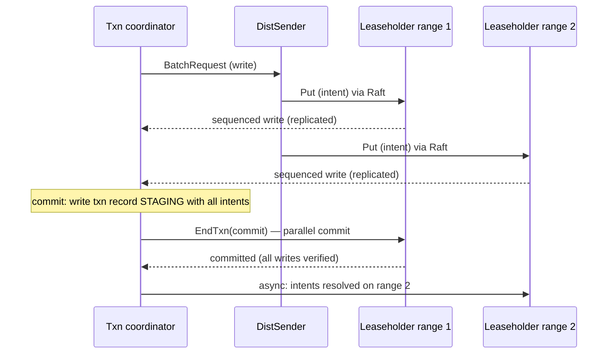

# CockroachDB Architecture: Ranges, HLC, Parallel Commits, DistSQL

## Overview

CockroachDB (2015–) is an open-source, NewSQL SQL database that presents one serializable SQL database over a sharded, replicated, geo-distributed keyspace. Its architecture is the reference implementation of the ideas in [Multi-Raft](../consensus/multi-raft.md): the keyspace is divided into ~512 MiB ranges, each a Raft group with its own leaseholder, and a distributed transaction layer built on hybrid logical clocks and uncertainty intervals delivers serializable isolation without GPS hardware. This page covers the range model, the leaseholder/replicated-state-machine split, the timestamp cache, serializable snapshot isolation, the parallel-commits write pipeline, DistSQL, and the replication-change machinery (learners and joint consensus). For the timestamp theory, read [hybrid logical clocks](../advanced/hybrid-logical-clocks.md) and [clocks & ordering](../advanced/clocks-ordering.md) first.

## Cluster Topology and the Range Model

A CockroachDB **node** runs one or more **stores** (Pebble LSM engines); the keyspace is a single ordered byte string into which all table data, indexes, and system metadata are mapped via a structured key encoding (`/Table/<id>/<index>/<PK columns>...`, plus `/Meta`, `/System`, `/Node` prefixes). The keyspace is chopped into **ranges** (default 512 MiB, split also on write load); each range is a Raft group of typically 3 replicas, and every range's identity is recorded in a **range descriptor** `(start_key, end_key, replicas, range_id, epoch)`.

Locating ranges is a two-level lookup rooted in `Meta1`/`Meta2` system ranges (with the upper levels themselves replicated like any other range). The DistSender on every node keeps a range cache, populated by lookups and by gossip of node/store descriptors, and corrects stale entries from the "range key mismatch" error returned by a node that no longer owns the key. This is the same directory-with-caching pattern as Spanner's tablet lookup; the difference is that CockroachDB's metadata lives in its own ranges, so cluster bootstrap is "ask any node" rather than "ask the placement service."

| Object | Size/shape | Who owns it | Moves? |
|---|---|---|---|
| Range (Raft group) | ≤ 512 MiB by default | 3 (or 5) replicas across stores | Yes — rebalancing, split/merge |
| Range descriptor | ~100 bytes metadata | stored in Meta ranges | Updated on every change |
| Leaseholder | one replica per range | serves reads, proposes writes | Follower placement + rebalancing |
| Pebble store | LSM, one per disk | hundreds/thousands of ranges | Fixed to its node |

Splits are driven by size or load (hot-range splitting inserts a split point at a traffic hotspot), merges combine shrinking neighbors, and the Raft machinery makes each split a metadata commit on the range performing the split — the atomicity discipline described in [Multi-Raft](../consensus/multi-raft.md).

## Replicated State Machine per Range, with a Leaseholder

Each range is a textbook replicated state machine: commands are proposed by the **leaseholder** — which is normally, but not always, the Raft leader — evaluated once *before* replication (CockroachDB's **proposer-evaluated KV**), replicated through Raft, and applied by every replica. Proposal evaluation on the leaseholder (rather than at each follower) is what makes writes cheap: followers apply pre-evaluated commands instead of re-evaluating SQL semantics, and the leaseholder can batch, pipeline, and local-repropose (its "local reproposal" machinery avoids duplicate proposals when a command is re-sent after a heartbeat gap).

The **lease** is the second safety device: the leaseholder serves *consistent reads* and timestamp assignments without a Raft round trip because the lease itself is maintained through Raft (as of recent releases, leases are bound to the Raft leader with an expiration, so lease and leadership cannot diverge the way old epoch/expiration leases could). Reads under a lease are linearizable with respect to the range because no other lease can overlap: acquiring a lease is a Raft write, and expiration is verified against HLC time. The leaseholder additionally maintains the **timestamp cache** (below) so that a read's timestamp cannot later be invalidated by a write it should have seen.

## Timestamps: HLC and Uncertainty Intervals

Every node runs a hybrid logical clock: a timestamp `(wall_time, logical)` where `wall_time` tracks the physical clock and `logical` breaks ties; HLCs are exchanged on every RPC so causally-related reads see non-decreasing time. CockroachDB assumes a bounded maximum clock offset between nodes (default **250 ms**) and a node that detects its offset exceeding the bound kills itself — the availability-for-safety trade that substitutes for TrueTime.

Read transactions get a read timestamp `ts`; the **uncertainty interval** spans `[ts, ts + max_offset]` (more precisely, up to the reader's local HLC). Any write observed with a timestamp *inside* that interval is ambiguous — it may or may not have happened "before" this read in real time — so the read is restarted with a bumped timestamp that clears the uncertainty (`ReadWithinUncertaintyIntervalError`). The timestamp cache (a per-range interval tree of recent read timestamps) enforces the other direction: a write at `ts_w` that lands below a prior read timestamp is pushed forward or fails, because that read already "happened." The combination — HLC timestamps, bounded offset, uncertainty restarts, timestamp-cache pushes — is how CockroachDB buys Spanner's external-consistency shape with no atomic clocks, at the price of occasional transaction restarts under skew. The formal treatment is in [hybrid logical clocks](../advanced/hybrid-logical-clocks.md).

## Serializable Snapshot Isolation

CockroachDB's isolation level is **serializable**, implemented as snapshot isolation plus anti-dependency handling. Mechanically:

- **Snapshot reads**: a transaction reads at `ts` with MVCC multiversioning — each key keeps a versioned history with tombstones, garbage-collected by background MVCC GC (analogous to etcd compaction, per-range).
- **Write intents**: writes are provisional MVCC records ("intents") carrying a pointer to the transaction record; conflicting readers/writers discover the intent, consult the transaction record (PENDING/STAGING/COMMITTED/ABORTED), and wait, push, or abort accordingly.
- **Timestamp pushes**: a writer discovering a newer read pushes its commit timestamp forward (or the reader is restarted); push decisions implement the write-skew defense that plain SI lacks.
- **Serializability check at commit**: with SSI-style anti-dependency tracking (per-node "sequence cache"/txnid machinery in older releases, refined over time), the coordinator detects read-write cycles and restarts rather than committing a non-serializable order.

The user-visible consequence: `SERIALIZABLE` is the default (unlike PostgreSQL, where it is the expensive option), and hot workloads see contention as *retries* rather than as lock queues — CRDB has no read locks at all, mirroring the optimistic design in [distributed transactions](../advanced/distributed-transactions.md).

## The Transaction Pipeline and Parallel Commits

A distributed transaction flows through a coordinator (`TxnCoordSender`) that tracks reads/writes, heartbeats the transaction record, and drives the commit protocol across all touched ranges:

The **parallel commit** optimization (2018) collapses the classic 2PC into one replication round: the coordinator writes the transaction record in `STAGING` state *in the same round* as the final writes, and a transaction is committed when the record plus *all* writes are durably replicated — provable by any reader that finds the STAGING record and verifies every write landed (the "implicit commit" window). If the coordinator crashes mid-window, other nodes complete or roll back the transaction by consulting the record and the write set, so recovery never blocks on a dead coordinator. Single-range transactions take a fast path (one PC commit, no separate record in the best case), and **1PC** commits write and commit atomically in a single raft entry.

The remaining failure-resolution machinery is **async intent resolution**: after commit, the coordinator (or any node, using the txn record) removes intents at leisure, since readers no longer need to wait once the record says COMMITTED. Abandoned transactions are cleaned up by heartbeating timeouts, mirroring the pending-tx recovery story of percolator-style systems — CockroachDB's lineage here is genuinely two-parented: the timestamp/ORC design from Spanner-style thinking, the intent/primary-record design from Percolator (see [percolator](../fundamentals/percolator.md)).

## DistSQL: Distributed Query Execution

DistSQL splits a SQL query into a physical plan of stages connected by **exchanges** (hash/stream rangefeed-style dataflows), placing each stage on nodes that hold relevant ranges for locality. The optimizer produces a logical plan; the physical planner assigns each scan to the leaseholders (or followers, with follower reads) owning the scanned ranges, inserts aggregations/joins where data lives, and merges results toward the gateway node. Since 20.x the default engine is **vectorized** (columnar batches) for compatible operators, with row-based execution as fallback.

The interview-relevant properties: (1) scans are always distributed — there is no "fetch the table to one node" path; (2) locality matters, because a join between ranges co-located in one region runs without cross-region exchanges, which is what `INTERLEAVE IN PARENT` (pre-22.x) and proper PK design buy; (3) follower reads let geo-replicas serve historical or stable reads at `safe time` without touching the leader region — the same safe-time idea as Spanner's follower reads (see [Spanner internals](./spanner-internals.md)).

## Replication Changes: Learners and Joint Consensus

Moving a replica (rebalancing, decommissioning, zone changes) cannot just "add a voter and remove a voter" — a fresh replica has no data and would violate quorum availability while catching up. CockroachDB's machinery is the Raft dissertation's answer, implemented as **replication changes**:

1. **Add learner**: a non-voting replica receives a snapshot and streams the log; it participates in replication but not in elections/quorums.
2. **Promote to voter atomically**: the range executes a joint configuration (`(old voters ∪ new voters)` requiring majorities of both) — Raft's joint consensus — so no commit window exists where old and new quorums can both form divergent histories.
3. **Demote/remove the old replica** in a second joint step, with demotion back to learner where useful.

Changes are grouped into **change groups** per range and executed through the same raft log as data, so a crash mid-reconfiguration replays safely. This is the productionized form of the joint-consensus design that the [membership changes](../consensus/raft-membership-changes.md) page covers abstractly — and the reason CRDB rebalancing claims no availability loss: quorums are preserved at every intermediate step.

## Where CockroachDB Sits Among Its Peers

| Aspect | CockroachDB | Spanner | TiDB | FoundationDB |
|---|---|---|---|---|
| Time/ordering | HLC + max-offset 250 ms + uncertainty restarts | TrueTime + commit-wait | PD TSO (central oracle) | Resolver-assigned versions |
| Sharding unit | Range ~512 MiB, Meta2 lookup | Tablet, directory placement | Region ~96 MiB, PD placement | ~100 MB shards |
| Consensus | Multi-Raft (etcd/raft lineage) | Multi-Paxos | Multi-Raft (TiKV) | Paxos (proxies/TLogs) |
| Commit protocol | Parallel commits (1 replication round) | 2PC over Paxos + commit-wait | Percolator 2PC (+ async commit/1PC) | Deterministic OCC via resolver |
| Isolation | Serializable (SSI) | External consistency | SI (RC/RR configurable), SI+ | Strict serializability |
| Hardware requirement | None special | GPS + atomic clocks | None special | None special |

## Interview Questions

1. **Why does CockroachDB need both a leaseholder and a Raft leader, and when do they diverge?** The leaseholder serves reads and proposes writes without a quorum round trip; the leader drives log replication. They are usually the same replica, and modern "leader leases" bind them so the leaseholder must be the leader, closing races between lease expiry and term changes. Historically (expiration/epoch leases) they could diverge briefly, which is why lease acquisition is itself a Raft write and reads must verify lease validity against HLC time — the lease is a read-availability optimization layered on the RSM, never a replacement for it.
2. **Explain the uncertainty interval and the error it produces.** A reader at timestamp `ts` cannot distinguish writes with timestamps in `[ts, ts + max_offset]` (default 250 ms) — those writes may have executed "before" the read in real time despite their later timestamp, because the writer's clock may lead the reader's. If such a write is observed, the read fails with `ReadWithinUncertaintyIntervalError` and restarts with a timestamp that clears the window. This is the bounded-skew replacement for Spanner's commit-wait: instead of waiting out uncertainty before acknowledging, CRDB surfaces uncertainty as restarts.
3. **How does parallel commit reduce the classic distributed-commit latency, and what happens if the coordinator dies in the window?** Classic 2PC needs a prepare round and a commit round; parallel commits write the final intents *and* the STAGING transaction record in one replication round, and the transaction is committed as soon as the record plus all writes are durable — readers reconstruct that fact themselves if the coordinator vanished. If the coordinator dies mid-window, any node can inspect the record and write set to determine implicit commit (or abort), then resolve intents; no transaction is stuck waiting for a dead coordinator, which was 2PC's original blocking failure.
4. **Why are learner replicas necessary for safe rebalancing?** A new replica cannot vote until it has data; adding it as a voter directly would shrink effective quorum availability and risk unsafe elections during catch-up. The learner receives a snapshot and log without participating in quorums; promotion happens through a joint configuration where majorities of both old and new voter sets are required, so no window exists with two competing quorums. This is joint consensus, from the Raft dissertation, executed through the same log as data.
5. **What does CockroachDB pay for running serializable by default, and why is it still practical?** Contention surfaces as transaction restarts (timestamp pushes, uncertainty restarts, anti-dependency cycles) instead of lock waits, so heavy contention workloads can livelock where a locking engine would serialize. It is practical because CRDB's read path is optimistic and lock-free (timestamp cache + MVCC), because retries are cheap for short transactions, and because workloads with hot keys are told to redesign keys (shard hot counters) rather than lower isolation. The trade is deliberate: no isolation misconfiguration is possible.
6. **How do follower reads stay consistent, and when can they serve traffic?** A follower tracks its applied timestamp (safe time — all writes up to it are applied) and can serve a read at `ts ≤ safe time`; the DistSender routes non-strict-historical reads only when a follower's safe time satisfies the requested staleness bound. The result is geo-local reads for analytics or read replicas without region-crossing RTTs, using the same safe-time construction Spanner uses for follower replicas.

## Key Takeaways

- One ordered keyspace, ~512 MiB Raft ranges, Meta1/Meta2 lookup with client-side range caching: metadata lives in the same replicated machinery as data.
- Proposer-evaluated KV: leaseholders evaluate once, Raft replicates commands, all replicas apply — plus lease-gated reads with HLC-verified validity.
- Bounded-offset HLC (250 ms default) + uncertainty intervals + timestamp cache = Spanner-shaped external consistency without atomic clocks, paid in restarts instead of commit-wait.
- Serializable by default: MVCC snapshots, write intents, timestamp pushes, and anti-dependency handling; no read locks anywhere.
- Parallel commits collapse 2PC to one replication round with STAGING records and implicit-commit recovery; async intent resolution completes the pipeline.
- DistSQL plans exchanges around data locality with a vectorized engine; follower reads serve geo-replicas at safe time.
- Replication changes = learners + joint consensus, so rebalancing never opens a quorum-safety window.

## References

- [CockroachDB architecture overview](https://www.cockroachlabs.com/docs/stable/architecture/overview.html) — layers and terminology
- [CockroachDB transaction layer](https://www.cockroachlabs.com/docs/stable/architecture/transaction-layer.html) — intents, timestamp pushes, parallel commits
- [CockroachDB replication layer](https://www.cockroachlabs.com/docs/stable/architecture/replication-layer.html) — Raft, leases, snapshots, replication changes
- Taft et al., ["CockroachDB: The Resilient Geo-Distributed SQL Database"](https://dl.acm.org/doi/10.1145/3318464.3386134) (SIGMOD 2020)
- Ongaro & Ousterhout, [In Search of an Understandable Consensus Algorithm](https://raft.github.io/raft.pdf) (USENIX ATC 2014) — joint consensus (§6)
- Corbett et al., ["Spanner: Google's Globally-Distributed Database"](https://research.google/pubs/pub39966/) (OSDI 2012) — the timestamp design CRDB's HLC scheme answers
- Peng & Dabek, ["Large-scale Incremental Processing Using Distributed Transactions and Notifications"](https://www.usenix.org/legacy/event/osdi10/tech/full_papers/Peng.pdf) (OSDI 2010, Percolator) — the intent/primary-record lineage

## Cross-References

- [Multi-Raft](../consensus/multi-raft.md) — the range/Raft-group model CRDB shares with TiKV, including heartbeat coalescing.
- [Raft membership changes](../consensus/raft-membership-changes.md) — joint consensus theory behind learners and promotion.
- [Hybrid logical clocks](../advanced/hybrid-logical-clocks.md) — the HLC construction CRDB timestamps run on.
- [Clocks & ordering](../advanced/clocks-ordering.md) — bounded-skew reasoning and uncertainty generally.
- [Distributed transactions](../advanced/distributed-transactions.md) — 2PC theory that parallel commits optimize.
- [Percolator](../fundamentals/percolator.md) — the intent/primary-record transaction ancestry.
- [Spanner internals](./spanner-internals.md) — the TrueTime alternative to CRDB's uncertainty restarts.
- [TiDB architecture](./tidb-architecture.md) — the other Multi-Raft SQL stack, with a centralized TSO.
- [FoundationDB deep dive](../../dbms/advanced/foundationdb-deep-dive.md) — the resolver-based deterministic contrast.
