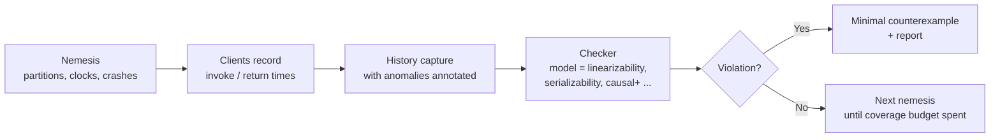
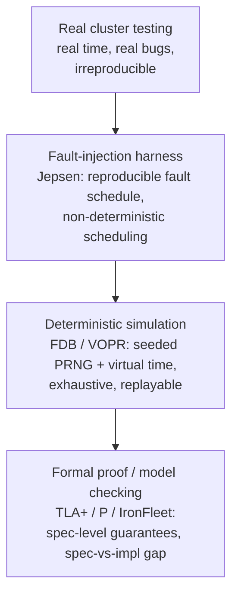

# Consistency Verification

## Overview

Every distributed database ships a consistency claim — "linearizable", "serializable", "causal+" — and the gap between the claim and the shipped binary is where outages and silent data loss live. Consistency verification is the discipline of turning that claim into an executable property and attacking the implementation until the property holds or the bug is found. Jepsen analyses, Knossos model checking, FoundationDB's simulation, and TigerBeetle's VOPR are four points on one continuum: more determinism, more exhaustive exploration, fewer excuses. For interviews — especially at infrastructure companies — being able to *read* a Jepsen report and describe how you would verify your own design is a differentiator that separates candidates who have operated systems from candidates who have read about them.

> **Interview Angle**: The probing question is almost always "your design says linearizable — how would you *know*?" Weak answers cite tests; strong answers describe histories, checkers, nemesis injection, and the state-space explosion problem with its mitigation (deterministic simulation).

## What a Checker Actually Does

A consistency model is a predicate over **histories** — totally ordered sequences of client operations with their invocation and response times. A checker replays a recorded history against the model:

- **Linearizability**: each operation must appear to take effect atomically somewhere between its invocation and response. Checking is NP-complete in general, so practical checkers prune the exponential search: Wing & Gong's algorithm with memoization, Lowe's extensions (used by Knossos), and the newer P-compositional/CacheKO techniques in ParaVerifier.
- **Serializability**: commit order forms a total order consistent with a real-time order over non-overlapping transactions — checked efficiently by building the conflict graph (cycles = violation) using PESS/PLMV algorithms.
- **Causal+ / PRAM / read-committed**: weaker models admit efficient polynomial checks (Elle's transactional checkers infer attribute graphs and look for cycles that the model forbids).

The nemesis is half the discipline: the checker is only as good as the adversarial pressure applied while recording. Standard nemesis set — network partitions (majority/minority, bridge), clock drift and steps, process crashes and pauses (SIGSTOP), membership changes, and packet reordering — each targets a specific class of implementation shortcut.

## Jepsen: Method and Findings

Kyle Kingsbury's Jepsen black-boxes the system under test: a test harness drives client operations from a control node while nemeses inject faults, then checks the recorded history with Elle. Its decade of public analyses produced an industry-wide vocabulary — *stale reads*, *lost updates*, *cyclic information flow*, *dirty reads*, *internal consistency violations* — and a pattern worth quoting in interviews: **most "serializable" systems degrade to read-committed or worse under partitions unless every linearization point is genuinely fault-tolerant**. Classic findings include MongoDb's pre-3.2 lost writes, Elasticsearch's data loss on partition heal, and numerous "ETCD can lose acknowledged writes" follow-ups across versions.

The methodological lesson: Jepsen's value is not the tool but the *negative-result culture* — analyses are published regardless of outcome, with reproducible setups. When you design a system, plan for an external adversarial audit; systems that cannot be black-boxed (no deterministic replayer, no fault-injection surface) are implicitly unverified.

## Deterministic Simulation: FoundationDB and TigerBeetle

**FoundationDB** takes verification into the build loop: the entire database — network, disk, scheduler, faults — runs on a deterministic simulation layer with a single seeded PRNG. Every run is reproducible; a failure is a bug report with a seed. Because time is simulated, FDB runs *years* of clustered operation in minutes and explores state spaces (including 7+ node configurations and exotic fault sequences) that real-time testing never reaches. The engineering cost is severe — no un-instrumented syscalls, deterministic everything — but the result is a database whose release process is "survive 10^8 simulated operations per seed across thousands of seeds".

**TigerBeetle's VOPR** applies the same idea as a fuzzing service: nightly seeded simulation runs over the full replica cluster with crash-and-restart nemeses, checking invariants (ledger balance conservation, quorum agreement) after every replay. **Antithesis** productizes deterministic simulation testing for arbitrary systems; **madsim** does it for Rust async ecosystems. The shared insight: randomness you cannot replay is randomness you cannot debug — push nondeterminism to the edges (seeded PRNG, virtual time) and the rest of the system becomes testable to exhaustion.

## Formal Methods in the Same Pipeline

TLA+ and PlusCal model the *specification* (Raft papers ship TLA+ specs; Cosmos DB used TLA+ on the Paxos-family protocols); the P language and IronFleet verify state-machine protocols with automated theorem proving. These catch design bugs before code exists, but the **spec-to-implementation gap** remains: a proved spec with a buggy implementation is the Jepsen findings list again. Mature verification culture stacks the layers — TLA+ for the design, deterministic simulation for the implementation, black-box Jepsen-style audits for the shipped binary — and treats any layer without coverage as an unpriced risk.

## Building Verification Into Your Design

When an interviewer asks how you would verify your design, answer in ordered commitments:

1. **Recordable histories**: clients log invoke/return with logical op IDs; the system exposes enough observability to reconstruct ordering (Lamport/HL clocks per node).
2. **A model per surface**: linearizability for the KV API, serializability for transactions, causal+ for sessions — do not claim one model for everything.
3. **Nemesis surface**: a fault-injection hook (drop/reorder/partition/crash/clock-step) built into the dev cluster from day one.
4. **Checker in CI**: every PR runs bounded linearizability checks over generated histories; nightly runs explore larger state spaces with seeded simulation.
5. **Replayability**: every failure reproduces from a seed; no bug is closed until its reproducer is in the corpus.

## Interview Questions

1. **Why is checking linearizability NP-complete, and what do practical checkers do about it?** The checker must find, for every history, an assignment of linearization points consistent with real time — the search space is exponential in concurrent overlapping operations (Wing & Gong / Lowe's algorithm explores it with memoization on (state, pending-ops) pairs). Practical tools bound the search, exploit P-compositionality (check independent key histories separately and join), and fall back to marking histories "unknown" rather than silently passing.
2. **A database claims serializability but Elle finds cyclic attribute information flow. What class of bug is this?** A read-committed-or-weaker implementation leaking under concurrency: a transaction read a value written by a transaction that in turn read from it — forbidden in serializable histories. Root causes are usually snapshot reads implemented without true snapshot isolation (read-your-own-writes mixed with foreign reads), or write-skew holes in the conflict detection. The fix is real multi-version conflict tracking, not tighter locking around the test.
3. **What makes FoundationDB's simulation able to replace years of testing?** Total determinism: one seeded PRNG drives scheduling, network delay, and faults; time is virtual, so a simulated week runs in minutes and every run replays bit-for-bit. Exploration then becomes seed enumeration instead of lucky real-time accidents, and any crash ships with its seed. The prerequisite is ruthless engineering: all I/O, threads, and clocks behind deterministic interfaces.
4. **Your team cannot afford full deterministic simulation. What is the minimum viable verification?** Recorded histories + a linearizability/serializability checker in CI against a fault-injecting dev cluster (the Jepsen core), plus a replayable fault schedule. It misses implementation-level nondeterminism that simulation catches, but it converts consistency claims into executed properties and catches the dominant partition/leader bug classes.
5. **Why do papers still ship TLA+ specs if implementations get verified?** Because spec bugs are cheaper than implementation bugs: a TLA+ model explores protocol-level edge cases (dueling leaders, reconfiguration races) exhaustively before a line of code exists, at a fraction of simulation's runtime cost. The spec also becomes the shared language when the implementation behaves strangely — Raft's paper-spec pairing is the canonical example of design-level verification steering implementation choices (e.g., single-membership-change restriction).

## Key Takeaways

- A consistency claim is only real if it is a checked predicate over recorded histories under adversarial nemeses.
- Jepsen's decade of findings: implementations degrade to read-committed under partitions far more often than their docs admit.
- Deterministic simulation (FDB, VOPR, Antithesis) converts testing into seed enumeration — the strongest known engineering answer to state-space explosion.
- Specs (TLA+), simulation, and black-box audits cover different layers; any uncovered layer is unpriced risk.
- Design for verifiability up front: history recording, per-API models, and fault-injection surfaces are architectural features.

## References

- Jepsen analyses index: [jepsen.io/analyses](https://jepsen.io/analyses)
- Knossos (linearizability checking): [github.com/jepsen-io/knossos](https://github.com/jepsen-io/knossos)
- FoundationDB simulation paper (SIGMOD 2021): [dl.acm.org/doi/10.1145/3448016.3452833](https://dl.acm.org/doi/10.1145/3448016.3452833)
- TigerBeetle VOPR: [github.com/tigerbeetle/tigerbeetle](https://github.com/tigerbeetle/tigerbeetle)
- IronFleet (Microsoft Research): [microsoft.com/en-us/research/publication/ironfleet](https://www.microsoft.com/en-us/research/publication/ironfleet/)
- Raft TLA+ specification: [github.com/ongardie/dissertation](https://github.com/ongardie/dissertation)

## Cross-References

- [Jepsen](../testing/jepsen.md) — the operational guide to running the harness
- [Deterministic Simulation](../testing/deterministic-simulation.md) — the FDB-style approach in depth
- [Advanced Consensus](../advanced/consensus-advanced.md) — the protocols these checkers verify
- [FoundationDB Deep Dive](../../dbms/advanced/foundationdb-deep-dive.md) — the architecture that simulation enables
- [Impossibility & Failure Models](../advanced/impossibility-models.md) — why perfect checking cannot remove FLP limits
