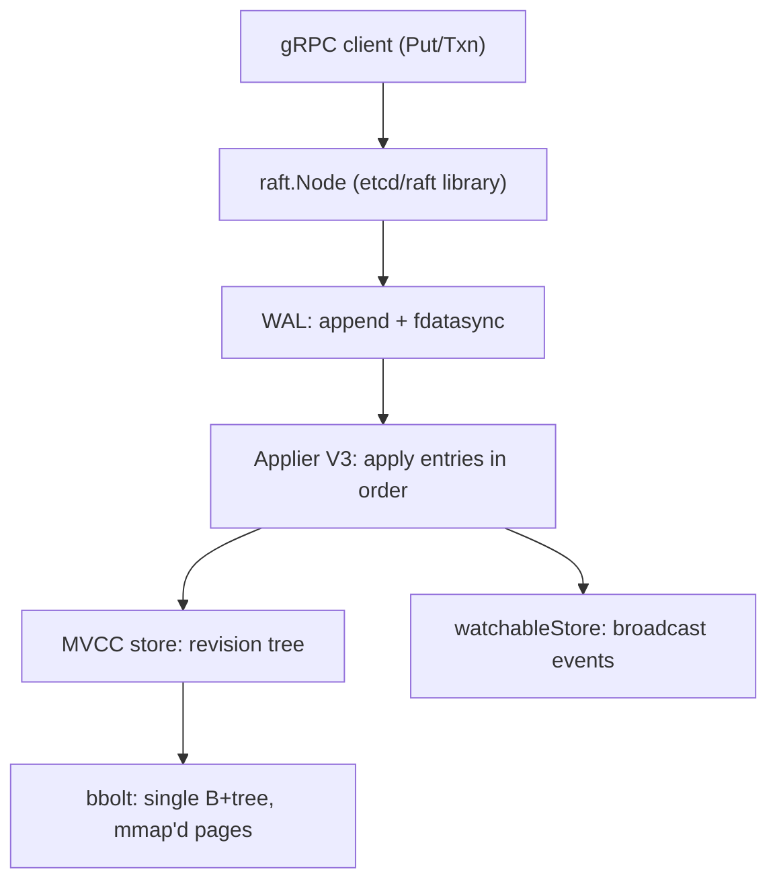

# etcd Internals: Raft, MVCC, Watches, and the fsync Budget

## Overview

etcd is a strongly consistent, distributed key-value store written in Go, used primarily as Kubernetes' source of truth for all cluster state — every Pod, Secret, and ConfigMap object is a row in etcd's bbolt database. This page covers the machinery the generic pages only name: how the Raft node, WAL, and applier pipeline interact; how the MVCC revision tree in bbolt supports both watches and compaction; how linearizable reads are implemented (ReadIndex vs lease reads); and where the fsync budget limits write throughput. For the consensus algorithm itself, read [Raft](../consensus/raft.md) and [Advanced consensus](../advanced/consensus-advanced.md) first; this page is about the production wrapper around it.

## The Layered Write Path

etcd's server decomposes into four cooperating stages. A client write crosses all of them; a watch or a read touches only the later ones:



The **raft layer** (the `go.etcd.io/raft/v3` library) is a textbook Raft implementation with an unusual API: it is *not* threaded. The host application drives it by calling `Tick()` on a timer and `Propose()` on new entries, then pulls a `Ready` struct containing messages to send, entries to append, and hard state to persist. The WAL fsync happens *before* messages are sent to peers — a discipline that keeps the "durable before visible" invariant local and obvious. Entries first sit in an **unstable** in-memory log; after the WAL fsync completes they move to the stable storage view, and after quorum ack the raft node advances the commit index.

The **WAL** is a segmented, preallocated file (`0000000000000001-0000000000000002.wal` naming encodes segment boundaries and snapshot points). Preallocation plus group commit amortizes metadata updates: many raft entries from one leader tick are flushed in a single `fdatasync`. On recovery, etcd replays the WAL over the newest raft snapshot, discarding any torn tail (a partially written record that does not checksum).

The **applier V3** executes committed entries against the state machine in order. Its most important piece of bookkeeping is `consistent_index` — the raft index of the last applied entry, persisted *inside* bbolt in the same transaction as the applied data. On restart, etcd compares `consistent_index` with the raft state to know exactly where replay must resume; without it, a crash between "committed in raft" and "applied to the store" could duplicate or skip operations.

## MVCC: The Revision Tree in bbolt

Every mutation in etcd v3 produces a global **revision** `{main, sub}`: `main` increments once per applied transaction, `sub` counts operations within it (0, 1, 2, ...). All watchers and readers key off this revision, and Kubernetes surfaces it directly as each object's `resourceVersion`. The MVCC layer maps `(key, revision) → value` through an in-memory `keyIndex`:

```text
keyIndex: key = "foo"
  generation 3: created rev (r=105,0)  versions: (105,0) (107,0) (112,0)
  generation 2: created rev (r=88,0)   versions: (88,0) ... tombstone at (101,0)
  generation 1: created rev (r=12,0)   versions: (12,0) ... tombstone at (40,0)
```

A generation is a key's lifetime between creation and tombstone; each version records the revision that wrote it. A read at revision `r` binary-searches this tree to find the newest version ≤ `r`, then fetches the value from bbolt, where the actual layout is a single B+tree keyed by `key + revision(8B big-endian) + sub` — so range scans in revision order are sequential on disk, and a key's history clusters together. There is exactly one B+tree for keys and one for leases; the v2 store (the old `/registry`-style tree behind the v2 API) is a separate, largely retired structure.

Writes create a new version per key plus (for deletes) a tombstone record. Because nothing is overwritten in place, a `Range` with `rev=N` never needs locks against concurrent writers — MVCC readers are lock-free against the apply path. The cost is unbounded growth: every historical version remains until **compaction**.

### Compaction and Defragmentation

Compaction takes a revision `rev` and discards all history older than it: superseded versions are removed, and keys whose last version precedes `rev` are dropped entirely. After compaction, any read or watch request at a revision older than `rev` fails with `ErrCompacted` ("required revision has been compacted"). Two operational modes exist: manual (`etcdctl compact <rev>`) and automatic (`--auto-compaction-mode=periodic|revision` with a retention window). Kubernetes API servers run periodic compaction for exactly this reason — without it the backend grows with every controller resync.

Compaction is logical; bbolt pages do not shrink. The freed space becomes free pages inside the file, which fragment the B+tree and slow scans — hence **defragmentation** (`etcdctl defrag`), which rewrites the bbolt file and releases space to the filesystem. Defrag blocks backend access and is expensive enough that operators schedule it per-member in maintenance windows. The standard production pairing is periodic auto-compaction plus scripted off-peak defrag.

## Watches: Event History, Not Notifications

etcd v3 watches are **replays over MVCC history**, not message broadcasts. A watcher registers a key-or-prefix range plus a start revision; the server streams every event in `[start_rev, now)` and then follows the tail. This design makes watch semantics compositional: a client can "watch from where I left off" after a reconnect, and two watchers never observe different orders because they read the same revision history.

Internally, the `watchableStore` splits watchers into **synced** (caught up to the current revision; events are fanned out as apply happens) and **unsynced** (behind; a background goroutine walks the MVCC history and catches them up). Watcher groups are keyed by the interval they observe, so one history scan serves many watchers. Events carry the previous key-value alongside the new one (`prev_kv`), which lets controllers compute diffs without an extra read. Watch **bookmarks/progress notifications** let the server promise "everything up to revision R is already delivered," which is how Kubernetes' watch cache gaps are closed without polling.

The one-shot-vs-streaming difference from ZooKeeper is architectural: ZooKeeper watches are client-side triggers that must be re-armed and can miss intermediate states; etcd watches are a subscription to an append-only revision log that (until compaction) contains every intermediate state. The price is storage — history must exist to be replayed, which is why compaction discipline is load-bearing.

## Linearizable Reads: ReadIndex vs Lease Reads

An etcd read has three consistency options, and the default (`--experimental`-free path) is **linearizable**:

| Option | What happens | Cost | Guarantee |
|---|---|---|---|
| `SERIAL` (serializable) | Serve from local member's applied state | ~0 extra RTT | May be stale (no quorum check) |
| `LINEARIZABLE` + ReadIndex | Leader confirms leadership via quorum round; wait until applied index reaches that point | 1 quorum round trip | Linearizable |
| `LINEARIZABLE` + lease read | Leader serves if its election-timeout lease has not expired | 0 extra RTT | Linearizable *if clocks hold* |

The subtlety is the difference between the **commit index** and the **applied index**. ReadIndex proves the leader's *commit* position was quorum-acknowledged at read time; but the state machine applies asynchronously. etcd therefore records the ReadIndex, waits (usually microseconds; on a lagging store, milliseconds) until `appliedIndex >= readIndex`, and only then executes the read. Serving from commit knowledge without applied state would return values that are committed but not yet visible — a classic linearizability bug that shows up in homegrown Raft stores.

ReadIndex works by piggybacking a `MsgReadIndex` on the next heartbeat round: followers reply with their current commit index, and the leader takes the quorum-acknowledged value. Lease reads skip that round trip by trusting time: within one election timeout of the last successful heartbeat, no legitimate follower can have started an election, so the leader is still (lease-valid) leader. The trade is explicit — lease reads save an RTT but inherit clock-assumption risk, which is why the etcd team made ReadIndex the default and lease reads opt-in (`--experimental-enable-lease-read`). Both mechanisms are the same two options the [advanced consensus](../advanced/consensus-advanced.md) page describes abstractly; etcd is the reference implementation to cite.

## Leases and Keepalive

etcd **leases** replace ZooKeeper-style ephemeral nodes: a client grants a lease with a TTL (seconds), attaches keys to it, and the keys vanish when the lease expires. The leader's lease queue tracks expiry; on leader change, leases are preserved because their remaining TTL is checkpointed into the log (lease checkpointing, experimental in 3.5, hardened in 3.6+) rather than restarting every lease at full TTL — which previously caused clusters of ephemeral locks to all expire simultaneously after a failover.

Keepalive is a gRPC **stream**: one `LeaseKeepAlive` RPC per client connection refreshes the lease every `TTL/3` instead of one RPC per interval. This matters operationally — thousands of Kubernetes nodes holding leader-election leases generate a steady keepalive baseline, and each refresh is a raft write. A partitioned client whose session outlives the lease loses its keys (the Kubernetes lease object disappears, another candidate wins election); a client that misses keepalives gets `lease not found` on reattach and must re-grant. The distinction between "connection lost" and "lease expired" is the fencing-tokens story from [leases](../advanced/leases.md) and [fencing tokens](../fundamentals/fencing-tokens.md).

## Performance: The fsync Budget

etcd's write throughput is bounded by three serial costs: the WAL fsync, the bbolt commit fsync, and (for a quorum) one network round trip. Everything else — gRPC, raft bookkeeping, MVCC insertion — is cheap by comparison. The production tuning conversation is therefore a *fsync budget* conversation:

```bash
# Node sizing for the write path
--snapshot-count=100000        # raft entries between snapshots (raised from 10k)
--quota-backend-bytes=8589934592   # 8 GiB bbolt quota (default 2 GiB)
--heartbeat-interval=100ms     # LAN default; raise to 250-500ms across DCs
--election-timeout=1000ms      # must survive a few missed heartbeats
--auto-compaction-mode=periodic --auto-compaction-retention=1h
```

Typical healthy numbers: a 3-member cluster on local NVMe sustains on the order of 10–40k writes/sec (fsync-dominated) and 50–150k+ serial reads/sec; linearizable reads cost one quorum RTT (~1 ms LAN). The failure signature is equally concrete: etcd logs and exports Prometheus metrics (`etcd_disk_wal_fsync_duration_seconds`, `etcd_disk_backend_commit_duration_seconds`) that must stay under ~10 ms at p99; a noisy neighbor or a slow SSD shows up first as `slow fdatasync` warnings, then as leader elections when heartbeats pile up behind the stalled WAL. This is why Kubernetes docs insist etcd members get dedicated disks and why cross-member latency above ~10 ms is treated as a capacity incident, not a blip.

Other tuning levers follow from the structure above: batching is automatic (entries per tick share one fsync), so throughput rises with concurrency; snapshot count trades recovery time against runtime pause; the 1.5 GiB default gRPC request limit and the backend quota bound worst-case memory; and defrag/compaction scheduling protects the read path from bbolt fragmentation. Watch latency inherits apply latency — a slow apply queue delays every event stream, which Kubernetes users perceive as controller lag.

## Kubernetes Object Versioning, End to End

Kubernetes maps its concurrency controls onto etcd's machinery almost one-to-one. Each object's `resourceVersion` is the etcd main revision of its last modification; optimistic concurrency is a compare-and-swap on that revision (`metadata.resourceVersion` in an update). The API server's watch cache consumes etcd watch streams with bookmarks, serves list/watch to thousands of clients, and recovers from `ErrCompacted` by relisting and rewinding — the "too old resource version" error is `ErrCompacted` in a Kubernetes costume. Even Kubernetes' leader-election leases (`coordination.k8s.io/Lease`) are etcd leases with `holderIdentity` and `renewTime`, refreshed well inside the TTL so a single missed cycle does not trigger an election storm.

The consequence for design interviews: "why not put service state in Kubernetes objects?" and "why is etcd not your database?" have the same answer — etcd is optimized for small, strongly consistent, watch-heavy metadata with a bounded fsync budget, not for bulk records. Large values inflate raft messages, WAL segments, snapshot sizes, and eventually force quota-triggered read-only mode.

## Interview Questions

1. **Walk me through what happens between `etcdctl put foo bar` and a watcher receiving the event.** The client's Put enters the raft node as a proposal, is appended to the WAL and fsynced (group-committed with the tick's other entries), replicated to followers, and marked committed on quorum ack. The applier applies it at the next revision, inserting a version into the MVCC keyIndex and the bbolt tree and bumping `consistent_index` in the same transaction. The watchable store then fans an event (with `prev_kv` if requested) to every synced watcher covering `foo`. The full path costs one WAL fsync + one quorum RTT on the write side and zero extra cost per watcher — that amortization is why etcd scales watch fan-out.
2. **Why can't etcd serve linearizable reads straight from its applied state?** Because leadership can be stale: a partitioned leader may still believe it is leader and serve reads from state the quorum has already moved past (or will move past). ReadIndex fixes this by confirming with a quorum that the leader's commit index is current, then waiting until the *applied* index catches up to it — both conditions are needed, since commit and apply are asynchronous. Lease reads trade the quorum check for a time-based leadership lease, saving the RTT at the cost of a clock assumption.
3. **A Kubernetes cluster shows `too old resource version` errors on watchers. What happened and what do you do?** The API server (or a controller) tried to resume a watch from a revision that periodic compaction has already removed from MVCC history, so etcd returns `ErrCompacted`. The watch client must relist and restart the watch from the current revision. Operationally you tune `--auto-compaction-retention` so history outlives your slowest consumer, check for controllers that fell far behind (watch latency + relist storms), and verify bbolt size to confirm compaction is actually running.
4. **Where exactly does etcd lose throughput on a slow disk, and what would you measure?** At the two fsyncs: the WAL append (`etcd_disk_wal_fsync_duration_seconds`) and the bbolt commit (`etcd_disk_backend_commit_duration_seconds`). Both must stay low-p99 (~10 ms); when WAL fsync exceeds heartbeat intervals, entries queue, heartbeats are delayed, and spurious elections follow. The fixes are dedicated NVMe for the WAL, higher heartbeat/election timeouts for noisy environments, fewer members (3 not 7 for write-heavy fleets), and reduced write pressure (batch client writes, avoid hot keys).
5. **What does lease checkpointing fix?** Without it, a new leader restores every lease to its full TTL on election, so after a failover all expiring leases simultaneously get extended — a synchronized wall of deferred expirations (and later, synchronized expirations). Checkpointing persists each lease's *remaining* TTL into the raft log, so failover preserves phase. The practical effect for Kubernetes-style leader election is smoother, less correlated re-election behavior after leader changes.
6. **Why does defragmentation exist if compaction already removes old revisions?** Compaction is logical: it deletes MVCC records but leaves bbolt pages marked free inside the file, and a B+tree with scattered free pages degrades and never shrinks. Defrag rewrites the database file, returning space to the OS and restoring page locality. It is blocking and IO-heavy, so it is run member-by-member in maintenance windows — a good example of logical vs physical storage maintenance being different jobs.

## Key Takeaways

- etcd = Raft library + WAL + applier + MVCC over bbolt; the pieces are separable and each has a distinct failure signature.
- Revisions are the universal currency: every write, read-at-version, watch replay, compaction decision, and Kubernetes `resourceVersion` is a revision.
- Watches are history replays; compaction bounds how far back replays can reach, and `ErrCompacted` is the designed recovery trigger, not a bug.
- Linearizable reads = ReadIndex (quorum check) + wait for applied index; lease reads save an RTT by trusting clocks; serial reads serve stale local state.
- Leases replace ephemeral nodes; keepalive streams amortize refreshes, and checkpointing preserves TTL phase across leader changes.
- Throughput is fsync-bound: WAL fsync and backend commit must stay ~≤10 ms at p99, which dictates dedicated disks, 3-member clusters, and heartbeat sizing.
- Compaction is logical, defrag is physical; both are required maintenance, and skipping either degrades reads or disk space irreversibly.

## References

- [etcd documentation](https://etcd.io/docs/) — architecture, learning, and ops guides
- [etcd source repository](https://github.com/etcd-io/etcd) — `server/raft`, `server/storage/mvcc`, `server/storage/wal`
- [etcd/raft library](https://github.com/etcd-io/raft) and [pkg.go.dev/go.etcd.io/raft/v3](https://pkg.go.dev/go.etcd.io/raft/v3) — the `Ready`-driven Raft API
- [bbolt](https://github.com/etcd-io/bbolt) — the mmap'd B+tree backend
- Ongaro & Ousterhout, [In Search of an Understandable Consensus Algorithm](https://raft.github.io/raft.pdf) (USENIX ATC 2014) — ReadIndex and lease-read origins
- [Kubernetes API concepts: resourceVersion and watch semantics](https://kubernetes.io/docs/reference/using-api/api-concepts/)
- [etcd tuning and performance guide](https://etcd.io/docs/v3.5/op-guide/performance/) — fsync budget and hardware guidance

## Cross-References

- [Raft](../consensus/raft.md) — the consensus algorithm etcd implements; elections, log matching, snapshots.
- [Advanced consensus](../advanced/consensus-advanced.md) — ReadIndex vs lease reads, membership changes, SMR guarantees.
- [Multi-Raft](../consensus/multi-raft.md) — where the etcd/raft library is reused for thousands of groups (TiKV, CockroachDB).
- [MVCC internals](../../dbms/advanced/mvcc-internals.md) — version storage, snapshot reads, and garbage collection in databases generally.
- [Kubernetes architecture](../../os/containers/kubernetes.md) — how the API server and controllers consume etcd.
- [Leases](../advanced/leases.md) and [Fencing tokens](../fundamentals/fencing-tokens.md) — lease expiry semantics and the token-generation defense.
- [ZooKeeper internals](./zookeeper-internals.md) — the contrasting watch model (one-shot) and read path (local, stale).
