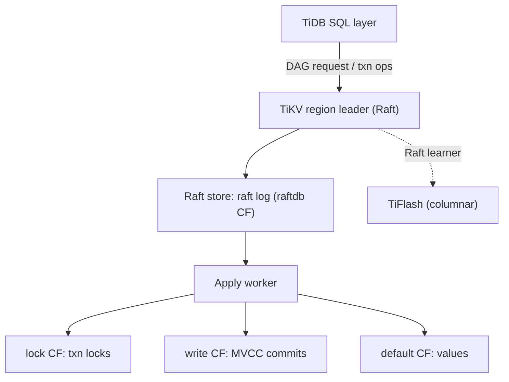
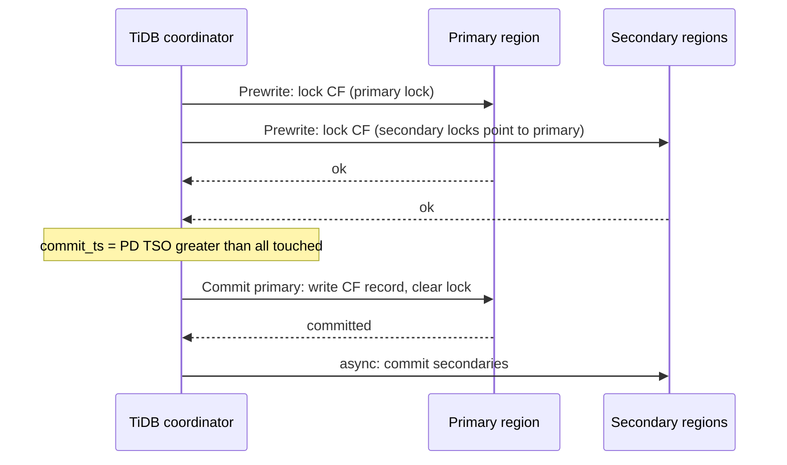

# TiDB Architecture: TiKV, Placement Driver, TiFlash, and the Percolator Legacy

## Overview

TiDB is PingCAP's open-source HTAP database: a stateless MySQL-compatible SQL layer (the TiDB server) over two storage engines — **TiKV**, a row-oriented distributed KV store of Multi-Raft regions, and **TiFlash**, columnar learner replicas of the same regions for analytics. A third component, the **Placement Driver (PD)**, allocates timestamps, owns placement metadata, and drives scheduling. This page covers the internals: Raft groups and region split/merge in TiKV, PD's TSO and scheduling loops, the dist-sql/coprocessor pushdown pipeline, TiFlash's learner role and MPP execution, and the percolator-style 2PC transaction model plus its large-transaction fixes. The transaction protocol's ancestor is covered in [percolator](../fundamentals/percolator.md); the Multi-Raft substrate in [multi-raft](../consensus/multi-raft.md); the sibling architecture in [CockroachDB](./cockroachdb-architecture.md).

## TiKV: Regions, Raft Store, and RocksDB

TiKV partitions the keyspace into **regions** (default 96 MiB), each a Raft group with a leader and typically two followers, placed by PD for load balance. Writes from the TiDB layer reach the region leader, are proposed through Raft, and land on two RocksDB column families after commit:

The **raft log itself is stored in RocksDB** (the `raftdb`) before the apply worker writes committed data to the `kvdb`'s three column families: `lock` (active transaction locks), `write` (MVCC commit records), and `default` (values, written only for large values). This percolator-shaped layout is what the transaction model below consumes. Region metadata (start/end keys, epoch, replica set) lives in PD as the source of truth for scheduling, with the epoch counter detecting stale routing. Split and merge follow the Multi-Raft discipline: a split is decided by the leader (or PD), committed through the raft log, and creates two regions with contiguous metadata so that a crash mid-split replays safely; merges are two-phase and guarded by PD to avoid scheduling conflicts. Heartbeats are coalesced per store as in all Multi-Raft systems — the heartbeat-storm analysis in [multi-raft](../consensus/multi-raft.md) applies verbatim.

Follower reads and **replica reads** let non-leader replicas serve reads at their safe timestamp (all raft entries up to it applied), trading freshness for latency in geo-distributed deployments — the same safe-time construction as Spanner follower reads.

## Placement Driver: TSO, Placement, and Scheduling

PD is a small cluster (usually 3 nodes) built **on embedded etcd**: its own high-availability comes from Raft on etcd's library, and the PD leader does the work. Three jobs matter for interviews:

- **Timestamp Oracle (TSO)**: PD allocates transaction timestamps as monotonically increasing 64-bit values (physical ms + logical counter). Allocation is *batched*: the leader pre-allocates a window of timestamps (persisting the window's high-water mark), so each client TSO request is answered from memory — batching is what keeps a centralized oracle from capping cluster write throughput. The trade is the same one every oracle makes: durability of the window boundary vs latency; a PD leader failover loses only the unallocated tail of the current window.
- **Placement metadata**: PD is the source of truth for which stores hold which region replicas ("region heartbeats" from TiKV keep it fresh) and for placement rules (zone-aware replica placement, hot-region avoidance, learner placement for TiFlash).
- **Scheduling**: PD's scheduler loop continuously moves leaders and replicas to balance load, disk usage, and hotspots — using **transfer leader** (cheap, no data movement), replica moves (add learner → catch up → promote, the learner/joint-consensus discipline), and split/merge proposals. Its decisions are quota'd so a rebalance storm cannot starve foreground traffic.

The centralized-oracle design is TiDB's clearest contrast with CockroachDB (HLC everywhere, no central point) and Spanner (TrueTime hardware): TiDB buys simplicity — a single comparable timestamp, no uncertainty restarts, SI with linearizable-ish behavior under the oracle — and pays with PD's availability being on the critical path for every transaction start (mitigated by etcd-based failover and TSO batching).

## The TiDB SQL Layer: Dist-SQL and Pushdown

TiDB servers are stateless compute nodes: parse, optimize (a cost-based optimizer with cascades-style planning), then execute as a **dist-sql** plan. The unit of distribution is the **coprocessor request**: for each table/index range touched, the TiDB layer sends a **DAG request** describing the sub-plan (TableScan or IndexScan → Selection → Aggregation → TopN/Limit) to the region's leader, which evaluates it locally in the **coprocessor** and returns a partial result. The TiDB layer stitches partials (final aggregation, joins that could not be pushed down, sorts). This is pushdown in the same shape as CockroachDB's DistSQL and Spanner's distributed query execution: move the scan and its filters/aggregation to where the data lives, ship only reduced rows.

Pushdown coverage is the performance conversation: index-scans with filters, projections, simple aggregations, top-N, and limits push down; complex joins, window functions, and UDFs historically execute at the TiDB layer (with the corresponding network cost of shipping rows). The optimizer's cost model decides between index scan + lookup join vs table scan + hash join, and — for HTAP — between TiKV row execution and TiFlash columnar execution.

## TiFlash: Columnar Learners and MPP

**TiFlash** nodes hold columnar replicas of selected tables as **Raft learners** of the same regions TiKV serves: they receive the raft log, apply asynchronously, and never vote — so OLTP correctness and quorum behavior are untouched, while analytics get a snapshot of each region at a consistent point (the learner's applied index). TiFlash's engine is a **DeltaTree**: a columnar main store plus an in-memory delta layer absorbing recent raft-applied writes, merged periodically — the LSM-shaped answer to "columnar store fed by a row log." Because the replica is a learner, TiFlash can be added/removed per table without region re-election, and its staleness is bounded by raft apply lag (configurably, analytics can cap allowed staleness).

**MPP execution** (TiDB 5.0+) turns dist-sql from "ship partials upward" into a true distributed engine: the optimizer can plan **exchange operators** (shuffle by key, broadcast) among TiFlash nodes, running hash joins and aggregations in parallel across the columnar replicas rather than pulling everything to the TiDB layer. The HTAP routing decision is per-query: the optimizer prices a plan using TiKV row stores vs TiFlash column stores (vs a mix, e.g., TiFlash scan + TiDB-layer join), with isolation coming from the physical separation — heavy scans hit TiFlash CPU/memory and leave TiKV's leader latency alone. This is the interview soundbite: *same raft log, two engines, learner replication for freshness without consensus impact*.

## Transactions: Percolator 2PC and the Large-Transaction Fixes

TiDB's default transaction model descends directly from Percolator: a client's transaction buffers writes, gets a start timestamp `start_ts` from PD, then commits in two phases:

Readers hitting a lock consult the primary: if the primary is committed, the transaction is committed (roll-forward); if expired/rolled back, cleanup proceeds. The classic Percolator problems — cleanup latency after coordinator death, multiple round trips, secondary-write visibility windows — motivated TiDB's fixes:

- **Pessimistic mode** (default since 3.0): locks are acquired during execution (InnoDB-style) instead of at prewrite, converting write-conflict abort storms into lock waits — the right default for contended OLTP.
- **Async commit** (5.0): with a computed `min_commit_ts` satisfying the snapshot/linearizability constraints, the transaction commits when the prewrite quorum lands — no separate commit phase, coordinator death is recoverable from lock records.
- **1PC**: single-region transactions commit the writes and the commit marker in one raft write.
- **Large transactions**: the buffered-transaction size limit (`txn-total-size-limit`, default 100 MB, tunable up to 10 GB) historically constrained analytics-style bulk writes; raft-entry caching and memory management changes raised the practical ceiling, and bulk paths are encouraged to go through staged loaders.

The comparison table with its siblings belongs here because it is the most-asked interview question about TiDB:

| Aspect | TiDB | CockroachDB | Spanner |
|---|---|---|---|
| Timestamp source | PD TSO (central, batched) | HLC per node (decentralized) | TrueTime (GPS/atomic) |
| Commit protocol | Percolator 2PC; async commit/1PC | Parallel commits (1 round) | 2PC + commit-wait |
| Isolation default | SI (snapshot); RR/RC options | Serializable (SSI) | External consistency |
| Failure of oracle/orchestrator | PD failover (etcd) | none (decentralized) | none (time-based) |
| Analytics story | TiFlash learners + MPP | vectorized DistSQL | SQL engine (2017) |

## Interview Questions

1. **Why does TiDB centralize timestamp allocation in PD when CockroachDB proved HLC works?** A single TSO makes the rest of the system simpler and faster to reason about: one comparable timestamp per transaction, no uncertainty-interval restarts, straightforward snapshot semantics — and batching TSO allocation (a pre-allocated window per interval) keeps the oracle off the per-query critical path. The costs are real: PD is on the critical path for transaction starts (mitigated by etcd-based failover and batching) and cannot run without it, whereas HLC systems keep working degraded under PD-like outages. It is a simplicity-vs-decentralization trade, not a correctness one.
2. **Walk through a TiDB read of one row, naming each layer.** The TiDB server parses/plans, the dist-sql layer sends a DAG request for the key range to the owning region's leader; TiKV's coprocessor does an MVCC read — consult `write` CF for the newest commit ≤ snapshot ts, check the `lock` CF for a conflicting active transaction (resolving via the primary record if blocked) — and returns the value from `default` CF. If the optimizer chose TiFlash, the same DAG request goes to the columnar learner, which serves from its DeltaTree at its applied (safe) timestamp. One row, one raft-free read path — reads never touch consensus unless the region is unavailable.
3. **What breaks if a TiFlash learner falls far behind, and who is affected?** Only analytics freshness: TiFlash applies raft asynchronously and serves at its applied index, so a lagging learner serves older snapshots (configurable staleness caps reject too-old queries). OLTP is unaffected — learners do not vote, do not hold locks, and cannot slow TiKV quorums beyond normal replication traffic. That isolation is the entire design argument for the learner role over, say, making TiFlash a voter.
4. **Explain how async commit removes a phase without losing safety.** Classic percolator commit is prewrite-then-commit because a transaction's commit point must be a single durable record. Async commit instead computes a `min_commit_ts` at prewrite time (greater than all participants' observed timestamps, satisfying snapshot consistency), writes locks carrying it, and treats the durable prewrite quorum as the commit point; recovery and readers derive commit status from lock records and `min_commit_ts`. Safety comes from the timestamp rule — the same "max over touched data" discipline parallel commits use — not from extra messages.
5. **How does TiDB's placement metadata differ from CockroachDB's, and when does the difference matter?** TiKV's region metadata is authoritative in PD (regions heartbeat up; PD pushes placement decisions), while CockroachDB's range descriptors live in Meta ranges readable by any node with client-side caching. The difference matters operationally: TiDB's scheduler is centralized (one brain, easy policy: zones, hotspots, TiFlash learners) at the cost of PD being a coordination bottleneck; CRDB's is decentralized (every node plans from cached descriptors) at the cost of more complex distributed scheduling. Both converge on the same learner/joint-consensus replica-move mechanics.
6. **Why is pessimistic transaction mode the default, and what did optimistic mode cost in practice?** Optimistic percolator-style prewrite detects conflicts only at commit, so contended workloads produced massive abort/retry storms at the worst possible time (after all work was done). Pessimistic mode acquires locks during statement execution, converting conflicts into bounded waits — matching OLTP expectations from InnoDB-style databases. Optimistic remains available and is genuinely better for low-contention bulk work (no lock churn); the default flipped because real OLTP fleets are contention-heavy.

## Key Takeaways

- Three planes: TiDB servers (stateless SQL), TiKV (Multi-Raft regions over RocksDB lock/write/default CFs), PD (TSO + placement + scheduling on embedded etcd).
- Regions split/merge through raft-committed metadata with epoch-guarded routing; heartbeats coalesce; follower reads serve at safe time.
- Dist-sql is coprocessor pushdown: DAG sub-plans (scan/filter/aggregate/topN) run on region leaders; only reduced rows ship upward.
- TiFlash = Raft learners + DeltaTree columnar engine; same log, second engine, zero consensus impact, MPP exchanges for distributed joins/aggregations.
- Transactions are percolator 2PC (primary lock + secondaries), with pessimistic locking by default, async commit, and 1PC as the latency/recovery fixes; size limits bound buffered transactions.
- The TSO-vs-HLC-vs-TrueTime choice is the single clearest way to contrast TiDB, CockroachDB, and Spanner in an interview.

## References

- [TiDB documentation](https://docs.pingcap.com/tidb/stable) — architecture, transaction model, TiFlash, and tuning guides
- [TiKV repository](https://github.com/tikv/tikv) and [TiDB repository](https://github.com/pingcap/tidb) — raft store, coprocessor, and planner sources
- Huang et al., "TiDB: A Raft-based HTAP Database" (VLDB 2020) — cited by title; no stable public PDF linked here
- [PD (Placement Driver) repository](https://github.com/tikv/pd) — TSO batching and scheduler implementation
- Ongaro & Ousterhout, [In Search of an Understandable Consensus Algorithm](https://raft.github.io/raft.pdf) (USENIX ATC 2014) — the Raft substrate, snapshots, and leadership transfer
- Peng & Dabek, ["Large-scale Incremental Processing Using Distributed Transactions and Notifications"](https://www.usenix.org/legacy/event/osdi10/tech/full_papers/Peng.pdf) (OSDI 2010) — the percolator protocol TiDB inherits

## Cross-References

- [Percolator](../fundamentals/percolator.md) — the two-phase primary/secondary lock protocol TiDB's transactions descend from.
- [Multi-Raft](../consensus/multi-raft.md) — regions, heartbeat coalescing, split/merge, and leader transfer mechanics.
- [CockroachDB architecture](./cockroachdb-architecture.md) — the decentralized-HLC sibling; compare TSO vs HLC and parallel vs percolator commits.
- [Consensus (advanced)](../advanced/consensus-advanced.md) — Raft production details (batching, pipelining, ReadIndex) TiKV implements.
- [LSM-tree deep dive](../../storage/advanced/lsm-tree-deep.md) — the RocksDB write amplification behavior under TiKV's raft log + data CFs.
- [Raft membership changes](../consensus/raft-membership-changes.md) — learner replicas and joint consensus used for replica moves and TiFlash.
- [Spanner internals](./spanner-internals.md) — the TrueTime alternative to the TSO design.
