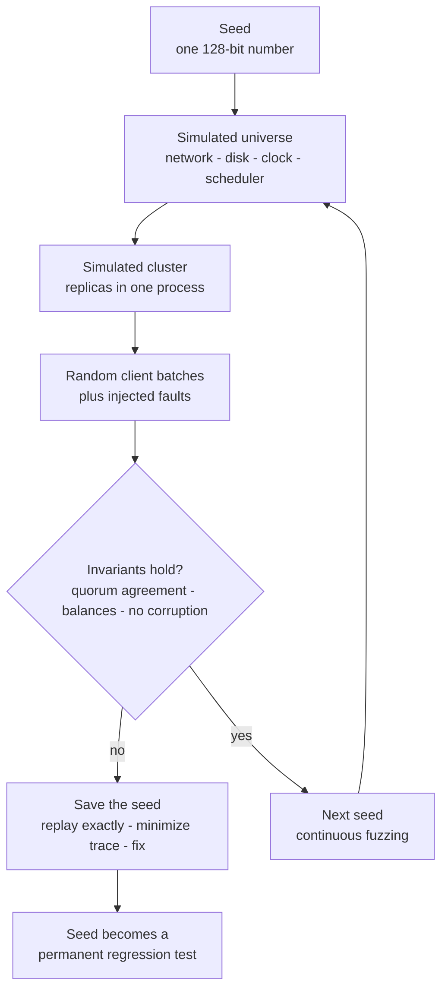
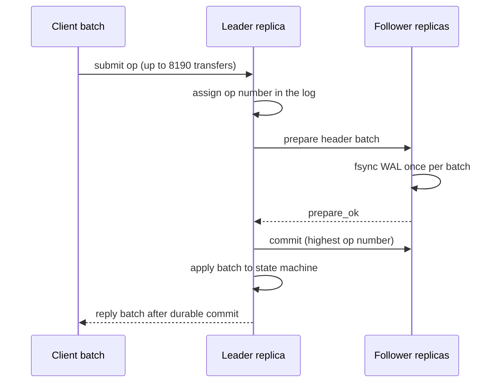
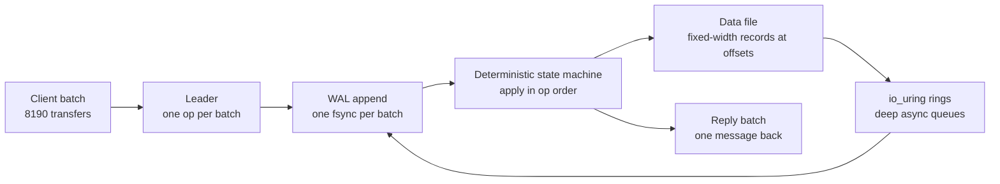

# TigerBeetle: Deterministic Financial Ledger

## Overview

TigerBeetle is an open-source database built for exactly one job — financial accounting — and its design reads like a checklist of contrarian choices: deterministic simulation *before* production code, Viewstamped Replication instead of Raft, 128-bit integers instead of floats, io_uring batched I/O instead of per-request syscalls, and a bespoke fixed-width storage engine instead of an LSM tree. Each choice follows from one observation: **the disk, not the CPU, is the bottleneck, and correctness of money is non-negotiable**. This page explains the design and its reasoning at interview depth; the testing philosophy it was built around is developed in [Deterministic Simulation Testing](../testing/deterministic-simulation.md) and [Jepsen, Maelstrom & Distributed Systems Testing](../testing/jepsen-maelstrom.md). Official sources: [tigerbeetle.com](https://tigerbeetle.com/) and [github.com/tigerbeetle/tigerbeetle](https://github.com/tigerbeetle/tigerbeetle).

## Why a Purpose-Built Financial Ledger

A financial ledger records *accounting events*: transfers of value between accounts, where every transfer debits one account and credits another (double-entry bookkeeping). Attempting this on a general-purpose OLTP database creates four mismatches:

- **Contention shape.** Real ledgers have extreme hotspots — a payroll run touches the same treasury account from thousands of concurrent workers, so row-level locking (or optimistic retry storms) dominates. A ledger wants batches of transfers checked and applied as one atomic, serially ordered unit.
- **Correctness forever.** Money has no "eventual consistency" story a CFO will accept. Every acknowledged transfer must survive any failure, every balance must be explainable from the event history (auditability), and rounding must be impossible, not merely rare. That is a *strict serializability* requirement plus integer arithmetic — not an incidental property of Postgres but a design axiom.
- **Schema is frozen by accounting law.** Accounts, balances, and transfers have fixed, universally understood fields. The flexibility a general SQL engine sells (variable-width rows, ad-hoc indexes, plans) is dead weight; a ledger wants fixed-width records it can lay out with deterministic offsets.
- **Throughput at the tail.** Payment systems need predictable latency under batch loads, not best-case OLTP numbers. Nondeterministic engine behavior (compaction stalls, JIT warmup, plan flips) shows up as p99.9 transfer latency — the number risk systems care about.

This is why TigerBeetle exists alongside (not against) general distributed SQL engines: compare the design pressures with [CockroachDB](./cockroachdb-architecture.md) and [Spanner](./spanner-internals.md), which optimize for general transactions and geo-distribution, or [etcd](./etcd-internals.md), which optimizes for small strongly consistent metadata. A ledger needs one workload done perfectly: strictly serialized, batched, integer-exact transfer processing with an immutable audit trail.

Two scope notes before diving in. First, this page explains design *reasoning*, not benchmark numbers — claims about throughput move with hardware and versions, so learn the arguments, not the digits. Second, it assumes the consensus background of the book's consensus chapters; if quorum reasoning is new to you, read [Raft](../consensus/raft.md) or [Multi-Paxos](../consensus/multi-paxos.md) first, then return — TigerBeetle is a superb case study *because* it applies consensus machinery to a domain where the stakes are legible.

## Determinism First: the VOPR Workflow

TigerBeetle was developed *simulation-first*. The entire database — consensus, storage, message handling — runs inside a deterministic simulator where the network, disk, clock, and scheduler are modeled and driven from a seeded PRNG. The harness is the **VOPR** (the name riffs on Viewstamped Replication): it launches simulated clusters of replicas under random failure schedules — message delays, drops, partitions, torn writes, crash-restarts — while asserting invariants after every step. A failure is not a stack trace in the wild; it is a *seed*, and the seed replays exactly, forever, on any machine.

What this changes about development is profound and interview-worthy:

- **Bugs arrive reproducible.** The engineering loop is "run seeds → get seed → replay → fix," collapsing the hardest part of distributed debugging (reproduction) to zero.
- **Rare events become common.** Torn writes after power loss, duplicate prepare messages, view changes colliding with state repair — scenarios that might occur once a decade in production are Buggify-style toggles the simulator fires constantly. The team has publicized seeds that exposed consensus corner cases within minutes of simulation.
- **Determinism is enforced, not hoped for.** One thread per replica, no wall-clock reads in logic, no unseeded randomness, panics on nondeterministic APIs — because a single stray `time.now()` silently invalidates replay of everything above it.
- **The simulator is a spec oracle.** Since the same deterministic binary runs in simulation and production, what the VOPR proves about the code is evidence about the artifact that ships — the gap between test environment and production is only the fidelity of the disk/network models.

The costs are real: every dependency must be audited for hidden threads or nondeterministic syscalls, and simulated timing tells you nothing about performance (hence real-cluster benchmarks for throughput work). FoundationDB made the same bet a decade earlier; the pattern is documented in [Deterministic Simulation Testing](../testing/deterministic-simulation.md), and the verification ladder (simulation → TLA+ model checking of protocol specs → Jepsen-style black-box audits) connects to [TLA+](../../formal-methods/tla-plus.md) and [Distributed Verification](../../formal-methods/distributed-verification.md).

### Two Determinism Playbooks: Calvin and TigerBeetle

TigerBeetle is not the only system to make determinism a load-bearing wall, but it spends determinism differently than its closest cousin. **Calvin** (see [Calvin and Deterministic Transactions](./calvin-and-deterministic.md)) uses determinism as a *concurrency-control strategy*: a sequencer totally orders all transactions before any of them executes, so every replica computes identical results without a distributed commit protocol — determinism buys the elimination of two-phase commit. **TigerBeetle** keeps ordinary consensus (VSR orders operations) and spends determinism on *verification*: because one deterministic process simulates the whole cluster bit-exactly, every failure schedule is a replayable seed. What both share is the refusal to let ad-hoc nondeterminism (wall clocks, randomness, thread races) reach the core logic. The interview one-liner: determinism is a design axis, and you must choose what to buy with it — Calvin bought cheaper commits, TigerBeetle bought exhaustive testability, and both paid the same price of total control over the runtime.

### How the VOPR Hunts a Bug

Concretely, one VOPR run looks like this: it derives everything from the seed — cluster size, message delays, reorderings and drops, which replicas crash and when, which disk writes are torn or dropped — then drives client batches through the real TigerBeetle logic running on simulated storage and a simulated network. After *every* simulated event it asserts the invariant set: replicas agree on the log, committed operations never revert or fork, state-machine hashes match after a repair, WAL contents match what the message flow says should be there, and the ledger's own accounting invariants hold. A violation stops the run and emits the seed and step; replaying the seed reproduces the failure bit-exactly, so the debugging session starts with a perfect, rewindable recording instead of a heisenbug. Because the schedule space cannot be enumerated, the harness simply never stops — it burns seeds continuously in CI, which is how a code change that perturbs some corner of view-change behavior gets caught by an unrelated seed days later, not by a human clever enough to write that exact test.

## Consensus: Viewstamped Replication over Raft or Paxos

TigerBeetle replicates its state machine with **Viewstamped Replication Revisited (VSR)** — the 2012 redesign of Oki and Liskov's 1988 protocol — rather than Raft or Paxos. The protocols are quorum-equivalent (any two majorities intersect, so committed state survives leader loss), but they differ in engineering posture; the full mechanics are in [Viewstamped Replication](../replication/viewstamped-replication.md), with the alternatives in [Raft](../consensus/raft.md), [Multi-Paxos](../consensus/multi-paxos.md), and [Paxos](../consensus/paxos.md).

| Aspect | VSR (TigerBeetle's choice) | Raft | Multi-Paxos |
|---|---|---|---|
| View/term change | Integrated view-change protocol with explicit do-view-change recovery | Leader election with vote counting | Teacherless; safety rests on careful ballot numbers |
| Reconfiguration | Membership change built into the protocol from 1988 | Separate joint-consensus/single-server additions | Various bolt-on schemes |
| Recovery story | Explicit recovery sub-protocol for a replica rejoining after downtime | Log matching + installation | Under-specified in the classic paper |
| Spec clarity | One paper, one formal report | Very readable spec (why industry adopted it) | Notoriously hard to implement correctly |

Public statements from the TigerBeetle team emphasize VR's *integrated* treatment of leadership changes, reconfiguration, and recovery — precisely the edges that simulation loves to attack — and its decades-long track record in the literature. The interview-relevant point is not "VR is better" but that the choice was driven by what deterministic simulation could stress: a protocol whose corner cases have crisp, testable descriptions is worth more than a fashionable one.

**Cluster of six replicas.** The standard production deployment runs **6 replicas**. The quorum math: for \\( n = 6 \\) replicas, a majority is \\( \\lfloor n/2 \\rfloor + 1 = 4 \\). This tolerates \\( f = 2 \\) replica failures while committing (lose any 2 and 4 remain), and leaves headroom: with 6 nodes you can take one down for maintenance, suffer a second failure, and still hold majority — with a rebuild in progress. Fewer replicas shrink the failure budget to a single spare; more replicas raise commit latency (every commit waits on acknowledgments from a majority) without adding safety. Writes route through the leader per view; a partitioned minority side of the cluster simply becomes *unavailable*, never *wrong* — TigerBeetle sells strict serializability, so it picks consistency over availability under partition (a deliberate contrast with the totally-available designs explored in the Maelstrom transactions challenge, and the trade formalized in [CAP](../../distributed/fundamentals/cap.md)).

### Views, Recovery, and State Repair

The VSR machinery has three pieces worth naming in an interview:

- **View changes.** Every message carries a view number; a replica that stops hearing from the leader advances its view and runs the *do-view-change* exchange, where candidates advertise the highest op number they can prove and a majority installs the new primary. Quorum intersection guarantees the new leader inherits every committed operation — it may also inherit uncommitted stragglers, which it either re-proposes or drops *deterministically*, so no two replicas can disagree about which.
- **State machine repair.** A replica that was down or slow rejoins by catching up its WAL and state machine to the commit frontier, with state verified by hashing before it votes again. This is only cheap because the state machine is deterministic — "resend the exact ops in the exact order" is a valid recovery story, something a nondeterministic engine (caches, races, wall-clock decisions) cannot promise.
- **Deduplication inside the replicated state.** The per-client op-number table used for retry deduplication is part of the state machine itself, so it survives failover by construction. A client that retries an op against a brand-new leader gets the original reply from the recovered state — the exactly-once guarantee in the client section below is protocol-backed, not best-effort.

### An Operation's Life

Every step is batched — the client already aggregated transfers into one op, the leader appends headers as one WAL record, followers fsync once per batch rather than once per transfer, and replies go back as one message. Consensus and replication are overhead to be *amortized*, which is the next section's whole thesis.

## Money Is Not a Float: 128-bit Fixed-Width Amounts

TigerBeetle stores every amount and balance as a **128-bit integer** (in the smallest currency unit — cents, satoshis, or whatever precision the asset needs). Floating point is forbidden, and the reasons go deeper than the folklore "0.1 + 0.2 ≠ 0.3":

| Property | IEEE 754 float | 128-bit integer |
|---|---|---|
| Decimal fractions | Most (like 0.1) are not representable; every op can round | Exact by construction |
| Associativity | `(a + b) + c ≠ a + (b + c)` in general — sum depends on order | Always associative; totals order-independent |
| Auditability | Balance must be recomputed with the *same* operation order to match | History sums to the balance under any order |
| Range surprises | Silent overflow to infinity, absorption of small amounts near large ones | Enormous headroom; overflow is a defined integer event, checked |
| Comparability | Equality is approximate; `==` on computed values is a bug source | Exact equality and ordering |
| Simulation | Platform/precision variation can break determinism | Bit-exact everywhere, trivially deterministic |

The auditability argument is the one interviewers remember: a ledger's defining invariant is that account balances equal the sum of their transfer history. With floats, that identity depends on summation order and rounding mode — the books can fail to reconcile even when no money was lost, purely from arithmetic artifacts. With integers, the identity holds under any order, forever. A canonical illustration: record a \\( 0.10 \\) fee and a \\( 0.20 \\) charge in doubles and the sum arrives as `0.30000000000000004`; do it across millions of events and balances drift from their history sums, forcing every downstream consumer into rounding rituals that become their own audit findings. In integer cents the same events are `10 + 20 = 30`, exactly, and 128 bits leaves headroom for any asset at any precision without overflow in any plausible economy. Fixed width also pays structurally: every account and transfer is the same byte size, so records live at *deterministic offsets* (which the simulator can model exactly), and there are no variable-width rows, no re-encoding, no parse step between disk and memory.

## Ledger Semantics: Accounts, Transfers, and Two-Phase Operations

The data model is small enough to sketch completely in an interview, and its constraints do the correctness work:

- **Account.** Identity, ledger and code (user-defined grouping), four balance fields — `debits_posted`, `credits_posted`, `debits_reserved`, `credits_reserved` — flags, and timestamps. Balances are stored *and* derivable from the transfer history, so the stored number can be audited against the events that produced it.
- **Transfer.** Debit account, credit account, a 128-bit `amount`, ledger/code/user-data fields, and flags: `pending` (two-phase), `post_pending_transfer` / `void_pending_transfer` (settle or release), `linked` (chain), and closing/importing variants. Transfers are immutable once created — corrections are new events, never edits, which is what makes the audit trail append-only.
- **Balance conditions.** Flags like `debits_must_not_exceed_credits` and `credits_must_not_exceed_debits` are enforced atomically at apply time, in the op's serial order: an overdrawing transfer is rejected with a precise per-transfer error code rather than allowed and reconciled later. Because every transfer in a batch applies at a single logical instant, there is no window in which a constraint is "temporarily" violated.
- **Two-phase transfers.** A `pending` transfer moves the amount into the *reserved* fields of both accounts — funds are earmarked without yet being posted. A later `post_pending_transfer` moves reservation into posted balances; `void_pending_transfer` releases it. This models authorizations, escrow, and holds (the bread and butter of payments) without application-level locks, and the reserved fields keep the "is this account over-extended?" question answerable mid-flight.
- **Linked transfers.** A chain of transfers flagged `linked` commits atomically as a unit: if any link fails its condition, the remainder fail with a chain error instead of half-applying. Batches, by contrast, keep per-transfer independence — each transfer in the 8,190 receives its own result code — so throughput batching and atomicity are orthogonal tools the application chooses between.

The design point to internalize: most of this is *not* database cleverness. It is accounting domain knowledge encoded as flags and checked serially by the engine — the same transfer logic every payments backend re-implements badly with `SELECT ... FOR UPDATE`, made structural instead.

A worked escrow flow shows why the primitives compose: create a `pending` transfer of 500 from buyer to seller — the buyer's `debits_reserved` and the seller's `credits_reserved` each rise by 500, and any `debits_must_not_exceed_credits` flag on the buyer is validated against posted-plus-reserved balances; goods ship; a second transfer flagged `post_pending_transfer` references the first and moves 500 from reserved to posted on both sides — or, on a refund, `void_pending_transfer` releases the reservation as if nothing happened. No application lock spans the shipping window, no scheduler can lose the earmarked funds, and the mid-flight "how much is committed to?" question is a field read, not a query over an outbox table. Payments teams will recognize this as the authorization/capture pair, finally expressed where it belongs.

## Strict Serializability and the Audit Trail

Strict serializability is the strongest single-system guarantee: operations commit in an order consistent with both their real-time ordering and a single serial order — the ledger behaves *as if* one thread processed all money movement. Two properties follow that matter to finance specifically:

- **Real-time order is business order.** If the wire transfer confirmed before the withdrawal was submitted, the ledger reflects that order — no timestamp arbitration, no "the events raced" excuse. Reconciliations against external systems (bank statements, card networks, blockchain confirmations) need exactly this: a total order that agrees with when things actually happened. [Spanner](./spanner-internals.md) pays for external consistency with TrueTime hardware; a ledger pays with a single ordered log, which is cheaper and sufficient.
- **One serial order is one truth.** There is no read-only anomaly class (no non-repeatable balance reads, no read skew between two accounts) because every operation — including queries — lands in the same serial order. Reporting jobs see a consistent snapshot at an op boundary, not a torn mid-transfer state.

The audit trail then falls out of the execution model rather than being bolted on: transfers are immutable events appended in op order; balances are derived state, reproducible by replay; corrections are new compensating events; and per-account history (opt-in via the `history` flag) preserves the event chain where auditors will ask for it. Contrast an OLTP database where the same guarantees require append-only table design, trigger-enforced immutability, careful isolation-level selection (serializable mode and its retry storms — compare the isolation ladder in [Consistency Models](../fundamentals/consistency.md)), and hope that no migration ever breaks the invariants. The design lesson generalizes: when a workload needs a guarantee *always*, encode it in the execution model, not in conventions the next developer can accidentally bypass.

## Storage Is the Bottleneck: io_uring and "Batch Everything"

TigerBeetle's performance thesis: in a transactional database, the leader's CPU work per transfer is small (a flag check, two integer additions), consensus messages are cheap, and **the slowest, least parallel resource is the disk**. Therefore the design goal is to maximize the *value extracted per I/O operation* — every syscall, every fsync, every message should carry as much work as possible. Concretely:

- **Client-side batching.** A client message carries up to **8,190 transfers** as one op. Applications amortize the round trip and the consensus cost across a batch; the network carries one message, not thousands.
- **Group commit.** The WAL appends a batch of operation headers and issues a **single fsync per batch**, then the whole batch is committed atomically. One fsync may cover dozens of ops from many clients — the classic group-commit amortization, taken to its logical extreme.
- **io_uring.** Each replica uses Linux io_uring for asynchronous disk I/O: submission and completion rings let the single-threaded replica hand the kernel deep queues of reads and writes without blocking syscalls. One core keeps a disk saturated — no thread-per-connection, no epoll fanfare, no lock contention, because there is nothing to contend with.
- **Sequential-friendly layout.** WAL writes and data-file writes are large, sequential, and predictable. Random small I/O — the enemy of both HDDs and SSD queues — is designed out rather than tuned around.

The arithmetic behind the thesis is worth doing once on a whiteboard. If one durable fsync costs \\( T_{\text{fsync}} \\) and a commit batch carries \\( B \\) transfers, the amortized persistence cost per transfer falls to \\( T_{\text{fsync}} / B \\) — so durability per batch and throughput per transfer stop fighting each other: pushing \\( B \\) toward the 8,190 cap divides the dominant cost by four orders of magnitude relative to fsync-per-transfer, without weakening a single durability guarantee. The same amortization applies to consensus (one prepare per op, not per transfer), to syscalls (one io_uring submission for a whole queue of I/O), and to network messages (one reply batch). Latency, by contrast, is dominated by the *slowest* step in the batch path — the group-commit fsync — which is why determinism of engine behavior (no compaction stalls, no plan flips) matters more than shaving microseconds off CPU work. This is the reasoning interviewers want when they ask "how would you make a database fast on NVMe?": not cache trivia, but identifying which cost is irreducible and dividing it across the maximum possible batch.

### Inside the Storage Layout

The publicly documented layout has few moving parts, and each serves determinism or write efficiency:

- **Superblock.** A fixed region identifying the replica, cluster, and the current WAL/data view — the first thing a restarting replica reads, updated by careful checkpointing.
- **Write-ahead log.** A WAL header plus segments of *prepare* messages carrying operation headers and payloads. The WAL is the commit boundary: once a batch's prepares are fsynced by a quorum, the ops are committed; followers that lag simply replay from the WAL.
- **Data file.** Sparse-preallocated so records land at deterministic offsets as the state machine applies them — placement is a function of the object identity and arrival order, not of a background reorganizer. An index region (open-addressed hash of 128-bit ids to offsets) lives alongside the data, and a linear scan over fixed-width records remains the audit-grade fallback.
- **No background rewriter.** No compaction, no page-split cascades, no deferred work queue. The disk does exactly the I/O the apply path asks for, when it asks — which is why simulated disks model it faithfully and why p99.9 looks like p50.

### Walking One Transfer Through Two Engines

Contrast the same business operation — "move 100 units from A to B, reject if A would go negative" — on a general SQL engine versus TigerBeetle. On Postgres: a transaction begins, two row locks are taken (watch the lock ordering, or enjoy deadlocks under contention on hot accounts), balances are read and checked, two updates plus one insert are logged, and COMMIT triggers an fsync — per transaction, with the round trips, plan execution, and index maintenance that implies. On TigerBeetle: the client packs the transfer into the next batch, the leader orders it as one op, replicas fsync once for the whole batch, and the state machine applies a flag check plus two integer additions at one logical instant, returning one result code. Same semantics, wildly different cost structure — and the difference compounds in exactly the places ledgers hurt: hot accounts (one serial applier instead of a lock queue), durability (one amortized fsync instead of one per transaction), and auditability (an immutable event plus derived balances instead of mutated rows plus triggers).

The single-threaded decision is inseparable from the batching thesis: a thread-per-core design would spend its complexity budget on latching and coordination; one thread with io_uring spends it on keeping the disk busy. The contrast with a thread-per-connection server is instructive: every blocking reader costs a stack, a scheduler hop, and a lock somewhere, so utilization degrades exactly when load spikes; io_uring moves submission and completion to shared kernel rings, so the replica files a deep queue of reads and writes in one syscall and reaps completions in bulk — syscalls and fsyncs are paid per *batch*, not per transfer. It also *enables* determinism — a single-threaded event loop has no preemptive interleavings to tame, which is precisely what the VOPR requires. Note how the three theses lock together: batching amortizes the disk, io_uring makes batching possible on one thread, and one thread makes determinism cheap. Remove any leg and the others wobble.

## The Storage Engine: LSM vs Fixed-Width Objects

General KV engines reach for LSM trees (write-optimized, compaction in the background) or B-trees (read-optimized, write amplification). TigerBeetle's team has publicly described building an earlier LSM-based prototype (referred to as ZataDB) and then replacing it with a bespoke engine after benchmarking the ledger's *actual* access pattern. The relevant question is always "what does this workload's I/O look like?":

| | LSM tree | B-tree | TigerBeetle fixed-width store |
|---|---|---|---|
| Write path | Memtable + WAL; cheap until flush | In-place update; write amplification on deep trees | Append batch at deterministic offset; one WAL fsync |
| Read path | May check many levels; read amplification | Few page reads; cache-friendly | Direct lookup by 128-bit id via in-file index; sequential scan as fallback |
| Background work | Compaction storms; latency spikes; tuning surface | Split/merge, page reuse | **None** — no compaction, no reorganization |
| Latency predictability | Poor at p99.9 (compaction) | Good | Excellent — the property simulation and finance both want |
| Fit for ledger objects | General-purpose; overhead for fixed records | General-purpose; updates mutate pages | Purpose-fit: immutable fixed-width events, audit-friendly append |

The ledger's access pattern is unusually friendly to a purpose-built engine: records are fixed-width and (transfers, once posted) immutable; lookups are point queries by 128-bit id; audit reads are ordered scans by account and timestamp. That combination lets the engine preallocate a sparse data file, place records at offsets computable from the object identity and a hash index stored alongside the data, and treat the whole store as WAL-plus-append — no page rewrites, no compaction, no read-modify-write cycles. It is also the quiet superpower of the simulation story: a storage model of "append at offset, read at offset, fsync" is trivial to fake exactly, whereas faithfully simulating an LSM's compaction scheduler (leveled? tiered? triggered by what signal?) would import the very nondeterminism the VOPR exists to eliminate. The engine's simplicity and the test harness's power are the same design decision viewed twice. The deeper lesson generalizes far beyond this database (compare the trade-offs in [LSM Trees](../../dbms/internals/lsm-trees.md) and [Compaction](../../dbms/internals/compaction.md)): **an LSM is a bet that writes outnumber reads and that background jitter is acceptable; a ledger's bets are the opposite** — writes arrive batched anyway, latency must be deterministic, and the "index" the workload needs is closer to an array offset than a search tree.

## Client-Side Safety: Single-Threaded Processing and Occupancy Accounting

TigerBeetle pushes part of its correctness story into the client library, which is unusual and interview-worthy:

- **Single-threaded query processing.** A client processes submissions, replies, and timeouts on one thread, in submission order. There is no client-side concurrency to reorder requests, so the pipeline is deterministic: retries, timeouts, and replies are sequenced identically regardless of machine speed. (The replicas themselves are single-threaded too — the determinism goes end to end.)
- **Sessions and deduplication.** Each client has a unique identity and numbers its ops per session; the cluster deduplicates by (client, op number). If a reply is lost to a partition or leader failover, the client retries safely — the same op is never applied twice, because the cluster remembers which ops it already processed and replies with the original result. This converts at-least-once message delivery into exactly-once effect, with no fencing tokens required from the application (the session mechanism plays the role that [Fencing Tokens](../fundamentals/fencing-tokens.md) play for lock services).
- **Occupancy accounting.** Both sides track how full their bounded pipelines are — the client's queue of in-flight ops and the cluster's WAL occupancy. Clients pace submissions against this occupancy (a credit-window discipline, the same idea as TCP flow control) instead of blasting unbounded concurrency at the cluster. Backpressure is explicit and measurable, which keeps a bursty producer from wedging the commit pipeline or exhausting disk.
- **Unknown outcomes handled honestly.** A timed-out op is exactly the ambiguous case Jepsen-style testing highlights (see [Jepsen](../testing/jepsen.md)): the client keeps polling for its reply rather than assuming failure, and dedup guarantees the outcome is resolved exactly once — never lost, never duplicated.

On top of this, the ledger model itself enforces financial correctness: transfers can be two-phase (pending amounts held as reserved balances, then posted or voided), account flags express constraints like "debits must not exceed credits" checked atomically at commit, and linked transfers chain multiple transfers into an all-or-nothing sequence. The engine applies batches in op order at a single logical point in time — that is the strict serializability, and it is what [Consistency Verification](./consistency-verification.md) style checkers audit in live histories.

## Design Choices at a Glance

| Decision | Mainstream default | TigerBeetle's choice | One-line justification |
|---|---|---|---|
| Testing | integration tests, staged rollout | VOPR deterministic simulation from day one | a bug is a seed; reproduction is free |
| Consensus | Raft | Viewstamped Replication Revisited | integrated view change, recovery, reconfiguration |
| Cluster shape | 3 or 5 nodes | 6 replicas (majority 4) | two-failure budget plus a maintenance spare |
| Money type | NUMERIC / floats | fixed 128-bit integers | exact, associative, auditable, deterministic |
| Execution | thread pools, per-request syscalls | single thread + io_uring + batches | amortize the disk; nothing to lock |
| Storage engine | LSM tree or B-tree | fixed-width objects at deterministic offsets | no compaction; deterministic latency |
| Client | connection pool, retry logic per app | single-threaded session with dedup and occupancy pacing | exactly-once effect end to end |
| Availability stance | available (maybe stale) under partition | unavailable, never wrong | strict serializability for money |

## Numbers Worth Memorizing

A compact recall table for interviews — each number is a design decision in disguise:

| Number | Meaning | Why it matters |
|---|---|---|
| 128 bits | width of every amount and balance | exact integer money at any asset precision; no rounding ever |
| 8,190 | transfers per client batch | the amortization unit for network, consensus, and fsync costs |
| 6 | replicas in the standard production cluster | two-failure tolerance with a maintenance spare |
| 4 | commit quorum for 6 replicas | minimum acknowledgments for a durable commit |
| 1 | thread per replica, thread per client | determinism, lock-freedom, and no coordination tax |
| 0 | floats, compactions, background rewriters | the "never" list the whole design enforces |

## The Failure Model, Stated Plainly

Collect the guarantees into one place, because interviewers probe for exactly this synthesis:

- **Crash-only processes.** Replicas treat every shutdown as a crash; recovery is always "replay WAL, repair state, rejoin." There is no graceful-shutdown code path to rot and no fast path that skips fsync.
- **fsync is the persistence boundary.** An operation is durable when a quorum of replicas has fsynced its prepare — never before. The VOPR's torn-write and power-failure injection exists precisely to test every state straddling that boundary.
- **Partition behavior.** The majority side keeps committing; the minority side rejects work rather than guessing. Clients on the minority see errors and timeouts — availability is sacrificed, correctness never is. This is the strict-serializability trade, and it is why a Jepsen-style partition test comes back clean by design rather than by luck.
- **Client-visible semantics.** Every op resolves to exactly one outcome — applied (with per-transfer results), rejected (with the failing condition), or unresolved-until-retried (deduplicated at the cluster). There is no fourth state where money moved without anyone knowing, which is the actual product a financial ledger sells.
- **Time does not order events.** No timestamp arbitration anywhere in the safety argument — wall clocks are metadata, never tie-breakers (contrast last-write-wins systems and the skew problems in [Clocks and Ordering](../../distributed/advanced/clocks-ordering.md)). Ordering comes solely from the replicated log.

Notice how much of this list is *negative* — what the system refuses to do (no stale reads, no timestamp tie-breaks, no background rewriters, no floats). Strong systems are defined less by features than by the set of things they have made impossible, and TigerBeetle's design reviews read like the slow, simulation-driven accumulation of that "never" list.

## Interview Questions

1. **Why does TigerBeetle exist instead of "just use Postgres with double-entry rows"?**
   Because the ledger workload stresses exactly the properties general engines treat as soft: strict serializability on hot accounts (contention), integer-exact arithmetic (auditability), deterministic latency (risk systems), and a frozen schema (fixed-width layout). A general engine makes each of these achievable-ish with locks, NUMERIC types, and tuning; a purpose-built engine makes them structural. The interesting answer contrasts design *pressures* rather than benchmark numbers, and concedes the flip side: TigerBeetle deliberately does not do ad-hoc queries or general transactions.

2. **Explain "deterministic simulation-first" development and the VOPR.**
   The whole cluster runs inside a simulator where network, disk, clock, and scheduler are driven from a seeded PRNG, with invariant assertions after every step. A bug is a seed that replays exactly forever — reproduction, the hardest part of distributed debugging, becomes free. Rare events (torn writes, duplicate prepares, view-change races) are made common by fault-injection toggles; the team runs seeds continuously, and every failing seed becomes a permanent regression test. The cost is that everything below the logic must be deterministic (single-threaded, seeded randomness, no wall clock), and simulated timing says nothing about performance.

3. **Why 6 replicas? Show the quorum math.**
   With \\( n = 6 \\), a majority is \\( \\lfloor n/2 \\rfloor + 1 = 4 \\): the cluster can lose 2 replicas and still commit, and a commit needs only 4 acknowledgments. Six gives one replica of headroom above the 5-node minimum for \\( f = 2 \\) crash tolerance, so you can repair or upgrade a node while still absorbing an unplanned failure. More replicas would raise commit latency (wait for a majority) without adding safety; fewer shrink the failure budget to one. The point to land: replica count is a latency/failure-budget trade, not a dogma.

4. **Why are floats forbidden for money? Give an argument beyond "0.1 + 0.2".**
   The killer property is associativity: floating-point addition is order-dependent, so a balance recomputed from its transfer history can disagree with the stored balance purely from summation order and rounding — the books fail to reconcile with no actual loss. Integers in the smallest unit are exact, associative, and comparable, making "balance = sum of history" an identity under any order, which is what auditability requires. Fixed 128-bit width additionally gives deterministic record layout (same size on disk, same offsets) and simulation-friendly bit-exactness across platforms.

5. **What does "storage is the bottleneck" imply about the architecture?**
   Optimize value per I/O operation, not CPU per request. Concretely: clients batch up to 8,190 transfers per message; the WAL commits a whole batch with a single fsync (group commit); io_uring gives the single-threaded replica deep async queues so one core saturates the disk; and layout favors large sequential writes. Every layer — client, consensus, storage — is co-designed around amortizing the disk. The single-threaded choice follows both from this (no latch complexity to spend) and from determinism (no preemptive interleavings for the simulator to tame).

6. **Why did TigerBeetle move away from an LSM-based storage engine?**
   Benchmarking the real access pattern showed the LSM's bets don't match a ledger's: writes arrive pre-batched (so memtable buffering buys little), lookups are point queries by 128-bit id on fixed immutable records, and p99.9 latency must be deterministic — which background compaction fundamentally isn't. The replacement is a fixed-width object store: sparse preallocated data file, deterministic offsets, an in-file index, WAL plus append, and no compaction at all. The general lesson: engine choice is a workload bet (write-optimized vs latency-deterministic), and teams should be willing to drop prestigious machinery when the workload contradicts its assumptions.

7. **How does the client library contribute to correctness?**
   Single-threaded processing makes the client pipeline deterministic and order-preserving; per-session op numbering plus cluster-side deduplication converts at-least-once delivery into exactly-once effect across timeouts and leader failovers; occupancy accounting paces in-flight ops against bounded pipeline capacity (TCP-style credit windows), applying explicit backpressure instead of overloading the cluster; and unknown outcomes are resolved by polling for the deduplicated reply rather than assuming failure. It moves the hard distributed-systems discipline (idempotency, backpressure, ambiguity resolution) into a reusable library so applications can't get it subtly wrong.

8. **What are TigerBeetle's honest limitations?**
   It is a specialized ledger: no general SQL, no ad-hoc secondary indexes, no multi-row arbitrary transactions beyond its transfer semantics — wrong tool for analytics or document workloads. Its performance claims rest on real-cluster benchmarks because deterministic simulation cannot model real timing. And its model fidelity assumption cuts both ways: the simulator proves correctness against its disk/network models, so hardware behavior outside those models still needs real-world fault injection — which is why the verification story ends with Jepsen-style black-box testing of the shipped artifact.
