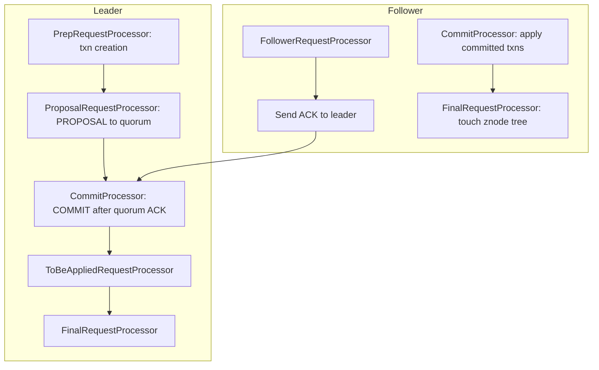

# ZooKeeper Internals: ZAB, the Read Path, Watches, and Sessions

## Overview

ZooKeeper is a Java coordination service whose value is a replicated, in-memory znode tree served by a quorum of servers. This page goes one level below the [architecture overview](../fundamentals/zookeeper.md): how ZAB's epochs and zxids differ structurally from Raft's terms and log indices, why reads are served from a possibly-stale local replica and why that is a deliberate trade, how one-shot watches are delivered through NIO threads, and how sessions own ephemeral nodes. It also contrasts ZooKeeper with Chubby and etcd where the internals diverge, because interview questions about ZooKeeper are almost always really questions about those trade-offs.

## The Server Pipeline

Each ZooKeeper server runs a pipeline of request processors whose shape differs by role:



Writes arrive at any server, are forwarded to the leader, become **transactions** (with headers carrying zxid and type), are proposed to followers, and are applied everywhere in zxid order. Reads never touch that pipeline's consensus half: they are answered by the local `FinalRequestProcessor` against the in-memory DataTree, which is why a 5-node cluster read throughput scales with nodes while write throughput is a leader property. The DataTree holds every znode's data, children list, stat (version numbers, czxid/mzxid, ephemeralOwner), and the watch manager; the disk artifacts — a transaction log plus periodic snapshots — exist only for recovery, so a ZooKeeper that fits its tree in memory (the 1 MB-per-znode design ceiling keeps trees small) is a fully warm cache by construction.

## ZAB vs Raft: Epochs, zxid, and the Recovery Phases

ZAB (ZooKeeper Atomic Broadcast) predates Raft and was published as its own protocol (Junqueira, Reed, Serafini — DSN 2011); the ZooKeeper docs describe it as a "crash-recovery atomic broadcast." Structurally it is close to Multi-Paxos/Raft with stable-leader broadcast, but three details are worth memorizing:

| Aspect | ZAB | Raft |
|---|---|---|
| Term/epoch number | 32-bit **epoch** (upper word of zxid) | 64-bit term |
| Per-entry ordering | 32-bit **counter** (lower word of zxid), shared across the epoch | per-log `index` |
| Identity of an entry | full zxid `(epoch, counter)` | `(term, index)` pair |
| Recovery framing | named phases: election → **discovery** → **synchronization** → broadcast | log matching via `prevLogIndex/prevLogTerm` |
| Commit message | explicit COMMIT per proposal | implicit (leader's `commitIndex` in heartbeat) |

A **zxid** is one 64-bit number split into `(epoch, counter)`. The epoch ensures that a zombie leader from an earlier epoch can never commit anything over a newer one: a follower ACKs only proposals whose epoch is not lower than its current epoch, so stale-epoch proposals fail the comparison even if their counter collides with an old log position. Raft gets the same safety with the `(term, index)` pair and `prevLogTerm` checks; ZAB packs both into a single comparable integer, which simplifies "is this proposal newer?" comparisons to one 64-bit compare.

Recovery is where the named phases earn their keep. After leader election (FastLeaderElection: highest proposed zxid in the most recent epoch wins), the **discovery** phase has the new leader learn the highest committed and proposed zxids from a quorum and pick a synchronization point; **synchronization** replays committed history to every follower and *discards* uncommitted tails (proposals the old leader never got quorum ACKs for — ZAB must truncate them because ZAB, unlike Raft's log-matching argument, does not assume conflicting tails are automatically overwritten by the new leader's entries). Only then does **broadcast** begin. The subtle difference from Raft: Raft's AppendEntries consistency check makes old-leader garbage impossible to survive into the new log; ZAB makes the equivalent guarantee with an explicit truncate step in synchronization. Both protocols therefore produce a single total order of committed transactions — which is the property ZooKeeper's linearizable writes actually rest on.

The broadcast loop itself is group-commit-consensus: leader appends PROPOSAL (with zxid) to its own txn log and sends it to followers; each follower fsyncs its txn log and ACKs; on quorum ACK the leader sends COMMIT, and followers apply and free the log for the next proposal. fsync-per-proposal on the quorum path is the write-latency floor, exactly as in etcd's WAL.

## The Read Path: Local Replicas and Why It Is Not Linearizable

Any follower answers reads from its local DataTree. A follower that is one proposal behind serves data one proposal old; a follower that has been partitioned from the leader for two seconds serves data two seconds old — and keeps serving it, because the client's session is with *that server*, not with the quorum. This is why ZooKeeper's consistency story is: **linearizable writes + sequential consistency overall** (with FIFO ordering per client), and why "ZooKeeper is strongly consistent" needs unpacking: writes are ordered globally; reads are *monotonic with respect to what that server has seen*, not with respect to the cluster's latest commit.

The design rationale in the Hunt et al. (ATC 2010) paper is workload-shaped: coordination metadata is read thousands of times more often than it is written (membership, config, assignment tables), so scaling reads linearly with replica count was worth more than read linearizability. When a client needs a current read, the `sync()` operation forces the server to flush its pipeline against the leader before answering — read-your-writes at the cost of one round trip. ZooKeeper also guarantees per-session ordering: a client sees its own writes (even those issued to one server) reflected in reads from another, via the session's last-zxid watermark pushed into each read (`chroot`-aware in the client library).

The comparison with etcd is direct: etcd charges one quorum RTT for every linearizable read (ReadIndex) and offers serial reads as the cheap option; ZooKeeper charges nothing for the default read and offers `sync()` as the strong option. Same two points on the line, opposite defaults — a one-sentence answer that shows you know both systems' read paths.

## Watches: One-Shot Triggers on NIO Threads

A ZooKeeper watch is a **one-shot callback registered server-side**: the server fires it exactly once when the watched node's data changes, children change, or the node is created/deleted, then the registration is gone. The client must re-register after each firing to keep watching. Three properties from the paper and client docs are the interview vocabulary:

- **Ordering guarantee**: the client receives the watch event *before* it can see the new data — watches fire ahead of the state change they announce, and watch events are ordered per-client relative to other events.
- **At-least-once, but not per-change**: with one-shot semantics and re-registration latency, a client that re-arms slowly can miss intermediate states (it will get one event for the latest state, not one per change). Sequence-dependent logic must re-read data on every event rather than counting events.
- **Client-side delivery**: watches are delivered to the client's **EventThread** while connection I/O runs on the **SendThread** (the two NIO threads inside `ClientCnxn`). A blocked user callback does not stall the connection, but a slow EventThread queue does delay application reaction — the classic "my watcher fired late" bug.

On the server, watch registrations live in a `WatchManager` keyed by path (and per-connection), so a change to a hot path fans out to thousands of registered watchers in one pass — the thundering-herd scenario when a leader znode is deleted and every candidate's watch fires simultaneously. Since 3.6 the server supports **persistent and recursive watches** (`addWatch`), which survive their own firing and eliminate the re-arm race for cache-style consumers; Curator's `NodeCache`/`PathChildrenCache` (and their successors) built the same pattern client-side for years. For change-heavy metadata, this is the concrete reason etcd's revision-stream watches are architecturally nicer: ZooKeeper watches are level-triggered hints, etcd watches are a log subscription.

## Sessions and Ephemeral Nodes

A **session** is the client's authenticated, timeout-negotiated lease on the cluster: the client sends a proposed `sessionTimeout`, and the server clamps it into `[2×tickTime, 20×tickTime]` (defaults; configurable via `minSessionTimeout`/`maxSessionTimeout`). Sessions are tracked on the *leader* in a session tracker with expiry buckets rounded to tick boundaries; the leader's expiry triggers deletion of the session's **ephemeral znodes**, and the follower servers learn this through the same proposal pipeline (ephemeral deletion is a transaction like any other — which is why it must go through the leader). Clients keep the session alive by sending pings/requests; on connection loss the client library enters retry logic with exponential backoff and keeps the same session until the timeout lapses.

The distinction that matters operationally is **connection lost vs session expired**:

```text
connection lost      → session alive, ephemerals intact, watches still registered
                       (client will re-attach to any server and resume)
session expired      → ephemerals deleted, watches gone, sessionId invalid
                       (client must create a new session; old locks are lost)
```

Ephemeral+sequential znodes are the raw material of the lock and leader-election recipes: candidates create `EPHEMERAL_SEQUENTIAL` nodes, watch only their immediate predecessor (avoiding the herd), and act when they become lowest. Every recipe built this way inherits the session's failure semantics: a GC pause longer than the session timeout makes the cluster delete your ephemeral node, your "lock" evaporates while your process keeps running, and the fix is fencing tokens or a lock-holder re-validation protocol — the exact scenario in the [fencing tokens](../fundamentals/fencing-tokens.md) and [distributed locks](../fundamentals/distributed-locks.md) pages.

## Why Heavy Writes Hurt

Every write crosses one leader and one quorum fsync, and application is single-threaded in zxid order on every server. Three structural ceilings follow:

- **The leader's commit pipeline is serial.** Proposal → fsync → ACK → COMMIT leaves little parallel slack; large znodes inflate each step. Clusters with write-heavy abuse (using ZooKeeper as a queue or a metrics store) saturate around tens of thousands of writes/sec regardless of node count, while read throughput keeps scaling with followers.
- **The tree is in memory with a bounded znode size.** The default 1 MB znode limit (`jute.maxbuffer`) is not a tuning knob; it reflects the design assumption that the whole tree fits in RAM. Large znodes also inflate snapshot transfer during synchronization, extending failover.
- **Every ephemeral churn is a write.** Membership systems that create/delete an ephemeral znode per instance per second turn service churn into consensus load — this is the concrete reason Kafka replaced ZooKeeper with KRaft (a self-hosted Raft metadata quorum) and why Consul keeps per-service health checks *out* of consensus (see [Chubby & Consul](./chubby-and-consul.md)).

Tuning that actually helps: reduce fsync pressure with group-commit-friendly hardware, use **observers** for read-heavy fan-out (observers receive commits but do not vote), keep sessions long enough to survive deploys (the default-derived range helps), and — the real fix — treat ZooKeeper as metadata, not data. The ZooKeeper project's own docs are blunt that it is a coordination service, not a general store.

## Chubby Comparison: Sessions vs Leases, Files vs znodes

Chubby (Burrows, OSDI 2006) is ZooKeeper's closest architectural ancestor, and the comparison table is a reliable interview prompt:

| Aspect | Chubby | ZooKeeper |
|---|---|---|
| Consensus | Paxos among 5 replicas (cell), master lease | ZAB among 3–7 (leader/followers) |
| Namespace | files & directories, byte contents | znode tree, byte contents |
| Session model | session leases (~45 s default) renewed by keepalive RPCs | sessions bounded by tickTime negotiation |
| Liveness of locks | lock loses validity when lease lapses | ephemeral node deleted when session expires |
| Read model | cached reads with **cache invalidation callbacks** (lease-based) | local reads, no cache coherence (client must re-read) |
| Sequencing | **sequencers**: lock-issue tokens apps present on every access | zxid/stat versions clients check via API |
| Notification | events (one-shot, server-pushed) | watches (one-shot, server-pushed) |

Two Chubby ideas ZooKeeper never adopted are worth naming. First, Chubby's **cache callbacks**: the master tracks which clients cache which file contents and invalidates them under a *cache lease*, so Chubby reads can be served from client caches while staying coherent — an answer to read scalability that preserves strong reads, at the cost of invalidation machinery. Second, **sequencers**: Chubby hands lock holders a signed token `(name, seq, mode)` and other replicas of the resource can validate it, which is the paper's own mitigation for exactly the GC-pause lock loss that ZooKeeper recipes inherit. The full details are in the [Chubby & Consul](./chubby-and-consul.md) page.

## Interview Questions

1. **Why does ZooKeeper serve reads from local replicas instead of going through the quorum, and what do clients give up?** Coordination metadata is read-bound (membership, config, assignment), and serving from the local DataTree makes read throughput scale with the number of servers at sub-millisecond latency. The cost is linearizability: a lagging follower serves stale data, so ZooKeeper guarantees linearizable *writes* plus sequential consistency, with `sync()` available to force read-your-writes at one round trip. etcd makes the opposite default choice — compare the two read paths and you have the single most-asked ZooKeeper question answered.
2. **Explain the zxid and why the epoch/counter split matters.** A zxid packs a 32-bit epoch and a 32-bit counter into one 64-bit integer. The counter orders proposals within a leader's tenure; the epoch increments across leader elections, so a deposed (zombie) leader from an older epoch cannot have its proposals accepted — any follower compares zxids and rejects a lower epoch even if the counter looks plausible. It is the same stale-leader defense as Raft's `(term, index)`, just fused into a single comparable value, and the recovery phase "synchronization" truncates the uncommitted tail from the old epoch.
3. **What are the exact semantics of a ZooKeeper watch, and how do they differ from etcd watches?** A ZooKeeper watch fires exactly once per registration (one-shot), is delivered ordered before the client can observe the new data, and must be re-armed after firing — with re-arm latency able to skip intermediate changes. etcd watches are subscriptions to the MVCC revision history: they stream every event from a start revision, support bookmarks, and never skip until compaction. ZooKeeper = level-triggered hints on NIO event threads; etcd = a log subscription. Since 3.6, ZooKeeper's persistent/recursive watches narrow but do not close the gap.
4. **A service's lock is held by a process that is alive but paused for 90 seconds; the session timeout is 40 seconds. What happens, and what should the service do?** The leader expires the session at ~40 s, deletes the ephemeral lock znode, another candidate acquires the lock, and the paused process resumes believing it still holds it — split brain. The defenses are application-level: Chubby-style sequencers (present a token the resource validates), fencing tokens (monotonic generation numbers checked by the storage layer), or re-validation before every write. The failure is by design — sessions detect crashes, not pauses — so correctness must come from the fencing protocol, not the lock.
5. **Why did Kafka remove ZooKeeper (KRaft), and what internal properties made the split hard?** Kafka's controller had one-writer bottlenecks and ZooKeeper's write path (leader + quorum fsync + watch storms on membership churn) was the operational pain point at scale. KRaft moved metadata into a Kafka-internal Raft quorum with log-compacted metadata topics, removing a second system and its consistency boundary. Hard parts: migrating billions of ephemeral/session semantics, controller failover on a replicated log instead of znode races, and keeping per-broker state transitions ordered — a live demonstration that "coordination as metadata" is the right use of ZooKeeper and "coordination as a service for cluster control" can outgrow it.
6. **Where would you add observers, and what do they not protect you from?** Observers are non-voting replicas that receive committed transactions and serve local reads — ideal for read-heavy fans (regional read farms) without inflating quorum fsync cost. They do not increase write throughput (still leader-bound), do not improve fault tolerance (not in quorum), and their staleness bounds are the same as any follower's. They scale the *read* path only, which is consistent with ZooKeeper's whole read design.

## Key Takeaways

- ZAB = epochs + counters packed into zxid, with named recovery phases (discovery/synchronization) that truncate uncommitted tails; functionally Raft's cousin with a comparable one-integer ordering key.
- Writes are linearizable through the leader's propose→fsync→ACK→COMMIT loop; reads are local, stale-tolerant, and scale with nodes — sequential consistency by default, `sync()` for read-your-writes.
- Watches are one-shot server-side triggers ordered before the data change, delivered on client NIO EventThreads; re-arm races skip intermediate states; 3.6 persistent/recursive watches and Curator caches paper over the gap.
- Sessions are leader-tracked leases whose expiry deletes ephemerals; connection-lost ≠ session-expired, and the difference is the split-brain window for lock recipes.
- Write ceilings are structural: serial commit pipeline, in-memory tree, 1 MB znodes, fsync-per-proposal, ephemeral churn as consensus load — treat ZooKeeper as metadata, not data.
- Chubby's divergences (cache callbacks, sequencers, lease-renewal keepalives) are targeted answers to ZooKeeper's inherited weaknesses.

## References

- Hunt, Konar, Junqueira, Reed, ["ZooKeeper: Wait-free Coordination for Internet-scale Systems"](https://www.usenix.org/legacy/event/atc10/tech/full_papers/Hunt.pdf) (USENIX ATC 2010)
- Junqueira, Reed, Serafini, "Zab: High-performance broadcast for primary-backup systems" (DSN/FCTS 2011) — cited by title; no stable public PDF linked here
- [Apache ZooKeeper documentation](https://zookeeper.apache.org/doc/current/) — including [ZooKeeper Internals](https://zookeeper.apache.org/doc/current/zookeeperInternals.html) and [recipes](https://zookeeper.apache.org/doc/current/recipes.html)
- [Apache Curator](https://curator.apache.org/) — the client library whose caches implement watch re-arm patterns
- Burrows, "The Chubby lock service for loosely-coupled distributed systems" (OSDI 2006) — see the Chubby & Consul page for links
- [Kafka KRaft: ZooKeeper-free Kafka metadata quorum](https://kafka.apache.org/documentation/#kraft) — motivation for the removal of ZooKeeper from Kafka's control plane

## Cross-References

- [Apache ZooKeeper (overview)](../fundamentals/zookeeper.md) — znode model, node types, recipes, and production users.
- [ZAB protocol](../consensus/zab.md) — the broadcast/recovery protocol in consensus-protocol vocabulary.
- [etcd internals](./etcd-internals.md) — the Raft-based counterpart: ReadIndex reads, MVCC watch streams, leases.
- [Chubby & Consul](./chubby-and-consul.md) — the Chubby paper's leases/sequencers and Consul's health-check design.
- [Distributed locks](../fundamentals/distributed-locks.md) and [Fencing tokens](../fundamentals/fencing-tokens.md) — what session-expiry means for lock recipes.
- [Leases](../advanced/leases.md) — session timeouts as leases, and why GC pauses break them.
- [FoundationDB deep dive](../../dbms/advanced/foundationdb-deep-dive.md) — a different metadata-ordering design point (resolver) for comparison.
