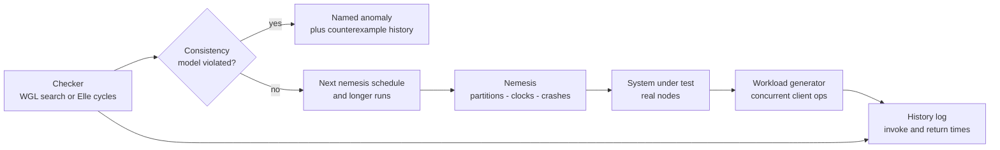
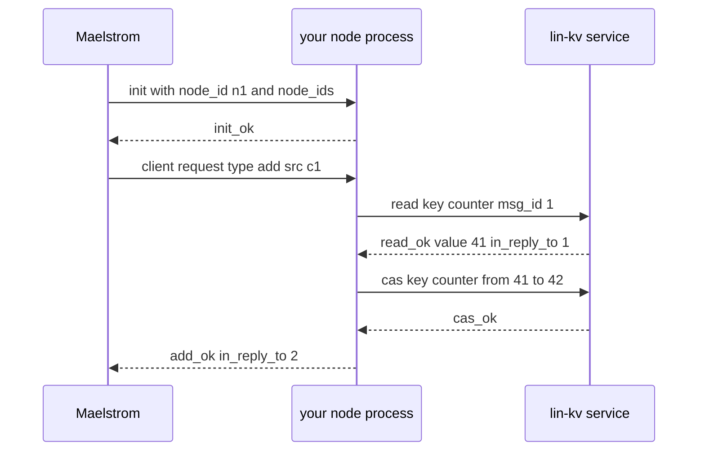
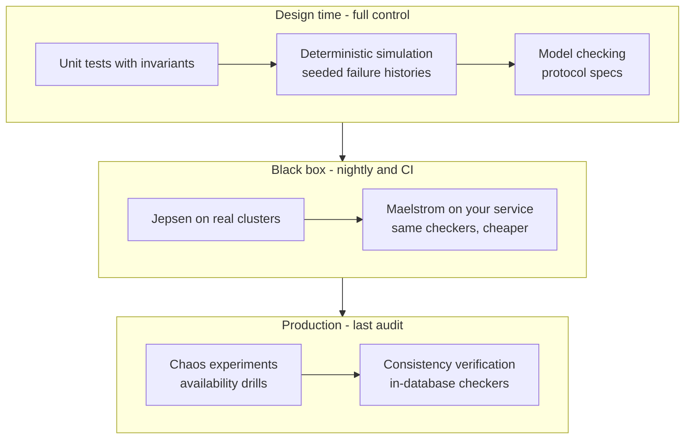

# Jepsen, Maelstrom & Distributed Systems Testing

## Overview

Jepsen — Kyle Kingsbury's analysis practice — turned "is this database actually consistent?" from a vibe into a method: run a *real* system, hurt it with a *nemesis*, record a *concurrent history*, and hand that history to a *checker* that decides against a formally stated consistency model. Maelstrom is the same machinery packaged for *your own* code: a single-machine harness that speaks JSON over stdio to student-built nodes, used by the fly.io **Gossip Glomers** challenge to teach distributed programming with real fault injection. This page covers the Jepsen test loop and nemesis catalog, how linearizability checking (the Wing & Gong / Lowe algorithm) actually works, Maelstrom hands-on, and where deterministic simulation and chaos engineering fit. The mechanics of a full Jepsen analysis are covered in [Jepsen](./jepsen.md); this page is the *toolbox view* — what to reach for when an interviewer asks "how would you test your distributed system?"

## What a Jepsen Test Is

A Jepsen test has four moving parts, and every part is a deliberate design choice:

1. **A real system under test.** The database or coordination service is installed on real nodes exactly as an operator would — packages, config files, no mocks. Findings apply to the artifact you would actually ship.
2. **A nemesis.** An adversary component that bends the environment while clients run: cuts the network, skews clocks, kills processes, degrades disks. The nemesis exists because distributed protocols make promises *about failures* — so the test must produce failures.
3. **A concurrent history.** Client threads execute generated operations (reads, writes, CAS, appends, transactions) through the system's real client library, and every invocation, response, timeout, and crash is timestamped. Operations with *unknown outcome* (the client gave up but the write may have committed) are recorded as crashed — they are the crux of distributed testing, not an annoyance.
4. **A checker.** A small specification engine that replays the history and asks: is there an execution permitted by the documented consistency model that explains these observations? It reports named anomalies — stale read, lost update, G2 anti-dependency cycle — not just "failed."



The methodological insight worth quoting in interviews: the checker knows nothing about replication, leaders, or quorums. It is a black-box predicate over histories, which is why Jepsen findings are hard to argue with — and why a Jepsen finding is always a *conjunction* of clauses: system X, version Y, configuration Z, workload W, nemesis set N ⇒ anomaly A. Dropping any clause can flip the result.

## The Nemesis Catalog

Nemeses are not random sabotage; each class targets a specific family of implementation shortcuts.

| Nemesis class | What it does | What it attacks | Bug class it exposes |
|---|---|---|---|
| Partition | Cuts the network (majority/minority halves, bridge node, ring topology) | Quorum assumptions, split-brain handling | Stale reads, two primaries, lost writes on heal |
| Clock skew | Steps clocks forward/back, skews NTP sources | Timestamp ordering, leases, TTLs | Reads appearing "in the future," expired leases held, bad conflict resolution |
| Crash | SIGKILL and restart, SIGSTOP and resume | Durability, recovery paths, fsync claims | Lost acknowledged writes, torn state, zombie leaders |
| Membership | Add/remove nodes, force leader transfers, reconfiguration | View-change and reconfiguration logic | Divergent logs, lost operations during membership churn |
| Disk | `fsfreeze`, full disks, I/O throttling | Persistence latency assumptions | Timeouts cascading into unavailability, fsync-order bugs |
| Application-level | Failovers, compactions, backups under load | Control-plane/data-plane interactions | Availability cliffs during maintenance |

Two classes deserve special mention. **Partitions** are the cheapest fault with the highest yield: an asynchronous network cannot distinguish a slow node from a dead one (see [FLP and system models](../fundamentals/system-models.md)), so a partition forces every timeout-based heuristic to run at once. **Clock skew** is where otherwise-correct designs quietly cheat: any safety argument that silently assumes "a timestamp reflects real time" dies here — a theme developed in [Time and Clocks](../fundamentals/time.md) and [Clocks and Ordering](../advanced/clocks-ordering.md). Membership churn interacts with everything else, which is why Raft's reconfiguration rules alone fill [a dedicated chapter](../consensus/raft-membership-changes.md).

## Linearizability Checking: the WGL Algorithm

The flagship checker question is: *is this history linearizable?* — does there exist an ordering of operations, each appearing to take effect atomically between its invocation and response, consistent with real time? Checking is NP-complete in general, but the practical algorithm (Wing & Gong, 1990, with Lowe's refinements — implemented in Jepsen's Knossos) is conceptually simple: a depth-first search over partial linearizations.

Conceptually:

```text
search(entry = (linearized prefix L, state s)):
    if all operations accounted for: return linearizable
    if cache contains (L, s) dominated by an earlier entry: prune
    for each invoked-but-not-returned op o that is legal to apply in state s:
        push entry (L + [o], apply(s, o))          # o takes effect now
    for a crashed op (invoke with no return):      # unknown outcome
        either it took effect somewhere earlier, or it never did —
        the search must explore both branches
```

The key ideas that make it tractable:

- **State, not syntax.** Two different prefixes of the history that leave the register (or KV store) in the same abstract state are equivalent — the search memoizes `(linearized prefix, state)` pairs and prunes dominated entries, keeping only entries whose *longest* linearized prefix is minimal for that state.
- **Subhistories, not permutations.** The search extends *linearized prefixes* of the given history rather than permuting the whole history, which cuts the space from factorial to "merely" exponential — still enough to make long histories expensive, so real checkers partition histories at points where the state returns to a known value.
- **Unknown outcomes are first-class.** A timed-out write can be placed at any point (or nowhere); if any placement explains the reads, the history is linearizable. This is exactly why protocols must resolve ambiguous writes safely.

For transactional workloads, checking linearizability of the whole database is hopeless; instead Elle-style checkers exploit workload structure — clients append unique elements to lists or use read-write registers — and look for *dependency cycles* between transactions (read-write and write-write anti-dependencies). A cycle of a particular shape *witnesses* a named isolation violation (G1, G2, lost update), turning isolation-level testing into graph finding. Both checking styles are covered hands-on in [Consistency Verification](../systems/consistency-verification.md), and the models being checked are defined in [Consistency Models](../fundamentals/consistency.md).

## What Jepsen Analyses Found — the General Lessons

A decade of published analyses found real data-integrity bugs in widely deployed systems. The specifics (versions, configs, workloads) live in the individual reports — see [Jepsen](./jepsen.md) for the anatomy of the famous ones — but the recurring patterns generalize:

- **Stale reads after failover.** Systems that promote a replica without a durability check (or rely on async replication) serve reads that never saw acknowledged writes. Redis's async-replication failover and Galera's stale reads are canonical examples of "the new leader is behind, and nobody noticed."
- **Lost acknowledged writes.** If an ack is sent before durability (to the wrong replica set, before fsync, before a quorum), a crash or partition can erase an operation the application was told succeeded. Every "highly available under partitions" claim must answer: *acknowledged on which side, surviving which failure?*
- **Cyclic information flow.** Two nodes each see only the other's "newer" data — a G1c-style anomaly that timestamp-based last-write-wins produces naturally under clock skew.
- **Guarantees that were configuration, not behavior.** The same binary passes or fails depending on `acks`, `min.insync.replicas`, read concern, or synchronous-standby settings. A safety claim without its configuration clause is marketing.

The meta-lesson: none of these required exotic hardware. Ordinary partitions, process kills, and restarts — the weather every production system eventually flies through — were enough.

## Maelstrom: Jepsen for Your Own Code

**Maelstrom** ([jepsen-io/maelstrom](https://github.com/jepsen-io/maelstrom)) is Jepsen's little sibling, built for learning distributed systems. Instead of installing Postgres on five machines, Maelstrom runs *your* servers as ordinary processes on one machine, connected by a simulated network it controls. It reuses the real Jepsen nemesis and checker stack, so the faults and the verdicts are the genuine article:

- **Protocol:** each node is a process you write in any language. It receives one JSON config line on stdin (`node_id`, `node_ids`, service), then exchanges newline-delimited JSON envelopes `{"src", "dest", "body"}` over stdin/stdout. Bodies carry a `type`, an incrementing `msg_id`, and `in_reply_to` for RPC-style correlation.
- **Provided services:** linearizable KV (`lin-kv`), sequentially consistent KV (`seq-kv`), LWW KV, a linearizable timestamp oracle (`lin-tso`), broadcast, and a Kafka-style log — so students can build systems *on top of* well-specified primitives, exactly as real designs do.
- **Workloads and checkers:** echo, unique-id, broadcast, counters, totally-available transactions, kafka log — each wired to the appropriate anomaly checker (linearizability, eventual counter convergence, transactional anti-dependency cycles).



### The Gossip Glomers Challenge

The [fly.io Distributed Systems Challenge](https://fly.io/dist-sys/) ("Gossip Glomers") is a sequence of six Maelstrom-based challenges written by Kyle Kingsbury. They are the best structured on-ramp from "I read about Raft" to "I have debugged a split brain":

| # | Challenge | What it teaches | The trap |
|---|---|---|---|
| 1 | **Echo** | The JSON-over-stdio protocol, request/response correlation, `msg_id`/`in_reply_to` | Getting the plumbing right; step zero |
| 2 | **Unique ID Generation** | Generating collision-free IDs across nodes without coordination | Naive timestamps + node ids fail Maelstrom's uniqueness checker; needs entropy or causal structure |
| 3 | **Broadcast** (3a–3d) | Single-node echo of messages, then gossip, then every-node delivery, then *efficient* broadcast | 3d bounds messages per delivery — eager gossip to all peers wastes messages; the intended shape is a spanning tree with periodic anti-entropy (a mini of [Gossip Protocols](../fundamentals/gossip-protocols.md)) |
| 4 | **Grow-Only Counter** | Crash-only nodes (no partitions), eventual convergence of increments | Operations must not be lost across crashes — you learn why retry-and-idempotency beats fire-and-forget |
| 5 | **Totally-Available Transactions** (5a–5c) | Read-uncommitted, read-committed, and (bonus) repeatable-read transactions that stay available on *both* sides of a partition | Sticky availability forces you to give up serializability — a living demonstration of CAP (see [CAP](../fundamentals/cap.md)); 5c is deliberately hard |
| 6 | **Kafka-Style Log** (6a–6c) | Append/read/poll semantics on a log, then replication, then *efficient* replication | Naive 6b broadcasts every message to every node; 6c requires routing writes through a designated coordinator (the provided `seq-kv`/`lin-kv` help) — the shape of real log replication (cf. [Kafka Log Internals](../messaging-internals/kafka-log-internals.md)) |

### Running Maelstrom Locally

Maelstrom ships as a tarball on its GitHub releases page (unpack, `./maelstrom`). Prerequisites: a JVM (it is built on the Jepsen Clojure library), Ruby for the bundled demo nodes, and Graphviz if you want the annotated history plots. Two representative invocations:

```bash
# Challenge 1: single node, 10 seconds, show stderr from your process
./maelstrom test -w echo --bin ./echo.py --node-count 1 --time-limit 10 --log-stderr

# Challenge 4: three crash-only nodes, 3 msgs/sec, with partition nemesis
./maelstrom test -w g-counter --bin ./counter.py --node-count 3 \
  --rate 3 --time-limit 20 --nemesis partition

# A transactional workload checked for anti-dependency cycles
./maelstrom test -w txn-list-append --bin ./txn.py --node-count 5 \
  --time-limit 30 --rate 20 --nemesis partition
```

A minimal echo node is twenty lines of Python — the whole point is that the *network and the fault model are handled for you*:

```python
#!/usr/bin/env python3
import json, sys

def main():
    node_id = ""
    next_id = 0
    for line in sys.stdin:
        msg = json.loads(line)
        body = msg["body"]
        if body["type"] == "init":
            node_id = body["node_id"]
            reply = {"type": "init_ok", "in_reply_to": body["msg_id"]}
        elif body["type"] == "echo":
            reply = {"type": "echo_ok", "echo": body["echo"],
                     "in_reply_to": body["msg_id"]}
        else:
            reply = {"type": "error", "code": 11, "text": "not supported",
                     "in_reply_to": body.get("msg_id", 0)}
        next_id += 1
        out = {"src": node_id, "dest": msg["src"],
               "body": dict(reply, msg_id=next_id)}
        print(json.dumps(out), flush=True)

if __name__ == "__main__":
    main()
```

What makes Maelstrom pedagogically potent is that the checker doesn't grade your *code*, it grades your *history*. You can believe your broadcast logic is correct; Maelstrom will wait for a partition to prove otherwise, then hand you the exact messages that were lost.

### Reading a Maelstrom Report

Each run produces a results directory: the full history (every invoke/return/timeout), the checker's verdict with any anomaly rendered as a browsable plot (Graphviz), and per-workload performance charts. Grading is boolean per property — `valid? true/false` per checker — but the artifacts around the verdict are where the learning happens. The failures that catch almost every first-timer:

- **Crash on the unexpected.** Your node panics on a message type you didn't handle (or on a resend of one you did). Nodes must answer *every* message — real error responses use the protocol's error code 11 ("not supported") — and every handler must be idempotent, because retries are the network's love language.
- **The flush bug.** JSON lines sit in your process's stdout buffer and never reach Maelstrom; the harness declares the node crashed. Every send ends with an explicit flush — the first of many "the simulator is honest, your runtime is not" moments.
- **Treating timeout as failure.** After a partition heals, Maelstrom *resends* ops your node already answered. Retrying must return the original result (deduplication), not re-execute — this is exactly the unknown-outcome discipline from Jepsen, enforced by the checker.
- **Winning by accident.** A gossip implementation that forwards everything to everyone passes correctness but fails the 3d message budget; a counter that stores everything in one node fails availability. The performance charts exist so "correct but wasteful" is a visible, graded outcome — which is precisely how real systems review works.

The graduation path is direct: the workload/checker idiom is identical to full Jepsen, so a team that runs Maelstrom in CI for its services (yes, it is used that way, not just for learning) can graduate to installing the real artifact on real clusters with the same nemesis schedules — the path Cockroach Labs, MongoDB, and ScyllaDB took with their in-house Jepsen suites.

## The Complementary Approach: Deterministic Simulation

Jepsen and Maelstrom test the real (or real-ish) network, which buys realism at the cost of nondeterminism: a bug that needs one unlucky interleaving may never reproduce, and a green run proves little. Deterministic simulation testing (DST) takes the opposite bet — simulate the network, disk, clock, and scheduler from a seeded PRNG so that *seed + code version = exact replay* — and it is the approach that produced FoundationDB's celebrated reliability and TigerBeetle's whole development workflow. The two methods are complements, not rivals:

| Dimension | Jepsen / Maelstrom | Deterministic simulation |
|---|---|---|
| Subject | real system, real network | system compiled against a simulated universe |
| Reproducibility | weak (schedules vary run to run) | exact (any failing seed replays forever) |
| Rare interleavings | hit by luck or long campaigns | forced common by Buggify-style toggles |
| Performance bugs | visible (real timing) | invisible (simulated timing lies) |
| Adoption cost | low (black box) | high (determinism must be designed in) |

TigerBeetle is the flagship DST story: its **VOPR** simulator launches whole seeded clusters with torn writes and crash-restarts, and the team treats failing seeds as unit tests (the full story is in [TigerBeetle: Deterministic Financial Ledger](../systems/tigerbeetle-internals.md) and [Deterministic Simulation Testing](./deterministic-simulation.md), which also covers FoundationDB's Buggify and Antithesis). The maturity ladder most serious systems climb: unit tests with invariants → deterministic simulation → model checking of the protocol core in TLA+ (see [TLA+](../../formal-methods/tla-plus.md) and [Model Checking](../../formal-methods/model-checking.md)) → black-box fault injection (Jepsen/Maelstrom) as the final audit of the real artifact. Why bother with all layers? Because asynchronous systems have schedules no one can enumerate (see [Impossibility Models](../advanced/impossibility-models.md)) — exhaustive confidence only comes from controlling the universe the system runs in.



## Where Chaos Engineering Fits

Chaos engineering and Jepsen-style testing are frequently conflated; they answer different questions with overlapping tools:

| | Chaos engineering | Jepsen / Maelstrom |
|---|---|---|
| Core question | Does the system *stay available and recover*? | Is the *data* consistent with the documented model? |
| Setting | production (or prod-like), steady traffic | lab cluster, adversarial workload |
| Primary signal | SLOs, error budgets, recovery time | checker verdicts, named anomalies |
| Typical practice | steady-state hypothesis, small blasts radius, game days | fixed nemesis schedule, exhaustive histories |
| Failure found | cascading overload, missing fallbacks, alerting gaps | stale reads, lost updates, split-brain |

A database can pass every chaos drill (nothing fell over) while serving stale reads the whole time; a Jepsen test can find a data-integrity bug that never manifests as downtime. Production resilience engineering — steady-state hypotheses, blast-radius control, automated rollback — is covered in [Chaos Engineering](../../sre/chaos-engineering.md) and [Chaos Testing](../../testing/chaos-testing.md); the discipline that closes the loop in production (checkers running *inside* the database on live histories) is [Consistency Verification](../systems/consistency-verification.md). In an interview, name both and say which question each answers — that distinction signals operational maturity.

## Interview Focus: "How Would You Test Your Distributed System?"

This question is a filter at infrastructure-heavy companies. A strong answer is *layered*, names real tools, and admits what each layer cannot see:

1. **Invariants everywhere.** Encode safety properties (no negative balances, no two lease holders, conservation of money) as assertions in unit and property tests — cheap, runs per commit.
2. **Deterministic simulation.** If you control the stack: simulate network/disk/clock from a seed so every failure history is reproducible; treat failing seeds as permanent regression tests. If you can't rewrite for determinism, say what you'd sandbox instead.
3. **Model-check the protocol kernel.** A TLA+ spec of the consensus/reconciliation logic catches corner cases (view change with a concurrently repairing replica) that even simulation reaches slowly.
4. **Black-box fault injection.** A Jepsen-style harness: real binary, partition/clock/crash nemeses, checkable workloads (CAS registers, list-append transactions), Elle/Knossos-style checkers. Maelstrom is the acceptable-budget version. This is where *unknown outcomes* and idempotency get tested.
5. **Production verification and chaos.** Consistency checkers on live traffic plus chaos drills for availability — with the explicit statement that the two disciplines check different properties.

Antipatterns that sink candidates: "we have integration tests"; "we tested it manually with a kill switch"; claiming one tool ("we run Chaos Monkey") covers correctness; or promising Jepsen-level guarantees from a single green run — passing is *not* proving, it is "not caught this time."

## References

- [Jepsen — analyses, consistency models, and the testing methodology](https://jepsen.io/)
- [jepsen-io/maelstrom — Jepsen for student systems, releases and docs](https://github.com/jepsen-io/maelstrom)
- [Fly.io Distributed Systems Challenge — the six Gossip Glomers challenges](https://fly.io/dist-sys/)

## Interview Questions

1. **What are the four components of a Jepsen test, and why does each exist?**
   A real system under test (so findings apply to the shipped artifact), a nemesis (because protocols make promises *about* failures, so failures must be produced), a concurrent history with timestamps including unknown-outcome operations (the raw material a checker judges — timeouts are the crux because the write may have committed), and a checker that replays the history against a stated consistency model and reports named anomalies. The discipline is the *stated model*: without one, no history can be called wrong.

2. **Explain how the Wing & Gong / Lowe linearizability checking algorithm works. Why is it exponential, and what makes it practical?**
   It is a depth-first search over partial linearizations: each search state is a (linearized prefix, abstract state) pair; at each step it tries every pending operation that could legally take effect next, and crashed operations are explored both as "took effect somewhere" and "never happened." The space is exponential because a history of n concurrent operations has exponentially many legal linearizations. Practicality comes from memoization — caching (prefix, state) pairs and pruning entries dominated by others with the same abstract state but a longer linearized prefix — plus partitioning long histories at repeated states. Elle complements it for transactions by finding dependency cycles that witness specific isolation anomalies.

3. **How does Maelstrom differ from full Jepsen, and what do you gain or lose?**
   Maelstrom runs your servers as processes on one machine, connected by a simulated network speaking JSON over stdio; full Jepsen installs a real system on real nodes over SSH. You gain a 15-minute setup, any-language participation, and the same nemesis/checker stack (that's the "same verdicts" part); you lose real TCP/disk/multi-machine realism — no NIC queues, no real fsync behavior — so Maelstrom is for learning protocol behavior, and Jepsen is the audit of the shipped artifact.

4. **For the Broadcast challenge (3d), what is the actual difficulty, and how would you approach it?**
   The checker bounds messages per delivered message (a redundancy budget), which kills eager gossip where every node floods every peer with every message. The shape that passes: replicate eagerly along a spanning tree (each node forwards to a few peers), plus periodic anti-entropy gossip that piggybacks pending-message summaries on low-frequency rounds to recover anything lost to partitions. It teaches the eager-lazy hybrid that real gossip systems use — correctness from anti-entropy, efficiency from structure.

5. **Why is the "totally-available transactions" challenge a lesson in CAP rather than just coding?**
   Requiring reads and writes to succeed on *both* sides of a partition means the system must serve both sides without communicating — which rules out any globally serial order, since each side would need to know the other's writes. The challenge walks you down the availability ladder (read-uncommitted, then read-committed, and repeatable-read as a hard bonus), forcing exactly the trade CAP predicts: you keep availability by weakening isolation, and the checker exists to confirm you didn't accidentally promise more than you deliver.

6. **How would you answer "how would you test your distributed system?" in an interview?**
   In layers, with honesty about limits: invariants as assertions in unit/property tests; deterministic simulation if the stack allows it (seeds as regression tests); TLA+ or model checking for the protocol kernel; Jepsen/Maelstrom-style black-box fault injection with checkable workloads and named-anomaly checkers in CI; chaos drills and in-production consistency verification for availability and last-mile audit. Then state the gap explicitly: green runs are samples, not proofs — that admission plus a concrete toolchain is the answer interviewers are fishing for.

7. **A system passes your Jepsen suite every night. What bugs might still be hiding?**
   Bugs outside the tested conjunction: different configurations (the anomaly may need your prod settings, not the test defaults), workloads the checker can't express (the model audits only what the workload can witness), timing realism gaps (NUMA effects, kernel panics mid-fsync, NIC firmware), scale effects (quorum behavior at 100 nodes vs 5), and rare interleavings no sampled run reached — exactly why DST and model checking exist as complements. "Passing" bounds only the tested hypotheses.
