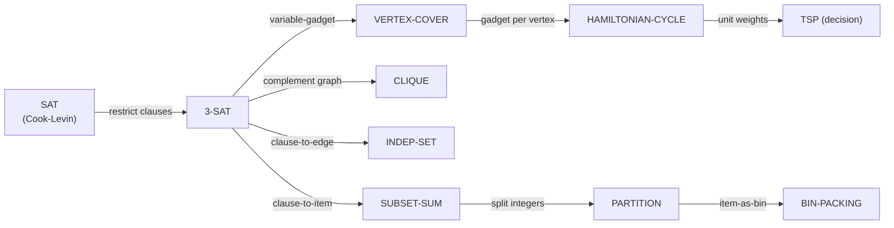
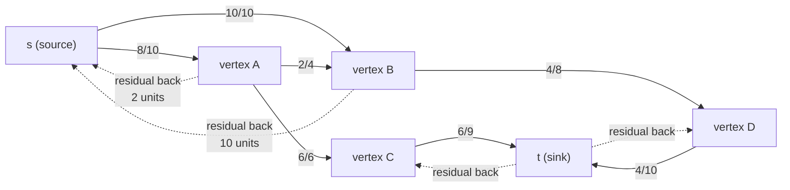
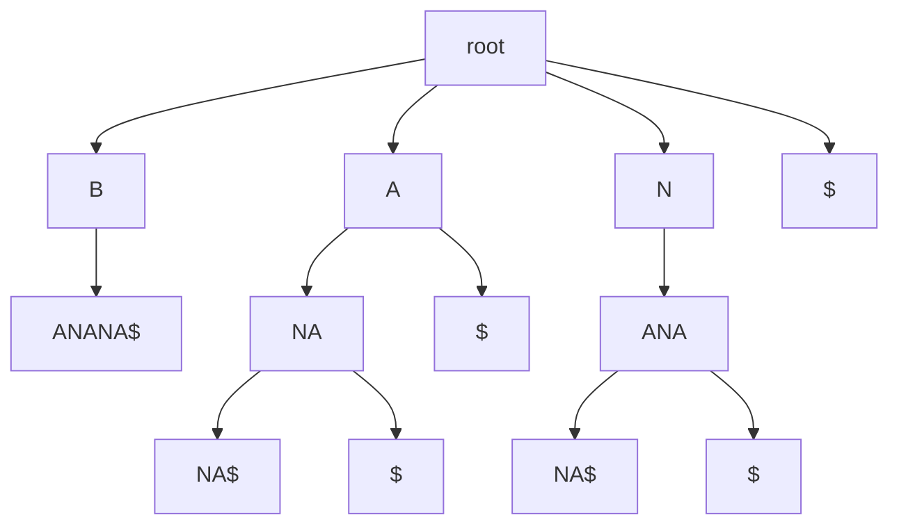

# Advanced Algorithms — Amortized, Randomized, Approximation, Flow, Geometry, Strings, FFT

## Overview

The first section of the master index lists roughly a hundred "advanced" algorithm topics that go beyond the standard interview canon of sorting, binary search, and dynamic programming. They group into a handful of families: **analysis techniques** (amortized, randomized) that change how we *measure* cost; **algorithmic paradigms** (approximation, online, streaming, external-memory, cache-oblivious, parallel) that change what we *optimize for* when the problem is hard or the data is large; **complexity and intractability** (NP-completeness, reductions, SAT, parameterized complexity) that tell us when to stop looking for a polynomial algorithm; **network optimisation** (max-flow/min-cut, matching, matroids) that unifies a surprising range of problems under a single linear-programming umbrella; **geometric** algorithms that handle points, lines, and regions; **string** algorithms that scale pattern matching to gigabytes of text; and **algebraic** algorithms (FFT/NTT) that turn convolution into the most reused primitive in combinatorics and big-integer arithmetic.

This page is a survey, not a textbook: each subsection gives the formal setup, the canonical algorithms with their complexities, a worked intuition, and pointers to the dedicated chapters that already exist in the book (search the `src/dsa/chapters/` directory for implementations). The aim is that an interviewer asking "explain amortized analysis" or "why is 3-SAT NP-complete but 2-SAT in P?" gets a technically correct answer rather than a hand-wave, and that a reader who needs the depth knows where to go next. Sources cited throughout are CLRS (*Introduction to Algorithms*, 3rd/4th ed.), Kleinberg & Tardos (*Algorithm Design*), Motwani & Raghavan (*Randomized Algorithms*), Roughgarden's *Algorithms Illuminated* series, and Sedgewick & Wayne (*Algorithms*, 4th ed.).

> Related: [Complexity Classes](../cs-theory/complexity-classes.md), [Turing Machines](../cs-theory/turing-machines.md), [Proof Techniques](../cs-theory/proofs.md), [DSA README](./README.md), [Network Flow chapter](./chapters/ch29-network-flow.md), [2-SAT chapter](./chapters/ch168-2sat.md), [FFT/Polynomial chapter](./chapters/fft-and-polynomial.md)

## Amortized Analysis

Some data structures have *cheap* operations most of the time and the occasional *expensive* one — a dynamic array that doubles, a binary counter that flips many bits on a power of two, a disjoint-set union with path compression. Worst-case analysis charges every operation its maximum cost, which overstates the total: if \\(n\\) operations take \\(O(n)\\) total work, the per-operation cost is \\(O(1)\\) amortised even if one operation alone costs \\(O(\log n)\\). **Amortised analysis** bounds the total cost of a sequence rather than each operation in isolation, and is the right tool whenever an expensive operation "pays for" many cheap ones. CLRS (Chapter 17) and Sedgewick (Proposition I.4) develop three complementary methods.

The **aggregate method** simply sums the cost of all \\(n\\) operations and divides by \\(n\\). For a dynamic table that doubles when full, the total work over \\(n\\) insertions is \\(n + 1 + 2 + 4 + \dots + 2^k\\) where \\(2^k \le n\\), which is \\(O(n)\\); the amortised cost per insertion is \\(O(1)\\). The **accounting (banker's) method** charges each operation a fictitious *amortised cost* that may exceed its actual cost; the surplus is stored as *credit* on data-structure elements and is later spent to cover expensive operations. For the binary counter, charge 2 cyrbucks per `INCREMENT`: 1 pays for the bit flip that actually happens, 1 is deposited on the bit that turned from 0 to 1; the next time that bit must flip back to 0, the stored credit pays for it. Credit is always non-negative, so the sum of amortised costs upper-bounds the sum of actual costs.

The **potential method** is the most flexible. Define a potential function \\(\Phi: \text{states} \to \mathbb{R}_{\ge 0}\\) with \\(\Phi(D_0) = 0\\) and \\(\Phi(D_t) \ge 0\\) for all \\(t\\). The amortised cost of operation \\(i\\) is \\(\hat{c}_i = c_i + \Phi(D_i) - \Phi(D_{i-1})\\). Summing telescopes the potential terms, so \\(\sum \hat{c}_i = \sum c_i + \Phi(D_n) - \Phi(D_0) \ge \sum c_i\\). Choosing \\(\Phi\\) is an art: for a dynamic table use \\(\Phi = 2 \cdot \text{num} - \text{cap}\\) (so an insertion that doesn't trigger a resize increases \\(\Phi\\) by 2, paying \\(O(1)\\); a resize that doubles the capacity decreases \\(\Phi\\) by enough to offset the \\(O(n)\\) copy). For disjoint-set union with path compression, an inverse-Ackermann potential gives the famous \\(O(\alpha(n))\\) amortised bound. The table below summarises the three methods.

| Method | Idea | Strength | Weakness |
|--------|------|----------|----------|
| **Aggregate** | Sum total cost over \\(n\\) ops, divide by \\(n\\) | Simplest; needs no extra machinery | Hard to apply when operations have different types |
| **Accounting** | Charge amortised cost, store credit on elements | Compositional; credit is local | Choosing the right charge per op type is fiddly |
| **Potential** | Define \\(\Phi\\) over states; \\(\hat{c} = c + \Delta\Phi\\) | Most general; works for splay trees, DSU, Fibonacci heaps | Requires ingenuity to find a good \\(\Phi\\) |

```python
# Amortised O(1) append via doubling; potential = 2*num - cap.
class DynamicArray:
    def __init__(self):
        self.cap = 1
        self.num = 0
        self.data = [None] * self.cap
    def append(self, x):
        if self.num == self.cap:           # resize: actual cost O(cap)
            self.data = self.data + [None] * self.cap
            self.cap *= 2
        self.data[self.num] = x
        self.num += 1                       # amortised cost: O(1)
```

## Randomized Algorithms

A **randomized algorithm** uses a source of random bits to make decisions during execution. Randomisation buys three things: simplicity (a randomized algorithm is often shorter than its deterministic counterpart), speed (the expected running time is sometimes asymptotically better), and graceful failure (the algorithm is allowed to be wrong, but only with small probability). Motwani & Raghavan's *Randomized Algorithms* (1995) is the canonical reference; CLRS Chapter 5 covers the probabilistic preliminaries. Randomised algorithms fall into two classes that look similar but have profoundly different correctness guarantees.

**Las Vegas algorithms** always return the *correct* answer; only their *running time* is a random variable. `RANDOMIZED-QUICKSORT` is the textbook example: pick a pivot uniformly at random, partition, recurse. The output is always a sorted array, but the running time ranges from \\(O(n \log n)\\) in expectation (the average over pivot choices) down to \\(O(n^2)\\) in the spectacularly unlucky case. The expected bound holds against any input — the adversary controls the input but not the random bits — which is why randomized quicksort outperforms deterministic quicksort on nearly-sorted data without the engineering overhead of `INTROSORT`'s fallback to heapsort. Other Las Vegas examples include randomized `SELECT` (expected linear), Freivalds' matrix-product verification, and the Solovay–Strassen primality test (zero-sided error: it always accepts primes, rejects composites with probability ≥ \\(1/2\\) per round).

**Monte Carlo algorithms** have a bounded running time but may return the wrong answer with a small, controllable probability. The Monte Carlo primality test (Miller–Rabin) runs in \\(O(k \log^3 n)\\) for \\(k\\) rounds and declares "composite" or "probably prime"; a composite can fool one round with probability ≤ \\(1/4\\), so \\(k\\) rounds drive the error to \\(4^{-k}\\) — astronomically small for \\(k = 40\\). The **amplification** technique — repeating an independent Monte Carlo trial and taking a majority vote — drives the error probability down exponentially in the number of repetitions, which is why randomized algorithms are practically reliable despite their one-sided or two-sided error. The table contrasts the two classes.

| Aspect | Las Vegas | Monte Carlo |
|--------|-----------|-------------|
| **Correctness** | Always correct | Wrong with probability ≤ \\(\epsilon\\) |
| **Running time** | Random variable | Bounded, deterministic |
| **Failure mode** | Slow, not wrong | Wrong, not slow |
| **Amplification** | Restart on timeout | Repeat & majority-vote |
| **Canonical examples** | Randomised quicksort, Freivalds' check, Solovay–Strassen | Miller–Rabin, randomised min-cut (Karger), MAX-3-SAT (1/2-approx) |
| **CLRS reference** | §7.4 (quicksort), §5.3 (randomised permute) | §5.4 (balls & bins), §C.5 (Miller–Rabin sketch) |

```python
# Karger's randomised global min-cut: Monte Carlo, O(n^2) trials for prob ≥ 1 - 1/n.
import random
def karger_min_cut(adj):
    # adj: dict vertex -> set of neighbours (multigraph as edge list)
    while len(adj) > 2:
        u = random.choice(list(adj))
        v = random.choice(list(adj[u]))
        # contract (u, v): merge v into u, drop self-loops
        adj[u] = (adj[u] | adj[v]) - {u, v}
        for w in adj[v]:
            if w != u:
                adj[w].discard(v); adj[w].add(u)
        del adj[v]
    s, t = next(iter(adj))
    return len(adj[s])           # size of the surviving cut
```

## Approximation Algorithms

When a problem is NP-hard but we still need an answer, three escape hatches are available: settle for an exponential algorithm (works for small \\(n\\)), settle for a heuristic (no guarantee), or settle for an **approximation algorithm** — a polynomial-time algorithm whose output is provably within a factor of the optimum. Vazirani's *Approximation Algorithms* (Springer, 2001) and the relevant chapters of Kleinberg & Tardos and CLRS are the standard references; Roughgarden's *Algorithms Illuminated* (Part 3) gives a more accessible treatment.

An \\(\alpha\\)-approximation algorithm for a minimisation problem returns a solution of cost \\(\le \alpha \cdot \text{OPT}\\) for \\(\alpha \ge 1\\); for maximisation, cost \\(\ge \alpha \cdot \text{OPT}\\) for \\(0 < \alpha \le 1\\). The **approximation ratio** \\(\alpha\\) may be a constant (VERTEX-COVER has a 2-approximation via LP rounding or maximal matching; METRIC-TSP has a 2-approximation via MST doubling and a \\(3/2\\)-approximation via Christofides' algorithm), a function of the input (SET-COVER admits a \\(H_n\\)-approximation where \\(H_n\\) is the \\(n\\)-th harmonic number, and this is tight unless P=NP), or arbitrarily close to 1 (KNAPSACK has a **PTAS** — polynomial-time approximation scheme — that achieves \\((1-\epsilon)\\)-approximation in \\(O(n^3/\epsilon)\\) time). Some problems admit a **FPTAS** (fully polynomial, where the runtime is polynomial in both \\(n\\) and \\(1/\epsilon\\)); KNAPSACK does, but strongly NP-hard problems like BIN-PACKING provably do not.

A few negative results sharpen the picture. The **PCP theorem** (Arora et al., 1998) shows that it is NP-hard to approximate MAX-3-SAT within a factor better than \\(7/8\\) (and the trivial random assignment achieves exactly \\(7/8\\), so the bound is tight). Håstad's **3-bit PCP** pushes the inapproximability of MAX-CLIQUE to \\(n^{1-\epsilon}\\) for any \\(\epsilon > 0\\). These results formalise the intuition that not all NP-hard problems are equally hard: some (VERTEX-COVER) admit constant-factor approximations, others (SET-COVER) only logarithmic, others (MAX-CLIQUE, TSP without triangle inequality) admit no useful approximation at all unless P=NP. The art is recognising which family a new problem belongs to before reaching for a solver.

## Online Algorithms

In an **online** problem, the input arrives piece by piece, and the algorithm must commit to each piece before seeing the rest. A web cache must decide what to evict before knowing future requests; a server must accept or reject a job before knowing the stream of higher-paying jobs that might arrive next. The algorithm cannot wait for the full input — it must act *now*. Borodin & El-Yaniv's *Online Computation and Competitive Analysis* (1998) is the canonical reference.

The performance measure is the **competitive ratio**: an online algorithm is \\(c\\)-competitive if, for every input sequence \\(\sigma\\), \\(\text{cost}(\text{ALG}, \sigma) \le c \cdot \text{cost}(\text{OPT}, \sigma) + O(1)\\), where `OPT` is the offline optimum that sees the entire input in advance. The ratio \\(c\\) is the price of ignorance — how much worse an online algorithm must do than one with foresight. The classic results: **Sleator & Tarjan's LRU** (Least Recently Used) is \\(k\\)-competitive for a cache of size \\(k\\) against the offline `OPT` with the same cache, and `LRU` is \\(k/(k-1)\\)-competitive against `OPT` with cache size \\(k-1\\); this is the theoretical justification for LRU's dominance in production caches. The **k-server problem** (Manasse, McGeoch, Sleator) generalises paging and has a \\((2k-1)\\)-competitive deterministic algorithm (the Work Function algorithm, Koutsoupias & Papadimitriou 1994); the long-standing \\(k\\)-competitive conjecture for randomized k-server remains open on general metric spaces.

Online algorithms also drive **online selection** problems. The celebrated **secretary problem** (a.k.a. the 1/e-law of best choice): \\(n\\) candidates arrive in random order, you must accept or reject each before seeing the next, and you want to maximise the probability of picking the best. The optimal strategy rejects the first \\(n/e\\) candidates (using them as a calibration sample) and then accepts the first subsequent candidate who beats all of them; the success probability tends to \\(1/e \approx 0.368\\). The competitive ratio is \\(1/e\\), which is tight. Variants (multiple-choice secretary, matroid secretary, prophet inequalities) are active research areas with direct applications to ad allocation and kidney exchange.

```python
# LRU cache: O(1) get/put, k-competitive against offline OPT.
from collections import OrderedDict
class LRU:
    def __init__(self, capacity):
        self.cap = capacity
        self.od = OrderedDict()
    def get(self, key):
        if key not in self.od: return -1
        self.od.move_to_end(key)            # mark recently used
        return self.od[key]
    def put(self, key, value):
        if key in self.od: self.od.move_to_end(key)
        self.od[key] = value
        if len(self.od) > self.cap:
            self.od.popitem(last=False)     # evict least-recently-used
```

## Streaming Algorithms

A **data stream** is a sequence of items so large that it does not fit in memory — think of a router counting packets per flow, a database tracking distinct users, or a search engine indexing the web. A streaming algorithm makes a **single pass** (or a small constant number of passes) over the input and uses **sublinear space** — typically \\(O(\log^c n)\\) for streams of length \\(n\\). The model was introduced by Alon, Matias, and Szegedy (STOC 1996, Gödel Prize 2005); Muthukrishnan's *Data Streams: Algorithms and Applications* (2005) and the survey by Cormode & Hadjielefttheriou (CACM 2008) are the standard references.

The fundamental trade-off is **space vs. accuracy**: most streaming problems provably require \\(\Omega(n)\\) space to solve exactly (counting distinct elements requires \\(\Omega(n)\\) bits by a pigeonhole argument), but \\(O(\log n)\\) bits suffice for an \\((\epsilon, \delta)\\)-approximation. Two workhorses dominate practice. The **Count-Min sketch** (Cormode & Muthukrishnan, 2005) estimates the frequency of any item in a stream using \\(d\\) independent hash functions and a \\(d \times w\\) array of counters: increment \\(d\\) cells per arrival, answer a query with the minimum of the \\(d\\) corresponding cells. With \\(w = \lceil e/\epsilon \rceil\\) and \\(d = \lceil \ln(1/\delta) \rceil\\), the estimate exceeds the true frequency by at most \\(\epsilon \cdot \|f\|_1\\) with probability \\(1-\delta\\), using \\(O(\frac{1}{\epsilon} \log \frac{1}{\delta} \log n)\\) bits. The **HyperLogLog** algorithm (Flajolet et al., 2007) estimates the number of *distinct* elements in \\(O(\epsilon^{-2} \log \log n)\\) space using the position of the leftmost 1-bit of the hashed value as a randomised "witness" for cardinality; it powers Redis `PFCOUNT`, BigQuery `APPROX_COUNT_DISTINCT`, and Druid. Other streaming primitives include the **AMS sketch** for second-moment (\\(F_2\\)) estimation, the **Misra-Gries / Lossy-Counting** algorithm for heavy hitters, and the **BJKST** algorithm for distinct-elements counting.

```python
# Count-Min sketch for frequency estimation with (eps, delta) guarantees.
import hashlib
class CountMin:
    def __init__(self, eps, delta):
        self.w = int(8.0 / eps)              # width -> eps-approximation
        self.d = int(2 * (1.0 / delta) ** 0.5 + 1)  # depth -> 1-delta confidence
        self.table = [[0] * self.w for _ in range(self.d)]
    def _h(self, i, x):
        return int(hashlib.md5(f"{i}:{x}".encode()).hexdigest(), 16) % self.w
    def update(self, x):
        for i in range(self.d):
            self.table[i][self._h(i, x)] += 1
    def estimate(self, x):
        return min(self.table[i][self._h(i, x)] for i in range(self.d))
```

## External-Memory and Cache-Oblivious Algorithms

When the data exceeds RAM, the bottleneck stops being CPU cycles and starts being the number of disk reads. The **external-memory (I/O) model** (Aggarwal & Vitter, 1988) abstracts this with a two-level memory: an internal memory of size \\(M\\) and an external disk organised in blocks of \\(B\\) consecutive items; the cost of an algorithm is the number of I/Os (block transfers) it performs. Sorting \\(N\\) items takes \\(\Theta\big((N/B) \log_{M/B} (N/B)\big)\\) I/Os in this model — the **multiway mergesort** of Aggarwal & Vitter — versus the \\(O(N \log N)\\) comparisons of RAM-model sorts. A **B-tree** with branching factor \\(\Theta(B)\\) answers point queries in \\(O(\log_B N)\\) I/Os and range queries in \\(O(\log_B N + K/B)\\) I/Os, which is why every production database uses B+ trees rather than binary trees on disk.

The **cache-oblivious** model (Frigo, Leiserson, Prokop, Ramachandran, 1999) goes one step further: the algorithm does not know \\(B\\) or \\(M\\). It is described as a standard RAM algorithm, but analysed in the I/O model for *every* possible \\(B\\) and \\(M\\). The astonishing result is that optimal cache-oblivious algorithms exist for many problems: **Prokop's static cache-oblivious B-tree** (a van Emde Boas–laid-out tree) achieves \\(O(\log_B N)\\) I/Os for point queries without knowing \\(B\\); the cache-oblivious matrix transpose, LU decomposition, and FFT all match their cache-aware counterparts. The practical payoff is that the same binary runs efficiently on machines with different cache hierarchies — the algorithm automatically exploits whatever \\(B\\) and \\(M\\) the hardware provides. Cache-aware algorithms (e.g., explicit `tiled` matrix multiplication tuned for a specific \\(M\\)) are typically a constant factor faster in practice but require retuning per architecture; cache-oblivious algorithms trade that constant for portability.

## NP-Completeness and Reductions

The class **P** contains decision problems solvable in polynomial time; **NP** contains problems whose "yes" instances have polynomial-size, polynomial-time-checkable witnesses. The **P vs NP** question — whether every problem with a short certificate also has a short proof — is the most important open problem in computer science and is one of the Clay Millennium Prize problems. What we *do* know is that some problems in NP are **NP-complete**: as hard as any other problem in NP, in the sense that a polynomial-time algorithm for one would yield a polynomial-time algorithm for *every* problem in NP. The **Cook–Levin theorem** (1971) established that SAT — given a Boolean formula in conjunctive normal form, does a satisfying assignment exist? — is NP-complete via a reduction that encodes the operation of a non-deterministic Turing machine as a Boolean formula whose satisfiability captures exactly "does the machine accept within \\(p(n)\\) steps?".

Once SAT is NP-complete, proving a new problem NP-complete is "merely" a matter of reducing *from* a known NP-complete problem *to* the new one: a polynomial-time transformation \\(f\\) such that \\(x \in L_1 \iff f(x) \in L_2\\). The reduction diagram below shows the standard chain by which hundreds of NP-complete problems were catalogued in Garey & Johnson's 1979 classic *Computers and Intractability*. From SAT, restrict to 3-SAT (NP-complete), reduce to VERTEX-COVER, to CLIQUE, to HAMILTONIAN-CYCLE, to TSP, to SUBSET-SUM, to PARTITION, to BIN-PACKING. Each arrow is a polynomial-time many-one reduction \\(\le_p\\); the existence of the chain proves every problem in it is at least as hard as SAT.



The practical consequence is: once you have proved your problem NP-hard (by reduction from a known NP-complete problem), further effort to find a polynomial-time exact algorithm is *probably* wasted — unless you are willing to claim P=NP. The honest options are: branch-and-bound for small instances, approximation algorithms for metric variants, parameterized algorithms when the input has small structure (small treewidth, small vertex cover, small solution size — see the **fixed-parameter tractability** framework of Downey & Fellows), or exponential algorithms with \\(O(c^n)\\) but the smallest possible base \\(c\\) (the fastest known 3-SAT solver runs in \\(O(1.307^n)\\)). The complexity-class table below situates NP within the broader landscape.

A concrete reduction makes the pattern tangible. To prove VERTEX-COVER NP-hard, reduce from 3-SAT: given a 3-CNF formula with variables \\(x_1, \dots, x_n\\) and clauses \\(C_1, \dots, C_m\\), construct a graph with a variable gadget (two vertices \\(v_i, \bar{v}_i\\) joined by an edge) for each variable and a clause gadget (a triangle on three vertices labelled by the literals) for each clause, plus edges connecting each literal in a clause to its variable-gadget copy. Set \\(k = n + 2m\\). The construction takes polynomial time, and a vertex cover of size \\(k\\) exists if and only if the formula is satisfiable — the forward direction picks one literal per variable-gadget and two per clause-gadget, and the reverse direction reads the satisfying assignment off the variable gadgets.

| Class | Definition | Example | Status |
|-------|------------|---------|--------|
| **P** | Solvable in polytime | Shortest path, sorting, 2-SAT | Many known members |
| **NP** | Verifiable in polytime | SAT, 3-COLOURING, COMPOSITE | Contains P; possibly equal |
| **coNP** | Complement in NP | TAUTOLOGY, UNSAT | Equal to NP iff NP = coNP |
| **NP-complete** | Hardest in NP; SAT ∈ this class | 3-SAT, VERTEX-COVER, HAMILTONIAN-CYCLE | Thousands of reductions |
| **NP-hard** | At least as hard as NP; not necessarily in NP | HALTING, TSP-optimisation (not decision) | Includes undecidable problems |
| **PSPACE** | Polynomial space | QBF, generalised games | Contains NP; believed strictly larger |
| **EXP** | Exponential time | Generalised chess on \\(n \times n\\) | Strictly larger than P by hierarchy theorem |

## The SAT Family

**SAT** — given a CNF formula, decide if some assignment satisfies it — is the prototypical NP-complete problem and the entry point for almost every reduction. Its variants form a sharp hardness gradient that depends delicately on clause size. **2-SAT** (each clause has at most two literals) is in **P**: Aspval, Plass & Tarjan (1979) showed that 2-SAT reduces to testing whether the *implication graph* — one directed edge per literal implication — has a contradictory strongly connected component (a variable \\(x\\) and its negation \\(\neg x\\) in the same SCC). A linear-time SCC algorithm (Tarjan's or Kosaraju's) decides satisfiability in \\(O(n+m)\\); a topological sort of the SCCs then yields a satisfying assignment. The dedicated [2-SAT chapter](./chapters/ch168-2sat.md) gives full implementation details.

**3-SAT** (each clause has exactly three literals) is NP-complete: reduce from SAT by introducing a fresh variable to split any clause of length \\(k > 3\\) into \\(k-2\\) clauses of length 3 (the standard Tseitin transformation). 3-SAT is the workhorse starting point for hundreds of reductions because its local structure is uniform. **Max-SAT** is the optimisation variant: given a CNF formula, find the assignment satisfying the maximum number of clauses. Even **Max-2-SAT** (each clause has two literals but we want to *maximise* satisfied clauses, not decide satisfiability) is NP-hard; the random-assignment algorithm satisfies each clause with probability \\(3/4\\), so it is a \\(3/4\\)-approximation for Max-2-SAT, and the PCP theorem shows this is tight. For Max-3-SAT the trivial random assignment achieves \\(7/8\\), and Håstad's PCP shows \\(7/8\\) is tight unless P=NP. Modern **SAT solvers** — CDCL (conflict-driven clause learning) solvers like MiniSat, Glucose, CaDiCaL — handle industrial instances with millions of variables by combining DPLL backtracking with clause learning, restarts, and VSIDS branching heuristics; they are the unsung workhorses of formal verification, hardware equivalence checking, and AI planning.

## Max-Flow and Min-Cut

Given a directed graph \\(G = (V, E)\\) with capacities \\(c(e) \ge 0\\), a source \\(s\\), and a sink \\(t\\), the **max-flow** problem asks for the maximum rate at which material can be shipped from \\(s\\) to \\(t\\) without exceeding any edge capacity. The dual **min-cut** problem asks for the minimum-capacity set of edges whose removal disconnects \\(s\\) from \\(t\\). The **max-flow min-cut theorem** (Ford & Fulkerson, 1956; also Elias–Feinstein–Shannon and Kotzig independently) states these two quantities are equal: \\(\max\text{-flow} = \min\text{-cut}\\). This single theorem unifies an enormous range of problems — bipartite matching, project selection, image segmentation, baseball elimination, edge-disjoint paths, and many scheduling problems all reduce to max-flow. CLRS Chapter 26 and Roughgarden's *Algorithms Illuminated* Part 2 give the standard textbook treatment; Ahuja, Magnanti & Orlin's *Network Flows* (1993) is the encyclopaedic reference.

The **Ford-Fulkerson** method iteratively finds an augmenting path in the **residual graph** — the graph whose edges are the unused capacity of each forward edge plus the *used* capacity of each backward edge (allowing the algorithm to "undo" previous flow). Each augmentation increases flow by the bottleneck capacity of the path; the algorithm terminates when no \\(s\\)-\\(t\\) path exists in the residual graph, at which point the cut defined by the vertices reachable from \\(s\\) in the residual graph is the min-cut. The diagram below sketches a residual graph mid-execution. With irrational capacities, Ford-Fulkerson may not terminate; with integer capacities bounded by \\(C\\), it terminates in \\(O(C \cdot |E|)\\) augmentations — **pseudo-polynomial**, not polynomial. **Edmonds-Karp** (1972) fixes this by choosing the *shortest* augmenting path (BFS), reducing the bound to \\(O(V E^2)\\) regardless of capacities. **Dinic's** (1970) algorithm groups augmenting paths by length using a *level graph* and uses *blocking flows* to push many augmentations per phase, achieving \\(O(V^2 E)\\) — and \\(O(E\sqrt{V})\\) on unit-capacity graphs, which is the basis of Hopcroft-Karp bipartite matching. The **Push-Relabel** algorithm (Goldberg & Tarjan, 1988) achieves \\(O(V^3)\\) (or \\(O(V^2 \sqrt{E})\\) with the highest-label variant) and is the algorithm of choice in production solvers like Google's OR-Tools. The table compares the major algorithms.



| Algorithm | Augmenting strategy | Time | Notes |
|-----------|---------------------|------|-------|
| **Ford-Fulkerson** | Any augmenting path | \\(O(E \cdot \lvert f^* \rvert)\\) | Pseudo-polynomial; may not terminate with irrational caps |
| **Edmonds-Karp** | Shortest path (BFS) | \\(O(V E^2)\\) | First strongly polynomial max-flow |
| **Dinic** | Level graph + blocking flow | \\(O(V^2 E)\\); \\(O(E\sqrt{V})\\) unit-cap | Fast in practice; basis for Hopcroft-Karp |
| **Push-Relabel** | Local push/relabel, FIFO | \\(O(V^3)\\); \\(O(V^2 \sqrt{E})\\) highest-label | Best in practice for dense graphs |
| **Orlin** (2013) | Complicated combination | \\(O(V E)\\) | First to match the \\(O(VE)\\) lower bound |

```python
# Edmonds-Karp: BFS-based augmenting path. O(V * E^2).
from collections import deque
def edmonds_karp(cap, s, t):
    n = len(cap)
    flow = [[0]*n for _ in range(n)]
    while True:
        parent = [-1]*n; parent[s] = s
        q = deque([s])
        while q and parent[t] < 0:
            u = q.popleft()
            for v in range(n):
                if parent[v] < 0 and cap[u][v] - flow[u][v] > 0:
                    parent[v] = u; q.append(v)
        if parent[t] < 0: break              # no augmenting path
        # bottleneck along the found path
        aug = float('inf'); v = t
        while v != s:
            u = parent[v]; aug = min(aug, cap[u][v] - flow[u][v]); v = u
        # push flow + add reverse residual
        v = t
        while v != s:
            u = parent[v]; flow[u][v] += aug; flow[v][u] -= aug; v = u
    return sum(flow[s][v] for v in range(n))
```

## Matching and Matroids

A **matching** in a graph \\(G = (V, E)\\) is a set of edges without common vertices. The **maximum matching** problem asks for the largest such set. In bipartite graphs, max matching reduces to max-flow (connect a super-source to one part with unit capacity and one part to a super-sink with unit capacity; the integral max-flow is a maximum matching), so any max-flow algorithm solves it. **Hopcroft-Karp** (1973) does better by exploiting the bipartite structure: find a maximal set of *shortest* augmenting paths in each phase, yielding \\(O(E \sqrt{V})\\) — still the textbook algorithm. In general graphs, **Edmonds' blossom algorithm** (1965) handles the odd cycles that defeat naive augmentation; its \\(O(V^4)\\) original bound has been improved to \\(O(V E)\\) by Micali & Vazirani (1980). The dedicated [matching chapter](./chapters/ch112-hopcroft-karp-blossom.md) covers both.

The **Hungarian algorithm** (Kuhn, 1955; based on König & Egerváry's 1931 duality) solves the **assignment problem** — minimum-cost perfect matching in a weighted bipartite graph — in \\(O(V^3)\\). It maintains a potential on the vertices (a feasible dual) and grows an alternating tree from unmatched left vertices, adjusting potentials when no augmenting path exists in the current equality graph. Applications include assigning jobs to machines, students to schools, and — famously — the post-WWII Stanford roommate assignment problem for which Kuhn rediscovered the algorithm. The **stable matching** problem (Gale & Shapley, 1962) asks for a matching where no two participants prefer each other over their assigned partner; the deferred-acceptance algorithm — one side proposes, the other tentatively accepts and dumps a current match only for a better proposal — terminates in \\(O(V^2)\\) with a matching that is stable and *optimal for the proposers*. Shapley and Roth shared the 2012 Nobel Economics Prize for this work and its many real-world deployments (medical residency matching in the US via NRMP, school choice in Boston and NYC).

A **matroid** \\(M = (S, \mathcal{I})\\) is a finite ground set \\(S\\) with a family \\(\mathcal{I}\\) of "independent" subsets satisfying three axioms: the empty set is independent; subsets of independent sets are independent (heredity); and if \\(A, B \in \mathcal{I}\\) with \\(|A| < |B|\\), then some element of \\(B \setminus A\\) can be added to \\(A\\) preserving independence (the *augmentation* or *exchange* axiom). Whitney (1935) introduced matroids to abstract "independence" across linear algebra (linearly independent sets of vectors), graph theory (forests in a graph), and combinatorics (transversals). The algorithmic payoff is that the **greedy algorithm** — sort by weight, add an element if independence is preserved — is optimal *if and only if* the independence family is a matroid (Rado's theorem). This single result explains why Kruskal's MST algorithm works (graphic matroid), why the schedule-by-deadline greedy works for unit-time jobs with deadlines (transversal matroid), and why the same greedy template fails for general scheduling (the family is not a matroid). Edmonds' **matroid intersection** algorithm finds a maximum-weight common independent set of two matroids in \\(O(V^4)\\) — a powerful generalisation that captures bipartite matching, arborescences, and many network design problems.

## Computational Geometry

Computational geometry studies algorithms for geometric objects: points, segments, polygons, polytopes. The classic references are de Berg, Cheong, van Kreveld & Overmars (*Computational Geometry: Algorithms and Applications*, 3rd ed., 2008) and Preparata & Shamos (1985). The field's defining assumptions are the **RAM model** with real-number arithmetic (infinite precision) and the **general position** assumption (no three points collinear, no four cocircular) — both routinely violated in practice, where floating-point roundoff and degenerate inputs dominate implementation effort.

The **convex hull** of a point set is the smallest convex polygon enclosing all points. Three classic algorithms: **Graham scan** (1972) sorts points by polar angle and walks the sorted list with a stack, popping whenever three consecutive points make a non-left turn — \\(O(n \log n)\\) dominated by the sort. **Andrew's monotone chain** sorts by \\((x, y)\\) and builds the upper and lower hulls separately — simpler to implement correctly with floating point. **QuickHull** (Barber et al., 1996) is the divide-and-conquer analogue of quicksort, recursing on the point farthest from each hull edge; \\(O(n \log n)\\) expected, \\(O(n^2)\\) worst-case. The **closest pair** of points (CLRS 33.4) is also \\(O(n \log n)\\) via a divide-and-conquer that recurses on a vertical split and merges with a strip check — \\(O(n \log n)\\) with presorting, or \\(O(n)\\) with a sweep-line plus a balanced set.

The **Voronoi diagram** partitions the plane into regions, one per site, where each region contains exactly the points closer to its site than to any other. It is the dual of the **Delaunay triangulation** (connect two sites if their Voronoi regions share an edge), which maximises the minimum angle over all triangulations and is the standard mesh for finite-element analysis. Both structures can be built in \\(O(n \log n)\\) by Fortune's sweep-line algorithm (1986) or by divide-and-conquer. The **k-d tree** (Bentley, 1975) is a binary space-partitioning tree that supports \\(O(\log n)\\) expected nearest-neighbour queries in low dimensions, but degrades to \\(O(n)\\) in high dimensions — the **curse of dimensionality** that motivates approximate nearest-neighbour data structures like locality-sensitive hashing and the ball tree. Range searching is supported by k-d trees in \\(O(\sqrt{n} + k)\\) for \\(k\\) reported points in 2D, and by **range trees** in \\(O(\log^d n + k)\\) for \\(d\\)-dimensional orthogonal queries at the cost of \\(O(n \log^{d-1} n)\\) space. The dedicated [computational-geometry chapters](./chapters/ch64-geometry.md) give implementation details.

```python
# Andrew's monotone chain convex hull. O(n log n).
def cross(o, a, b):
    return (a[0]-o[0])*(b[1]-o[1]) - (a[1]-o[1])*(b[0]-o[0])
def convex_hull(points):
    points = sorted(set(map(tuple, points)))
    if len(points) <= 1: return points
    lower = []
    for p in points:
        while len(lower) >= 2 and cross(lower[-2], lower[-1], p) <= 0:
            lower.pop()
        lower.append(p)
    upper = []
    for p in reversed(points):
        while len(upper) >= 2 and cross(upper[-2], upper[-1], p) <= 0:
            upper.pop()
        upper.append(p)
    return lower[:-1] + upper[:-1]            # omit last of each (== first of other)
```

## String Algorithms

String algorithms process text efficiently. The four classical pattern-matching algorithms answer the same question — "where (if anywhere) does pattern \\(P\\) of length \\(m\\) occur in text \\(T\\) of length \\(n\\)?" — with different trade-offs. **KMP** (Knuth-Morris-Pratt, 1977) preprocesses \\(P\\) into a failure function \\(\pi\\) — the length of the longest proper prefix that is also a suffix of \\(P[1..i]\\) — and scans the text in \\(O(n+m)\\) without ever backing up. The **Z algorithm** computes \\(Z[i]\\) = the length of the longest substring starting at \\(i\\) that matches a prefix of the string; it is conceptually simpler than KMP (one array, one greedy scan) and equally \\(O(n+m)\\). **Rabin-Karp** (1987) hashes substrings of \\(T\\) using a rolling hash and checks matches when the hash equals the pattern's hash; \\(O(n+m)\\) expected, \\(O(nm)\\) worst-case, but trivially parallelisable and the basis of the original `grep -F` multi-pattern search. **Aho-Corasick** (1975) builds a trie of all patterns augmented with failure links (a "string matching automaton" of total size \\(O(\sum |P_i|)\\)) and locates all occurrences of any of \\(k\\) patterns in \\(O(n + \sum |P_i| + \text{matches})\\) — the standard algorithm for intrusion detection, spam filtering, and DNA motif search.

For static text with many queries, **suffix structures** are the right tool. A **suffix tree** (Weiner, 1973; McCreight, 1976; Ukkonen, 1995) is a compressed trie of all \\(n\\) suffixes of a text; Ukkonen's online algorithm builds it in \\(O(n)\\) for constant alphabets (or \\(O(n \log |\Sigma|)\\) for general alphabets). A **suffix array** (Manber & Myers, 1993) is the lexicographically sorted array of suffixes; it occupies a fraction of the memory of a suffix tree (4 bytes per suffix vs. ~20) and supports the same queries via the LCP (longest-common-prefix) array, with \\(O(n)\\) construction via the SA-IS algorithm (Nong, Zhang & Chan, 2009). A **suffix automaton** (Blumer et al., 1985) is the minimal DFA accepting all substrings of a text — \\(O(n)\\) states and edges, supports online appending, and is the engine behind many online string-mining problems. The diagram below shows a suffix tree for the string `BANANA$`; each root-to-leaf path spells one suffix, and any internal node corresponds to a repeated substring. The dedicated [string-algorithms chapter](./chapters/string-algorithms.md) and the [suffix-tree chapter](./chapters/ch87-suffix-tree.md) cover implementations in depth.



| Algorithm | Preprocess | Match | Strength |
|-----------|------------|-------|----------|
| **KMP** | \\(O(m)\\) | \\(O(n)\\) | Single pattern, no backup in text |
| **Z-algorithm** | \\(O(m)\\) | \\(O(n)\\) | Simpler than KMP; one array |
| **Rabin-Karp** | \\(O(m)\\) | \\(O(n)\\) expected, \\(O(nm)\\) worst | 2D pattern matching; parallelisable |
| **Aho-Corasick** | \\(O(\sum |P_i|)\\) | \\(O(n + \text{matches})\\) | Multi-pattern; standard for IDS |
| **Suffix tree** | \\(O(n)\\) | \\(O(m)\\) per query | Many queries on one text; supports LCS, LRS |
| **Suffix array** | \\(O(n)\\) (SA-IS) | \\(O(m \log n)\\) binary search | Memory-efficient; cache-friendly |
| **Suffix automaton** | \\(O(n)\\) | \\(O(m)\\) per query | Online appending; minimal DFA of substrings |

The KMP failure function is the keystone of single-pattern string matching. \\(\pi[i]\\) is the length of the longest proper prefix of \\(P[0..i]\\) that is also a suffix of \\(P[0..i]\\); it lets the matcher shift the pattern by \\(i - \pi[i-1]\\) on a mismatch rather than by 1, achieving the \\(O(n + m)\\) bound. The failure function itself is computed in \\(O(m)\\) by a self-matching pass over the pattern:

```python
# KMP failure function: pi[i] = longest proper prefix of P[0..i] that is also a suffix.
def kmp_failure(p):
    m = len(p); pi = [0]*m; k = 0
    for i in range(1, m):
        while k > 0 and p[k] != p[i]:
            k = pi[k-1]
        if p[k] == p[i]:
            k += 1
        pi[i] = k
    return pi

def kmp_search(text, pattern):
    pi = kmp_failure(pattern); matches = []; k = 0
    for i, ch in enumerate(text):
        while k > 0 and pattern[k] != ch:
            k = pi[k-1]
        if pattern[k] == ch:
            k += 1
        if k == len(pattern):
            matches.append(i - k + 1); k = pi[k-1]
    return matches
```

## FFT and NTT

The **Discrete Fourier Transform (DFT)** converts a sequence of \\(n\\) complex numbers (the *time* or *coefficient* domain) into a sequence of \\(n\\) complex numbers (the *frequency* domain). The **Fast Fourier Transform** (Cooley & Tukey, 1965; with prior work by Gauss in 1805) computes the DFT in \\(O(n \log n)\\) rather than the naive \\(O(n^2)\\), by exploiting the recursive structure of the \\(n\\)-th roots of unity. The impact was immediate — a saved 2 hours of doctor-time in a 1963 radar problem grew into the algorithm at the heart of MP3, JPEG, MRI reconstruction, 5G OFDM modulation, and large-integer multiplication (Schönhage-Strassen \\(O(n \log n \log \log n)\\), recently improved to \\(O(n \log n)\\) by Harvey & van der Hoeven, 2019). CLRS Chapter 30 gives the standard treatment; Sedgewick & Wayne's *Algorithms* gives a more accessible one.

The killer application in competitive programming and combinatorics is **polynomial multiplication**: given \\(A(x) = \sum_{i=0}^{n-1} a_i x^i\\) and \\(B(x) = \sum_{i=0}^{n-1} b_i x^i\\), compute \\(C(x) = A(x) \cdot B(x)\\) in \\(O(n \log n)\\) instead of \\(O(n^2)\\). The recipe: (1) zero-pad both polynomials to length \\(2n\\); (2) FFT both to point-value representation; (3) multiply pointwise; (4) inverse-FFT back to coefficients. This turns every convolution-shaped problem — counting pairs summing to \\(k\\), multiplying big integers, multiplying polynomials modulo a prime, computing subset-sum via generating functions, multiplying permutations, finding string matches with wildcards — into an \\(O(n \log n)\\) routine.

The **Number-Theoretic Transform (NTT)** is the integer-arithmetic variant of the FFT that works over the finite field \\(\mathbb{Z}_p\\) for a suitable prime \\(p = k \cdot 2^m + 1\\) (e.g., \\(p = 998\,244\,353 = 119 \cdot 2^{23} + 1\\) with primitive root \\(g = 3\\)). Roots of unity in \\(\mathbb{Z}_p\\) replace complex roots of unity, and the entire algorithm runs in exact modular integer arithmetic — no floating-point error, no rounding, exact results. This is the algorithm behind every modern competitive-programming library's polynomial code and is essential whenever the polynomial coefficients must be integers mod \\(p\\) (e.g., counting problems modulo \\(10^9 + 7\\)). The [FFT-and-polynomial chapter](./chapters/fft-and-polynomial.md) gives a full implementation; [Chapter 167](./chapters/ch167-fft-ntt.md) gives the full mathematical treatment.

## Interview Questions

**Q1: What is the difference between worst-case and amortised analysis? When is each appropriate?**
Worst-case analysis bounds the cost of *every single operation*, which is the right measure when a single slow operation is unacceptable — a real-time system that misses a deadline, a flight controller that cannot tolerate a 100ms GC pause. Amortised analysis bounds the *total* cost of \\(n\\) operations divided by \\(n\\), which is the right measure when the caller cares about throughput rather than per-op latency — a hash table insertion, a dynamic array append, a disjoint-set `find`. The two diverge whenever an expensive operation is rare: a dynamic table doubles in \\(O(n)\\) but only after \\(n\\) cheap \\(O(1)\\) inserts, so amortised cost is \\(O(1)\\) while worst-case is \\(O(n)\\). If a real-time caller cannot tolerate the occasional \\(O(n)\\) resize, use a *deamortised* data structure (e.g., incremental resizing, or a hash table that grows by a constant factor per insert).

**Q2: Explain the potential method of amortised analysis with an example.**
Define a potential \\(\Phi\\) over data-structure states with \\(\Phi(D_0) = 0\\) and \\(\Phi(D_t) \ge 0\\). The amortised cost of an operation is \\(\hat{c} = c + \Phi(D_{\text{after}}) - \Phi(D_{\text{before}})\\); summing over \\(n\\) operations telescopes to \\(\sum \hat{c} = \sum c + \Phi(D_n) - \Phi(D_0) \ge \sum c\\). For a dynamic table that doubles when full, choose \\(\Phi = 2 \cdot \text{num} - \text{cap}\\). A non-resizing insert costs \\(O(1)\\) actual and increases \\(\Phi\\) by 2, so \\(\hat{c} = 3\\). A resize costs \\(\text{cap}\\) actual (copying), but decreases \\(\Phi\\) from \\(\text{cap}\\) (just before the resize, when `num == cap`) to 0 (just after, when `cap` doubled and `num` stayed the same); the negative \\(\Delta\Phi = -\text{cap}\\) cancels the cost. So every insert has \\(\hat{c} = O(1)\\) and the total is \\(O(n)\\).

**Q3: Las Vegas vs Monte Carlo — give an example of each and explain how you would amplify a Monte Carlo algorithm.**
Las Vegas: randomised quicksort — always returns a sorted array, but its running time is a random variable with \\(O(n \log n)\\) expectation and \\(O(n^2)\\) worst case. Monte Carlo: Miller–Rabin primality testing — runs in \\(O(k \log^3 n)\\) for \\(k\\) rounds but may falsely declare a composite "probably prime" with probability \\(\le 4^{-k}\\). Amplification for Monte Carlo: repeat the trial \\(k\\) times with independent randomness and take a majority vote (for two-sided error) or accept only if *every* trial accepts (for one-sided error). By the Chernoff bound, the failure probability decays exponentially in \\(k\\): \\(k = 40\\) gives failure probability \\(< 10^{-24}\\), which is smaller than the probability of a cosmic-ray bit-flip during the computation.

**Q4: How would you prove that a new problem X is NP-complete?**
You must show two things: (1) X is in NP — there is a polynomial-size, polynomial-time-checkable certificate for "yes" instances; (2) X is NP-hard — reduce from a known NP-complete problem (say 3-SAT) to X via a polynomial-time many-one reduction \\(f\\) with \\(w \in \text{3-SAT} \iff f(w) \in X\\). The reduction must preserve the answer in *both* directions: a satisfying assignment for the 3-SAT instance must yield a yes-instance of X, and vice versa. Once X is shown NP-hard and is in NP, it is NP-complete by definition. A common mistake is reducing *from* X *to* 3-SAT — that only shows X is at most as hard as SAT, which is trivially true for any problem in NP.

**Q5: Why is 2-SAT solvable in polynomial time while 3-SAT is NP-complete?**
2-SAT reduces to graph reachability: each clause \\((a \lor b)\\) is logically equivalent to two implications \\((\neg a \Rightarrow b)\\) and \\((\neg b \Rightarrow a)\\); collect all such implications into an *implication graph* on the \\(2n\\) literals. The formula is unsatisfiable if and only if some variable \\(x\\) and its negation \\(\neg x\\) lie in the same strongly connected component (because then \\(x \Rightarrow \neg x\\) and \\(\neg x \Rightarrow x\\), forcing both to be true and false simultaneously). Tarjan's or Kosaraju's SCC algorithm decides this in \\(O(n + m)\\). The key property that breaks for 3-SAT is that a 3-literal clause \\((a \lor b \lor c)\\) is equivalent to *three* 2-literal implications but only *conditionally* — you need auxiliary reasoning that does not fit in a simple implication graph. The transition from 2-SAT to 3-SAT is exactly where the natural graph-theoretic structure collapses.

**Q6: State the max-flow min-cut theorem and explain why it is more than just a coincidence.**
The max-flow min-cut theorem says that in any flow network, the maximum value of an \\(s\\)-\\(t\\) flow equals the minimum capacity of an \\(s\\)-\\(t\\) cut. The proof is constructive: when Ford-Fulkerson terminates, the set \\(S\\) of vertices reachable from \\(s\\) in the residual graph defines a cut whose forward edges are saturated (capacity = flow) and whose backward edges carry zero flow; hence the cut's capacity equals the current flow value. Since every flow is bounded by every cut's capacity (capacity bounds flow out of \\(s\\), conservation gives the rest), and the algorithm reaches a flow equal to some cut's capacity, that flow is maximum and that cut is minimum. The theorem is the **LP duality** theorem specialised to network flow — max-flow is the primal, min-cut is the dual, and complementary slackness is the residual-graph condition. This is why the theorem generalises: min-cost max-flow duality, the König-Egerváry theorem (max matching = min vertex cover in bipartite graphs), and Menger's theorem (max internally-disjoint paths = min cut) are all LP-duality in disguise.

**Q7: Compare KMP and Rabin-Karp. When would you prefer each?**
KMP preprocesses the pattern in \\(O(m)\\) into a failure function and scans the text in \\(O(n)\\) — deterministic, single pattern, no backup in the text (useful when the text is a stream that cannot be re-read). Rabin-Karp hashes the pattern and each text window with a rolling hash; matches are confirmed by direct comparison. Expected time \\(O(n+m)\\), worst-case \\(O(nm)\\) (many hash collisions or a pathological input). Prefer KMP when you need a hard \\(O(n)\\) guarantee and have a single pattern. Prefer Rabin-Karp when (a) you need to search for many patterns simultaneously (compute one rolling hash, compare against a hash set), (b) the pattern is much shorter than the text and you want cache-friendly streaming access, or (c) you are matching 2D patterns (extend the rolling hash to two dimensions, KMP does not generalise cleanly). For *many* static patterns, neither is optimal — use Aho-Corasick, which builds a single automaton over all patterns and finds all occurrences in one text pass.

**Q8: What problem does the FFT solve, and why is it useful for polynomial multiplication?**
The FFT computes the Discrete Fourier Transform in \\(O(n \log n)\\) instead of \\(O(n^2)\\) by exploiting the recursive structure of the \\(n\\)-th roots of unity — split the polynomial into even-indexed and odd-indexed halves, recurse, and combine. Polynomial multiplication becomes \\(O(n \log n)\\) via the recipe: evaluate both polynomials at \\(2n\\) points using FFT (the roots of unity, where evaluation is cheap), multiply pointwise in \\(O(n)\\), and interpolate back via the inverse FFT. The point-value representation is closed under multiplication (just multiply the values), which is why the FFT detour through frequency space is worth it. The same machinery solves any convolution — counting pairs summing to \\(k\\) (write a polynomial whose coefficient of \\(x^j\\) counts how many times \\(j\\) appears, then square it), multiplying big integers (treat digits as polynomial coefficients, multiply, carry), and pattern matching with wildcards (correlate pattern against text via FFT).

## Cross-References

- [Complexity Classes](../cs-theory/complexity-classes.md) — P, NP, coNP, PSPACE, EXP and the formal foundations of NP-completeness
- [Turing Machines](../cs-theory/turing-machines.md) — the model of computation underlying Cook–Levin
- [Proof Techniques](../cs-theory/proofs.md) — induction, contradiction, the mathematical machinery behind amortised and competitive analyses
- [Logic](../cs-theory/logic.md) — propositional and predicate logic, the foundation of SAT
- [Formal Languages](../cs-theory/formal-languages.md) — Chomsky hierarchy, automata-theoretic view of string matching
- [DSA README](./README.md) — overview of the algorithms track and recommended study paths
- [Network Flow chapter](./chapters/ch29-network-flow.md) — full treatment of Ford-Fulkerson, Edmonds-Karp, Dinic
- [Min-cost max-flow chapter](./chapters/ch169-min-cost-max-flow.md) — LP duality and the min-cost extension
- [2-SAT chapter](./chapters/ch168-2sat.md) — implication graph, SCC-based satisfiability, implementation
- [NP & Approximation chapter](./chapters/ch96-np-approximation.md) — approximation algorithms in depth
- [Randomised Algorithms chapter](./chapters/ch63-randomized-algorithms.md) — Las Vegas vs Monte Carlo implementations
- [FFT and Polynomial chapter](./chapters/fft-and-polynomial.md) — practical FFT/NTT guide
- [FFT and NTT deep dive](./chapters/ch167-fft-ntt.md) — full mathematical treatment
- [Suffix Tree chapter](./chapters/ch87-suffix-tree.md) — Ukkonen's algorithm and applications
- [Suffix Array chapter](./chapters/ch44-suffix-array.md) — SA-IS construction, LCP array
- [Aho-Corasick chapter](./chapters/ch46-aho-corasick.md) — multi-pattern string matching automaton
- [KMP chapter](./chapters/ch41-kmp.md) — failure function and implementation
- [Z-algorithm chapter](./chapters/ch42-z-algorithm.md) — Z-array construction
- [Rolling hash chapter](./chapters/ch40-rolling-hash.md) — Rabin-Karp and polynomial hashing
- [Hungarian algorithm chapter](./chapters/ch170-hungarian.md) — assignment problem
- [Bipartite matching chapter](./chapters/ch112-hopcroft-karp-blossom.md) — Hopcroft-Karp and Edmonds' blossom
- [Geometry chapter](./chapters/ch64-geometry.md) — convex hull, sweep line, closest pair
- [KD-trees chapter](./chapters/ch78-kd-trees.md) — nearest-neighbour data structure
- [Streaming algorithms chapter](./chapters/ch147-streaming-algorithms.md) — Count-Min, HyperLogLog, AMS
- [Online algorithms chapter](./chapters/ch146-online-algorithms.md) — LRU, k-server, secretary problem
- [External-memory chapter](./chapters/ch159-external-memory.md) — I/O model, cache-oblivious algorithms
- [Parameterized algorithms chapter](./chapters/ch148-parameterized-algorithms.md) — FPT, kernelisation, bounded treewidth
- [Linear programming chapter](./chapters/ch151-linear-programming.md) — LP duality, simplex, interior point
- [Matroid intersection chapter](./chapters/ch96-np-approximation.md) — greedy characterisation and intersection

```python
# Recursive Cooley-Tukey FFT. n must be a power of 2.
import cmath
def fft(a, invert=False):
    n = len(a)
    if n == 1: return
    a0 = a[0::2]; a1 = a[1::2]
    fft(a0, invert); fft(a1, invert)
    ang = (-2j if invert else 2j) * cmath.pi / n
    w = cmath.exp(ang); wn = 1
    for i in range(n // 2):
        u = a0[i]; v = wn * a1[i]
        a[i] = u + v; a[i + n//2] = u - v
        wn *= w
    if invert:
        for i in range(n): a[i] /= 2
```

## References

- Thomas H. Cormen, Charles E. Leiserson, Ronald L. Rivest, Clifford Stein — *Introduction to Algorithms* (3rd/4th ed., MIT Press, 2009/2022). Chapters 17 (amortised analysis), 26 (max-flow), 30 (FFT), 34 (NP-completeness), 35 (approximation algorithms).
- Jon Kleinberg, Éva Tardos — *Algorithm Design* (Pearson, 2006). The standard reference for greedy algorithms, network flow, NP-completeness reductions, and approximation algorithms with a more accessible style than CLRS.
- Rajeev Motwani, Prabhakar Raghavan — *Randomized Algorithms* (Cambridge University Press, 1995). The canonical text on Las Vegas vs Monte Carlo, the probabilistic method, and randomised rounding.
- Tim Roughgarden — *Algorithms Illuminated* (Parts 1–4, Soundlikeyourself Publishing, 2017–2020). Accessible modern treatment of asymptotic analysis, graph algorithms, NP-completeness, and LP duality.
- Robert Sedgewick, Kevin Wayne — *Algorithms* (4th ed., Addison-Wesley, 2011). Practical implementations of quicksort, FFT, string sorts, and max-flow with Java code.
- Sanjoy Dasgupta, Christos Papadimitriou, Umesh Vazirani — *Algorithms* (McGraw-Hill, 2006). Compact, conceptual treatment emphasising the *why* over the *how*.
- Vijay V. Vazirani — *Approximation Algorithms* (Springer, 2001). The encyclopaedic reference for approximation ratios, PTAS/FPTAS, and PCP-based inapproximability.
- Allan Borodin, Ran El-Yaniv — *Online Computation and Competitive Analysis* (Cambridge University Press, 1998). The standard reference for online algorithms and the competitive ratio.
- Muthu Muthukrishnan — *Data Streams: Algorithms and Applications* (Now Publishers, 2005). Foundational survey of the streaming model.
- Mark de Berg, Otfried Cheong, Marc van Kreveld, Mark Overmars — *Computational Geometry: Algorithms and Applications* (3rd ed., Springer, 2008). The standard textbook for convex hulls, Voronoi diagrams, range searching.
- Ravindra K. Ahuja, Thomas L. Magnanti, James B. Orlin — *Network Flows: Theory, Algorithms, and Applications* (Prentice Hall, 1993). The encyclopaedic reference for max-flow, min-cost flow, and matching.
- Michael R. Garey, David S. Johnson — *Computers and Intractability: A Guide to the Theory of NP-Completeness* (W.H. Freeman, 1979). The classic catalogue of NP-complete problems and reduction techniques.
- James W. Cooley, John W. Tukey — "An Algorithm for the Machine Calculation of Complex Fourier Series" (*Mathematics of Computation*, 1965). The original FFT paper.
- Margaret A. Bonan, Don Coppersmith, Allan Borodin — "The Cook-Levin Theorem" (historical context in *Computers and Intractability*, 1979; original: Stephen Cook, "The Complexity of Theorem-Proving Procedures", STOC 1971; Leonid Levin, 1973, independent).
- Ukkonen, Esko — "On-line construction of suffix trees" (*Algorithmica*, 1995). The \\(O(n)\\) online suffix tree construction.
- Nong, Ge; Sen, Zhang; Chan, Wai Hong — "Linear suffix array construction by almost pure induced-sorting" (*DCC*, 2009). The SA-IS algorithm.
