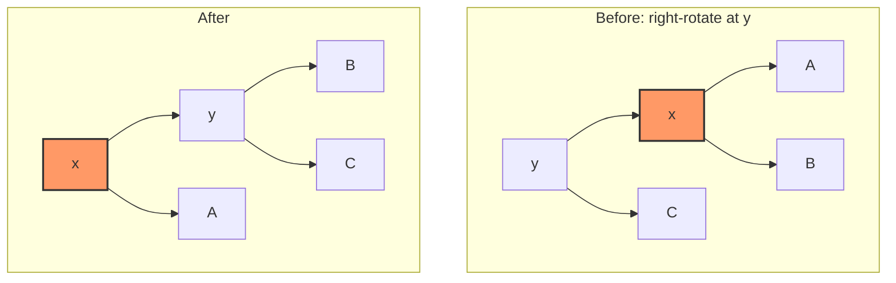
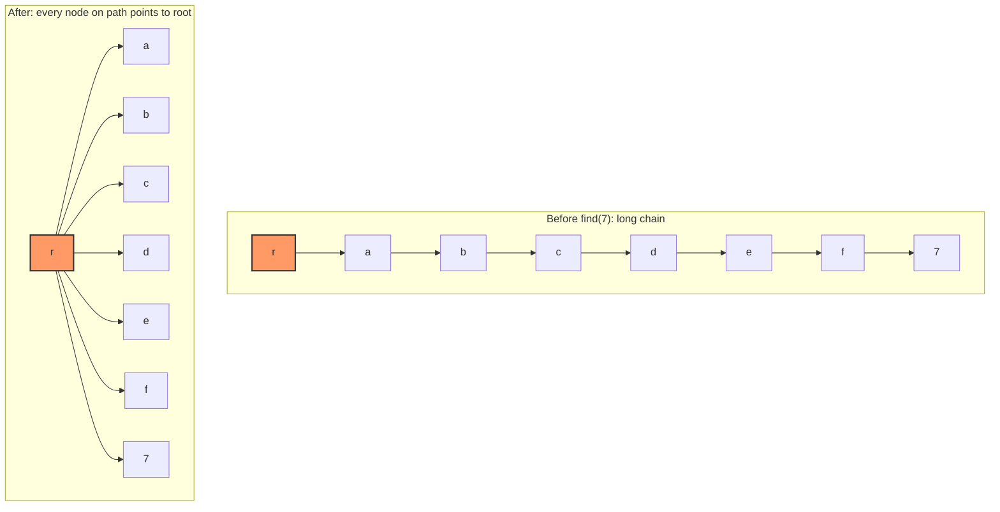
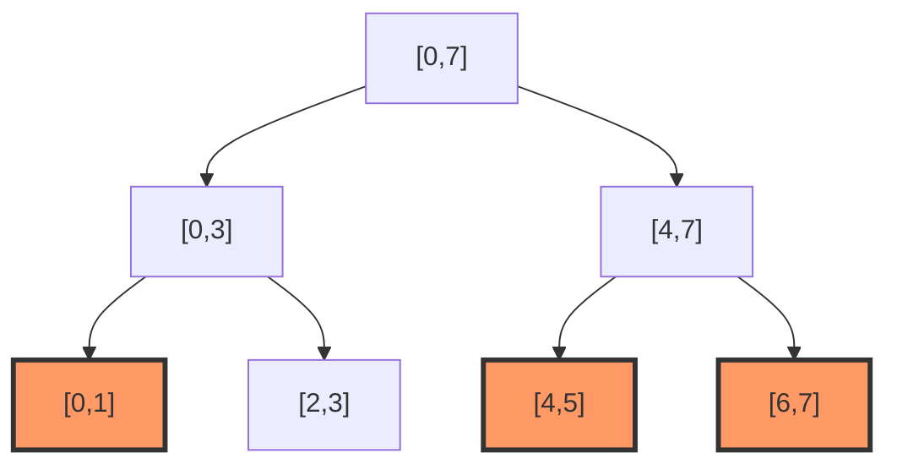

# Advanced Data Structures

> Covers §2 of the [Master Topic Index](../index.md#2-advanced-data-structures).
> Related chapters in this track: [Segment Tree](./chapters/ch18-segment-tree.md),
> [Fenwick Tree](./chapters/ch19-fenwick-tree.md), [DSU](./chapters/ch17-dsu.md),
> [Skip Lists](./chapters/ch74-skip-lists.md), [Persistent DS](./chapters/ch75-persistent-ds.md),
> [Probabilistic DS](./chapters/ch79-probabilistic-ds.md),
> [Splay Trees](./chapters/ch98-splay-trees.md),
> [Link-Cut Trees](./chapters/ch157-link-cut-trees.md),
> [Suffix Automaton](./chapters/ch45-suffix-automaton.md).

## Overview

"Advanced data structures" bridges the textbook structures (arrays, lists,
BSTs, heaps) and the structures that real systems — databases, compilers,
text editors, network routers, version control — are built on. Five themes
recur: **balancing invariants** (AVL, red-black, B-tree, treap, splay, skip
list); **path sharing** that keeps old versions alive (Okasaki); **randomization**
that avoids worst-case inputs (treap, skip list, cuckoo, HLL); **amortized
analysis** that justifies occasionally-expensive operations (splay, union-find,
finger trees); and **approximation** that fits data too large for memory
(Bloom, Count-Min, HLL, cuckoo).

Canonical references: **CLRS** (Ch. 13, 14, 18, 20, 21), **Okasaki** (*Purely
Functional Data Structures*, 1998), **Tarjan** (*Data Structures and Network
Algorithms*, 1983; splay and link-cut trees with Sleator), and **Demaine's
6.851 lectures** (MIT OCW). Where a result is non-obvious we cite the paper;
otherwise we cite the textbook.

---

## 1. Persistent and Immutable Data Structures

A **persistent** data structure preserves access to previous versions after
an update. Okasaki classifies persistence into three degrees:

| Degree | Old versions readable? | Old versions updatable? | Example |
|---|---|---|---|
| Partial | Yes | No | Persistent BST, persistent segment tree |
| Full | Yes | Yes, only along one branch | Persistent queue, Banker's queue |
| Confluent | Yes | Yes, from any version | Catenable lists, HAMTs |

The unifying technique is **path copying**: a write returns a new root with
new nodes along the modified path, sharing every unchanged subtree with the
old version. For a balanced tree of height \\(h\\), an update costs
\\(O(h)\\) time and adds \\(O(h)\\) new nodes — old versions stay live at no
extra traversal cost.

```cpp
// Persistent BST via path copying. Returns a *new* root; old root stays valid.
struct Node { int key; Node *l, *r; };
Node* insert(Node* t, int key) {
    if (!t) return new Node{key, nullptr, nullptr};
    if (key == t->key) return t;                          // share: no change
    if (key < t->key) return new Node{t->key, insert(t->l, key), t->r};
    return new Node{t->key, t->l, insert(t->r, key)};
}
```

The **persistent segment tree** is the canonical application: with \\(n\\)
updates you build \\(n\\) "versions" sharing \\(O(n \\log n)\\) total nodes, and
can answer range queries at any historical version — the standard solution to
"k-th smallest in a subarray" and offline range-distinct-count problems. For
the general technique (Driscoll–Sarnak–Tarjan–Sleator 1989): *any* ephemeral
data structure with bounded in-degree can be made fully persistent in
\\(O(1)\\) amortized overhead — see
[ch75-persistent-ds](./chapters/ch75-persistent-ds.md) and Demaine's lecture 7.

---

## 2. Finger Trees and Sequences

A **finger tree** (Hinze & Paterson 2006) is a persistent sequence type
giving amortized \\(O(1)\\) access to *both* ends and \\(O(\\log n)\\) split and
concatenate. It is the implementation behind Haskell's `Data.Sequence` and
Scala's `Vector`. The structure is a 2-3 tree whose leaves are arrays of
elements and whose internal nodes store **measured** annotations (size, sum,
max, monoid-fold). A "finger" is a pointer to a leaf at either end;
operations near a finger are constant-time. The general principle — annotate
each subtree with a monoid value and search by that annotation — recurs in
segment trees, interval trees, and B-trees with reducers. Hinze & Paterson's
key theorem: with a *reduced* monoid measure, all operations are
\\(O(1/n)\\) amortized per element moved, yielding \\(O(\\log n)\\)
split/concatenate — the cleanest published route to a persistent deque with
amortized \\(O(1)\\) on both ends.

---

## 3. Balanced Binary Search Trees

Balanced BSTs maintain a height invariant so search, insert, and delete stay
\\(O(\\log n)\\). CLRS Ch. 12–13 cover unbalanced BSTs, red-black, and AVL;
the others come from Tarjan's papers and Demaine's 6.851 lectures.

### 3.1 Comparison

| Tree | Balance invariant | Update cost | Rebalance mechanism | Source |
|---|---|---|---|---|
| AVL | \\(\|h(l) - h(r)\| \\le 1\\) | \\(O(\\log n)\\), \\(O(1)\\) rotations amortized | Single/double rotation | Adelson-Velsky & Landis 1962 |
| Red-Black | Every root-to-leaf path has same black-height; no two reds in a row | \\(O(\\log n)\\), \\(O(1)\\) rotations worst-case | Recolor + rotation | CLRS §13, Bayer 1972 / Guibas & Sedgewick 1978 |
| B-tree (order \\(m\\)) | Every internal node has \\(\\lceil m/2 \\rceil\\) to \\(m\\) children; all leaves same depth | \\(O(\\log_m n)\\) I/Os | Split/merge nodes | CLRS §18, Bayer & McCreight 1972 |
| Treap | Heap property on random priorities; BST on keys | \\(O(\\log n)\\) *expected* | Rotations to restore heap | Aragon & Seidel 1996 |
| Splay | No invariant — self-adjusting | \\(O(\\log n)\\) amortized | Splay (move accessed node to root) | Sleator & Tarjan 1985 |

Skip lists (§4) are the probabilistic analogue: \\(O(\\log n)\\) expected via
random levels (Pugh 1990).

### 3.2 Rotations

Both AVL and red-black trees rebalance via **rotations** — local
rearrangements preserving the in-order traversal. A right rotation at node
`y` lifts its left child `x` and demotes `y`:



In-order: `A, x, B, y, C` — unchanged. AVL uses single rotations for
single-direction imbalances and double rotations for zig-zag; red-black trees
need at most two rotations per insert (CLRS Theorem 13.2).

### 3.3 Treap

A treap assigns each key a random priority and maintains heap order on
priorities alongside BST order on keys. The expected shape equals that of a
random BST — \\(O(\\log n)\\) depth w.h.p. — without explicit rebalancing:
insert as in a BST, then rotate upward while priority violates heap order.

### 3.4 Splay trees

Splay trees have *no* invariant stored in the nodes. After every access the
accessed node is moved to the root via zig/zig-zig/zig-zag rotations.
Sleator & Tarjan's **access lemma** gives \\(O(\\log n)\\) amortized access;
the stronger **dynamic optimality** conjecture is still open. The same
machinery yields the linking-cutting trees of §10 and Tarjan's network-flow
algorithms.

---

## 4. Skip Lists

Skip lists (Pugh 1990) are a probabilistic alternative to balanced BSTs with
\\(O(\\log n)\\) expected search, insert, and delete. Each node gets a random
height by repeated coin flips; taller nodes form "express lanes" above the
base sorted linked list. They are simpler to implement than balanced BSTs and
support natural lock-free concurrent variants — hence their use in Redis,
LevelDB (MemTable), and Apache Lucene. With promotion probability \\(p\\), the
expected height is \\(\\log_{1/p} n\\) and expected total node count is
\\(n / (1-p)\\). See [ch74-skip-lists](./chapters/ch74-skip-lists.md) for the
full implementation.

---

## 5. van Emde Boas Trees

A **van Emde Boas tree** (vEB) stores a subset of \\(\\{0, 1, \\dots, U-1\\}\\)
and supports insert, delete, predecessor, and successor in \\(O(\\log \\log U)\\)
time, using \\(O(U)\\) space. The recursion is the prototypical **van Emde Boas
stratagem** (CLRS §20): split a universe of size \\(U\\) into \\(\\sqrt{U}\\)
clusters of size \\(\\sqrt{U}\\), with a summary structure recording which
clusters are non-empty. The recurrence
\\(T(U) = T(\\sqrt{U}) + O(1)\\) solves to \\(T(U) = O(\\log \\log U)\\). The
space-reduced cousin, the **y-fast trie** (Willard 1983), reduces space to
\\(O(n)\\) expected while keeping \\(O(\\log \\log U)\\) operations.

---

## 6. Disjoint Set Union (Union-Find)

DSU maintains a partition of \\(\\{1, \\dots, n\\}\\) under `union` and `find`.
Two heuristics make it nearly constant: **union by rank** (attach the shorter
tree under the taller) and **path compression** (during `find`, point every
visited node directly at the root).



Tarjan (1975) proved that with both heuristics, the amortized cost per
operation on a structure of size \\(n\\) over \\(m\\) operations is
\\(O(\\alpha(m, n))\\), where \\(\\alpha\\) is the inverse Ackermann function —
for any practical \\(m, n\\) this is at most 4 (CLRS §21). This is the
canonical example of amortized analysis with a potential function.

```cpp
struct DSU {
    std::vector<int> parent, rank_;
    DSU(int n) : parent(n), rank_(n, 0) { std::iota(parent.begin(), parent.end(), 0); }
    int find(int x) {                                  // path halving: simpler, same bound
        while (parent[x] != x) parent[x] = parent[parent[x]], x = parent[x];
        return x;
    }
    bool unite(int a, int b) {
        a = find(a); b = find(b);
        if (a == b) return false;
        if (rank_[a] < rank_[b]) std::swap(a, b);
        parent[b] = a;
        if (rank_[a] == rank_[b]) ++rank_[a];
        return true;
    }
};
```

DSU is the workhorse of Kruskal's MST algorithm, offline LCA (Tarjan's
algorithm), dynamic-graph connectivity, and unification in type checkers.

---

## 7. Probabilistic Structures: Bloom, Cuckoo, Count-Min, HyperLogLog

These trade exactness for orders-of-magnitude space savings — the right
choice when data exceeds RAM and a bounded error is acceptable.

| Structure | Answers | Error direction | Space (1B items, 1% error) | Supports delete? | Used in |
|---|---|---|---|---|---|
| **Bloom filter** | "Is x in S?" | False positives only | ~1.2 GB (9.6 bits/item) | No (standard form) | Cassandra, Bigtable, Chrome safe-browsing |
| **Counting Bloom** | "Is x in S?" | False positives only | ~4× Bloom | Yes (counter decrements) | Network routers, expired-key detection |
| **Cuckoo filter** | "Is x in S?" | False positives only | ~1.0 GB | Yes (swap-out) | Better Bloom replacement (Fan et al. 2014) |
| **Count-Min Sketch** | "How many times did x appear?" | Overestimates only | ~tens of MB | No | Flink heavy-hitters, ad-tech |
| **HyperLogLog** | "How many distinct items?" | ~0.8% relative std error | 12 KB *fixed* | No | Redis `PFCOUNT`, BigQuery `APPROX_COUNT_DISTINCT`, Spark |

### 7.1 Bloom filter

A bit array of \\(m\\) bits plus \\(k\\) independent hash functions. Insert
sets bits `h_1(x), …, h_k(x)`; query returns "maybe present" iff all those
bits are 1. The false-positive rate is
\\(p = (1 - e^{-kn/m})^k\\), with optimum \\(k^\\star = (m/n)\\ln 2\\).

### 7.2 Cuckoo filter

Stores *fingerprints* in a cuckoo-hash table; query checks two candidate
buckets. Achieves Bloom's false-positive rate at lower space, supports
delete, and has better cache locality. Downside: insertion can fail (with
low probability) when the cuckoo walk cycles.

### 7.3 Count-Min Sketch

A 2D array `cnt[d][w]` with \\(d\\) pair-wise independent hash functions.
Insert: `cnt[i][h_i(x)] += c`. Estimate: `min_i cnt[i][h_i(x)]`. With
\\(w = \\lceil e/\\varepsilon \\rceil\\), \\(d = \\lceil \\ln(1/\\delta) \\rceil\\),
the estimate exceeds the true count by at most \\(\\varepsilon \\cdot N\\) with
probability \\(1-\\delta\\) (Cormode & Muthukrishnan 2005). Never
underestimates — suitable for "charged too much, never too little" guarantees.

### 7.4 HyperLogLog

Estimates cardinality using positions of leading zeros in \\(m\\) hash
buckets. Flajolet et al. (2007) proved the standard error is
\\(1.04 / \\sqrt{m}\\). The remarkable property: **12 KB suffices to count a
trillion distinct items** with ~2% error — space is independent of \\(n\\).

For an interview-focused treatment see
[Probabilistic Data Structures](../interview/system-design/probabilistic-data-structures.md)
and [ch79-probabilistic-ds](./chapters/ch79-probabilistic-ds.md).

---

## 8. Rope and Interval Trees

A **rope** (Boehm, Atkinson, Plass 1995) is a balanced binary tree whose
leaves are short strings. Concatenation is \\(O(1)\\) (create a new internal
node); substring, insert, delete are \\(O(\\log n)\\) plus the size of the
modified leaf. Ropes power Microsoft Word, the Boehm GC's incremental
marking, and several text editors' gap-buffer successors. See
[ch101-rope-gap-buffer](./chapters/ch101-rope-gap-buffer.md).

An **interval tree** (CLRS §14.3) stores intervals \\([l_i, r_i]\\) and
answers "which intervals overlap a point / interval?" in \\(O(\\log n + k)\\).
The structure is a red-black tree keyed on \\(l_i\\), with each node augmented
by the maximum \\(r\\) in its subtree — an **augmented BST** (store a
monoid-fold of the subtree), the same pattern that underlies segment trees,
Fenwick trees, and interval-scheduling I-trees. Query: at each node, if
`max_r < q` then no overlap in the subtree; else emit and recurse as in CLRS 14.3.

---

## 9. Range-Query Structures

| Structure | Build | Point update | Range update | Range query | Idempotent query? | Memory | Notes |
|---|---|---|---|---|---|---|---|
| **Prefix sum** | \\(O(n)\\) | \\(O(n)\\) | \\(O(n)\\) | \\(O(1)\\) | No (sum) | \\(O(n)\\) | Updates kill it |
| **Sparse table** | \\(O(n \\log n)\\) | — | — | \\(O(1)\\) | **Yes** (min/max/gcd) | \\(O(n \\log n)\\) | Idempotent monoids only; immutable |
| **Fenwick (BIT)** | \\(O(n)\\) | \\(O(\\log n)\\) | \\(O(\\log n)\\)* | \\(O(\\log n)\\) | No | \\(O(n)\\) | Lowest constant factor; invertible monoids only |
| **Segment tree (point)** | \\(O(n)\\) | \\(O(\\log n)\\) | — | \\(O(\\log n)\\) | No | \\(O(2n)\\)–\\(O(4n)\\) | Any associative monoid |
| **Segment tree (lazy)** | \\(O(n)\\) | \\(O(\\log n)\\) | \\(O(\\log n)\\) | \\(O(\\log n)\\) | No | \\(O(4n)\\) | Range assign / range add |
| **Li Chao tree** | \\(O(n \\log C)\\) | \\(O(\\log C)\\) | — | \\(O(\\log C)\\) | No (max of lines) | \\(O(n)\\) | Insert lines, query max at x |

\* Range update on Fenwick requires the *difference-array* trick and works
only for invertible monoids.

### 9.1 Segment tree decomposition

A segment tree decomposes any query range \\([l, r]\\) into \\(O(\\log n)\\)
**canonical nodes** — disjoint intervals whose union is the query range.
Below, the query `[1, 6]` on an 8-element array is covered by 3 canonical
nodes (orange). Leaves `[0]`–`[7]` are omitted for clarity.



### 9.2 Lazy propagation

Range updates (e.g. "add \\(v\\) to every element of \\([l, r]\\)") are handled
by deferring the write: store a **lazy tag** on a canonical node and push it
down only when a query descends into its children. The combined `pushdown`
and `pullup` give \\(O(\\log n)\\) range update *and* range query.

```cpp
long long tree[4*N], lazy[4*N];
void apply(int p, long long v, int len) { tree[p] += v * len; lazy[p] += v; }
void push(int p, int l, int r) {
    if (!lazy[p]) return; int m = (l + r) / 2;
    apply(2*p, lazy[p], m - l + 1); apply(2*p + 1, lazy[p], r - m); lazy[p] = 0;
}
void update(int p, int l, int r, int ql, int qr, long long v) {
    if (qr < l || r < ql) return;
    if (ql <= l && r <= qr) { apply(p, v, r - l + 1); return; }
    push(p, l, r); int m = (l + r) / 2;
    update(2*p, l, m, ql, qr, v); update(2*p + 1, m + 1, r, ql, qr, v);
    tree[p] = tree[2*p] + tree[2*p + 1];
}
```

### 9.3 Fenwick (Binary Indexed Tree)

A BIT stores partial sums at indices determined by the lowest set bit:
`tree[i]` covers the range `[i - (i & -i) + 1, i]`. Updates and prefix-sum
queries both touch \\(O(\\log n)\\) indices; the code is half the size of a
segment tree and runs ~2× faster in practice. See
[ch19-fenwick-tree](./chapters/ch19-fenwick-tree.md) and the advanced treatment
in [ch181-fenwick-tree-advanced](./chapters/ch181-fenwick-tree-advanced.md).

### 9.4 Li Chao tree

A Li Chao tree maintains a set of *lines* \\(y = m_i x + b_i\\) and answers
"what is the maximum \\(y\\) at query point \\(x\\)?" in \\(O(\\log C)\\) per
op. The trick: store one line per node and use the half-plane comparison to
decide which line to keep. Standard tool for slope-trick DP optimization and
convex-hull queries when lines arrive online.

---

## 10. Link-Cut Trees and Heavy-Light Decomposition

Both techniques reduce path queries on a tree to \\(O(\\log n)\\) operations on
logarithmically many auxiliary structures.

**Link-cut trees** (Sleator & Tarjan 1983) maintain a forest under `link`,
`cut`, and `findroot`, supporting path-aggregate queries (sum/min/max along a
node-to-root path) in \\(O(\\log n)\\) amortized time. Each preferred path is
represented as a splay tree keyed by depth; "expose" stitches together the
splay trees along the path from a node to the root. They are the foundation
of dynamic-tree flow algorithms — see
[ch157-link-cut-trees](./chapters/ch157-link-cut-trees.md).

**Heavy-light decomposition** (HLD) statically partitions a tree into "heavy"
paths (each node's heaviest subtree gets the heavy edge) so any root-to-leaf
path crosses \\(O(\\log n)\\) heavy paths. Each heavy path is indexed into a
segment tree; a path query becomes \\(O(\\log n)\\) segment-tree queries. HLD
is simpler than link-cut and is the dominant technique for static-tree
path/subtree queries — see
[ch107-hld-centroid-applications](./chapters/ch107-hld-centroid-applications.md).

| Property | Link-cut tree | Heavy-light decomposition |
|---|---|---|
| Tree topology | **Dynamic** (link/cut) | **Static** |
| Amortized vs worst-case | Amortized \\(O(\\log n)\\) | Worst-case \\(O(\\log^2 n)\\) |
| Implementation complexity | High (splay trees) | Medium (one DFS + segment tree) |
| Typical use | Dynamic MST, network flow | Path queries on a fixed tree |

---

## 11. Suffix Automaton

A **suffix automaton** (Blumer et al. 1983) is the minimal DFA accepting all
suffixes of a string \\(S\\). It has at most \\(2|S| - 1\\) states and
\\(3|S| - 4\\) transitions, and can be built online in \\(O(|S|)\\) time —
asymptotically optimal for substring problems (count distinct substrings,
longest common substring of two strings, occurrence counts, etc.). The
construction maintains the **endpos equivalence class** of each state and the
**suffix link** — a tree over states pointing to the state representing the
longest proper suffix that occurs in a strictly larger set of positions. See
[ch45-suffix-automaton](./chapters/ch45-suffix-automaton.md); the closely
related **suffix array + LCP** (Ch 44) and **suffix tree** (Ch 87) cover the
same problem space from different angles.

---

## 12. Interview Questions

1. **Design a cache that supports `setAll()` in \\(O(1)\\).** *Hint:* use a
   global "generation" counter and store per-key generation stamps — this is
   a tiny instance of the path-sharing idea behind persistent structures.
2. **Given \\(10^9\\) URLs, decide if a new URL has been crawled, with
   ≤1% false positives, using <2 GB.** Choose a Bloom filter; size it with
   \\(m = -n \\ln p / (\\ln 2)^2\\), \\(k = (m/n)\\ln 2\\). Justify the
   no-false-negative guarantee.
3. **Why does a counting Bloom filter need \\(k\\) counters per element, and
   when does it fail to support delete correctly?** Multiset collisions make
   decrements unsafe once two distinct keys share a bit (false negatives can
   appear after a delete). Cuckoo filters sidestep this with fingerprints.
4. **Implement union-by-rank + path-compression DSU and prove the inverse
   Ackermann bound on the board.** Be ready to state Tarjan's potential
   function (rank blocks) and the recurrence
   \\(T(m, n) \\le (m + n) \\, \\alpha(m, n)\\).
5. **Range add + range sum on \\(10^6\\) elements, \\(10^6\\) queries.** Code
   a lazy segment tree; explain `apply / push / pull` ordering, and compare
   against a Fenwick-tree solution (two BITs, difference-array trick) for
   constant-factor wins.
6. **K-th smallest in a subarray `[l, r]`, many queries.** Build a persistent
   segment tree over value-compressed coordinates; query two versions
   simultaneously and descend by the difference of left-subtree sizes.
7. **Dynamic connectivity with edge insertions and deletions.** Discuss
   trade-offs: DSU for insert-only (offline with reverse-time), link-cut trees
   for amortized \\(O(\\log^2 n)\\) per op, Holm–de Lichtenberg–Thorup for
   worst-case polylog.
8. **Count distinct substrings of a string of length \\(10^6\\) in \\(O(n)\\)
   time.** Build the suffix automaton; the answer is
   \\(\\sum_{v} (\\mathrm{len}(v) - \\mathrm{len}(\\mathrm{link}(v)))\\). Explain
   why this counts each distinct substring exactly once.

---

## 13. References and Further Reading

- CLRS, *Introduction to Algorithms* (3rd/4th ed.), Ch. 13 (red-black),
  14 (augmented BSTs, interval trees), 18 (B-trees), 20 (vEB), 21 (DSU).
- Chris Okasaki. *Purely Functional Data Structures*. CUP, 1998.
- Robert E. Tarjan. *Data Structures and Network Algorithms*. SIAM, 1983.
- Sleator & Tarjan. *Self-Adjusting BSTs* (splay, JACM 1985); *Dynamic Trees*
  (link-cut, JCSS 1983).
- Erik Demaine. *6.851: Advanced Data Structures* (MIT OCW, 2012).
- Hinze & Paterson, *Finger Trees*, JFP 2006. Fan et al., *Cuckoo Filter*,
  CoNEXT 2014. Cormode & Muthukrishnan, *Count-Min Sketch*, J. Alg. 2005.
  Flajolet et al., *HyperLogLog*, AOFA 2007. Blumer et al., *Smallest
  Automaton Recognizing Subwords of a Text*, TCS 1983.
- [CP-Algorithms](https://cp-algorithms.com/data_structures/) — implementations
  and proofs for segment trees, Fenwick, DSU, sparse tables, Li Chao, suffix.
