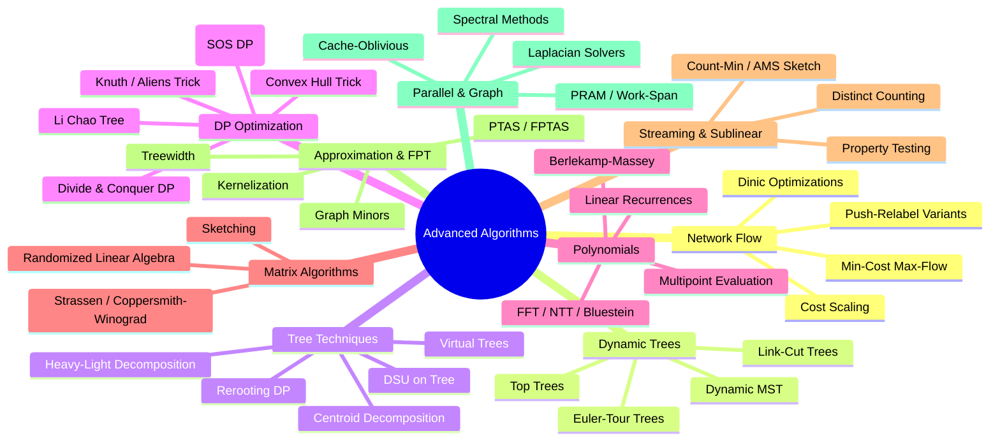

# Section F: Advanced Algorithms

This section covers cutting-edge algorithmic techniques that go well beyond standard interview DSA. Topics here appear in competitive programming World Finals, research papers, and specialized engineering roles (quant trading, compiler optimization, network infrastructure, database internals).

## Topic Map

## Reading Order

| Order | File | Prerequisites | Why Next |
|-------|------|---------------|----------|
| 1 | [network-flow.md](network-flow.md) | [Ch 29: Network Flow](../chapters/ch29-network-flow.md), [Ch 83: Advanced Flow](../chapters/ch83-advanced-flow.md) | Builds on max-flow foundations; min-cost is the natural extension |
| 2 | [dynamic-trees.md](dynamic-trees.md) | [Ch 98: Splay Trees](../chapters/ch98-splay-trees.md), [Ch 157: Link-Cut Trees](../chapters/ch157-link-cut-trees.md) | Forest data structures needed by advanced flow and tree techniques |
| 3 | [tree-techniques.md](tree-techniques.md) | [Ch 84: Tree Algorithms Advanced](./tree-techniques.md), [Ch 107: HLD/Centroid](./tree-techniques.md) | Decomposition techniques used across all tree problems |
| 4 | [dp-optimization.md](dp-optimization.md) | [Ch 86: DP Optimization](../chapters/ch86-dp-optimization.md), [Ch 116: Aliens Trick](../chapters/ch116-alien-trick-parametric.md) | Speed-ups for DP that appear everywhere in CP |
| 5 | [polynomials.md](polynomials.md) | [Ch 167: FFT/NTT](../chapters/ch167-fft-ntt.md), [Ch 171: Berlekamp-Massey](../chapters/ch171-berlekamp-massey.md) | Algebraic tools underlying fast algorithms |
| 6 | [matrix-algorithms.md](matrix-algorithms.md) | [Ch 73: Linear Algebra](../chapters/ch73-linear-algebra.md), [Ch 174: Matrix Exponentiation](../chapters/ch174-matrix-exponentiation.md) | Fast matrix ops power graph algorithms and DP |
| 7 | [streaming-sublinear.md](streaming-sublinear.md) | [Ch 79: Probabilistic DS](../chapters/ch79-probabilistic-ds.md), [Ch 147: Streaming](../chapters/ch147-streaming-algorithms.md) | Big-data models where full input is unavailable |
| 8 | [approximation-fpt.md](approximation-fpt.md) | [Ch 145: Approximation](../chapters/ch145-approximation-algorithms.md), [Ch 148: Parameterized](../chapters/ch148-parameterized-algorithms.md) | Coping with NP-hardness in practice |
| 9 | [parallel-graph-algorithms.md](parallel-graph-algorithms.md) | [Ch 159: External Memory](../chapters/ch159-external-memory.md), [Ch 160: Parallel Algorithms](../chapters/ch160-parallel-algorithms.md) | Scalability: parallel, I/O-efficient, spectral methods |

## Foundations vs. Advanced: What's New

| Category | Covered in Base DSA (chapters/) | NEW in advanced/ |
|----------|--------------------------------|------------------|
| Flow | Ford-Fulkerson, Edmonds-Karp, Dinic, Push-Relabel, MCMF basics | Cost scaling, dynamic trees in flow, Dinic with current-arc + multithreading |
| Trees | HLD, centroid decomposition, LCA, link-cut basics | Virtual trees, tree hashing, DSU on tree, rerooting DP, small-to-large, top trees, Euler-tour trees |
| DP Opt | CHT, divide & conquer DP, Knuth | Aliens trick (parametric search), Li Chao tree, SOS DP, subset convolution, min-plus convolution, Monge/SMAWK |
| Polynomials | FFT, NTT basics | Bluestein FFT, multipoint evaluation, interpolation, formal power series |
| Matrices | Strassen overview, matrix exponentiation | Coppersmith-Winograd, tensor methods, randomized sketching |
| Streaming | Count-Min Sketch, HLL basics | AMS sketch, turnstile/sliding-window streams, sublinear algorithms, property testing |
| Approximation | PTAS definition, basic schemes | Kernelization, treewidth algorithms, graph minors, planar separators |
| Parallel | PRAM basics | Work-span model, work stealing, parallel prefix/sorting, spectral graph algorithms, Laplacian solvers |

## Cross-References to Existing Content

- **Graph fundamentals**: [Ch 22](../chapters/ch22-graph-fundamentals.md), [Ch 28](../chapters/ch28-advanced-graphs.md)
- **Network flow**: [Ch 29](../chapters/ch29-network-flow.md), [Ch 83](../chapters/ch83-advanced-flow.md), [Ch 169](../chapters/ch169-min-cost-max-flow.md)
- **Trees**: [Ch 13](../README.md), [Ch 84](./tree-techniques.md), [Ch 107](./tree-techniques.md), [Ch 108](./tree-techniques.md)
- **DP**: [Ch 31](../chapters/ch31-dp-patterns.md), [Ch 86](../chapters/ch86-dp-optimization.md), [Ch 113](../chapters/ch113-profile-dp.md), [Ch 116](../chapters/ch116-alien-trick-parametric.md), [Ch 117](../chapters/ch117-monotone-queue-optimization.md), [Ch 118](../chapters/ch118-bitset-dp.md), [Ch 188](../chapters/ch188-monotonic-queue-dp.md)
- **Polynomials/FFT**: [Ch 167](../chapters/ch167-fft-ntt.md), [Ch 171](../chapters/ch171-berlekamp-massey.md), [fft-and-polynomial.md](../chapters/fft-and-polynomial.md)
- **Matrices**: [Ch 73](../chapters/ch73-linear-algebra.md), [Ch 174](../chapters/ch174-matrix-exponentiation.md)
- **Probabilistic/streaming**: [Ch 79](../chapters/ch79-probabilistic-ds.md), [Ch 147](../chapters/ch147-streaming-algorithms.md)
- **Approximation/parameterized**: [Ch 145](../chapters/ch145-approximation-algorithms.md), [Ch 148](../chapters/ch148-parameterized-algorithms.md), [Ch 96](../chapters/ch96-np-approximation.md)
- **Parallel/external**: [Ch 159](../chapters/ch159-external-memory.md), [Ch 160](../chapters/ch160-parallel-algorithms.md)
- **Advanced DS**: [Ch 98](../chapters/ch98-splay-trees.md), [Ch 157](../chapters/ch157-link-cut-trees.md), [Ch 106](../chapters/ch106-euler-tour-tree-flattening.md), [Ch 156](../chapters/ch156-dynamic-graph-algorithms.md)
- **Spectral**: [Ch 154](../chapters/ch154-spectral-graph-theory.md)
