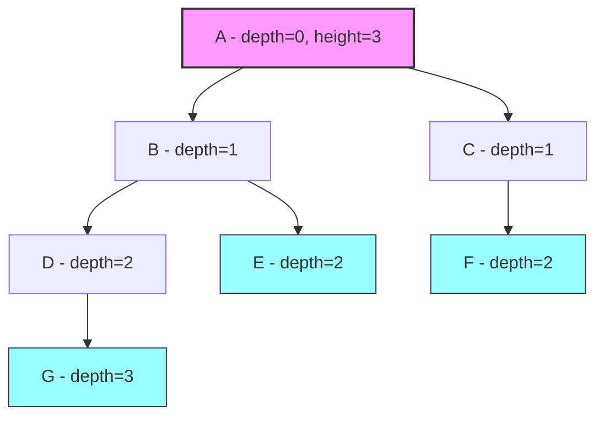
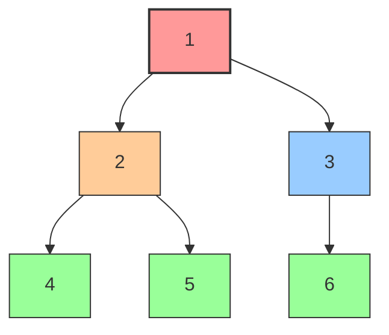
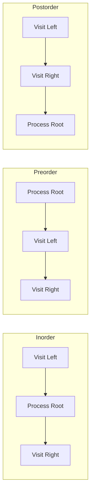

# Chapter 13: Trees

Trees are one of the most important non-linear data structures in computer science. They model hierarchical relationships — file systems, organizational charts, HTML DOM, and much more. Binary trees are the foundation for binary search trees, heaps, and many advanced data structures. Tree problems are extremely common in coding interviews, testing your ability to think recursively and iteratively.

---

## 13.1 Tree Terminology

Before diving into code, let's establish precise terminology:

| Term | Definition | Example |
|------|-----------|---------|
| **Root** | The topmost node (no parent) | Node A |
| **Parent** | A node's immediate predecessor | B is parent of D |
| **Child** | A node's immediate successor | D is child of B |
| **Leaf** | A node with no children | E, F, G, H |
| **Internal** | A node with at least one child | B, C |
| **Sibling** | Nodes sharing the same parent | D and E are siblings |
| **Ancestor** | Any node on the path from root to the node | A, B are ancestors of D |
| **Descendant** | Any node in the subtree rooted at the node | D, E are descendants of B |
| **Depth** | Distance from root to the node (root has depth 0) | B has depth 1 |
| **Height** | Distance from the node to its deepest leaf | Tree height = 3 |
| **Level** | All nodes at the same depth | Level 2: D, E, F, G |
| **Degree** | Number of children of a node | B has degree 2 |
| **Subtree** | A node and all its descendants | The subtree rooted at B |

### Example Tree



*Leaves (G, E, F) highlighted in cyan. Root (A) highlighted in pink.*

- **Height of tree** = 3 (longest path from root to leaf: A→B→D→G)
- **Depth of E** = 2 (path from root: A→B→E)
- **Leaves**: G, E, F
- **Internal nodes**: A, B, C, D

---

## 13.2 Binary Trees

A **binary tree** is a tree where each node has **at most two children**, called the **left child** and **right child**.

### Types of Binary Trees

```
Full Binary Tree:         Complete Binary Tree:     Perfect Binary Tree:
       1                       1                         1
      / \                     / \                       / \
     2   3                   2   3                     2   3
    / \                     / \                       / \ / \
   4   5                   4   5                     4  5 6  7
                          /

Balanced Binary Tree:     Degenerate (Skewed):
       1                       1
      / \                       \
     2   3                       2
    / \                           \
   4   5                           3
                                    \
                                     4
```

| Type | Definition | Properties |
|------|-----------|------------|
| **Full** | Every node has 0 or 2 children | Leaves = internal nodes + 1 |
| **Complete** | All levels full except possibly the last, which is filled left to right | Used in heaps |
| **Perfect** | All internal nodes have 2 children, all leaves at same level | \\(2^{h+1} - 1\\) nodes |
| **Balanced** | Height is O(log n) | AVL trees, Red-Black trees |

### Node Structure

```cpp
struct TreeNode {
    int val;
    TreeNode* left;
    TreeNode* right;
    TreeNode(int x) : val(x), left(nullptr), right(nullptr) {}
};
```

---

## 13.3 Tree Traversals

Tree traversals visit every node in a specific order. There are two main categories: **depth-first** (inorder, preorder, postorder) and **breadth-first** (level-order).

### Traversal Visualization

The following diagram shows how each traversal order visits the same tree differently:



| Traversal | Visit Order | Result on Above Tree |
|-----------|-------------|----------------------|
| **Inorder** (L→Root→R) | 4, **2**, 5, **1**, 3, 6 | `4 2 5 1 3 6` |
| **Preorder** (Root→L→R) | **1**, **2**, 4, 5, **3**, 6 | `1 2 4 5 3 6` |
| **Postorder** (L→R→Root) | 4, 5, **2**, 6, **3**, **1** | `4 5 2 6 3 1` |

### Inorder Traversal (Left → Root → Right)

**Intuition:** For each node, we visit its left subtree first, then the node itself, then its right subtree. For a BST, this produces values in sorted order — think of it as "visit nodes from smallest to largest."

**Why Left → Root → Right?** In a BST, all values smaller than the root are in the left subtree, and all values larger are in the right subtree. So visiting left first, then root, then right gives us ascending order.

**Recursive thinking:** Trust that the recursive calls work. For each node:
1. Recursively traverse the left subtree (trust it returns sorted left values).
2. Process the current node.
3. Recursively traverse the right subtree (trust it returns sorted right values).

```cpp
#include <iostream>
#include <vector>
#include <stack>

struct TreeNode {
    int val;
    TreeNode* left;
    TreeNode* right;
    TreeNode(int x) : val(x), left(nullptr), right(nullptr) {}
};

// Recursive inorder
// Time: O(n), Space: O(h) where h is the height
void inorderRecursive(TreeNode* root, std::vector<int>& result) {
    if (!root) return;
    inorderRecursive(root->left, result);
    result.push_back(root->val);
    inorderRecursive(root->right, result);
}

// Iterative inorder using explicit stack
std::vector<int> inorderIterative(TreeNode* root) {
    std::vector<int> result;
    std::stack<TreeNode*> stk;
    TreeNode* curr = root;
    
    while (curr || !stk.empty()) {
        // Go as far left as possible
        while (curr) {
            stk.push(curr);
            curr = curr->left;
        }
        // Process the node
        curr = stk.top();
        stk.pop();
        result.push_back(curr->val);
        // Move to right subtree
        curr = curr->right;
    }
    return result;
}
```

**Dry Run: Iterative Inorder** on this tree:
```
      1
     / \
    2   3
   / \
  4   5
```

```
Step  | curr | stack (top→)  | action              | result
------|------|---------------|----------------------|--------
  1   |  1   | []            | push 1, go left      | []
  2   |  2   | [1]           | push 2, go left      | []
  3   |  4   | [2,1]         | push 4, go left      | []
  4   | null | [4,2,1]       | pop 4, add to result | [4]
  5   | null | [2,1]         | pop 2, add to result | [4,2]
  6   |  5   | [1]           | go right to 5        | [4,2]
  7   |  5   | [1]           | push 5, go left      | [4,2]
  8   | null | [5,1]         | pop 5, add to result | [4,2,5]
  9   | null | [1]           | pop 1, add to result | [4,2,5,1]
  10  |  3   | []            | go right to 3        | [4,2,5,1]
  11  |  3   | []            | push 3, go left      | [4,2,5,1]
  12  | null | [3]           | pop 3, add to result | [4,2,5,1,3]
  13  | null | []            | done!                | [4,2,5,1,3]
```

**Key insight:** The stack simulates the recursion. We go as far left as possible (pushing nodes), then pop and process, then go right. This "go left, process, go right" pattern is exactly what the recursive version does.

### Preorder Traversal (Root → Left → Right)

**Intuition:** Process the current node before its children. Think of it as "report yourself, then your subtrees." This is useful for:
- **Serializing a tree:** preorder gives you the root first, so you can reconstruct the tree.
- **Copying a tree:** you create the root before its children.
- **Prefix expressions:** in expression trees, preorder gives prefix notation.

```cpp
// Recursive preorder
void preorderRecursive(TreeNode* root, std::vector<int>& result) {
    if (!root) return;
    result.push_back(root->val);
    preorderRecursive(root->left, result);
    preorderRecursive(root->right, result);
}

// Iterative preorder
std::vector<int> preorderIterative(TreeNode* root) {
    std::vector<int> result;
    if (!root) return result;
    
    std::stack<TreeNode*> stk;
    stk.push(root);
    
    while (!stk.empty()) {
        TreeNode* node = stk.top();
        stk.pop();
        result.push_back(node->val);
        
        // Push right first so left is processed first (LIFO)
        if (node->right) stk.push(node->right);
        if (node->left) stk.push(node->left);
    }
    return result;
}
```

### Postorder Traversal (Left → Right → Root)

**Intuition:** Process children before the parent. Think of it as "handle the subtrees, then clean up the root." This is useful for:
- **Deleting a tree:** you must delete children before the parent (otherwise you lose the reference).
- **Computing directory sizes:** sum up subdirectory sizes before the parent directory.
- **Postfix expressions:** in expression trees, postfix gives the result of evaluation.

**Key difference from preorder:** In preorder, we push the right child before the left (so left is processed first). In postorder using two stacks, we push left before right to stack1, which reverses the order in stack2.

```cpp
// Recursive postorder
void postorderRecursive(TreeNode* root, std::vector<int>& result) {
    if (!root) return;
    postorderRecursive(root->left, result);
    postorderRecursive(root->right, result);
    result.push_back(root->val);
}

// Iterative postorder using two stacks
std::vector<int> postorderIterative(TreeNode* root) {
    std::vector<int> result;
    if (!root) return result;
    
    std::stack<TreeNode*> stk1, stk2;
    stk1.push(root);
    
    while (!stk1.empty()) {
        TreeNode* node = stk1.top();
        stk1.pop();
        stk2.push(node);
        
        if (node->left) stk1.push(node->left);
        if (node->right) stk1.push(node->right);
    }
    
    while (!stk2.empty()) {
        result.push_back(stk2.top()->val);
        stk2.pop();
    }
    return result;
}

// Iterative postorder using one stack
std::vector<int> postorderOneStack(TreeNode* root) {
    std::vector<int> result;
    std::stack<TreeNode*> stk;
    TreeNode* lastVisited = nullptr;
    TreeNode* curr = root;
    
    while (curr || !stk.empty()) {
        while (curr) {
            stk.push(curr);
            curr = curr->left;
        }
        TreeNode* peekNode = stk.top();
        // If right child exists and hasn't been visited yet
        if (peekNode->right && peekNode->right != lastVisited) {
            curr = peekNode->right;
        } else {
            result.push_back(peekNode->val);
            lastVisited = peekNode;
            stk.pop();
        }
    }
    return result;
}
```

### Traversal Flow Diagrams

Each traversal follows a distinct recursive pattern:



### Comparison of Traversals

| Traversal | Order | BST Result | Use Case |
|-----------|-------|------------|----------|
| Inorder | L → Root → R | Sorted order | BST validation, sorted output |
| Preorder | Root → L → R | N/A | Serialize tree, copy tree |
| Postorder | L → R → Root | N/A | Delete tree, evaluate expression |
| Level-order | Level by level | N/A | BFS, shortest path |

### Complete Example

```cpp
#include <iostream>
#include <vector>
#include <stack>
#include <queue>

struct TreeNode {
    int val;
    TreeNode* left;
    TreeNode* right;
    TreeNode(int x) : val(x), left(nullptr), right(nullptr) {}
};

// Build the example tree
//       1
//      / \
//     2   3
//    / \   \
//   4   5   6
TreeNode* buildExampleTree() {
    TreeNode* root = new TreeNode(1);
    root->left = new TreeNode(2);
    root->right = new TreeNode(3);
    root->left->left = new TreeNode(4);
    root->left->right = new TreeNode(5);
    root->right->right = new TreeNode(6);
    return root;
}

void freeTree(TreeNode* root) {
    if (!root) return;
    freeTree(root->left);
    freeTree(root->right);
    delete root;
}

int main() {
    TreeNode* root = buildExampleTree();
    
    std::vector<int> inorder;
    inorderRecursive(root, inorder);
    std::cout << "Inorder:   ";
    for (int v : inorder) std::cout << v << " ";
    std::cout << "\n"; // 4 2 5 1 3 6
    
    auto preorder = preorderIterative(root);
    std::cout << "Preorder:  ";
    for (int v : preorder) std::cout << v << " ";
    std::cout << "\n"; // 1 2 4 5 3 6
    
    auto postorder = postorderIterative(root);
    std::cout << "Postorder: ";
    for (int v : postorder) std::cout << v << " ";
    std::cout << "\n"; // 4 5 2 6 3 1
    
    freeTree(root);
    return 0;
}
```

---

## 13.4 Level Order Traversal

### BFS Approach

Level-order traversal uses a queue to visit nodes level by level.

**Intuition:** Imagine dropping a stone in a pond — the ripples expand outward in concentric circles. Level-order traversal does the same: start at the root (level 0), visit all nodes at distance 1 (level 1), then distance 2 (level 2), and so on. The queue ensures we process nodes in the order we discover them (FIFO).

**Why a queue?** We need to process nodes in the order we find them. A stack would give us DFS (deepest first), but a queue gives us BFS (closest first).

```cpp
#include <iostream>
#include <vector>
#include <queue>

struct TreeNode {
    int val;
    TreeNode* left;
    TreeNode* right;
    TreeNode(int x) : val(x), left(nullptr), right(nullptr) {}
};

// Level-order traversal
// Time: O(n), Space: O(n)
std::vector<std::vector<int>> levelOrder(TreeNode* root) {
    std::vector<std::vector<int>> result;
    if (!root) return result;
    
    std::queue<TreeNode*> q;
    q.push(root);
    
    while (!q.empty()) {
        int levelSize = q.size();
        std::vector<int> level;
        
        for (int i = 0; i < levelSize; ++i) {
            TreeNode* node = q.front();
            q.pop();
            level.push_back(node->val);
            
            if (node->left) q.push(node->left);
            if (node->right) q.push(node->right);
        }
        
        result.push_back(level);
    }
    return result;
}

// Zigzag level-order traversal
std::vector<std::vector<int>> zigzagLevelOrder(TreeNode* root) {
    std::vector<std::vector<int>> result;
    if (!root) return result;
    
    std::queue<TreeNode*> q;
    q.push(root);
    bool leftToRight = true;
    
    while (!q.empty()) {
        int levelSize = q.size();
        std::vector<int> level(levelSize);
        
        for (int i = 0; i < levelSize; ++i) {
            TreeNode* node = q.front();
            q.pop();
            
            int index = leftToRight ? i : levelSize - 1 - i;
            level[index] = node->val;
            
            if (node->left) q.push(node->left);
            if (node->right) q.push(node->right);
        }
        
        result.push_back(level);
        leftToRight = !leftToRight;
    }
    return result;
}

// Reverse level order (bottom-up)
std::vector<std::vector<int>> levelOrderBottom(TreeNode* root) {
    auto result = levelOrder(root);
    std::reverse(result.begin(), result.end());
    return result;
}

int main() {
    //       3
    //      / \
    //     9  20
    //       /  \
    //      15   7
    TreeNode* root = new TreeNode(3);
    root->left = new TreeNode(9);
    root->right = new TreeNode(20);
    root->right->left = new TreeNode(15);
    root->right->right = new TreeNode(7);
    
    auto levels = levelOrder(root);
    std::cout << "Level order:\n";
    for (int i = 0; i < levels.size(); ++i) {
        std::cout << "  Level " << i << ": ";
        for (int v : levels[i]) std::cout << v << " ";
        std::cout << "\n";
    }
    
    auto zigzag = zigzagLevelOrder(root);
    std::cout << "Zigzag order:\n";
    for (int i = 0; i < zigzag.size(); ++i) {
        std::cout << "  Level " << i << ": ";
        for (int v : zigzag[i]) std::cout << v << " ";
        std::cout << "\n";
    }
    
    // Cleanup
    delete root->left;
    delete root->right->left;
    delete root->right->right;
    delete root->right;
    delete root;
    return 0;
}
```

---

## 13.5 Tree Properties

### Height (Maximum Depth)

```cpp
#include <iostream>
#include <algorithm>

struct TreeNode {
    int val;
    TreeNode* left;
    TreeNode* right;
    TreeNode(int x) : val(x), left(nullptr), right(nullptr) {}
};

// Maximum depth / height
// Time: O(n), Space: O(h)
int maxDepth(TreeNode* root) {
    if (!root) return 0;
    return 1 + std::max(maxDepth(root->left), maxDepth(root->right));
}

// Minimum depth
int minDepth(TreeNode* root) {
    if (!root) return 0;
    if (!root->left) return 1 + minDepth(root->right);
    if (!root->right) return 1 + minDepth(root->left);
    return 1 + std::min(minDepth(root->left), minDepth(root->right));
}
```

### Diameter

The diameter of a tree is the length of the longest path between any two nodes.

```cpp
#include <iostream>
#include <algorithm>

struct TreeNode {
    int val;
    TreeNode* left;
    TreeNode* right;
    TreeNode(int x) : val(x), left(nullptr), right(nullptr) {}
};

// Diameter = max(leftHeight + rightHeight) across all nodes
// Time: O(n), Space: O(h)
int diameterOfBinaryTree(TreeNode* root, int& diameter) {
    if (!root) return 0;
    
    int leftHeight = diameterOfBinaryTree(root->left, diameter);
    int rightHeight = diameterOfBinaryTree(root->right, diameter);
    
    // Update diameter at this node
    diameter = std::max(diameter, leftHeight + rightHeight);
    
    return 1 + std::max(leftHeight, rightHeight);
}

int diameterOfBinaryTree(TreeNode* root) {
    int diameter = 0;
    diameterOfBinaryTree(root, diameter);
    return diameter;
}
```

### Is Balanced

A tree is balanced if the height difference between left and right subtrees is at most 1 for every node.

```cpp
// Check if tree is balanced
// Time: O(n), Space: O(h)
int checkBalance(TreeNode* root) {
    if (!root) return 0;
    
    int left = checkBalance(root->left);
    if (left == -1) return -1; // Left subtree is unbalanced
    
    int right = checkBalance(root->right);
    if (right == -1) return -1; // Right subtree is unbalanced
    
    if (std::abs(left - right) > 1) return -1; // Current node is unbalanced
    
    return 1 + std::max(left, right);
}

bool isBalanced(TreeNode* root) {
    return checkBalance(root) != -1;
}
```

### Is Symmetric

```cpp
// Check if tree is symmetric (mirror of itself)
bool isMirror(TreeNode* left, TreeNode* right) {
    if (!left && !right) return true;
    if (!left || !right) return false;
    return left->val == right->val &&
           isMirror(left->left, right->right) &&
           isMirror(left->right, right->left);
}

bool isSymmetric(TreeNode* root) {
    if (!root) return true;
    return isMirror(root->left, root->right);
}
```

### Width (Maximum Nodes at Any Level)

```cpp
#include <queue>

// Maximum width of binary tree
// Width = number of nodes at the widest level
int maxWidth(TreeNode* root) {
    if (!root) return 0;
    
    std::queue<std::pair<TreeNode*, unsigned long long>> q;
    q.push({root, 0});
    int maxWidth = 0;
    
    while (!q.empty()) {
        int levelSize = q.size();
        unsigned long long minIndex = q.front().second;
        unsigned long long first = 0, last = 0;
        
        for (int i = 0; i < levelSize; ++i) {
            auto [node, index] = q.front();
            q.pop();
            unsigned long long normalizedIndex = index - minIndex;
            
            if (i == 0) first = normalizedIndex;
            if (i == levelSize - 1) last = normalizedIndex;
            
            if (node->left) q.push({node->left, 2 * normalizedIndex});
            if (node->right) q.push({node->right, 2 * normalizedIndex + 1});
        }
        
        maxWidth = std::max(maxWidth, (int)(last - first + 1));
    }
    return maxWidth;
}
```

---

## 13.6 Constructing Trees

### From Preorder and Inorder

Given preorder `[3,9,20,15,7]` and inorder `[9,3,15,20,7]`, construct the binary tree.

**Key insight:** The first element of preorder is always the root. Find the root in inorder — everything to its left is the left subtree, everything to its right is the right subtree.

```cpp
#include <iostream>
#include <vector>
#include <unordered_map>

struct TreeNode {
    int val;
    TreeNode* left;
    TreeNode* right;
    TreeNode(int x) : val(x), left(nullptr), right(nullptr) {}
};

// Build tree from preorder and inorder
// Time: O(n), Space: O(n)
TreeNode* buildTree(const std::vector<int>& preorder, int& preIndex,
                    const std::vector<int>& inorder, int inStart, int inEnd,
                    std::unordered_map<int, int>& inMap) {
    if (inStart > inEnd) return nullptr;
    
    int rootVal = preorder[preIndex++];
    TreeNode* root = new TreeNode(rootVal);
    
    int inIndex = inMap[rootVal];
    
    root->left = buildTree(preorder, preIndex, inorder, inStart, inIndex - 1, inMap);
    root->right = buildTree(preorder, preIndex, inorder, inIndex + 1, inEnd, inMap);
    
    return root;
}

TreeNode* buildTree(std::vector<int>& preorder, std::vector<int>& inorder) {
    std::unordered_map<int, int> inMap;
    for (int i = 0; i < inorder.size(); ++i) {
        inMap[inorder[i]] = i;
    }
    int preIndex = 0;
    return buildTree(preorder, preIndex, inorder, 0, inorder.size() - 1, inMap);
}
```

**Dry Run:**

```
preorder = [3, 9, 20, 15, 7]
inorder  = [9, 3, 15, 20, 7]

Step 1: root = 3 (first in preorder)
        In inorder: 9 | 3 | 15,20,7
        Left subtree: inorder [9], preorder [9]
        Right subtree: inorder [15,20,7], preorder [20,15,7]

Step 2 (left): root = 9, no children → leaf

Step 3 (right): root = 20 (first in remaining preorder)
        In inorder: 15 | 20 | 7
        Left: [15], Right: [7]

Result:
        3
       / \
      9  20
        /  \
       15   7
```

### From Inorder and Postorder

```cpp
// Build tree from inorder and postorder
// Key insight: last element of postorder is the root
TreeNode* buildTreePost(std::vector<int>& inorder, std::vector<int>& postorder) {
    std::unordered_map<int, int> inMap;
    for (int i = 0; i < inorder.size(); ++i) {
        inMap[inorder[i]] = i;
    }
    
    int postIndex = postorder.size() - 1;
    
    std::function<TreeNode*(int, int)> build = [&](int inStart, int inEnd) -> TreeNode* {
        if (inStart > inEnd) return nullptr;
        
        int rootVal = postorder[postIndex--];
        TreeNode* root = new TreeNode(rootVal);
        
        int inIndex = inMap[rootVal];
        
        // Build right subtree first (because postorder processes right before left)
        root->right = build(inIndex + 1, inEnd);
        root->left = build(inStart, inIndex - 1);
        
        return root;
    };
    
    return build(0, inorder.size() - 1);
}
```

### Serialize and Deserialize

```cpp
#include <iostream>
#include <string>
#include <sstream>
#include <queue>

struct TreeNode {
    int val;
    TreeNode* left;
    TreeNode* right;
    TreeNode(int x) : val(x), left(nullptr), right(nullptr) {}
};

class Codec {
public:
    // Serialize using preorder with null markers
    std::string serialize(TreeNode* root) {
        if (!root) return "null";
        return std::to_string(root->val) + "," +
               serialize(root->left) + "," +
               serialize(root->right);
    }
    
    // Deserialize
    TreeNode* deserialize(const std::string& data) {
        std::istringstream iss(data);
        return deserializeHelper(iss);
    }

private:
    TreeNode* deserializeHelper(std::istringstream& iss) {
        std::string token;
        std::getline(iss, token, ',');
        
        if (token == "null") return nullptr;
        
        TreeNode* node = new TreeNode(std::stoi(token));
        node->left = deserializeHelper(iss);
        node->right = deserializeHelper(iss);
        return node;
    }
};

void freeTree(TreeNode* root) {
    if (!root) return;
    freeTree(root->left);
    freeTree(root->right);
    delete root;
}

int main() {
    TreeNode* root = new TreeNode(1);
    root->left = new TreeNode(2);
    root->right = new TreeNode(3);
    root->right->left = new TreeNode(4);
    root->right->right = new TreeNode(5);
    
    Codec codec;
    std::string serialized = codec.serialize(root);
    std::cout << "Serialized: " << serialized << "\n";
    // Output: 1,2,null,null,3,4,null,null,5,null,null
    
    TreeNode* deserialized = codec.deserialize(serialized);
    std::string reserialized = codec.serialize(deserialized);
    std::cout << "Reserialized: " << reserialized << "\n";
    std::cout << "Match: " << (serialized == reserialized ? "yes" : "no") << "\n";
    
    freeTree(root);
    freeTree(deserialized);
    return 0;
}
```

---

## 13.7 N-ary Trees

An N-ary tree is a tree where each node can have **up to N children**.

### Representation

```cpp
#include <iostream>
#include <vector>
#include <queue>

struct NaryNode {
    int val;
    std::vector<NaryNode*> children;
    
    NaryNode(int x) : val(x) {}
    NaryNode(int x, std::vector<NaryNode*> c) : val(x), children(c) {}
};

// Preorder traversal (root first, then children)
void preorder(NaryNode* root, std::vector<int>& result) {
    if (!root) return;
    result.push_back(root->val);
    for (NaryNode* child : root->children) {
        preorder(child, result);
    }
}

// Postorder traversal (children first, then root)
void postorder(NaryNode* root, std::vector<int>& result) {
    if (!root) return;
    for (NaryNode* child : root->children) {
        postorder(child, result);
    }
    result.push_back(root->val);
}

// Level-order traversal
std::vector<std::vector<int>> levelOrder(NaryNode* root) {
    std::vector<std::vector<int>> result;
    if (!root) return result;
    
    std::queue<NaryNode*> q;
    q.push(root);
    
    while (!q.empty()) {
        int levelSize = q.size();
        std::vector<int> level;
        
        for (int i = 0; i < levelSize; ++i) {
            NaryNode* node = q.front();
            q.pop();
            level.push_back(node->val);
            
            for (NaryNode* child : node->children) {
                q.push(child);
            }
        }
        
        result.push_back(level);
    }
    return result;
}

// Maximum depth
int maxDepth(NaryNode* root) {
    if (!root) return 0;
    int maxChildDepth = 0;
    for (NaryNode* child : root->children) {
        maxChildDepth = std::max(maxChildDepth, maxDepth(child));
    }
    return 1 + maxChildDepth;
}

int main() {
    //       1
    //     / | \
    //    3  2  4
    //   / \
    //  5   6
    NaryNode* root = new NaryNode(1, {
        new NaryNode(3, {new NaryNode(5), new NaryNode(6)}),
        new NaryNode(2),
        new NaryNode(4)
    });
    
    std::vector<int> pre;
    preorder(root, pre);
    std::cout << "Preorder: ";
    for (int v : pre) std::cout << v << " ";
    std::cout << "\n"; // 1 3 5 6 2 4
    
    auto levels = levelOrder(root);
    std::cout << "Level order:\n";
    for (int i = 0; i < levels.size(); ++i) {
        std::cout << "  Level " << i << ": ";
        for (int v : levels[i]) std::cout << v << " ";
        std::cout << "\n";
    }
    
    std::cout << "Max depth: " << maxDepth(root) << "\n"; // 3
    
    // Cleanup
    for (auto child : root->children) {
        for (auto grandchild : child->children) {
            delete grandchild;
        }
        delete child;
    }
    delete root;
    
    return 0;
}
```

---

## Interview Tips

1. **Think recursively first.** Most tree problems have elegant recursive solutions. Write the recursive version, then optimize if needed.
2. **Identify the base case.** Usually `if (!root) return ...;`
3. **Use the "leap of faith."** Trust that your recursive calls work correctly for subtrees.
4. **Know all four traversals.** Be able to write inorder, preorder, postorder, and level-order from memory.
5. **Morris traversal** is a bonus — O(n) time, O(1) space inorder traversal using threading. Mention it if asked about space optimization.
6. **Handle edge cases:** empty tree, single node, left-skewed, right-skewed.

## Common Mistakes

| Mistake | Example | Fix |
|---------|---------|-----|
| Null pointer dereference | `root->left` without checking `root` | Check `if (!root)` first |
| Wrong traversal order | Preorder instead of inorder | Memorize the order |
| Forgetting to free memory | Leaking tree nodes | Delete all nodes in postorder |
| Off-by-one in level order | Wrong `levelSize` | Capture size before the loop |
| Wrong index in construction | Off-by-one in subtree boundaries | Double-check inclusive/exclusive bounds |
| Stack overflow on skewed tree | Deep recursion on a chain | Use iterative approach |

---

## Practice Problems

### Easy

1. **Maximum Depth of Binary Tree** — Find the maximum depth.
   - *Hint:* `1 + max(depth(left), depth(right))`

2. **Invert Binary Tree** — Mirror a binary tree.
   - *Hint:* Swap left and right children, recurse on subtrees.

3. **Same Tree** — Check if two trees are identical.
   - *Hint:* Compare roots, then recursively compare left and right subtrees.

4. **Symmetric Tree** — Check if a tree is a mirror of itself.
   - *Hint:* Compare left subtree with reversed right subtree.

### Medium

5. **Path Sum** — Check if there exists a root-to-leaf path with a given sum.
   - *Hint:* Subtract current value from sum, recurse on children. At leaf, check if sum == 0.

6. **Binary Tree Right Side View** — Return the values visible from the right side.
   - *Hint:* Level-order traversal, take the last element of each level.

7. **Lowest Common Ancestor** — Find the LCA of two nodes.
   - *Hint:* If both nodes are in left subtree, LCA is in left. If both in right, LCA is in right. Otherwise, current node is LCA.

### Hard

8. **Serialize and Deserialize Binary Tree** — Convert a tree to string and back.
   - *Hint:* Preorder with null markers, or level-order with null markers.

9. **Binary Tree Maximum Path Sum** — Find the maximum path sum (path can start and end at any node).
   - *Hint:* At each node, compute max path through this node (left + root + right). Return max single path (root + max(left, right)).

10. **Count Good Nodes** — Count nodes where no ancestor has a greater value.
    - *Hint:* DFS with the maximum value seen so far on the path.

---

## Complexity Summary

| Operation | Time | Space |
|-----------|------|-------|
| Traversals (all) | O(n) | O(n) worst case, O(log n) balanced |
| Height/Depth | O(n) | O(h) |
| Diameter | O(n) | O(h) |
| Is Balanced | O(n) | O(h) |
| Is Symmetric | O(n) | O(h) |
| Build from traversals | O(n) | O(n) |
| Serialize/Deserialize | O(n) | O(n) |
| Level-order | O(n) | O(n) |

---

## See Also

- [Chapter 14: Binary Search Trees](ch14-bst.md) — Trees with ordering property; enables O(log n) search, insert, and delete.
- [Chapter 98: Splay Trees](ch98-splay-trees.md) — Self-adjusting BSTs that bring accessed nodes to the root; excellent for temporal locality.
- [Chapter 99: Scapegoat and AA Trees](ch99-scapegoat-aa-trees.md) — Simpler balanced BST alternatives: Scapegoat trees use rebuilds, AA trees use simplified red-black rules.
- [Chapter 15: Heaps](ch15-heaps.md) — Another tree-based structure optimized for priority queue operations.
- [Chapter 16: Trie](ch16-trie.md) — A tree specialized for string prefix matching.
- [Chapter 21: Binary Lifting and LCA](ch21-binary-lifting-lca.md) — Tree algorithms for finding lowest common ancestors efficiently.
- [Chapter 57: Trees Expanded](ch57-trees-expanded.md) — Additional tree topics and advanced patterns.
