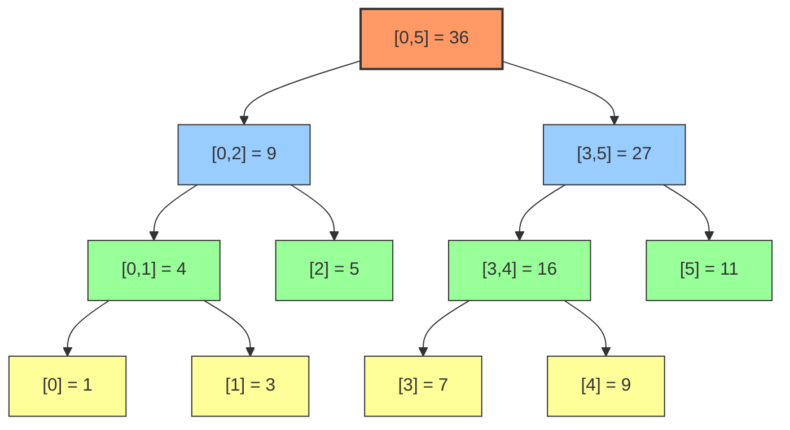
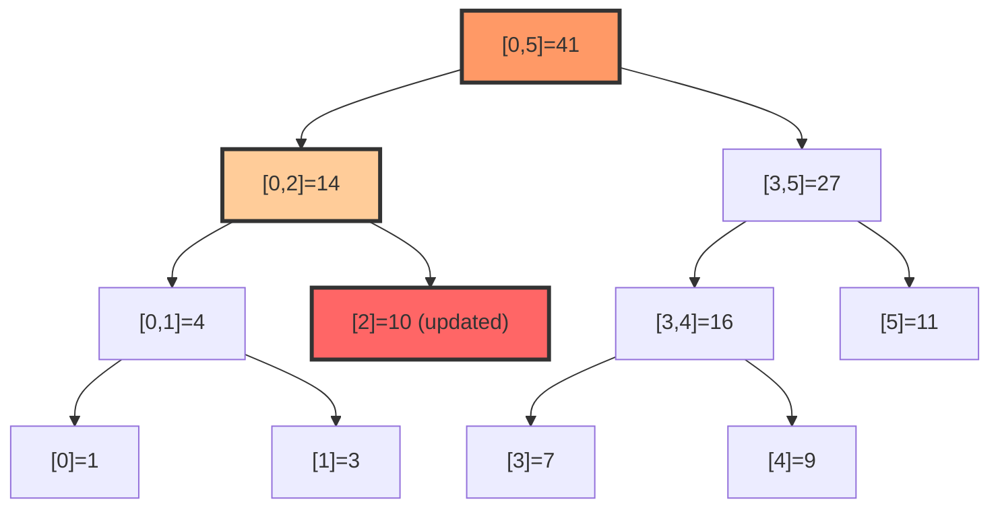
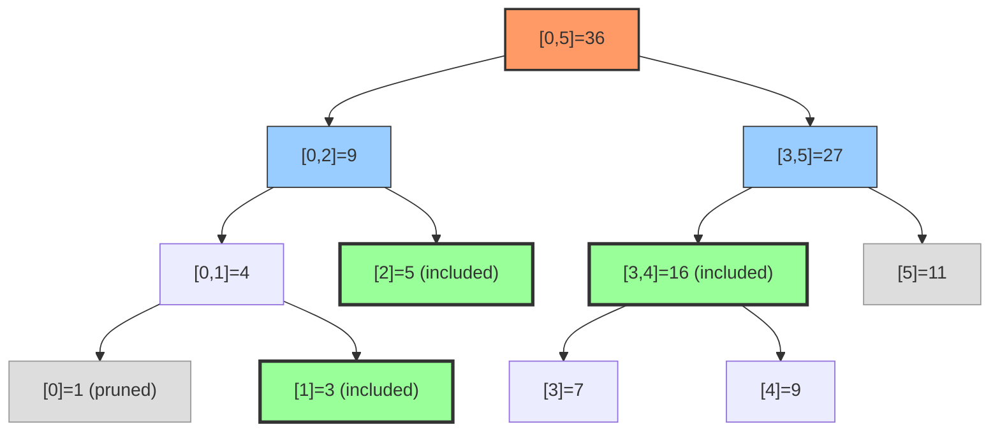

# Chapter 18: Segment Tree

## 18.1 Motivation

### The Range Query Problem

Given an array of n numbers, you need to answer queries of the form: "What is the sum (or min, or max) of elements from index l to index r?"

**Brute force**: Scan from l to r for each query. Time: O(n) per query, O(qn) for q queries.

For n = 10^6 and q = 10^6, this is 10^12 operations — far too slow.

**Prefix sums**: Precompute prefix sums in O(n). Each range sum query is O(1). But what if the array is updated between queries?

| Approach | Build | Query | Update | Notes |
|----------|-------|-------|--------|-------|
| Brute force | O(1) | O(n) | O(1) | Too slow for many queries |
| Prefix sums | O(n) | O(1) | O(n) | Can't handle updates efficiently |
| **Segment tree** | **O(n)** | **O(log n)** | **O(log n)** | **Best of both worlds** |

The segment tree is the answer when you need **both** efficient range queries **and** efficient point/range updates.

### When Do You Need a Segment Tree?

- Range sum/min/max queries with point updates
- Range sum/min/max queries with range updates (lazy propagation)
- Range queries on 2D arrays
- Problems requiring merging of information from subranges

---

## 18.2 Structure

A segment tree is a **binary tree** where each node represents an interval (segment) of the array.

- The **root** represents the entire array [0, n-1]
- Each **internal node** [l, r] is split into two children:
  - Left child: [l, mid] where mid = (l+r)/2
  - Right child: [mid+1, r]
- Each **leaf** represents a single element

### Visual Diagram

For array `[1, 3, 5, 7, 9, 11]` (range sum):



*Root (orange) spans the entire array. Internal nodes (blue/green) store merged sums. Leaves (yellow) store individual elements.*

Each node stores the sum of its interval. The leaf nodes store individual array elements.

### Array Representation

Like a heap, we can store the segment tree in an array for better cache performance:

```
tree[1] = sum of [0, n-1]        (root)
tree[2] = sum of [0, mid]        (left child of root)
tree[3] = sum of [mid+1, n-1]    (right child of root)
...
tree[i] has children tree[2i] and tree[2i+1]
```

**Size**: A segment tree for n elements needs at most 4n nodes (2 * next power of 2 * 2).

### Why 4n?

The segment tree is a full binary tree. If n is a power of 2, the tree has exactly 2n-1 nodes. If n is not a power of 2, we need the next power of 2, which is at most 2n. So the tree has at most 2*(2n) = 4n nodes.

---

## 18.3 Point Updates

When a single element changes, we need to update all nodes on the path from the leaf to the root — exactly O(log n) nodes.

### Recursive Implementation

```cpp
#include <iostream>
#include <vector>
#include <functional>
#include <climits>

class SegmentTree {
private:
    int n;
    std::vector<long long> tree;

    // Build the tree recursively
    void build(const std::vector<int>& arr, int node, int start, int end) {
        if (start == end) {
            // Leaf node
            tree[node] = arr[start];
        } else {
            int mid = (start + end) / 2;
            build(arr, 2 * node, start, mid);
            build(arr, 2 * node + 1, mid + 1, end);
            tree[node] = tree[2 * node] + tree[2 * node + 1];
        }
    }

    // Point update: set arr[idx] to val
    void update(int node, int start, int end, int idx, long long val) {
        if (start == end) {
            // Leaf node — update the value
            tree[node] = val;
        } else {
            int mid = (start + end) / 2;
            if (idx <= mid) {
                update(2 * node, start, mid, idx, val);
            } else {
                update(2 * node + 1, mid + 1, end, idx, val);
            }
            // Recompute parent from children
            tree[node] = tree[2 * node] + tree[2 * node + 1];
        }
    }

    // Range query: sum of [l, r]
    long long query(int node, int start, int end, int l, int r) const {
        if (r < start || end < l) {
            // Completely outside the query range
            return 0;
        }
        if (l <= start && end <= r) {
            // Completely inside the query range
            return tree[node];
        }
        // Partially inside — query both children
        int mid = (start + end) / 2;
        long long leftSum = query(2 * node, start, mid, l, r);
        long long rightSum = query(2 * node + 1, mid + 1, end, l, r);
        return leftSum + rightSum;
    }

public:
    SegmentTree(const std::vector<int>& arr) : n(static_cast<int>(arr.size())) {
        tree.resize(4 * n);
        build(arr, 1, 0, n - 1);
    }

    // Public interface: update arr[idx] to val
    void update(int idx, long long val) {
        update(1, 0, n - 1, idx, val);
    }

    // Public interface: query sum of [l, r]
    long long query(int l, int r) const {
        return query(1, 0, n - 1, l, r);
    }
};

int main() {
    std::vector<int> arr = {1, 3, 5, 7, 9, 11};
    SegmentTree st(arr);

    // Query sum of [1, 3] → 3 + 5 + 7 = 15
    std::cout << "Sum [1,3]: " << st.query(1, 3) << "\n";

    // Query sum of [0, 5] → 36
    std::cout << "Sum [0,5]: " << st.query(0, 5) << "\n";

    // Update arr[2] = 10 (was 5)
    st.update(2, 10);

    // Query sum of [1, 3] → 3 + 10 + 7 = 20
    std::cout << "Sum [1,3] after update: " << st.query(1, 3) << "\n";

    // Query sum of [0, 5] → 1 + 3 + 10 + 7 + 9 + 11 = 41
    std::cout << "Sum [0,5] after update: " << st.query(0, 5) << "\n";

    return 0;
}
```

### Point Update Visualization: `update(2, 10)`

When updating a single element, the change propagates up through O(log n) ancestors:



*Red ⬆️ = updated leaf. Orange = ancestors recomputed on the way up. Only the path from leaf to root is touched — O(log n) nodes.*

### Dry Run: Point Update

Array: `[1, 3, 5, 7, 9, 11]`. Update index 2 to value 10.

```
Segment tree before:
                    36
                   /    \
                9        27
               / \      /  \
             4    5   16    11
            /\       / \
           1  3     7   9

Update index 2 to 10:
1. Navigate to leaf [2]:
   - root [0,5]: mid=2, idx=2 ≤ mid → go left to [0,2]
   - node [0,2]: mid=1, idx=2 > mid → go right to [2,2]
   - node [2,2]: leaf → set to 10

2. Update ancestors on the way back:
   - node [0,2]: tree = 4 + 10 = 14
   - root [0,5]: tree = 14 + 27 = 41

Segment tree after:
                    41
                   /    \
               14        27
               / \      /  \
             4   10   16    11
            /\        / \
           1  3      7   9
```

---

## 18.4 Range Queries

The range query works by combining results from O(log n) nodes that together cover the query range [l, r].

**Key insight**: At each level of the tree, at most 2 nodes contribute to the answer. This is because the query range [l, r] can overlap with at most 2 nodes at each level (the left boundary node and the right boundary node).

### Range Query Visualization: `query(1, 4)` = 24

The diagram below shows which nodes are visited (highlighted) when querying the sum of [1, 4]. Only **4 leaf-equivalent nodes** contribute to the answer:



*Green ✅ nodes contribute to the answer. Gray ❌ nodes are pruned (completely outside [1,4]). The query decomposes into: `L1(3) + L2(5) + R34(16) = 24`.*

### Dry Run: Range Query [1, 4]

Array: `[1, 3, 5, 7, 9, 11]`. Query sum of [1, 4].

```
Query [1,4] on root [0,5]:
  - mid = 2, query partially overlaps both halves
  - Left child [0,2]: query [1,4] overlaps this
    - mid = 1, query overlaps both halves
    - Left child [0,1]: query [1,4] overlaps this
      - mid = 0, query overlaps right half only
      - Left child [0,0]: completely outside [1,4] → return 0
      - Right child [1,1]: completely inside [1,4] → return 3
      - Return 0 + 3 = 3
    - Right child [2,2]: completely inside [1,4] → return 5
    - Return 3 + 5 = 8
  - Right child [3,5]: query [1,4] overlaps this
    - mid = 4, query overlaps both halves
    - Left child [3,4]: completely inside [1,4] → return 16
    - Right child [5,5]: completely outside [1,4] → return 0
    - Return 16 + 0 = 16
  - Return 8 + 16 = 24

Verification: 3 + 5 + 7 + 9 = 24 ✓
```

### Iterative Implementation (Faster in Practice)

The iterative segment tree uses a bottom-up approach and avoids recursion overhead.

```cpp
#include <iostream>
#include <vector>
#include <climits>

class IterativeSegmentTree {
private:
    int n;
    std::vector<long long> tree;

public:
    // Build from array
    explicit IterativeSegmentTree(const std::vector<int>& arr) {
        n = static_cast<int>(arr.size());
        tree.resize(2 * n);

        // Place elements at leaves (indices n to 2n-1)
        for (int i = 0; i < n; ++i) {
            tree[n + i] = arr[i];
        }

        // Build internal nodes bottom-up
        for (int i = n - 1; i >= 1; --i) {
            tree[i] = tree[2 * i] + tree[2 * i + 1];
        }
    }

    // Point update: set arr[idx] to val — O(log n)
    void update(int idx, long long val) {
        idx += n;  // Move to leaf
        tree[idx] = val;

        // Update ancestors
        for (idx /= 2; idx >= 1; idx /= 2) {
            tree[idx] = tree[2 * idx] + tree[2 * idx + 1];
        }
    }

    // Range query [l, r] inclusive — O(log n)
    long long query(int l, int r) const {
        l += n;
        r += n;

        long long result = 0;

        while (l <= r) {
            // If l is a right child, include it and move right
            if (l % 2 == 1) {
                result += tree[l];
                l++;
            }
            // If r is a left child, include it and move left
            if (r % 2 == 0) {
                result += tree[r];
                r--;
            }
            // Move to parent level
            l /= 2;
            r /= 2;
        }

        return result;
    }
};

int main() {
    std::vector<int> arr = {1, 3, 5, 7, 9, 11};
    IterativeSegmentTree st(arr);

    std::cout << "Sum [1,3]: " << st.query(1, 3) << "\n";  // 15
    std::cout << "Sum [0,5]: " << st.query(0, 5) << "\n";  // 36

    st.update(2, 10);
    std::cout << "Sum [1,3] after update: " << st.query(1, 3) << "\n";  // 20

    return 0;
}
```

**Why the iterative version is faster**: No recursion overhead, better cache locality (sequential array access patterns), and simpler control flow.

> **Important**: The iterative implementation requires `n` to be a power of 2. If your array size is not a power of 2, pad it with identity elements (0 for sum, INT_MAX for min, INT_MIN for max) up to the next power of 2. Alternatively, use `1 << (32 - __builtin_clz(n - 1))` to compute the padded size in C++.

### Generic Segment Tree (Template for Any Monoid Operation)

```cpp
#include <iostream>
#include <vector>
#include <functional>
#include <climits>

template <typename T, typename Combine>
class GenericSegmentTree {
private:
    int n;
    T identity;
    Combine combine;
    std::vector<T> tree;

    void build(const std::vector<T>& arr, int node, int start, int end) {
        if (start == end) {
            tree[node] = arr[start];
        } else {
            int mid = (start + end) / 2;
            build(arr, 2 * node, start, mid);
            build(arr, 2 * node + 1, mid + 1, end);
            tree[node] = combine(tree[2 * node], tree[2 * node + 1]);
        }
    }

    void update(int node, int start, int end, int idx, T val) {
        if (start == end) {
            tree[node] = val;
        } else {
            int mid = (start + end) / 2;
            if (idx <= mid) update(2 * node, start, mid, idx, val);
            else update(2 * node + 1, mid + 1, end, idx, val);
            tree[node] = combine(tree[2 * node], tree[2 * node + 1]);
        }
    }

    T query(int node, int start, int end, int l, int r) const {
        if (r < start || end < l) return identity;
        if (l <= start && end <= r) return tree[node];
        int mid = (start + end) / 2;
        return combine(
            query(2 * node, start, mid, l, r),
            query(2 * node + 1, mid + 1, end, l, r)
        );
    }

public:
    GenericSegmentTree(const std::vector<T>& arr, T id, Combine comb)
        : n(static_cast<int>(arr.size())), identity(id), combine(comb), tree(4 * n) {
        build(arr, 1, 0, n - 1);
    }

    void update(int idx, T val) { update(1, 0, n - 1, idx, val); }
    T query(int l, int r) const { return query(1, 0, n - 1, l, r); }
};

int main() {
    std::vector<int> arr = {1, 3, 5, 7, 9, 11};

    // Range Sum
    auto sumTree = GenericSegmentTree<int>(
        arr, 0, [](int a, int b) { return a + b; }
    );
    std::cout << "Sum [1,3]: " << sumTree.query(1, 3) << "\n";

    // Range Minimum
    auto minTree = GenericSegmentTree<int>(
        arr, INT_MAX, [](int a, int b) { return std::min(a, b); }
    );
    std::cout << "Min [1,4]: " << minTree.query(1, 4) << "\n";  // 3

    // Range Maximum
    auto maxTree = GenericSegmentTree<int>(
        arr, INT_MIN, [](int a, int b) { return std::max(a, b); }
    );
    std::cout << "Max [1,4]: " << maxTree.query(1, 4) << "\n";  // 9

    return 0;
}
```

---

## 18.5 Lazy Propagation

### The Problem

What if we need to **update an entire range** (e.g., "add 5 to all elements from index 2 to 7")? A naive approach would be O(n) per range update — updating every leaf.

**Lazy propagation** defers updates. Instead of immediately updating all affected nodes, we mark nodes as "lazy" and only push the updates down when needed.

### How Lazy Works

Each node has an additional `lazy` value representing a pending update that hasn't been applied to its children yet.

**Three operations:**

1. **Mark**: When a range update fully covers a node's interval, store the update in `lazy[node]` and apply it to `tree[node]`. Don't propagate to children.

2. **Push-down**: Before accessing a node's children, propagate the lazy value down. Apply it to both children's lazy and tree values, then clear the current node's lazy.

3. **Query/Update**: When traversing the tree, push down lazy values at each node before going deeper.

### Complete Implementation with Lazy Propagation

```cpp
#include <iostream>
#include <vector>
#include <functional>

class LazySegmentTree {
private:
    int n;
    std::vector<long long> tree;
    std::vector<long long> lazy;

    void build(const std::vector<int>& arr, int node, int start, int end) {
        if (start == end) {
            tree[node] = arr[start];
        } else {
            int mid = (start + end) / 2;
            build(arr, 2 * node, start, mid);
            build(arr, 2 * node + 1, mid + 1, end);
            tree[node] = tree[2 * node] + tree[2 * node + 1];
        }
    }

    // Push lazy value down to children
    void pushDown(int node, int start, int end) {
        if (lazy[node] != 0) {
            int mid = (start + end) / 2;

            // Apply to left child
            tree[2 * node] += lazy[node] * (mid - start + 1);
            lazy[2 * node] += lazy[node];

            // Apply to right child
            tree[2 * node + 1] += lazy[node] * (end - mid);
            lazy[2 * node + 1] += lazy[node];

            // Clear lazy value at current node
            lazy[node] = 0;
        }
    }

    // Range update: add val to all elements in [l, r]
    void rangeUpdate(int node, int start, int end, int l, int r, long long val) {
        if (r < start || end < l) return;  // No overlap

        if (l <= start && end <= r) {
            // Complete overlap — mark as lazy
            tree[node] += val * (end - start + 1);
            lazy[node] += val;
            return;
        }

        // Partial overlap — push down and recurse
        pushDown(node, start, end);
        int mid = (start + end) / 2;
        rangeUpdate(2 * node, start, mid, l, r, val);
        rangeUpdate(2 * node + 1, mid + 1, end, l, r, val);
        tree[node] = tree[2 * node] + tree[2 * node + 1];
    }

    // Range query: sum of [l, r]
    long long rangeQuery(int node, int start, int end, int l, int r) {
        if (r < start || end < l) return 0;

        if (l <= start && end <= r) {
            return tree[node];
        }

        pushDown(node, start, end);
        int mid = (start + end) / 2;
        return rangeQuery(2 * node, start, mid, l, r) +
               rangeQuery(2 * node + 1, mid + 1, end, l, r);
    }

public:
    LazySegmentTree(const std::vector<int>& arr) : n(static_cast<int>(arr.size())) {
        tree.resize(4 * n);
        lazy.resize(4 * n, 0);
        build(arr, 1, 0, n - 1);
    }

    void rangeUpdate(int l, int r, long long val) {
        rangeUpdate(1, 0, n - 1, l, r, val);
    }

    long long rangeQuery(int l, int r) {
        return rangeQuery(1, 0, n - 1, l, r);
    }
};

int main() {
    std::vector<int> arr = {1, 3, 5, 7, 9, 11};
    LazySegmentTree st(arr);

    std::cout << "Sum [0,5]: " << st.rangeQuery(0, 5) << "\n";  // 36

    // Add 10 to range [1, 3]
    st.rangeUpdate(1, 3, 10);

    // Array is now: [1, 13, 15, 17, 9, 11]
    std::cout << "Sum [0,5] after update: " << st.rangeQuery(0, 5) << "\n";  // 66
    std::cout << "Sum [1,3] after update: " << st.rangeQuery(1, 3) << "\n";  // 45

    // Add 5 to range [0, 2]
    st.rangeUpdate(0, 2, 5);

    // Array is now: [6, 18, 20, 17, 9, 11]
    std::cout << "Sum [0,5] after second update: " << st.rangeQuery(0, 5) << "\n";  // 81

    return 0;
}
```

### Python — Lazy Propagation Segment Tree

```python
class LazySegmentTree:
    def __init__(self, arr):
        self.n = len(arr)
        self.tree = [0] * (4 * self.n)
        self.lazy = [0] * (4 * self.n)
        self._build(arr, 1, 0, self.n - 1)

    def _build(self, arr, node, start, end):
        if start == end:
            self.tree[node] = arr[start]
        else:
            mid = (start + end) // 2
            self._build(arr, 2 * node, start, mid)
            self._build(arr, 2 * node + 1, mid + 1, end)
            self.tree[node] = self.tree[2 * node] + self.tree[2 * node + 1]

    def _push_down(self, node, start, end):
        if self.lazy[node] != 0:
            mid = (start + end) // 2
            self.tree[2 * node] += self.lazy[node] * (mid - start + 1)
            self.lazy[2 * node] += self.lazy[node]
            self.tree[2 * node + 1] += self.lazy[node] * (end - mid)
            self.lazy[2 * node + 1] += self.lazy[node]
            self.lazy[node] = 0

    def _range_update(self, node, start, end, l, r, val):
        if r < start or end < l:
            return
        if l <= start and end <= r:
            self.tree[node] += val * (end - start + 1)
            self.lazy[node] += val
            return
        self._push_down(node, start, end)
        mid = (start + end) // 2
        self._range_update(2 * node, start, mid, l, r, val)
        self._range_update(2 * node + 1, mid + 1, end, l, r, val)
        self.tree[node] = self.tree[2 * node] + self.tree[2 * node + 1]

    def _range_query(self, node, start, end, l, r):
        if r < start or end < l:
            return 0
        if l <= start and end <= r:
            return self.tree[node]
        self._push_down(node, start, end)
        mid = (start + end) // 2
        return (self._range_query(2 * node, start, mid, l, r) +
                self._range_query(2 * node + 1, mid + 1, end, l, r))

    def range_update(self, l, r, val):
        self._range_update(1, 0, self.n - 1, l, r, val)

    def range_query(self, l, r):
        return self._range_query(1, 0, self.n - 1, l, r)


if __name__ == "__main__":
    arr = [1, 3, 5, 7, 9, 11]
    st = LazySegmentTree(arr)

    print(f"Sum [0,5]: {st.range_query(0, 5)}")  # 36

    st.range_update(1, 3, 10)
    # Array is now: [1, 13, 15, 17, 9, 11]
    print(f"Sum [0,5] after update: {st.range_query(0, 5)}")  # 66
    print(f"Sum [1,3] after update: {st.range_query(1, 3)}")  # 45

    st.range_update(0, 2, 5)
    # Array is now: [6, 18, 20, 17, 9, 11]
    print(f"Sum [0,5] after second update: {st.range_query(0, 5)}")  # 81
```

### Java — Lazy Propagation Segment Tree

```java
public class LazySegmentTree {
    private int n;
    private long[] tree;
    private long[] lazy;

    public LazySegmentTree(int[] arr) {
        this.n = arr.length;
        this.tree = new long[4 * n];
        this.lazy = new long[4 * n];
        build(arr, 1, 0, n - 1);
    }

    private void build(int[] arr, int node, int start, int end) {
        if (start == end) {
            tree[node] = arr[start];
        } else {
            int mid = (start + end) / 2;
            build(arr, 2 * node, start, mid);
            build(arr, 2 * node + 1, mid + 1, end);
            tree[node] = tree[2 * node] + tree[2 * node + 1];
        }
    }

    private void pushDown(int node, int start, int end) {
        if (lazy[node] != 0) {
            int mid = (start + end) / 2;
            tree[2 * node] += lazy[node] * (mid - start + 1);
            lazy[2 * node] += lazy[node];
            tree[2 * node + 1] += lazy[node] * (end - mid);
            lazy[2 * node + 1] += lazy[node];
            lazy[node] = 0;
        }
    }

    private void rangeUpdate(int node, int start, int end, int l, int r, long val) {
        if (r < start || end < l) return;
        if (l <= start && end <= r) {
            tree[node] += val * (end - start + 1);
            lazy[node] += val;
            return;
        }
        pushDown(node, start, end);
        int mid = (start + end) / 2;
        rangeUpdate(2 * node, start, mid, l, r, val);
        rangeUpdate(2 * node + 1, mid + 1, end, l, r, val);
        tree[node] = tree[2 * node] + tree[2 * node + 1];
    }

    private long rangeQuery(int node, int start, int end, int l, int r) {
        if (r < start || end < l) return 0;
        if (l <= start && end <= r) return tree[node];
        pushDown(node, start, end);
        int mid = (start + end) / 2;
        return rangeQuery(2 * node, start, mid, l, r) +
               rangeQuery(2 * node + 1, mid + 1, end, l, r);
    }

    public void rangeUpdate(int l, int r, long val) {
        rangeUpdate(1, 0, n - 1, l, r, val);
    }

    public long rangeQuery(int l, int r) {
        return rangeQuery(1, 0, n - 1, l, r);
    }

    public static void main(String[] args) {
        int[] arr = {1, 3, 5, 7, 9, 11};
        LazySegmentTree st = new LazySegmentTree(arr);

        System.out.println("Sum [0,5]: " + st.rangeQuery(0, 5));  // 36

        st.rangeUpdate(1, 3, 10);
        // Array is now: [1, 13, 15, 17, 9, 11]
        System.out.println("Sum [0,5] after update: " + st.rangeQuery(0, 5));  // 66
        System.out.println("Sum [1,3] after update: " + st.rangeQuery(1, 3));  // 45

        st.rangeUpdate(0, 2, 5);
        // Array is now: [6, 18, 20, 17, 9, 11]
        System.out.println("Sum [0,5] after second update: " + st.rangeQuery(0, 5));  // 81
    }
}
```

### Detailed Dry Run: Lazy Propagation

Initial array: `[1, 3, 5, 7, 9, 11]`

**Operation: Add 10 to range [1, 3]**

```
Start at root [0,5]:
  - [1,3] partially overlaps [0,5]
  - pushDown: lazy[1]=0, nothing to push
  - mid = 2, recurse to both children

Left child [0,2]:
  - [1,3] partially overlaps [0,2]
  - pushDown: lazy[2]=0, nothing to push
  - mid = 1, recurse to both children

  Left-left child [0,1]:
    - [1,3] partially overlaps [0,1]
    - pushDown: lazy[4]=0, nothing to push
    - mid = 0, recurse to both children

    [0,0]: completely outside [1,3] → return

    [1,1]: completely inside [1,3] → LAZY MARK
      tree[9] += 10 * 1 = 10 → tree[9] = 3 + 10 = 13
      lazy[9] += 10 → lazy[9] = 10

    tree[4] = tree[8] + tree[9] = 1 + 13 = 14

  Right-right child [2,2]: completely inside [1,3] → LAZY MARK
    tree[5] += 10 * 1 = 10 → tree[5] = 5 + 10 = 15
    lazy[5] += 10 → lazy[5] = 10

  tree[2] = tree[4] + tree[5] = 14 + 15 = 29

Right child [3,5]:
  - [1,3] partially overlaps [3,5]
  - pushDown: lazy[3]=0, nothing to push
  - mid = 4, recurse to both children

  Left child [3,4]:
    - [1,3] partially overlaps [3,4]
    - pushDown: lazy[6]=0
    - mid = 3, recurse to both children

    [3,3]: completely inside [1,3] → LAZY MARK
      tree[12] += 10 → tree[12] = 7 + 10 = 17
      lazy[12] += 10

    [4,4]: completely outside [1,3] → return

    tree[6] = tree[12] + tree[13] = 17 + 9 = 26

  Right child [5,5]: completely outside [1,3] → return
  tree[7] = 11

  tree[3] = tree[6] + tree[7] = 26 + 11 = 37

tree[1] = tree[2] + tree[3] = 29 + 37 = 66

Final tree (relevant nodes):
tree[1] = 66 (sum of [0,5])
tree[2] = 29 (sum of [0,2])
tree[3] = 37 (sum of [3,5])
lazy[9] = 10 (pending +10 for index 1)
lazy[5] = 10 (pending +10 for index 2)
lazy[12] = 10 (pending +10 for index 3)

When we query [1,3]:
  - pushDown at root, then at [0,2], then at [0,1]
  - The lazy values get pushed down to the actual values
  - Returns 13 + 15 + 17 = 45 ✓
```

---

## 18.6 Applications

### Application 1: Range Minimum Query (RMQ)

```cpp
#include <iostream>
#include <vector>
#include <climits>

class MinSegmentTree {
private:
    int n;
    std::vector<int> tree;

    void build(const std::vector<int>& arr, int node, int start, int end) {
        if (start == end) {
            tree[node] = arr[start];
        } else {
            int mid = (start + end) / 2;
            build(arr, 2 * node, start, mid);
            build(arr, 2 * node + 1, mid + 1, end);
            tree[node] = std::min(tree[2 * node], tree[2 * node + 1]);
        }
    }

    void update(int node, int start, int end, int idx, int val) {
        if (start == end) {
            tree[node] = val;
        } else {
            int mid = (start + end) / 2;
            if (idx <= mid) update(2 * node, start, mid, idx, val);
            else update(2 * node + 1, mid + 1, end, idx, val);
            tree[node] = std::min(tree[2 * node], tree[2 * node + 1]);
        }
    }

    int query(int node, int start, int end, int l, int r) const {
        if (r < start || end < l) return INT_MAX;
        if (l <= start && end <= r) return tree[node];
        int mid = (start + end) / 2;
        return std::min(
            query(2 * node, start, mid, l, r),
            query(2 * node + 1, mid + 1, end, l, r)
        );
    }

public:
    MinSegmentTree(const std::vector<int>& arr) : n(static_cast<int>(arr.size())), tree(4 * n) {
        build(arr, 1, 0, n - 1);
    }

    void update(int idx, int val) { update(1, 0, n - 1, idx, val); }
    int query(int l, int r) const { return query(1, 0, n - 1, l, r); }
};

int main() {
    std::vector<int> arr = {5, 3, 7, 1, 4, 6, 2, 8};
    MinSegmentTree st(arr);

    std::cout << "Min [0,3]: " << st.query(0, 3) << "\n";  // 1
    std::cout << "Min [4,7]: " << st.query(4, 7) << "\n";  // 2
    std::cout << "Min [0,7]: " << st.query(0, 7) << "\n";  // 1

    st.update(3, 10);  // arr[3] = 10 (was 1)
    std::cout << "Min [0,3] after update: " << st.query(0, 3) << "\n";  // 3
    std::cout << "Min [0,7] after update: " << st.query(0, 7) << "\n";  // 2

    return 0;
}
```

### Application 2: Count of Smaller Numbers After Self (LeetCode 315)

This problem asks: for each element, count how many elements to its right are smaller. This can be solved with a segment tree.

```cpp
#include <iostream>
#include <vector>
#include <algorithm>
#include <set>

class CountSmaller {
private:
    std::vector<int> tree;
    int n;

    void update(int node, int start, int end, int idx) {
        if (start == end) {
            tree[node]++;
        } else {
            int mid = (start + end) / 2;
            if (idx <= mid) update(2 * node, start, mid, idx);
            else update(2 * node + 1, mid + 1, end, idx);
            tree[node] = tree[2 * node] + tree[2 * node + 1];
        }
    }

    int query(int node, int start, int end, int l, int r) const {
        if (r < start || end < l) return 0;
        if (l <= start && end <= r) return tree[node];
        int mid = (start + end) / 2;
        return query(2 * node, start, mid, l, r) +
               query(2 * node + 1, mid + 1, end, l, r);
    }

public:
    std::vector<int> countSmaller(std::vector<int>& nums) {
        if (nums.empty()) return {};

        // Coordinate compression
        std::set<int> sorted(nums.begin(), nums.end());
        std::vector<int> unique(sorted.begin(), sorted.end());

        auto getIndex = [&](int val) {
            return static_cast<int>(
                std::lower_bound(unique.begin(), unique.end(), val) - unique.begin()
            );
        };

        n = static_cast<int>(unique.size());
        tree.assign(4 * n, 0);

        std::vector<int> result(nums.size());

        // Process from right to left
        for (int i = static_cast<int>(nums.size()) - 1; i >= 0; --i) {
            int idx = getIndex(nums[i]);
            // Query: count of elements with index < idx (values < nums[i])
            if (idx > 0) {
                result[i] = query(1, 0, n - 1, 0, idx - 1);
            }
            // Update: add current element
            update(1, 0, n - 1, idx);
        }

        return result;
    }
};

int main() {
    std::vector<int> nums = {5, 2, 6, 1};
    CountSmaller cs;
    auto result = cs.countSmaller(nums);

    std::cout << "Input: ";
    for (int x : nums) std::cout << x << " ";
    std::cout << "\nCounts: ";
    for (int x : result) std::cout << x << " ";
    std::cout << "\n";  // Output: 2 1 1 0

    return 0;
}
```

### Application 3: Range GCD Query with Updates

```cpp
#include <iostream>
#include <vector>
#include <numeric>
#include <functional>

class GCDSegmentTree {
private:
    int n;
    std::vector<int> tree;

    static int gcd(int a, int b) {
        while (b) {
            a %= b;
            std::swap(a, b);
        }
        return a;
    }

    void build(const std::vector<int>& arr, int node, int start, int end) {
        if (start == end) {
            tree[node] = arr[start];
        } else {
            int mid = (start + end) / 2;
            build(arr, 2 * node, start, mid);
            build(arr, 2 * node + 1, mid + 1, end);
            tree[node] = gcd(tree[2 * node], tree[2 * node + 1]);
        }
    }

    void update(int node, int start, int end, int idx, int val) {
        if (start == end) {
            tree[node] = val;
        } else {
            int mid = (start + end) / 2;
            if (idx <= mid) update(2 * node, start, mid, idx, val);
            else update(2 * node + 1, mid + 1, end, idx, val);
            tree[node] = gcd(tree[2 * node], tree[2 * node + 1]);
        }
    }

    int query(int node, int start, int end, int l, int r) const {
        if (r < start || end < l) return 0;  // gcd(x, 0) = x
        if (l <= start && end <= r) return tree[node];
        int mid = (start + end) / 2;
        return gcd(
            query(2 * node, start, mid, l, r),
            query(2 * node + 1, mid + 1, end, l, r)
        );
    }

public:
    GCDSegmentTree(const std::vector<int>& arr) : n(static_cast<int>(arr.size())), tree(4 * n) {
        build(arr, 1, 0, n - 1);
    }

    void update(int idx, int val) { update(1, 0, n - 1, idx, val); }
    int query(int l, int r) const { return query(1, 0, n - 1, l, r); }
};

int main() {
    std::vector<int> arr = {12, 18, 24, 30, 36};
    GCDSegmentTree st(arr);

    std::cout << "GCD [0,2]: " << st.query(0, 2) << "\n";  // gcd(12,18,24) = 6
    std::cout << "GCD [1,4]: " << st.query(1, 4) << "\n";  // gcd(18,24,30,36) = 6
    std::cout << "GCD [0,4]: " << st.query(0, 4) << "\n";  // gcd(12,18,24,30,36) = 6

    st.update(2, 7);  // arr[2] = 7 (was 24)
    std::cout << "GCD [0,2] after update: " << st.query(0, 2) << "\n";  // gcd(12,18,7) = 1

    return 0;
}
```

### Application 4: Counting Inversions Using Segment Tree

```cpp
#include <iostream>
#include <vector>
#include <algorithm>
#include <set>

long long countInversions(const std::vector<int>& arr) {
    if (arr.size() <= 1) return 0;

    // Coordinate compression
    std::set<int> sorted(arr.begin(), arr.end());
    std::vector<int> unique(sorted.begin(), sorted.end());
    int n = static_cast<int>(unique.size());

    auto getIndex = [&](int val) {
        return static_cast<int>(
            std::lower_bound(unique.begin(), unique.end(), val) - unique.begin()
        );
    };

    // Segment tree for counting occurrences
    std::vector<int> tree(4 * n, 0);

    auto update = [&](auto& self, int node, int start, int end, int idx) -> void {
        if (start == end) {
            tree[node]++;
        } else {
            int mid = (start + end) / 2;
            if (idx <= mid) self(self, 2 * node, start, mid, idx);
            else self(self, 2 * node + 1, mid + 1, end, idx);
            tree[node] = tree[2 * node] + tree[2 * node + 1];
        }
    };

    auto query = [&](auto& self, int node, int start, int end, int l, int r) -> int {
        if (r < start || end < l) return 0;
        if (l <= start && end <= r) return tree[node];
        int mid = (start + end) / 2;
        return self(self, 2 * node, start, mid, l, r) +
               self(self, 2 * node + 1, mid + 1, end, l, r);
    };

    long long inversions = 0;

    // Process from right to left
    for (int i = static_cast<int>(arr.size()) - 1; i >= 0; --i) {
        int idx = getIndex(arr[i]);
        // Count elements already inserted that are smaller than arr[i]
        if (idx > 0) {
            inversions += query(query, 1, 0, n - 1, 0, idx - 1);
        }
        update(update, 1, 0, n - 1, idx);
    }

    return inversions;
}

int main() {
    std::vector<int> arr = {8, 4, 2, 1};
    std::cout << "Inversions: " << countInversions(arr) << "\n";  // 6

    std::vector<int> arr2 = {1, 20, 6, 4, 5};
    std::cout << "Inversions: " << countInversions(arr2) << "\n";  // 5

    return 0;
}
```

---

## Segment Tree Operations Summary

| Operation | Time Complexity | Space Complexity | Notes |
|-----------|----------------|-----------------|-------|
| **Build** | \\(O(n)\\) | \\(O(n)\\) | Bottom-up construction; 4n array allocation |
| **Point Update** | \\(O(\log n)\\) | \\(O(1)\\) | Update single element; propagate up to root |
| **Range Query** | \\(O(\log n)\\) | \\(O(1)\\) | Sum/min/max over [l, r]; visits \\(O(\log n)\\) nodes |
| **Range Update (Lazy)** | \\(O(\log n)\\) | \\(O(n)\\) | Add/set value to all elements in [l, r] |
| **Range Query + Lazy** | \\(O(\log n)\\) | \\(O(1)\\) | Query with pending lazy propagations |
| **2D Segment Tree Query** | \\(O(\log n \cdot \log m)\\) | \\(O(nm)\\) | Segment tree of segment trees |
| **Persistent (k-th smallest)** | \\(O(\log n)\\) | \\(O(n \log n)\\) | Each update creates \\(O(\log n)\\) new nodes |

### Comparison with Other Range Query Structures

| Data Structure | Build | Point Update | Range Query | Range Update | Space |
|---------------|-------|-------------|-------------|-------------|-------|
| **Brute Force** | \\(O(1)\\) | \\(O(1)\\) | \\(O(n)\\) | \\(O(n)\\) | \\(O(n)\\) |
| **Prefix Sums** | \\(O(n)\\) | \\(O(n)\\) | \\(O(1)\\) | \\(O(n)\\) | \\(O(n)\\) |
| **Segment Tree** | \\(O(n)\\) | \\(O(\log n)\\) | \\(O(\log n)\\) | \\(O(\log n)\\) (lazy) | \\(O(n)\\) |
| **Fenwick Tree (BIT)** | \\(O(n)\\) | \\(O(\log n)\\) | \\(O(\log n)\\) | \\(O(\log n)\\) | \\(O(n)\\) |
| **Sparse Table** | \\(O(n \log n)\\) | N/A (static) | \\(O(1)\\) | N/A | \\(O(n \log n)\\) |

---

## Interview Tips

1. **Recognize segment tree problems by keywords**: "range query", "range update", "sum/min/max of range", "count of smaller elements", "inversions".

2. **4n size**: Always allocate 4n for the tree array. This is sufficient for any n.

3. **Recursive vs iterative**: Use recursive for clarity in interviews. Use iterative for performance-critical code.

4. **Lazy propagation**: When the problem says "range update + range query", you almost certainly need lazy propagation.

5. **Coordinate compression**: When values are large but sparse, compress them to indices 0..m-1 before building the segment tree.

6. **Generic segment tree**: The pattern works for any associative operation (sum, min, max, GCD, XOR, etc.). Just change the combine function and identity element.

7. **Alternative: Fenwick Tree**: If you only need prefix sums with point updates, a Fenwick tree is simpler and uses less memory. See Chapter 19.

## Common Mistakes

1. **Off-by-one in indices**: Be consistent about 0-indexed vs 1-indexed. The recursive implementation uses 0-indexed array positions but 1-indexed tree nodes.

2. **Forgetting to handle the identity element**: For sum queries, the identity is 0. For min queries, it's INT_MAX. For max queries, it's INT_MIN. Getting this wrong causes incorrect results for out-of-range queries.

3. **Not pushing down lazy values before accessing children**: This is the most common lazy propagation bug. Always push down before recursing.

4. **Using int when you need long long**: Range sums can easily overflow int. Use long long for the tree values.

5. **Wrong tree size**: Using 2n instead of 4n can cause out-of-bounds access for non-power-of-2 input sizes.

6. **Updating the wrong child in point update**: Make sure you check `idx <= mid` (not `idx < mid`) to handle the boundary correctly.

---

## Practice Problems

### Problem 1: Range Sum Query — Mutable (LeetCode 307)
**Difficulty**: Medium
**Hint**: Build a segment tree for range sum. Support point update and range query.

### Problem 2: Range Minimum Query (SPOJ RMQSQ)
**Difficulty**: Easy
**Hint**: Build a segment tree for range minimum. Query is straightforward.

### Problem 3: Count of Smaller Numbers After Self (LeetCode 315)
**Difficulty**: Hard
**Hint**: Process from right to left. Use a segment tree to count how many values less than the current have already been seen.

### Problem 4: Range Sum Query 2D — Mutable (LeetCode 308)
**Difficulty**: Hard
**Hint**: Use a 2D segment tree, or a segment tree of Fenwick trees.

### Problem 5: The Skyline Problem (LeetCode 218)
**Difficulty**: Hard
**Hint**: Use a segment tree with lazy propagation for range max update and point query.

### Problem 6: Falling Squares (LeetCode 699)
**Difficulty**: Hard
**Hint**: Use a segment tree with lazy propagation for range max update and range max query.

### Problem 7: Reverse Pairs (LeetCode 493)
**Difficulty**: Hard
**Hint**: Similar to counting inversions. For each element, count how many elements to the left are more than twice the current element.

### Problem 8: Count of Range Sum (LeetCode 327)
**Difficulty**: Hard
**Hint**: Use prefix sums and a segment tree. For each prefix sum, count how many previous prefix sums fall in a specific range.

---

## Additional Exercises

### Exercise 1: Range XOR Query with Point Updates
**Difficulty**: Medium
**Problem**: Given an array of n integers, support two operations: (1) update a single element, and (2) query the XOR of all elements in range [l, r]. Implement using a segment tree.
**Hint**: XOR is its own inverse (a ^ a = 0) and is associative, so it works perfectly with segment trees. The identity element for XOR is 0.
**Expected Time Complexity**: O(log n) per update/query.

### Exercise 2: Range Assignment Update (Set All Values in Range)
**Difficulty**: Hard
**Problem**: Implement a segment tree that supports: (1) set all elements in [l, r] to value v, and (2) query the sum of [l, r]. This requires lazy propagation where the lazy value represents a "set" operation rather than an "add" operation.
**Hint**: Use a sentinel value (e.g., -1 or LLONG_MIN) to indicate "no pending assignment." When pushing down, the assignment overrides any previous lazy values in children.
**Expected Time Complexity**: O(log n) per update/query.

### Exercise 9: Range Assignment Lazy Propagation — Full Implementation
**Difficulty**: Hard
**Problem**: Implement a segment tree supporting range assignment (`set [l,r] = v`) and range sum query. The lazy tag uses a sentinel (e.g., `LLONG_MIN`) to mean "no pending assignment."

```cpp
#include <iostream>
#include <vector>
#include <climits>

class RangeAssignSegmentTree {
private:
    int n;
    std::vector<long long> tree;
    std::vector<long long> lazy;   // LLONG_MIN = no pending assignment
    std::vector<bool> hasLazy;

    void build(const std::vector<int>& arr, int node, int start, int end) {
        if (start == end) { tree[node] = arr[start]; return; }
        int mid = (start + end) / 2;
        build(arr, 2*node, start, mid);
        build(arr, 2*node+1, mid+1, end);
        tree[node] = tree[2*node] + tree[2*node+1];
    }

    void pushDown(int node, int start, int end) {
        if (!hasLazy[node]) return;
        int mid = (start + end) / 2;
        // Apply to left child
        tree[2*node] = lazy[node] * (mid - start + 1);
        lazy[2*node] = lazy[node];
        hasLazy[2*node] = true;
        // Apply to right child
        tree[2*node+1] = lazy[node] * (end - mid);
        lazy[2*node+1] = lazy[node];
        hasLazy[2*node+1] = true;
        // Clear
        hasLazy[node] = false;
    }

    void rangeAssign(int node, int start, int end, int l, int r, long long val) {
        if (r < start || end < l) return;
        if (l <= start && end <= r) {
            tree[node] = val * (end - start + 1);
            lazy[node] = val;
            hasLazy[node] = true;
            return;
        }
        pushDown(node, start, end);
        int mid = (start + end) / 2;
        rangeAssign(2*node, start, mid, l, r, val);
        rangeAssign(2*node+1, mid+1, end, l, r, val);
        tree[node] = tree[2*node] + tree[2*node+1];
    }

    long long rangeQuery(int node, int start, int end, int l, int r) {
        if (r < start || end < l) return 0;
        if (l <= start && end <= r) return tree[node];
        pushDown(node, start, end);
        int mid = (start + end) / 2;
        return rangeQuery(2*node, start, mid, l, r) +
               rangeQuery(2*node+1, mid+1, end, l, r);
    }

public:
    RangeAssignSegmentTree(const std::vector<int>& arr) : n((int)arr.size()) {
        tree.resize(4*n);
        lazy.resize(4*n, LLONG_MIN);
        hasLazy.resize(4*n, false);
        build(arr, 1, 0, n-1);
    }

    void rangeAssign(int l, int r, long long val) { rangeAssign(1, 0, n-1, l, r, val); }
    long long rangeQuery(int l, int r) { return rangeQuery(1, 0, n-1, l, r); }
};

int main() {
    std::vector<int> arr = {1, 3, 5, 7, 9, 11};
    RangeAssignSegmentTree st(arr);

    std::cout << "Sum [0,5]: " << st.rangeQuery(0, 5) << "\n";  // 36

    st.rangeAssign(1, 3, 10);  // set [1,3] = 10
    // Array: [1, 10, 10, 10, 9, 11]
    std::cout << "Sum [0,5] after assign: " << st.rangeQuery(0, 5) << "\n";  // 51
    std::cout << "Sum [1,3] after assign: " << st.rangeQuery(1, 3) << "\n";  // 30

    return 0;
}
```

**Key difference from additive lazy**: The assignment *replaces* any previous pending value (additive or assignment) rather than composing with it. This is why we use `hasLazy[]` — a boolean flag is cleaner than checking for a sentinel value, and avoids ambiguity when the assignment value happens to equal the sentinel.

### Exercise 3: Count Elements Greater Than K in Range
**Difficulty**: Medium
**Problem**: Given an array, answer queries of the form "how many elements in [l, r] are strictly greater than k?" Support point updates.
**Hint**: Use a merge sort tree (segment tree where each node stores a sorted list of its range). Query by binary searching in each relevant node's sorted list. Alternatively, use coordinate compression + segment tree.
**Expected Time Complexity**: O(log²n) per query.

### Exercise 4: Maximum Subarray Sum in Range (Segment Tree with Kadane's Info)
**Difficulty**: Hard
**Problem**: Given an array, support point updates and queries: "what is the maximum subarray sum in range [l, r]?" Each node must store four values: total sum, maximum prefix sum, maximum suffix sum, and maximum subarray sum.
**Hint**: Each node stores a struct of 4 values. When merging two children, the max subarray sum of the parent is the max of: left's max subarray, right's max subarray, and left's max suffix + right's max prefix.
**Expected Time Complexity**: O(log n) per update/query.

### Exercise 5: K-th Smallest Element in Range
**Difficulty**: Hard
**Problem**: Given an array, answer queries: "what is the k-th smallest element in range [l, r]?" Support point updates.
**Hint**: Use a persistent segment tree or a merge sort tree. For the merge sort tree approach, binary search on the answer value and count how many elements in [l, r] are ≤ mid.
**Expected Time Complexity**: O(log²n) per query.

### Exercise 6: Range Update with Addition and Multiplication
**Difficulty**: Hard
**Problem**: Support three operations on an array: (1) add v to all elements in [l, r], (2) multiply all elements in [l, r] by v, and (3) query sum of [l, r]. Both update types must compose correctly.
**Hint**: Each lazy node stores two values: a multiplicative factor (init 1) and an additive term (init 0). When applying a new operation, update these lazily. The key invariant is that the effective value is `value * mul + add`.
**Expected Time Complexity**: O(log n) per operation.

### Exercise 7: Nearest Smaller Element in Range
**Difficulty**: Medium
**Problem**: Given an array and queries (l, r, k), find the index of the nearest element to position k (within [l, r]) that is smaller than arr[k]. If multiple exist at the same distance, return the leftmost.
**Hint**: Build a segment tree for range minimum. Use the minimum to narrow down the search space, then check both sides of k.
**Expected Time Complexity**: O(log n) per query.

### Exercise 8: Product of Range Modulo M
**Difficulty**: Medium
**Problem**: Given an array of integers and a modulus M, support point updates and range product queries modulo M. Handle the case where elements can be 0.
**Hint**: Store values modulo M in the tree. When a range contains a 0, the product is 0. Track whether each segment contains a zero to short-circuit queries.
**Expected Time Complexity**: O(log n) per update/query.

---

## Additional Interview Questions

### Q1: How would you modify a segment tree to support range assignment (set all values) instead of range addition?
**Key Insight**: The lazy propagation mechanism changes fundamentally. Instead of accumulating lazy values additively, a range assignment **replaces** any pending lazy value. You need a sentinel (like a special flag) to distinguish "no pending update" from "assign to 0." When pushing down, assignment lazies take priority over additive lazies — if a child has a pending assignment, the parent's assignment overrides it.
**Optimal Complexity**: O(log n) per operation, same as additive lazy propagation.

### Q2: Can a segment tree handle operations that are not commutative (e.g., matrix multiplication)?
**Key Insight**: Yes, but the **order matters**. For a non-commutative combine operation, you must be careful about which child's result comes first when merging. In the recursive implementation, the left child's result must be combined before the right child's: `combine(left_result, right_result)`. For lazy propagation with non-commutative updates, you must compose lazy values in the correct order as well.
**Optimal Complexity**: O(log n) per operation, but the combine function may be O(k) for k×k matrices.

### Q3: What is the difference between a segment tree and a Fenwick tree (BIT)? When would you choose one over the other?
**Key Insight**: A Fenwick tree is simpler, uses O(n) space (vs O(4n)), and has better cache locality. However, it only supports prefix-based queries (sum, XOR) with point updates natively. A segment tree is more versatile: it supports arbitrary range operations (min, max, GCD), range updates with lazy propagation, and can be extended to 2D. Choose Fenwick for prefix sums; choose segment tree for everything else.
**Optimal Complexity**: Both are O(log n) per operation. Fenwick has a smaller constant factor.

### Q4: How do you handle a segment tree when the array size is not a power of 2?
**Key Insight**: The recursive implementation handles any size naturally — it splits [l, r] into [l, mid] and [mid+1, r], which works for any range. The iterative implementation requires the base size n to be a power of 2 (pad with identity elements). The 4n space allocation is always sufficient regardless of whether n is a power of 2.
**Optimal Complexity**: No change — O(log n) per operation.

### Q5: Explain how to use a segment tree to solve the "range inversion count" problem.
**Key Insight**: Process elements from right to left. For each element arr[i], use the segment tree to count how many elements already inserted (from the right) are smaller than arr[i] — these form inversions with arr[i]. Then insert arr[i] into the segment tree. Coordinate compression maps values to indices [0, m-1]. Each leaf stores the count of that value seen so far.
**Optimal Complexity**: O(n log n) for n elements, where log n comes from segment tree operations on the compressed coordinate space.

### Q6: How would you build a persistent segment tree and what is it used for?
**Key Insight**: A persistent segment tree preserves previous versions of the tree after updates. Instead of modifying nodes in-place, each update creates O(log n) new nodes along the path from root to leaf, sharing unchanged subtrees with previous versions. This enables queries on any historical version of the array. Used in problems like "k-th smallest in range" — build a version for each prefix, then query `version[r] - version[l-1]`.
**Optimal Complexity**: O(log n) per update/query, O(n log n) total space for all versions.

### Q7: Can you use a segment tree to find the first element satisfying a condition in a range?
**Key Insight**: Yes — this is called a "find-first" or "walk" operation. Start at the root and go down: if the left child's range overlaps the query range and its aggregate suggests a valid element exists there, go left; otherwise go right. This works for monotonic conditions (e.g., "first element > k") where the segment tree's aggregate (max) can prune the search.
**Optimal Complexity**: O(log n) — you visit at most one node per level.

### Q8: How does a 2D segment tree work and what is its complexity?
**Key Insight**: A 2D segment tree is a "segment tree of segment trees." The outer tree splits rows, and each node contains an inner segment tree for columns. Building takes O(n·m·log n·log m). Updates modify O(log n) outer nodes, each requiring O(log m) inner updates. Queries combine O(log n) outer nodes, each queried in O(log m).
**Optimal Complexity**: O(log n · log m) per query/update. Space: O(4n · 4m).

---

## See Also

- [Chapter 19: Fenwick Tree (Binary Indexed Tree)](ch19-fenwick-tree.md) — A simpler and more cache-friendly alternative for prefix-based range queries; uses O(n) space vs O(4n) for segment trees.
- [Chapter 20: Sparse Table](ch20-sparse-table.md) — O(1) static range queries via precomputation; ideal when the array never changes.
- [Chapter 76: Advanced Segment Trees](ch76-advanced-seg-trees.md) — 2D segment trees, persistent segment trees, and other advanced variants.
- [Chapter 17: Disjoint Set Union](ch17-dsu.md) — Another union-based structure; DSU and segment trees are often combined in offline algorithms.

*Next chapter: [Chapter 19: Fenwick Tree (Binary Indexed Tree)](ch19-fenwick-tree.md)*
