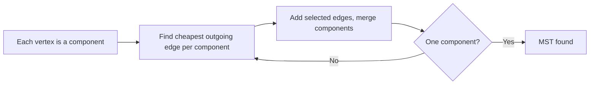

# Chapter 182: Borůvka's MST Algorithm

Borůvka's algorithm (1926) finds the **minimum spanning tree** in O(E log V) by repeatedly merging connected components through their cheapest outgoing edges. It is the oldest MST algorithm and is naturally parallelizable.

---

## Core Idea

Start with each vertex as its own component. In each **phase**, every component selects its cheapest edge connecting it to a different component. Add all selected edges, then merge components. Repeat until one component remains.



---

## Algorithm (Pseudocode)

```
function boruvka(V, E):
    components = {v} for each vertex v
    mst = []
    while |components| > 1:
        cheapest = map from component to (weight, edge)
        for each edge (u, v, w) in E:
            cu = find(u), cv = find(v)
            if cu != cv:
                if w < cheapest[cu].weight: cheapest[cu] = (w, (u,v))
                if w < cheapest[cv].weight: cheapest[cv] = (w, (u,v))
        for each component c in components:
            add cheapest[c].edge to mst
            union the two endpoints
    return mst
```

---

## Complexity Analysis

| Phase | Components | Edges Scanned | Total Work |
|---|---|---|---|
| 1 | V | E | E |
| 2 | ≤ V/2 | E | E |
| k | ≤ V/2^(k-1) | E | E |

Each phase at least **halves** the number of components → O(log V) phases × O(E) per phase = **O(E log V)**. Space: O(V + E).

---

## Walkthrough

Graph: vertices {A,B,C,D}, edges: (A-B,4), (A-C,2), (B-C,1), (B-D,3), (C-D,5).

**Phase 1:** Each vertex picks its cheapest outgoing edge.
- A→C (2), B→C (1), C→B (1), D→B (3)
- Selected: (B-C,1), (A-C,2), (B-D,3) — but adding (B-C) merges B and C, so (A-C) and (B-D) are still valid.
- Components after: {A,B,C}, {D}

**Phase 2:** Cheapest from {A,B,C}→{D}: (B-D,3). Selected.
- One component remains. MST weight = 1+2+3 = **6**.

---

## Borůvka vs Kruskal vs Prim

| Feature | Borůvka | Kruskal | Prim |
|---|---|---|---|
| Time | O(E log V) | O(E log E) | O(E + V log V) |
| Data structure | DSU | DSU + sort | Priority queue |
| Parallelizable | Yes (each component independently) | No | No |
| Best for | Dense graphs, parallel settings | Sparse graphs | Dense graphs (Fibonacci heap) |

---

## Common Mistakes

| Mistake | Fix |
|---|---|
| Not handling parallel edges | Multiple edges to the same component — pick the minimum |
| Self-loop edges | Skip edges where both endpoints share a component |
| Assuming O(E log V) = O(E log E) | Correct, since log V ≤ log E, but the constant factors differ |

---

## Practice Problems

| # | Problem | Hint |
|---|---|---|
| 1 | Standard MST (Kruskal variant) | Implement with DSU to compare against Kruskal |
| 2 | Minimum Spanning Tree (CF 160D) | Track edge usage (in all/some MSTs) |
| 3 | Connecting Cities (Codeforces 251D) | Apply Borůvka phases directly |
| 4 | MST on Grid | Treat grid cells as vertices, adjacent edges with weight |
| 5 | Cable Connection Problem | Classic Borůvka — each city connects to cheapest neighbor |
| 6 | Parallel MST (research) | Study how to parallelize edge scanning per component |

---

## See Also

- [Chapter 27: MST — Kruskal & Prim](ch27-mst.md)
- [Chapter 17: Disjoint Set Union](ch17-dsu.md)
- [Chapter 22: Graph Fundamentals](ch22-graph-fundamentals.md)
- [Chapter 26: Shortest Paths](ch26-shortest-paths.md)
