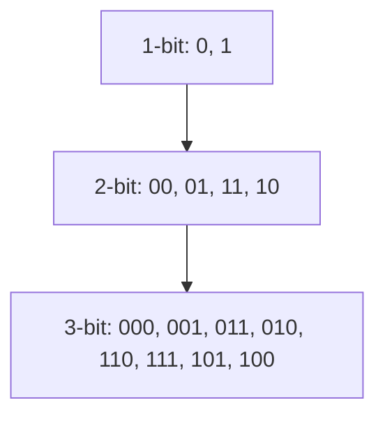

# Chapter 187: Gray Codes

A **Gray code** is an ordering of binary numbers where **adjacent values differ by exactly one bit**. The most common variant is the **binary reflected Gray code** (BRGC), which has elegant recursive structure and wide applications.

---

## Construction: Binary Reflected Gray Code

1. Start with `[0, 1]` for 1-bit Gray code.
2. To get n-bit Gray code: take (n-1)-bit code, prefix `0`, then reverse and prefix `1`.



**Closed-form formula:** The i-th Gray code value is `i ^ (i >> 1)`.

```cpp
int gray(int i) { return i ^ (i >> 1); }

// Inverse: Gray code to index
int inv_gray(int g) {
    int n = 0;
    while (g) { n ^= g; g >>= 1; }
    return n;
}

// Generate all n-bit Gray codes
vector<int> grayCodes(int n) {
    vector<int> result(1 << n);
    for (int i = 0; i < (1 << n); i++)
        result[i] = i ^ (i >> 1);
    return result;
}
```

**Complexity:** O(2ⁿ) to generate all codes, O(1) per single conversion.

---

## Walkthrough: 3-bit Gray Code

| i (decimal) | i (binary) | Gray = i ^ (i>>1) |
|---|---|---|
| 0 | 000 | 000 |
| 1 | 001 | 001 |
| 2 | 010 | 011 |
| 3 | 011 | 010 |
| 4 | 100 | 110 |
| 5 | 101 | 111 |
| 6 | 110 | 101 |
| 7 | 111 | 100 |

Adjacent codes differ by exactly one bit. Also, the last code (100) and first code (000) differ by one bit — forming a **cycle**.

---

## Applications

| Application | How Gray Code Helps |
|---|---|
| Karnaugh maps | Adjacent cells in the map differ by one variable |
| Hamiltonian cycle on hypercube | n-bit Gray code = Hamiltonian cycle on n-dimensional hypercube |
| Rotary encoders | Prevents spurious transitions when sensors read multiple bits |
| Error correction | Single-bit errors between adjacent codes are detectable |
| Iteration order in DP | Iterate over subsets with minimal state change |

---

## Common Mistakes

| Mistake | Fix |
|---|---|
| Confusing Gray code with binary | Gray code is NOT sorted by value |
| Wrong inverse formula | Repeatedly XOR with shifted self: `while(g) { n^=g; g>>=1; }` |
| Assuming cyclic for all constructions | BRGC is cyclic; not all Gray code variants are |

---

## Practice Problems

| # | Problem | Hint |
|---|---|
| 1 | Gray Code (LeetCode 89) | Generate n-bit Gray code sequence |
| 2 | N-Queens II with Gray code iteration | Iterate subsets visiting each mask once with 1-bit changes |
| 3 | Hypercube Hamiltonian cycle | Gray code IS the Hamiltonian cycle |
| 4 | Karnaugh map construction | 2D Gray code (row and column) for 4-variable maps |
| 5 | Subset enumeration with minimal transitions | Iterate over all subsets using Gray code order |

---

## See Also

- [Chapter 33: Bit Manipulation](ch33-bit-manipulation.md)
- [Chapter 95: Bit Advanced](ch95-bit-advanced.md)
- [Chapter 136: Gray Code & Bit Tricks](ch136-gray-code-bit-tricks.md)
- [Chapter 186: Hamiltonian Paths](ch186-hamiltonian-paths.md)
