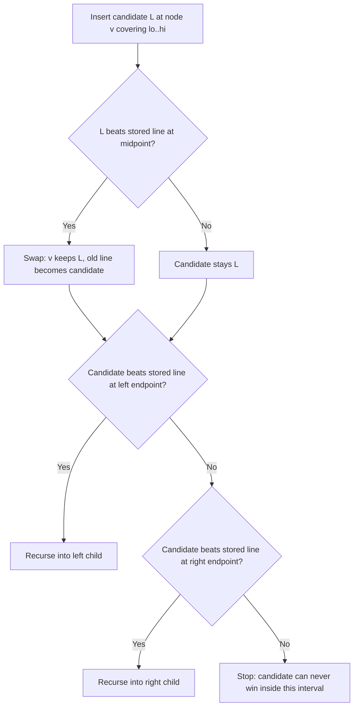

# Chapter 195: Li Chao Segment Tree

## Overview

A Li Chao segment tree stores a set of lines `y = m*x + b` over a fixed integer x-domain and answers "minimum (or maximum) of all lines at point x" in \\(O(\\log C)\\) per query, where \\(C\\) is the domain size. Inserting a line also costs \\(O(\\log C)\\), in any insertion order — no sortedness assumptions. That is exactly the regime where the convex hull trick (CHT) breaks, which makes this structure the default engine for linear-function DP optimization in hard competitive-programming problems and in advanced DP follow-up questions.

This chapter walks the midpoint invariant, a full C++ implementation, the DP-to-lines conversion with a worked numeric example, and a comparison against pointer-walk CHT, the multiset line container, and the kinetic segment tree. The survey coverage in [Convex Hull Trick and Li Chao Tree](../advanced/convex-hull-trick.md) focuses on the iterative variant and its oracle cross-check; this page adds the recursive walkthrough, DP applications, and structure-selection guidance.

## The Problem: Pointwise Minimum of a Line Set

Maintain a dynamic set of lines under two operations:

| Operation | Meaning | Naive cost | Li Chao cost |
|---|---|---|---|
| `insert(m, b)` | add line `y = m*x + b` | O(1) | \\(O(\\log C)\\) |
| `query(x)` | return \\(\\min_i (m_i x + b_i)\\) | O(n) scan | \\(O(\\log C)\\) |
| `insert_segment(m, b, l, r)` | add a line valid only on `[l, r]` | O(n) | \\(O(\\log^2 C)\\) |

The function \\(\\min_i (m_i x + b_i)\\) is the **lower envelope** of the lines: a piecewise-linear function whose pieces are the lines, changing which line wins only at pairwise crossings. Being a pointwise minimum of affine functions, it is concave, with winning slopes decreasing as x increases — which is precisely the structure CHT exploits when insertion order cooperates. A static envelope can be built in \\(O(n \\log n)\\), and a naive dynamic scan costs \\(O(n)\\) per query.

The pointer-walk CHT from [Chapter 86](ch86-dp-optimization.md) answers both operations in amortized O(1), but only under two simultaneous monotonicity conditions: lines arrive sorted by slope, and queries arrive sorted by x. Many DPs violate one or both:

- Queries jump around because the DP processes states in array order, not in x order.
- Lines are inserted in transition order, not slope order (e.g., a 2D DP with `x = column` that sweeps rows).
- A transition is only valid on a sub-range of x, so lines must be inserted as segments.

A multiset-based line container (KACTL's `LineContainer`) handles arbitrary insertion and query in \\(O(\\log n)\\), but it does not support range-restricted lines and is more intricate to write. The Li Chao tree covers all three cases above with less code.

## The Midpoint Invariant

The tree is a segment tree over the domain `[0, C)` (any range works). Each node covers an interval and stores **one line: the best line at that node's interval midpoint** among every line ever inserted into that node's interval. The invariant that makes queries exact:

> If line `L` is the true minimum at some point `x`, then `L` is stored in some node on the root-to-leaf path of `x`.

Therefore `query(x)` can simply walk from root to leaf and take the minimum over the \\(O(\\log C)\\) stored lines — no search, no hull, no cross products.

Insertion maintains the invariant using the fact that **two distinct non-parallel lines cross exactly once**. Descend from the root with the candidate line; at each node, compare candidate and stored line at the interval midpoint:

- If the candidate wins at the midpoint, swap it with the stored line; the displaced line becomes the new candidate.
- The candidate (which now loses at the midpoint) can only still win on one side of the midpoint — two lines cross once — so it recurses into that single child, or stops if it wins at neither endpoint.

This is why insertion costs \\(O(\\log C)\\): each level does O(1) work and the descent goes one way. Parallel lines need no special handling (a nice contrast with CHT, where equal slopes make the intersection formula divide by zero) — the midpoint comparison just keeps the better intercept.



## Implementation Walkthrough

Recursive C++ over the domain `[0, C)`. The sentinel line `y = INF` is never optimal, so an empty tree answers `query` with `INF`.

```cpp
#include <bits/stdc++.h>
using namespace std;
using ll = long long;

const ll INF = (ll)4e18;

struct LiChao {
    struct Line { ll m, b; };            // y = m * x + b
    static ll eval(const Line& l, ll x) {
        return l.b == INF ? INF : l.m * x + l.b;   // sentinel guard
    }

    int C;                               // domain is [0, C)
    vector<Line> t;

    LiChao(int C) : C(C), t(4 * C, Line{0, INF}) {}

    void insert(ll m, ll b) { insert(1, 0, C - 1, Line{m, b}); }
    ll query(ll x)          { return query(1, 0, C - 1, x); }

private:
    void insert(int v, int lo, int hi, Line L) {
        int mid = (lo + hi) / 2;
        bool midL = eval(L, mid) < eval(t[v], mid);
        if (midL) swap(L, t[v]);          // winner at midpoint stays here
        if (lo == hi) return;
        bool leftL  = eval(L, lo) < eval(t[v], lo);
        bool rightL = eval(L, hi) < eval(t[v], hi);
        if (leftL)       insert(2*v,     lo, mid,  L);
        else if (rightL) insert(2*v + 1, mid + 1, hi, L);
        // else: L can never be optimal in this interval
    }

    ll query(int v, int lo, int hi, ll x) {
        ll best = eval(t[v], x);
        if (lo == hi) return best;
        int mid = (lo + hi) / 2;
        if (x <= mid) return min(best, query(2*v,     lo, mid,  x));
        else          return min(best, query(2*v + 1, mid + 1, hi, x));
    }
};

int main() {
    LiChao lc(8);                         // domain [0, 8)
    lc.insert(1, 0);                      // y = x
    lc.insert(-2, 12);                    // y = -2x + 12
    lc.insert(0, 4);                      // y = 4  (flat line)
    for (int x = 0; x < 8; x++)
        cout << lc.query(x) << " \n"[x == 7];
    // prints: 0 1 2 3 4 2 0 -2
    //          (y=x wins on [0,4], y=-2x+12 on [5,7], y=4 never wins)
    return 0;
}
```

Three properties worth internalizing while reading the code:

1. **No division, no cross products.** All comparisons are direct evaluations at integer points, so there is no `__int128` requirement (contrast with CHT's "bad line" test) and no parallel-slope special case.
2. **Max instead of min** flips the two comparison operators and the swap direction; rewriting the comparisons is safer than negating intercepts (see the failure-mode note in the CHT page).
3. **`t` is sized by the domain, not by the number of lines.** Sizing to `4*n` for `n` lines is a classic out-of-bounds bug.

### Compact Python Version for DP Use

For interviews and prototyping, a compressed-domain variant over the sorted set of query points is enough. Compression is valid here: two lines cross once in real x, so the one-sided-descent argument survives any order-preserving compression — provided every query is one of the compressed points.

```python
class LiChao:
    """Min-of-lines over the compressed x list xs (sorted, unique)."""
    def __init__(self, xs):
        self.xs = xs
        self.k = len(xs)
        self.m = [0] * (4 * self.k)
        self.b = [float('inf')] * (4 * self.k)

    def _f(self, i, x):
        return self.m[i] * x + self.b[i]

    def insert(self, m, b):
        self._ins(1, 0, self.k - 1, m, b)

    def _ins(self, i, lo, hi, m, b):
        mid = (lo + hi) // 2
        xm = self.xs[mid]
        if m * xm + b < self._f(i, xm):
            self.m[i], self.b[i], m, b = m, b, self.m[i], self.b[i]
        if lo == hi:
            return
        if m * self.xs[lo] + b < self._f(i, self.xs[lo]):
            self._ins(2 * i, lo, mid, m, b)
        elif m * self.xs[hi] + b < self._f(i, self.xs[hi]):
            self._ins(2 * i + 1, mid + 1, hi, m, b)

    def query(self, x):
        i, lo, hi, best = 1, 0, self.k - 1, float('inf')
        while True:
            best = min(best, self._f(i, x))
            if lo == hi:
                return best
            mid = (lo + hi) // 2
            if x <= self.xs[mid]:
                i, hi = 2 * i, mid
            else:
                i, lo = 2 * i + 1, mid + 1
```

## From DP Transition to Lines

The recurring DP shape is:

\\[ dp[i] = \\min_{j} \\big( dp[j] + a_i \\cdot b_j + c_j \\big) \\]

Each prior state `j` contributes one line: \\(a_i\\) plays the role of the query coordinate, \\(b_j\\) is the line's slope, and `dp[j] + c_j` is the intercept. Quadratic costs expand into lines the same way:

\\[ dp[i] = \\min_j \\big( dp[j] + (S_i - S_j)^2 + K \\big) = S_i^2 + K + \\min_j \\big( (-2S_j) \\cdot S_i + (dp[j] + S_j^2) \\big) \\]

so state `j` offers the line with slope \\(-2S_j\\) and intercept \\(dp[j] + S_j^2\\), and each `i` queries at \\(x = S_i\\).

**Worked example** (batching DP, \\(K = 3\\), prefix sums \\(S = [0, 2, 5]\\), `dp[0] = 0`):

| Step | Line inserted (slope, intercept) | Query x | Envelope value | dp[i] = x² + K + env |
|---|---|---|---|---|
| i=1 | j=0: (0, 0) | 2 | 0 | 4 + 3 + 0 = **7** |
| i=2 | j=1: (−4, 7 + 4 = 11) | 5 | min(0, −20+11) = −9 | 25 + 3 − 9 = **19** |

Brute force confirms dp[2] = 19: one batch `[0..2]` costs \\(5^2 + 3 = 28\\), while batches `[0..1] + [1..2]` cost \\(7 + (3^2 + 3) = 19\\). The whole optimization is that step i=2 evaluated two candidate lines at one point instead of scanning all j.

## Common DP Applications

| Application | Transition shape | Best structure | Note |
|---|---|---|---|
| Parabolic batching (logs, fence painting) | `dp[j] + (S_i − S_j)² + K` | Deque CHT if S monotone; Li Chao otherwise | CF 319C is the classic |
| Land acquisition (group rectangles, pay maxW × maxH) | `dp[j] + w_i · h_{j+1}` after dominance pruning | Monotone CHT suffices in the base version | Variants with extra constraints lose the slope order → Li Chao |
| Move-one-element (CF 631E) | `dp[j] + a_j · (i − j)` re-indexed | Li Chao over position domain | Queries not sorted by slope order |
| Tree DP over subtree values (CF 932F "Escape Through Leaf") | `dp[j] + a_i·b_j + b_i·a_j` across subtrees | Li Chao trees merged small-to-large | The canonical "Li Chao on tree" problem |
| Range-restricted transitions | line valid only on `[l, r]` of x | Li Chao with segment insertion | CHT and LineContainer cannot express this directly |

For the land-acquisition family, the base problem sorts plots by width, discards dominated plots, and ends with widths increasing and heights strictly decreasing — so slopes are inserted in order and queries in order, and the O(1) deque CHT is enough (USACO "Land Acquisition"). The Li Chao tree earns its keep in the *variants*: additional constraints (at most k groups, penalty per group size) or a second dimension that destroys the dominance-pruning argument leave you with lines and queries in arbitrary order.

For tree DPs, each subtree owns a Li Chao tree; merging child structures into the parent bottom-up (segment-tree-merge style, small-to-large) yields accepted solutions in roughly \\(O(n \\log^2 C)\\), and this is the standard editorial approach for CF 932F.

## Li Chao vs CHT vs Kinetic Segment Tree

| Structure | Insert | Query | Order constraints | Segments? | Deletion? | Code size |
|---|---|---|---|---|---|---|
| Naive scan | O(1) | O(n) | none | yes | yes | trivial |
| Pointer-walk CHT (deque) | O(1) amortized | O(1) amortized | slopes AND queries sorted | no | no | small |
| Multiset CHT (LineContainer) | O(log n) | O(log n) | none | no | yes | medium, `__int128` for bad test |
| **Li Chao tree** | O(log C) | O(log C) | none | yes (O(log C) node inserts) | no | small |
| Kinetic segment tree | event-driven | O(log² n) amortized | none; slopes move linearly in time | model-dependent | no | large |

The kinetic segment tree addresses a different question: the lines themselves *move* — slopes and intercepts change linearly with time (think objects with position \\(p_i + v_i t\\) competing for a maximum). Each node keeps the current winner of its interval plus a **certificate** (the crossing time with its closest challenger); when time advances past a certificate, a collision event fires and the winner is swapped. This is the kinetic data structure framework of Basch, Guibas, and Hershberger (SODA 1997). It shines when queries are "who is on top *now*" under continuous motion, and it appears in advanced contest problems (e.g., range-max-subsegment under moving lines) but essentially never in interviews. Know it for the comparison; reach for Li Chao when lines are static and only insertion/query order is adversarial.

## Pitfalls and Overflow

| Pitfall | Symptom | Fix |
|---|---|---|
| Tree array sized to `n` (line count) instead of domain `C` | out-of-bounds / garbage answers | size by domain; `4*C` for recursive, `2*2^k` for iterative |
| Query outside the built domain | walks off the implicit tree | clamp queries or pad the domain to the max query point |
| Using compressed indices but querying uncompressed x | silently wrong envelope | only query points that are in the compressed set |
| min/max conversion by negating intercepts only | subtly wrong envelope | flip every comparison (midpoint swap, both endpoint tests) |
| Overflow in `m*x + b` | wrong comparisons near domain edges | \\(10^9 \\cdot 10^9 = 10^{18}\\) fits `long long`; beyond that use `__int128` |
| Forgetting the sentinel-eval guard | `INF + m*x` overflows to negative | guard the sentinel before multiplying |

One more subtlety: Li Chao insertions are not deletable. If a DP needs to remove lines (rolling transitions), either use the multiset line container, or process offline so that line lifetimes nest (rollback with a snapshot of the O(log C) modified nodes — the tree is small enough that path copying is cheap).

## Interview Questions

1. **Why does Li Chao insertion work in any order, in O(log C)?**
   The midpoint invariant: each node stores the line that is best at its interval midpoint. When a candidate loses at the midpoint but could still win somewhere in the interval, it must win on exactly one side, because two distinct lines cross at most once — so the descent goes down a single root-to-leaf path, doing O(1) work per level over \\(\\log C\\) levels. The invariant then guarantees that any line optimal at x sits somewhere on x's root-to-leaf path, which is all `query` needs.

2. **When do you pick CHT vs Li Chao vs a multiset line container?**
   If slopes and queries both arrive in sorted order, the deque CHT is the fastest and simplest (amortized O(1)). If order is arbitrary but lines are permanent and whole, Li Chao is the smallest correct structure at \\(O(\\log C)\\). If you need deletion or true dynamic churn, use the multiset container (KACTL `LineContainer`) at \\(O(\\log n)\\). If transitions are restricted to sub-ranges of x, Li Chao with segment insertion is the only natural fit among the three.

3. **How do you turn `dp[i] = min_j (dp[j] + (S_i − S_j)^2 + K)` into lines?**
   Expand the square: the per-i constant \\(S_i^2 + K\\) comes out, leaving \\(\\min_j ((−2S_j)·S_i + dp[j] + S_j^2)\\). State j is a line with slope \\(−2S_j\\) and intercept \\(dp[j] + S_j^2\\); each i queries at \\(x = S_i\\). Insert line j right after computing `dp[j]`, then answer query i. Watch the sign convention: for a *min* DP with this expansion, slopes \\(-2S_j\\) decrease as S grows, which is exactly the case where the deque CHT also works when S is monotone.

4. **What changes for a tree DP like "Escape Through Leaf"?**
   Each node's DP depends on the best \\(a_i b_j + b_i a_j\\) over an *entire subtree*, so you keep a Li Chao tree per subtree and merge children into the parent bottom-up. Because a naive merge re-inserts every line, implementations merge segment-tree nodes (small-to-large), giving roughly \\(O(n \\log^2 C)\\) total. The lesson generalizes: Li Chao trees compose under merging where hull-based structures do not, because the invariant is local to nodes rather than global to a hull order.

5. **What is the kinetic segment tree and when would you ever prefer it?**
   When the lines themselves move — slopes/intercepts are linear functions of time — a static structure is wrong. The kinetic segment tree stores per-node winners plus crossing-time certificates and processes collision events as time advances, in \\(O(\\log^2 n)\\) amortized per event. It is the right tool for continuous-motion maximum queries and appears in high-level contest problems, but for static-line DPs it is strictly more machinery than Li Chao.

## Key Takeaways

- Li Chao = segment tree where every node stores the line best at its interval **midpoint**; queries take the min over the root-to-leaf path, insert descends one side per level: both \\(O(\\log C)\\), any order.
- Correctness rests on one geometric fact: two lines cross at most once, so a midpoint-loser survives on at most one side.
- No cross products, no division: parallel lines and integer arithmetic are trivially safe (still watch `m*x + b` overflow).
- Use it when CHT's monotonicity fails — arbitrary insertion/query order, range-restricted lines, or per-subtree merging in tree DPs (CF 932F).
- Size the array by the **domain**, not the line count; only query points inside the built (or compressed) domain.
- Kinetic segment trees handle moving lines via certificates and collision events — know them for the comparison table, not for interviews.

## References

- [cp-algorithms: Convex hull trick and Li Chao tree](https://cp-algorithms.com/geometry/convex_hull_trick.html)
- [KACTL LineContainer (multiset-based dynamic CHT)](https://github.com/kth-competitive-programming/kactl/blob/main/content/data-structures/LineContainer.h)
- [PEGWiki: Convex hull trick](https://wcipeg.com/wiki/Convex_hull_trick)
- [Codeforces 319C "Kalila and Dimna in the Logging Industry"](https://codeforces.com/contest/319/problem/C)
- [Codeforces 631E "Product Sum"](https://codeforces.com/contest/631/problem/E)
- [Codeforces 932F "Escape Through Leaf"](https://codeforces.com/contest/932/problem/F)
- Basch, Guibas, Hershberger, "Data Structures for Mobile Data", Proc. 8th SODA, 1997 (kinetic data structures — origin of the certificate/collision framework)

## Cross-References

- [Convex Hull Trick and Li Chao Tree](../advanced/convex-hull-trick.md) — iterative Li Chao with a brute-force oracle cross-check, and the CHT invariants this chapter assumes
- [DP Optimization Survey](../advanced/dp-optimization.md) — where Li Chao sits among Knuth, Aliens trick, SMAWK, and monotone-queue optimizations
- [Chapter 86: DP Optimization](ch86-dp-optimization.md) — the monotone CHT implementation and the DP transition catalog
- [Chapter 117: Monotone Queue Optimization](ch117-monotone-queue-optimization.md) — the O(1)-amortized special case when slopes and queries are sorted
- [Chapter 188: Monotonic Queue/Deque Optimization](ch188-monotonic-queue-dp.md) — sliding-window DP acceleration, the other half of the "which accelerator" decision
