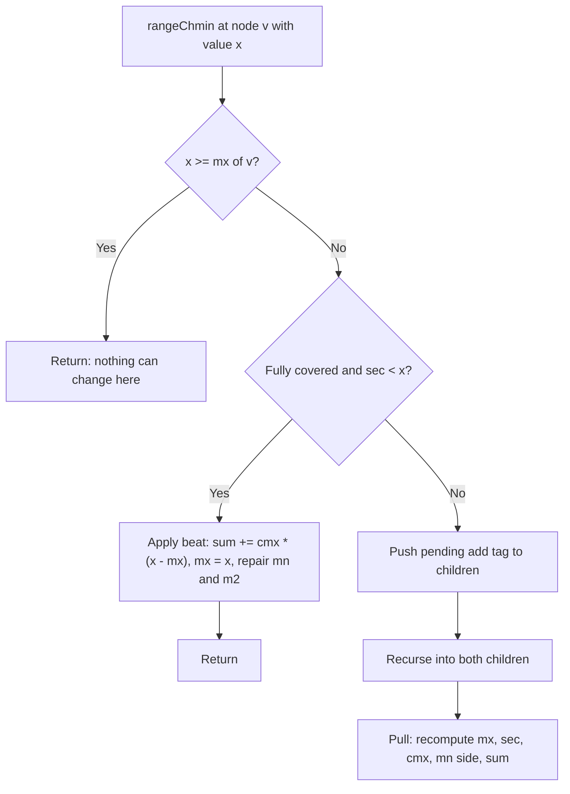

# Chapter 196: Segment Tree Beats

## Overview

Segment Tree Beats (also called the Ji Driver Tree, after Ji Ruyi / "jiry_2" who popularized it) is a segment tree that supports **range chmin, range chmax, and range add** together with range sum/min/max queries, in amortized \\(O(\\log^2 n)\\) per operation. No ordinary lazy propagation achieves this: chmin is not an affine map, so a chmin tag does not compose with an add tag into a constant number of partial updates. Beats sidesteps composition by exploiting a potential function — most updates only need to *modify the maximum elements* of a node, and the total number of times elements can collapse into their neighbors is small.

The name "beats" comes from the way an update "beats down" the second-largest value class at a node. This page builds the field layout, the chmin mechanics, the amortized argument, a complete chmin/chmax/add/sum implementation, and the failure cases. The basics (chmin + sum only) also appear as section 76.2 in [Chapter 76](ch76-advanced-seg-trees.md); here we go to the full operation set and the analysis.

## The Operation Set and Why Lazy Propagation Fails

The target operation set (the "Range Chmin Chmax Add Sum" template):

| Operation | Semantics | Plain lazy tags? |
|---|---|---|
| `chmin(l, r, x)` | `a[i] = min(a[i], x)` for i in [l, r] | no — not invertible, not affine |
| `chmax(l, r, x)` | `a[i] = max(a[i], x)` for i in [l, r] | no |
| `add(l, r, x)` | `a[i] += x` | yes — classic affine tag |
| `query sum / min / max` | aggregates over [l, r] | — |

Lazy propagation works by composing tags: an add followed by an add is an add; an affine tag followed by an affine tag is affine. A chmin tag `a[i] = min(a[i], x)` followed by an add is *not* expressible as one of a constant-size tag family unless you also track which elements the chmin actually touched — and that is exactly the information Beats tracks via the **maximum / second-maximum** decomposition.

## Node Fields and the Pull Logic

Each node maintains four groups of fields. The trick is that a chmin with `sec < x < mx` only changes the maximum elements, and their count `cmx` is known, so the sum can be patched in O(1):

| Field | Meaning | Maintenance |
|---|---|---|
| `mx`, `cmx` | node maximum, number of elements equal to it | max of children; counts add on ties |
| `sec` | strict second maximum (or −∞ sentinel) | on tie: max of children's `sec`; else max of loser's `mx` and winner's `sec` |
| `mn`, `cmn`, `m2` | mirror fields for the minimum side (needed by chmax and min queries) | symmetric |
| `sum` | sum of the segment | patched by `cmx * (new − old)` on chmin hits |
| `add` | pending add tag for the whole node | pushed before descending |

The sentinel values for `sec` / `m2` matter: leaves have `sec = −INF` and `m2 = +INF`, and `pull` must never let a sentinel leak into a real field. A node whose segment has a single distinct value has `mn == mx` — `applyMin` and `applyMax` must both repair this case, which is the most common correctness bug.

## Range Chmin Mechanics

For `chmin(l, r, x)` at node v, three cases:

1. **Prune:** `x >= mx[v]` — nothing in this subtree can change; return.
2. **Hit (apply at v):** the segment is fully covered **and** `sec[v] < x` — only the maxima change, so patch: `sum += cmx * (x − mx)`, set `mx = x`, and repair `mn`/`m2` if they equaled the old max. This is the O(1) "beat".
3. **Descend:** otherwise the update would have to distinguish maxima from non-maxima *inside* the node, so push the add tag, recurse into both children, and re-`pull`.



The recursion in case 3 can visit many nodes on a single call — that is why this is not ordinary lazy propagation — but the potential argument below bounds the *total* extra visits across the whole run. `chmax` is the mirror image with the min-side fields, and `add` is a classic lazy tag applied at the first fully-covered node.

## Implementation

Complete C++17 implementation of chmin / chmax / add + sum, min, max. The single lazy tag design (only `add` is lazy; chmin/chmax recurse) is the simplest correct variant.

```cpp
#include <bits/stdc++.h>
using namespace std;
using ll = long long;

const ll NEG = -(ll)4e18;   // "no second maximum"
const ll POS =  (ll)4e18;   // "no second minimum"

struct Beats {
    int n;
    vector<int> lo_, hi_;
    vector<ll> mx, sec, cmx, mn, m2, cmn, sum, add;

    Beats(const vector<ll>& a) : n(a.size()),
        lo_(4*n), hi_(4*n), mx(4*n), sec(4*n), cmx(4*n),
        mn(4*n), m2(4*n), cmn(4*n), sum(4*n), add(4*n, 0) {
        build(1, 0, n - 1, a);
    }

    void pull(int v) {
        int L = 2*v, R = 2*v + 1;
        sum[v] = sum[L] + sum[R];
        if (mx[L] == mx[R]) { mx[v] = mx[L]; cmx[v] = cmx[L] + cmx[R]; sec[v] = max(sec[L], sec[R]); }
        else if (mx[L] > mx[R]) { mx[v] = mx[L]; cmx[v] = cmx[L]; sec[v] = max(sec[L], mx[R]); }
        else                    { mx[v] = mx[R]; cmx[v] = cmx[R]; sec[v] = max(sec[R], mx[L]); }
        if (mn[L] == mn[R]) { mn[v] = mn[L]; cmn[v] = cmn[L] + cmn[R]; m2[v] = min(m2[L], m2[R]); }
        else if (mn[L] < mn[R]) { mn[v] = mn[L]; cmn[v] = cmn[L]; m2[v] = min(m2[L], mn[R]); }
        else                    { mn[v] = mn[R]; cmn[v] = cmn[R]; m2[v] = min(m2[R], mn[L]); }
    }

    void applyAdd(int v, ll x) {
        mx[v] += x; if (sec[v] > NEG) sec[v] += x;
        mn[v] += x; if (m2[v]  < POS) m2[v]  += x;
        sum[v] += (ll)(hi_[v] - lo_[v] + 1) * x;
        add[v] += x;
    }
    void applyMin(int v, ll x) {              // precondition: sec < x < mx
        sum[v] += cmx[v] * (x - mx[v]);
        if (mn[v] == mx[v])  mn[v] = x;       // single-distinct-value node
        if (m2[v]  == mx[v]) m2[v] = x;
        mx[v] = x;
    }
    void applyMax(int v, ll x) {              // precondition: m2 < x < mn
        sum[v] += cmn[v] * (x - mn[v]);
        if (mx[v] == mn[v])  mx[v] = x;
        if (sec[v] == mn[v]) sec[v] = x;
        mn[v] = x;
    }
    void push(int v) {
        if (add[v] != 0) {
            applyAdd(2*v, add[v]); applyAdd(2*v + 1, add[v]);
            add[v] = 0;
        }
    }

    void build(int v, int lo, int hi, const vector<ll>& a) {
        lo_[v] = lo; hi_[v] = hi;
        if (lo == hi) { mx[v] = mn[v] = sum[v] = a[lo]; cmx[v] = cmn[v] = 1; sec[v] = NEG; m2[v] = POS; return; }
        int mid = (lo + hi) / 2;
        build(2*v, lo, mid, a); build(2*v + 1, mid + 1, hi, a);
        pull(v);
    }

    void rangeAdd(int v, int l, int r, ll x) {
        if (r < lo_[v] || hi_[v] < l) return;
        if (l <= lo_[v] && hi_[v] <= r) { applyAdd(v, x); return; }
        push(v); rangeAdd(2*v, l, r, x); rangeAdd(2*v + 1, l, r, x); pull(v);
    }
    void rangeChmin(int v, int l, int r, ll x) {
        if (r < lo_[v] || hi_[v] < l || mx[v] <= x) return;
        if (l <= lo_[v] && hi_[v] <= r && sec[v] < x) { applyMin(v, x); return; }
        push(v); rangeChmin(2*v, l, r, x); rangeChmin(2*v + 1, l, r, x); pull(v);
    }
    void rangeChmax(int v, int l, int r, ll x) {
        if (r < lo_[v] || hi_[v] < l || mn[v] >= x) return;
        if (l <= lo_[v] && hi_[v] <= r && m2[v] > x) { applyMax(v, x); return; }
        push(v); rangeChmax(2*v, l, r, x); rangeChmax(2*v + 1, l, r, x); pull(v);
    }

    ll querySum(int v, int l, int r) {
        if (r < lo_[v] || hi_[v] < l) return 0;
        if (l <= lo_[v] && hi_[v] <= r) return sum[v];
        push(v);
        return querySum(2*v, l, r) + querySum(2*v + 1, l, r);
    }
    ll queryMax(int v, int l, int r) {
        if (r < lo_[v] || hi_[v] < l) return NEG;
        if (l <= lo_[v] && hi_[v] <= r) return mx[v];
        push(v);
        return max(queryMax(2*v, l, r), queryMax(2*v + 1, l, r));
    }
    ll queryMin(int v, int l, int r) {
        if (r < lo_[v] || hi_[v] < l) return POS;
        if (l <= lo_[v] && hi_[v] <= r) return mn[v];
        push(v);
        return min(queryMin(2*v, l, r), queryMin(2*v + 1, l, r));
    }
};

int main() {
    vector<ll> a = {5, 3, 8, 1, 7, 2, 9, 4};
    Beats st(a);
    cout << st.querySum(1, 0, 7) << "\n";      // 39

    st.rangeChmin(1, 1, 5, 4);                 // a -> {5,3,4,1,4,2,9,4}
    cout << st.querySum(1, 0, 7) << "\n";      // 32  (8->4 and 7->4)

    st.rangeChmax(1, 0, 3, 3);                 // a -> {5,3,4,3,4,2,9,4}
    cout << st.querySum(1, 0, 7) << "\n";      // 34  (1->3)

    st.rangeAdd(1, 4, 7, 10);                  // a -> {5,3,4,3,14,12,19,14}
    cout << st.querySum(1, 0, 7) << "\n";      // 74
    cout << st.queryMax(1, 0, 7) << " "        // 19
         << st.queryMin(1, 0, 7) << "\n";      // 3
    return 0;
}
```

Before trusting any Beats implementation, diff it against a brute-force array under randomized operations — the interleaving of `add` tags with beats is where silent corruption happens, and randomized testing finds it in seconds.

## Potential Analysis Intuition

Why is this amortized \\(O(\\log^2 n)\\)? Define the potential of the tree as

\\[ \\Phi = \\sum_{v} d(v) \\]

where \\(d(v)\\) is the number of *distinct values* present in node v's segment. Three observations:

1. **Case-3 descents are the only expensive work, and they are nearly free.** When `rangeChmin` descends through a node without applying a beat, it does so along the two "boundary chains" of the range decomposition — the nodes whose maxima are still above x. A single operation visits \\(O(\\log n)\\) canonical nodes and walks \\(O(\\log n)\\) boundary nodes around each, giving \\(O(\\log^2 n)\\) structural cost per operation even if nothing collapses.
2. **Every applied beat strictly decreases the potential.** Collapsing the maximum value class into x removes one distinct value from that node (and from no other node's count), so each unit of "extra" work beyond the boundary walk can be charged to a one-unit drop of \\(\\Phi\\).
3. **The potential has a budget.** \\(\\Phi\\) starts at most \\(O(n \\log n)\\) (every node distinct) and each range add raises it by only \\(O(\\log n)\\): fully covered nodes shift uniformly (distinct count unchanged), and only the \\(O(\\log n)\\) partially covered boundary nodes can gain one distinct value each. Nothing else increases \\(\\Phi\\).

Charging everything: total cost \\(\\le\\) initial potential + \\(Q \\cdot O(\\log n)\\) potential income + \\(Q \\cdot O(\\log^2 n)\\) boundary work. With chmin (or chmax) *and* add only, a refined version of this argument gives \\(O((n + Q) \\log n)\\) total; enabling **both** chmin and chmax breaks the one-sided refinement, and the standard quoted bound becomes \\(O((n+Q) \\log^2 n)\\) — amortized \\(O(\\log^2 n)\\) per operation. This is an amortized bound: a single adversarial chmin after many adds can legitimately cost \\(\\Theta(n)\\).

## Practice Problems and Where Beats Shows Up

| Problem / template | Operations | Note |
|---|---|---|
| Library Checker "Range Chmin Chmax Add Range Sum" | chmin + chmax + add + sum | The exact template above |
| Codeforces 438D "The Child and Sequence" | range mod + sum | Beats-family: `a[i] %= x` also collapses value classes |
| "Range add + chmin + min" task sets | one-sided beats | The \\(O((n+Q)\\log n)\\) regime |
| Workload dominated by range *assign* | assign + min/max/sum | Prefer a Chtholly tree (interval map) instead — different amortization |
| Range affine + sum | affine tags only | Plain lazy propagation (e.g., AtCoder Library); Beats is overkill |

The general lesson for interviews: whenever an update "clamps" values (`min`, `max`, `mod`, `abs`, `ceil-div`) instead of shifting them, ask which value classes it collapses. If each update collapses O(1) classes per touched node and only touches O(log n) boundary nodes, the Beats potential argument applies.

## Failure Cases and Limitations

| Failure | What happens | Mitigation |
|---|---|---|
| Treating the bound as worst-case | a single op can cost \\(\\Theta(n)\\) | acceptable in contests; not for hard real-time systems |
| Adding ops that do not collapse classes (range multiply, per-element chmin with varying x) | potential argument dies; \\(\\Theta(n)\\) *per op* is reachable | use a different structure or accept quadratic worst case |
| Missing `mn == mx` repair in `applyMin` (and mirror) | fields silently disagree; wrong sums later | randomized differential testing vs brute force |
| Sentinel arithmetic on add (`sec = NEG; sec += x`) | overflow flips sign of sentinel | guard sentinels before adding, as in `applyAdd` above |
| Sum overflow | `cmx * (mx − x)` with \\(10^5 \\times 10^{18}\\)-scale values exceeds 64 bits | bound the problem's value range; use `__int128` for the accumulator if needed |
| Pushing the add tag *after* descending | children receive stale maxima; beats apply to wrong values | push before every descent (ordering in the code above is load-bearing) |
| Expecting Beats to also give "history maximum" queries | needs an extra tag layer; complexity arguments change | separate known-hard topic; do not improvise in an interview |

One conceptual failure to name explicitly: Beats does not beat a *Fenwick tree* or ordinary lazy segment tree on their own operation sets. If your workload is adds plus one query type, plain lazy propagation is faster by a constant factor and simpler; Beats is justified only when clamping updates and sums coexist.

## Interview Questions

1. **Why can't ordinary lazy propagation handle range chmin + range add?**
   Lazy tags must compose: applying a new tag on top of a pending one must collapse into another constant-size tag. Add composes with add (affine maps compose), but `min(a[i], x)` followed by `+y` is not expressible as one affine map, and tracking which elements the chmin clamped requires exactly the max/second-max decomposition. Beats therefore replaces tag composition with a value-class decomposition maintained per node, paying for the bookkeeping with an amortized argument.

2. **Explain the three-way decision a chmin makes at a node.**
   First prune if `x >= mx` — nothing can change. Then, if the node is fully covered and `sec < x < mx`, only the maximum elements change: patch the sum by `cmx * (x − mx)` in O(1) and repair `mn`/`m2` if they equaled the old max. Otherwise the update must separate maxima from non-maxima inside the node, so push the add tag, recurse into both children, and pull. The middle case is the "beat" — the O(1) collapse that the potential argument banks on.

3. **Why is the total complexity amortized O(log² n), and what does the potential measure?**
   The potential \\(\\Phi\\) sums the number of distinct values per node. Every applied beat decreases \\(\\Phi\\) by at least one; adds raise it by only \\(O(\\log n)\\) because fully covered segments shift uniformly; and any non-beat descent is bounded by the \\(O(\\log^2 n)\\) boundary structure of the range decomposition. Summing the budget gives \\(O((n+Q) \\log^2 n)\\) total when both chmin and chmax are enabled (and \\(O((n+Q) \\log n)\\) for a one-sided clamp plus add).

4. **What breaks if you add a range-multiply operation to a Beats tree?**
   The correctness machinery can be adapted, but the *complexity* argument dies: multiplication does not collapse distinct value classes the way clamping does, so \\(\\Phi\\) can grow by more than O(log n) per operation and the amortized bound is lost — adversarial sequences reach \\(\\Theta(n)\\) per operation. The interview-worthy answer distinguishes correctness from complexity: Beats is a *complexity* technique built on class collapse, not a generic tag framework.

5. **When would you use a Chtholly tree instead?**
   When the dominant operation is range *assign* (set a whole range to one value). Assignment merges intervals, so an interval-map (sorted set of uniform runs) amortizes to \\(O(\\log n)\\) per assign plus the cost of splitting at endpoints, and it handles assign+sum+min+max with plain per-run bookkeeping. Beats handles the clamp family (chmin/chmax) that the interval map cannot; the two amortization regimes do not compose into one bound, so mixing both operations should make you re-derive the potential, not assume it.

## Key Takeaways

- Segment Tree Beats supports range chmin/chmax/add + sum/min/max in amortized \\(O(\\log^2 n)\\) — impossible for pure lazy tags because clamps do not compose with adds.
- The core representation: per node keep max, strict second max, count of max, the mirrored min fields, and the sum; a chmin with `sec < x < mx` patches the sum in O(1) by rewriting only the maxima.
- The potential \\(\\Phi = \\sum_v d(v)\\) (distinct values per node) is the whole analysis: beats decrease it, adds raise it by \\(O(\\log n)\\), and non-collapse descents cost the \\(O(\\log^2 n)\\) boundary structure.
- One-sided use (chmin or chmax, plus add) is provably \\(O((n+Q) \\log n)\\); enabling both sides is the \\(\\log^2 n\\) regime.
- Sentinel hygiene (`sec = −∞`, `m2 = +∞`), the `mn == mx` single-value repair, and push-before-descend ordering are the three implementation traps; differential testing against a brute-force array is mandatory.
- The same collapse argument covers range mod (CF 438D) and other clamping updates; it does not cover multiplies or history queries.

## References

- Ji Ruyi (jiry_2), "Segment Tree Beats!" — UOJ blog post (the original potential analysis and the \\(O((n+Q) \\log n)\\) / \\(O((n+Q) \\log^2 n)\\) theorems)
- [Library Checker: Range Chmin Chmax Add Range Sum](https://judge.yosupo.jp/problem/range_chmin_chmax_add_range_sum)
- [Codeforces 438D "The Child and Sequence"](https://codeforces.com/problemset/problem/438/D)
- [cp-algorithms: Segment Trees](https://cp-algorithms.com/data_structures/segment_tree.html) — the lazy-propagation baseline that Beats extends
- Sleator, Tarjan, "Amortized efficiency of list update and paging rules", Communications of the ACM 28(2), 1985 — the potential method used in the analysis

## Cross-References

- [Chapter 76: Advanced Segment Trees](ch76-advanced-seg-trees.md) — section 76.2 has the minimal chmin+sum Beats skeleton this chapter generalizes
- [Chapter 157: Link-Cut Trees and Euler Tour Trees](ch157-link-cut-trees.md) — the other "amortized by potential function" structure in this tier
- [Chapter 181: Fenwick Tree Advanced](ch181-fenwick-tree-advanced.md) — range-update/range-query patterns when adds alone suffice
- [Chapter 35: Sliding Window](ch35-sliding-window.md) — monotonic deques solve the *query-only* clamping analog (window max/min)
