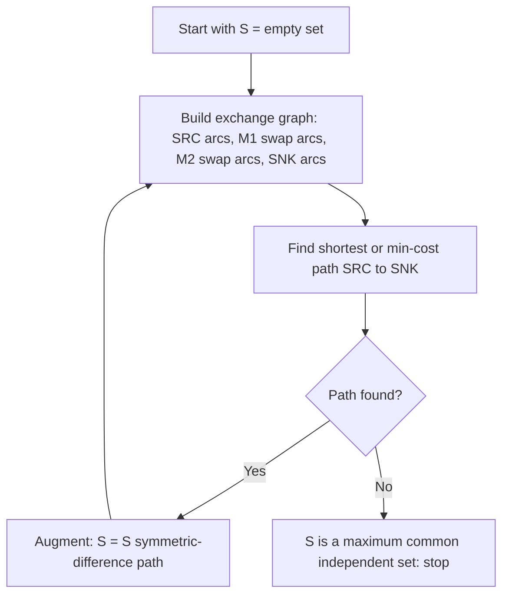

# Chapter 197: Matroid Intersection

## Overview

A **matroid** is the abstract structure that makes greedy exact: a ground set with an "independence" family that is closed under taking subsets and satisfies an exchange axiom. Kruskal's MST, the unit-time job scheduling greedy, and Gaussian elimination all work because the underlying independence system is a matroid. The punchline for interviews is **Edmonds' matroid intersection**: the maximum-weight set that is independent in *two* matroids at once is computable in polynomial time via augmenting paths — even though greedy provably fails there.

You will rarely code the general algorithm in an interview. You will be expected to (a) recognize when a problem is "pick the best set satisfying two structural constraints", (b) know the matroid zoo (graphic, transversal, linear), and (c) describe the exchange-graph augmentation at a high level. Applications include colored MST, degree-constrained arborescences, and bipartite matching as the special case you already know.

## Independence Systems and the Matroid Axioms

An **independence system** is a pair \\(M = (S, \\mathcal{I})\\): a finite ground set \\(S\\) and a family \\(\\mathcal{I} \\subseteq 2^S\\) of *independent* sets with:

1. **Empty set:** \\(\\emptyset \\in \\mathcal{I}\\).
2. **Heredity (downward closure):** if \\(A \\in \\mathcal{I}\\) and \\(B \\subseteq A\\), then \\(B \\in \\mathcal{I}\\).

Every independence system supports a natural greedy ("sort by weight descending, add an element if the set stays independent"), and every matroid is an independence system with one more axiom:

3. **Exchange (augmentation):** if \\(A, B \\in \\mathcal{I}\\) and \\(|A| < |B|\\), then some element \\(e \\in B \\setminus A\\) satisfies \\(A \\cup \\{e\\} \\in \\mathcal{I}\\).

The exchange axiom is what greedy needs: it guarantees every maximal independent set has the same cardinality (the **rank**), and that a locally better choice never blocks a globally optimal completion. A maximal independent set is a **basis**; a minimal *dependent* set is a **circuit**; the **rank function** \\(r(A) = \\max\\{|B| : B \\subseteq A,\\ B \\in \\mathcal{I}\\}\\) is submodular. The standard counterexample that fails only axiom 3: the matchings of a graph (hereditary, but two near-perfect matchings cannot always exchange — this is why maximum matching needs augmenting paths, not greedy).

## The Matroid Zoo

| Matroid | Ground set | Independent sets | Rank | Independence oracle |
|---|---|---|---|---|
| **Graphic** \\(M(G)\\) | edges of graph G | forests (acyclic edge sets) | \\(n - c\\) (n vertices, c components) | DSU cycle check, near O(1) |
| **Uniform** \\(U_{k,n}\\) | n elements | all sets of size ≤ k | k | size check |
| **Partition** | elements grouped into classes with caps | at most `cap_i` chosen per class i | \\(\\sum \\text{cap}_i\\) (capped) | count per class |
| **Transversal** | left vertices of a bipartite graph | sets matchable to distinct right slots | max matching size in subgraph | bipartite matching |
| **Linear / representable** | vectors (columns of a matrix) | linearly independent sets | matrix rank | Gaussian elimination, e.g. over GF(2) |

Concrete anchors:

- **Graphic:** Kruskal's algorithm is exactly "greedy on the graphic matroid"; a spanning tree is a basis. DSU ([Chapter 17](ch17-dsu.md)) is the independence oracle.
- **Transversal:** unit-time jobs with deadlines — ground set = jobs, slots = time units \\(0 \\dots d_j - 1\\) for each job's deadline \\(d_j\\). A set of jobs is schedulable iff it can be matched into distinct slots, which is a transversal matroid. This is *why* the schedule-by-deadline greedy is correct (Rado's theorem, below).
- **Linear:** over \\(\\mathbb{F}_2\\) this is the XOR-matroid: ground set = integers/vectors, independent = xor-distinct. It powers subset-xor maximization (linear basis) and many "choose vectors" problems.

## Why Greedy Works for One Matroid — and Rado's Theorem

**Theorem (greedy optimality).** For an independence system, the greedy algorithm returns a maximum-weight independent set for *every* weight function if and only if the system is a matroid (Rado 1942; also attributed to Edmonds).

The forward direction is the useful one in an interview: suppose the exchange axiom fails, so maximal sets A and B have \\(|A| < |B|\\); weight the elements of B hugely and the rest negatively — greedy commits to elements of A and cannot reach |B|, while an optimum using B exists. Conversely, with the exchange axiom, an exchange argument shows greedy's k-th pick is at least as good as the optimum's k-th pick: if greedy holds a smaller set than the optimum at any step, exchange supplies an element that keeps greedy independent, so greedy never gets stuck below the optimum.

The corollary that organizes this whole page: **greedy stays optimal under ONE matroid constraint, and fails as soon as two matroid constraints interact.**

## Greedy Fails for Two Matroids: A Worked Example

Ground set \\(\\{a, b, c, d\\}\\), weights \\(w(a)=10, w(b)=9, w(c)=9, w(d)=1\\). Two partition matroids:

- \\(M_1\\): at most one element from \\(\\{a,b\\}\\) **and** at most one from \\(\\{c,d\\}\\).
- \\(M_2\\): at most one element from \\(\\{a,c\\}\\) **and** at most one from \\(\\{b,d\\}\\).

Each is clearly a matroid. Greedy (sort by weight, keep if independent in *both*): take `a` (10) ✓; skip `b` (\\(\\{a,b\\}\\) violates \\(M_1\\)); skip `c` (\\(\\{a,c\\}\\) violates \\(M_2\\)); take `d` (1) ✓. Greedy answer: \\(\\{a, d\\}\\), weight **11**.

But \\(\\{b, c\\}\\) is independent in both matroids (one per class on each side) with weight **18**. Greedy lost by 7 because its first pick consumed capacity in both matroids. Any algorithm for this instance must be able to *undo* the pick of `a` — which is precisely what the exchange graph enables.

## The Augmentation Path Algorithm

Given matroids \\(M_1, M_2\\) on the same ground set and a common independent set \\(S\\), build the **exchange graph**:

| Arc | Condition | Meaning |
|---|---|---|
| `SRC → f` (f ∉ S) | \\(S \\cup \\{f\\}\\) independent in \\(M_1\\) | f can enter under the first constraint |
| `f → e` (e ∈ S, f ∉ S) | \\(S - e + f\\) independent in \\(M_1\\) | swapping e out for f keeps \\(M_1\\) happy |
| `e → f` (e ∈ S, f ∉ S) | \\(S - e + f\\) independent in \\(M_2\\) | swapping keeps \\(M_2\\) happy |
| `f → SNK` (f ∉ S) | \\(S \\cup \\{f\\}\\) independent in \\(M_2\\) | f can enter under the second constraint |

Find a shortest (or min-cost, for weights) path `SRC → SNK` and augment: \\(S := S \\triangle P\\) — the symmetric difference with the path's interior vertices. The path alternates add/swap/add, so each augmentation grows \\(|S|\\) by exactly one and keeps \\(S\\) independent in both matroids (Edmonds' lemma guarantees the exchange graph always offers a path while S is not maximum). Repeat until no path exists.



**Weights.** For maximum weight, put cost \\(-w(f)\\) on every arc *entering* a ground element f (`SRC→f`, `e→f`) and \\(+w(e)\\) on every arc *leaving* e (`f→e`), with the final `f→SNK` arc costing 0. A path's cost is then exactly **minus** the weight delta of the augmentation, so Bellman-Ford (negative arcs) finds the augmentation that increases total weight the most; among equal-cost paths take the shortest to avoid degenerate swaps. Total weight strictly increases each phase, and \\(r \\le \\min(r_1, r_2)\\) phases suffice.

**Complexity.** Each phase builds \\(O(|S| \\cdot |X|)\\) swap arcs, each costing one oracle call, so the naive bound is \\(O(r^2 n)\\) oracle calls for rank r over n elements — polynomial, but with poly-time oracles this is the honest statement; faster algebraic versions exist for linear matroids (Cunningham's refinements). For the transversal∩transversal instance this loop degenerates into Hopcroft-Karp-style alternating-path matching, which is why bipartite matching feels like the special case it is.

### Reference Implementation (oracle-based, weighted)

```python
from collections import deque

def matroid_intersection(ground, I1, I2, weight=None):
    """Maximum-weight set independent in both matroids.
    I1, I2: callables, frozenset -> bool (independence oracles).
    weight: dict element -> number (default all 1)."""
    ground = list(ground)
    w = weight if weight is not None else {e: 1 for e in ground}
    S = set()
    while True:
        edges = []                              # (u, v, cost)
        for f in ground:
            if f in S:
                continue
            if I1(S | {f}):
                edges.append(('SRC', f, -w[f]))  # enter under M1: cost -w
            if I2(S | {f}):
                edges.append((f, 'SNK', 0))      # enter under M2: finish
            for e in S:
                if I1((S - {e}) | {f}):
                    edges.append((f, e, w[e]))   # M1 swap: leave e costs +w
                if I2((S - {e}) | {f}):
                    edges.append((e, f, -w[f]))  # M2 swap: enter f costs -w
        # Bellman-Ford: min-cost path SRC -> SNK
        dist, par = {'SRC': 0}, {}
        for _ in range(len(ground) + 2):
            changed = False
            for u, v, c in edges:
                if u in dist and (v not in dist or dist[u] + c < dist[v]):
                    dist[v], par[v], changed = dist[u] + c, u, True
            if not changed:
                break
        if 'SNK' not in dist:
            return S                            # optimal
        path, v = [], par['SNK']          # start at SNK's parent, never 'SNK' itself
        while v != 'SRC':
            path.append(v)
            v = par[v]
        for v in path:                          # symmetric difference
            S.remove(v) if v in S else S.add(v)

if __name__ == "__main__":
    classes1 = [('a', 'b'), ('c', 'd')]         # M1: <= 1 per pair
    classes2 = [('a', 'c'), ('b', 'd')]         # M2: <= 1 per pair

    def indep(classes):
        def check(T):
            return all(len(T & frozenset(cl)) <= 1 for cl in classes)
        return check

    I1, I2 = indep(classes1), indep(classes2)
    G = ['a', 'b', 'c', 'd']
    W = {'a': 10, 'b': 9, 'c': 9, 'd': 1}

    greedy = set()
    for e in sorted(G, key=lambda x: -W[x]):    # greedy across BOTH matroids
        cand = greedy | {e}
        if I1(frozenset(cand)) and I2(frozenset(cand)):
            greedy = cand
    print("greedy:", sorted(greedy), sum(W[e] for e in greedy))   # [a, d] 11

    best = matroid_intersection(G, I1, I2, W)
    print("intersection:", sorted(best), sum(W[e] for e in best)) # [b, c] 18
```

Running it prints `greedy: ['a','d'] 11` and `intersection: ['b','c'] 18` — the algorithm recovers exactly the set greedy missed, by finding the augmentation whose path cost \\(-8\\) corresponds to a weight delta of \\(+8\\): trade `a` (weight 10) for `b` and `c` (weights \\(9 + 9\\)).

## Applications

| Application | Matroid 1 | Matroid 2 | Result |
|---|---|---|---|
| Bipartite maximum matching / assignment | transversal (left slots) | transversal (right slots) | Hopcroft-Karp / Hungarian behavior emerges |
| **Colored MST** (spanning tree with exactly k red edges, min cost) | graphic | partition over colors | intersection finds it; "at most k" also expressible |
| **Arborescence / branching** (min-cost, each non-root in-degree ≤ 1) | graphic | partition on incoming arcs per vertex | Edmonds' branching algorithm is this intersection |
| Unit jobs with deadlines (max count / weight) | — (single matroid) | transversal | greedy suffices — no intersection needed |
| Two-resource scheduling (deadlines AND class caps) | transversal | partition | intersection; greedy fails |

Two applications deserve a sentence each. **Colored MST:** "find a minimum spanning tree using exactly k red edges" is a classic hidden-intersection problem — the graphic matroid enforces acyclicity while a partition matroid (red class capped at k) enforces the color budget; solvable directly by matroid intersection, or in practice by parametric/weighted tricks that bias red edges. **Arborescences:** Edmonds' optimum branching theorem is historically the result that grew into matroid intersection — a branching is simultaneously a forest (graphic) and a set with at most one incoming arc per non-root vertex (partition matroid).

Beyond intersection: **matroid union** (Edmonds) merges k matroids and characterizes arboricity (a graph's edges split into k forests iff every subset A spans ≤ k(|A| − 1) edges — Nash-Williams); **matroid parity** (choosing pairs) is strictly harder and much more specialized. Interviews stay at the intersection level.

## Spotting Hidden Matroids in Interview Problems

Signals that a problem is secretly matroidal:

- The answer is a *set* chosen under a structural "no cycles / no double booking / at most one per class" rule, and you reach for an exchange argument but it keeps failing — two interacting constraints is the matroid-intersection fingerprint.
- A greedy works for one constraint and breaks when a second is added; the counterexample is always "first pick consumed capacity in both matroids" (the \\(\\{a,d\\}\\) vs \\(\\{b,c\\}\\) shape above).
- The problem says "each element needs a distinct slot/resource" — transversal matroid; "at most k per category" — partition matroid; "chosen edges must stay acyclic" — graphic matroid.
- Bipartite matching solves it but the natural graph is not obviously bipartite — try to *define* the two matroids instead of the graph.

In a 45-minute interview, the winning move is rarely to implement the augmentation loop; it is to name the two matroids, exhibit the greedy counterexample, and sketch the exchange graph in three sentences. That demonstrates more depth than a rushed Blossom implementation.

## Interview Questions

1. **Define a matroid and give the axiom greedy needs.**
   An independence system (ground set S, family I containing ∅, closed under subsets) is a matroid iff it satisfies the exchange axiom: whenever A and B are independent with |A| < |B|, some element of B \\ A can be added to A keeping independence. That axiom equalizes all maximal independent sets (same rank) and makes the greedy algorithm optimal for every weight function. Matchings are the canonical non-matroid: hereditary but no exchange, which is why matching needs augmenting paths.

2. **Why is Kruskal's algorithm "greedy on a matroid"?**
   The graphic matroid's ground set is the edge set and its independent sets are forests. Greedy sorted by weight on a single matroid is optimal by Rado's theorem, and the only oracle call needed is a cycle check, done by DSU in near-constant amortized time. A spanning tree is a basis (maximal independent set of rank n − c), which is why Kruskal always terminates with exactly n − c edges.

3. **Give an example where greedy on two matroids fails.**
   Ground set {a, b, c, d} with weights 10, 9, 9, 1; M1 allows at most one of {a,b} and one of {c,d}; M2 at most one of {a,c} and one of {b,d}. Greedy picks a then d for weight 11, but {b, c} is independent in both matroids and weighs 18. The failure is structural: the first pick consumed capacity in both matroids, and greedy has no mechanism to revoke it.

4. **Sketch the matroid intersection algorithm.**
   Maintain a common independent set S. Build the exchange graph: SRC arcs to elements addable under M1, arcs between S and non-S elements when a one-for-one swap keeps a matroid independent (M1 swaps one way, M2 the other), and arcs to SNK from elements addable under M2. A shortest path from SRC to SNK gives an augmentation whose symmetric difference with S grows |S| by one and stays independent in both; for weights, assign cost −w to arcs entering an element and +w to arcs leaving one, so Bellman-Ford finds the augmentation with the largest weight gain. Repeat at most min(rank1, rank2) times; stop when no path exists.

5. **How do "colored MST" and "arborescence" reduce to matroid intersection?**
   Colored MST with exactly k red edges: intersect the graphic matroid (acyclic) with a partition matroid that caps red edges at k; the minimum-weight basis of the intersection is the answer. Optimum branching: each non-root vertex has in-degree at most 1 (a partition matroid on incoming arcs) while the arc set stays acyclic (graphic matroid). Edmonds proved both, and the branching result is the historical root of the whole theory.

6. **How would you provide an independence oracle for vectors over GF(2), and why does oracle cost dominate?**
   Keep a linear basis (Gaussian-eliminated row space): a new vector is independent iff inserting it changes the basis, which is O(k) per query for rank k using 64-bit words. Because every phase of the intersection algorithm makes \\(O(|S| \\cdot |X|)\\) oracle calls, the oracle's cost multiplies everything — a fast oracle (DSU for graphic, basis insert for linear) is what makes the polynomial bound practical. This is also why representable matroids admit algebraic shortcuts that arbitrary oracles do not.

## Key Takeaways

- Matroid = hereditary independence + exchange axiom; it is *the* characterization of when greedy is optimal for every weight function (Rado/Edmonds).
- Know five matroids cold: graphic (forests, DSU oracle), uniform, partition (caps per class), transversal (matchable to slots), linear (Gaussian elimination, GF(2) for XOR).
- Two matroids at once kill greedy; the canonical failure is the first pick consuming capacity in both — build the counterexample before you code.
- Matroid intersection = iterated min-cost augmenting paths on the exchange graph (SRC / M1-swaps / M2-swaps / SNK), \\(O(r^2 n)\\) naive oracle calls, polynomial; bipartite matching is the transversal∩transversal special case.
- Headline applications: colored MST (graphic ∩ partition), optimum branching/arborescence (Edmonds), two-resource scheduling.
- Interview strategy: name the two matroids, show the greedy counterexample, sketch the exchange graph — implementation is rarely the ask.

## References

- H. Whitney, "On the Abstract Properties of Linear Dependence", American Journal of Mathematics 57(3), 1935 — matroids introduced
- R. Rado, "A Theorem on Independence Relations", Quarterly Journal of Mathematics 12, 1942 — greedy/matroid equivalence
- J. Edmonds, "Submodular Functions, Matroids, and Certain Polyhedra", Combinatorial Structures and Their Applications, 1970 — intersection/union theory
- E. Lawler, *Combinatorial Optimization: Networks and Matroids*, Holt, Rinehart and Winston, 1976 — the algorithmic treatment
- [Wikipedia: Matroid](https://en.wikipedia.org/wiki/Matroid) — axioms, the matroid zoo, duality
- [Wikipedia: Matroid intersection](https://en.wikipedia.org/wiki/Matroid_intersection) — exchange graph formulation

## Cross-References

- [Chapter 17: Disjoint Set Union](ch17-dsu.md) — the independence oracle for the graphic matroid (cycle checks)
- [Chapter 27: Minimum Spanning Trees](ch27-mst.md) — Kruskal as greedy on the graphic matroid
- [Chapter 29: Network Flow](ch29-network-flow.md) — flow-based view of the matching special case
- [Chapter 112: Hopcroft-Karp and Blossom](ch112-hopcroft-karp-blossom.md) — the transversal∩transversal instance of intersection
- [Chapter 170: Hungarian Algorithm](ch170-hungarian.md) — weighted assignment, the solvable core inside weighted intersection
