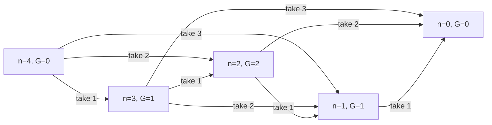

# Chapter 198: Sprague-Grundy Theorem

## Overview

The Sprague-Grundy theorem states that every finite impartial game under normal play is equivalent to a single Nim pile — its **Grundy value** (or *nimber*) — and that a disjunctive sum of independent games has Grundy value equal to the XOR of the components' values. This collapses "who wins under optimal play?" into mex computations plus a XOR, which is why the theorem underlies essentially every combinatorial-game problem in competitive programming and shows up in interviews at Google and trading firms as Nim variants and game-DP questions.

The treatment in [Chapter 61](ch61-game-theory.md) introduces mex, Nim, and Grundy numbers at survey depth; this chapter is the dedicated deep dive: why the mex operator makes the algebra work, a proof sketch of the disjunctive sum theorem, four worked games (Nim, Stair Nim, Grundy's game, green Hackenbush), memoized computation patterns, and a reference table of classic games and their values.

## Impartial Games and the Normal-Play Convention

The theorem's scope is precise, and quoting the boundary is interview credit:

- **Impartial:** both players have the same moves from any position (Nim yes; chess no — chess is *partisan*).
- **Normal play:** the player who cannot move loses (the misère convention — last player to *lose*... i.e., the player unable to move wins — changes the analysis; see the caveat below).
- **Finite:** every play of the game ends (no infinite shuffling; positions form a well-founded graph).

Under these conditions every position is either an **N-position** (Next player wins) or a **P-position** (Previous player wins), and the Grundy value refines this classification into a full algebraic invariant.

## The mex Operator and Grundy Values

The **minimum excludant** of a set of non-negative integers is the smallest value *not* in the set: `mex({0,1,3}) = 2`, `mex({1,2,3}) = 0`, `mex({}) = 0`. The Grundy value of a position is defined recursively:

\\[ G(p) = \\operatorname{mex}\\{\\, G(q) : q \\text{ is an option of } p \\,\\}, \\qquad G(\\text{terminal}) = 0 \\]

Two properties follow immediately from the definition of mex, and they are the entire theory:

1. **No option has the same Grundy value as the position.** If some option had `G(q) = G(p)`, mex would have skipped past that value.
2. **Every smaller value is reachable.** Since `G(p) = g`, each of `0, 1, …, g−1` appears among the options' values.

Property 2 says a position with value g *behaves exactly like a Nim pile of size g*: from a pile of size g you can move to any size below g, and to no pile of size g. This is the sense in which "every impartial game is a Nim pile" — the Grundy value is not just a win/loss bit but a full game isomorphism certificate. Values with this structure are the **nimbers**: the natural numbers equipped with XOR ("nim addition") as their addition.



The diagram is the subtraction game `{1, 2, 3}` around n = 4: `G(4) = mex{G(3), G(2), G(1)} = mex{1, 2, 1} = 0`, so n = 4 is a P-position, and indeed the pattern is `G(n) = n mod 4`. Reading any node: its value is the mex of its neighbors' values.

## The Disjunctive Sum Theorem

**Theorem (Sprague 1935–36, Grundy 1939).** For independent subgames played simultaneously (a move = a move in exactly one component):

\\[ G(G_1 + G_2 + \\dots + G_k) = G(G_1) \\oplus G(G_2) \\oplus \\dots \\oplus G(G_k) \\]

Proof sketch for two components, with \\(s = g_1 \\oplus g_2\\); the general case is induction on the number of components:

- **If s ≠ 0, the mover can reach s = 0.** Let k be the highest set bit of s; one of \\(g_1, g_2\\) — say \\(g_1\\) — has that bit set. Property 2 supplies a move in game 1 to a position with value \\(g_1' = g_1 \\oplus s < g_1\\). The new xor is \\(g_1' \\oplus g_2 = (g_1 \\oplus s) \\oplus g_2 = 0\\).
- **If s = 0, every move breaks it.** A move changes exactly one component, from \\(g_i\\) to some \\(g_i' \\neq g_i\\) by property 1, and \\(g_i' \\oplus g_j \\neq 0\\) when \\(g_i \oplus g_j = 0\\) and \\(g_i' \neq g_i\\).

Both directions together say: positions with xor 0 are exactly the P-positions of the sum, and the winning strategy is "always restore xor = 0". This is also why the mex definition — rather than, say, max or count of options — is the right one: property 2 is what lets one component's value be *decremented arbitrarily* like a Nim pile, and property 1 is what forbids a move that preserves the xor.

## Worked Games

### Nim

A single pile of n stones offers moves to piles of sizes `0 … n−1`, so `G(n) = mex{0,…,n−1} = n` — Nim piles are their own nimbers, and the xor rule *re-proves* the Bouton theorem from [Chapter 61](ch61-game-theory.md): a multi-pile position is losing iff the pile sizes xor to 0.

### Stair Nim (Staircase Nim)

Coins sit on stairs numbered 1 (lowest) upward; a move slides any positive number of coins down one stair; coins reaching the floor (stair 0) leave the game; the player making the last move wins.

**Theorem:** the first player wins iff the XOR of coin counts on the **odd-numbered stairs** (1, 3, 5, …) is non-zero.

Intuition: coins on odd stairs are Nim piles. A move that takes c coins from an *even* stair i down to odd stair i−1 is answered by moving the same c coins from stair i−1 to i−2 — the response keeps every odd-stair count unchanged, so even-stair moves cannot help the mover. Only the odd-stair xor matters. Example: stairs 1–4 hold `[2, 0, 3, 1]`; odd stairs 1 and 3 give \\(2 \\oplus 3 = 1 \\neq 0\\) → first player wins, and the winning move is any move making the odd xor 0 (take 1 coin from stair 1 → \\(1 \\oplus 3 = 2\\)? no — take 2 coins from stair 1 down to the floor: \\(0 \\oplus 3 = 3\\)? — the correct target is a move leaving xor 0: move 1 coin from stair 3 to stair 2 gives \\(2 \\oplus 2 = 0\\)). The general algorithm: compute the odd xor, then scan odd stairs for a move achieving xor 0, exactly like finding a winning Nim move.

### Grundy's Game

Split one heap of n stones into two **unequal** non-empty heaps; the player unable to move (n = 1 or 2) loses. The Grundy value needs the sum rule because a split creates *two* heaps — two independent subgames:

\\[ G(n) = \\operatorname{mex}_{\\,1 \\le a < n-a}\\{\\, G(a) \\oplus G(n-a) \\,\\} \\]

Memoized computation gives `G(0..13) = 0, 0, 0, 1, 0, 2, 1, 0, 2, 1, 0, 2, 1, 3` (OEIS A002188). The sequence is famously **aperiodic** — unlike subtraction games, no period has ever been found, which makes Grundy's game the standard example that "compute the table" is sometimes the only known method.

### Green Hackenbush (Introduction)

Every edge is green (usable by both players); a move cuts one edge, removing it and everything no longer connected to the ground; the player making the last cut wins. The tool is the **colon principle**: a stalk (bamboo) of k edges is a Nim pile of size k, and for a rooted tree,

\\[ G(\\text{tree at } v) = \\bigoplus_{c \\in \\text{children}(v)} \\big( G(\\text{subtree of } c) + 1 \\big) \\]

because each child branch behaves like a bamboo whose length is "its value plus one". A root with two single-edge children has value \\((0+1) \\oplus (0+1) = 0\\) — a P-position despite looking big. General graphs with cycles additionally need the **fusion principle** (cycles collapse to a vertex with an ordinal-weighted stalk), which is the entry point to the full Conway/Berlekamp theory; trees are as far as interviews go.

```python
def hackenbush_tree(u, parent, adj):
    """Green Hackenbush on a rooted tree: XOR of (child value + 1)."""
    g = 0
    for v in adj[u]:
        if v != parent:
            g ^= hackenbush_tree(v, u, adj) + 1
    return g
```

## Computing Grundy Numbers with Memoization

Three reusable patterns, in increasing generality:

**Pattern 1 — one-pile subtraction games (bottom-up table).** The table fits in one array, and the mex loop is O(k) for k moves. For a subtraction set S, values are eventually periodic with period bounded by a function of max(S) (the last max(S) values determine the future, and there are finitely many windows — the pigeonhole argument in [Chapter 61](ch61-game-theory.md)), which is how you answer n up to \\(10^{18}\\): compute a few hundred values, detect the period, reduce n modulo it.

**Pattern 2 — memoized general game graph.** Any game whose states are hashable works with the same mex body:

```python
import sys
from functools import lru_cache
sys.setrecursionlimit(1 << 20)

def make_grundy(moves):
    """moves: callable state -> iterable of successor states."""
    memo = {}
    def g(state):
        if state not in memo:
            opts = {g(s) for s in moves(state)}
            k = 0
            while k in opts:
                k += 1
            memo[state] = k
        return memo[state]
    return g

grundy_split = make_grundy(
    lambda n: (a for a in range(1, n // 2 + 1)
               if a != n - a)          # Grundy's game splits
)
print([grundy_split(n) for n in range(14)])
# [0, 0, 0, 1, 0, 2, 1, 0, 2, 1, 0, 2, 1, 3]
```

**Pattern 3 — bitmask mex (C++ speed trick).** When options' values are small, collect them in a `uint64_t` mask and extract the mex with `__builtin_ctzll(~mask & mask_limit)`. This makes the inner loop one instruction instead of a scan, which matters when states number in the millions.

Complexity is \\(O(\\text{states} \\times \\text{average moves})\\) — the states, not the mex loop, are the bottleneck, so the real skill is choosing a state encoding that collapses symmetric positions (sorted tuples instead of permutations, `frozenset` instead of lists).

## Interview Problem Patterns

| Pattern | What to do |
|---|---|
| "Two players remove stones/counters under rule X; who wins?" | Identify subgames; compute G; XOR; answer `xor != 0` |
| "…and output the number of winning first moves" | Count options q with `G(q) == 0` |
| "n up to 1e18" | Compute small table, detect periodicity, reduce n |
| Multiple heaps/boards played simultaneously | Per-component Grundy values, XOR them |
| Players draw from "their own" side, or scores differ | NOT impartial — use minimax/game DP ([Chapter 180](ch180-minimax-alpha-beta.md)) |
| Game can loop forever / draws exist | Grundy theory does not apply — classify Win/Lose/Draw by retrograde BFS ([Chapter 61](ch61-game-theory.md)) |

The LeetCode spectrum is instructive: *Nim Game* (LC 292) is pure subtraction-game modular arithmetic; the *Stone Game* series (LC 877 and friends) looks like a game problem but is partisan (players take from different ends with different goals), so the correct tool is interval DP over "my score minus yours", not Grundy numbers. Interviewers deliberately blur this line — naming which side of the line a problem is on is the tested skill.

## Classic Games and Their Grundy Values

| Game | Move | Grundy value / characterization | Winner test |
|---|---|---|---|
| Nim pile of n | remove any positive number | \\(G(n) = n\\) | xor of piles ≠ 0 |
| Subtraction {1, …, k} | remove ≤ k | \\(G(n) = n \\bmod (k+1)\\) | ≠ 0 |
| Subtraction {1, 4} | remove 1 or 4 | eventually periodic, period 5? compute — pattern `0 1 2 3 0 1 2 3 4 0 …` stabilizes | ≠ 0 |
| Stair Nim | coins down one stair | odd stairs = Nim piles | xor of odd stairs ≠ 0 |
| Grundy's game | split heap into two unequal heaps | computed table, aperiodic (`0 0 0 1 0 2 1 0 2 1 …`) | ≠ 0 |
| Wythoff's game | remove from one pile or both equally | P-positions \\((\\lfloor k\\varphi \\rfloor, \\lfloor k\\varphi^2 \\rfloor)\\) | pair not in the Beatty list |
| Green Hackenbush bamboo | cut an edge | \\(G = \\) stalk length | ≠ 0 |
| Green Hackenbush tree | cut an edge | colon principle: xor of (child + 1) | ≠ 0 |

Caveats worth rehearsing: under **misère play**, Nim-like analysis holds only while all piles have size ≤ 1 (the last-move forced), and the general misère theory (Conway's genus) is far beyond interview scope. Under **partisan** play there are no Grundy values at all — the minimax/alpha-beta machinery of [Chapter 180](ch180-minimax-alpha-beta.md) takes over.

## Interview Questions

1. **Why is mex — and not, say, the maximum option value — the right definition?**
   Mex is the unique choice making a Grundy-g position behave exactly like a Nim pile of size g: it guarantees (a) no option shares the position's value, so from xor-equal you can never move to xor-equal, and (b) every smaller value occurs among the options, so any "smaller nimber" is reachable — which is precisely what the disjunctive-sum proof needs to decrement one component while zeroing the xor. Max would collapse distinct games (any position with a big option would look identical), losing both properties.

2. **State and sketch the disjunctive sum theorem.**
   The Grundy value of a sum of independent games is the XOR of component values. Sketch: with \\(s = g_1 \oplus g_2\\), if \\(s \neq 0\\) take the highest set bit of s, find the component whose value has that bit, and move it to \\(g \oplus s\\) (reachable because mex) — new xor 0. If \\(s = 0\\), any move changes one component to a value it cannot have had (no option repeats the position's value), so the xor becomes non-zero. Hence xor-0 positions are exactly P-positions.

3. **How would you solve a game on n up to 10^18?**
   Compute Grundy values for a window of small states, then use structure: subtraction games are eventually periodic (the future depends on the last max(S) values, so pigeonhole bounds the period — verify it empirically over several windows), and games with self-similar structure (Nim piles, Hackenbush stalks) often have closed forms like n mod (k+1). Reduce the huge n modulo the period and answer from the table. Say explicitly that Grundy's game is aperiodic — "just find the period" is not universally valid.

4. **When does Sprague-Grundy NOT apply?**
   Three boundary cases: partisan games (players have different move sets — Stone Game, chess) need minimax DP or alpha-beta instead; misère play breaks the xor rule once small piles dominate and needs case analysis; games with cycles/draws are not well-founded, so Grundy values are undefined until you classify Win/Lose/Draw retrogradely. Also, if the question asks for the optimal *score* rather than win/loss, it is an optimization DP, not a combinatorial game.

5. **How do you find the winning moves, not just the winner?**
   The position is winning iff its Grundy value g ≠ 0, and a move to any option with Grundy value \\(g \oplus \\) ... concretely: an option q is a winning move iff `G(q) == 0`. To count winning moves, evaluate G over all options (or over all reachable states) and count the zeros; for Nim specifically, the canonical move reduces the pile owning the highest set bit of the xor down to `pile ^ xor`.

## Key Takeaways

- Grundy value = mex of options' values; it is a full equivalence to a Nim pile, not just a win/loss flag.
- The two mex properties — "no equal option" and "every smaller value reachable" — are what make XOR addition work in sums of games.
- Disjunctive sum theorem: `G(G1 + G2) = G(G1) ⊕ G(G2)`; winning strategy = always move to xor 0.
- Subtraction games give periodic values (`n mod (k+1)` for {1..k}); Stair Nim reduces to xor over odd stairs; Grundy's game is the aperiodic cautionary example; green Hackenbush trees use the colon principle `⊕ (child + 1)`.
- Computation is memoized mex over a game graph — the state encoding, not the mex loop, is the performance problem; bitmask mex and periodicity detection are the standard accelerations.
- The theorem's boundary is the interview trap: partisan, misère, and cyclic games need different machinery (minimax DP, case analysis, retrograde BFS).

## References

- R. P. Sprague, "Über mathematische Kampfspiele", Tohoku Mathematical Journal 41, 1935–36 — Grundy values introduced (in German)
- P. M. Grundy, "Mathematics and Games", Eureka 2, 1939 — independent rediscovery
- J. H. Conway, *On Numbers and Games*, Academic Press, 1976 — nimbers and the sum theory
- Berlekamp, Conway, Guy, *Winning Ways for Your Mathematical Plays*, Academic Press, 1982 — colon/fusion principles for Hackenbush
- [OEIS A002188: Grundy values for Grundy's game](https://oeis.org/A002188)
- [Wikipedia: Nimber](https://en.wikipedia.org/wiki/Nimber) — the algebra of Grundy values

## Cross-References

- [Chapter 61: Game Theory for Interviews](ch61-game-theory.md) — survey-level mex/Nim coverage, the game-on-graphs classification, and Wythoff's game
- [Chapter 59: DP Expanded](ch59-dp-expanded.md) — game DP (Nim and Grundy) among the DP catalog
- [Chapter 180: Minimax and Alpha-Beta](ch180-minimax-alpha-beta.md) — the partisan-game machinery Sprague-Grundy explicitly does not cover
- [Chapter 30: DP Fundamentals](ch30-dp-fundamentals.md) — memoization patterns the Grundy templates reuse
