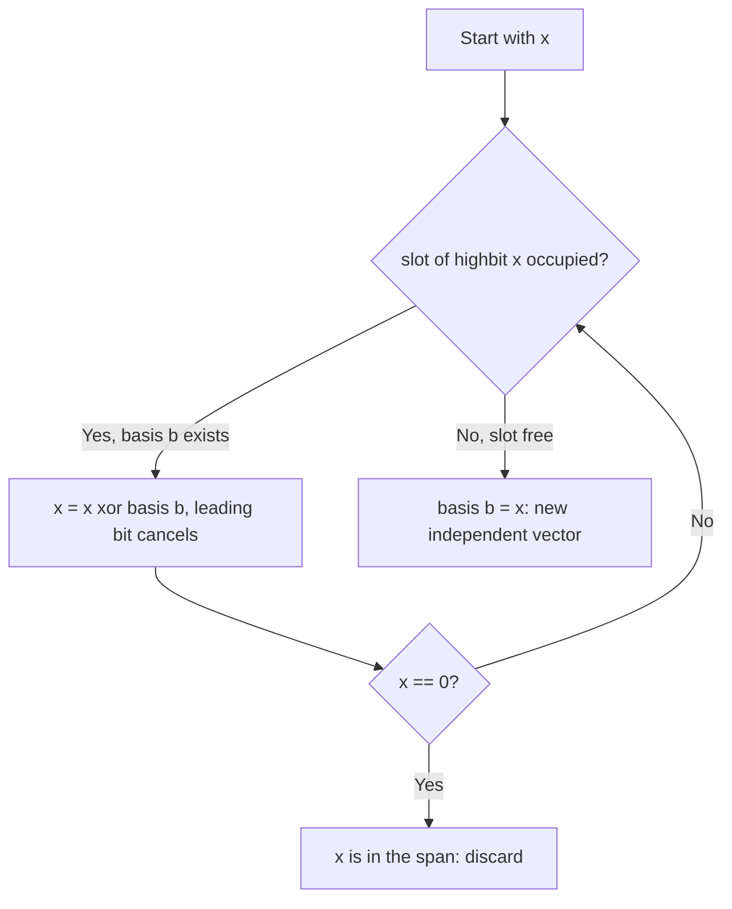
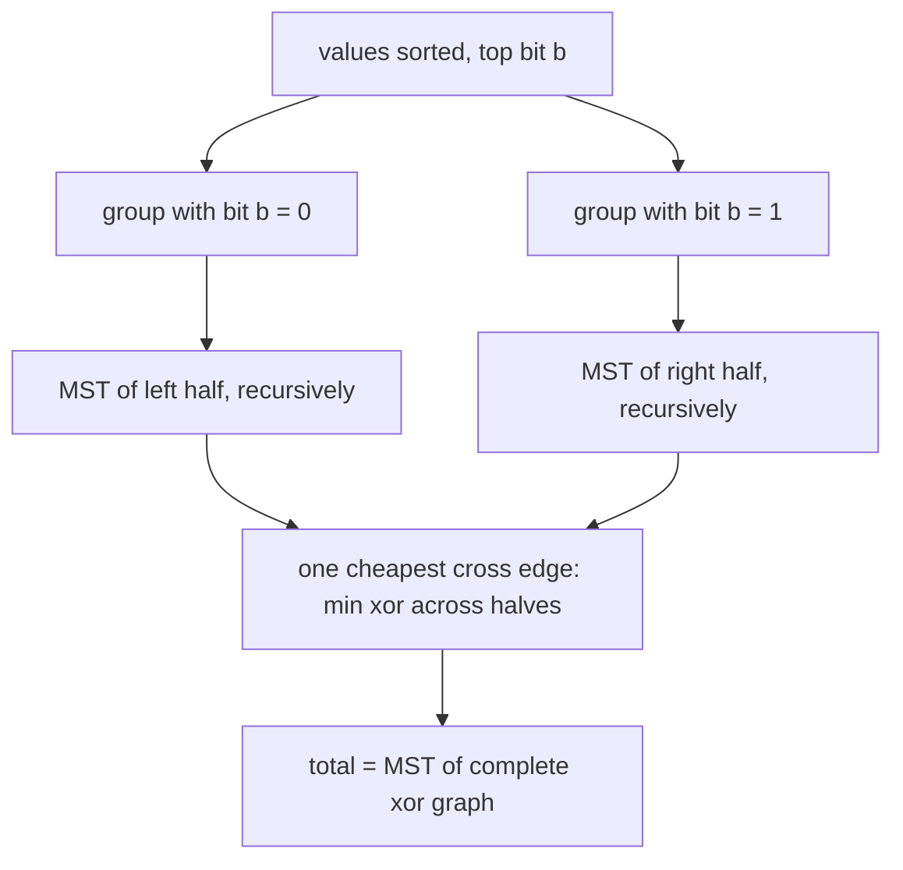

# Chapter 199: XOR Basis and Linear Algebra over GF(2)

## Overview

An XOR basis is a set of at most \\(B = \\lfloor \\log_2 (\\max A) \\rfloor + 1\\) integers that represents the entire **span** of a multiset of integers under XOR — the same role a basis plays in linear algebra, with each integer treated as a bit vector over the field \\(\\mathbb{F}_2\\). Insertion, max-xor-subset, k-th-smallest-xor, and membership all run in \\(O(B)\\) per element, and the structure is so small (≤ 64 numbers) and so fast that it appears whenever a problem says "subset XOR" and \\(n\\) is large. Interview usage is concentrated in trading-firm and big-tech screening: maximum subset XOR is the canonical entry question, and the basis is the follow-up that separates candidates who memorized Gaussian elimination from those who understood it.

This chapter builds the basis by reducing each input against the highest set bit, explains the Gaussian elimination view that makes the queries obvious, gives a compact C++ implementation with all four query types, and surveys the applications that justify the technique: XOR MST via Borůvka phases, xor-path queries on trees through the cycle space, and combination-lock reachability. The matroid connection (the XOR-matroid is the linear matroid over \\(\\mathbb{F}_2\\)) is treated in [Chapter 197](ch197-matroid-intersection.md), which uses the basis insert as its oracle.

## Vectors over GF(2) and What a Basis Means

Treat a 64-bit integer \\(x\\) as a vector in \\(\\mathbb{F}_2^{64}\\): bit `i` is the coordinate at position \\(i\\). XOR is vector addition (addition = subtraction mod 2), so the span of a set \\(S\\) is:

\\[ \\operatorname{span}(S) = \\Big\\{\\, \\bigoplus_{x \\in T} x \\;:\\; T \\subseteq S \\,\\Big\\} \\]

— every value obtainable by XOR-ing a subset. The span has exactly \\(2^{\\operatorname{rank}}\\) elements where \\(\\operatorname{rank} \\le B \\le 64\\), regardless of how large \\(|S|\\) is: a million numbers span at most \\(2^{64}\\) values, and often far fewer. Three facts drive every application:

1. **Rank is logarithmic.** Any independent set has size ≤ 63 (independence = "no subset XORs to 0"), so a basis needs \\(O(\\log \\max)\\) slots and every operation on it is \\(O(B)\\).
2. **Representation is canonical once reduced.** A Gaussian-eliminated basis is uniquely determined by the span (take the element with the top bit, then eliminate), which is why queries like k-th smallest have closed forms.
3. **Membership is a reduction.** \\(x \\in \\operatorname{span}(S)\\) iff reducing `x` against the basis annihilates it — the constructive form of "the vector lies in the row space".

| Representation | What it stores | Size | Answers |
|---|---|---|---|
| Raw multiset \\(S\\) | all elements | \\(O(n)\\) | nothing fast |
| Unreduced basis | one value per high bit | ≤ 64 words | presence, max xor \\(O(B)\\) |
| Reduced basis (Gauss) | previous + self-eliminated | ≤ 64 words | + k-th smallest, min xor, sorted order |

## Basis Construction: Reduce by High Bit

Maintain an array `basis[b]` = some value whose highest set bit is exactly `b`, or 0 if no such vector is in the basis yet. Inserting `x` walks down from its own high bit: whenever bit `b` is set and `basis[b]` is occupied, XOR to cancel it — this drops `x`'s leading one, strictly decreasing its value, so the loop terminates in at most `B` steps. If the value survives to bit `b` with `basis[b]` empty, store it; if it reaches 0, `x` was dependent on the existing basis (it belongs to the span) and is discarded.



**Worked example** — insert `11 (1011)`, `9 (1001)`, `13 (1101)`:

| Step | Value | Reduction trace | Action |
|---|---|---|---|
| insert 11 | 1011 | high bit 3 free | `basis[3] = 11` |
| insert 9 | 1001 | 9 ^ 11 = 0010; high bit 1 free | `basis[1] = 2` |
| insert 13 | 1101 | 13 ^ 11 = 0110 → 0110 ^ 0010 = 0100; high bit 2 free | `basis[2] = 4` |

Final basis: `{basis[3] = 11, basis[2] = 4, basis[1] = 2}` — rank 3, span size \\(2^3 = 8\\). Note 9 was *not* stored; it became the vector `2`, and the information "9 was inserted" is irrelevant because 9 and 11 + 2 generate the same span.

```cpp
struct XorBasis {
    static constexpr int B = 60;            // bits 0..59: values < 2^60
    unsigned long long basis[B] = {};       // basis[b] has top bit == b

    // insert x; returns true if x increased the rank
    bool insert(unsigned long long x) {
        for (int b = B - 1; b >= 0 && x; --b) {
            if (!((x >> b) & 1)) continue;
            if (!basis[b]) { basis[b] = x; return true; }
            x ^= basis[b];                  // cancel the leading bit
        }
        return false;                       // x was dependent (already in span)
    }

    bool contains(unsigned long long x) const {
        for (int b = B - 1; b >= 0 && x; --b)
            if ((x >> b) & 1) x ^= basis[b];
        return x == 0;
    }

    unsigned long long max_xor() const {    // max over non-empty subsets
        unsigned long long r = 0;
        for (int b = B - 1; b >= 0; --b)
            r = max(r, r ^ basis[b]);       // take the bit if it helps
        return r;
    }
};
```

The insertion loop is **forward Gaussian elimination with the pivot chosen as the highest set bit**: each `basis[b]` is a pivot row, and XOR-ing is exactly "subtract a multiple of the pivot row" (the only multiple available over \\(\\mathbb{F}_2\\) is 1). Complexity is \\(O(B)\\) per insert, \\(O(nB)\\) to build, \\(O(B)\\) space — the same asymptotics as bitset-based Gaussian elimination on an \\(n \\times B\\) matrix, but without materializing the matrix.

For interviews and quick prototyping, the whole structure is ~15 lines of Python; the only trap is remembering that `1 << b` overflows nothing in Python but that the loop must still stop at `x == 0`:

```python
class XorBasis:
    def __init__(self, bits=60):
        self.bits = bits
        self.basis = [0] * bits          # basis[b] has top bit == b

    def insert(self, x: int) -> bool:    # True iff rank increased
        for b in range(self.bits - 1, -1, -1):
            if not (x >> b) & 1:
                continue
            if self.basis[b] == 0:
                self.basis[b] = x
                return True
            x ^= self.basis[b]           # cancel the leading bit
            if x == 0:
                return False
        return False

    def contains(self, x: int) -> bool:
        for b in range(self.bits - 1, -1, -1):
            if (x >> b) & 1:
                x ^= self.basis[b]
        return x == 0

    def max_xor(self) -> int:
        r = 0
        for v in self.basis:
            r = max(r, r ^ v)            # works with any pivot order
        return r
```

Note the greedy `max_xor` here scans pivots in *array order* (high bit first) and compares `r` with `r ^ v` — equivalent to the bit-by-bit formulation because each pivot's contribution dominates all lower pivots combined. Both formulations appear in the wild; recognizing they are the same argument is a good sign you understand the structure rather than the template.

## The Gaussian Elimination View

The unreduced basis above is row-echelon (pivots are distinct leading bits) but not *reduced*: a pivot row may still contain bits belonging to other pivots. Full reduction — after building, XOR every `basis[j]` into every `basis[i]` (`j > i`, i.e., lower pivots) whenever bit `j` of `basis[i]` is set — produces the unique canonical basis of the span, analogous to reduced row echelon form. The reduced form enables the two queries the echelon form cannot answer directly:

- **k-th smallest xor (k-th smallest non-empty subset value).** In the reduced basis, the distinct subset xors are in bijection with bitmasks over the sorted pivot values: take the reduced pivot values \\(v_0 < v_1 < \\dots < v_{r-1}\\) (sorted ascending), write \\(k\\) in binary, and XOR the \\(v_i\\) where bit \\(i\\) of \\(k\\) is set, with \\(k = 0\\) meaning the empty subset (xor 0). This works because the reduced basis' top bits are ordered: the value with the \\(i\\)-th smallest top bit dominates ordering exactly like a most-significant digit.
- **Counting and ranking.** The span has \\(2^r\\) elements (\\(2^r - 1\\) non-empty subsets' worth); "\\(x\\) is the k-th smallest" reduces to `contains(x)` plus a rank computed the same way.

The determinant view is the same fact in different clothing: over \\(\\mathbb{F}_2\\), a set of vectors is independent iff the matrix determinant (computed mod 2) is 1, and the basis' existence is exactly "determinant ≠ 0 after choosing pivot rows". The **number of solutions** to "xor a subset of \\(S\\) to equal \\(t\\)" is either 0 or \\(2^{n - r}\\): reduce \\(t\\) against the basis (0 solutions if it fails), then the free variables are the \\(n - r\\) non-basis elements, each doubled by an independent kernel vector. That counting formula is the standard follow-up when an interviewer asks "how many subsets xor to a given value?" — worth memorizing as \\(0\\) or \\(2^{n-r}\\).

The full-reduction pass is short enough to memorize alongside the insert loop:

```cpp
void reduce() {
    for (int i = B - 1; i >= 0; --i) {          // higher pivots first
        if (!basis[i]) continue;
        for (int j = i - 1; j >= 0; --j)        // clear bit j of basis[i]
            if ((basis[i] >> j) & 1) basis[i] ^= basis[j];
    }
    // collect the nonzero pivots ascending into sorted_pivots[]
    rank = 0;
    for (int i = 0; i < B; ++i)
        if (basis[i]) sorted_pivots[rank++] = basis[i];
}
```

Continuing the worked example (`11, 9, 13`, echelon basis `{basis[3] = 11, basis[2] = 4, basis[1] = 2}`): reduction clears bit 1 of `basis[3]` — `11 ^ 2 = 9 = 1001` — and bit 2 of the result is already clear, so the pass yields `basis[3] = 9`. The canonical basis is `{2, 4, 9}` with top bits `{1, 2, 3}`, and the subset-xor table is fully determined:

| k (binary) | pivots used | value |
|---|---|---|
| 000 | — | 0 |
| 001 | 2 | 2 |
| 010 | 4 | 4 |
| 011 | 2, 4 | 6 |
| 100 | 9 | 9 |
| 101 | 9, 2 | 11 |
| 110 | 9, 4 | 13 |
| 111 | 9, 4, 2 | 15 |

The ordering property that makes this a *sort*: for reduced pivots \\(v_i < v_j\\) (ascending top bit), any subset containing \\(v_j\\) exceeds every subset using only \\(v_0, \\dots, v_{j-1}\\), because \\(v_j\\)'s top bit cannot be produced by the smaller pivots. That is exactly the most-significant-digit argument, and it is why k-th smallest is a single XOR pass once reduction is done.

## Queries in Detail

All queries are single downward passes over the basis array.

| Query | Algorithm | Cost (unreduced) | Cost (reduced) |
|---|---|---|---|
| `insert(x)` | reduce by high bit, store or drop | \\(O(B)\\) | \\(O(B)\\) |
| `contains(x)` | reduce to zero? | \\(O(B)\\) | \\(O(B)\\) |
| `max_xor()` / `min_xor()` | greedy: take pivot iff it flips the answer bit | \\(O(B)\\) | \\(O(B)\\) |
| `kth_smallest(k)` | binary decomposition of k over sorted pivots | not applicable | \\(O(B)\\) |
| `count()` of distinct subset xors | \\(2^{\\operatorname{rank}}\\) | \\(O(1)\\) after build | same |
| `merge(other)` | insert every element of the other basis | \\(O(B^2)\\) | \\(O(B^2)\\) |

Why the max-xor greedy is correct: process bits from high to low; the contribution of bit \\(b\\) to the total is \\(2^b\\), which exceeds \\(2^{b-1} + 2^{b-2} + \\dots = 2^b - 1\\) — a majority argument per bit. At bit \\(b\\), the only way to set it is to XOR in the (unique) basis vector whose top bit is \\(b\\); take it iff the current running value's bit \\(b\\) is 0. Because each bit decision is independent of all lower bits, the greedy is exact. The same loop computes min xor by flipping the preference (take the pivot iff it clears a set bit), and the reduced basis makes min xor simply `basis[0]` when the smallest pivot has top bit 0 — but the greedy works in both forms, so it is the one to memorize.

For **k-th smallest**, index from \\(k = 0\\) (empty subset, xor 0); \\(k \\ge 2^r\\) has no answer. Example with the reduced basis of `{11, 9, 13}` = pivots `{2, 4, 9}` sorted ascending: \\(k = 0 \\to 0\\), \\(k = 1 \\to 2\\), \\(k = 2 \\to 4\\), \\(k = 3 \\to 6\\), \\(k = 4 \\to 9\\), \\(k = 5 \\to 11\\), \\(k = 6 \\to 13\\), \\(k = 7 \\to 15\\). Checking \\(k = 5\\): binary 101 → \\(9 \\oplus 2 = 11\\), and indeed 11 is in the span.

```cpp
// after full reduction: basis values sorted ascending by top bit
unsigned long long kth(unsigned long long k) const {   // k = 0 -> empty subset
    if (k >= (1ULL << rank)) return ~0ULL;              // out-of-range sentinel
    unsigned long long r = 0;
    for (int i = 0; i < rank; ++i)
        if ((k >> i) & 1) r ^= sorted_pivots[i];        // ascending pivots
    return r;
}
```

## Persistence and Prefix Bases

The basis is a 60-slot array of values, so **persistence by path copying is trivial**: an insert touches at most one slot plus the rank counter, so a persistent version copies \\(O(B)\\) words per version — or \\(O(1)\\) expected with a rollback stack, since each insert that succeeds changes exactly one slot. This cheap persistence is the engine behind the two standard offline patterns:

- **Prefix bases over an array (CF 1100F).** To answer "maximum subset xor of any value in `a[0..r]`" for many right endpoints \\(r\\), keep one basis per prefix. Naively storing `n` bases costs \\(O(nB)\\) — fine — but each can be built incrementally from the previous one in \\(O(B)\\), and a query against `a[l..r]` walks the prefix-`r` basis and only uses pivots whose *insertion time* (the array index where that pivot entered) is `≥ l`. Keeping the newest pivot per bit is a one-line rule: when a new value would occupy an occupied slot, XOR the two and re-insert the *older* value further down, exactly like union-by-time. The result answers each query in \\(O(B)\\) after \\(O(nB)\\) preprocessing.
- **Basis merging.** Merging two spans is just inserting every pivot of the smaller basis into the larger: \\(O(B^2)\\) worst case per merge, which makes small-to-large merging over trees cost \\(O(n B \\log n)\\) total — the standard shape for "maximum xor path" queries answered online at every vertex, and the same merge loop used as the linear-matroid oracle inside [Chapter 197](ch197-matroid-intersection.md).

| Variant | Build cost | Query cost | When to use |
|---|---|---|---|
| Single static basis | \\(O(nB)\\) | \\(O(B)\\) | one span, many queries |
| Prefix bases (persistent) | \\(O(nB)\\) time and space | \\(O(B)\\) | l..r range subset queries |
| Rollback basis (undo stack) | \\(O(B)\\) per op | \\(O(B)\\) | nested lifetimes, offline DFS |
| Small-to-large merged bases | \\(O(n B \\log n)\\) total | \\(O(B)\\) at every node | tree/path DP with spans |

## Application: XOR Minimum Spanning Tree

Given a complete graph on values \\(a_1, \\dots, a_n\\) with \\(w(u,v) = a_u \\oplus a_v\\) (Codeforces 888G "Xor-MST"), \\(n\\) up to \\(2 \\cdot 10^5\\) makes the \\(\\Theta(n^2)\\) edges untouchable. The key observation is bit-decomposability: split values by their top bit; MST edges never connect the two halves *through* a higher bit, so the problem recursively splits into two independent subproblems (MST of each half) plus one cheapest cross edge.



A Borůvka-style implementation runs in phases — this is where the structure earns the name "Borůvka over the basis/trie":

1. Sort the values once. Each phase, every current component finds its cheapest outgoing edge by walking the *other* components' value set (a binary trie over the sorted halves, or a linear basis per component) — an \\(O(B)\\) descent per component per phase.
2. Add all selected edges (Borůvka's cut property guarantees a forest of safe edges), contract components, repeat: the component count at least halves each phase.

The result is \\(O(n \\log n \\cdot B)\\) or \\(O(n B \\log n)\\) depending on the edge-finding structure, versus \\(O(n^2)\\) Prim. Borůvka's role ([Chapter 182](ch182-boruvka-mst.md)) is precisely that its phases are embarrassingly parallel and component-local, which is what makes the recursion composable. The pure divide-and-conquer-on-bits formulation reaches \\(O(n B)\\) after sorting: solve both halves recursively, then find the minimum \\(a_u \\oplus a_v\\) across the sorted halves with a two-pointer trie walk — the same "cheapest cross connection" subproblem Borůvka's phase solves.

## Application: XOR Path Queries on Trees

For any fixed root, define the **root-path xor** \\(p(v) = \\bigoplus\\) of edge weights from root to `v`. Then for any two vertices:

\\[ \\operatorname{xorpath}(u, v) = p(u) \\oplus p(v) \\]

because the root-to-LCA segments cancel (every edge appears twice). This immediately gives O(1) per query for "xor of the path u–v" after one DFS. The basis enters when the graph has **cycles** (or when you may *add* extra edges): any walk from `u` to `v` has xor \\(p(u) \\oplus p(v) \\oplus c\\) for some \\(c\\) in the **cycle space** — the span of \\(w(e_{uv}) = p(u) \\oplus p(v)\\) over every non-tree edge \\(e_{uv}\\). Build the basis of that span (at most \\(m - n + 1\\) inserts, rank ≤ 30), and every query becomes: reduce \\(p(u) \\oplus p(v) \\oplus t\\) against the basis for the best/min/k-th value, exactly the queries of the previous section. Codeforces 845G ("Shortest Path Problem?") is the canonical minimum-xor-walk version, and Codeforces 1100F ("Ivan and Burgers") is the maximum-xor-on-path version solved offline with prefix bases along the tree.

The same cycle-space argument handles rerooting and edge updates: deleting a tree edge creates exactly one fundamental cycle, so a basis increment (insert the reconnection edge's path xor) maintains the structure under offline edge updates. This is the standard toolbox behind "xor on graph" problems; the reachability half is what combination locks use.

```cpp
// Cycle-space basis over a weighted graph: DFS builds p[v]; non-tree edges
// contribute p[u] ^ p[v] ^ w to the basis. Then any u-v walk can realize
// p[u] ^ p[v] ^ (any span element).
void dfs(int v, int parent, unsigned long long cur) {
    p[v] = cur;
    for (auto [to, w] : adj[v]) {
        if (to == parent) continue;
        if (!seen[to]) { seen[to] = true; dfs(to, v, cur ^ w); }
        else basis.insert(p[to] ^ cur ^ w);   // back edge: fundamental cycle
    }
}
```

The subtlety worth stating out loud: the basis stores *cycles*, and the query must add \\(p(u) \\oplus p(v)\\) *before* reducing against it. A walk may also be closed (\\(u = v\\)), in which case the reachable values are exactly the cycle space — the answer to "minimum xor closed walk through u" is `basis.min_xor()`, which is 0 only if the graph is acyclic around `u`.

## Application: Combination Locks and Reachability

The "combination lock" family: \\(n\\) buttons, button \\(i\\) toggles a known subset (encoded as an integer) of \\(d\\) dials or lamps, and the question is whether target state \\(t\\) is reachable — and if yes, the minimum number of button presses. Solvability is pure membership: \\(t \\in \\operatorname{span}\\{b_1, \\dots, b_n\\}\\), answered by one basis build plus one `contains` call, i.e., \\(O(nB)\\). Reachability of *every* state is `rank == d`. Press-count variants split by whether buttons may repeat:

- **Repetition allowed, minimize count:** the minimum number of presses to reach \\(t\\) is the minimum-weight subset XOR-ing to \\(t\\); with unit weights and small rank, BFS over the \\(2^{\\operatorname{rank}}\\) span states from 0 works, or reduce \\(t\\) and count pivots when the basis is reduced and weights are uniform on pivots. With arbitrary weights it becomes the minimum-weight Codeword problem (NP-hard in general rank — say so; the basis does not save you for large rank).
- **Each button at most once:** count of subsets reaching \\(t\\) is \\(0\\) or \\(2^{n-r}\\) — the kernel-counting formula from the Gaussian elimination section, applied verbatim.
- **Lights-out style grids** (pressing toggles a plus-shape): the toggle patterns form the vector set; the same membership test decides solvability, which is why the linear-algebra framing beats ad-hoc search for \\(d \\le 60\\).

## Pitfalls

| Pitfall | Symptom | Fix |
|---|---|---|
| Basis sized to `31` while values reach \\(2^{62}\\) | wrong answers on large inputs | size by `log2(max value) + 1`; use `unsigned long long` and shift by `b` not `1 << b` |
| `1 << 63` for the top-bit probe | undefined behavior / sign bit trap | use `1ULL << b` everywhere |
| k-th smallest on an unreduced basis | duplicates or wrong order | full-reduce first; the bijection needs the canonical form |
| Forgetting the empty subset | k-th smallest off by one (0 must map to xor 0) | index \\(k\\) from 0; span size is \\(2^r\\) including 0 |
| Merging by inserting values one at a time | \\(O(B^2)\\) becomes \\(O(nB)\\) if you re-scan the raw list | merge basis-to-basis: ≤ 64 inserts total |
| Storing only the basis for path queries | lost the \\(p(u) \\oplus p(v)\\) component | keep root-path xors separately; basis holds only the cycle space |
| Rebuilding the basis per query | \\(O(nBq)\\) blowup | offline sort by position and keep \\(O(B)\\) persistent bases (1100F pattern) |

## Interview Questions

1. **Why can a basis have at most 64 elements, and what does that buy you?**
   Basis vectors are independent, meaning no subset of them XORs to 0. If you look at the pivot bits — each basis vector's highest set bit — those must be distinct (two vectors sharing a top bit XOR to one with a strictly smaller top bit). There are at most 64 bit positions, so rank ≤ 64. The payoff: insertion, membership, max-xor, and k-th-xor all cost \\(O(64)\\) regardless of how many millions of original elements produced the span, and the span itself never exceeds \\(2^{64}\\) values.
2. **How do you find the maximum XOR of any subset — and why is the greedy right?**
   Build the basis, then scan pivots from the highest bit down, XOR-ing the current accumulator with `basis[b]` whenever that increases the accumulator. Correctness is the per-bit majority argument: setting bit \\(b\\) contributes \\(2^b\\), more than all lower bits combined (\\(2^b - 1\\)), and within bit \\(b\\) the unique pivot with top bit \\(b\\) is the only way to influence that bit, so the locally best choice is globally forced. The same loop with the comparison flipped gives the minimum.
3. **How many subsets of the array XOR to a given value t?**
   Reduce \\(t\\) against the basis. If it does not reduce to 0, the answer is 0. Otherwise the answer is \\(2^{n-r}\\): fix the \\(r\\) basis elements that generate \\(t\\), and each of the other \\(n - r\\) elements can be included or excluded freely as long as some kernel vector compensates — formally, the solution set is a coset of the kernel, which has size \\(2^{n-r}\\). This is the standard follow-up to "is t reachable?".
4. **When do you need the reduced (Gaussian-eliminated) basis rather than the echelon one?**
   Only for order-sensitive queries: k-th smallest xor, min xor by direct read-off, and any "sort the span" request. Membership and max-xor work on the echelon basis. Full reduction costs one extra \\(O(B^2)\\) pass — XOR every pivot into every higher-bit pivot that still contains its bit — and it makes the subset-to-value map a clean binary decomposition over pivots sorted ascending.
5. **How does the basis help on a tree or general graph with weighted edges?**
   Root the tree and keep root-path xors; a u–v path xor is \\(p(u) \\oplus p(v)\\) in a tree. With cycles, every walk's xor is \\(p(u) \\oplus p(v)\\) plus an element of the cycle space — the span of \\(p(u) \\oplus p(v)\\) over non-tree edges. Build that basis once (≤ \\(m - n + 1\\) inserts), then each query reduces a \\(B\\)-bit value: minimum walk, maximum walk, or k-th smallest. The basis stores only the cycle space — forgetting the tree path-xor component is the classic bug.
6. **What does XOR MST have to do with Borůvka?**
   Edge weights \\(a_u \\oplus a_v\\) decompose bit by bit: values split by their top bit, and no MST edge needs to cross the split at that bit level more than once. Each Borůvka phase has every component find its cheapest outgoing edge by a \\(O(B)\\) descent over the other side's values (trie or basis), the safe edges merge components, and the component count halves — \\(O(n \\log n \\cdot B)\\) total without ever materializing \\(\\Theta(n^2)\\) edges. Borůvka's cut-property phases are what make the implicit complete graph tractable.

## Key Takeaways

- Integers are vectors over \\(\\mathbb{F}_2\\); the XOR basis is their Gaussian elimination, with `basis[b]` a pivot whose top bit is `b` and rank ≤ log(max) ≤ 64.
- Insert = reduce by high bit until the value dies (dependent) or finds a free slot; \\(O(B)\\) per insert, \\(O(nB)\\) to build, tiny constants.
- `contains`, `max_xor`, `min_xor` are one greedy pass each; k-th smallest and span sorting need the **reduced** basis and the binary decomposition over ascending pivots.
- "How many subsets XOR to t?" = 0 or \\(2^{n-r}\\); the span has \\(2^r\\) distinct values.
- Applications: XOR MST (CF 888G) via Borůvka phases + bit-splitting, path-xor queries via the cycle space \\(p(u) \\oplus p(v)\\) plus basis (CF 845G, 1100F), and combination-lock reachability/counting as pure membership.
- The XOR-matroid framing (ground set, independent = xor-distinct) connects this chapter to matroid intersection, where basis insert is the oracle.

## References

- [Wikipedia: Gaussian elimination](https://en.wikipedia.org/wiki/Gaussian_elimination) — the row-reduction process the basis implements over \\(\\mathbb{F}_2\\)
- [Codeforces 888G: Xor-MST](https://codeforces.com/contest/888/problem/G) — the XOR MST problem solved by bit-splitting / Borůvka phases
- [Codeforces 845G: Shortest Path Problem?](https://codeforces.com/contest/845/problem/G) — minimum-xor walk via cycle-space basis
- [Codeforces 1100F: Ivan and Burgers](https://codeforces.com/contest/1100/problem/F) — maximum-xor path queries with offline prefix bases
- KACTL team, *KACTL: KTH Competitive Programming Template Library* — Gaussian-elimination-style bit templates in the `numerical/` and `graph/` sections (repository root: https://github.com/kth-competitive-programming/kactl)

## Cross-References

- [Chapter 95: Advanced Bit Manipulation](ch95-bit-advanced.md) — the bit-level toolbox (popcount, masks) the basis loops over
- [Chapter 182: Borůvka's MST Algorithm](ch182-boruvka-mst.md) — the phase structure reused by XOR MST
- [Chapter 192: Subset Convolution](ch192-subset-convolution.md) — the other \\(\\mathbb{F}_2\\)-flavored technique family (zeta/Möbius over masks)
- [Chapter 197: Matroid Intersection](ch197-matroid-intersection.md) — the XOR-matroid and the basis-insert independence oracle
- [Chapter 198: Sprague-Grundy Theorem](ch198-sprague-grundy.md) — XOR as the algebra of impartial game sums
