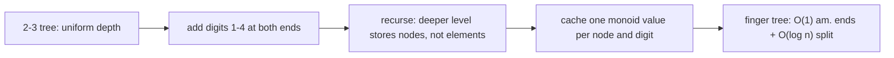
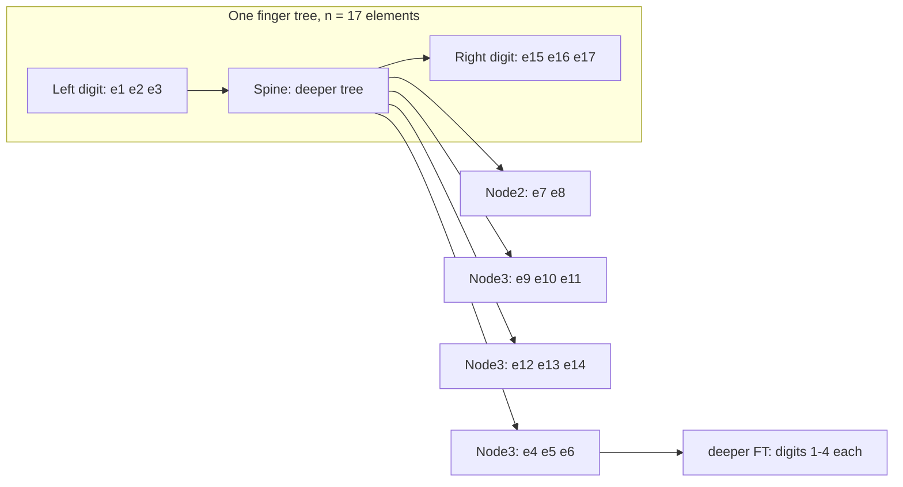
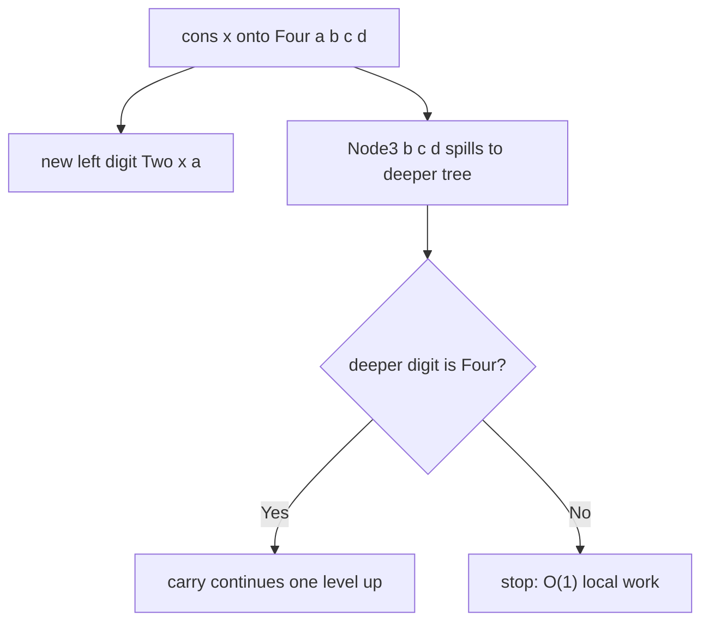

# Chapter 200: Finger Trees

## Overview

A finger tree (Hinze & Paterson 2006) is a persistent sequence built from a spine of 2-3 trees with small "digits" (1–4 elements) dangling off both ends, where every node caches a **monoidal annotation** such as size, sum, or max. The payoff is one structure covering many: O(1) amortized push/pop at both ends, O(log n) indexed access, O(log n) split and concat, and O(1) "total annotation" queries — each derived purely from the choice of monoid. In interviews the tree matters less as something you implement and more as the answer to "is there a single structure that is a deque, a random-access sequence, *and* a priority queue at once?", and as the reference point for why amortized bounds and lazy evaluation interact badly.

The survey page [Advanced Data Structures](../advanced-data-structures.md) introduces finger trees in one paragraph among the measured structures; this chapter is the deep dive: the exact digit/node invariants, the borrow-and-carry mechanics behind the O(1) amortized ends, monoid-driven specialization, the Haskell-versus-imperative performance reality, and a line-by-line comparison against ropes and treaps.

## Deriving the Finger Tree from 2-3 Trees

The design is easiest to internalize as a repair of two simpler attempts. A plain 2-3 tree supports O(log n) everywhere but is clumsy at the ends: an insert at the extreme left must rebalance along the whole leftmost path, and there is no notion of "the last element I touched". Adding a direct pointer to the leftmost leaf (the original Guibas et al. *finger*) fixes access at one end but leaves concatenation and persistence awkward. Hinze–Paterson's move is to make the fast region itself part of the type: digits of 1–4 elements at the ends, and — the crucial trick — store the deeper level as a tree **of nodes**, so each spine level's "elements" are themselves small trees.



Reading the recursion correctly matters for implementation: `FTree a` at depth 0 holds elements `a`; `FTree (Node a)` at depth 1 holds nodes; at depth \\(k\\) the elements are \\(k\\)-fold nodes, each representing between \\(2^k\\) and \\(3^k\\) original elements. That geometric packing is why the spine has \\(O(\\log n)\\) levels while every element is within O(1) of an end: ends live in digits, bulk lives in exponentially-growing nodes. The same recursion is why `split` can descend level by level and *stop* at the first digit that contains the target — the work per level is bounded by a constant-size digit scan.

This derivation also explains the name of the amortization game: digits are a **buffer** that absorbs cheap work (size 1–4), and the spine is the **carrying structure** that is touched only when the buffer overflows. Any interviewer follow-up about "why not just an AVL tree with end pointers?" lands here: the pointer version cannot split or concat persistently in O(log n) without path copying, and it has no place to hang a monoid without augmenting every node by hand.

## Anatomy: Digits at the Ends, 2-3 Nodes on the Spine

The structure is a depth-invariant tree. Elements sit in the two **digits** — sequences of 1 to 4 elements attached to the left and right ends — and interior levels hold **nodes** (`Node2` holds 2 children, `Node3` holds 3), which recursively form deeper finger trees. The spine therefore has depth \\(O(\\log n)\\), but an element at either end is at depth 1: the "fingers" of the original Guibas–McCreight–Plass–Roberts representation are materialized as the digits themselves.



Three invariants fully determine the shape:

| Invariant | Statement | Why it exists |
|---|---|---|
| Digit size | each end digit holds 1–4 elements | room to absorb pushes/pops locally before touching the spine |
| Node arity | spine nodes hold exactly 2–3 children | keeps spine depth \\(\\le \\log_{1.5} n\\) and makes rebalancing trivial (split a Node4 into two Node2s) |
| Nesting | a deeper level's *elements* are Nodes of the level above | the same digit/node machinery recurses at every scale |

The digit-size window is the whole amortization story. A push into a digit of size < 4 is pure O(1) local insertion; only a size-4 digit must overflow, and that overflow does a bounded amount of spine work (see the next section). Symmetrically, a pop from a size-1 digit borrows from the spine. Every operation touching the ends either finishes inside the digit or performs one level of borrow/carry — the spine is touched so rarely that amortized O(1) holds.

## The Measured Annotation: One Monoid, Many Structures

Every node caches a value from a **monoid** \\((M, \\oplus, \\epsilon)\\) — an associative operation with an identity — computed as \\(\\oplus\\) of its children's cached values; a node's annotation is fixed at construction, which is what makes the structure naturally persistent (nothing is ever mutated in place). The annotation of the whole tree is readable at the root in O(1), and `split` navigates by comparing *prefix annotations* against a predicate. Choosing \\(M\\) specializes the same skeleton:

| Monoid \\((M, \\oplus, \\epsilon)\\) | Annotation meaning | Structure you get |
|---|---|---|
| `(Int, +, 0)` | element count | positional sequence: index, split at position \\(i\\) |
| `(Int, max, −∞)` | running maximum | priority queue: max in O(1) peek, extract via split |
| `(Int, +, 0)` on weights | running sum | split at a cumulative-sum threshold (weighted sampling) |
| `(Key, max, −∞)` with keys sorted | largest key so far | ordered sequence: insert at split point keeps sort |
| `(max endpoint, max, −∞)` | augmented max-endpoint | interval tree: stabbing / overlap queries in O(log n) |
| pair monoids, e.g. `(size, max)` | two measures at once | sequences indexed *and* range-maxed simultaneously |

The monoid laws are not pedantry — they are what the algorithms consume. Associativity lets annotations of adjacent subtrees combine in any grouping, which is why `append` can splice at an arbitrary depth; the identity lets empty digits and empty trees participate without case analysis. When an interviewer asks "how does one structure serve as deque and priority queue?", the precise answer is: *the shape is fixed; the monoid is the policy*. This is the same annotation idea as augmented balanced trees ([Chapter 98](ch98-splay-trees.md) caches subtree sizes the same way), but the monoid is a parameter, not a hard-coded field.

## Operations: Borrow, Carry, Split

**Push (`cons` / `snoc`), O(1) amortized.** Add the element to the end digit. If the digit had size ≤ 3, done — constant work, spine untouched. If it had size 4 (`Four a b c d`), keep two of the elements in the new digit (for `cons`: `Two x a`), package the other three into a `Node3`, and push that node into the *deeper* tree. The overflow may cascade (the deeper tree's own digit may be a Four), exactly like a carry in binary addition where digits 0–3 replace bits 0–1. Each pushed element can be charged one debit to pay for at most one future cascade per level, and the debits per level stay bounded — Okasaki's amortization discipline, which is precisely the argument that breaks under lazy evaluation (below). Pops are the mirror image: shrink the digit; if it would drop to size 0, **borrow** — pull the last node off the deeper tree and dismantle it (a Node3 yields two elements into the digit plus one deeper node; a Node2 yields its two elements).



**Split by measure, O(log n).** `split(p, t)` finds the shortest prefix whose annotation satisfies predicate `p` (possible only when annotations are monotone under extension, e.g. counts, maxima with a threshold). Walk the spine, maintaining the annotation of everything skipped; at each level decide whether the satisfying position is inside the current digit (constant scan) or inside a child node, then recurse into that node's deeper tree. The depth of the descent is the spine depth \\(O(\\log n)\\) and each level does O(1) digit/node work. Indexed access is `split` at count \\(i\\) plus `viewl` of the remainder; range extraction is two splits.

A concrete trace fixes the picture. Take the size monoid and the 17-element tree above; `split(≥ 10)` — shortest prefix with at least 10 elements:

| Step | Look at | Annotation so far | Decision |
|---|---|---|---|
| 1 | left digit `e1 e2 e3` | 3 | 3 < 10: continue into spine |
| 2 | `Node3 e4 e5 e6` | 3 + 3 = 6 | still < 10: skip node, continue |
| 3 | `Node2 e7 e8` | 6 + 2 = 8 | still < 10: skip node, continue |
| 4 | `Node3 e9 e10 e11` | 8 + 3 = 11 | prefix now satisfies → target is inside this node |
| 5 | inside node | — | find `e10`: split node's elements, recurse one level for the deeper remainder |
| 6 | right digit | — | untouched: becomes the left digit of the right result |

The output is two trees sharing every node that was skipped: a positional `splitAt(10)` costs one root-to-node descent and rebuilds only the boundary digits. The same walk with a max-threshold predicate is `extractMax` for the priority-queue instance, and with a running-sum predicate it is "split at cumulative weight \\(w\\)" — weighted random sampling over a persistent sequence in one O(log n) descent.

**Append and concat, O(log min(m, n)).** Appending one element is `snoc` (amortized O(1)); concatenating two trees pushes the two end digits into a carry normalization that re-forms digits 1–4 while descending the two spines in lockstep — cost \\(O(\\log(\\min(m,n)))\\), the depth of the shallower tree. Because nodes are immutable, concat shares both input spines wholesale: persistent sequences get concatenation almost for free, which is the headline advantage over imperative balanced trees.

```haskell
data FTree a = Empty | Single a | Deep (Digit a) (FTree (Node a)) (Digit a)

data Digit a = One a | Two a a | Three a a a | Four a a a a
data Node a  = Node2 a a | Node3 a a a

viewl :: FTree a -> ViewL a                      -- O(1) amortized
viewl Empty          = NilL
viewl (Single x)     = ConsL x Empty
viewl (Deep d deeper dr) = case toList d of
    (x:rest) -> ConsL x (rebalance rest deeper dr)   -- borrow if rest is empty
```

## A Build Trace: Seven `cons` Operations

Watching digits fill and spill once is worth more than any amount of prose. Starting from `Empty`, cons elements `a b c d e f g` (so `g` ends up leftmost):

| After | Left digit | Spine (deeper tree) | Right digit | Note |
|---|---|---|---|---|
| `a` | `a` | — | — | `Single a` |
| `b` | `b` | — | `a` | `Deep [b] Empty [a]` |
| `c` | `b c` | — | `a` | digit grows |
| `d` | `b c d` | — | `a` | digit grows |
| `e` | `b c d e` | — | `a` | digit at limit 4 |
| `f` | `f b` | digits of nodes: `(c d e)` | `a` | spill: keep `Two f b`, push `Node3 c d e` down |
| `g` | `g f b` | `(c d e)` | `a` | local insert, spine untouched |

Two observations generalize. First, `f`'s insert did the *only* spine work of the entire run — one Node3 pushed one level down — which is the amortized O(1) claim made concrete. Second, all seven versions of the structure coexist: the trees after steps 3 and 7 share their right digits, so an undo-log or editor-history built on finger trees pays only for the boundary cells it actually changes.

## The Derivations: Deque, Sequence, Priority Queue, Ordered Sequence

The four advertised structures fall out with no shape changes:

- **Double-ended queue.** `cons`/`snoc`/`viewl`/`viewr` at O(1) amortized, with the size monoid or none at all. This alone replaces a linked list that is only fast at one end.
- **Random-access sequence.** With the count monoid, `lookup i` / `adjust i f` / `splitAt i` are O(log n); `Data.Sequence` in Haskell's containers library is exactly this instance and is the recommended replacement for `[]` in queue/index-heavy code.
- **Priority queue.** With the max monoid, the root annotation *is* the maximum (O(1) peek); `extractMax` splits at the measured position of the max — O(log n) — and pushing arbitrary elements stays O(1) amortized. Repeatedly splitting yields sorted order in \\(O(n \\log n)\\), i.e., the tree doubles as a heap-sort engine.
- **Ordered sequence with split/merge.** Insert a key by `split`-ing at the key boundary (O(log n)) and `cons`-ing into the right piece; the result stays sorted with no rebalancing code at all. Adding a `(size, key-max)` pair monoid turns the same object into an augmented ordered map supporting rank and range queries — a persistent, splittable replacement for a balanced BST.

| Want | Monoid | Push | Pop | Search/Split | Notes |
|---|---|---|---|---|---|
| Deque | any (or `()`) | O(1) am. | O(1) am. | — | both ends |
| Seq / rope-like | size | O(1) am. | O(1) am. | O(log n) | concat O(log min) |
| Priority queue | max (or min) | O(1) am. | O(log n) extract | O(log n) | O(1) peek via root annotation |
| Ordered map/set | size (+ key max) | O(log n) insert | O(log n) delete | O(log n) | split/concat both O(log n) |
| Interval tree | max endpoint | O(log n) | O(log n) | O(log n) | Hinze–Paterson's flagship example |

One skeleton, five structures: that generality is the interview-grade summary of the design. The cost is that no single instance is the fastest possible specialist — see the comparison table below.

### Designing Monoids in Practice

Real applications compose measures with **product monoids**: the annotation of a node is the pairing \\((m_1, m_2)\\) with \\(\\oplus\\) applied pointwise and the identity \\((\\epsilon_1, \\epsilon_2)\\). Because associativity is pointwise, a product of monoids is a monoid — so "(count, max)", "(count, sum, min)" and "(count, last-write-time)" are all legal annotations of the *same* tree. The implementation discipline is to define the monoid once and derive everything:

```cpp
struct Measure {                    // (size, max) product monoid
    int size;
    long long mx;                   // mx = -INF for the identity
    static Measure identity() { return {0, LLONG_MIN}; }
    static Measure leaf(long long v) { return {1, v}; }
};
Measure combine(const Measure& a, const Measure& b) {
    return {a.size + b.size, max(a.mx, b.mx)};
}
// split predicate: "shortest prefix with size >= i"      -> index i
// split predicate: "shortest prefix with mx >= t"        -> first element >= t
// both predicates are prefix-monotone, which is what split requires
```

Two design warnings. First, the predicate must be **prefix-monotone** (once true, stays true as you extend the prefix); "first element equal to x" is fine via a count comparison, but "first element whose neighbor is x" is not, and split on it silently returns the wrong boundary. Second, non-commutative measures (interval endpoints with left/right distinction, matrix products in segment-orientation problems) still work, but every combine site must respect sequence order — left-to-right argument order is the contract, and the two split boundary digits are where order bugs concentrate.

## Performance Reality: Haskell Laziness vs Imperative Ports

The published bounds are amortized, and amortized bounds require *whoever delays work to eventually pay*. In a strict language the borrow/carry discipline pays as it goes and the analysis holds trivially. In a lazy language, thunks can postpone the spine work indefinitely while callers keep pushing, so the debit ledger goes negative and a single `viewl` may trigger a cascade of unbounded size. Hinze & Paterson handle this by making the annotation strict, keeping digits strict, and scheduling the debits exactly as Okasaki prescribes for purely functional real-time queues; `Data.Sequence` is a strict-annotation variant for precisely this reason. Two further realities worth knowing cold:

- **Persistent sharing changes the constant profile.** Sharing subtrees is free on write and expensive at GC time; long-lived fingerprints of old versions (common in editor/undo designs) inflate residency. Imperative ports (C++/Rust) typically drop persistence, use `Option<&mut Node>` style rebalancing, and recover the strict-language profile with predictable constants.
- **The ends are fast but the middle is a walk.** A finger is an access point; jumping from the left end to position \\(n/2\\) is an O(log n) descent, not O(1). Workloads that hover around one cursor want a zipper or a gap buffer ([Chapter 101](ch101-rope-gap-buffer.md)) instead — the finger tree wins when accesses cluster at *both* ends or when split/concat dominate.

```cpp
// Imperative sketch of snoc with digit overflow (strict profile).
struct Digit { int n; Elem e[4]; };                 // n in 1..4
Node* snoc(FTree* t, Elem x) {
    if (t->right.n < 4) { t->right.e[t->right.n++] = x; return nullptr; }
    // digit is Four e0 e1 e2 e3: keep Two e3 x at the end, spill Node3 e0 e1 e2
    Node* spill = new Node3(t->right.e[0], t->right.e[1], t->right.e[2]);
    t->right.e[0] = t->right.e[3];
    t->right.e[1] = x;
    t->right.n = 2;                                  // local: O(1) done
    return push_spine(t->deeper, spill);             // may cascade, amortized O(1)
}
```

For interviews, the one-line positioning is: finger trees are the *persistent* sequence of choice; std::deque is the fastest non-persistent deque; treaps and ropes are the fastest general splittable sequences in imperative code; the finger tree wins when you need several of those behaviors from one immutable object or when the monoid query itself (min/max/sum over a range) is the point.

The Haskell ecosystem adds two data points worth citing. First, `Data.Sequence` documents its operations at O(log n) with small constants and is the recommended container whenever code pattern-matches on the *front* of a list or needs cheap append — idiomatic Haskell that says `x : xs` in a left fold is a common performance bug that `Seq` fixes. Second, the library deliberately exposes the general `split` (via `Seq.splitAt`, `Seq.takeWhileL`, and `FingerTree` internals), so downstream libraries (interval maps, priority search queues — `Data.PSQueue` builds on the same measured-finger-tree idea) inherit split/concat without touching the spine. Neither claim extends to hand-rolled C++ ports: without persistence-aware allocation they tend to lose to a size-augmented treap on every benchmark except sustained split/concat workloads, because the digit bookkeeping is real work the treap simply does not have.

## Finger Tree vs Rope vs Treap vs std::deque

| Property | Finger tree | Rope (weighted tree) | Treap | std::deque |
|---|---|---|---|---|
| Push/pop at ends | O(1) amortized | O(log n) | O(log n) | O(1) amortized |
| Index i / insert at i | O(log n) | O(log n) | O(log n) | O(n) insert middle |
| Split at position | O(log n) | O(log n) | O(log n) via split/merge | not supported |
| Concat | O(log min) | O(log n) | O(log n) merge | not supported (O(n) copy) |
| Range aggregate (sum/max) | built-in via monoid, O(log n) | manual augmentation | manual augmentation | none |
| Persistent / immutable | native, structural sharing | achievable | rarely, costly | no |
| Worst-case per op | O(log n) (amortized O(1) ends) | O(log n) strict | O(log n) expected (random priorities) | O(1) am. ends |
| Code complexity | high (digits, nodes, measures) | medium | low | zero (library) |
| Typical real use | Haskell Data.Sequence, interval sets | text editors | contest code, ordered maps | buffering |

The table's honest reading: a treap with subtree sizes reproduces the finger tree's positional API with less code and better constants in imperative languages; the finger tree's irreducible advantages are native persistence, O(log min) concat, and the parameterized monoid. If a problem needs exactly one of the behaviors, use the specialist; if it needs three at once — or immutability across versions — the finger tree is the structure whose analysis you can cite.

## Where Finger Trees Actually Ship

Beyond `Data.Sequence`, the design surfaces in production code under other names, and knowing the lineage is interview credit. Clojure's persistent vectors are a related-but-different species (32-way radix trie with transient/mutable transients) chosen for cache-friendly random access; Scala's `Vector` follows the same radix design rather than fingers. Priority search queues (Haskell `Data.PSQueue`) and several interval-map libraries are direct finger-tree instances with key-ordered monoids. Text editors built on immutable history (the "persistent rope" school) use finger-tree-style measured sequences when they need per-line counts *and* cheap concatenation of buffers, and choose plain ropes when they do not.

The pattern to name in an interview: **measured, persistent sequences** are a design family; the finger tree is its most general member, radix/relaxed-radix vectors are its cache-friendly cousins, and treaps with subtree augmentation are its imperative cousins. Choosing among them is a requirements question — which operations are hot, is persistence required, and is the aggregate query the point — not a search-for-the-best question, and saying exactly that with the comparison table above in hand is the strongest possible answer.

## Pitfalls

| Pitfall | Symptom | Fix |
|---|---|---|
| Letting digits grow past 4 "for convenience" | amortized bound silently void; cascades unbounded | enforce 1–4; spill three elements into a Node3 |
| Storing annotations lazily (Haskell default) | occasional O(n) pop after long push runs | strict annotations/debits, as Data.Sequence does |
| Non-monotone predicate in split | split misses or overshoots | predicates must be prefix-monotone (counts, thresholds); for max-priority splits, split at the exact annotated max |
| Confusing node arity (2–3) with digit size (1–4) | shape invariant breaks on rebalance | split Node4 into Node2+Node2 on spill; digits absorb 1–4 elements |
| Expecting O(1) middle access | linear-feeling latency at cursor positions | keep a finger/zipper at the hot position or switch to gap buffer |
| Measuring with a non-associative op (e.g., non-commutative text ops done wrong) | wrong cached totals after concat | verify monoid laws; order the pair monoid to match sequence order |

## Interview Questions

1. **What exactly is a "finger" in a finger tree, and why do end operations become O(1) amortized?**
   The fingers are access points at both ends of the sequence; in Hinze–Paterson's formulation they are materialized as the end digits holding 1–4 elements. A push either lands in a digit with room — constant work, spine untouched — or overflows one Node2 into the deeper level, which is a carry exactly like binary increment with digits 0–3. Charging each element for at most one cascade per level keeps debits bounded per level, so pushes and pops are O(1) amortized, with rare O(log n) worst cases when a cascade runs the full spine.
2. **How does one implementation serve as deque, random-access sequence, and priority queue simultaneously?**
   The shape never changes; the cached monoid changes. Size monoid gives positional indexing (split at count i); max monoid exposes the maximum at the root in O(1) and extract-max via split in O(log n); a (size, max) pair gives both at once; a max-endpoint monoid turns the tree into an interval tree. Because annotations are combined by an associative operation with identity, concat and split maintain them without any structure-specific code — the monoid is the policy parameter.
3. **Why is the lazy-evaluation setting dangerous for these amortized bounds, and what is the fix?**
   Amortization is a scheduling contract: delayed work must eventually be paid by debits attached to operations. Lazy thunks can defer the spine work of a push past arbitrarily many subsequent pushes, so the ledger goes unboundedly negative and one observation triggers a huge cascade. The standard fix (used in Data.Sequence) is strict annotations and strict digits, with debits scheduled Okasaki-style; the alternative is to abandon laziness for the spine entirely, which is what an imperative port does naturally.
4. **When would you pick a treap or a rope over a finger tree in an imperative system?**
   When you need a single behavior well. A size-augmented treap gives indexed access, split, and merge in O(log n) expected with less code and better constants; a rope is the specialized choice for text (leaf chunks, cheap substring sharing). The finger tree earns its complexity only when you need several behaviors at once from one immutable object, when O(log min) concat of persistent versions matters, or when range aggregates via a monoid are central — otherwise you are paying for generality you do not use.
5. **What is the cost profile of concat and split, and what makes persistent concat cheap?**
   Concat costs O(log min(m, n)): the two end digits are merged while descending both spines in lockstep, normalizing digit sizes with carries. Split costs O(log n) by descending the spine with running prefix annotations. Both are cheap in a persistent setting because nodes are immutable — concat shares whole spines of the inputs, and a split returns two trees that share all untouched nodes, so "copy" is structural sharing rather than data copying. This is the concrete benefit over mutable balanced trees, where concat/split either destroy inputs or require path copying.

## Key Takeaways

- Finger tree = spine of 2-3 nodes + digits of 1–4 elements at both ends + a monoidal annotation cached at every node; depth O(log n), ends at depth 1.
- End operations are O(1) amortized via the digit overflow/borrow mechanics (binary-carry analogy with digits 0–3); split is O(log n) by prefix-annotation descent; concat is O(log min(m, n)).
- The monoid is the policy: size → positional sequence; max → priority queue; size+max → augmented ordered map; max-endpoint → interval tree. One skeleton, five structures.
- Amortized bounds need strictness: lazy annotations break the debit argument (Data.Sequence is strict for this reason); imperative ports recover strict profiles and better constants but give up free persistence.
- Compared honestly: treap/rope beat it as single-purpose imperative splittable sequences; the finger tree wins on persistence, concat, and annotation generality (Haskell `Data.Sequence` is the production proof).
- In interviews, deploy it as the design answer ("one immutable structure, several ADTs") and as the amortization-meets-laziness cautionary tale — not as something to hand-code on a whiteboard.

## References

- Hinze, R., & Paterson, R., "Finger Trees: A Simple General-Purpose Data Structure", *Journal of Functional Programming* 16(2), 2006 — [author page (paper PDF)](http://www.staff.city.ac.uk/~ross/papers/FingerTree.html), [DOI](https://doi.org/10.1017/S0956796805005769)
- Guibas, L., McCreight, E., Plass, M., & Roberts, J., "A New Representation for Linear Lists", *Proc. 9th ACM STOC*, 1977 — original finger-based list representation (no URL cited)
- Okasaki, C., *Purely Functional Data Structures*, Cambridge University Press, 1998 — the debit/amortization discipline the bounds rely on (no URL cited)
- [Wikipedia: Finger tree](https://en.wikipedia.org/wiki/Finger_tree) — overview and variant list
- [Wikipedia: Rope (data structure)](https://en.wikipedia.org/wiki/Rope_%28data_structure%29) — the comparison baseline for text sequences

## Cross-References

- [Advanced Data Structures](../advanced-data-structures.md) — survey paragraph positioning finger trees among measured/persistent structures
- [Chapter 101: Rope and Gap Buffer](ch101-rope-gap-buffer.md) — the text-editor specialists to prefer when a single cursor dominates
- [Chapter 75: Persistent Data Structures](ch75-persistent-ds.md) — path copying and sharing, the general framework behind the finger tree's free concat
- [Chapter 80: Advanced Heaps](ch80-advanced-heaps.md) — the priority-queue behaviors the max-monoid instance imitates and extends
- [Chapter 98: Splay Trees](ch98-splay-trees.md) — the imperative "access-point" counterpart: O(log n) amortized via splaying instead of digits
