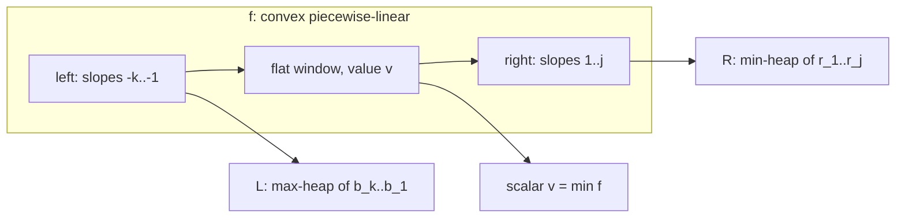
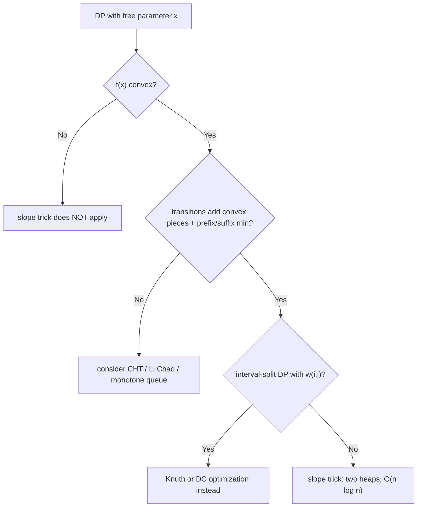

# Chapter 201: Slope Trick

## Overview

Slope trick is a DP optimization that maintains an entire convex piecewise-linear cost function \\(f(x)\\) implicitly as two heaps of its **slopes' breakpoints** — a max-heap \\(L\\) for the decreasing left part and a min-heap \\(R\\) for the increasing right part — plus one scalar for the current minimum. Adding \\(|x - c|\\), taking a prefix/suffix minimum, or shifting the function then costs \\(O(\\log n)\\) amortized per step instead of tracking \\(f\\) pointwise, which turns a family of \\(O(n^2)\\)-state DPs into linear passes. The technique decides Codeforces 713C ("make the sequence strictly increasing, minimize total change") and its relatives in a few lines, and it is the standard follow-up whenever an interviewer probes whether you can optimize a DP by exploiting **convexity** rather than monotonicity.

The survey page [DP Optimization](../advanced/dp-optimization.md) situates slope trick next to CHT, Knuth, and Aliens; this chapter is the dedicated treatment: the two-heap invariant, the four primitive operations with lazy deletions and a destroyed-element log for reconstruction, a fully simulated walkthrough of CF 713C, the problem catalog, and the boundary of applicability against Knuth and divide-and-conquer optimization. Convexity is the load-bearing assumption throughout — the whole method is "store the derivative, update the derivative".

## The Object: A Convex Piecewise-Linear Cost Function

The DP states that slope trick handles have the form \\(f_i(x)\\) = best cost of processing the first \\(i\\) items with the "free parameter" set to \\(x\\) (a final value, a level, a position). Each step transforms the whole function:

\\[ f_i(x) = \\min_{y \\le x}\\big( f_{i-1}(y) + |y - c_i| \\big) \\qquad \\text{or} \\qquad f_i(x) = f_{i-1}(x) + |x - c_i| \\]

If \\(f_{i-1}\\) is convex and the added piece is convex, then \\(f_i\\) is convex, and prefix/suffix minimization of a convex function is convex again — so convexity is preserved inductively from the flat \\(f_0 \\equiv 0\\). A convex piecewise-linear function is fully described by:

- the **left breakpoints** \\(b_1 < b_2 < \\dots < b_k\\) where the slope decreases (left part, slopes \\(-k, -(k-1), \\dots, -1\\)),
- the **minimum value** \\(v = f(m)\\) and the flat window \\([b_k, r_1]\\) around the minimum,
- the **right breakpoints** \\(r_1 < \\dots < r_j\\) where the slope increases (right part, slopes \\(1, 2, \\dots, j\\)).

Slope trick stores exactly this: \\(L\\) = max-heap of left breakpoints, \\(R\\) = min-heap of right breakpoints, \\(v\\) = current minimum. Nothing else — no array over \\(x\\), no coordinates of the function itself.



The duality to internalize: the function is the *integral* of its slope profile, and the slope profile of a convex function is a monotone step function whose steps are the heaps' elements. Adding \\(|x - c|\\) adds a \\(-1\\) step left of \\(c\\) and a \\(+1\\) step right of \\(c\\) — i.e., push \\(c\\) into both heaps. Everything else is bookkeeping to restore the invariant \\(\\max L \\le \\min R\\), which says "left part is left of the flat window".

## The Primitive Operations

| Operation | Effect on \\(f\\) | Heap work | Cost |
|---|---|---|---|
| `add_slope_left(c)` / `add_slope_right(c)` | slope \\(-1\\) left of \\(c\\) / slope \\(+1\\) right of \\(c\\) | push \\(c\\) to \\(L\\) / to \\(R\\) | \\(O(\\log n)\\) |
| `add_abs(c)` | \\(f(x) + \\lvert x - c\\rvert\\) | push both; if \\(\\max L > \\min R\\) swap tops, \\(v \\mathrel{+}= \\max L - \\min R\\) | \\(O(\\log n)\\) am. |
| `add_offset(\\delta)` | \\(f(x) + \\delta\\) | \\(v \\mathrel{+}= \\delta\\) | O(1) |
| `prefix_min()` | \\(g(x) = \\min_{y \\le x} f(y)\\) — chops the right part | destroy all of \\(R\\) (log them) | \\(O(\\log n)\\) am. |
| `suffix_min()` | \\(g(x) = \\min_{y \\ge x} f(y)\\) — chops the left part | destroy all of \\(L\\) (log them) | \\(O(\\log n)\\) am. |
| `min()` / `argmin window` | \\(v\\) / \\([\\max L, \\min R]\\) | read | O(1) |
| `merge(other)` | \\(f = f_1 \\oplus f_2\\) (min-plus sum: add functions pointwise) | meld heaps, \\(v\\) adds | O(1) with meldable heaps |

The `add_abs` swap deserves the close look, since it is the engine of every application. After pushing \\(c\\) into both heaps the invariant may break (\\(c\\) sits left of the old flat window while also right of it). If \\(\\ell = \\max L > r = \\min R\\), the left heap'​s excess slope and the right heap's excess slope cancel: pop both, push \\(r\\) into \\(L\\) and \\(\\ell\\) into \\(R\\), and the function's minimum rises by \\(\\ell - r\\). The two displaced values are the **destroyed elements** of this step; logging them is what makes the function reconstructible (next section). Cost is amortized because each element can be swapped at most once per added piece — the standard potential argument over the number of inversions between the heaps.

```cpp
// Generic two-heap skeleton (slopes of unit weight).
struct SlopeTrick {
    priority_queue<long long> L;                     // max-heap: left breakpoints
    priority_queue<long long, vector<long long>, greater<>> R;   // min-heap: right
    long long v = 0;                                 // current minimum value

    void add_left (long long c) { L.push(c); }
    void add_right(long long c) { R.push(c); }
    void add_offset(long long d) { v += d; }

    void add_abs(long long c) {                      // f(x) + |x - c|
        L.push(c); R.push(c);
        if (L.top() > R.top()) {                     // restore max(L) <= min(R)
            long long l = L.top(), r = R.top();
            L.pop(); R.pop();
            L.push(r); R.push(l);
            v += l - r;                              // destroyed pair: (l, r)
        }
    }
    long long min() const { return v; }
    long long flat_lo() const { return L.top(); }    // argmin window [L.top(), R.top()]
    long long flat_hi() const { return R.top(); }
};
```

For prefix-min-only problems (the 713C family) \\(R\\) never survives a step, so the production code keeps only \\(L\\) and \\(v\\) — the right slope pushed by \\(|x-c|\\) is destroyed by the prefix-min before it can ever be queried. That is why the canonical solution below looks like a *single* heap; understanding that it is the two-heap skeleton with one side always destroyed is the difference between using the template and understanding it.

### Second Worked Example: ABC 127F "Absolute Minima"

The teaching problem for the **two-sided** skeleton: process values \\(c\\) one at a time; after each, output \\(\\min_x \\sum_i |x - c_i|\\) and (on a second query type) the argmin window. Every step is `add_abs(c)` with no prefix-min, so both heaps grow and the swap rule runs:

Simulate \\(c = [3, 1, 4]\\) starting from empty (\\(v = 0\\)):

| Step | add_abs | heaps before | swap? | heaps after | \\(v\\) | argmin window |
|---|---|---|---|---|---|---|
| 1 | 3 | \\(L=\\{\\}, R=\\{\\}\\) | no (empty) | \\(L=\\{3\\}, R=\\{3\\}\\) | 0 | \\([3, 3]\\) |
| 2 | 1 | \\(L=\\{3,1\\}, R=\\{3,1\\}\\) | \\(\\max L = 3 > 1 = \\min R\\) | \\(L=\\{1,1\\}, R=\\{3,3\\}\\) | \\(0 + (3-1) = 2\\) | \\([1, 3]\\) |
| 3 | 4 | \\(L=\\{1,1,4\\}, R=\\{3,3,4\\}\\) | \\(\\max L = 4 > 3\\) | \\(L=\\{1,1,3\\}, R=\\{4,3,4\\}\\) | \\(2 + (4-3) = 3\\) | \\([3, 3]\\) |

Check against closed forms: after \\(\\{3, 1\\}\\), \\(|x-3| + |x-1|\\) has minimum 2 attained on \\([1, 3]\\) ✓ (\\(v = 2\\)). After \\(\\{3, 1, 4\\}\\), \\(|x-3|+|x-1|+|x-4|\\) at \\(x=3\\) gives \\(0+2+1 = 3\\) ✓ (\\(v = 3\\), window \\([3, 3]\\) ✓). The final heaps also contain the full sorted breakpoint multiset — which is exactly why the destroyed-element log matters here: order statistics over the history require replaying the swaps.

## Destroyed Elements and Recovering Answers

The heaps after the full run describe only the **final** function. Three recovery patterns cover the interview and contest needs:

1. **Snapshot per step (one-sided problems).** If every step ends in a prefix-min, record \\(\\ell_i = \\max L_i\\) after step \\(i\\) — the flat window of \\(f_i\\) starts there. The optimal parameter values fall out backwards: \\(x_n = \\ell_n\\), then \\(x_i = \\min(x_{i+1}, \\ell_i)\\). This is exact, costs \\(O(n)\\) memory, and needs no destroyed log — it is the backward DP over "best value of the parameter at step \\(i\\) subject to \\(x_i \\le x_{i+1}\\)", since \\(f_i\\) is non-increasing so the largest allowed point is the best.
2. **Destroyed-element log (general).** Every pop or top-swap records `(step, value, heap)`. To rebuild \\(f_i\\) from the final state, undo steps \\(n, n-1, \\dots, i+1\\) in LIFO order: re-push the element destroyed at step \\(s\\) into the heap it left, and subtract the corresponding \\(v\\) increment. The final \\(f\\) is thereby replayable at every earlier timestamp — the same rollback discipline as the rollback DSU in [Chapter 202](ch202-offline-dynamic-connectivity.md), applied to two heaps.
3. **Recompute the tail (cheap alternative).** Keep the logged steps and re-run the skeleton from step \\(i\\) whenever an old value is needed; \\(O(n \\log n)\\) worst case but zero subtlety, and usually only a handful of tail steps matter.

A worked micro-example of pattern 2 on the 713C simulation above: the destroyed elements were `2` at step 2 and `3` at step 4. Rebuilding \\(f_1\\) from the final state \\(L = \\{0, -3\\}\\), \\(v = 8\\): undo step 4 — re-push 3 and subtract \\(3 - (-3) = 6\\), giving \\(L = \\{3, 0, -3\\}\\), \\(v = 2\\), which matches the table's row 3; undo step 2 — re-push 2 and subtract \\(2 - 0 = 2\\), giving \\(L = \\{3, 2, 0, -3\\}\\), \\(v = 0\\) — and indeed \\(f_1(x) = |x - 2|\\) plus prefix-min flattening is exactly the non-increasing function with breakpoints \\(\\{3, 2, 0, -3\\}\\) and minimum 0. The replay is exact because prefix-min destroyed a *superset* of nothing else: one pop per step, one value per pop.

The destroyed log is not optional in **two-sided** problems: when both heaps survive (e.g., Absolute Minima below queries the argmin window every step), the swapped elements must be remembered if you later need the sorted multiset of breakpoints or a specific order statistic. The literature's phrase "store the destroyed elements" refers to exactly this log; forgetting it is the difference between "I can tell you the optimal cost" and "I can tell you the optimal solution".

## Walkthrough: Codeforces 713C (the Median Trick with Heaps)

**Problem.** Given \\(a_1, \\dots, a_n\\), change values arbitrarily at cost \\(\\sum |a_i - b_i|\\) so that \\(b\\) is **strictly** increasing; minimize the cost. The classic transformation: subtract the index — \\(c_i = a_i - i\\) — after which strict increase of \\(b\\) is equivalent to non-decrease of the targets \\(b_i - i\\). The DP is:

\\[ f_i(x) = \\min_{y \\le x} \\big( f_{i-1}(y) + |y - c_i| \\big), \\qquad f_0 \\equiv 0, \\qquad \\text{answer} = \\min_x f_n(x) \\]

which is exactly "add \\(|x - c_i|\\), then prefix-min" per step. The one-heap loop:

```cpp
// CF 713C / CF 13C: minimum total change to make a strictly (13C: non-strictly) increasing
long long solve(vector<long long> a, bool strict) {
    for (size_t i = 0; i < a.size(); ++i)
        if (strict) a[i] -= (long long)i + 1;        // c_i = a_i - i (1-indexed)
    priority_queue<long long> L;                     // left breakpoints of f_i
    long long v = 0;                                 // min of f_i
    vector<long long> flat_start;                    // ell_i, for reconstruction
    for (long long c : a) {
        L.push(c);                                   // add |x - c|'s left slope
        if (L.top() > c) {                           // argmin shifted below c
            v += L.top() - c;                        // destroy old max breakpoint
            L.pop();                                 // log (step, value) to reconstruct
        }
        flat_start.push_back(L.top());               // f_i flat from ell_i
    }
    // reconstruction: x_i = min(x_{i+1}, ell_i), x_{n+1} = +inf, then b_i = x_i + i
    long long x = LLONG_MAX;
    for (int i = (int)a.size() - 1; i >= 0; --i) {
        x = min(x, flat_start[i]);
        // b[i] = x + (i + 1) is an optimal strictly-increasing target
    }
    return v;
}
```

**Full simulation** with \\(a = [3, 2, 6, 1]\\), strict mode \\(\\Rightarrow c = [2, 0, 3, -3]\\):

| Step | \\(c\\) | push | top > c? | \\(v\\) update | \\(L\\) after | \\(\\ell_i\\) |
|---|---|---|---|---|---|---|
| 1 | 2 | 2 | 2 > 2 no | 0 | \\{2\\} | 2 |
| 2 | 0 | 0 | 2 > 0 yes | \\(0 + (2-0) = 2\\) | \\{0\\} | 0 |
| 3 | 3 | 3 | 3 > 3 no | 2 | \\{3, 0\\} | 3 |
| 4 | −3 | −3 | 3 > −3 yes | \\(2 + (3-(-3)) = 8\\) | \\{0, −3\\} | 0 |

Answer \\(v = 8\\). Reconstruction backward: \\(x_4 = \\min(\\infty, 0) = 0\\), \\(x_3 = \\min(0, 3) = 0\\), \\(x_2 = \\min(0, 0) = 0\\), \\(x_1 = \\min(0, 2) = 0\\), giving targets \\(b_i = x_i + i = [1, 2, 3, 4]\\) at cost \\(|3-1| + |2-2| + |6-3| + |1-4| = 2 + 0 + 3 + 3 = 8\\). ✓ Brute force over small integer targets confirms 8 is optimal.

Two connections worth naming. First, the **median trick**: without the ordering constraint the problem "minimize \\(\\sum |a_i - m|\\)" is solved by the median; with the constraint the two-heap loop *is* online median maintenance under a monotone feasibility pressure — each \\(\\ell_i\\) is the running median of the constrained targets, which is why the structure is a heap pair and why every \\(v\\)-increment equals a destroyed breakpoint minus the new one. Second, the same code solves CF 13C (non-strict) by dropping the `strict` shift; the shift \\(a_i - i\\) is a one-line trick worth rehearsing separately, since converting strict to non-strict by index-shifting recurs across many ordered-target problems.

## The Problem Catalog

| Problem | Transition shape | Slope-trick treatment |
|---|---|---|
| CF 13C / 713C "Sequence / Sonya" | prefix-min + \\(|y - c|\\) | one heap, answer = \\(v\\); median-trick twin |
| ABC 127F "Absolute Minima" | add \\(|x - c|\\), query \\(\\min\\) and argmin window | two heaps, both survive; report \\(v\\) and \\([\\max L, \\min R]\\) |
| CF 865D "Buy Low Sell High" | hold \\(k\\) shares: buy/sell shifts slopes by ±1 per day | \\(f(k)\\) convex per day; each price adds two slopes; \\(v\\) accumulates profit |
| Knapsack smoothing (relaxation profile) | \\(g(j) = \\min_k (f(k) + w\\cdot|j-k|) + \\text{item cost}(j)\\) | scaled \\(|{\\cdot}|\\) via weighted slopes, then per-item convex edits |
| "Make array valley/hill" variants | suffix-min then prefix-min composition | two passes of the same skeleton, or both heaps |
| Tree DP with convex per-subtree cost | merge child functions pointwise | meldable heaps (pairing/leftist), small-to-large |

The "E-knapsack smoothing" entry deserves a sentence of care: several contests feature a knapsack-style DP whose profile over capacity is smoothed each round by a cost \\(w \\cdot |j - k|\\) for moving from level \\(k\\) to level \\(j\\) (sometimes with an extra per-item convex charge). Any such relaxation is slope trick as long as the smoothing kernel is convex in \\(j - k\\) and the item costs are convex in the level — the heaps store breakpoints in *capacity* coordinates and the slope weights scale the \\(v\\)-updates. The failure case to check is a **non-convex** item cost (e.g., "free above half capacity"), which breaks the slope-addition step; there the tool is none of the slope-trick family.

### CF 865D "Buy Low Sell High": Slopes as Inventory

The stock problem makes the "DP over slopes" viewpoint vivid. After day \\(i\\), let \\(f_i(k)\\) = maximum profit holding \\(k\\) shares. One day with price \\(p\\) offers two moves: buy (\\(k \\to k+1\\), pay \\(p\\)) or sell (\\(k \\to k-1\\), gain \\(p\\)). Both moves shift the argument of \\(f\\) by one while adding a linear term, so \\(f_i\\) stays convex and each day contributes heap pushes only: the price \\(p\\) enters as a buy breakpoint at \\(-p\\), and whenever the best still-usable buy price \\(b\\) satisfies \\(b < p\\), the swap rule cancels that pair — \\(v \\mathrel{+}= p - b\\) — and re-inserts \\(-p\\) so today's transaction can itself be undone by a later, higher price. Read \\(v\\) after the last day. The point for this chapter is not the trading story but the shape: **each primitive DP move became one or two heap pushes**, and the amortized swap rule settles all the "which pair to match" decisions optimally — an exchange-argument proof hiding inside a data structure.

## When Slope Trick Applies — and the Alternatives

Three conditions, all necessary:

1. **One-dimensional state.** The DP profile must compress to \\(f(x)\\) with a single free parameter per step; 2-D profiles need per-row structures or a different technique.
2. **Convexity of the profile.** \\(f_i\\) must be convex in \\(x\\) — verify by the transitions: adding convex pieces (absolute values, squares via two pushed slopes per unit, max of convex terms) and taking prefix/suffix minima all preserve convexity; a max of *concave* pieces or a non-convex penalty destroys it.
3. **Local, additive slope edits.** Each step must change the slope profile by pushing/destroying \\(O(1)\\) breakpoints (or \\(O(\\log)\\) amortized). A step that needs "read the whole function" or "remove an arbitrary old breakpoint" needs a meldable/persistent heap upgrade — doable, but the complexity analysis changes.

### Checking Convexity on a Concrete Transition

Take a leveling DP: after item \\(i\\) the "height" is \\(x\\), item \\(i\\) itself costs \\((a_i - x)^2\\) if you adjust to \\(x\\), and consecutive heights may differ by at most \\(w\\) (a sliding cap). The squared term is convex — its slope profile adds \\(2c\\) worth of unit slopes, \\(2|a_i - x|\\) worth to be precise, at \\(x = a_i\\) — and the cap is a prefix-min composed with a suffix-min (clamp from both sides), which flattens the outside of the window but preserves convexity. So the whole step is slope-trick-safe. Contrast a "free above half capacity" knapsack adjustment \\(\\min(|x - c|, 0)\\)-style piece: concave on one side, not representable as monotone slope steps, and the technique stops.

The practical test when unsure: **finite-difference the profile**. Compute \\(f\\) at a few integer points by brute force for small inputs and check the second differences are non-negative after every step type. Ten lines of test code catch every non-convexity bug — far cheaper than debugging inverted heaps at contest time — and the same brute-force oracle validates the final answer on random small inputs, the technique [Chapter 195](ch195-li-chao-segment-tree.md) uses for its Li Chao implementation.

### Complexity Summary

| Component | Cost | Why |
|---|---|---|
| One DP step (add + chop) | \\(O(\\log n)\\) amortized | each element swapped/destroyed at most once per added piece |
| Full DP over \\(n\\) steps | \\(O(n \\log n)\\) | heaps hold \\(O(n)\\) breakpoints total in one-sided problems |
| With meldable-heap merging on trees | \\(O(n \\log^2 n)\\) | meld \\(O(\\log)\\) × small-to-large \\(O(\\log n)\\) |
| Memory | \\(O(n)\\) | \\(O(n)\\) breakpoints + \\(O(n)\\) log entries if reconstructing |
| Reconstruction | \\(O(n)\\) extra | backward pass over snapshots or the destroyed log |



| Technique | Structural condition | Typical gain | Signature problems |
|---|---|---|---|
| **Slope trick** | convex 1-D profile, convex transitions | states × range → \\(n \\log n\\) | 713C, 865D, 127F |
| Knuth optimization | interval DP, quadrangle inequality \\(w(i,j)\\) | \\(O(n^3) \\to O(n^2)\\) | optimal BST, matrix chain |
| Divide & conquer opt | \\(\\operatorname{opt}(i, j)\\) monotone in both args | layer cost \\(O(n^2) \\to O(n \\log n)\\) | layered 1-D/1-D DPs |
| Aliens (WQS) | "exactly k pieces" constraint, concave tradeoff in k | removes the k dimension | "minimize avg with ≤ k groups" |
| CHT / Li Chao ([Chapter 195](ch195-li-chao-segment-tree.md)) | transitions are lines in \\(x\\) | per-step \\(O(\\log)\\) line queries | linear/divisible costs |

Note the division of labor: Knuth and DC optimization are about *which \\(j\\) to split at* in interval/layered DPs; slope trick is about *carrying a function* through a recurrence. When a problem is an interval DP with quadrangle costs, slope trick is not applicable even if the costs look convex — the state is the interval, not a free parameter. Quoting which of the two regimes a problem falls into is precisely the tested judgment.

## Pitfalls

| Pitfall | Symptom | Fix |
|---|---|---|
| Skipping the strict→non-strict shift \\(a_i - i\\) | 713C answer too small or invalid targets | shift by index before building slopes |
| Reusing the one-heap template when both sides survive | wrong argmin window (Absolute Minima) | keep \\(L\\) and \\(R\\); the swap-and-log step is mandatory |
| Forgetting to log destroyed elements | cannot reconstruct the optimal sequence | push `(step, value, heap)` on every pop/swap |
| Non-convex per-item cost silently accepted | greedy heaps give plausible but wrong answers | test convexity of every added piece before committing |
| Weighted slopes handled as unit slopes | \\(v\\)-increments off by the weight factor | scale the \\(v\\) update by the slope weight; breakpoints unchanged |
| `long long` overflow on \\(v\\) | negative garbage after many adds | \\(v\\) accumulates \\(\\sum |a_i - b_i|\\)-scale sums; use 64-bit everywhere |
| Assuming sorted input | heaps reorder breakpoints arbitrarily | the whole point is order-independence; never sort to "help" it |

## Interview Questions

1. **What exactly do the two heaps represent?**
   The breakpoints of the slope profile of a convex piecewise-linear function. The max-heap \\(L\\) holds the left breakpoints, where each element adds another unit of downward slope; the min-heap \\(R\\) holds the right breakpoints, each adding a unit of upward slope; the scalar \\(v\\) is the function's minimum. The invariant \\(\\max L \\le \\min R\\) says the decreasing part ends before the increasing part starts. The function itself is never materialized — its integral is recoverable from \\(v\\) plus the slope steps, which is why every operation costs heap operations rather than scans over \\(x\\).
2. **Why is adding \\(|x - c|\\) and taking a prefix-min the whole story for 713C?**
   The DP is \\(f_i(x) = \\min_{y \\le x}(f_{i-1}(y) + |y - c_i|)\\): the previous state \\(y\\) must not exceed the current target \\(x\\), and changing \\(y\\) to the target costs the absolute difference. Adding \\(|x-c|\\) pushes \\(c\\) into the slope heaps; the prefix-min chops the function's increasing part, which in the one-heap formulation means: if the new left maximum exceeds \\(c\\), the old maximum breakpoint \\(\\ell\\) is destroyed and \\(v\\) rises by \\(\\ell - c\\). Convexity is preserved at every step because both operations (adding a convex piece, prefix-min of a convex function) map convex functions to convex functions.
3. **How do you recover the actual optimal sequence, not just the cost?**
   In one-sided problems, snapshot \\(\\ell_i = \\max L\\) after each step, then walk backwards with \\(x_i = \\min(x_{i+1}, \\ell_i)\\) — valid because \\(f_i\\) is non-increasing, so the best feasible point is the flat window's start clamped by the next step's choice. In two-sided problems, keep a destroyed-element log: every pop or top-swap records its step and value, and replaying the log in reverse (LIFO) rebuilds \\(f_i\\) for any \\(i\\). The log is the slope-trick analogue of the rollback stack in offline DSU techniques.
4. **When does slope trick beat Knuth or divide-and-conquer optimization — and when not?**
   Beat: the DP has a single free parameter and convex transitions, where slope trick gives \\(O(n \\log n)\\) total versus \\(O(n^2)\\) or \\(O(n^3)\\) for the alternatives. Not applicable: interval DPs where the state itself is an interval (Knuth's regime, gated by the quadrangle inequality), layered DPs whose win condition is a monotone argmax (divide-and-conquer optimization), and any profile that fails convexity — a non-convex penalty cannot be encoded as monotone slope steps at all. The regimes are distinguished by what the DP state *is*: a free number (slope trick) versus an interval (Knuth) versus a layer with monotone split (DC opt).
5. **Why does the strict-increase version subtract the index?**
   Strict increase \\(b_i < b_{i+1}\\) over integers is equivalent to \\(b_i - i \\le b_{i+1} - i - 1\\), i.e., the shifted sequence \\(b_i - i\\) is non-decreasing. So set \\(c_i = a_i - i\\), solve the non-strict problem on \\(c\\), and shift targets back. The cost is unchanged because each term \\(|(b_i - i) - (a_i - i)| = |b_i - a_i|\\). Forgetting the shift solves the wrong (non-strict) problem — the classic one-line bug on 713C.
6. **What data-structure upgrade does a tree version need?**
   Merging convex profiles across subtrees is a min-plus sum of functions, which is heap melding. Binary heaps cannot meld efficiently, so use meldable heaps (pairing or leftist) for \\(O(\\log)\\) melds, combined with small-to-large merging over the tree for an overall \\(O(n \\log^2 n)\\)-style bound. The per-node operations are unchanged — the composition structure around the heaps is what changes.

## Key Takeaways

- Slope trick = maintain a convex piecewise-linear DP profile as (max-heap \\(L\\) of left breakpoints, min-heap \\(R\\) of right breakpoints, scalar minimum \\(v\\)); the function is the integral of the slope steps.
- Primitives: push slopes for \\(|x-c|\\), swap tops when \\(\\max L > \\min R\\) (\\(v += \\ell - r\\)), prefix/suffix-min chops one heap, offset adds to \\(v\\) — all \\(O(\\log n)\\) amortized.
- One-heap simplification: when every step ends in prefix-min, only \\(L\\) and \\(v\\) survive — that is the entire 713C/13C solution.
- Recovery: snapshot \\(\\ell_i = \\max L_i\\) for one-sided problems (backward \\(x_i = \\min(x_{i+1}, \\ell_i)\\)); keep a destroyed-element log for two-sided or replayable functions.
- 713C walkthrough: shift by index for strictness, push-and-destroy per element, \\(v\\) is the answer; simulation on \\([3,2,6,1]\\) gives \\(v = 8\\) with targets \\([1,2,3,4]\\).
- Applicability is convexity + one-dimensional state + local slope edits; interval DPs go to Knuth, monotone-argmax layering to DC opt, exactly-k constraints to Aliens.
- The strict→non-strict index shift and the destroyed-element log are the two details interviewers probe first.

## References

- [Codeforces 713C: Sonya and Problem Wihtout a Legend](https://codeforces.com/contest/713/problem/C) — strict-increase problem; the walkthrough of this chapter
- [Codeforces 13C: Sequence](https://codeforces.com/contest/13/problem/C) — the non-strict variant, solvable by the same one-heap loop
- [Codeforces 865D: Buy Low Sell High](https://codeforces.com/contest/865/problem/D) — two-slope-per-step stock problem, canonical slope trick
- [AtCoder ABC 127F: Absolute Minima](https://atcoder.jp/contests/abc127/tasks/abc127_f) — add-absolute-value with min/argmin queries; the two-heap teaching problem
- Slope-trick tutorial literature on competitive-programming blogs (multiple long-form tutorials exist; treat 713C's editorial as the primary source — no specific third-party URL cited)

## Cross-References

- [Chapter 195: Li Chao Segment Tree](ch195-li-chao-segment-tree.md) — the other convexity-exploiting accelerator: lines over a domain instead of slope breakpoints
- [DP Optimization Survey](../advanced/dp-optimization.md) — where slope trick sits among CHT, Knuth, SMAWK, and monotone-queue optimizations
- [Aliens Trick: Lagrangian Relaxation](../advanced/aliens-trick.md) — the parametric alternative when an exactly-k constraint, not convexity, is the obstacle
- [Chapter 86: DP Optimization](ch86-dp-optimization.md) — the base catalog of transition shapes and accelerators
- [Chapter 188: Monotonic Queue/Deque DP](ch188-monotonic-queue-dp.md) — sliding-window prefix-min DPs, the non-convex-window sibling of prefix-min
- [Chapter 202: Offline Dynamic Connectivity](ch202-offline-dynamic-connectivity.md) — the rollback/undo-log discipline the destroyed-element log reuses
