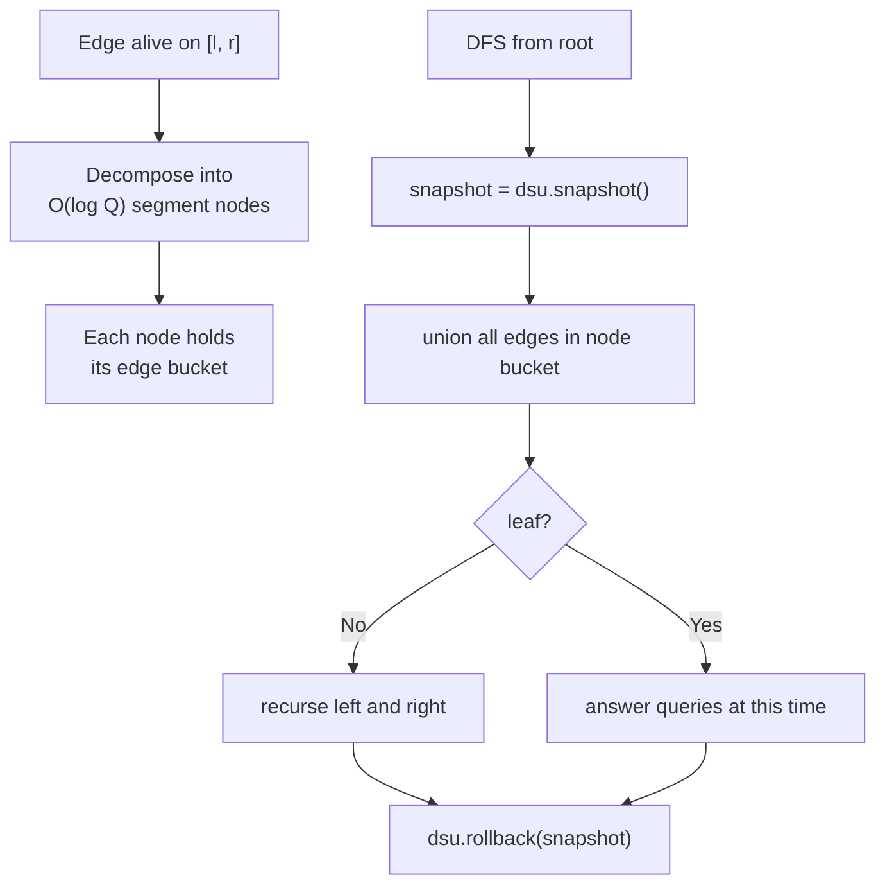

# Chapter 202: Offline Dynamic Connectivity

## Overview

Dynamic connectivity asks: maintain a graph under edge insertions and deletions while answering "are `u` and `v` connected?" Link-cut trees and HDT trees answer *online* in `O(log n)` per operation with heavy constants. When the *entire sequence* of operations is known in advance — the offline setting — the **segment tree on time + rollback DSU** technique solves everything in `O(Q log Q · α(n) )`-style complexity with a beautifully small implementation: each edge's lifetime becomes an interval, gets attached to `O(log Q)` time-segment nodes, and one DSU-with-undo DFS processes every timestamp. This is a standard technique in competitive programming (Codeforces 813F, 1217F) and a very interviewable idea because it composes two primitives you already know.

> **Interview Angle**: The question to listen for is "edges come and go, tell me connectivity after each step — queries are known ahead of time." The strong answer names the two building blocks separately (time-segmentation, then amortized rollback) before composing them. Candidates who jump straight to link-cut trees are over-solving the offline case.

## The Two Building Blocks

**Rollback DSU.** Union-find with *union by size/rank and no path compression* keeps every union reversible: push `(root_b, size_before)` onto a stack, pop to undo. Without path compression, `find` is `O(log n)` worst case (path lengths stay logarithmic under union by size), so each operation is `O(log n)` with an undo cost of exactly `O(1)` — the trade you accept in exchange for reversibility. Amortized analysis over a segment of `k` operations costs `O(k log n)`; there is no amortization gap across segment boundaries because nothing is ever compressed.

```python
class RollbackDSU:
    def __init__(self, n):
        self.p = list(range(n))
        self.sz = [1] * n
        self.hist = []          # stack of (child_root, prev_parent_size_marker)

    def find(self, x):
        while self.p[x] != x:
            x = self.p[x]
        return x

    def union(self, a, b):
        ra, rb = self.find(a), self.find(b)
        if ra == rb:
            self.hist.append(None)   # still push, so undo is symmetric
            return False
        if self.sz[ra] < self.sz[rb]:
            ra, rb = rb, ra
        self.hist.append((rb, self.sz[ra]))
        self.p[rb] = ra
        self.sz[ra] += self.sz[rb]
        return True

    def snapshot(self):
        return len(self.hist)

    def rollback(self, mark):
        while len(self.hist) > mark:
            e = self.hist.pop()
            if e is not None:
                rb, old_sz = e
                ra = self.p[rb]
                self.p[rb] = rb
                self.sz[ra] = old_sz
```

**Segment tree on time.** Run time `0..Q` as the leaves of a segment tree. An edge alive on interval `[l, r]` decomposes into `O(log Q)` canonical nodes; store the edge in each node's bucket. A DFS over the tree applies all edges of the current node (with a DSU snapshot), recurses, then rolls back to the snapshot. At each leaf, the DSU state is exactly "the graph at that timestamp" — answer the queries stored there.



## Correctness Argument

Two invariants make the composition work. First, **edge coverage**: the segment-tree decomposition property guarantees every interval is partitioned into disjoint canonical nodes, so during the DFS the set of unions applied on the root-to-leaf path is precisely the set of edges alive at that leaf — no edge missed, no edge double-applied (a deleted edge re-inserted later is simply two distinct intervals). Second, **state restoration**: rollback restores the exact prior DSU bytes (parent pointers and sizes), so sibling subtrees start from the identical state; there is no amortized debt carried across branches, unlike path-compressed DSU where compression is irreversible.

Time complexity: each of the `2Q` leaves is visited once, each edge touches `O(log Q)` nodes and pays `O(log n)` per application, and each undo pays `O(1)`. Total: `O((Q + E log Q) log n + Q · α(...))` — in practice written as `O(Q log Q log n)`. Space: `O(E log Q)` buckets plus `O(n)` DSU arrays, with an undo stack bounded by bucket sizes along the active path.

## Worked Example

Operations over 4 nodes (1-indexed), `Q = 6`:

| t | Operation | Meaning |
|---|---|---|
| 0 | `+ (1,2)` | edge (1,2) alive `[0, 1]` |
| 1 | `+ (2,3)` | edge (2,3) alive `[1, 6]` |
| 2 | `- (1,2)` | (already ended at t=1) |
| 2 | `+ (1,4)` | edge (1,4) alive `[2, 4]` |
| 3 | `? 1 3` | query connected? |
| 4 | `? 3 4` | query connected? |

Edge (1,2) covers leaves `{0,1}` → one node; edge (1,4) covers `{2,4}` → splits into `[2,2]` and `[4,4]` (canonical decomposition drops the middle); edge (2,3) covers everything → root bucket. At leaf 3: root bucket has (2,3); (1,4) is not yet applied (starts at 4) — `1,3` connected? Yes via `1-2-3`? (1,2) ended at 1, so the DSU at leaf 3 holds only (2,3): components `{1}, {2,3}, {4}` → **not connected**. At leaf 4: buckets add (1,4) → `3,4` connected? Yes (`3-2-1-4`). The DFS answers both in one pass.

## Complexity and Constant Factors

| Approach | Online? | Per-op | Space | Constants |
|---|---|---|---|---|
| Rollback DSU + time segment tree | No (offline) | `O(log Q log n)` | `O(E log Q)` | tiny (~60 lines) |
| Link-cut trees (HDT levels) | Yes | `O(log² n)` amortized | `O(n + E)` | heavy |
| Euler tour trees + AVL | Yes | `O(log² n)` | `O(n + E)` | heavy |
| Rebuild every query | No | `O(Q · (n + E))` | `O(E)` | trivial |

The offline method wins when queries are known: the inner DSU is array-only, cache-friendly, and the recursion is a plain DFS. In practice it handles `Q ~ 2×10⁵`, `n ~ 10⁵` comfortably, roughly 10-20× faster than link-cut implementations of the same task.

## Extensions

- **Bipartiteness / 2-edge-connectivity** instead of connectivity: roll back a bipartite DSU (each component tracks parity via extended path records — parity IS compressible but keep it on the undo stack).
- **Colored connectivity / k-colors**: attach per-color bitsets or per-color DSUs inside the same time-DFS; complexity multiplies by the color factor.
- **Historical connectivity** ("were they ever connected during [a,b]?"): union timestamps per component and carry min/max reachable time in component metadata — still one DFS.
- **Weights / max edge on path**: combine with a rollback-friendly monostack per component (harder; usually switch to offline divide-and-conquer on the operation sequence instead).
- The same **interval-to-segment-tree** trick is generic: anything with a lifetime (locks, leases, memberships) decomposes the same way — the DSU is just the cheapest consumer.

## Interview Questions

1. **Why is path compression forbidden in the rollback DSU?** Path compression mutates the structure in ways that are not recorded per-step — undoing it requires replaying the entire compressed history. Without compression but with union by size, tree height stays `O(log n)`, so `find` costs a guaranteed `O(log n)` while every mutation remains a single reversible parent-pointer write on the undo stack.
2. **What is the total complexity, and where does each factor come from?** `O(Q log Q log n)` for `Q` operations: the `log Q` is the interval-to-canonical-node decomposition (each edge lives in `O(log Q)` buckets), and the `log n` is the no-path-compression `find`. The final DFS does one union/undo pair per bucket entry, so total work is bounded by total bucket size plus one leaf pass.
3. **How do you handle an edge that is inserted, deleted, and inserted again?** Each continuous lifetime is an independent interval with its own decomposition. The DFS applies the earlier interval at earlier leaves and the later one later; there is no interference because rollback restores state between disjoint subtrees and the intervals never overlap in buckets inconsistently.
4. **When would you refuse this technique and use link-cut trees instead?** When queries or updates arrive online — you cannot build the time segment tree without knowing all intervals up front. Also when memory is tight: bucket storage is `O(E log Q)`, while link-cut trees store the current graph only. For genuinely online dynamic connectivity, HDT's `O(log² n)` is the known bound.
5. **What breaks if you replace the rollback DSU with a normal compressed DSU?** Two things: compression is irreversible, so rollback to a snapshot cannot restore sibling-subtree state, corrupting every later leaf; and the amortized complexity argument collapses because rollback re-traversals become unbounded. The classic symptom is wrong answers only in the second half of the time range — a signature bug of this technique.

## Key Takeaways

- Offline + dynamic = decompose edge lifetimes on a segment tree over time, then one DFS with a rollback DSU.
- Rollback DSU = union by size, no path compression, explicit undo stack: `O(log n)` find, `O(1)` undo.
- Each edge occupies `O(log Q)` canonical nodes; total complexity `O(Q log Q log n)`, tiny constants.
- The pattern generalizes: bipartiteness, colored connectivity, and "ever connected" queries fit the same DFS.
- If the problem is truly online, this is the wrong tool — link-cut/HDT trees are the online answer.

## Cross-References

- [Chapter 157: Link-Cut Trees](./ch157-link-cut-trees.md) — the online counterpart with `O(log² n)` operations
- [Disjoint Set Union](./ch17-dsu.md) — the base DSU mechanics being extended
- [Segment Trees — Advanced](./ch185-sparse-table-advanced.md) — canonical decomposition reused for intervals
- [Dynamic Graph Algorithms](../advanced/parallel-graph-algorithms.md) — related dynamic-graph paradigms
