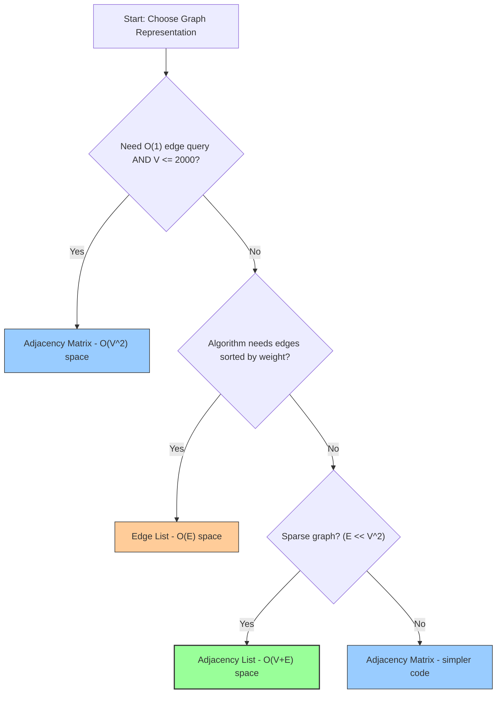
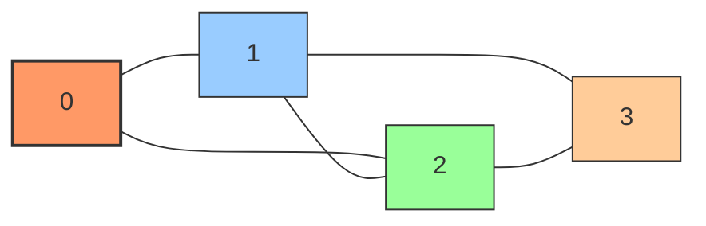
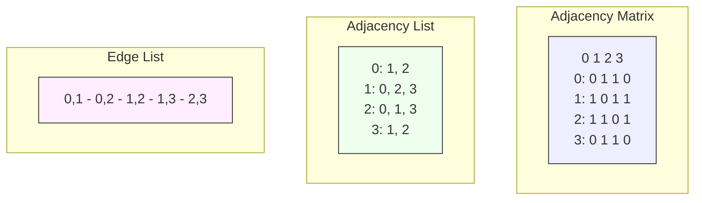

# Chapter 22: Graph Fundamentals

Graphs are one of the most versatile and powerful data structures in computer science. They model relationships between objects and appear everywhere — from social networks and road maps to compilers and recommendation engines. Mastering graphs is essential for technical interviews, as graph problems test your ability to think abstractly, reason about connectivity, and design efficient traversal algorithms.

In this chapter, we lay the foundation for everything that follows: representations, terminology, special graph types, and common input patterns.

---

## 22.1 What Is a Graph?

A **graph** \\(G = (V, E)\\) consists of:

- **Vertices (nodes)** \\(V\\): a finite set of entities.
- **Edges** \\(E\\): a set of pairs connecting vertices. Each edge \\((u, v)\\) represents a relationship between \\(u\\) and \\(v\\).

### Directed vs Undirected

| Property | Undirected Graph | Directed Graph (Digraph) |
|----------|-----------------|--------------------------|
| Edge | \\((u, v)\\) — bidirectional | \\((u \to v)\\) — one-way |
| Example | Friendship on Facebook | Twitter follow |
| Matrix | Symmetric | Asymmetric |
| Degree | \\(\deg(u)\\) = number of edges incident to \\(u\\) | \\(\text{in-deg}(u)\\) + \\(\text{out-deg}(u)\\) |

### Weighted vs Unweighted

- **Unweighted**: All edges are equivalent. We care only about connectivity.
- **Weighted**: Each edge carries a value (distance, cost, time, capacity). Algorithms like Dijkstra's and Kruskal's operate on weighted graphs.

### Real-World Examples

| Domain | Vertices | Edges |
|--------|----------|-------|
| Social network | People | Friendships / follows |
| Road map | Intersections | Roads (weighted by distance) |
| Web | Web pages | Hyperlinks |
| Compilers | Symbols | Dependencies |
| Electrical circuits | Components | Wires |
| Game states | Configurations | Valid moves |

---

## 22.2 Representations

How we store a graph in memory profoundly affects algorithm performance. There are three standard representations.

### Adjacency Matrix

A 2D array `adj[V][V]` where `adj[u][v]` indicates the presence (or weight) of edge \\((u, v)\\).

**Mental model:** Think of a spreadsheet where both rows and columns are vertices. A cell is `1` (or the weight) if there's an edge between the row-vertex and column-vertex.

```cpp
#include <iostream>
#include <vector>

int main() {
    int V = 5;
    // Initialize V×V matrix with zeros
    // Each row represents a vertex; each column represents a potential neighbor
    // adj[u][v] = weight of edge from u to v (0 means no edge)
    std::vector<std::vector<int>> adj(V, std::vector<int>(V, 0));

    // Add undirected edges: 0-1, 0-4, 1-2, 1-3, 1-4, 2-3, 3-4
    auto addEdge = [&](int u, int v, int weight = 1) {
        adj[u][v] = weight;
        adj[v][u] = weight; // remove this line for directed graph
    };

    addEdge(0, 1);
    addEdge(0, 4);
    addEdge(1, 2);
    addEdge(1, 3);
    addEdge(1, 4);
    addEdge(2, 3);
    addEdge(3, 4);

    // Check if edge exists: O(1)
    std::cout << "Edge (0,1): " << (adj[0][1] ? "yes" : "no") << "\n";
    std::cout << "Edge (0,2): " << (adj[0][2] ? "yes" : "no") << "\n";

    // Print all neighbors of vertex 1
    std::cout << "Neighbors of 1: ";
    for (int v = 0; v < V; ++v) {
        if (adj[1][v]) std::cout << v << " ";
    }
    std::cout << "\n";
}
```

**Time complexities:**
- Check edge existence: \\(O(1)\\)
- Iterate neighbors of \\(u\\): \\(O(V)\\)
- Space: \\(O(V^2)\\)

### Adjacency List

Each vertex stores a list of its neighbors. In C++, we use a vector of vectors.

**Mental model:** Think of a contact list. Each person (vertex) has a list of their friends (neighbors). We only store the connections that actually exist.

```cpp
#include <iostream>
#include <vector>

int main() {
    int V = 5;
    // adj[u] is a vector containing all neighbors of vertex u
    // Only stores edges that exist — much more memory-efficient for sparse graphs
    std::vector<std::vector<int>> adj(V);

    // For weighted graphs: vector<vector<pair<int,int>>> adj(V);
    // where pair = {neighbor, weight}

    auto addEdge = [&](int u, int v) {
        adj[u].push_back(v);
        adj[v].push_back(u); // remove for directed graph
    };

    addEdge(0, 1);
    addEdge(0, 4);
    addEdge(1, 2);
    addEdge(1, 3);
    addEdge(1, 4);
    addEdge(2, 3);
    addEdge(3, 4);

    // Check edge existence: O(degree(u))
    // Iterate neighbors of u: O(degree(u))

    for (int u = 0; u < V; ++u) {
        std::cout << u << ": ";
        for (int v : adj[u]) std::cout << v << " ";
        std::cout << "\n";
    }
}
```

### Weighted Adjacency List

```cpp
#include <iostream>
#include <vector>
#include <utility> // for std::pair

int main() {
    int V = 5;
    // adj[u] = list of (neighbor, weight)
    std::vector<std::vector<std::pair<int, int>>> adj(V);

    auto addEdge = [&](int u, int v, int w) {
        adj[u].emplace_back(v, w);
        adj[v].emplace_back(u, w); // remove for directed
    };

    addEdge(0, 1, 4);
    addEdge(0, 4, 8);
    addEdge(1, 2, 1);
    addEdge(1, 3, 5);
    addEdge(2, 3, 2);
    addEdge(3, 4, 3);

    for (int u = 0; u < V; ++u) {
        std::cout << u << ": ";
        for (auto [v, w] : adj[u]) {
            std::cout << "(" << v << ", w=" << w << ") ";
        }
        std::cout << "\n";
    }
}
```

### Edge List

Simply a list of all edges. Useful for algorithms like Kruskal's.

```cpp
#include <iostream>
#include <vector>
#include <tuple>
#include <algorithm> // for std::sort

int main() {
    int V = 5;
    // Each edge: (weight, u, v)
    std::vector<std::tuple<int, int, int>> edges;

    edges.emplace_back(4, 0, 1);
    edges.emplace_back(8, 0, 4);
    edges.emplace_back(1, 1, 2);
    edges.emplace_back(5, 1, 3);
    edges.emplace_back(2, 2, 3);
    edges.emplace_back(3, 3, 4);

    // Sort by weight (useful for Kruskal's)
    std::sort(edges.begin(), edges.end());

    for (auto [w, u, v] : edges) {
        std::cout << u << " -- " << v << " (weight " << w << ")\n";
    }
}
```

### Comparison Table

| Operation | Adj. Matrix | Adj. List | Edge List |
|-----------|------------|-----------|-----------|
| Space | \\(O(V^2)\\) | \\(O(V + E)\\) | \\(O(E)\\) |
| Check edge \\((u,v)\\) | \\(O(1)\\) | \\(O(\deg(u))\\) | \\(O(E)\\) |
| List neighbors of \\(u\\) | \\(O(V)\\) | \\(O(\deg(u))\\) | \\(O(E)\\) |
| Add edge | \\(O(1)\\) | \\(O(1)\\) | \\(O(1)\\) |
| Remove edge | \\(O(1)\\) | \\(O(\deg(u))\\) | \\(O(E)\\) |
| Best for | Dense graphs | Sparse graphs | Kruskal's |

**Rule of thumb:** Use adjacency list for most interview problems. Use adjacency matrix when \\(V \leq 2000\\) and you need \\(O(1)\\) edge queries.

### Choosing a Representation — Decision Flowchart



### Concrete Example: Same Graph, Three Representations

Consider this undirected graph with 4 vertices and 5 edges:



Edges: (0,1), (0,2), (1,2), (1,3), (2,3)

Visualizing the graph helps us reason about which representation is most efficient. This graph is **dense** — 5 edges out of a maximum of 6 (for 4 vertices), so an adjacency matrix would waste very little space. For sparse graphs with thousands of vertices but few edges, an adjacency list would be far more memory-efficient.

The three representations of this graph:



**Adjacency Matrix** (`adj[u][v] = 1` if edge exists):
```
     0  1  2  3
  0 [0, 1, 1, 0]
  1 [1, 0, 1, 1]
  2 [1, 1, 0, 1]
  3 [0, 1, 1, 0]
```
- To check if edge (0,3) exists: `adj[0][3]` → 0 → no edge. O(1).
- To find all neighbors of 0: scan entire row → [1,2]. O(V).
- Space: 4×4 = 16 cells, even though only 5 edges exist.

**Adjacency List** (`adj[u]` = list of neighbors):
```
  0: [1, 2]
  1: [0, 2, 3]
  2: [0, 1, 3]
  3: [1, 2]
```
- To check if edge (0,3) exists: scan `adj[0]` → not found. O(deg(0)) = O(2).
- To find all neighbors of 0: read `adj[0]` directly. O(deg(0)) = O(2).
- Space: 5 edges × 2 directions = 10 entries (plus vector overhead).

**Edge List** (just the edges):
```
  [(0,1), (0,2), (1,2), (1,3), (2,3)]
```
- To check if edge (0,3) exists: scan entire list. O(E).
- To find all neighbors of 0: scan entire list. O(E).
- Space: 5 entries only — but operations are expensive.

---

## 22.3 Graph Terminology

### Degree

- **Undirected graph:** \\(\deg(u)\\) = number of edges incident to \\(u\\).
- **Directed graph:**
  - **In-degree** \\(\text{in-deg}(u)\\): number of edges coming *into* \\(u\\).
  - **Out-degree** \\(\text{out-deg}(u)\\): number of edges going *out of* \\(u\\).
- **Handshaking Lemma:** \\(\sum_{u \in V} \deg(u) = 2|E|\\) for undirected graphs.

### Path

A **path** from \\(u\\) to \\(v\\) is a sequence of vertices \\(u = v_0, v_1, \ldots, v_k = v\\) such that each \\((v_{i}, v_{i+1})\\) is an edge. The **length** is \\(k\\) (number of edges).

- **Simple path**: no vertex is repeated.
- **Walk**: vertices and edges may repeat.

### Cycle

A **cycle** is a path where the first and last vertices are the same (\\(v_0 = v_k\\)) and no other vertex repeats. In directed graphs, cycles have a specific direction.

### Connected

- **Connected graph** (undirected): there is a path between every pair of vertices.
- **Strongly connected** (directed): there is a directed path from \\(u\\) to \\(v\\) *and* from \\(v\\) to \\(u\\) for every pair.
- **Weakly connected** (directed): the underlying undirected graph is connected.

### Dense vs Sparse

- **Dense graph**: \\(|E| \approx V^2\\). Most vertex pairs are connected.
- **Sparse graph**: \\(|E| \ll V^2\\). Most vertex pairs are not connected.
- Threshold: if \\(|E| > V^2 / 4\\), consider it dense.

### Other Important Terms

- **Weight**: value assigned to an edge.
- **Neighborhood** \\(N(u)\\): set of vertices adjacent to \\(u\\).
- **Subgraph**: a graph formed from a subset of vertices and edges.
- **Induced subgraph**: formed from a subset of vertices and *all* edges between them.

---

## 22.4 Special Graphs

### Tree

A **tree** is a connected, undirected graph with no cycles. Equivalently, a tree on \\(V\\) vertices has exactly \\(V - 1\\) edges. Every pair of vertices is connected by exactly one path.

```cpp
// Checking if a graph is a tree
#include <iostream>
#include <vector>

bool dfs(int u, int parent, const std::vector<std::vector<int>>& adj,
         std::vector<bool>& visited) {
    visited[u] = true;
    for (int v : adj[u]) {
        if (!visited[v]) {
            if (!dfs(v, u, adj, visited)) return false;
        } else if (v != parent) {
            return false; // found a cycle
        }
    }
    return true;
}

bool isTree(const std::vector<std::vector<int>>& adj, int V) {
    std::vector<bool> visited(V, false);
    if (!dfs(0, -1, adj, visited)) return false;
    // Check connectivity
    for (bool v : visited) {
        if (!v) return false;
    }
    return true;
}
```

### DAG (Directed Acyclic Graph)

A DAG is a directed graph with no cycles. DAGs appear in:
- Build systems (make, bazel)
- Version control (git commit DAG)
- Task scheduling
- Spreadsheet cell dependencies

**Key property:** Every DAG has at least one **topological ordering**.

### Bipartite Graph

A graph whose vertices can be divided into two disjoint sets \\(L\\) and \\(R\\) such that every edge connects a vertex in \\(L\\) to one in \\(R\\). Equivalently, a graph is bipartite if and only if it contains no odd-length cycle.

```cpp
#include <vector>

bool isBipartite(const std::vector<std::vector<int>>& adj, int V) {
    std::vector<int> color(V, -1);
    for (int start = 0; start < V; ++start) {
        if (color[start] != -1) continue;
        // BFS from start
        std::vector<int> queue = {start};
        color[start] = 0;
        for (int i = 0; i < (int)queue.size(); ++i) {
            int u = queue[i];
            for (int v : adj[u]) {
                if (color[v] == -1) {
                    color[v] = 1 - color[u];
                    queue.push_back(v);
                } else if (color[v] == color[u]) {
                    return false;
                }
            }
        }
    }
    return true;
}
```

### Complete Graph

\\(K_n\\) has an edge between every pair of vertices. \\(|E| = n(n-1)/2\\) (undirected) or \\(n(n-1)\\) (directed).

### Grid Graphs

Vertices are cells in a 2D grid. Each cell connects to its 4 (or 8) neighbors. Extremely common in interviews.

```
4-connected:          8-connected:
  (i-1,j)              (i-1,j-1) (i-1,j) (i-1,j+1)
(i,j-1) (i,j+1)       (i,j-1)   (i,j)   (i,j+1)
  (i+1,j)              (i+1,j-1) (i+1,j) (i+1,j+1)
```

```cpp
// 4-directional movement on a grid
const int dx[] = {-1, 1, 0, 0};
const int dy[] = {0, 0, -1, 1};

auto isValid = [&](int x, int y, int rows, int cols) {
    return x >= 0 && x < rows && y >= 0 && y < cols;
};
```

---

## 22.5 Traversal Preview

While we cover traversal in depth in the next two chapters, it's important to understand the two fundamental approaches to visiting all vertices in a graph:

### DFS (Depth-First Search) Preview

DFS goes as deep as possible before backtracking. It uses a **stack** (often the call stack via recursion). Think of it as exploring a maze by always taking the leftmost unexplored path.

```cpp
// Conceptual DFS from vertex u
void dfs(int u, std::vector<bool>& visited) {
    visited[u] = true;
    // Process u
    for (int v : adj[u]) {
        if (!visited[v]) dfs(v, visited);
    }
}
```

### BFS (Breadth-First Search) Preview

BFS explores level by level using a **queue**. It's ideal for finding shortest paths in unweighted graphs.

```cpp
// Conceptual BFS from vertex s
void bfs(int s, std::vector<int>& dist) {
    std::queue<int> q;
    dist[s] = 0;
    q.push(s);
    while (!q.empty()) {
        int u = q.front(); q.pop();
        for (int v : adj[u]) {
            if (dist[v] == -1) {
                dist[v] = dist[u] + 1;
                q.push(v);
            }
        }
    }
}
```

### Complexity Comparison

| Algorithm | Time | Space | Best For |
|-----------|------|-------|----------|
| DFS | \\(O(V + E)\\) | \\(O(V)\\) | Exhaustive search, cycles, topo sort |
| BFS | \\(O(V + E)\\) | \\(O(V)\\) | Shortest path (unweighted), levels |

Both are \\(O(V + E)\\) because every vertex is visited once and every edge is examined at most twice (once from each end in undirected graphs).

---

## 22.6 Graph Properties Deep Dive

### Degree Sequence

The **degree sequence** of an undirected graph is the list of vertex degrees sorted in non-increasing order. For example, a graph with degrees {3, 2, 2, 1} has degree sequence (3, 2, 2, 1).

**Erdős–Gallai theorem** gives necessary and sufficient conditions for a sequence to be the degree sequence of some graph.

### Connectivity Strength

For directed graphs, connectivity comes in several flavors:

| Type | Definition | Check |
|------|-----------|-------|
| **Strongly connected** | Path \\(u \to v\\) and \\(v \to u\\) for all pairs | Kosaraju/Tarjan SCC |
| **Unilaterally connected** | Path \\(u \to v\\) or \\(v \to u\\) for all pairs | SCC condensation is a path |
| **Weakly connected** | Connected when ignoring edge directions | BFS on undirected version |

### Graph Density Formula

The **density** of a graph is:
\\[D = \frac{2|E|}{|V|(|V|-1)} \text{ (undirected)} \quad D = \frac{|E|}{|V|(|V|-1)} \text{ (directed)}\\]

- \\(D = 0\\): no edges (empty graph)
- \\(D = 1\\): complete graph
- \\(D < 0.1\\): typically considered sparse
- \\(D > 0.5\\): typically considered dense

```cpp
#include <iostream>
#include <vector>
#include <cmath>

void analyzeGraph(int V, int E, bool directed) {
    int maxEdges = V * (V - 1);
    if (!directed) maxEdges /= 2;
    double density = (maxEdges > 0) ? (double)E / maxEdges : 0.0;

    std::cout << "Vertices: " << V << "\n";
    std::cout << "Edges: " << E << "\n";
    std::cout << "Max possible edges: " << maxEdges << "\n";
    std::cout << "Density: " << density << "\n";
    std::cout << "Type: " << (density > 0.5 ? "dense" : "sparse") << "\n";
}
```

### Complement Graph

The **complement** of a graph \\(G = (V, E)\\) is \\(\bar{G} = (V, \bar{E})\\) where \\((u, v) \in \bar{E}\\) if and only if \\((u, v) \notin E\\). The complement of a sparse graph is dense and vice versa.

```cpp
std::vector<std::vector<int>> complement(int V, const std::vector<std::vector<int>>& adj) {
    std::vector<std::vector<int>> comp(V);
    for (int u = 0; u < V; ++u) {
        std::vector<bool> isNeighbor(V, false);
        for (int v : adj[u]) isNeighbor[v] = true;
        for (int v = 0; v < V; ++v) {
            if (v != u && !isNeighbor[v]) comp[u].push_back(v);
        }
    }
    return comp;
}
```

### Subgraph Isomorphism (Overview)

Checking whether a graph \\(H\\) is isomorphic to a subgraph of \\(G\\) is NP-complete in general. However, for small patterns (e.g., triangles, cycles of length \\(k\\)), specialized algorithms exist.

**Triangle counting** can be done in \\(O(E^{3/2})\\) for undirected graphs:
```cpp
int countTriangles(const std::vector<std::vector<int>>& adj, int V) {
    int count = 0;
    for (int u = 0; u < V; ++u) {
        for (int v : adj[u]) {
            if (v > u) { // avoid counting each triangle 6 times
                for (int w : adj[v]) {
                    if (w > v) {
                        // Check if u-w edge exists
                        for (int x : adj[u]) {
                            if (x == w) { count++; break; }
                        }
                    }
                }
            }
        }
    }
    return count;
}
```

---

## 22.7 Graph Input Patterns

### Reading from Standard Input

Competitive programming often provides graph input as:
```
V E
u1 v1 [w1]
u2 v2 [w2]
...
```

```cpp
#include <iostream>
#include <vector>

int main() {
    std::ios::sync_with_stdio(false);
    std::cin.tie(nullptr);

    int V, E;
    std::cin >> V >> E;

    // Adjacency list (unweighted)
    std::vector<std::vector<int>> adj(V);
    for (int i = 0; i < E; ++i) {
        int u, v;
        std::cin >> u >> v;
        // 0-indexed: use as-is; 1-indexed: subtract 1
        adj[u].push_back(v);
        adj[v].push_back(u); // remove for directed
    }
}
```

### Weighted Graph Input

```cpp
#include <iostream>
#include <vector>
#include <utility>

int main() {
    int V, E;
    std::cin >> V >> E;

    std::vector<std::vector<std::pair<int, int>>> adj(V);
    for (int i = 0; i < E; ++i) {
        int u, v, w;
        std::cin >> u >> v >> w;
        adj[u].emplace_back(v, w);
        adj[v].emplace_back(u, w);
    }
}
```

### Building from Edge List (LeetCode style)

On LeetCode, graphs are often given as an array of edges.

```cpp
#include <vector>

std::vector<std::vector<int>> buildAdj(int V, const std::vector<std::vector<int>>& edges) {
    std::vector<std::vector<int>> adj(V);
    for (const auto& e : edges) {
        int u = e[0], v = e[1];
        adj[u].push_back(v);
        adj[v].push_back(u);
    }
    return adj;
}

// For directed graphs, omit the adj[v].push_back(u) line.
```

### Grid-Based Graph Input

```cpp
#include <iostream>
#include <vector>
#include <string>

int main() {
    int rows, cols;
    std::cin >> rows >> cols;

    std::vector<std::string> grid(rows);
    for (int i = 0; i < rows; ++i) {
        std::cin >> grid[i];
    }

    // grid[i][j] is the character at cell (i,j)
    // Treat each cell as a vertex, edges to valid neighbors

    const int dx[] = {-1, 1, 0, 0};
    const int dy[] = {0, 0, -1, 1};

    for (int i = 0; i < rows; ++i) {
        for (int j = 0; j < cols; ++j) {
            for (int d = 0; d < 4; ++d) {
                int ni = i + dx[d], nj = j + dy[d];
                if (ni >= 0 && ni < rows && nj >= 0 && nj < cols) {
                    // Edge from (i,j) to (ni,nj) exists
                    // Process based on grid[ni][nj] value
                }
            }
        }
    }
}
```

---

## Interview Tips

1. **Always clarify directed vs undirected.** This is the #1 source of bugs.
2. **Ask about disconnected graphs.** Many problems assume connectivity; if not, you need to iterate over all components.
3. **Use adjacency list by default.** Mention adjacency matrix only when \\(V\\) is small or you need \\(O(1)\\) edge queries.
4. **0-indexed vs 1-indexed.** Always confirm. Off-by-one errors are common.
5. **Watch for self-loops and multi-edges.** Some problems have them; your representation must handle them.
6. **Draw the graph.** Before coding, sketch the graph on paper or the whiteboard. It helps you spot cycles, disconnected components, and the right traversal order.

## Common Mistakes

| Mistake | Consequence | Fix |
|---------|-------------|-----|
| Forgetting `adj[v].push_back(u)` in undirected graph | Only half the edges exist | Always add both directions |
| Using matrix for sparse graph | \\(O(V^2)\\) memory, may MLE | Use adjacency list |
| Not handling disconnected components | Missing part of the graph | Loop over all vertices |
| Off-by-one on vertex indices | Wrong vertex accessed | Confirm indexing scheme |
| Storing edges in both directions for directed graph | Incorrect topology | Add only the directed edge |

## Practice Problems

1. **Find if Path Exists in Graph** (LeetCode 1971) — *Easy*
   - Hint: Simple BFS/DFS from source to target.

2. **Clone Graph** (LeetCode 133) — *Medium*
   - Hint: Use a hash map from original node to cloned node.

3. **Find the Town Judge** (LeetCode 997) — *Easy*
   - Hint: Count in-degree and out-degree.

4. **Keys and Rooms** (LeetCode 841) — *Medium*
   - Hint: BFS/DFS from room 0; check if all rooms visited.

5. **Graph Valid Tree** (LeetCode 261) — *Medium*
   - Hint: Connected + no cycles = tree. Check \\(|E| = V - 1\\) first.

---

## Additional Exercises

### Exercise 1: Count Connected Components
**Difficulty**: Easy
**Problem**: Given an undirected graph with V vertices and E edges, count the number of connected components.
**Hint**: Iterate over all vertices. For each unvisited vertex, run BFS or DFS to mark all vertices in its component. Each BFS/DFS call corresponds to one connected component.
**Expected Time Complexity**: O(V + E).

### Exercise 2: Detect Cycle in Directed Graph
**Difficulty**: Medium
**Problem**: Given a directed graph, determine if it contains a cycle.
**Hint**: Use DFS with three states: WHITE (unvisited), GRAY (in current DFS path), BLACK (fully processed). If you encounter a GRAY node during DFS, you've found a back edge — which means a cycle exists.
**Expected Time Complexity**: O(V + E).

### Exercise 3: Find All Bridges in a Graph
**Difficulty**: Hard
**Problem**: Given an undirected graph, find all bridges — edges whose removal disconnects the graph.
**Hint**: Use Tarjan's algorithm with DFS. Track `disc[u]` (discovery time) and `low[u]` (lowest discovery time reachable from subtree of u). An edge (u, v) is a bridge if `low[v] > disc[u]` — meaning v's subtree cannot reach u or anything above u without using edge (u, v).
**Expected Time Complexity**: O(V + E).

### Exercise 4: Shortest Path in Unweighted Graph
**Difficulty**: Easy
**Problem**: Given an unweighted graph and a source vertex, find the shortest distance from the source to all other vertices.
**Hint**: BFS from the source. The first time you reach a vertex, you've found the shortest path to it. Initialize all distances to -1 (unreachable), set source distance to 0.
**Expected Time Complexity**: O(V + E).

### Exercise 5: Topological Sort (Kahn's Algorithm)
**Difficulty**: Medium
**Problem**: Given a DAG, find a topological ordering of the vertices.
**Hint**: Compute in-degrees for all vertices. Start with all vertices having in-degree 0. Use a queue: dequeue a vertex, add it to the result, decrement in-degrees of its neighbors. If a neighbor's in-degree becomes 0, enqueue it. If the result has fewer than V vertices, the graph has a cycle.
**Expected Time Complexity**: O(V + E).

### Exercise 6: Check if Graph is Bipartite
**Difficulty**: Medium
**Problem**: Given an undirected graph, determine if it is bipartite (2-colorable).
**Hint**: Use BFS to assign colors (0 or 1) alternately. Start from any uncolored vertex, assign color 0, then assign the opposite color to all neighbors. If you ever try to assign a color to an already-colored vertex and it conflicts, the graph is not bipartite.
**Expected Time Complexity**: O(V + E).

### Exercise 7: Find the Number of Islands (Grid Graph)
**Difficulty**: Medium
**Problem**: Given a 2D grid of '1's (land) and '0's (water), count the number of islands. An island is surrounded by water and formed by connecting adjacent lands horizontally or vertically.
**Hint**: Iterate through every cell. When you find an unvisited '1', run BFS/DFS to mark all connected '1's as visited. Increment island count. Each BFS/DFS discovers one complete island.
**Expected Time Complexity**: O(R × C) where R = rows, C = columns.

### Exercise 8: Clone Graph
**Difficulty**: Medium
**Problem**: Given a reference to a node in a connected undirected graph, return a deep copy of the graph. Each node contains a value and a list of neighbors.
**Hint**: Use BFS or DFS with a hash map from original node to cloned node. When you encounter a node not in the map, create its clone. When processing neighbors, use the map to connect to already-cloned nodes.
**Expected Time Complexity**: O(V + E).

### Exercise 9: Find Articulation Points (Cut Vertices)
**Difficulty**: Hard
**Problem**: Given an undirected graph, find all articulation points — vertices whose removal disconnects the graph.
**Hint**: Similar to bridge finding. Use DFS with `disc[u]` and `low[u]`. Vertex u is an articulation point if: (1) u is the root of DFS tree and has 2+ children, or (2) u is not the root and has a child v with `low[v] >= disc[u]`.
**Expected Time Complexity**: O(V + E).

### Exercise 10: Find Minimum Number of Edges to Make Graph Connected
**Difficulty**: Medium
**Problem**: Given an undirected graph with n vertices and some edges, find the minimum number of edges to add to make the graph connected. Return -1 if impossible.
**Hint**: Count the number of connected components using BFS/DFS. You need at least (components - 1) edges to connect them. Also check if there are enough total edges: a connected graph needs at least n-1 edges.
**Expected Time Complexity**: O(V + E).

---

## Additional Interview Questions

### Q1: What's the difference between adjacency matrix and adjacency list? When would you use each?
**Key Insight**: An adjacency matrix uses O(V²) space and gives O(1) edge queries. An adjacency list uses O(V+E) space and gives O(degree) edge queries. Use an adjacency matrix when V is small (≤ 2000) and you need frequent O(1) edge lookups or dense graphs where E ≈ V². Use an adjacency list for sparse graphs (the common case) and when iterating over neighbors efficiently matters.
**Optimal Complexity**: Adjacency list is O(V+E) space, O(degree) neighbor iteration. Matrix is O(V²) space, O(1) edge check.

### Q2: How do you detect a cycle in a directed graph vs an undirected graph?
**Key Insight**: For directed graphs, use DFS with three colors (white/gray/black) — a back edge to a GRAY node means cycle. For undirected graphs, use DFS and check if you reach a visited node that isn't the parent. The three-color approach also works for directed graphs because directed edges can't be "backtracked" the same way. Union-Find (DSU) can detect cycles in undirected graphs by checking if an edge connects two vertices already in the same set.
**Optimal Complexity**: Both are O(V + E) with DFS. Union-Find is O(E α(V)) for undirected graphs.

### Q3: Explain the difference between BFS and DFS. When would you use each?
**Key Insight**: BFS explores level-by-level using a queue; it finds shortest paths in unweighted graphs. DFS goes deep-first using a stack (or recursion); it's better for exhaustive search, cycle detection, topological sort, and finding connected components. BFS uses O(V) space for the queue; DFS uses O(V) space for the recursion stack. In practice, BFS is preferred when you need shortest distances; DFS when you need to explore all possibilities.
**Optimal Complexity**: Both are O(V + E) time. BFS space is O(width), DFS space is O(depth).

### Q4: What is a topological sort and when does it exist?
**Key Insight**: A topological sort is a linear ordering of vertices in a DAG such that for every edge (u, v), u comes before v. It exists if and only if the graph is a DAG (no cycles). Two algorithms: Kahn's (BFS-based, uses in-degrees) and DFS-based (reverse post-order). Kahn's naturally detects cycles (if the result has fewer than V vertices, a cycle exists).
**Optimal Complexity**: O(V + E) for both algorithms.

### Q5: How would you determine if a graph is bipartite?
**Key Insight**: A graph is bipartite if and only if it has no odd-length cycles. Use BFS/DFS to 2-color the graph: assign alternating colors to neighbors. If you find a conflict (neighbor has same color), it's not bipartite. This works because a valid 2-coloring is equivalent to a bipartition. The test must run on all connected components.
**Optimal Complexity**: O(V + E).

### Q6: How do you handle graphs with multiple connected components?
**Key Insight**: Many graph algorithms (BFS, DFS, shortest paths) assume a connected graph. For disconnected graphs, iterate over all vertices and start a new traversal from each unvisited vertex. This naturally discovers each component. For algorithms like Dijkstra's, you must run it from every source or check connectivity first.
**Optimal Complexity**: O(V + E) — each vertex and edge is processed exactly once across all components.

### Q7: What is the handshaking lemma and how is it useful?
**Key Insight**: The handshaking lemma states that the sum of all vertex degrees equals 2|E| in an undirected graph (each edge contributes to two vertices' degrees). Consequences: the number of odd-degree vertices is always even. In directed graphs, sum of in-degrees = sum of out-degrees = |E|. Useful for verifying graph data, computing edge counts from degree sequences, and reasoning about graph properties.
**Optimal Complexity**: Not an algorithm, but a mathematical property used in proofs and analysis.

### Q8: How do you represent a grid-based problem as a graph problem?
**Key Insight**: Each cell (i, j) is a vertex. Edges connect adjacent cells (4-directional: up/down/left/right, or 8-directional including diagonals). The grid dimensions give V = R×C, and edges are implicit from the grid structure. You don't need to build an explicit adjacency list — just compute neighbors on the fly using direction arrays. Walls/blocked cells are vertices with no outgoing edges.
**Optimal Complexity**: O(R × C) time and space, where R = rows, C = columns.

### Q9: When should you use Union-Find vs DFS for connectivity queries?
**Key Insight**: Union-Find excels at **incremental connectivity** — adding edges one by one and checking if two vertices are connected. It also handles dynamic connectivity well. DFS is better for **one-shot** connectivity checks, finding connected components, and when you need traversal order information (pre/post-order). Union-Find cannot easily answer questions about paths or distances.
**Optimal Complexity**: Union-Find: O(α(V)) per query/union (near-constant). DFS: O(V+E) for full traversal.

### Q10: What's the relationship between graph density and algorithm choice?
**Key Insight**: For sparse graphs (E ≈ V), adjacency list + BFS/DFS is optimal. For dense graphs (E ≈ V²), adjacency matrix may be simpler and equally fast since you touch V² entries anyway. Floyd-Warshall (O(V³)) is designed for dense graphs. Dijkstra with a binary heap (O((V+E) log V)) is better for sparse graphs. Prim's with adjacency matrix (O(V²)) beats the heap version for dense MST.
**Optimal Complexity**: Depends on graph density. Sparse: O(V+E) algorithms. Dense: O(V²) or O(V³) algorithms.

## Summary

Graphs are the universal language of relationships in computer science. In this chapter, we covered:

- **Graph basics:** vertices, edges, directed vs undirected, weighted vs unweighted.
- **Three representations:** adjacency matrix (\\(O(V^2)\\) space, \\(O(1)\\) edge query), adjacency list (\\(O(V+E)\\) space, best for sparse graphs), and edge list (best for sorting edges).
- **Key terminology:** degree, path, cycle, connected, dense vs sparse.
- **Special graph types:** trees, DAGs, bipartite graphs, complete graphs, and grid graphs.
- **Input patterns:** reading from stdin, building from edge lists, and grid-based graphs.
- **Traversal preview:** DFS and BFS fundamentals.

With these foundations, you're ready to dive into the specific algorithms that make graphs so powerful.

---

## See Also

- [Chapter 23: Depth-First Search](ch23-dfs.md) — The first fundamental graph traversal; DFS is the foundation for many graph algorithms.
- [Chapter 24: Breadth-First Search](ch24-bfs.md) — The second fundamental traversal; BFS finds shortest paths in unweighted graphs.
- [Chapter 26: Shortest Paths](ch26-shortest-paths.md) — Dijkstra, Bellman-Ford, and Floyd-Warshall build on graph fundamentals.
- [Chapter 27: Minimum Spanning Tree](ch27-mst.md) — Kruskal's and Prim's algorithms for finding minimum cost spanning trees.
- [Chapter 28: Advanced Graphs](ch28-advanced-graphs.md) — Biconnected components, Euler tours, and other advanced graph concepts.
- [Chapter 29: Network Flow](ch29-network-flow.md) — Max-flow, min-cut, and their powerful applications.

*Next chapter: We dive into Depth-First Search — the first of the two fundamental graph traversal algorithms.*
