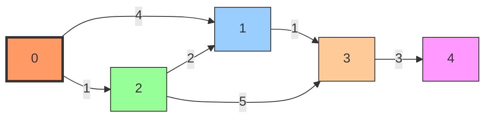
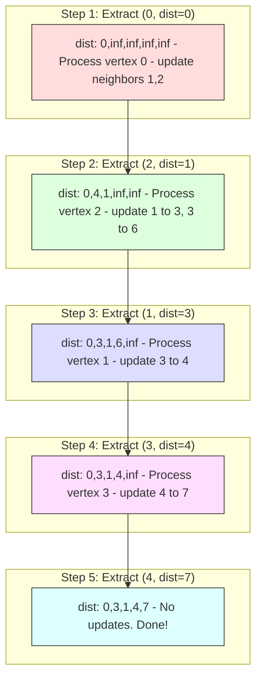
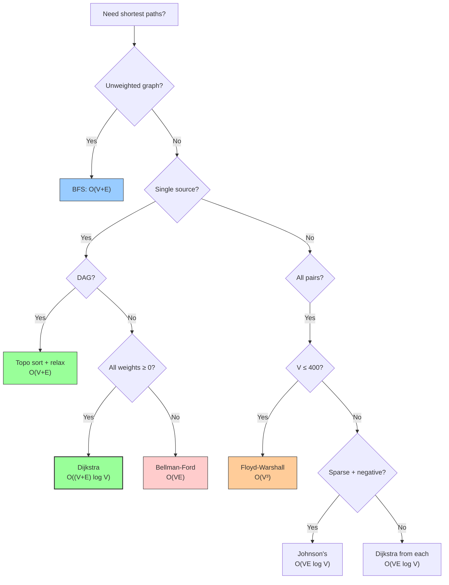

# Chapter 26: Shortest Paths

Finding the shortest path between vertices in a graph is one of the most fundamental problems in computer science. From GPS navigation to network routing to game AI, shortest-path algorithms are everywhere. Different scenarios call for different algorithms — the presence of negative weights, the need for all-pairs results, or constraints on the number of edges all influence the choice.

In this chapter, we cover the major shortest-path algorithms: Dijkstra's, Bellman-Ford, Floyd-Warshall, SPFA, Johnson's, and shortest paths in DAGs.

---

## 26.1 Problem Variants

| Variant | Description | Best Algorithm |
|---------|-------------|---------------|
| Single-source, non-negative weights | One source, find shortest to all | Dijkstra: \\(O((V+E)\log V)\\) |
| Single-source, negative weights allowed | May have negative edges | Bellman-Ford: \\(O(VE)\\) |
| Single-source, DAG | Topological order helps | Topo + Relax: \\(O(V+E)\\) |
| All-pairs, non-negative | All pairs shortest paths | Dijkstra from each: \\(O(VE\log V)\\) |
| All-pairs, general | Any weights | Floyd-Warshall: \\(O(V^3)\\) or Johnson's |
| Single-pair | One source to one target | Dijkstra with early exit |
| Shortest path with constraints | e.g., at most \\(k\\) edges | Modified Bellman-Ford or DP |
| Unweighted graph | All edges weight 1 | BFS: \\(O(V+E)\\) |

### Relaxation — The Core Operation

All shortest-path algorithms use **relaxation**: attempting to improve the distance to a vertex through a neighbor.

```cpp
void relax(int u, int v, int w, std::vector<long long>& dist) {
    if (dist[u] + w < dist[v]) {
        dist[v] = dist[u] + w;
        // Optionally update parent[v] = u for path reconstruction
    }
}
```

The key question is: **in what order** do we relax edges?

---

## 26.2 Dijkstra's Algorithm

### Idea

Dijkstra's algorithm is a **greedy** approach: always process the unvisited vertex with the smallest known distance. This guarantees that when we process a vertex, its distance is final.

### When It Works (and When It Doesn't)

- ✅ Non-negative edge weights.
- ❌ Negative edge weights — the greedy choice breaks because a "processed" vertex might later be reachable via a negative-weight shortcut.

### Algorithm

1. Set `dist[source] = 0`, all others = ∞.
2. Use a min-priority queue of `(distance, vertex)`.
3. Extract the vertex \\(u\\) with minimum distance.
4. For each neighbor \\(v\\) of \\(u\\): if `dist[u] + w < dist[v]`, update and push to PQ.
5. Skip extracted vertices that have already been finalized (lazy deletion).

### Complete Implementation

```cpp
#include <iostream>
#include <vector>
#include <queue>
#include <utility>
#include <climits>

class Dijkstra {
public:
    // Returns shortest distances from source to all vertices
    static std::vector<long long> solve(
        int source, int V,
        const std::vector<std::vector<std::pair<int, int>>>& adj) {

        std::vector<long long> dist(V, LLONG_MAX);
        // Min-heap: (distance, vertex)
        std::priority_queue<std::pair<long long, int>,
                            std::vector<std::pair<long long, int>>,
                            std::greater<>> pq;

        dist[source] = 0;
        pq.push({0, source});

        while (!pq.empty()) {
            auto [d, u] = pq.top();
            pq.pop();

            // Skip stale entries (lazy deletion)
            if (d > dist[u]) continue;

            for (auto [v, w] : adj[u]) {
                if (dist[u] + w < dist[v]) {
                    dist[v] = dist[u] + w;
                    pq.push({dist[v], v});
                }
            }
        }
        return dist;
    }

    // With path reconstruction
    static std::pair<std::vector<long long>, std::vector<int>> solveWithPath(
        int source, int target, int V,
        const std::vector<std::vector<std::pair<int, int>>>& adj) {

        std::vector<long long> dist(V, LLONG_MAX);
        std::vector<int> parent(V, -1);
        std::priority_queue<std::pair<long long, int>,
                            std::vector<std::pair<long long, int>>,
                            std::greater<>> pq;

        dist[source] = 0;
        pq.push({0, source});

        while (!pq.empty()) {
            auto [d, u] = pq.top();
            pq.pop();
            if (d > dist[u]) continue;
            if (u == target) break; // early exit

            for (auto [v, w] : adj[u]) {
                if (dist[u] + w < dist[v]) {
                    dist[v] = dist[u] + w;
                    parent[v] = u;
                    pq.push({dist[v], v});
                }
            }
        }

        // Reconstruct path
        std::vector<int> path;
        if (dist[target] != LLONG_MAX) {
            for (int cur = target; cur != -1; cur = parent[cur]) {
                path.push_back(cur);
            }
            std::reverse(path.begin(), path.end());
        }
        return {dist, path};
    }
};

int main() {
    int V = 5;
    std::vector<std::vector<std::pair<int, int>>> adj(V);
    auto addEdge = [&](int u, int v, int w) {
        adj[u].push_back({v, w});
        adj[v].push_back({u, w}); // undirected
    };

    addEdge(0, 1, 4);
    addEdge(0, 2, 1);
    addEdge(1, 3, 1);
    addEdge(2, 1, 2);
    addEdge(2, 3, 5);
    addEdge(3, 4, 3);

    auto dist = Dijkstra::solve(0, V, adj);
    std::cout << "Shortest distances from 0:\n";
    for (int i = 0; i < V; ++i) {
        std::cout << "  to " << i << ": " << dist[i] << "\n";
    }

    auto [d, path] = Dijkstra::solveWithPath(0, 4, V, adj);
    std::cout << "Shortest path to 4: ";
    for (int v : path) std::cout << v << " ";
    std::cout << "(distance " << d[4] << ")\n";
}
```

**Time Complexity:** \\(O((V + E) \log V)\\) with a binary heap (priority queue). Each vertex is extracted once (\\(V\\) extractions, each \\(O(\log V)\\)), and each edge is relaxed once (\\(E\\) relaxations, each potentially causing a push, \\(O(\log V)\\)).

**Space Complexity:** \\(O(V + E)\\) for the adjacency list, distance array, and priority queue.

### Python — Dijkstra's Algorithm

```python
import heapq
from typing import List, Tuple

def dijkstra(source: int, V: int, adj: List[List[Tuple[int, int]]]) -> List[int]:
    """Returns shortest distances from source to all vertices."""
    dist = [float('inf')] * V
    dist[source] = 0
    pq = [(0, source)]  # (distance, vertex)

    while pq:
        d, u = heapq.heappop(pq)
        if d > dist[u]:
            continue  # Skip stale entries
        for v, w in adj[u]:
            if dist[u] + w < dist[v]:
                dist[v] = dist[u] + w
                heapq.heappush(pq, (dist[v], v))
    return dist

def dijkstra_with_path(source: int, target: int, V: int,
                       adj: List[List[Tuple[int, int]]]) -> Tuple[List[int], List[int]]:
    """Returns (distances, path) from source to target."""
    dist = [float('inf')] * V
    parent = [-1] * V
    dist[source] = 0
    pq = [(0, source)]

    while pq:
        d, u = heapq.heappop(pq)
        if d > dist[u]:
            continue
        if u == target:
            break
        for v, w in adj[u]:
            if dist[u] + w < dist[v]:
                dist[v] = dist[u] + w
                parent[v] = u
                heapq.heappush(pq, (dist[v], v))

    path = []
    if dist[target] != float('inf'):
        cur = target
        while cur != -1:
            path.append(cur)
            cur = parent[cur]
        path.reverse()
    return dist, path


if __name__ == "__main__":
    V = 5
    adj = [[] for _ in range(V)]
    def add_edge(u, v, w):
        adj[u].append((v, w))
        adj[v].append((u, w))

    add_edge(0, 1, 4)
    add_edge(0, 2, 1)
    add_edge(1, 3, 1)
    add_edge(2, 1, 2)
    add_edge(2, 3, 5)
    add_edge(3, 4, 3)

    dist = dijkstra(0, V, adj)
    print("Shortest distances from 0:")
    for i in range(V):
        print(f"  to {i}: {dist[i]}")

    dist, path = dijkstra_with_path(0, 4, V, adj)
    print(f"Shortest path to 4: {' '.join(map(str, path))} (distance {dist[4]})")
```

### Java — Dijkstra's Algorithm

```java
import java.util.*;

public class Dijkstra {
    public static long[] solve(int source, int V, List<List<int[]>> adj) {
        long[] dist = new long[V];
        Arrays.fill(dist, Long.MAX_VALUE);
        dist[source] = 0;
        // Min-heap: {distance, vertex}
        PriorityQueue<long[]> pq = new PriorityQueue<>(Comparator.comparingLong(a -> a[0]));
        pq.offer(new long[]{0, source});

        while (!pq.isEmpty()) {
            long[] top = pq.poll();
            long d = top[0];
            int u = (int) top[1];
            if (d > dist[u]) continue;
            for (int[] edge : adj.get(u)) {
                int v = edge[0], w = edge[1];
                if (dist[u] + w < dist[v]) {
                    dist[v] = dist[u] + w;
                    pq.offer(new long[]{dist[v], v});
                }
            }
        }
        return dist;
    }

    public static void main(String[] args) {
        int V = 5;
        List<List<int[]>> adj = new ArrayList<>();
        for (int i = 0; i < V; i++) adj.add(new ArrayList<>());

        // Undirected edges
        int[][] edges = {{0,1,4},{0,2,1},{1,3,1},{2,1,2},{2,3,5},{3,4,3}};
        for (int[] e : edges) {
            adj.get(e[0]).add(new int[]{e[1], e[2]});
            adj.get(e[1]).add(new int[]{e[0], e[2]});
        }

        long[] dist = solve(0, V, adj);
        System.out.println("Shortest distances from 0:");
        for (int i = 0; i < V; i++) {
            System.out.println("  to " + i + ": " + dist[i]);
        }
    }
}
```

### Dry Run

Graph: `0-1(4), 0-2(1), 1-3(1), 2-1(2), 2-3(5), 3-4(3)`. Source = 0.



Step-by-step execution of Dijkstra's algorithm:



*Final shortest path to vertex 4: 0 → 2 → 1 → 3 → 4 (distance 7)*

| Step | PQ (dist, vertex) | Extracted | Updated | dist[] |
|------|------------------|-----------|---------|--------|
| Init | (0,0) | — | — | [0,∞,∞,∞,∞] |
| 1 | (1,2), (4,1) | (0,0) | dist[1]=4, dist[2]=1 | [0,4,1,∞,∞] |
| 2 | (3,1), (4,1), (6,3) | (1,2) | dist[1]=3, dist[3]=6 | [0,3,1,6,∞] |
| 3 | (4,1), (4,1), (6,3) | (3,1) | dist[3]=4 | [0,3,1,4,∞] |
| 4 | (4,1), (6,3), (7,4) | (4,1) stale, skip | — | [0,3,1,4,∞] |
| 5 | (6,3), (7,4) | (4,3) | dist[4]=7 | [0,3,1,4,7] |
| 6 | (7,4) | (7,4) | — | [0,3,1,4,7] |

Result: `dist = [0, 3, 1, 4, 7]`. Path to 4: `0 → 2 → 1 → 3 → 4`.

### Why Dijkstra Fails with Negative Weights

Consider: `A → B (weight 1)`, `A → C (weight 5)`, `C → B (weight -3)`.

Dijkstra processes A first (dist 0), then B (dist 1, via A→B). But the true shortest to B is A→C→B = 5 + (-3) = 2, which is *worse*. However, if `C → B` had weight -10, the shortest would be A→C→B = -5. Dijkstra already finalized B at dist 1 and won't reconsider it.

---

## 26.3 Bellman-Ford Algorithm

### Idea

Bellman-Ford handles negative edge weights by relaxing *all* edges \\(V-1\\) times. After \\(k\\) iterations, distances are correct for paths with at most \\(k\\) edges. If an improvement is possible in the \\(V\\)-th iteration, a negative cycle exists.

### Complete Implementation

```cpp
#include <iostream>
#include <vector>
#include <tuple>
#include <climits>

class BellmanFord {
public:
    struct Edge {
        int u, v, w;
    };

    // Returns {distances, hasNegativeCycle}
    static std::pair<std::vector<long long>, bool> solve(
        int source, int V, const std::vector<Edge>& edges) {

        std::vector<long long> dist(V, LLONG_MAX);
        dist[source] = 0;

        // Relax all edges V-1 times
        for (int i = 0; i < V - 1; ++i) {
            bool anyUpdate = false;
            for (const auto& e : edges) {
                if (dist[e.u] != LLONG_MAX && dist[e.u] + e.w < dist[e.v]) {
                    dist[e.v] = dist[e.u] + e.w;
                    anyUpdate = true;
                }
            }
            if (!anyUpdate) break; // early termination optimization
        }

        // Check for negative cycles
        bool hasNegativeCycle = false;
        for (const auto& e : edges) {
            if (dist[e.u] != LLONG_MAX && dist[e.u] + e.w < dist[e.v]) {
                hasNegativeCycle = true;
                break;
            }
        }

        return {dist, hasNegativeCycle};
    }

    // Find vertices affected by negative cycles (reachable from source)
    static std::vector<int> findNegativeCycleVertices(
        int source, int V, const std::vector<Edge>& edges) {

        auto [dist, hasCycle] = solve(source, V, edges);
        if (!hasCycle) return {};

        // Run one more iteration; vertices that improve are affected
        std::vector<bool> affected(V, false);
        for (const auto& e : edges) {
            if (dist[e.u] != LLONG_MAX && dist[e.u] + e.w < dist[e.v]) {
                affected[e.v] = true;
            }
        }
        // Propagate affected status through edges
        for (int i = 0; i < V; ++i) {
            for (const auto& e : edges) {
                if (affected[e.u]) affected[e.v] = true;
            }
        }

        std::vector<int> result;
        for (int i = 0; i < V; ++i) {
            if (affected[i]) result.push_back(i);
        }
        return result;
    }
};

int main() {
    int V = 5;
    std::vector<BellmanFord::Edge> edges = {
        {0, 1, 6}, {0, 2, 7}, {1, 2, 8}, {1, 3, 5},
        {1, 4, -4}, {2, 3, -3}, {2, 4, 9}, {3, 1, -2},
        {4, 0, 2}, {4, 3, 7}
    };

    auto [dist, hasNegCycle] = BellmanFord::solve(0, V, edges);
    if (hasNegCycle) {
        std::cout << "Negative cycle detected!\n";
    } else {
        std::cout << "Distances from 0:\n";
        for (int i = 0; i < V; ++i) {
            std::cout << "  to " << i << ": " << dist[i] << "\n";
        }
    }
}
```

**Time Complexity:** \\(O(VE)\\) — \\(V-1\\) iterations, each relaxing \\(E\\) edges.

**Space Complexity:** \\(O(V + E)\\).

### Python — Bellman-Ford Algorithm

```python
def bellman_ford(source, V, edges):
    """
    Returns (distances, has_negative_cycle).
    edges: list of (u, v, w) tuples.
    """
    INF = float('inf')
    dist = [INF] * V
    dist[source] = 0

    # Relax all edges V-1 times
    for _ in range(V - 1):
        any_update = False
        for u, v, w in edges:
            if dist[u] != INF and dist[u] + w < dist[v]:
                dist[v] = dist[u] + w
                any_update = True
        if not any_update:
            break

    # Check for negative cycles
    has_negative_cycle = False
    for u, v, w in edges:
        if dist[u] != INF and dist[u] + w < dist[v]:
            has_negative_cycle = True
            break

    return dist, has_negative_cycle


if __name__ == "__main__":
    V = 5
    edges = [
        (0, 1, 6), (0, 2, 7), (1, 2, 8), (1, 3, 5),
        (1, 4, -4), (2, 3, -3), (2, 4, 9), (3, 1, -2),
        (4, 0, 2), (4, 3, 7)
    ]

    dist, has_neg = bellman_ford(0, V, edges)
    if has_neg:
        print("Negative cycle detected!")
    else:
        print("Distances from 0:")
        for i in range(V):
            print(f"  to {i}: {dist[i]}")
```

### Java — Bellman-Ford Algorithm

```java
import java.util.*;

public class BellmanFord {
    static class Edge {
        int u, v, w;
        Edge(int u, int v, int w) { this.u = u; this.v = v; this.w = w; }
    }

    public static long[] solve(int source, int V, List<Edge> edges, boolean[] hasNegativeCycle) {
        long[] dist = new long[V];
        Arrays.fill(dist, Long.MAX_VALUE);
        dist[source] = 0;

        // Relax all edges V-1 times
        for (int i = 0; i < V - 1; i++) {
            boolean anyUpdate = false;
            for (Edge e : edges) {
                if (dist[e.u] != Long.MAX_VALUE && dist[e.u] + e.w < dist[e.v]) {
                    dist[e.v] = dist[e.u] + e.w;
                    anyUpdate = true;
                }
            }
            if (!anyUpdate) break;
        }

        // Check for negative cycles
        hasNegativeCycle[0] = false;
        for (Edge e : edges) {
            if (dist[e.u] != Long.MAX_VALUE && dist[e.u] + e.w < dist[e.v]) {
                hasNegativeCycle[0] = true;
                break;
            }
        }
        return dist;
    }

    public static void main(String[] args) {
        int V = 5;
        List<Edge> edges = List.of(
            new Edge(0, 1, 6), new Edge(0, 2, 7), new Edge(1, 2, 8),
            new Edge(1, 3, 5), new Edge(1, 4, -4), new Edge(2, 3, -3),
            new Edge(2, 4, 9), new Edge(3, 1, -2), new Edge(4, 0, 2),
            new Edge(4, 3, 7)
        );

        boolean[] hasNeg = new boolean[1];
        long[] dist = solve(0, V, edges, hasNeg);
        if (hasNeg[0]) {
            System.out.println("Negative cycle detected!");
        } else {
            System.out.println("Distances from 0:");
            for (int i = 0; i < V; i++) {
                System.out.println("  to " + i + ": " + dist[i]);
            }
        }
    }
}
```

### Dry Run

Graph with edges: `0→1(6), 0→2(7), 1→2(8), 1→3(5), 1→4(-4), 2→3(-3), 2→4(9), 3→1(-2), 4→0(2), 4→3(7)`. Source = 0.

| Iteration | dist[0] | dist[1] | dist[2] | dist[3] | dist[4] |
|-----------|---------|---------|---------|---------|---------|
| Init | 0 | ∞ | ∞ | ∞ | ∞ |
| 1 | 0 | 6 | 7 | 4 | 2 |
| 2 | 0 | 2 | 7 | 4 | -2 |
| 3 | 0 | 2 | 7 | 4 | -2 |

No change in iteration 3 → no negative cycle (for this source).

---

## 26.4 Floyd-Warshall Algorithm

### Idea

Floyd-Warshall computes shortest paths between **all pairs** of vertices using dynamic programming.

**DP formulation:** Let `dist[k][i][j]` = shortest path from \\(i\\) to \\(j\\) using only vertices \\(\{0, 1, \ldots, k\}\\) as intermediates.

**Recurrence:**
\\[\text{dist}[k][i][j] = \min(\text{dist}[k-1][i][j], \text{dist}[k-1][i][k] + \text{dist}[k-1][k][j])\\]

We can optimize space by using a single 2D array and iterating \\(k\\) in the outermost loop.

### Complete Implementation

```cpp
#include <iostream>
#include <vector>
#include <climits>

class FloydWarshall {
public:
    static constexpr long long INF = 1e18;

    // Returns dist[i][j] = shortest path from i to j, INF if unreachable
    static std::vector<std::vector<long long>> solve(
        int V, const std::vector<std::vector<long long>>& adj) {

        // adj[i][j] = weight of edge (i,j), INF if no edge, 0 if i==j
        auto dist = adj;

        for (int k = 0; k < V; ++k) {
            for (int i = 0; i < V; ++i) {
                for (int j = 0; j < V; ++j) {
                    if (dist[i][k] < INF && dist[k][j] < INF) {
                        dist[i][j] = std::min(dist[i][j], dist[i][k] + dist[k][j]);
                    }
                }
            }
        }
        return dist;
    }

    // Detect negative cycles: if dist[i][i] < 0 for any i
    static bool hasNegativeCycle(const std::vector<std::vector<long long>>& dist, int V) {
        for (int i = 0; i < V; ++i) {
            if (dist[i][i] < 0) return true;
        }
        return false;
    }

    // Build adjacency matrix from edge list
    static std::vector<std::vector<long long>> buildMatrix(
        int V, const std::vector<std::tuple<int, int, int>>& edges) {

        std::vector<std::vector<long long>> dist(V, std::vector<long long>(V, INF));
        for (int i = 0; i < V; ++i) dist[i][i] = 0;
        for (auto [u, v, w] : edges) {
            dist[u][v] = std::min(dist[u][v], (long long)w);
        }
        return dist;
    }
};

int main() {
    int V = 4;
    auto adj = FloydWarshall::buildMatrix(V, {
        {0, 1, 5}, {0, 3, 10}, {1, 2, 3}, {2, 3, 1}
    });

    auto dist = FloydWarshall::solve(V, adj);

    std::cout << "All-pairs shortest distances:\n";
    for (int i = 0; i < V; ++i) {
        for (int j = 0; j < V; ++j) {
            if (dist[i][j] >= FloydWarshall::INF)
                std::cout << "INF ";
            else
                std::cout << dist[i][j] << " ";
        }
        std::cout << "\n";
    }
}
```

**Time Complexity:** \\(O(V^3)\\) — three nested loops over \\(V\\).

**Space Complexity:** \\(O(V^2)\\) for the distance matrix.

**When to use:** \\(V \leq 400\\) (with 1-second time limit). For \\(V = 1000\\), \\(V^3 = 10^9\\) is borderline.

### Python — Floyd-Warshall Algorithm

```python
def floyd_warshall(V, adj):
    """
    Returns dist[i][j] = shortest path from i to j.
    adj: adjacency matrix, adj[i][j] = weight or float('inf') if no edge.
    """
    dist = [row[:] for row in adj]  # Deep copy

    for k in range(V):
        for i in range(V):
            for j in range(V):
                if dist[i][k] < float('inf') and dist[k][j] < float('inf'):
                    dist[i][j] = min(dist[i][j], dist[i][k] + dist[k][j])
    return dist

def has_negative_cycle(dist, V):
    """Check if dist[i][i] < 0 for any i."""
    for i in range(V):
        if dist[i][i] < 0:
            return True
    return False

def build_matrix(V, edges):
    """Build adjacency matrix from edge list."""
    INF = float('inf')
    dist = [[INF] * V for _ in range(V)]
    for i in range(V):
        dist[i][i] = 0
    for u, v, w in edges:
        dist[u][v] = min(dist[u][v], w)
    return dist


if __name__ == "__main__":
    V = 4
    edges = [(0, 1, 5), (0, 3, 10), (1, 2, 3), (2, 3, 1)]
    adj = build_matrix(V, edges)
    dist = floyd_warshall(V, adj)

    print("All-pairs shortest distances:")
    for i in range(V):
        row = []
        for j in range(V):
            row.append("INF" if dist[i][j] == float('inf') else str(dist[i][j]))
        print(" ".join(row))
```

### Java — Floyd-Warshall Algorithm

```java
public class FloydWarshall {
    static final long INF = (long) 1e18;

    public static long[][] solve(int V, long[][] adj) {
        long[][] dist = new long[V][V];
        for (int i = 0; i < V; i++) {
            for (int j = 0; j < V; j++) {
                dist[i][j] = adj[i][j];
            }
        }

        for (int k = 0; k < V; k++) {
            for (int i = 0; i < V; i++) {
                for (int j = 0; j < V; j++) {
                    if (dist[i][k] < INF && dist[k][j] < INF) {
                        dist[i][j] = Math.min(dist[i][j], dist[i][k] + dist[k][j]);
                    }
                }
            }
        }
        return dist;
    }

    public static boolean hasNegativeCycle(long[][] dist, int V) {
        for (int i = 0; i < V; i++) {
            if (dist[i][i] < 0) return true;
        }
        return false;
    }

    public static long[][] buildMatrix(int V, int[][] edges) {
        long[][] dist = new long[V][V];
        for (int i = 0; i < V; i++) {
            for (int j = 0; j < V; j++) {
                dist[i][j] = (i == j) ? 0 : INF;
            }
        }
        for (int[] e : edges) {
            dist[e[0]][e[1]] = Math.min(dist[e[0]][e[1]], e[2]);
        }
        return dist;
    }

    public static void main(String[] args) {
        int V = 4;
        int[][] edges = {{0, 1, 5}, {0, 3, 10}, {1, 2, 3}, {2, 3, 1}};
        long[][] adj = buildMatrix(V, edges);
        long[][] dist = solve(V, adj);

        System.out.println("All-pairs shortest distances:");
        for (int i = 0; i < V; i++) {
            StringBuilder sb = new StringBuilder();
            for (int j = 0; j < V; j++) {
                if (j > 0) sb.append(" ");
                sb.append(dist[i][j] >= INF ? "INF" : dist[i][j]);
            }
            System.out.println(sb.toString());
        }
    }
}
```

### Path Reconstruction

```cpp
std::vector<std::vector<int>> next(V, std::vector<int>(V, -1));

// Initialize: next[i][j] = j if edge exists, -1 otherwise
for (int i = 0; i < V; ++i)
    for (int j = 0; j < V; ++j)
        if (adj[i][j] < INF && i != j) next[i][j] = j;

// Update during Floyd-Warshall
for (int k = 0; k < V; ++k)
    for (int i = 0; i < V; ++i)
        for (int j = 0; j < V; ++j)
            if (dist[i][k] + dist[k][j] < dist[i][j]) {
                dist[i][j] = dist[i][k] + dist[k][j];
                next[i][j] = next[i][k];
            }

// Query path from i to j
auto getPath = [&](int i, int j) -> std::vector<int> {
    if (next[i][j] == -1) return {};
    std::vector<int> path = {i};
    while (i != j) {
        i = next[i][j];
        path.push_back(i);
    }
    return path;
};
```

---

## 26.5 SPFA (Shortest Path Faster Algorithm)

SPFA is an optimization of Bellman-Ford that uses a queue to only relax edges from vertices whose distances have changed.

### Algorithm

1. Enqueue the source.
2. While the queue is not empty:
   a. Dequeue \\(u\\).
   b. For each neighbor \\(v\\) of \\(u\\): if relaxation improves `dist[v]`, update and enqueue \\(v\\) (if not already in queue).
3. Track enqueue count for negative cycle detection.

### Implementation

```cpp
#include <iostream>
#include <vector>
#include <queue>
#include <climits>

class SPFA {
public:
    // Returns {distances, hasNegativeCycle}
    static std::pair<std::vector<long long>, bool> solve(
        int source, int V,
        const std::vector<std::vector<std::pair<int, int>>>& adj) {

        std::vector<long long> dist(V, LLONG_MAX);
        std::vector<int> inQueue(V, 0), enqueueCount(V, 0);
        std::queue<int> q;

        dist[source] = 0;
        q.push(source);
        inQueue[source] = 1;
        enqueueCount[source] = 1;

        while (!q.empty()) {
            int u = q.front();
            q.pop();
            inQueue[u] = 0;

            for (auto [v, w] : adj[u]) {
                if (dist[u] + w < dist[v]) {
                    dist[v] = dist[u] + w;
                    if (!inQueue[v]) {
                        q.push(v);
                        inQueue[v] = 1;
                        enqueueCount[v]++;
                        if (enqueueCount[v] > V) {
                            return {dist, true}; // negative cycle
                        }
                    }
                }
            }
        }
        return {dist, false};
    }
};
```

**Average Time:** \\(O(E)\\) in practice (much faster than Bellman-Ford on many graphs).

**Worst Case:** \\(O(VE)\\) — same as Bellman-Ford. Can be deliberately slow on certain graph constructions.

**When to use:** Competitive programming when \\(V\\) is large and you expect the average case to be good. For interviews, prefer Dijkstra or Bellman-Ford for clarity.

---

## 26.6 Johnson's Algorithm

### Problem

We want all-pairs shortest paths on a graph that may have negative edges. Floyd-Warshall is \\(O(V^3)\\), which is too slow for large sparse graphs. Johnson's algorithm uses \\(V\\) calls to Dijkstra for \\(O(VE\log V)\\) total — better for sparse graphs.

### Idea

1. Add a **super-source** \\(s\\) connected to all vertices with weight 0.
2. Run Bellman-Ford from \\(s\\) to get \\(h[v]\\) = shortest distance from \\(s\\) to \\(v\\).
3. **Reweight** each edge \\((u, v)\\): new weight = old weight + \\(h[u] - h[v]\\). This makes all weights non-negative.
4. Run Dijkstra from each vertex using reweighted edges.
5. Convert results back using the reverse reweighting.

### Why Reweighting Works

For any path \\(P\\) from \\(u\\) to \\(v\\), the reweighted path length differs from the original by exactly \\(h[u] - h[v]\\). So the shortest path is the same after reweighting. The reweighting ensures all edges are non-negative because of the triangle inequality from Bellman-Ford.

### Implementation

```cpp
#include <iostream>
#include <vector>
#include <queue>
#include <climits>

class Johnson {
public:
    static constexpr long long INF = 1e18;

    static std::vector<std::vector<long long>> solve(
        int V, std::vector<std::tuple<int, int, int>> edges) {

        // Step 1: Add super-source (vertex V) with 0-weight edges to all
        std::vector<std::vector<std::pair<int, int>>> adj(V + 1);
        for (auto [u, v, w] : edges) {
            adj[u].push_back({v, w});
        }
        for (int i = 0; i < V; ++i) {
            adj[V].push_back({i, 0});
        }

        // Step 2: Bellman-Ford from super-source
        std::vector<long long> h(V + 1, INF);
        h[V] = 0;
        for (int i = 0; i < V; ++i) {
            for (int u = 0; u <= V; ++u) {
                for (auto [v, w] : adj[u]) {
                    if (h[u] < INF && h[u] + w < h[v]) {
                        h[v] = h[u] + w;
                    }
                }
            }
        }

        // Check for negative cycles
        for (int u = 0; u <= V; ++u) {
            for (auto [v, w] : adj[u]) {
                if (h[u] < INF && h[u] + w < h[v]) {
                    return {}; // negative cycle
                }
            }
        }

        // Step 3: Reweight edges
        std::vector<std::vector<std::pair<int, int>>> adjReweighted(V);
        for (auto [u, v, w] : edges) {
            long long newW = w + h[u] - h[v];
            adjReweighted[u].push_back({v, (int)newW});
        }

        // Step 4: Dijkstra from each vertex
        std::vector<std::vector<long long>> dist(V, std::vector<long long>(V, INF));
        for (int src = 0; src < V; ++src) {
            // Standard Dijkstra
            dist[src][src] = 0;
            std::priority_queue<std::pair<long long, int>,
                                std::vector<std::pair<long long, int>>,
                                std::greater<>> pq;
            pq.push({0, src});

            while (!pq.empty()) {
                auto [d, u] = pq.top();
                pq.pop();
                if (d > dist[src][u]) continue;
                for (auto [v, w] : adjReweighted[u]) {
                    if (dist[src][u] + w < dist[src][v]) {
                        dist[src][v] = dist[src][u] + w;
                        pq.push({dist[src][v], v});
                    }
                }
            }

            // Step 5: Convert back
            for (int v = 0; v < V; ++v) {
                if (dist[src][v] < INF) {
                    dist[src][v] = dist[src][v] - h[src] + h[v];
                }
            }
        }
        return dist;
    }
};
```

**Time Complexity:** \\(O(VE\log V)\\) — Bellman-Ford \\(O(VE)\\) + \\(V\\) Dijkstras \\(O(V \cdot E\log V)\\).

**When to use:** All-pairs shortest paths on sparse graphs with possible negative weights (but no negative cycles).

---

## 26.7 Shortest Path in DAG

### Idea

In a DAG, we can compute single-source shortest paths in \\(O(V + E)\\) by processing vertices in **topological order**. Since all edges go forward in topological order, we never need to reconsider a vertex.

### Complete Implementation

```cpp
#include <iostream>
#include <vector>
#include <queue>
#include <climits>

class DAGShortestPath {
public:
    static std::vector<long long> solve(
        int source, int V,
        const std::vector<std::vector<std::pair<int, int>>>& adj) {

        // Step 1: Topological sort (Kahn's)
        std::vector<int> inDegree(V, 0);
        for (int u = 0; u < V; ++u)
            for (auto [v, w] : adj[u]) inDegree[v]++;

        std::queue<int> q;
        for (int i = 0; i < V; ++i)
            if (inDegree[i] == 0) q.push(i);

        std::vector<int> topo;
        while (!q.empty()) {
            int u = q.front(); q.pop();
            topo.push_back(u);
            for (auto [v, w] : adj[u])
                if (--inDegree[v] == 0) q.push(v);
        }

        // Step 2: Relax in topological order
        std::vector<long long> dist(V, LLONG_MAX);
        dist[source] = 0;

        for (int u : topo) {
            if (dist[u] == LLONG_MAX) continue;
            for (auto [v, w] : adj[u]) {
                if (dist[u] + w < dist[v]) {
                    dist[v] = dist[u] + w;
                }
            }
        }
        return dist;
    }
};

int main() {
    int V = 6;
    std::vector<std::vector<std::pair<int, int>>> adj(V);
    auto addEdge = [&](int u, int v, int w) {
        adj[u].push_back({v, w});
    };

    addEdge(0, 1, 5);
    addEdge(0, 2, 3);
    addEdge(1, 3, 6);
    addEdge(1, 2, 2);
    addEdge(2, 3, 7);
    addEdge(2, 4, 4);
    addEdge(3, 4, -1);
    addEdge(4, 5, 2);

    auto dist = DAGShortestPath::solve(0, V, adj);
    std::cout << "Shortest distances from 0 in DAG:\n";
    for (int i = 0; i < V; ++i) {
        std::cout << "  to " << i << ": " << dist[i] << "\n";
    }
}
```

**Time Complexity:** \\(O(V + E)\\) — topological sort + one pass of relaxation.

**Key advantage:** Works with negative weights (as long as there's no negative cycle, which is guaranteed in a DAG).

---

## Interview Tips

1. **Negative weights?** → Bellman-Ford or Floyd-Warshall. Non-negative? → Dijkstra.
2. **All-pairs?** → Floyd-Warshall (\\(V \leq 400\\)) or Johnson's (sparse).
3. **DAG?** → Topo sort + relaxation. Fastest and handles negative weights.
4. **Unweighted?** → BFS. Don't use Dijkstra for unweighted graphs.
5. **Always check for negative cycles** when the problem allows negative weights.
6. **Use `long long`** for distances. Sum of many weights can overflow `int`.
7. **Early termination** in Dijkstra: stop when the target is extracted from the PQ.

## Common Mistakes

| Mistake | Consequence | Fix |
|---------|-------------|-----|
| Using Dijkstra with negative weights | Wrong answer | Use Bellman-Ford |
| Integer overflow in distance | Wrong results | Use `long long` |
| Forgetting to handle unreachable | Printing ∞ or garbage | Check `dist[v] == INF` |
| Not checking for negative cycle | Infinite improvement loop | Run \\(V\\)-th iteration check |
| Wrong edge direction | Reversed shortest path | Clarify directed vs undirected |

## 26.8 Algorithm Comparison: Choosing the Right Shortest Path Algorithm

With multiple shortest-path algorithms available, choosing the right one is critical. Here's a unified comparison:

### Quick Comparison Table

| Feature | Dijkstra | Bellman-Ford | Floyd-Warshall | Johnson's | DAG Shortest |
|---------|----------|-------------|----------------|-----------|-------------|
| **Type** | Single-source | Single-source | All-pairs | All-pairs | Single-source |
| **Time** | O((V+E) log V) | O(VE) | O(V³) | O(VE log V) | O(V+E) |
| **Space** | O(V+E) | O(V+E) | O(V²) | O(V²) | O(V+E) |
| **Negative weights?** | ❌ No | ✅ Yes | ✅ Yes | ✅ Yes | ✅ Yes |
| **Negative cycles?** | ❌ | ✅ Detects | ✅ Detects | ✅ Detects | N/A (DAG) |
| **Graph type** | Any (non-neg) | Any | Any | Sparse | DAG only |
| **Best for** | Most common | Negative edges | Small dense graphs | Large sparse + neg | DAGs |

### Decision Flowchart

```
Need shortest paths?
  │
  ├─ Unweighted graph? → BFS: O(V+E)
  │
  ├─ Single source?
  │   ├─ DAG? → Topological sort + relax: O(V+E)
  │   ├─ All weights ≥ 0? → Dijkstra: O((V+E) log V)
  │   └─ Negative weights? → Bellman-Ford: O(VE)
  │
  └─ All pairs?
      ├─ V ≤ 400? → Floyd-Warshall: O(V³)
      ├─ Sparse + negative? → Johnson's: O(VE log V)
      └─ Sparse + non-negative? → Dijkstra from each: O(VE log V)
```

### Decision Flowchart



### Key Differences Explained

**Dijkstra vs Bellman-Ford:**
- Dijkstra is faster but only works with non-negative weights.
- Bellman-Ford is slower but handles negative edges and detects negative cycles.
- *Rule:* If you know weights are non-negative, always use Dijkstra.

**Floyd-Warshall vs Johnson's:**
- Both solve all-pairs shortest paths.
- Floyd-Warshall is simpler to code and works well for V ≤ 400.
- Johnson's is faster for sparse graphs (O(VE log V) vs O(V³)).
- *Rule:* Small dense graph → Floyd-Warshall. Large sparse graph → Johnson's.

**DAG Shortest Path vs Dijkstra:**
- DAG shortest path is O(V+E) — faster than Dijkstra.
- It also handles negative weights (since no cycles exist in a DAG).
- *Rule:* If the graph is a DAG, always use topological sort + relaxation.

### Practice Problems

### Network Delay Time (LeetCode 743)

**Problem:** Given `n` nodes, a list of weighted directed edges, and a source node `k`, find the time for all nodes to receive the signal (shortest path to the farthest node). Return -1 if not all nodes are reachable.

```cpp
#include <vector>
#include <queue>
#include <climits>

class Solution {
public:
    int networkDelayTime(std::vector<std::vector<int>>& times, int n, int k) {
        std::vector<std::vector<std::pair<int, int>>> adj(n + 1);
        for (auto& t : times) adj[t[0]].push_back({t[1], t[2]});

        std::vector<int> dist(n + 1, INT_MAX);
        std::priority_queue<std::pair<int, int>, std::vector<std::pair<int, int>>,
                            std::greater<>> pq;
        dist[k] = 0;
        pq.push({0, k});

        while (!pq.empty()) {
            auto [d, u] = pq.top(); pq.pop();
            if (d > dist[u]) continue;
            for (auto [v, w] : adj[u]) {
                if (dist[u] + w < dist[v]) {
                    dist[v] = dist[u] + w;
                    pq.push({dist[v], v});
                }
            }
        }

        int ans = 0;
        for (int i = 1; i <= n; ++i) {
            if (dist[i] == INT_MAX) return -1;
            ans = std::max(ans, dist[i]);
        }
        return ans;
    }
};
```

### Cheapest Flights Within K Stops (LeetCode 787)

**Problem:** Find the cheapest price from source to destination with at most \\(k\\) stops.

**Approach:** Modified Bellman-Ford with at most \\(k+1\\) relaxations, or BFS with state `(node, cost, stops)`.

```cpp
#include <vector>
#include <queue>
#include <climits>

class Solution {
public:
    int findCheapestPrice(int n, std::vector<std::vector<int>>& flights,
                          int src, int dst, int k) {
        std::vector<std::vector<std::pair<int, int>>> adj(n);
        for (auto& f : flights) adj[f[0]].push_back({f[1], f[2]});

        // dist[v] = min cost to reach v with exactly 'stops' stops
        std::vector<int> dist(n, INT_MAX);
        dist[src] = 0;

        // Bellman-Ford style: relax k+1 times (k stops = k+1 edges)
        for (int i = 0; i <= k; ++i) {
            std::vector<int> temp = dist;
            for (auto& f : flights) {
                int u = f[0], v = f[1], w = f[2];
                if (dist[u] != INT_MAX && dist[u] + w < temp[v]) {
                    temp[v] = dist[u] + w;
                }
            }
            dist = temp;
        }
        return dist[dst] == INT_MAX ? -1 : dist[dst];
    }
};
```

### Shortest Path with Alternating Colors (LeetCode 1129)

**Problem:** Given a directed graph with red and blue edges, find the shortest path from node 0 to each node where edge colors alternate (red, blue, red, ...).

**Approach:** BFS with state `(node, lastColor)`.

```cpp
#include <vector>
#include <queue>
#include <utility>

class Solution {
public:
    std::vector<int> shortestAlternatingPaths(
        int n, std::vector<std::vector<int>>& redEdges,
        std::vector<std::vector<int>>& blueEdges) {

        // adj[node] = {neighbors by red, neighbors by blue}
        std::vector<std::vector<int>> adjR(n), adjB(n);
        for (auto& e : redEdges) adjR[e[0]].push_back(e[1]);
        for (auto& e : blueEdges) adjB[e[0]].push_back(e[1]);

        // dist[node][color] = shortest path ending with color (0=red, 1=blue)
        std::vector<std::vector<int>> dist(n, std::vector<int>(2, -1));
        std::queue<std::pair<int, int>> q; // (node, lastColor)

        dist[0][0] = dist[0][1] = 0;
        q.push({0, 0}); // start with red
        q.push({0, 1}); // start with blue

        while (!q.empty()) {
            auto [u, c] = q.front();
            q.pop();
            int d = dist[u][c];
            auto& adj = (c == 0) ? adjB : adjR; // next must be opposite color
            int nc = 1 - c;

            for (int v : adj) {
                if (dist[v][nc] == -1) {
                    dist[v][nc] = d + 1;
                    q.push({v, nc});
                }
            }
        }

        std::vector<int> ans(n);
        for (int i = 0; i < n; ++i) {
            if (dist[i][0] == -1) ans[i] = dist[i][1];
            else if (dist[i][1] == -1) ans[i] = dist[i][0];
            else ans[i] = std::min(dist[i][0], dist[i][1]);
        }
        return ans;
    }
};
```

---

*Next chapter: Minimum Spanning Trees — connecting all vertices at minimum cost.*
