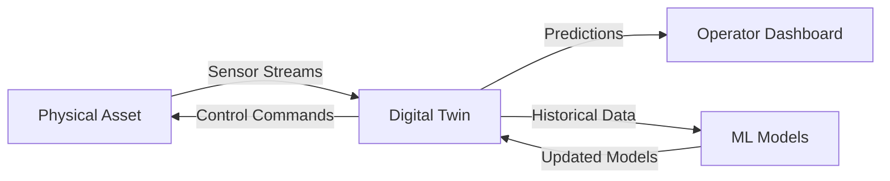

# Edge Computing

## Overview

Edge computing moves computation and data storage closer to the sources of data generation—sensors, devices, and end-users—reducing latency, bandwidth consumption, and exposure to cloud dependencies. It forms a continuum from on-device inference to fog layers to regional edge data centers, each tier trading off computational power against response-time guarantees.

## Computing Continuum: Device → Edge → Cloud

```
┌─────────────────────────────────────────────────────────┐
│                    Cloud / Data Center                    │
│            High compute, high storage, high latency       │
│                     (~20–200 ms RTT)                       │
├─────────────────────────────────────────────────────────┤
│              Regional Edge / MEC (Multi-access)            │
│          Moderate compute, local aggregation, CDN-like   │
│                     (~5–20 ms RTT)                        │
├─────────────────────────────────────────────────────────┤
│            Fog / Near-Edge (base stations, hubs)          │
│        Light compute, protocol translation, filtering    │
│                     (~1–5 ms RTT)                          │
├─────────────────────────────────────────────────────────┤
│            On-Device / Micro Edge (MCU, SoC)              │
│       Minimal compute, sensor fusion, local inference     │
│                     (<1 ms RTT)                            │
└─────────────────────────────────────────────────────────┘
```

**Mobile Edge Computing (MEC)**, standardized by ETSI, places compute resources at cellular base stations or aggregation points. This is critical for ultra-reliable low-latency communications (URLLC) in 5G scenarios like autonomous driving, AR overlays, and industrial control.

## Edge AI: Inference, Caching, and Databases

### Edge Inference

Running ML models on edge devices avoids round-trip latency to the cloud and protects sensitive data. Key techniques include:

- **Model compression**: pruning, quantization (INT8/INT4), knowledge distillation
- **Hardware acceleration**: NPUs, TPUs (Edge TPU), GPUs, FPGAs, and dedicated inference ASICs
- **Dynamic model selection**: routing inference requests to cloud vs. edge based on latency budget, accuracy requirements, and current load

Frameworks like TensorFlow Lite, ONNX Runtime, and PyTorch Mobile provide runtime environments for edge inference across heterogeneous hardware.

### Edge Caching

Caching at the edge reduces bandwidth costs and latency for frequently accessed content. Unlike traditional CDN caching, edge caches must handle:

- **Small, high-churn datasets** (sensor streams, inference results)
- **Consistency requirements** that vary by use case (eventual vs. strong)
- **Cache invalidation** under intermittent connectivity

**Edge databases** like SQLite (embedded), Realm, Couchbase Lite, and CRDT-based stores (Automerge, Yjs) provide local persistence with sync capabilities. Consistency models include:

| Model | Latency | Consistency Guarantee | Use Case |
|-------|---------|----------------------|----------|
| Last-write-wins | Lowest | None (optimistic) | Sensor telemetry |
| CRDT-based | Low | Eventual (merge) | Collaborative editing |
| Version vectors | Medium | Causal | Event sourcing |
| Leader-follower | Higher | Strong (linearizable) | Industrial control |

## Intermittent Connectivity & Delay-Tolerant Networking

Many edge deployments operate in environments with unreliable connectivity—satellite links, mobile vehicles, remote sensors. **Delay-Tolerant Networking (DTN)** provides store-and-forward semantics:

- **Bundle Protocol (RFC 5050)**: messages are bundled with metadata and forwarded opportunistically
- ** custody transfer**: intermediate nodes acknowledge receipt, taking responsibility for delivery
- **proactive caching**: nodes pre-fetch likely-needed data during connectivity windows

Designing for intermittent connectivity means treating the network as an unreliable resource, structuring state machines to handle disconnection gracefully, and implementing idempotent operations for conflict-free reconnection.

## Digital Twins

A **digital twin** is a real-time virtual representation of a physical entity—device, process, or system—synchronized via continuous sensor data. It enables:

- **Predictive maintenance**: ML models trained on twin data predict failures before they occur
- **Simulation and testing**: safely test control changes on the twin before deploying to physical assets
- **Visualization**: operators monitor fleet status, environmental conditions, and performance metrics



Key challenge: keeping the twin synchronized with physical reality despite network delays and sensor noise. Common architectures use a **state estimation layer** (Kalman filters, particle filters) to reconcile conflicting sensor readings and interpolate during connectivity gaps.

## Cyber-Physical Systems (CPS)

CPS integrate computation, networking, and physical processes. Examples include industrial robots, autonomous vehicles, smart grids, and medical devices. Design concerns:

- **Temporal correctness**: outputs must be produced within strict deadlines
- **Safety**: incorrect computations can cause physical harm
- **Composability**: integrating independently developed subsystems with different timing and safety requirements

**Fleet coordination**—managing groups of robots, drones, or vehicles—adds multi-agent coordination challenges: task allocation, collision avoidance, formation control, and distributed consensus under communication delays.

## Edge Federated Learning

Federated learning (FL) enables model training across distributed edge devices without centralizing raw data. In edge FL:

- Devices train on local data and send **model updates** (gradients or weight deltas) to an aggregation server
- The server aggregates updates (FedAvg, FedProx) and distributes the updated model
- Communication efficiency is critical: gradient compression, periodic aggregation, and asynchronous updates reduce bandwidth

Challenges include **non-IID data distributions** across devices, **stragglers** (slow devices), and **privacy attacks** (gradient inversion). Edge FL is used in healthcare (cross-hospital model training), mobile keyboards, and IoT anomaly detection.

## Sensor Fusion

Sensor fusion combines data from multiple sensors to produce more accurate estimates than any single sensor alone. Common architectures:

- **Complementary filtering**: merges high-frequency noisy data (gyroscope) with low-frequency drift-free data (accelerometer)
- **Kalman filtering**: optimal recursive estimator for linear systems with Gaussian noise
- **Extended/Unscented Kalman filters**: handle nonlinear systems
- **Particle filters**: handle non-Gaussian, multi-modal distributions

**Time synchronization** is critical for multi-sensor fusion. Protocols include PTP (Precision Time Protocol, IEEE 1588) for sub-microsecond accuracy, NTP for millisecond accuracy, and GPS/GNSS discipline for global timebases.

## GNSS & Localization

**Global Navigation Satellite Systems (GNSS)**—GPS, Galileo, GLONASS, BeiDou—provide absolute positioning. Challenges in edge deployments:

- **Urban canyons**: multipath reflections degrade accuracy
- **Indoor environments**: no direct satellite visibility
- **Precision requirements**: autonomous vehicles need centimeter-level accuracy

Techniques for improved localization include **RTK (Real-Time Kinematic)** for cm-level accuracy, **sensor fusion with IMU/wheel odometry**, **UWB (Ultra-Wideband)** for indoor ranging, and **SLAM (Simultaneous Localization and Mapping)** for environments without prior maps.

## Interview Angle

> **"Design an edge computing architecture for a fleet of 10,000 delivery drones."**

Expect to discuss tiered processing (on-device control loop → edge server for fleet coordination → cloud for long-term analytics), communication protocols (mesh networking, DTN for intermittent links), consistency models for shared state, failure handling (what happens when an edge node loses connectivity?), and data governance (privacy, regulatory compliance for aerial data).

> **"How would you keep a digital twin consistent with physical reality across 500 factory machines?"**

Discuss state estimation (Kalman filters), conflict resolution (last-write-wins vs. CRDTs), sync strategies (event-driven vs. periodic), handling clock skew, and degradation modes when connectivity is lost (local predictions, stale-data policies).

## Key References

- ETSI MEC standards (ETSI GS MEC 003, 010-033)
- RFC 5050 — Bundle Protocol Specification
- IEEE 1588 — Precision Time Protocol
- "Federated Learning: Challenges, Methods, and Future Directions" (Li et al., 2020)
