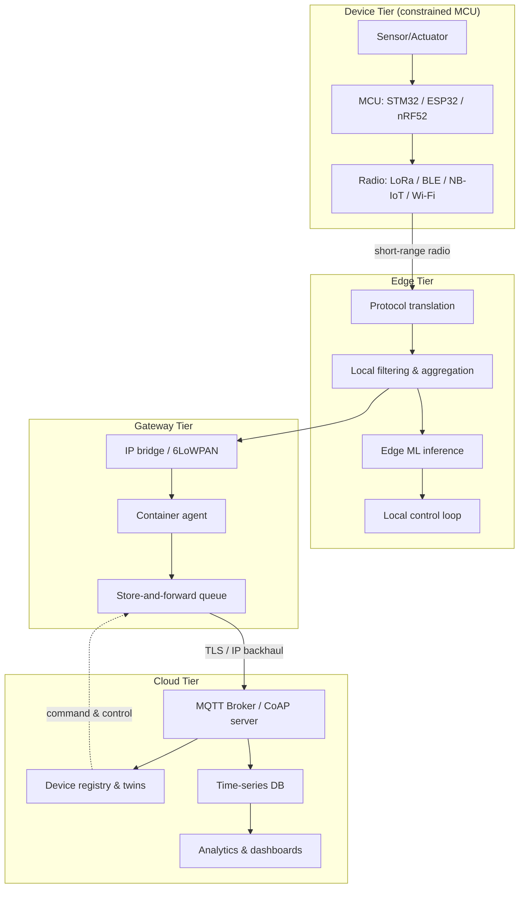
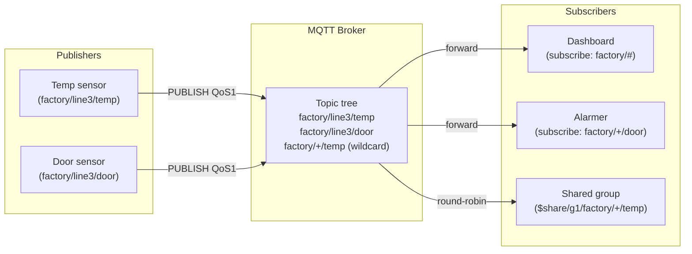
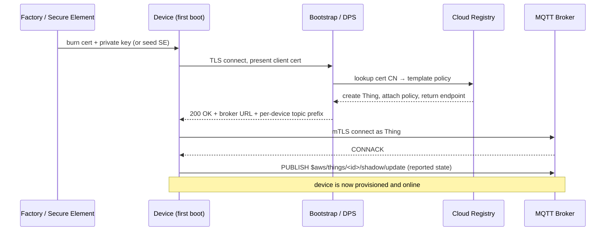
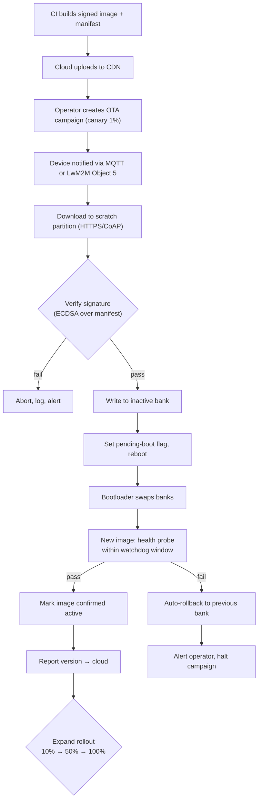

# Internet of Things (IoT)

The **Internet of Things** is the discipline of connecting constrained physical devices—sensors, actuators, wearables, industrial controllers—to back-end services so they can publish telemetry, receive commands, and be managed at scale. Unlike a traditional web client, an IoT device is typically resource-poor (kilobytes of RAM, intermittent radio link, battery powered), deployed in the field for years, and numbered in the millions per deployment. These constraints shape every layer of the stack: from choice of radio (long range vs. low power) to choice of application protocol (publish/subscribe vs. request/response) to choice of identity model (per-device X.509 certificates vs. shared keys).

This page covers the full IoT engineering surface: the reference architecture, the protocol stack (MQTT, CoAP, LwM2M, 6LoWPAN), the major radio technologies (LoRaWAN, NB-IoT, Zigbee, BLE Mesh), device management, OTA firmware updates, edge computing, digital twins, and security. It builds on `./peripherals.md` (sensor I/O, SPI/I2C/UART) and `./firmware.md` (boot flow, memory layout) and crosses into `../networks/`, `../security/`, and `../cloud/`.

## IoT Reference Architecture

Most production IoT systems are organised into four tiers. The **device tier** is the physical thing: an MCU with one or more sensors and a radio (e.g., an ESP32 reading temperature and publishing over Wi-Fi, or an STM32 + LoRa modem counting vehicle passages). The **edge tier** performs local processing close to the device—protocol translation, aggregation, filtering, local control loops, and increasingly ML inference. The **gateway tier** (sometimes folded into edge) bridges short-range device radios to the IP backbone and may run a containerised agent. The **cloud tier** hosts the message broker, device registry, time-series store, analytics, and dashboards.

The boundary between tiers is fluid: a single board can be both device and gateway (e.g., a Raspberry Pi running Mosquitto and a Node-RED flow). The important architectural principle is **locality**: latency-critical and safety-critical decisions belong at the edge; aggregation, analytics, and fleet-wide policies belong in the cloud. This split reduces backhaul bandwidth, survives connectivity outages, and limits blast radius when a single device misbehaves.

The industry often classifies devices into constraint tiers per **RFC 7228**: **Class 0** (≤10 KB RAM, ≤100 KB Flash—typical 8-bit MCUs, must use CoAP and 6LoWPAN, no TLS), **Class 1** (~10 KB RAM, ~100 KB Flash—runs CoAP/DTLS or a minimal MQTT client, e.g., Cortex-M0+), and **Class 2** (~50 KB RAM, ~250 KB Flash—runs full TLS, MQTT 5, embedded HTTP, e.g., Cortex-M4). Above Class 2 sit **Linux-class** devices (Cortex-A, ESP32 with full TCP/IP, Raspberry Pi) where the constraints flip from "what protocol fits" to "what is operationally cheapest to operate." Knowing your device class up front fixes most of your protocol decisions; it is the first question a senior IoT engineer asks in a design review.



## IoT Protocol Stack

The IoT stack mirrors the OSI model but is tuned for constrained links. At the **physical layer** the choice is dominated by trade-offs between range, data rate, and power: LoRa, NB-IoT, Zigbee (IEEE 802.15.4), BLE, and Wi-Fi each occupy a different niche. The **network/adaptation layer** is dominated by **6LoWPAN** (RFC 6282), which compresses IPv6 headers so they fit inside 802.15.4 frames (127-byte MTU). Above that sits either plain IPv6/UDP/TCP or, increasingly, a **transport** tuned for the link: MQTT over TCP/TLS for cloud messaging, CoAP over UDP for resource-constrained REST, or HTTP for richer devices. The **application layer** is where LwM2M, JSON-LD, SenML (RFC 8428), and vendor-specific schemas live.

The key insight is that **TCP is often wrong for IoT**. TCP's handshake, head-of-line blocking, and assumption of a stable path cost battery and airtime on lossy radios. CoAP was designed explicitly to bring RESTful semantics to UDP with optional reliability (Confirmable messages). MQTT uses TCP but compensates with persistent sessions, small fixed header (2 bytes), and QoS levels that give developers control over delivery guarantees.

## MQTT Deep Dive

**MQTT** (Message Queuing Telemetry Transport) is the de facto IoT messaging protocol, standardised by OASIS as MQTT 5.0 (the v3.1.1 spec is still the most widely deployed). It is a publish/subscribe protocol over TCP/TLS: clients connect to a **broker**, publish messages to **topics** (hierarchical UTF-8 strings like `factory/line3/sensor/temperature`), and subscribe with topic filters that may contain `+` (single-level) and `#` (multi-level) wildcards. The broker routes each published message to all matching subscribers, decoupling producers from consumers spatially, temporally, and by reference.

MQTT defines three Quality-of-Service levels. **QoS 0** is fire-and-forget (at most once). **QoS 1** guarantees at-least-once delivery via PUBACK; duplicates may arrive. **QoS 2** guarantees exactly-once via a four-step PUBREC/PUBREL/PUBCOMP handshake—safe but expensive on constrained links. MQTT 5 added features critical for production: **Shared Subscriptions** (load balancing across subscriber fleets via `$share/group/topic`), **Topic Aliases** (replace long topic strings with a numeric id to save bytes), **User Properties** (arbitrary key-value headers, HTTP-style), **Reason Codes** on every ACK, **Session Expiry** and **Message Expiry** intervals, and **Request/Response** semantics (correlation data + response topic). Brokers like Mosquitto, EMQX, HiveMQ, AWS IoT Core, and Azure IoT Hub all speak MQTT; AWS and Azure additionally impose per-device throttling and topic-ACL policies keyed off the client certificate CN.



## MQTT Session and Reliability Features

Beyond QoS, MQTT defines a set of session primitives that make it robust on lossy links. The **CONNECT** packet carries a `Keep Alive` interval (seconds): the client must send any packet within that window or send a PINGREQ; the broker closes the connection after 1.5× keep-alive of silence. This detects half-open TCP connections (e.g., a device that lost power without sending FIN) faster than TCP keepalive, which can take hours. The **Last Will and Testament (LWT)** is a pre-registered PUBLISH that the broker emits automatically when the client disconnects ungracefully—ideal for a `status` topic that flips to `offline` when a device drops. MQTT 5 lets the will be retained, delayed, and queued with a `Will Delay Interval`, and added `Server Keep Alive` so the broker can cap a client's requested value.

**Persistent sessions** (`Clean Session = false` in v3.1.1, `Clean Start = false` plus `Session Expiry Interval` in v5) let the broker retain subscriptions and queued QoS ≥ 1 messages while a device is offline. A battery-powered sensor that wakes every hour to publish and then sleeps still benefits from QoS 1 because the broker re-delivers unacked messages on reconnect. **Topic Aliases** save bytes on every PUBLISH: the client sends the full topic once and thereafter refers to it by a 1-byte id. **Subscription Identifiers** let a single subscriber correlate a delivered message with the subscription that matched it—essential when one handler backs many filters. **Request/Response** formalises the RPC pattern: a publisher sets a `Response Topic` and `Correlation Data` in the PUBLISH; the responder publishes the reply to that topic echoing the correlation data. These features together make MQTT 5 roughly as expressive as AMQP 1.0 while remaining implementable on a 32 KB MCU.

## CoAP and LwM2M

**CoAP** (Constrained Application Protocol, RFC 7252) is the IETF's RESTful protocol for constrained nodes. It runs over UDP and mirrors HTTP semantics with method codes (GET/POST/PUT/DELETE), response codes, and URI paths, but uses a compact binary header (4 bytes) and **Confirmable (CON)**, **Non-confirmable (NON)**, **Acknowledgement**, and **Reset** message types. Reliability is achieved with a simple stop-and-wait retransmission keyed on a 16-bit Message ID and deduplication via a Token field. CoAP supports **resource discovery** via `/.well-known/core` (RFC 6690), **blockwise transfer** (RFC 7959) for payloads larger than a datagram, and **observe** (RFC 7641) for server-push subscriptions—the foundation of asynchronous telemetry. DTLS (RFC 7925) provides the security layer; OSCORE (RFC 8613) is the modern end-to-end-secure alternative that runs over group communication.

**LwM2M** (Lightweight Machine-to-Machine), maintained by the Open Mobile Alliance, is an application-layer device-management protocol built on top of CoAP. It defines an **Object Model**—a tree of Objects (e.g., `Security`, `Server`, `Device`, `Connectivity Monitoring`, `Firmware Update`), each with one or more Resources, each Resource addressable by a URI like `/3/0/0` (Device Object, instance 0, Resource 0 = Manufacturer). A device boots, reads its bootstrap server, registers with the LwM2M server, and then exposes Resources that the server can GET, SET, observe, or execute. LwM2M standardises provisioning, telemetry (SenML encoding), firmware update, connectivity monitoring, and location—covering most of what a fleet operator needs without bespoke application protocols.

## IoT Protocol Comparison

| Property | MQTT 5 | CoAP | HTTP/1.1 |
|----------|--------|------|----------|
| Transport | TCP (typically TLS) | UDP (typically DTLS) | TCP (TLS) |
| Pattern | Pub/Sub | Request/Response (+ Observe) | Request/Response |
| Header size | 2 bytes fixed | 4 bytes fixed | ~200–800 bytes |
| Reliability | QoS 0/1/2 | CON/NON + retransmit | TCP guarantees |
| Directionality | Asymmetric (broker-mediated) | Symmetric, client/server | Symmetric, client/server |
| Discovery | Broker-side wildcards | `/.well-known/core` | None (URLs hard-coded) |
| Power profile | Keep-alive connection | Sleep-friendly (UDP, no keepalive) | Expensive handshake |
| Typical use | Cloud telemetry, fan-out | Constrained REST, LwM2M | Rich devices, webhooks |
| Spec | OASIS MQTT 5.0 | RFC 7252, 7641, 7959 | RFC 7230–7235 |

## Radio Technologies

The radio is the single biggest determinant of an IoT deployment's range, battery life, and cost. There is no "best" radio—each technology occupies a niche defined by range vs. data rate vs. power vs. spectrum cost.

**LoRaWAN** (LoRa Alliance) is a star-of-stars LPWAN: end-devices talk LoRa (chirp spread spectrum) to gateways, which forward raw frames to a network server over IP. LoRaWAN trades very low data rate (0.3–50 kbps) for kilometres of range (2–15 km) and 5–10 year battery life. Classes A (battery, downlink only after uplink), B (scheduled beacons), and C (always-on downlink) tune the power/bandwidth trade-off. Devices are activated either by ABP (Activation By Personalisation—keys burned in) or OTAA (Over-The-Air Activation—JoinEUI/DevEUI/AppKey, join procedure derives session keys).

**NB-IoT** is the 3GPP cellular LPWAN, operating in licensed LTE bands with ~200 kHz bandwidth. It offers deep indoor penetration (20 dB better than GSM), ~150 kbps uplink, and is operator-billed per device. **LTE-M** (Cat-M1) is the higher-throughput sibling (~1 Mbps) that supports voice and mobility. **Zigbee** builds a mesh on IEEE 802.15.4 at 2.4 GHz—short range (10–100 m), low power, mesh self-healing, dominated by smart-home use cases; Thread/Matter is the IP-native evolution. **BLE Mesh** extends Bluetooth LE into a managed flooding mesh, ideal for lighting and beacons. **Wi-Fi HaLow** (802.11ah, sub-1 GHz) and **Wi-Fi 6** address higher-throughput IoT. **6LoWPAN** is the adaptation layer that lets IPv6 run over 802.15.4 and BLE, unifying the address space.

| Technology | Spectrum | Range | Data rate | Power | Topology | Typical use |
|------------|----------|-------|-----------|-------|----------|-------------|
| LoRaWAN | Sub-GHz ISM | 2–15 km | 0.3–50 kbps | Very low (10-yr battery) | Star-of-stars | Smart metering, agriculture |
| NB-IoT | Licensed LTE | 1–10 km | ~150 kbps | Low (10-yr battery) | Cellular star | Smart metering, asset tracking |
| Zigbee | 2.4 GHz | 10–100 m | 250 kbps | Low (months-years) | Mesh | Smart home, lighting |
| BLE Mesh | 2.4 GHz | 10–50 m (per hop) | 1–2 Mbps PHY | Low | Flooding mesh | Beacons, lighting |
| Wi-Fi 6/HaLow | 2.4/5 GHz, sub-1 GHz | 30–100 m | 1 Mbps–9.6 Gbps | High | Star / mesh | Cameras, gateways |

## Gateways and Protocol Translation

Field devices rarely speak IP natively. Industrial PLCs expose **Modbus TCP/RTU** (a register-based master/slave protocol), **OPC UA** (an object-oriented, vendor-neutral protocol with built-in security), **BACnet** (building automation), **EtherNet/IP**, and **PROFINET**. A **protocol gateway** terminates these on one side and re-publishes as MQTT/CoAP on the other, mapping a Modbus register at address `40001` to a topic like `plc1/holding/40001`. Open-source stacks like **Node-RED**, **Eclipse Kura**, and **Mainflux** do this declaratively; commercial offerings (AWS IoT SiteWise, Azure IoT OPC UA Publisher, Kepware) add discovery, schema inference, and buffered store-and-forward when the backhaul is down.

A gateway is also the natural **security boundary**. Devices on the plant floor run on a flat unauthenticated Modbus network; the gateway terminates that, presents a single mTLS-authenticated MQTT connection upstream, and enforces a publish allow-list so a rogue PLC cannot exfiltrate arbitrary topics. For deployments where the gateway is itself a Linux box (Raspberry Pi, industrial gateway like Advantech UNO), the **akri** project exposes devices to Kubernetes as native resources, and **Eclipse ioFog** or **AWS IoT Greengrass** run containerised connectors with centralised policy push. The gateway thus collapses three roles—protocol translation, security boundary, and edge compute host—into one tier.

## Power Management for Battery IoT Devices

Battery life is the single most visible operational metric for a deployed IoT device—changing 100k coin cells is a multi-million-dollar field operation. The dominant strategy is **duty cycling**: the device sleeps at microamp current for the vast majority of its life (often >99.99%), wakes on a timer or GPIO interrupt, samples, transmits, and returns to sleep within tens of milliseconds. Every microsecond awake costs energy proportional to (active current × voltage × time), and on most LPWAN radios the radio's TX current (10–120 mA) dwarfs the MCU's active current (5–15 mA), which in turn dwarfs the sleep current (1–5 µA). Optimisation therefore targets the radio first: shorten the TX window by using higher data rate or shorter payloads, then the MCU, then leakage.

Concrete techniques: (1) **RTC-driven wake** with the main oscillator and most peripherals gated—on STM32, Standby mode at ~1 µA plus an LSE-driven RTC is the baseline; (2) **batched publish** so one TX window covers N samples; (3) **adaptive data rate** (ADR) in LoRaWAN, which trades spreading factor for airtime under good link budgets; (4) **store-and-forward** so a missed ACK does not force an immediate retransmit; (5) **disable brown-out reset** during sleep if the supply is stable; (6) **careful GPIO state**—floating inputs and LEDs left on can dominate the budget. NB-IoT's PSM (Power Saving Mode) and eDRX (extended Discontinuous Reception) are the cellular analogues, letting a device sleep for hours between network paging windows. Estimating battery life requires integrating the current profile over a representative duty cycle and derating for self-discharge, temperature, and capacity at the actual discharge rate. See `./peripherals.md` for the peripheral-level sleep configuration and `./rtos.md` for tickless idle.

## Device Management and Identity

**Device provisioning** is the process by which a physical device gains a cryptographic identity and is enrolled in the cloud registry. Two patterns dominate. **Per-device credentials** (X.509 certificate or unique secret) are flashed at manufacture or via a commissioning app; the device presents them on first connection and is enrolled. **Trusted execution environment (TEE) attestation** (e.g., ARM TrustZone, TPM, secure elements like Microchip ATECC608) signs a challenge proving the device is genuine hardware before it is granted credentials. AWS IoT Core uses **Just-In-Time Registration (JITR)** / **Fleet Provisioning** to mint a thing shadow and policy automatically when an unknown cert is first presented.

**Device identity** must be **per-device** (never shared across fleet), **rotatable**, and **revocable**. X.509 client certificates with ECC keys (secp256r1) are preferred over RSA for size and CPU. Azure IoT Hub calls identities **Devices** (single connection) and **Modules** (sub-identities); AWS calls them **Things**. MQTT client IDs must equal the registered device id on both clouds—duplicate connections are kicked. **Fleet management** adds metadata (location, firmware version, model), grouping (tags, device twins), and policies (topic ACLs, throttling) on top of identity.

The provisioning flow itself follows a predictable sequence: manufacture burns a unique credential (or seeds a key into a secure element), the device boots, contacts a bootstrap endpoint, presents its credential, and the cloud enrols it and returns a per-device policy. AWS calls this **Fleet Provisioning by claim**; Azure calls it **Device Provisioning Service (DPS)** with enrolment groups; LwM2M models it as the **Bootstrap Interface**. The diagram below shows the JITR-style flow.



## OTA Firmware Updates

Over-the-air firmware update is the most operationally dangerous IoT capability—a botched update can brick a million devices overnight. Safe OTA requires: **dual-bank flash** with an atomic swap so the previous image survives a failed boot; **image verification** via cryptographic signature (ECDSA/Ed25519 over a manifest) before the bootloader will run it; **staged rollout** (canary a small cohort, watch crash-rate metrics, then ramp); and **automatic rollback** if the new image fails to mark itself healthy within a watchdog window. The MCUWatchdog or a hardware watchdog timer must be active throughout—boot loops kill devices.

The OTA pipeline typically runs: build system produces signed binary + manifest → cloud uploads to a CDN → device is notified via LwM2M `Firmware Update` Object (Object 5) or an MQTT command → device downloads over HTTPS/CoAP to a scratch partition → verifies signature → swaps banks → reboots → new image runs a health probe → marks itself active or rolls back. AWS IoT Jobs, Azure IoT Device Update, and Mender.io all implement this lifecycle with campaign management and pause/resume controls.



## Edge Computing and Edge ML

**Edge computing** pushes computation toward the device: pre-aggregation, filtering, local control, and increasingly inference. The motivations are latency (sub-10 ms control loops cannot tolerate cloud round trips), bandwidth (a 1 kHz vibration sensor cannot stream raw samples), autonomy (a plant must run during network partitions), and cost (cloud compute is metered). Edge runtimes include **AWS IoT Greengrass**, **Azure IoT Edge**, **Akri** (Kubernetes-native device binding), and **Eclipse ioFog**. These run containerised functions, bridge local protocols (Modbus, OPC-UA, BACnet) to MQTT, and synchronise state with the cloud.

**Edge ML** runs inference on the gateway or the device itself. Frameworks like **TensorFlow Lite Micro**, **PyTorch Mobile**, **ONNX Runtime**, and Apache TVM compile models down to CMSIS-NN kernels that exploit Cortex-M DSP/Helium instructions. Quantisation to int8 and pruning shrink models from megabytes to kilobytes, fitting in on-chip flash. The payoff: keyword spotting, anomaly detection, and predictive maintenance run continuously on-device, sending only event summaries upstream. See `../ml/advanced/edge.md` for the modelling side and `../ml/advanced/compression.md` for quantisation techniques.

## Time-Series Storage

IoT telemetry is overwhelmingly **time-series data**: each record is a `(device_id, timestamp, metric, value, tags)` tuple, appended immutably and queried by time range. General-purpose relational stores (PostgreSQL) can hold this with partitioning, but dedicated time-series databases (TSDBs) are an order of magnitude more efficient because they compress repeated tags with run-length or gorilla encoding, store values in columnar blocks, and support downsampled rollups on ingest. **InfluxDB** (Flux/InfluxQL), **TimescaleDB** (Postgres extension with hypertables), **AWS Timestream** (serverless, auto-scaling), **Prometheus** (pull-based, optimised for metrics not raw events), and **Apache IoTDB** (industrial focus) are common picks. Object stores (S3, ADLS) play the cold-tier role via formats like **Parquet** or **Apache Arrow** queried by **Trino** or **Athena**.

Design choices that matter at IoT scale: (1) **cardinality control**—every unique `(device_id, label)` combination is a series; millions of high-cardinality labels will OOM a TSDB, so prefer wide metrics with stable label sets; (2) **retention policies**—keep raw data for 7–30 days, downsample to 1-minute rollups for 1 year, and 1-hour rollups indefinitely; (3) **late-arriving data**—devices reconnecting after hours must be able to back-fill with original timestamps; the TSDB must accept out-of-order writes within a window; (4) **partitioning** by `device_id` hash for query parallelism and by time for retention truncation. See `../dbms/types-of-databases.md` and `../dbms/internals/engines.md` for the storage-engine primitives.

## Digital Twins and Data Pipelines

A **digital twin** is a cloud-side representation of a physical device's state—last-known sensor values, configuration, firmware version, and connection status. Twins decouple application logic from the device's intermittent connectivity: services read/write the twin, and the cloud synchronises deltas to the device when it next connects. AWS calls this the **Device Shadow** (named/unnamed), Azure IoT Hub calls it the **Device Twin** (reported/desired properties + tags), and LwM2M models it as observed Resources. Conflict resolution is last-writer-wins per property, with version numbers to detect stale writes.

The typical IoT **data pipeline** is: device publishes telemetry → broker authenticates and routes → a stream processor (Kafka, Kinesis, Azure Stream Analytics, Apache Flink) ingests → a time-series database (InfluxDB, TimescaleDB, AWS Timestream, Prometheus for metrics) stores → dashboards (Grafana, Power BI) visualise → rules engine fires alerts/commands back to devices. SenML (RFC 8428) is the compact standard encoding for telemetry records; CBOR and Protobuf win over JSON at scale. See `../cloud/aws/kinesis.md` for stream ingestion and `../interview/system-design/real-world/streaming-pipeline.md` for pipeline design patterns.

## IoT Security

IoT security is hard because devices are physically accessible, often offline, and rarely patched. The foundations are: **mutual TLS** (device presents X.509 cert, broker presents cert, both verified); **per-device credentials** stored in a secure element or TEE; **signed firmware** so only vendor images boot; **encrypted storage** for keys at rest; **least-privilege topic ACLs** so a compromised sensor cannot read another tenant's data; and **network segmentation** so a breached device cannot pivot to the corporate LAN. Rotation of credentials and certificates is operational hygiene—plan for it from day one, not after a breach.

Common threats and their mitigations are summarised below. Note that several threats (firmware extraction, side-channel) are physical and cannot be solved in software alone—secure boot ROM, eFuse key burning, and tamper-evident enclosures all play a role. See `../security/README.md` and `../security/cryptography.md` for the cryptographic primitives, and `../security/supply-chain-security.md` for SBOM and signing infrastructure.

| Threat | Attack vector | Mitigation layer |
|--------|---------------|------------------|
| Device cloning | Attacker reads keys from flash | Secure element / TEE; per-device keys |
| MITM on radio | Sniff/inject LoRa/BLE frames | LoRaWAN session keys; BLE pairing (LE Secure Connections) |
| Rogue broker | Device connects to attacker | Mutual TLS, cert pinning, DNSSEC |
| Firmware tamper | Attacker flashes malicious image | Secure boot, signed image, rollback protection |
| Compromised credential | Cert leaked / cracked | Short-lived certs, automated rotation, revocation (OCSP/CRL) |
| Topic-level lateral movement | Compromised device reads neighbours | Per-device topic ACLs; tenant isolation in broker |
| Replay attack | Resend old publish | TLS sequence numbers; CoAP token + nonce; MQTT 5 message expiry |
| Physical extraction | JTAG / SWD readout | Lock debug interface via eFuse; brown-out detection |

## Telemetry Encoding and Best Practices

Telemetry is the highest-volume data path in an IoT system—every byte matters across the radio, the broker, and the storage layer. The three dominant encodings are **JSON** (human-readable, ubiquitous, but ~5x larger than necessary), **CBOR** (RFC 8949, binary JSON with self-describing tags, ~30% smaller than JSON), and **Protobuf** (smallest with a schema, requires `.proto` compilation on both ends). **SenML** (RFC 8428) layers a standardised structured record on top of CBOR or JSON: each reading is a `[{n:"/temp", v:23.4, t:1234567890, u:"Cel"}]` entry with name, value, time, and unit. Brokers and databases can parse SenML without knowing your application schema.

Operational best practices reduce outages and operational cost over years: (1) **time-synchronise devices** with NTP or SNTP (LwM2M Object 13) so timestamps are trustworthy—clock skew of even minutes breaks downstream joins; (2) **batch small readings** into a single publish every minute rather than one per second to amortise protocol overhead; (3) **use retained messages** for last-known state so newly subscribed services do not need a back-end call; (4) **define topic conventions up front** (`<tenant>/<site>/<device>/<channel>`) and enforce them via broker ACLs—renaming a fleet topic is a multi-month migration; (5) **idempotent commands**: devices may receive a command twice under QoS 1, so encode an idempotency key; (6) **telemetry back-pressure**: when a device is offline, queue locally (LwM2M Object 19, or an on-device SQLite ring buffer) and back-fill on reconnect with original timestamps so the time-series store sees no gaps.

```python
# Minimal MQTT 5 publisher using paho-mqtt
import json, ssl, time, uuid
from paho.mqtt.client import Client, CallbackAPIVersion

device_id = f"sensor-{uuid.uuid4().hex[:8]}"
client = Client(callback_api_version=CallbackAPIVersion.VERSION2,
                client_id=device_id, protocol=5)
client.tls_set(ca_certs="root-ca.pem",
               certfile="device.crt", keyfile="device.key",
               tls_version=ssl.PROTOCOL_TLSv1_2)
client.connect("broker.example.com", 8883, keepalive=60)

topic = f"plantA/line3/{device_id}/temp"
while True:
    reading = {"v": read_sensor(), "t": int(time.time()), "u": "Cel"}
    client.publish(topic, payload=json.dumps(reading), qos=1,
                   retain=False, properties=None)
    time.sleep(60)  # batch interval
```

The same flow in C on an STM32 would use the **Eclipse Paho MQTT-C** library or the **AWS IoT Device SDK Embedded C**, persisting session state in flash so QoS 1 PUBACKs survive a reboot. The Python example above is intentionally stateless for clarity; production code adds reconnect backoff, will messages, and a local queue for offline periods.

## Common Pipeline Pattern

The canonical IoT data path—**sensor → gateway → broker → database → analytics**—appears in almost every deployment because it cleanly separates concerns. The sensor captures a physical quantity (ADC sample, modbus register, BLE advertisement). The gateway (which may be the device itself if it has an IP stack) translates the native protocol into MQTT/CoAP, adds identity, and forwards over TLS. The broker terminates TLS, authenticates the device certificate, enforces topic ACLs, and routes messages to subscribers. A stream processor (Kafka Connect, Kinesis, Azure Stream Analytics) subscribes to the broker, validates the schema, deserialises SenML/CBOR, and writes to a time-series database and an object store (S3/ADLS) for cold storage. Analytics services query the database; rules engines evaluate thresholds and publish commands back through the broker to devices.

Each hop in this pipeline is a place to add resilience: store-and-forward queues at the gateway survive connectivity drops; broker clustering and shared subscriptions provide horizontal scale; Kafka partitioning by `device_id` preserves per-device ordering; the time-series database downsamples (rollups) on ingest to bound storage. The same pattern is described from a system-design interview perspective in `../interview/system-design/real-world/streaming-pipeline.md`, and the cloud ingestion primitives are covered in `../cloud/aws/kinesis.md`. The IoT-specific concerns—device identity, topic design, OTA feedback loops—are what distinguish this pipeline from a generic streaming one.

## Common IoT Anti-Patterns

Hard-won lessons worth calling out: **shared credentials across a fleet** mean one compromise bricks your ability to revoke; **unbounded cardinality in topic names** (embedding a per-reading GUID) explodes broker routing tables and TSDB series counts; **synchronous cloud round-trips inside a control loop** guarantee latency-driven oscillation and battery drain; **unsigned firmware with a single-bank flash** guarantees a bricked fleet the first time a brown-out hits mid-write; **broad wildcard subscriptions** like `#` from a backend service turn a single misbehaving device into a back-pressure storm that topples the broker; **cleartext Modbus bridged straight to MQTT** leaks plant floor data to anyone who compromises the gateway. Each of these has been the root cause of a publicly disclosed outage; design them out at the architecture stage, not in incident response.

## Cross-References

- `./peripherals.md` — sensor I/O: SPI, I2C, UART, ADC, DMA, the building blocks of telemetry capture.
- `./firmware.md` — boot flow, memory map, secure boot, the substrate on which OTA and device identity sit.
- `./rtos.md` — FreeRTOS / Zephyr scheduling, queues, and timers used by IoT firmware.
- `../networks/wireless/wifi.md`, `../networks/wireless/bluetooth.md`, `../networks/wireless/5g.md` — physical-layer details for the radios summarised here.
- `../networks/tcp-ip/ipv6.md` — IPv6, the addressing foundation for 6LoWPAN.
- `../security/cryptography.md`, `../security/authentication.md`, `../security/supply-chain-security.md` — TLS, X.509, code signing.
- `../cloud/aws/lambda.md`, `../cloud/aws/kinesis.md` — serverless and stream ingestion on the cloud side.
- `../ml/advanced/edge.md`, `../ml/advanced/compression.md` — edge ML modelling and quantisation.

## Interview Questions

1. **Why is MQTT preferred over HTTP for cloud telemetry from constrained devices?** Cover header size, persistent connection, pub/sub fan-out, QoS levels, and battery/airtime cost.
2. **Compare LoRaWAN and NB-IoT for a smart-metering deployment of 100k devices.** Address range, indoor penetration, mobility, spectrum/licensing cost, operator dependency, and battery life.
3. **Design an OTA update system that is safe to roll out to 1 million battery-powered devices.** Discuss dual-bank flash, signed manifests, canary rollout, watchdog-driven auto-rollback, and how you handle devices that fail to report.
4. **A device's X.509 certificate is about to expire. Walk through rotation without bricking the fleet.** Cover renewal lead time, parallel-credential enrolment, broker policy that accepts both old and new, and revocation of the old cert.
5. **Explain CoAP's Confirmable/Non-confirmable messages and how Observe replaces polling.** Compare with MQTT QoS and discuss when each is appropriate.
6. **What is a digital twin, and how does it let a cloud service control a device that is offline 95% of the time?** Discuss reported/desired properties, version numbers, conflict resolution, and synchronisation on reconnect.
7. **An attacker compromises one sensor in a 5000-device plant. How do you limit blast radius?** Cover per-device credentials, topic ACLs, tenant isolation, network segmentation, and detection via behavioural analytics.
8. **When would you run ML inference on the device vs. the edge gateway vs. the cloud?** Trade off latency, bandwidth, model size, power, training/feedback loop, and privacy.

## References

- [OASIS MQTT 5.0 Specification](https://docs.oasis-open.org/mqtt/mqtt/v5.0/mqtt-v5.0.html)
- [MQTT v3.1.1 Specification](https://docs.oasis-open.org/mqtt/mqtt/v3.1.1/mqtt-v3.1.1.html)
- [RFC 7252 — Constrained Application Protocol (CoAP)](https://www.rfc-editor.org/rfc/rfc7252)
- [RFC 7641 — CoAP Observe](https://www.rfc-editor.org/rfc/rfc7641)
- [RFC 8428 — SenML](https://www.rfc-editor.org/rfc/rfc8428)
- [RFC 6282 — 6LoWPAN compression](https://www.rfc-editor.org/rfc/rfc6282)
- [Open Mobile Alliance — LwM2M](https://openmobilealliance.org/technical/omna/lwm2m)
- [LoRa Alliance — LoRaWAN Specification](https://lora-alliance.org/resource_hub/lorawan-1-0-4-specification-package/)
- [3GPP — NB-IoT overview](https://www.3gpp.org/technologies/nb-iot)
- [Zigbee Alliance — Specifications](https://csa-iot.org/)
- [Bluetooth Mesh Specification](https://www.bluetooth.com/specifications/specs/mesh-specification/)
- [AWS IoT Core Developer Guide](https://docs.aws.amazon.com/iot/)
- [Azure IoT Hub Documentation](https://learn.microsoft.com/azure/iot-hub/)
- [Eclipse IoT Projects](https://iot.eclipse.org/)
