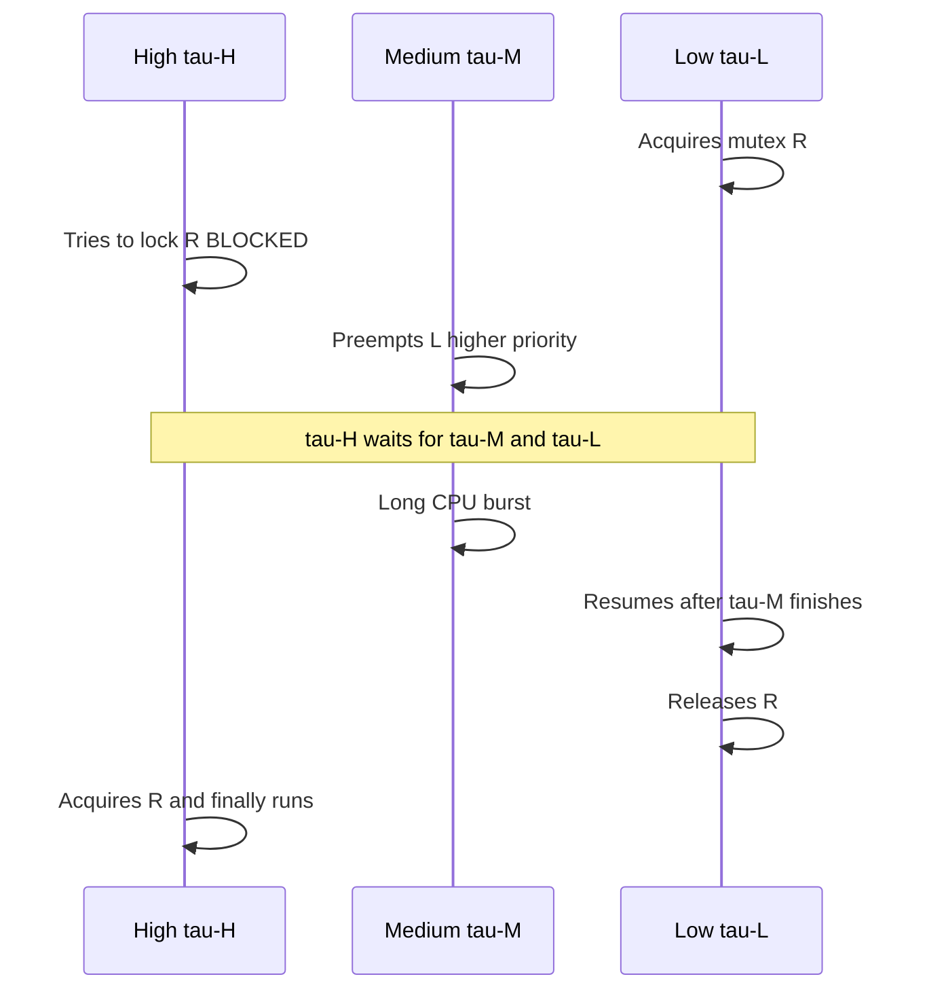
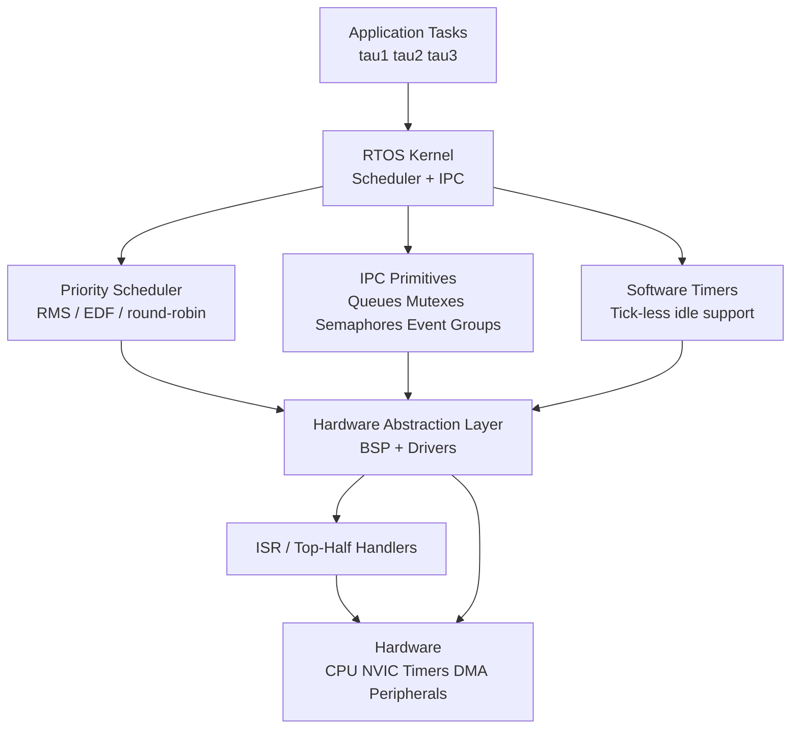

# Real-Time Systems

A **real-time system** is one whose correctness depends not only on producing the right output but on producing it **at the right time**. A late answer is a wrong answer. This page covers the scheduling theory, WCET analysis, synchronization protocols, and operating-system support that make deterministic timing guarantees possible. It complements two sibling pages: [OS-level scheduling theory](../os/scheduling/realtime.md) (RMS/EDF derivation, Linux `SCHED_DEADLINE`) and [RTOS internals](./rtos.md) (FreeRTOS tasks, queues, heaps).

> **Interview one-liner:** "Real-time means predictable, not fast — hard RT proves deadlines via WCET + schedulability analysis, RMS/EDF/DM pick the run order, priority inheritance or ceiling prevents inversion, and an RTOS or `PREEMPT_RT` kernel supplies the bounded-latency substrate."

## Hard, Firm, and Soft Real-Time

Real-time is a spectrum. The defining question is: *what happens if a deadline is missed?*

| Property | Hard Real-Time | Firm Real-Time | Soft Real-Time |
|----------|----------------|----------------|----------------|
| **Deadline miss consequence** | Catastrophic — injury, financial ruin, mission loss | Result useless, discarded; system continues | Degraded QoS, user annoyance |
| **Guarantee type** | Worst-case, formally proven | Worst-case per task, with overrun discard | Statistical (e.g. 99th-percentile latency) |
| **Certification** | DO-178C (avionics), ISO 26262 ASIL-D (auto), IEC 61504 SIL-4 | Domain-specific | None / informal |
| **Typical latency** | µs–ms, hard bound | ms, bounded | ms–s, best-effort |
| **Examples** | Pacemaker, ABS brake, flight control, motor drive safety loop | Robot vision frame drop, stock order with TTL | Video streaming, VoIP, online gaming, UI render |
| **Scheduling** | Static-priority (RMS/DM) + RTA proof | EDF with admission control | CFS / proportional share |
| **Overrun handling** | Forbidden — system fails | Output discarded, deadline reset | Queue grows, latency rises |

**Firm real-time** is the middle ground defined by Kopetz in *Hard Real-Time Computing Systems*: a missed deadline does not destroy the system, but the late result has no value and is dropped. Many industrial control loops and multimedia pipelines are firm rather than hard.

## Task Models

A real-time workload is described by **tasks**, each characterized by parameters:

| Parameter | Symbol | Meaning |
|-----------|--------|---------|
| Period | \\(T_i\\) | Time between successive releases (periodic tasks) |
| Worst-case execution time | \\(C_i\\) | Maximum CPU time the task ever needs |
| Relative deadline | \\(D_i\\) | Max allowable response time after release |
| Utilization | \\(U_i = C_i / T_i\\) | Long-run fraction of CPU the task consumes |
| Phase | \\(\phi_i\\) | Offset of the first release from system start |

Three release patterns exist:

| Model | Release pattern | Minimum inter-arrival | Example |
|-------|-----------------|------------------------|---------|
| **Periodic** | Fixed period \\(T_i\\) | Exactly \\(T_i\\) | 1 kHz servo loop, 100 Hz sensor sample |
| **Sporadic** | Bounded by minimum inter-arrival \\(T_i\\) | At least \\(T_i\\) | Button press (debounced), CAN message arrival |
| **Aperiodic** | Unbounded | None | Network packet, console input |

Sporadic tasks admit the same schedulability analysis as periodic tasks because the minimum inter-arrival time provides a worst-case bound. Aperiodic tasks require a **server** (polling, sporadic, or Constant Bandwidth Server) to receive bounded service without violating periodic guarantees.

## Scheduling Algorithms

### Rate Monotonic Scheduling (RMS)

RMS, introduced by **Liu & Layland (1973)**, assigns **static priorities** inversely proportional to period: the task with the shortest period gets the highest priority. It is **optimal among all fixed-priority algorithms** for the implicit-deadline case (\\(D_i = T_i\\)).

**Liu–Layland utilization bound:** A set of \\(n\\) independent, preemptable, implicit-deadline periodic tasks is schedulable under RMS if

\\[
U = \sum_{i=1}^{n} \frac{C_i}{T_i} \;\le\; n\left(2^{1/n} - 1\right)
\\]

| \\(n\\) | Bound | \\(n\\) | Bound |
|---|--------|---|--------|
| 1 | 1.000 | 5 | 0.744 |
| 2 | 0.828 | 10 | 0.718 |
| 3 | 0.780 | \\(\infty\\) | \\(\ln 2 \approx 0.693\\) |

The 69.3% rule of thumb is a **sufficient but not necessary** test. Many task sets exceeding it are still schedulable; exact analysis uses Response Time Analysis (below).

### Deadline Monotonic Scheduling (DM)

When \\(D_i \le T_i\\) (**constrained deadlines**), RMS is no longer optimal. **Deadline Monotonic** assigns static priorities inversely proportional to the **relative deadline** — shorter deadline, higher priority. DM is the optimal static-priority algorithm for constrained-deadline tasks and reduces to RMS when \\(D_i = T_i\\).

### Earliest Deadline First (EDF)

EDF is a **dynamic-priority** algorithm: at every scheduling point the ready task with the **nearest absolute deadline** runs. It is **optimal among all preemptive uniprocessor schedulers** for implicit-deadline tasks.

**Schedulability test (necessary and sufficient):**

\\[
U = \sum_{i=1}^{n} \frac{C_i}{T_i} \;\le\; 1
\\]

EDF therefore achieves 100% CPU utilization, vs. RMS's ~69.3%. The cost is complexity: deadlines change every release, requiring a priority-ordered ready queue (typically a red-black tree, as in Linux's `SCHED_DEADLINE`).

### EDF with Admission Control (EDF⊕)

Pure EDF collapses under overload: missing one deadline cascades into a **domino effect** where every subsequent job misses too. **EDF⊕** augments EDF with **admission control** and **bandwidth reservation**: each task is assigned a budget \\(Q_i\\) replenished every period \\(P_i\\). When a job exhausts its budget it is suspended until the next replenishment. This gives **temporal isolation** — an overrun in one task cannot starve another.

The Linux `SCHED_DEADLINE` policy implements EDF⊕ using the **Constant Bandwidth Server (CBS)**, which reclaims unused runtime when a job finishes early.

### Least Laxity First (LLF)

LLF assigns priority by **laxity** \\(L_i = D_i - t - C_i^{\text{remaining}}\\). The task with the smallest laxity runs first. LLF is also optimal (matches EDF's utilization bound) but generates **more preemptions** because laxity ties cause thrashing. It is rarely used in production.

### Algorithm Comparison

| Algorithm | Priority type | Optimality | Max utilization \\(U\\) | Overrun behavior | Typical use |
|-----------|---------------|------------|--------------------------|-------------------|-------------|
| **RMS** | Static (1/T) | Optimal static, \\(D=T\\) | \\(n(2^{1/n}-1)\\) ≈ 0.693 | Graceful (lowest priority misses) | Avionics, ARINC 653 |
| **DM** | Static (1/D) | Optimal static, \\(D\le T\\) | (RTA test) | Graceful | ISO 26262 automotive |
| **EDF** | Dynamic (deadline) | Optimal overall | 1.0 | Domino effect under overload | Linux `SCHED_DEADLINE` |
| **EDF⊕ / CBS** | Dynamic + budget | Optimal + isolated | 1.0 | Bounded per-task | Linux RT, multimedia |
| **LLF** | Dynamic (laxity) | Optimal overall | 1.0 | Many preemptions | Mostly academic |

### Scheduling Timeline Example

Three tasks: \\(\tau_1(T{=}4, C{=}1)\\), \\(\tau_2(T{=}6, C{=}2)\\), \\(\tau_3(T{=}8, C{=}2)\\). Utilization \\(U = 0.25 + 0.33 + 0.25 = 0.83\\). Under RMS, priorities are \\(\tau_1 > \tau_2 > \tau_3\\).

```mermaid
gantt
    title RMS Timeline for tau1, tau2, tau3 (hyperperiod = 24)
    dateFormat X
    axisFormat %s

    section tau1 T=4 C=1
    r0   : 0, 1
    r4   : 4, 5
    r8   : 8, 9
    r12  : 12, 13
    r16  : 16, 17
    r20  : 20, 21

    section tau2 T=6 C=2
    r0   : 1, 3
    r6   : 6, 8
    r12  : 13, 15
    r18  : 18, 20

    section tau3 T=8 C=2
    r0   : 3, 5
    r8   : 9, 11
    r16  : 17, 19
```



Every deadline is met: each \\(\tau_i\\) job completes within \\(T_i\\) of its release. Note how \\(\tau_2\\) at \\(t=6\\) preempts nothing (\\(\tau_1\\) finished at \\(t=5\\)) but must wait at \\(t=12\\) for the higher-priority \\(\tau_1\\) release at \\(t=12\\) to complete first.

## Response Time Analysis (RTA)

The Liu–Layland bound is sufficient but pessimistic. **Exact** schedulability for fixed-priority schedulers (RMS, DM) uses iterative RTA. The worst-case response time \\(R_i\\) of task \\(\tau_i\\) satisfies:

\\[
R_i = C_i + \sum_{j \in hp(i)} \left\lceil \frac{R_i}{T_j} \right\rceil C_j
\\]

where \\(hp(i)\\) is the set of tasks with priority higher than \\(\tau_i\\). The equation is solved by fixed-point iteration:

\\[
R_i^{(0)} = C_i, \qquad R_i^{(k+1)} = C_i + \sum_{j \in hp(i)} \left\lceil \frac{R_i^{(k)}}{T_j} \right\rceil C_j
\\]

Iterate until \\(R_i^{(k+1)} = R_i^{(k)}\\) (schedulable) or \\(R_i^{(k+1)} > D_i\\) (deadline miss). The summation term captures **interference** from higher-priority jobs that can preempt \\(\tau_i\\) during its response.

For our example task set, the RTA for \\(\tau_3\\):

- \\(R_3^{(0)} = C_3 = 2\\)
- \\(R_3^{(1)} = 2 + \lceil 2/4 \rceil \cdot 1 + \lceil 2/6 \rceil \cdot 2 = 2 + 1 + 2 = 5\\)
- \\(R_3^{(2)} = 2 + \lceil 5/4 \rceil \cdot 1 + \lceil 5/6 \rceil \cdot 2 = 2 + 2 + 2 = 6\\)
- \\(R_3^{(3)} = 2 + \lceil 6/4 \rceil \cdot 1 + \lceil 6/6 \rceil \cdot 2 = 2 + 2 + 2 = 6\\) ✓

\\(R_3 = 6 \le D_3 = 8\\) — schedulable, even though the Liu–Layland bound is violated.

## WCET Analysis

A schedulability proof is only as trustworthy as its **Worst-Case Execution Time** estimate. Two complementary approaches exist.

| Approach | Mechanism | Pros | Cons |
|----------|-----------|------|------|
| **Static (aiT, Bound-T, OTAWA)** | Abstract interpretation over a cycle-accurate hardware model; safely over-approximates pipeline, cache, branch prediction | Safe upper bound; no measurement needed; certifiable | Requires a hardware timing model; pessimistic on complex cores (OoO, multicore) |
| **Measurement-based (timing analysers, oscilloscopes)** | Run instrumented binary on real hardware, take max over many inputs | Tight on the measured configurations; cheap to apply | Not safe — untested paths may be slower; no formal guarantee |
| **Hybrid (measurement + static residual)** | Measure common paths, statically bound the rest | Balances tightness and safety | Tooling is complex and vendor-specific |

WCET is hard on modern superscalar cores because **cache states** and **branch prediction** make execution time input-dependent. Real-time cores (e.g. ARM Cortex-R52, RISC-V with PMP) ship with **deterministic pipelines** (in-order, locked or software-managed caches) precisely so WCET analysis stays tractable. On a generic Cortex-A with `PREEMPT_RT`, WCET is replaced by a probabilistic bound — which is why safety-critical avionics avoid application-class cores.

## Jitter

**Jitter** is the variation in release time, completion time, or response time of a task across invocations. Even when deadlines are met, jitter matters because:

- **Control systems** — sampling jitter degrades loop stability margin. A PID controller tuned for \\(T = 10\,\text{ms}\\) may become unstable with \\(\pm 2\,\text{ms}\\) jitter.
- **Communication** — output jitter causes buffer underruns in audio/video pipelines.
- **Sensor fusion** — inter-sensor time skew corrupts Kalman filter state.

Sources of jitter: scheduling preemption, interrupt storms, cache pollution, bus contention, DVFS transitions, and SMI firmware traps on x86. Mitigations include **deadline-monotonic priority assignment**, **CPU isolation** (`isolcpus`, `taskset`), **cache coloring**, and **tickless kernels** (`CONFIG_NO_HZ_FULL`).

## Priority Inversion

**Priority inversion** happens when a high-priority task is blocked by a lower-priority task holding a shared resource, and unrelated medium-priority tasks preempt the lower-priority task — extending the high-priority task's wait time unboundedly.



### The Mars Pathfinder Incident (1997)

The textbook case of priority inversion in the wild. Pathfinder's VxWorks system rebooted repeatedly on Mars because:

1. The **bus management task** (high priority) blocked on a mutex held by the **meteorological data task** (low priority).
2. The **communications task** (medium priority) repeatedly preempted the meteorological task.
3. The bus task's watchdog timed out → system reset.
4. **Fix uploaded to Mars:** enable `priority inheritance` on the offending mutex (a VxWorks feature that had been compiled out for performance). The bug disappeared.

The lesson is not "VxWorks is buggy" — it's that **priority inversion is silent until you ship**, and the protection protocol must be enabled by default on every shared-resource mutex.

### Solutions

| Protocol | Mechanism | Prevents inversion | Prevents deadlock | Overhead |
|----------|-----------|--------------------|-------------------|----------|
| **Priority Inheritance (PIP)** | Holder inherits the highest priority of any task blocked on the mutex | Yes (reactive) | No | Low |
| **Immediate Priority Ceiling (IPCP)** | Mutex has a pre-computed ceiling priority; holder runs at ceiling from acquisition | Yes (proactive) | Yes | Medium |
| **Original Priority Ceiling (OPCP)** | A task may lock only if its priority is higher than the ceiling of all currently held locks | Yes | Yes | Higher |

PIP is the default in POSIX (`PTHREAD_PRIO_INHERIT`), VxWorks, and FreeRTOS mutexes. PCP/IPCP is required by **ARINC 653** and used in RTEMS, QNX, and automotive RTEs because it also bounds blocking to **one critical section per task** — essential for clean RTA proofs.

## Interrupt Latency

**Interrupt latency** is the time between a hardware interrupt being asserted and the first instruction of its ISR executing. For hard real-time, this is a fundamental floor on response time.

Components of interrupt latency:

| Component | Source | Mitigation |
|-----------|--------|------------|
| **Hardware propagation** | NVIC, interrupt controller, synchronizers | Use fast GPIOs; pick cores with low-latency NVIC (Cortex-M: 12 cycles) |
| **Critical sections** | Disabled interrupts (`cpsid i` / `cli`) | Keep critical sections < few µs; use split locks |
| **Higher-priority ISRs** | Nested interrupts | Bound ISR priorities and lengths; defer to threads |
| **Cache misses** | First-touch cold lines | Lock critical ISR code/data into cache (`mlock`, cache-locking) |
| **SMI / firmware traps** | x86 BIOS, BMC | Avoid x86 for hard RT; use cores with no SMM |

Cortex-M's NVIC guarantees **12-cycle** entry latency. Cortex-A with `PREEMPT_RT` typically achieves **10–100 µs** worst-case; bare-metal or RTOS on Cortex-M/R hits **sub-µs**.

**Threaded interrupts** (Linux `request_threaded_irq`, FreeRTOS deferred ISRs) split work: a thin top-half ISR masks the device and wakes a kernel thread that runs the bulk of the handler at schedulable priority. This converts unpredictable ISR work into a schedulable task.

## RTOS Architecture

A real-time operating system is a small kernel that provides deterministic scheduling, predictable synchronization primitives, and bounded system-call latency. The architectural skeleton is essentially universal across FreeRTOS, VxWorks, QNX, and Zephyr.



### RTOS Comparison

| RTOS | License | Kernel model | Scheduling | Certifiable | Typical use | Latency |
|------|---------|--------------|------------|-------------|-------------|---------|
| **FreeRTOS** | MIT | Monolithic, tiny (~6 KB) | Fixed-priority preemptive + round-robin; priority inheritance on mutexes | DO-178C via AWS Qualified distribution | IoT, consumer, automotive MCUs | µs |
| **VxWorks** | Proprietary (Wind River) | Monolithic, modular | Fixed-priority preemptive; RMS/DM; priority inheritance + ceiling | DO-178C Level A, ISO 26262, IEC 61508 | Aerospace, defense, industrial control | µs |
| **QNX Neutrino** | Proprietary (BlackBerry) | **Microkernel** | Adaptive partitioning + fixed priority; priority inheritance + ceiling | DO-178C, ISO 26262 ASIL-D | Automotive ADAS, medical, infotainment | µs |
| **Zephyr** | Apache 2.0 (Linux Foundation) | Monolithic, scalable (32 B → MB) | Preemptive / cooperative / EDF (pluggable); priority inheritance | Targeted at safety profiles | IoT, wearables, embedded Linux sibling | µs |

**QNX's microkernel design** is distinctive: device drivers, file systems, and networking live in user-space processes with their own address spaces. A driver crash does not bring down the kernel — the process monitor restarts it. This makes QNX uniquely fault-tolerant for ADAS and medical devices.

**Zephyr** offers a **pluggable scheduler**: a project can select fixed-priority, EDF, or cooperative scheduling at config time. It also provides a native **cooperative-only** mode for sub-kilobyte memory footprints.

## Real-Time Linux

General-purpose Linux is **soft real-time** at best — throughput-oriented CFS, unbounded critical sections, page faults, SMI firmware traps. Two routes give Linux hard-ish real-time behavior.

| Approach | Mechanism | Worst-case latency | Pros | Cons |
|---------|-----------|---------------------|------|------|
| **PREEMPT_RT** | In-kernel patch: makes nearly all critical sections preemptible, turns IRQs into kernel threads, replaces spinlocks with RT-mutexes | ~10–100 µs | Stock kernel feel; full POSIX/GNU ecosystem; mainline-merged since 6.12 | Still vulnerable to SMI/BIOS; not certifiable to DO-178C |
| **Xenomai (Cobalt)** | Dual-kernel: a small RT cobalt core runs RT tasks; Linux runs as the low-priority idle task | ~1–10 µs | Lower latency than PREEMPT_RT; RT threads are immune to Linux stalls | Non-POSIX RT API (POSIX skin exists); more complex driver story |
| **RT-Linux (legacy)** | Fine-grained interrupt emulation; RT core intercepts IRQs | ~5–30 µs | Historical importance | Largely superseded by PREEMPT_RT / Xenomai |

```bash
# Verify PREEMPT_RT is active
uname -v   # ... SMP PREEMPT_RT Debian 6.1.x ...

# Measure worst-case scheduling latency
sudo cyclictest -t1 -p80 -i1000 -l100000 --mlockall

# Pin a RT task to an isolated CPU and assign SCHED_FIFO priority 80
sudo taskset -c 3 chrt -f 80 ./my_rt_task

# Isolate CPUs 2-3 from scheduler / RCU / workqueues at boot
# Append to kernel cmdline: isolcpus=2,3 nohz_full=2,3 rcu_nocbs=2,3
```

A common hard-real-time Linux recipe is: `PREEMPT_RT` kernel + `isolcpus` + `nohz_full` + `mlockall` + `chrt -f` + a dedicated CPU + disabled SMI (where the BIOS allows it). This gets you to ~50 µs worst-case on x86 — adequate for industrial motion control, not for engine safety loops (which use AUTOSAR Classic / OSEK on a Cortex-R).

## CPU Reservations and Temporal Isolation

A **CPU reservation** is a contract: a task is admitted to the system only if its declared \\((C_i, T_i, D_i)\\) tuple can be honoured, and once admitted it is guaranteed that budget **regardless of what other tasks do**. This is **temporal isolation**: a buggy or overloaded task cannot starve its neighbours.

Mechanisms:

- **CBS / SCHED_DEADLINE** — each task gets a runtime \\(Q_i\\) replenished every period \\(P_i\\). Overrun suspends the task until the next replenishment. Admission control rejects a new task if \\(\sum Q_i / P_i > 1\\).
- **ARINC 653 partitions** — time-triggered cyclic schedule where each partition gets a fixed window; tasks within a partition are RMS-scheduled. Hard isolation between partitions (avionics).
- **Resource kernels / RRES** — reservation objects exposed as first-class kernel resources; a task attaches to a reservation to receive its budget.
- **Hierarchical scheduling** — a container/cgroup gets a reservation, and an inner scheduler distributes it. Used in Linux cgroups v2 with the `cpu.idle` / `cpu.max` controllers (soft).

Temporal isolation is what lets a mixed-criticality system run a flight-control loop next to a logging daemon on the same silicon. Without it, a logging burst could miss a control deadline — and the failure would be impossible to reproduce in unit test.

## References

- Jane W. S. Liu, *Real-Time Systems* (Prentice Hall, 2000) — the standard graduate text on real-time scheduling theory and response-time analysis.
- Hermann Kopetz, *Hard Real-Time Computing Systems: Predictable Scheduling Algorithms and Applications* (Springer, 3rd ed., 2011) — firm/soft real-time distinction, time-triggered architectures, TTA.
- C. L. Liu and James W. Layland, "Scheduling Algorithms for Multiprogramming in a Hard-Real-Time Environment," *JACM* 20(1), 1973 — the RMS / EDF optimality and utilization-bound paper.
- [FreeRTOS Official Documentation](https://www.freertos.org/Documentation/RTOS_book.html) — task model, priority inheritance mutexes, heap schemes.
- [QNX Neutrino RTOS Architecture](https://www.qnx.com/developers/docs/) — microkernel design, adaptive partitioning.
- [Zephyr Project Documentation](https://docs.zephyrproject.org/) — pluggable schedulers, scheduling contexts.
- [VxWorks Documentation (Wind River)](https://docs.windriver.com/) — POSIX RT profiles, RTP/Wind kernel split.
- [Real-Time Linux Wiki (PREEMPT_RT)](https://wiki.linuxfoundation.org/realtime/) — patch status, latency measurement.
- L. Abeni and G. Buttazzo, "Integrating Multimedia Applications in Hard Real-Time Systems," RTSS 1998 — the Constant Bandwidth Server.
- See also: [OS-level real-time scheduling](../os/scheduling/realtime.md), [RTOS internals](./rtos.md), [Firmware boot & watchdogs](./firmware.md).

## Interview Questions

1. **What is the difference between hard, firm, and soft real-time? Give an example of each.**
   Hard: deadline miss is catastrophic (pacemaker, ABS). Firm: late result is useless but discarded, system continues (a robot vision frame drop, an expired stock order). Soft: late result still has degraded value (video streaming, VoIP).

2. **State the Liu–Layland utilization bound for RMS. Why is it "sufficient but not necessary"?**
   \\(U \le n(2^{1/n}-1)\\), approaching \\(\ln 2 \approx 0.693\\) as \\(n \to \infty\\). It guarantees schedulability for *any* implicit-deadline task set with that utilization, but a specific task set may be schedulable well above the bound — exact analysis requires Response Time Analysis.

3. **Walk through Response Time Analysis for a fixed-priority task. What does the \\(\lceil R_i / T_j \rceil C_j\\) term represent?**
   It is the **interference** from higher-priority task \\(\tau_j\\): the number of \\(\tau_j\\) jobs that can arrive during \\(\tau_i\\)'s response window, each consuming up to \\(C_j\\). RTA solves \\(R_i = C_i + \sum_{j \in hp(i)} \lceil R_i / T_j \rceil C_j\\) by fixed-point iteration.

4. **When would you choose Deadline Monotonic over RMS?**
   When relative deadlines are shorter than periods (\\(D_i < T_i\\), the constrained-deadline case). RMS assigns priority by period and is no longer optimal in that regime; DM, which assigns priority by deadline, is provably the optimal static-priority choice and reduces to RMS when \\(D_i = T_i\\).

5. **Explain priority inversion using the Mars Pathfinder incident. How was it fixed?**
   A high-priority bus task blocked on a mutex held by a low-priority meteorological task; medium-priority communication work preempted the meteorological task, extending the bus task's wait until the watchdog fired and reset the rover. The fix (uploaded from Earth) was to enable priority inheritance on that mutex, which temporarily boosts the holder's priority so medium-priority tasks can no longer preempt it.

6. **Compare Priority Inheritance and the Priority Ceiling protocol. Which would you use in an ISO 26262 ASIL-D system?**
   PIP reacts to blocking by boosting the holder to the blocker's priority; it bounds but does not eliminate inversion and does not prevent deadlock. PCP (specifically IPCP) pre-emptively boosts the holder to a pre-computed ceiling on acquisition, bounding blocking to a single critical section per task and preventing deadlock. ASIL-D systems almost universally pick PCP/IPCP because its bounded blocking simplifies the RTA proof required for safety certification.

7. **What is WCET, and why is it difficult to compute on a modern Cortex-A core but tractable on a Cortex-R?**
   WCET is the provable upper bound on a task's execution time. On a Cortex-A, out-of-order execution, branch prediction, and shared/multicore caches make execution time input-dependent and pessimistic to bound — static analysis over-approximates heavily. A Cortex-R ships with in-order pipelines and lockable or software-managed caches, giving a near-cycle-accurate timing model that static tools (aiT, OTAWA) can bound tightly.

8. **Design a real-time software stack for an automotive ADAS ECU mixing a 100 Hz sensor fusion loop, a 10 Hz path planner, and an event-driven logging task.**
   Sensor fusion: hard real-time, \\(T{=}10\,\text{ms}, C{=}2\,\text{ms}\\), pinned to an isolated CPU under `SCHED_DEADLINE` (or AUTOSAR task with DM priority). Path planner: firm real-time, \\(T{=}100\,\text{ms}, C{=}30\,\text{ms}\\), lower DM priority, with admission control to drop late outputs. Logging: aperiodic, served by a CBS with 5% budget for temporal isolation. All shared resources use PCP mutexes. A watchdog task at the highest priority monitors heartbeats. Memory is `mlockall`'d, DMA buffers are pre-allocated, and the safety-critical core runs on Cortex-R with statically analyzed WCET. The whole system is certified to ISO 26262 ASIL-D.
