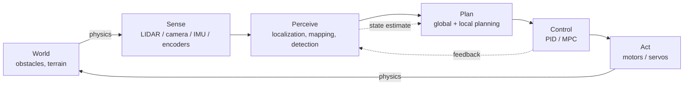
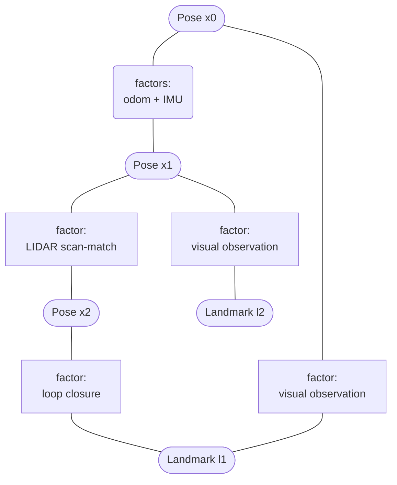
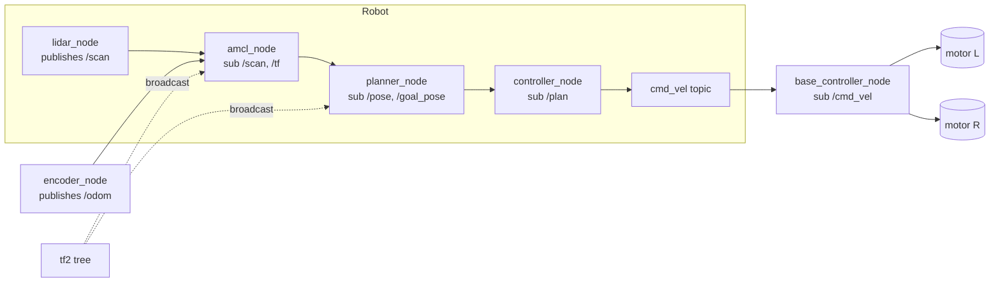

# Robotics

Robotics is the engineering discipline that designs, builds, and operates machines that perceive their environment, make decisions, and act on the physical world. A robot is therefore a closed loop of **sensing → planning → control → actuation**, executing under hard size, weight, power, and timing budgets. Unlike pure software systems, robots are subject to physics: friction, inertia, backlash, sensor noise, and actuator saturation all enter the control loop. The *Springer Handbook of Robotics* (Siciliano & Khatib, eds.) frames robotics as the intersection of mechanics, control theory, computer science, and artificial intelligence, while *Probabilistic Robotics* (Thrun, Burgard, Fox) emphasizes that real-world robotics is fundamentally a problem of reasoning under uncertainty—every measurement is noisy, every model is approximate, and the world is partially observable.

For software engineers interviewing on robotics or autonomy teams (autonomous vehicles, drones, warehouse robots, surgical robots, ROS-based research platforms), the key concepts are: kinematics and dynamics; perception and state estimation; mapping and SLAM; motion planning; real-time control; and the ROS/ROS2 middleware that ties everything together. This page covers all of these at interview depth, with an embedded-systems lens that complements the RTOS, peripheral, and firmware pages already in this directory.

## The Sense-Plan-Act Loop

Every autonomous robot implements some variant of the **sense-plan-act (SPA)** loop, also called the perception-cognition-action cycle. Sensors (LIDAR, cameras, IMU, wheel encoders) produce raw observations; the perception stack fuses them into a state estimate (robot pose, velocity, map of surroundings); the planning stack uses that estimate to choose a trajectory or action; the controller drives actuators to follow that trajectory, closing the loop back on the world. The loop frequency varies dramatically: low-level attitude control runs at 200–1000 Hz, while high-level mission planning may run at 1 Hz or be event-driven. Latency through the entire pipeline must be bounded and known—otherwise the robot acts on stale state and may collide.



Classical SPA architectures are strictly sequential and easy to reason about, but they introduce pipeline latency. Modern autonomy stacks (Apollo, Autoware, Boston Dynamics' internal stack) overlap stages: the planner starts computing the next trajectory before the controller finishes executing the previous one, and perception continuously fuses asynchronous sensor streams at their native rates. Reactive architectures (Brooks' subsumption) collapse the loop into tightly coupled behavior modules with no global world model—useful for fast, low-latency locomotion but limited for long-horizon tasks. Hybrid architectures (three-layer: reactive / executive / deliberative) combine the best of both: a fast reactive layer for safety, an executive for sequencing, and a deliberative planner for goals.

## Kinematics

**Kinematics** is the geometry of motion without regard to forces. It describes the relationship between joint configurations and the pose of the robot's links. For a serial manipulator, **forward kinematics** maps joint angles `θ` to end-effector pose `x = f(θ)`, where `f` is a nonlinear function derived from Denavit-Hartenberg (DH) parameters or product-of-exponentials (POE) formulas. Forward kinematics always has a unique solution and is computationally cheap—a few matrix multiplies per link. **Inverse kinematics (IK)** is the harder reverse problem: given a desired end-effector pose `x`, find joint angles `θ` such that `f(θ) = x`. For simple arms (e.g., 2-DOF planar) IK has a closed-form solution; for general 6-DOF or redundant arms, solutions may not exist, may be non-unique (multiple postures reach the same pose), or require numerical methods such as Jacobian pseudoinverse iteration, CCD (cyclic coordinate descent), or damped least squares (DLS) for handling singularities.

Mobile robot kinematics describes how wheel velocities map to body velocity via the **kinematic model**. A differential-drive robot has model `v = (r/2)(ω_R + ω_L)`, `ω = (r/L)(ω_R − ω_L)` where `r` is wheel radius and `L` is the track width. Ackermann-steered vehicles have a bicycle-model kinematic constraint; omnidirectional robots with Mecanum wheels can move in any direction without rotating. Each kinematic model defines a set of **nonholonomic constraints** that motion planners must respect—differential-drive robots cannot slide sideways, which makes naive Euclidean planning infeasible. A common pitfall is to plan in Cartesian space and then discover at execution time that the trajectory violates the kinematic constraints; the fix is to plan in the configuration space or to project the Cartesian path through an IK solver before execution.

A minimal forward-kinematics implementation for a 2-DOF planar arm illustrates the geometry:

```python
import numpy as np

def fk_planar_2dof(theta1, theta2, l1, l2):
    """Forward kinematics: joint angles -> end-effector (x, y)."""
    x = l1 * np.cos(theta1) + l2 * np.cos(theta1 + theta2)
    y = l1 * np.sin(theta1) + l2 * np.sin(theta1 + theta2)
    return np.array([x, y])

def ik_planar_2dof(target, l1, l2, elbow_up=True):
    """Closed-form IK for a 2-link planar arm."""
    x, y = target
    r2 = x*x + y*y
    cos2 = (r2 - l1*l1 - l2*l2) / (2 * l1 * l2)
    if abs(cos2) > 1:
        raise ValueError("Target out of reach")
    theta2 = np.arccos(cos2) * (1 if elbow_up else -1)
    theta1 = np.arctan2(y, x) - np.arctan2(l2*np.sin(theta2), l1 + l2*np.cos(theta2))
    return np.array([theta1, theta2])
```

For arms with more than six DOF, the system is redundant—there is an infinite set of joint configurations that reach a given pose. Redundancy resolution picks one solution by optimizing a secondary criterion such as distance from joint limits, manipulability (`sqrt(det(J Jᵀ))`), or avoidance of a singularity. The Moore-Penrose pseudoinverse `J⁺ = Jᵀ(JJᵀ)⁻¹` gives the minimum-norm joint velocity for a desired Cartesian velocity; null-space projection adds secondary objectives without disturbing the primary task.

| Aspect | Kinematics | Dynamics |
|--------|-----------|----------|
| Concerns | Geometry of motion (positions, velocities) | Forces and torques causing motion |
| Equations | `x = f(θ)`, `ẋ = J(θ)θ̇` | `M(q)q̈ + C(q,q̇)q̇ + G(q) = τ` |
| Inputs | Joint positions/velocities | Joint torques / forces |
| Solving | Closed-form or numerical IK | Lagrangian or Newton-Euler formulation |
| Use in control | Position / velocity control | Torque control, model-based control |
| Computational cost | Low (matrix multiplies) | High (inertia matrix, Coriolis terms) |
| Example question | "Reach pose (x, y, z) with RPY = …" | "What torque holds the arm against gravity?" |

## Dynamics

**Dynamics** extends kinematics by asking what forces and torques produce a given motion. The governing equation for a rigid-body robotic system is `M(q)q̈ + C(q, q̇)q̇ + G(q) = τ`, where `M` is the joint-space inertia matrix, `C` captures Coriolis and centrifugal effects, `G` is gravity loading, `q` are joint coordinates, and `τ` are applied torques. Two equivalent formulations are used: the **Lagrangian** approach (energy-based, `L = T − V`, derive via Euler-Lagrange) and the **Newton-Euler** recursive algorithm (force/momentum balance propagated link-by-link from base to tip and back). Lagrangian is conceptually clean and good for deriving symbolic models of small arms; Newton-Euler is computationally efficient and used in real-time controllers for 6+ DOF robots.

Dynamics matters for **torque control** (servoing a force rather than a position), for **model-based control** such as computed-torque or inverse-dynamics control, and for **simulation**—MuJoCo, Bullet, Drake, and Gazebo all integrate the dynamic equations to predict motion. It also matters for safety: a 30 kg industrial arm moving at 2 m/s carries 60 J of kinetic energy, enough to seriously injure a human. Collaborative robots (cobots) like Universal Robots' UR series and Franka Emika use torque sensors and dynamics-aware controllers to enforce power-and-force limits per ISO 15066. For mobile robots, dynamics simplify to a single mass-and-friction model in most cases; the interesting dynamics are at the actuator level (motor inertia, gearbox backlash, tire slip).

A compact Lagrangian derivation for a simple pendulum captures the recipe: write kinetic energy `T = ½ml²θ̇²`, potential energy `V = mgl(1 − cosθ)`, form `L = T − V`, and apply the Euler-Lagrange equation `d/dt(∂L/∂θ̇) − ∂L/∂θ = 0`, which yields the pendulum equation `θ̈ = −(g/l)sinθ`. For an n-link manipulator the same procedure produces `M(q)q̈ + C(q,q̇)q̇ + G(q) = τ` but the symbolic expressions grow rapidly; libraries such as Pinocchio (`stack-of-tasks.github.io/pinocchio`) and Drake (`drake.mit.edu`) generate efficient C++ code for arbitrary URDF-described robots using recursive Newton-Euler and Spatial Algebra (Featherstone), achieving sub-microsecond full-dynamics evaluation for 7-DOF arms.

## Sensors

Robots perceive the world through heterogeneous sensors, each with characteristic noise, range, and update rate. **Inertial Measurement Units (IMUs)** combine a 3-axis accelerometer (linear acceleration + gravity) and a 3-axis gyroscope (angular velocity). High-quality tactical-grade IMUs (e.g., VN-200, ADIS-16505) drift a few degrees per hour; consumer-grade MEMS IMUs drift degrees per minute and require constant correction from GPS, vision, or LIDAR. **LIDAR** (Velodyne, Ouster, Intel RealSense L515) measures time-of-flight of laser pulses to produce precise 3D point clouds at 10–20 Hz; mechanical spinning LIDARs cover 360°, solid-state LIDARs trade coverage for cost and ruggedness. **Cameras** (monocular, stereo, RGB-D) provide dense, high-resolution, color information at 30–60 fps but suffer from lighting dependence and depth ambiguity in monocular setups; stereo and structured-light sensors (RealSense D435, Azure Kinect) recover metric depth via disparity or projected patterns.

**Wheel encoders** (incremental quadrature, absolute magnetic) measure joint position and, via differentiation, velocity; they are the primary odometry source for ground robots but accumulate slip-and-skid error. **GPS/GNSS** gives global position outdoors to 1–5 m (single-point) or centimeter-level with RTK corrections; it is useless indoors. **Force/torque sensors** (6-axis ATI, joint torque sensors on cobots) measure contact forces for compliance and safe interaction. **Ultrasonic and time-of-flight sensors** are cheap short-range obstacle detectors. **Tactile/pressure sensor arrays** on grippers enable grasp feedback. The art of sensor selection is matching the sensor's *information rate*, *noise profile*, and *failure mode* to the decision the robot must make: a vacuum robot can navigate with bump sensors and a cliff detector; an autonomous car cannot.

Each sensor carries a noise model that the fusion stack must respect. A LIDAR's noise is dominated by ranging error (1–3 cm 1-σ for mechanical units) and angular quantization; an IMU's gyro noise is parameterized by **angle random walk** (deg/√hour) and bias instability (deg/hour); a camera's image noise is shot noise plus read noise, with added ambiguity from defocus and motion blur. These noise parameters propagate through the filter covariance; ignoring them (e.g., treating LIDAR ranges as exact) yields overconfident estimates that diverge on the next observation. A common interview topic is "explain the noise model for sensor X and how it enters an EKF"—the expected answer identifies the relevant noise terms and shows how the measurement Jacobian `H` maps them into state-space covariance.

## Actuators

Actuators convert electrical energy into mechanical motion. **DC motors** are simple, cheap, and easy to control via PWM and an H-bridge; they are common in toys, low-cost robots, and as drive motors for small platforms. **Brushless DC (BLDC) motors** replace mechanical commutation with electronic commutation via a controller that reads Hall-effect sensors or back-EMF; they offer higher efficiency, longer life, and better torque-per-weight, and dominate drones, e-bikes, and electric vehicles. **Stepper motors** move in discrete steps (typically 1.8° per full step, microstepped to 1/256) and provide open-loop position control—ideal for 3D printers, CNC machines, and pick-and-place robots—but produce less torque at high speed and can lose steps if overloaded. **Servo motors** (RC servos, smart servos like Dynamixel) integrate a motor, gearbox, control board, and position feedback into one package; they are the workhorse of robotic arms and humanoid robots.

Each actuator type has a characteristic control interface: PWM duty cycle for brushed DC, three-phase commutation for BLDC, step/dir pulses for steppers, and position/velocity/torque commands over UART, CAN, or RS-485 for smart servos. The control loop bandwidth is constrained by the actuator's mechanical time constant and the update rate of the feedback sensor. Modern actuator design (e.g., MIT Mini Cheetah's quasi-direct-drive actuators) trades gear ratio for proprioceptive force sensitivity: a low-ratio planetary gearbox (6:1–9:1) preserves torque transparency so the motor's current reading directly reflects contact force, enabling responsive impedance control for legged locomotion. This is fundamentally a perception-actuation co-design problem.

Power electronics matter as much as the motor itself. An H-bridge (brushed DC) or a three-phase inverter (BLDC) switches the motor windings at 8–40 kHz; the switching frequency must be far above the control bandwidth to avoid ripple aliasing but low enough to limit switching losses. Field-Oriented Control (FOC) transforms three-phase stator currents into a rotating d-q frame aligned with the rotor flux, allowing independent control of torque (q-axis) and flux (d-axis) and giving BLDCs the smooth, decoupled response of a separately excited DC motor. Open-source FOC stacks (SimpleFOC, VESC) bring this technique to hobbyist and research platforms. Safety circuits—overcurrent detection, brake resistors, hardware e-stop, and coast-down behavior on watchdog timeout—are not optional; they are how a runaway motor fails safe instead of failing catastrophic.

## Control

Robot control spans from classical **PID** to modern **model predictive control (MPC)** and **adaptive/learning-based** methods. A PID controller computes `u(t) = K_p·e(t) + K_i·∫e dt + K_d·de/dt` where `e` is the tracking error. It is ubiquitous—drone attitude loops, motor velocity loops, joint position loops—because it is simple, model-free, and easy to tune via Ziegler-Nichols or pole placement. PID fails for systems with significant nonlinearity, actuator saturation (wind-up), or strong coupling between axes, which is where model-based methods shine.

**Computed-torque control** uses the dynamic model to cancel nonlinearities: `τ = M(q)(a + K_p·e + K_d·ė) + C(q,q̇)q̇ + G(q)`, where `a` is a feedforward acceleration command. With a perfect model, this linearizes the closed loop and lets you design a linear controller on top. **Model Predictive Control (MPC)** solves a constrained optimization at each timestep—minimizing tracking error and control effort over a finite horizon subject to dynamics and input/state constraints—and applies only the first control action, then re-solves. MPC handles input saturation, obstacle avoidance, and coupled MIMO systems naturally, at the cost of significant online computation. ACADO, acados, and Forces Pro generate fast QP-based MPC solvers suitable for 100–500 Hz control of manipulators and quadrupeds. **Adaptive control** (MRAC, L1 adaptive) and **reinforcement learning** (model-free RL, model-based RL such as PPO, SAC, Dreamer) are increasingly used for systems with poorly modeled dynamics—legged robots traversing loose terrain, soft robots, or contact-rich manipulation. The trade-off is verifiability: a learned policy may behave unpredictably in distribution-shifted conditions, which is why safety-critical robots often wrap learning in a verified safety filter (control barrier functions).

A canonical PID velocity loop in C illustrates the discipline required for real-time control: clamp the integral term to prevent windup, differentiate the *measurement* (not the setpoint) to avoid derivative kick on setpoint changes, and run at a fixed rate from a timer interrupt rather than a sleep:

```c
typedef struct { float Kp, Ki, Kd, integ, prev_meas, out_min, out_max; } pid_t;

float pid_step(pid_t *p, float setpoint, float meas, float dt) {
    float err = setpoint - meas;
    p->integ += err * dt;
    // Anti-windup clamp
    float integ_clamped = p->integ;
    if (integ_clamped * p->Ki > p->out_max) integ_clamped = p->out_max / p->Ki;
    if (integ_clamped * p->Ki < p->out_min) integ_clamped = p->out_min / p->Ki;
    p->integ = integ_clamped;
    // Derivative on measurement (negative sign because d(meas)/dt = -d(err)/dt for fixed setpoint)
    float deriv = -(meas - p->prev_meas) / dt;
    p->prev_meas = meas;
    float u = p->Kp * err + p->Ki * p->integ + p->Kd * deriv;
    if (u > p->out_max) u = p->out_max;
    if (u < p->out_min) u = p->out_min;
    return u;
}
```

For higher-performance systems, **sliding-mode control** provides robustness to bounded model uncertainty at the cost of chattering (mitigated by boundary layers or higher-order sliding modes), and **LQR/LQG** designs an optimal linear controller around a trajectory by solving the Riccati equation. **Whole-body control (WBC)** frameworks (Drake, HiRP, OSQP-based WBC for Atlas and Mini Cheetah) coordinate dozens of joints on a humanoid or quadruped by solving a single QP that prioritizes tasks (balance, contact, end-effector tracking) using strict or weighted hierarchies.

## Perception

Robotic perception turns raw sensor streams into structured state: where am I, what is around me, what is moving, and what can I interact with? **Computer vision** pipelines apply classical algorithms (edge detection, Hough transforms, RANSAC for plane fitting) and deep models (CNN classification, YOLO/DETR object detection, Mask R-CNN segmentation, SuperPoint features) to camera images. **Depth estimation** is recovered from stereo matching (semi-global matching, AANet), structured light (RealSense, Kinect), time-of-flight, or learned monocular depth (MiDaS, Depth Anything). For navigation, **point-cloud processing** (PCL library) provides occupancy grid mapping, Euclidean clustering, plane segmentation, and normal estimation. The OpenCV documentation (`docs.opencv.org`) and the PCL tutorials are the canonical entry points.

State estimation combines these measurements probabilistically. A robot rarely knows its pose exactly; instead it maintains a **belief distribution** over poses. The **Bayes filter** is the abstract recursion `bel(x_t) = η·p(z_t | x_t)∫p(x_t | u_{t-1}, x_{t-1})bel(x_{t-1})dx_{t-1}`—predict via the motion model, correct via the measurement model. Real-time implementations specialize this: **Kalman filters** for linear-Gaussian systems, **Extended Kalman Filters (EKF)** for mild nonlinearity, **Unscented Kalman Filters (UKF)** for stronger nonlinearity, **particle filters (Monte Carlo Localization)** for arbitrary non-Gaussian belief (kidnapped-robot problem, multi-modal posteriors). Pose-graph optimization backends (g2o, GTSAM, Ceres) perform bundle adjustment and full-SLAM inference by maximizing the posterior over a graph of pose and landmark variables.

Perception stacks are increasingly dominated by **deep learning**: detector backbones (YOLOv8, DETR, Faster R-CNN) run at 30–60 fps on consumer GPUs and edge accelerators (NVIDIA Jetson Orin, Google Coral TPU); semantic segmentation networks (DeepLab, SegFormer) label every pixel; vision-language models (CLIP, Grounding-DINO) support open-vocabulary queries such as "find the red mug." A pragmatic interview answer distinguishes where deep models help (perception, feature detection, depth) from where classical algorithms still dominate (geometric registration, scan matching, factor-graph optimization, control) and notes the failure modes of deep perception—adversarial patches, distribution shift between training and deployment, latency and power cost on edge hardware.

## SLAM

**Simultaneous Localization and Mapping (SLAM)** is the chicken-and-egg problem of building a map of an unknown environment while simultaneously using that map to localize. The *Springer Handbook of Robotics* devotes an entire chapter to it; *Probabilistic Robotics* derives the canonical algorithms. SLAM solutions differ in **frontend** (how features are extracted and associated) and **backend** (how the optimization is solved). Classical approaches include:

- **EKF-SLAM**: extended Kalman filter over a state of robot pose + landmark positions; covariance grows cubically with landmark count, limiting it to small maps.
- **Particle-filter SLAM (FastSLAM)**: factored Rao-Blackwellized filter; each particle carries a robot trajectory and a set of EKFs for landmarks. Used in early Google Street View car research.
- **Graph-SLAM**: poses and landmarks are nodes in a factor graph; measurements are edges with Gaussian noise; solved by sparse nonlinear least squares (g2o, GTSAM). Scales to millions of poses; the dominant paradigm today.
- **Visual SLAM**: ORB-SLAM (Mur-Artal et al.) uses ORB features and a covisibility graph; LSD-SLAM (Engel et al.) operates on semi-dense direct image gradients; DSO (Direct Sparse Odometry) and SVO are direct methods. VINS-Mono and VINS-Fusion fuse vision + IMU tightly.
- **LIDAR SLAM**: LOAM (Zhang & Singh), LeGO-LOAM, and Google's Cartographer (Hess et al.) use scan matching with submap alignment; Cartographer in particular popularized pose-graph optimization with loop closures in real time on a laptop.

Modern SLAM systems also distinguish **front-end** (data association: feature matching, scan registration, loop-closure detection via bag-of-words place recognition such as DBoW2) from **back-end** (the optimizer). Front-end errors—wrong data associations, false loop closures—produce grossly inconsistent maps; robust kernels (Huber, Cauchy, Switchable Constraints) and outlier rejection (RANSAC, max-mixture) are essential. For visual-inertial SLAM (VINS-Mono, VINS-Fusion, OpenVINS, Kimera), IMU pre-integration tightly couples high-rate inertial prediction with lower-rate vision correction, giving smooth, drift-bounded state estimates that are critical for aggressive maneuvers (drone racing, dynamic locomotion). The trend in current research (2020+) is **dense neural SLAM** (DROID-SLAM, NICE-SLAM, Gaussian Splatting SLAM) which combines learning-based front-ends with classical factor-graph back-ends and represents the map as a neural radiance field or set of Gaussians for photorealistic reconstruction.



| Approach | Frontend | Backend | Map type | Best for |
|----------|---------|---------|----------|----------|
| EKF-SLAM | Landmark extraction | EKF | Sparse landmarks | Small indoor maps, teaching |
| FastSLAM | Rao-Blackwellized particles | Per-particle EKF | Sparse landmarks | Early 2D exploration |
| Graph-SLAM | Scan match / features | Sparse NLLS (g2o/GTSAM) | Pose graph + landmarks | Large-scale mapping |
| ORB-SLAM2/3 | ORB features + BoW | Local + global BA | Sparse keypoints + map | Monocular/stereo/RGB-D visual SLAM |
| Cartographer | LIDAR scan-to-submap | Pose graph + submaps | 2D / 3D grid | Indoor LIDAR robots |
| LSD-DSO | Direct photometric | Windowed BA | Semi-dense depth | Drift-prone monocular VO |
| Kimera / VINS-Fusion | Visual-inertial | Factor graph (GTSAM) | Metric + semantic | VIO + state estimation |

## Motion Planning

Once the robot knows where it is and what the world looks like, **motion planning** produces a feasible trajectory from start to goal. The problem is high-dimensional (configuration space `C` for a 6-DOF arm is 6D; for a humanoid it is 30D+), continuous, and constrained by obstacles, joint limits, and dynamics. The *Springer Handbook of Robotics* dedicates several chapters to this; LaValle's *Planning Algorithms* is the standard textbook.

**Discrete/grid planners**: **Dijkstra** and **A\*** search a discretized grid or graph with admissible heuristics (Euclidean, Manhattan, octile). A\* is optimal given an admissible heuristic but explores exponentially in dimensionality. **D\* Lite** and **JPS** (jump-point search) accelerate replanning and grid search. **Dijkstra variants** (Value iteration) are used on costmaps in ROS NavStack.

**Sampling-based planners**: **PRM (Probabilistic Roadmap)** constructs a graph offline by sampling configurations and connecting nearby ones with local planners, then queries online—good for many queries in static environments. **RRT (Rapidly-exploring Random Tree)** grows a tree from the start by biasing samples toward unexplored regions; it is probabilistically complete (finds a path if one exists given enough time) but not optimal. **RRT\*** adds rewiring—when a new node can be reached with lower cost through a different parent, the tree is reconnected—yielding asymptotic optimality. **Informed-RRT\*** and **BIT\*** improve convergence further.

**Trajectory optimization**: CHOMP, STOMP, TrajOpt, and the modern Covariant Hamiltonian Optimizer (CHOMP successor used in MoveIt) refine a feasible path into a smooth, dynamically feasible trajectory by minimizing cost over the trajectory subject to obstacle and dynamic constraints. For mobile robots, the **DWA (Dynamic Window Approach)** and **TEB (Timed Elastic Band)** are widely used local planners.

A practical motion-planning stack composes these layers: a global planner (A\*, RRT\*, or PRM) produces a coarse path in configuration or workspace; a local planner (DWA, TEB, MPC) tracks that path while reacting to dynamic obstacles; a trajectory smoother (B-spline, minimum-jerk) ensures the executed motion respects acceleration and jerk limits so the motors do not saturate or excite structural resonances. The composition matters: a global plan that ignores dynamics will be infeasible to track; a local planner without global context may deadlock in a U-shaped obstacle. Hybrid A\* (used in DARPA Urban Challenge and modern self-driving stacks) discretizes heading and reverse gear to make A\* kinematically feasible for cars, producing smooth, drivable paths in one shot.

| Algorithm | Type | Optimality | Completeness | Dim | Replan cost | Best use |
|-----------|------|-----------|--------------|-----|-------------|----------|
| Dijkstra | Graph search | Optimal | Complete (graph) | Low | O(E + V log V) | Grid worlds with positive costs |
| A\* | Graph search | Optimal (admissible h) | Complete | Low | Heuristic-dependent | 2D nav, games |
| D\* Lite | Incremental | Optimal | Complete | Low | Efficient replan | Unknown changing environments |
| PRM | Sampling, multi-query | Asymptotically optimal | Probabilistic | High | Query is fast | Static env, many queries |
| RRT | Sampling, single-query | Not optimal | Probabilistic | High | Cheap | High-dim single queries |
| RRT\* | Sampling, single-query | Asymptotically optimal | Probabilistic | High | Cheap | High-dim, optimality matters |
| CHOMP / TrajOpt | Optimization | Local optimum | Local | High | Medium | Smooth trajectory refinement |
| MPC | Optimization, receding horizon | Local optimum | Local | Med-High | Per-timestep QP | Real-time obstacle avoidance |

## Localization & Sensor Fusion

Localization answers "where am I?" given a map (or no map—kidnapped-robot). **Odometry** integrates wheel encoder deltas; it is precise over short distances but drifts as small errors accumulate. **Monte Carlo Localization (MCL)**, also known as **particle filter localization**, represents the belief as a set of weighted particles; it handles multi-modal distributions (the robot could be in either hallway) and recovers from kidnapping. **AMCL** (Adaptive Monte Carlo Localization) is the ROS standard; it dynamically adjusts particle count based on measurement confidence.

Sensor fusion merges asynchronous, heterogeneous measurements into a consistent estimate. The **Kalman filter** is the optimal estimator for linear systems with Gaussian noise; the **Extended Kalman Filter (EKF)** linearizes via Jacobians and is used everywhere (robot_localization package, AHRS algorithms, GPS+IMU fusion). The **Unscented Kalman Filter (UKF)** uses the unscented transform—a deterministic sampling of sigma points—avoiding Jacobian computation and capturing higher-order nonlinearities. The **complementary filter** (a fixed-gain blend of low-passed accelerometer and high-passed gyroscope) is a popular AHRS attitude estimator for drones due to its simplicity. The **Invariant EKF** exploits symmetry to keep covariance consistent under large rotations. For multi-robot and distributed systems, **covariance intersection** avoids double-counting correlations without storing the full cross-covariance.

A minimal EKF predict/correct loop captures the discipline: predict using the motion model `f`, correct using the measurement model `h`, propagate covariance through the Jacobians `F` and `H`, and update the Kalman gain `K = PHᵀ(HPHᵀ + R)⁻¹`. Numerical robustness matters—symmetrize the covariance after each update (`P = ½(P + Pᵀ)`), guard against loss of positive-definiteness (Joseph form for the update), and use square-root filters (SR-EKF, SR-UKF) for ill-conditioned systems.

```python
import numpy as np
def ekf_step(x, P, u, z, f, h, F, H, Q, R, dt):
    # Predict
    x_pred = f(x, u, dt)
    F_mat = F(x, u, dt)
    P_pred = F_mat @ P @ F_mat.T + Q
    # Correct
    z_pred = h(x_pred)
    H_mat = H(x_pred)
    S = H_mat @ P_pred @ H_mat.T + R
    K = P_pred @ H_mat.T @ np.linalg.inv(S)
    x_new = x_pred + K @ (z - z_pred)
    P_new = (np.eye(len(x)) - K @ H_mat) @ P_pred   # Joseph form preferred in production
    P_new = 0.5 * (P_new + P_new.T)                  # symmetrize
    return x_new, P_new
```

## ROS and ROS2

The **Robot Operating System (ROS)** is the de facto middleware for robotics research and an increasing share of production systems. ROS is not an operating system—it is a distributed publish/subscribe message-passing framework plus a large ecosystem of packages for perception, planning, control, simulation (Gazebo), and visualization (RViz). The core abstraction is the **node**: a process that communicates with other nodes by publishing **messages** onto **topics** (anonymous, many-to-many) or via **services** (synchronous request/reply) and **actions** (asynchronous, cancellable, with feedback). ROS 1 (released 2009, ROS Kinetic/Melodic/Noetic) used a central **roscore** master for name resolution—single point of failure and unsuitable for multi-robot or real-time use.

ROS 2 (Ardent/Bouncy/Crystal/Dashing/Eloquent/Foxy/Galactic/Humble/Iron/Jazzy) is a ground-up rewrite that replaces the custom transport with **DDS (Data Distribution Service)**, an OMG-standard pub/sub middleware with built-in discovery, Quality-of-Service policies (reliability, durability, history depth, deadline, lifespan), and real-time-capable transports. DDS brings zero-config discovery (no master), native multi-robot support, fine-grained QoS, and the ability to run over constrained networks. ROS 2 also adds a real-time control layer (rtt, ros2_control), lifecycle nodes (`rclcpp_lifecycle`) that bring deterministic bring-up/teardown states, and security via SROS2 (DDS-Security). The ROS 2 documentation (`docs.ros.org/en/rolling`) is the authoritative reference.

A minimal ROS 2 publisher in Python shows the lifecycle: initialize `rclpy`, create a node, create a publisher with an explicit QoS profile, and spin:

```python
import rclpy
from rclpy.node import Node
from rclpy.qos import QoSProfile, ReliabilityPolicy, HistoryPolicy
from std_msgs.msg import Float64

class WheelCommandNode(Node):
    def __init__(self):
        super().__init__('wheel_command')
        qos = QoSProfile(depth=10,
                         reliability=ReliabilityPolicy.RELIABLE,
                         history=HistoryPolicy.KEEP_LAST)
        self.pub = self.create_publisher(Float64, '/cmd_vel', qos)
        self.timer = self.create_timer(0.01, self._tick)   # 100 Hz

    def _tick(self):
        msg = Float64()
        msg.data = compute_setpoint(self.get_clock().now())
        self.pub.publish(msg)

def main():
    rclpy.init()
    rclpy.spin(WheelCommandNode())
    rclpy.shutdown()
```

Choosing the right QoS profile is the most common ROS 2 interview question: sensor data (LIDAR scans, images) usually uses `BEST_EFFORT` + `KEEP_LAST` with shallow depth (drop stale frames, no backpressure); control commands use `RELIABLE` + `KEEP_LAST` depth 1 (always the latest command, never stale); map data uses `TRANSIENT_LOCAL` durability (late-joining subscribers receive the last published map).



| Aspect | ROS 1 (Noetic) | ROS 2 (Humble+) |
|--------|----------------|------------------|
| Middleware | Custom TCPROS / UDPROS | DDS (RTPS over UDP/SHM) |
| Discovery | Centralized master (roscore) | Decentralized (DDS) |
| Master | Required, single point of failure | None required |
| QoS | Best-effort only | Reliability, durability, deadline, history, lifespan |
| Real-time | Limited (non-RT transport) | Real-time capable (Preempt-RT, rt_executor) |
| Multi-robot | Difficult (namespaces, separate masters) | Native via DDS domains |
| Security | None | SROS2, DDS-Security (auth, encryption) |
| Lifecycle | Ad hoc init/shutdown | Managed lifecycle nodes (configure/activate) |
| Python support | rospy (GIL-bound) | rclpy with threading/asyncio |
| Build system | catkin | colcon (ament_cmake/ament_python) |
| OS support | Ubuntu, deprecated 2025 | Ubuntu, Windows, macOS, RTOS via micro-ROS |
| Embedded | rosserial (limited) | micro-ROS on FreeRTOS/Zephyr |

## Real-Time Constraints

Robotics blends hard and soft real-time. A quadrotor's attitude controller must run at 400–1000 Hz with sub-millisecond jitter; missing a deadline for 10 ms risks instability and a crash. SLAM and planning pipelines are typically soft real-time—latency of 50–200 ms is acceptable but degrades the user experience and may stall reactive maneuvers. Hard real-time on Linux requires **PREEMPT_RT** (kernel patch) or a hypervisor-based partition (Xenomai, ACRN), or moving the control loop onto an RTOS such as FreeRTOS, Zephyr, or QNX. See [`../os/scheduling/realtime.md`](../os/scheduling/realtime.md) for scheduling theory (rate-monotonic, EDF, deadline-monotonic) and [`./rtos.md`](./rtos.md) for the RTOS primitives (priority inheritance, semaphores, queues) that underpin real-time robot software.

Common pitfalls: unbounded priority inversion (mitigated by priority-inheritance mutexes), GC pauses (avoid Java/C# on critical paths; use C++/Rust or hard-real-time Python with nogil and pre-allocated buffers), page faults on the heap (use memory pools and `mlockall`), and unbounded jitter from thermal throttling or CPU frequency scaling (pin to a core, disable governor scaling). A robust pattern is **separation of concerns**: a small hard-real-time core runs control loops and reads encoders/IMU; a larger soft-real-time companion runs perception and planning, communicating via shared memory or a real-time-safe IPC such as DDS with bounded buffers.

## Simulation, Testing, and Sim-to-Real

Robots are expensive to crash, so simulation is where most development happens. **Gazebo** (now Gazebo Ignition / Fortress/Harmonic) is the historical ROS companion, simulating rigid-body dynamics (ODE/Bullet/DART), sensors (camera, LIDAR, IMU, contact), and ROS 2 transport. **Isaac Sim** (NVIDIA) adds GPU-accelerated photorealistic rendering, parallel envs, and PhysX 5 with deformable bodies, supporting thousands of robot instances for reinforcement learning. **MuJoCo** (DeepMind, open-source since 2021) is the simulator of choice for learning-based control thanks to its fast, accurate soft-contact model; **PyBullet**, **Drake**, **Webots**, and **Mujoco Menagerie** model collections round out the ecosystem. All these simulators take a URDF or SDF description of the robot and expose a programmatic API for control, observation, and reset.

**Sim-to-real transfer** is the central challenge of learning-based robotics: a policy trained in simulation may exploit simulator-specific quirks (perfectly known friction, no sensor noise, idealized contact) and fail in reality. Techniques to bridge the gap include **domain randomization** (randomize friction, masses, lighting, sensor noise during training so the policy generalizes), **domain adaptation** (learn a mapping from real to simulated observations), **system identification** (calibrate simulator parameters to match real data), and **residual policy learning** (train a small correction policy on real hardware on top of a simulator-trained base). For safety-critical systems, **hardware-in-the-loop (HIL)** testing with real motor controllers and sensors but simulated dynamics bridges simulation and full deployment—this is standard practice in automotive and aerospace before road/flight tests.

## Cross-References

Robotics is an integrative discipline that draws on every other chapter in this knowledge base. A typical robotics interview will pull questions from embedded systems (sensor/actuator interfaces, RTOS), operating systems (real-time scheduling, IPC, threads), concurrency (lock-free pipelines, message passing), machine learning (RL policies, perception models), and even computer graphics (transforms, quaternions, rendering for simulation). The links below point to the pages that share the most concrete overlap with robotics. When a question about, say, priority inversion comes up, the right answer cites both the FreeRTOS mutex implementation in `rtos.md` and the higher-level motivation (control loops missing deadlines) that appears here.

- [`./peripherals.md`](./peripherals.md) — SPI, I2C, CAN, PWM, encoders: the physical layer every actuator and sensor hangs off.
- [`./rtos.md`](./rtos.md) — FreeRTOS primitives (queues, semaphores, priority inheritance) used in micro-ROS and the low-level control loop.
- [`./firmware.md`](./firmware.md) — Boot process, dual-bank OTA, watchdogs: how a robot's MCU stays updatable and self-recovering.
- [`../os/scheduling/realtime.md`](../os/scheduling/realtime.md) — Rate-monotonic and EDF scheduling theory that bounds control-loop latency.
- [`../os/synchronization/spinlocks.md`](../os/synchronization/spinlocks.md) and [`../os/threads/`](../os/threads/) — Concurrency primitives that thread through every perception pipeline.
- [`../concurrency/overview.md`](../concurrency/overview.md) — Architectural patterns for multi-threaded perception stacks.
- [`../ml/rl/README.md`](../ml/rl/README.md) — Reinforcement learning foundations for learned locomotion and manipulation policies.
- [`../llm/vision/`](../llm/vision/) — Modern CNN/ViT backbones increasingly used in robotic perception.

## References

- Thrun, S., Burgard, W., Fox, D. — *Probabilistic Robotics* (MIT Press, 2005). Canonical reference for Bayes filters, EKF/UKF, particle filters, and SLAM.
- Siciliano, B., Khatib, O. (eds.) — *Springer Handbook of Robotics* (2nd ed., 2016). Comprehensive reference for kinematics, dynamics, control, planning.
- LaValle, S. — *Planning Algorithms* (Cambridge University Press, 2006). Online: `planning.cs.uiuc.edu`. Standard motion-planning textbook.
- Lynch, K., Park, F. — *Modern Robotics* (Cambridge, 2017). Free online: `hades.mech.northwestern.edu`. Excellent POE-formulation of kinematics/dynamics.
- ROS 2 Documentation — `docs.ros.org/en/rolling`. Tutorials, design papers, QoS, lifecycle, real-time.
- DDS specification — OMG DDS (`www.omg.org/spec/DDS`). The middleware ROS 2 builds on.
- Mur-Artal, Raúl, Tardós, J. D. — "ORB-SLAM2: An Open-Source SLAM System for Monocular, Stereo, and RGB-D Cameras." *IEEE Trans. Robotics* 33.5 (2017).
- Engel, J., Schöps, T., Cremers, D. — "LSD-SLAM: Large-Scale Direct Monocular SLAM." *ECCV 2014*.
- Hess, W., Kohler, D., Rapp, H., Andor, D. — "Real-Time Loop Closure in 2D LIDAR SLAM." *ICRA 2016` (Google Cartographer).
- Zhang, J., Singh, S. — "LOAM: Lidar Odometry and Mapping in Real-time." *RSS 2014`.
- OpenCV documentation — `docs.opencv.org`. Vision algorithms used in every robotic perception pipeline.
- PCL (Point Cloud Library) — `pointclouds.org`. Standard for LIDAR processing.
- GTSAM — `gtsam.org`. Factor-graph optimization library used in state estimation and SLAM.
- MoveIt — `moveit.ros.org`. Motion planning framework for manipulators on top of ROS/ROS 2.

## Interview Questions

1. **Explain the difference between forward and inverse kinematics.** Why is IK harder, and what numerical methods are commonly used for redundant manipulators?
2. **Compare A\* and RRT\*.** Under what conditions is each optimal, and when would you choose one over the other for a 7-DOF manipulator in a cluttered scene?
3. **What problem does SLAM solve, and why is it hard?** Sketch the Bayesian formulation and contrast EKF-SLAM with graph-SLAM in terms of scalability.
4. **Describe the ROS 2 architecture.** What does DDS buy you over ROS 1's TCPROS, and what new failure modes or tuning knobs does it introduce?
5. **You need a 1 kHz attitude controller for a quadrotor on Linux.** What scheduling and memory-management techniques would you apply to bound jitter?
6. **Compare an EKF, UKF, and particle filter for localization.** When does each fail, and what is the cost in compute and memory?
7. **What is the difference between a stepper motor and a BLDC, and why do quadruped robots like the MIT Mini Cheetah use quasi-direct-drive BLDCs instead of high-ratio gearboxes?**
8. **Design the autonomy stack for a warehouse robot that must navigate dynamic aisles and pick items from shelves.** Identify the sensors, perception modules, planner, and control loop, and justify the rate at which each runs.
