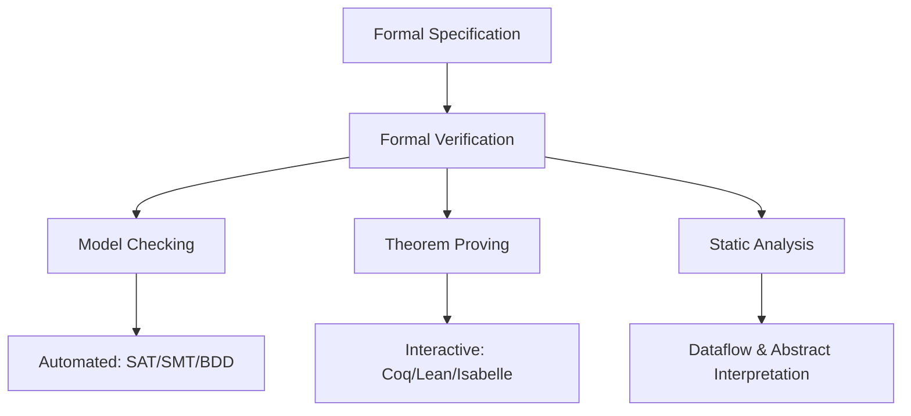
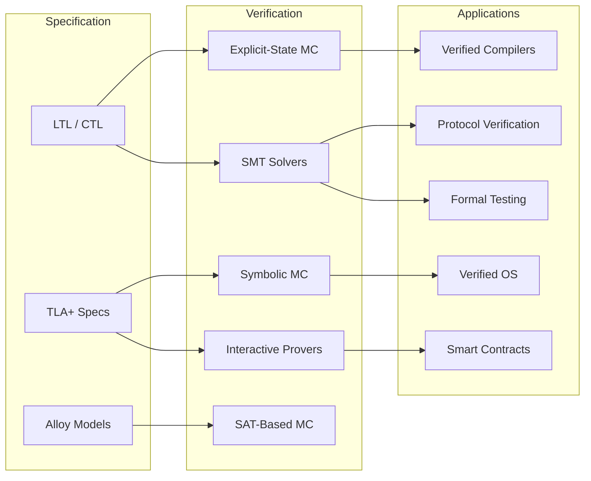

# Formal Methods & Verification

## Overview

Formal methods are mathematically rigorous techniques for specifying, developing, and verifying software and hardware systems. Instead of relying solely on testing, formal methods use mathematical logic to **prove** that a system satisfies its specification. This section covers the core theory, tools, and real-world applications of formal verification — a topic increasingly relevant in industry for safety-critical systems, distributed protocols, and infrastructure software.

## Why Formal Methods Matter

| Motivation | Description |
|------------|-------------|
| **Safety-critical systems** | Aviation (DO-178C), medical devices (IEC 62304), rail (EN 50128) require formal evidence |
| **Financial cost of bugs** | A single bug in a deployed system can cost billions (e.g., Pentium FDIV, Heartbleed) |
| **Distributed protocols** | Consensus algorithms are notoriously hard to get right; testing alone is insufficient |
| **Compiler correctness** | Miscompilation bugs silently introduce security vulnerabilities |
| **Regulatory compliance** | Governments increasingly require formal assurance for critical infrastructure |

## The Verification Landscape

## Section Map

| Chapter | Topics | Key Tools |
|---------|--------|-----------|
| **[Model Checking](./model-checking.md)** | Explicit-state, symbolic, SAT-based, SMT, theorem proving, TLA+, Coq, Lean, Isabelle | SPIN, NuSMV, TLA+ Toolbox, Z3 |
| **[Temporal Logic](./temporal-logic.md)** | LTL, CTL, CTL*, specification patterns, model-checking connections | NuSMV, SPIN, TLA+ |
| **[Program Verification](./program-verification.md)** | Hoare logic, separation logic, weakest preconditions, symbolic execution, abstract interpretation, dataflow, taint analysis | CBMC, Frama-C, Infer, SLAM |
| **[Verified Systems](./verified-systems.md)** | CompCert, seL4, verified cryptography, proof-carrying code, runtime verification | CompCert, seL4, sel4verify |
| **[Testing + Formal Methods](./testing-formal.md)** | Fuzzing, property-based testing, QuickCheck, coverage-guided fuzzing, syzkaller | AFL, LibFuzzer, Syzkaller, QuickCheck |
| **[Distributed Verification](./distributed-verification.md)** | Protocol verification, consensus, smart contracts, concurrency, model-based testing | TLA+, Ivy, Act, K Framework |

## When to Use Formal Methods

> **Interview Angle**: "When would you recommend formal verification over testing?" is a common question. The answer depends on cost-benefit analysis: formal methods excel when the cost of failure dwarfs the cost of verification.

| Scenario | Recommended Approach | Why |
|----------|---------------------|-----|
| Consensus protocol design | TLA+ model checking | State-space exploration finds liveness/safety bugs |
| Memory allocator | Separation logic (Coq) | Pointer aliasing requires reasoning about ownership |
| Smart contract (DeFi) | SMT / symbolic execution | Financial stakes justify formal assurance |
| Kernel driver | CBMC bounded model checking | Finite state, high assurance needed |
| REST API contract | Property-based testing | Quick ROI for input/output correctness |
| Distributed system invariant | Runtime verification + model checking | Combine static proof with dynamic monitoring |

## Key Concepts at a Glance

| Concept | One-Line Definition |
|---------|-------------------|
| **Model checking** | Exhaustively explore all reachable states of a finite model to verify temporal properties |
| **Theorem proving** | Construct mathematical proofs (manually or with proof assistant guidance) that a system meets its spec |
| **Hoare triple** | `{P} C {Q}` — if precondition P holds, command C establishes postcondition Q |
| **Separation logic** | Extension of Hoare logic for reasoning about mutable heap data structures |
| **Symbolic execution** | Explore program paths using symbolic values rather than concrete inputs |
| **Abstract interpretation** | Sound over-approximation of program behavior to prove absence of bugs |
| **Temporal logic** | Reasoning about sequences of states over time (LTL: linear, CTL: branching) |

## Prerequisites

- **Discrete mathematics**: Sets, relations, functions, induction
- **Logic**: Propositional and first-order logic, satisfiability, validity
- **Automata theory**: Finite automata, Büchi automata (helpful for LTL model checking)
- **Programming languages**: Understanding of operational semantics helps
- **Distributed systems**: For protocol verification topics

## Interview Relevance

Formal methods appear in interviews at companies building:
- **Databases**: CockroachDB (TLA+), Google Spanner (TLA+)
- **Distributed systems**: AWS (TLA+ for DynamoDB, S3), Microsoft Azure
- **Compilers**: Apple (verified Clang components), Intel (processor verification)
- **Blockchain**: Ethereum Foundation (K Framework, Certora), Zcash (Haskell/Coq proofs)
- **OS / Infrastructure**: Google (Project Zero), ARM (processor verification)

## Related Sections

- [Distributed Consensus](../distributed/consensus/README.md) — Formal verification of Paxos, Raft, PBFT
- [Concurrency](../concurrency/overview.md) — Race conditions, memory models, verification of concurrent programs
- [Security](../security/README.md) — Formal security proofs, verified cryptography
- [Software Engineering](../software-engineering/README.md) — Testing, quality assurance, static analysis
- [Mathematics](../mathematics/discrete-math.md) — Foundations of logic and proof
