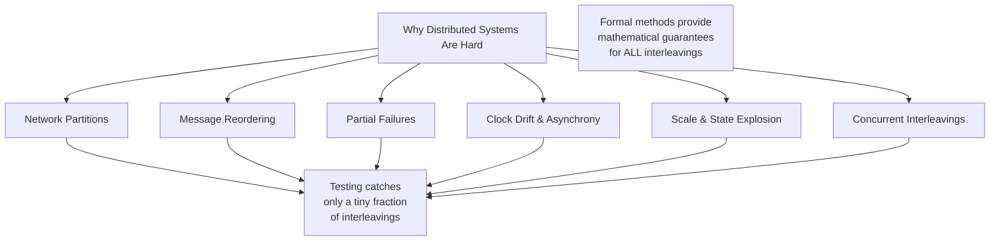
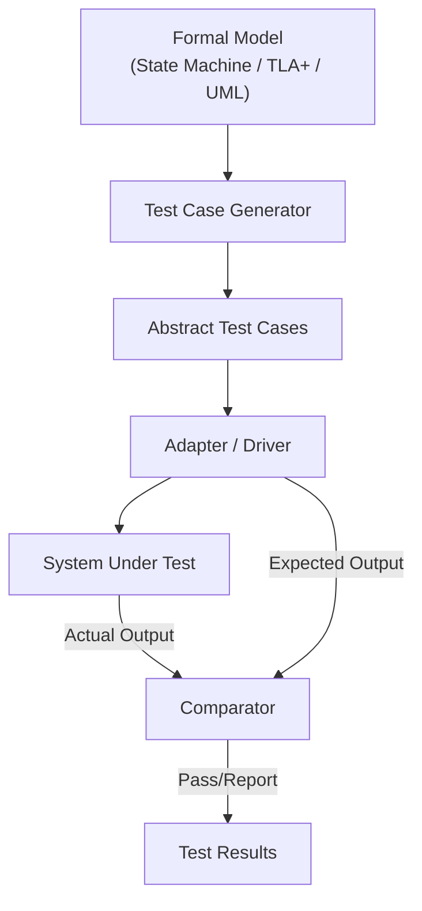
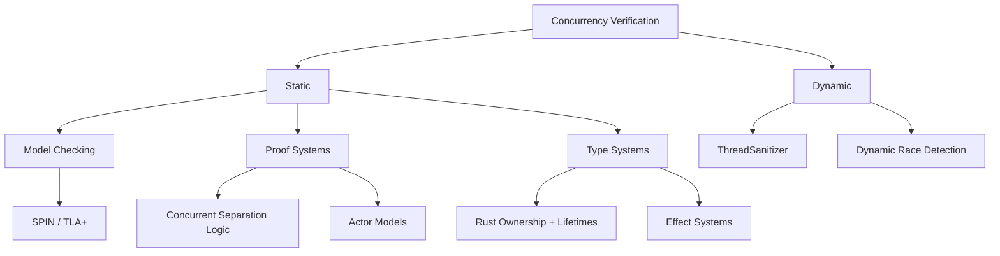

# Distributed System Verification

## Overview

Distributed systems are among the hardest systems to get right. Network partitions, message reordering, partial failures, and clock drift create a combinatorial explosion of interleavings that makes testing alone woefully insufficient. Formal verification has become indispensable for designing and validating distributed protocols, consensus algorithms, distributed databases, smart contracts, and concurrent systems. This chapter covers the techniques, tools, and real-world applications of formal verification for distributed systems — including protocol verification, consensus verification, smart-contract verification, model-based testing, formal API verification, and concurrency verification.

## Why Distributed Systems Need Formal Methods



| Challenge | Why Testing Fails | What Formal Methods Provide |
|-----------|-------------------|---------------------------|
| **Network partitions** | Hard to reproduce reliably | Model non-determinism explicitly |
| **Message reordering/duplication** | Infinitely many orderings | Verify for all possible orderings |
| **Partial failures** | Testing assumes all-or-nothing | Model per-component failure |
| **Asynchrony** | No bound on message delays | Verify under unbounded delay |
| **Consensus invariants** | Subtle safety violations | Prove safety + liveness properties |
| **State space** | 10^30+ reachable states | Symbolic/abstract exploration |

## Protocol Verification with TLA+

### TLA+ Overview

TLA+ (Temporal Logic of Actions), designed by Leslie Lamport, is a specification language for designing and verifying distributed systems. TLA+ specifications describe the set of all possible behaviors (traces) of a system, enabling exhaustive exploration of protocol correctness.

**Key features of TLA+:**
- Describes state machines with mathematical precision
- Supports both safety and liveness verification
- The TLA+ Toolbox provides model checking (TLC) and proof checking (TLAPS)
- Used by Amazon, Microsoft, CockroachDB, MongoDB, and many others

### TLA+ Specification Structure

A TLA+ spec defines:
- **Variables**: The mutable state of the system
- **Init**: The initial state predicate
- **Next**: The next-state relation (all possible transitions)
- **Spec**: `Init ∧ □[Next]_vars ∧ WF_vars(Next)` — the complete system behavior
- **Properties**: Safety (`Inv` invariant) and liveness properties

```
---- MODULE TwoPhaseCommit ----
EXTENDS Naturals, Sequences, TLC

CONSTANTS RM          \* set of resource managers
          Participants \* = RM ∪ {TM}  (transaction manager)

VARIABLES rmState, tmState, msgs

TypeOK == /\ rmState ∈ [RM -> {"working", "prepared", "committed", "aborted"}]
         /\ tmState ∈ {"init", "committed", "aborted"}
         /\ msgs ⊆ [type: {"Prepare", "VoteCommit", "VoteAbort",
                           "Commit", "Abort"}]

Init == /\ rmState = [r ∈ RM |-> "working"]
        /\ tmState = "init"
        /\ msgs = {}

TMRcvCommitMsg(r) == /\ tmState = "committed"
                     /\ [type |-> "Commit"] ∈ msgs
                     /\ rmState' = [rmState EXCEPT ![r] = "committed"]
                     /\ UNCHANGED <<tmState, msgs>>

TMRcvAbortMsg(r) == /\ tmState = "aborted"
                    /\ [type |-> "Abort"] ∈ msgs
                    /\ rmState' = [rmState EXCEPT ![r] = "aborted"]
                    /\ UNCHANGED <<tmState, msgs>>

RMVote(r) == /\ rmState[r] = "working"
            /\ rmState' = [rmState EXCEPT ![r] = "prepared"]
            /\ msgs' = msgs \union {[type |-> "VoteCommit", rm |-> r]}

Next == \/ ∃ r ∈ RM: TMRcvCommitMsg(r)
        \/ ∃ r ∈ RM: TMRcvAbortMsg(r)
        \/ ∃ r ∈ RM: RMVote(r)
        \/ ... \* other actions

Spec == Init /\ [][Next]_<<rmState, tmState, msgs>>

\* Invariant: no RM is both committed and aborted
Inv == /\ ∀ r ∈ RM: ~(rmState[r] = "committed" /\ rmState[r] = "aborted")
       /\ ~(tmState = "committed" /\ tmState = "aborted")
====
```

### TLC Model Checking

TLC (TLA+ model checker) exhaustively explores the state space of a finite TLA+ model. For distributed protocols, this means exploring all possible interleavings of message sends, receives, and state transitions.

| Parameter | Effect |
|-----------|--------|
| **Number of replicas** | 3 nodes → manageable; 5 nodes → state explosion |
| **Message delay bounds** | Bounded delays → finite state; unbounded → use liveness reasoning |
| **Number of operations** | More operations → larger state space |
| **Failure models** | Crash-stop, Byzantine, partition — each adds states |

### Real-World TLA+ Usage

| Organization | System | What Was Verified | Bugs Found |
|-------------|--------|-------------------|------------|
| **Amazon AWS** | DynamoDB, S3, EBS, SWF | Consistency, partition tolerance | 3 bugs in DynamoDB design phase |
| **Microsoft Azure** | Cosmos DB | Consistency levels, liveness | Subtle consistency level bugs |
| **CockroachDB** | KV layer, transaction protocol | Serializability, linearizability | Multiple consensus edge cases |
| **MongoDB** | Raft consensus | Leader election, log replication | Edge cases in membership changes |
| **Ripple** | XRP Ledger consensus | Byzantine agreement | Consensus liveness issue |

> **Interview Angle**: "Tell me about a time you used formal methods in production." — Amazon engineers famously used TLA+ to verify DynamoDB's design before implementation. In a 2014 paper, Newcombe et al. reported finding subtle bugs that took "weeks or months to find through code review and testing alone" but were found by TLA+ in hours.

## Consensus Protocol Verification

### Why Consensus Needs Verification

Consensus protocols (Paxos, Raft, PBFT) are among the most critical and error-prone components of distributed systems. They must maintain safety (no two nodes decide different values) and liveness (eventually a value is decided) despite network partitions, crash failures, and Byzantine behavior. Even Raft, designed specifically for understandability, has implementation bugs in many student and production versions.

### What to Verify

| Property | Formalization | Importance |
|----------|---------------|------------|
| **Safety (agreement)** | `□∀i,j: decided(i) ∧ decided(j) → value(i) = value(j)` | No split-brain |
| **Validity** | If a value is decided, it was proposed | No phantom values |
| **Leader completeness** | If entry is committed at term t, all leaders of t'>t have it | No lost commits |
| **No duplicates** | Each log index is written at most once | Idempotent replay |
| **Log matching** | If entries match at same index+term, all preceding match | Consistency |
| **Liveness** | `□◇∃v: decided(v)` | Eventual progress |

### Verification Challenges

| Challenge | Description | Mitigation |
|-----------|-------------|------------|
| **State explosion** | 3 nodes × 100 entries × message queues = 10^20+ states | Abstract messages, reduce model size |
| **Unbounded log** | Logs can grow infinitely | Bound log length, prove by induction |
| **Unbounded channels** | Message queues can grow infinitely | Bounded FIFO channels |
| **Clock synchronization** | Time-dependent protocols | Use logical clocks (Lamport timestamps) |

## Ivy: A Language for Distributed Protocol Verification

### Overview

Ivy is a specification language and verification tool designed specifically for **parameterized distributed protocols** — protocols that must work for any number of processes. Ivy uses a reduction to first-order logic and checks safety properties using the Z3 SMT solver.

```ivy
# Ivy specification of a simple broadcast protocol
type node
type msg
action broadcast(n: node, m: msg) =
    { Send m to all nodes }

# Safety: no node receives a message that was never broadcast
safety: all n:node, m:msg. recv(n, m) -> exists n':node. sent(n', m)
```

Ivy's key advantage is that it verifies protocols **for an arbitrary number of processes** without bounding the number, avoiding the state explosion that limits TLA+/TLC for parameterized systems.

## Smart Contract Verification

### Why Smart Contracts Need Formal Verification

Smart contracts manage billions of dollars and are immutable once deployed — bugs cannot be patched. Formal verification provides mathematical guarantees that the contract behaves correctly before deployment, which is critical for DeFi protocols, token standards, and governance contracts.

### Verification Approaches

| Approach | Description | Tools |
|----------|-------------|-------|
| **SMT-based** | Encode contract + properties as SMT constraints | Certora Prover, VeriSol |
| **Symbolic execution** | Explore all execution paths symbolically | Manticore, Mythril |
| **Model checking** | Model contract as finite state machine | Securify, VerX |
| **Interactive proving** | Full mathematical proof in Coq/Lean | act (K Framework), Coq-Solidity |
| **Formal semantics** | Define language semantics formally | K Framework (IELE), EVM semantics |

### The K Framework

The K Framework provides a **definitional approach** to language semantics: define the language's operational semantics as rewrite rules in K, then use the resulting definition for both execution and formal verification.

```k
// Simplified ERC20 transfer rule (K Framework)
module ERC20
    syntax Account ::= account(Int, Int)   // account(balance, nonce)

    rule <k> transfer(From, To, Amount) => ... </k>
         <account>
           <id> From </id>
           <balance> BALFROM </balance>
         </account>
      // Requires: From.balance >= Amount
      // Effects: From.balance -= Amount, To.balance += Amount
```

### Certora Prover

Certora's Verification Language (CVL) allows specifying properties of Solidity contracts and verifying them using SMT solving:

```cvl
// Certora Prover rule: no unauthorized minting
rule noUnauthorizedMint(address user) {
    // Sum of all balances before
    uint256 totalBefore = sumBalances();
    
    // Execute the transaction
    arbitrary_tx();

    // Sum of all balances after
    uint256 totalAfter = sumBalances();

    // Invariant: total supply only increases through authorized mints
    assert totalAfter == totalBefore
           || totalAfter == totalBefore + authorizedMintAmount();
}
```

### Major Smart Contract Verification Efforts

| Project | What Was Verified | Tool | Outcome |
|---------|-----------------|------|---------|
| **Zcash** | ZK-SNARK circuit correctness | Coq, Bellman library | Proved no counterfeiting possible |
| **Compound** | Interest rate and liquidation logic | Certora | Found and fixed critical bugs |
| **MakerDAO** | Vault liquidation auctions | Certora, K Framework | Auction math verified |
| **dydx** | Perpetual funding rate logic | Certora | Prevented manipulation vectors |
| **Uniswap** | AMM swap invariants | Formal semantics paper | Proved swap correctness |

## Model-Based Testing

### Concept

Model-based testing (MBT) uses a formal model of the system's expected behavior to automatically generate test cases. The model serves as an executable specification, and test generation ensures comprehensive coverage of the modeled behavior.



### MBT vs Traditional Testing

| Dimension | Traditional Testing | Model-Based Testing |
|-----------|---------------------|---------------------|
| **Test design** | Manual test case writing | Automatic generation from model |
| **Coverage** | Based on human intuition | Measured against model coverage |
| **Maintenance** | High (tests break on spec changes) | Update model → regenerate |
| **Documentation** | Test cases = partial docs | Model = complete spec |
| **Regulation** | Hard to justify coverage | Model coverage is measurable |

### Tools

| Tool | Model Format | Target | Key Feature |
|------|-------------|--------|-------------|
| **GraphWalker** | Graph-based state machine | REST, UI, generic | State machine traversal |
| **ModelJUnit** | EFSM (Java) | Java applications | Annotation-based models |
| **Spec Explorer** | ASM (Microsoft) | .NET applications | NModel library |
| **TGV** | LTS / IOLTS | Protocol conformance | Conformance testing |
| **WS-AT** | WSDL | Web services | SOA testing |

## Formal API Verification

### Contract-Based API Verification

Formal API verification uses specifications (preconditions, postconditions, invariants) to verify that API implementations satisfy their contracts. This is particularly important for:

- **Public APIs**: Cannot control how clients use them
- **Security APIs**: Incorrect usage leads to vulnerabilities
- **System call interfaces**: Kernel boundary, safety-critical

### Specification Patterns for APIs

```
// API contract for a file handle:
// Precondition:  fd must be open and in read mode
// Postcondition: returns bytes read, advances file position
// Invariant:     file position ∈ [0, file_size]

// API contract for a mutex:
// Precondition:  mutex must be unlocked
// Postcondition: mutex is locked, calling thread holds it
// Invariant:     at most one thread holds the mutex
// Safety:        □ (locked_by(t1) → ¬locked_by(t2)) for t1 ≠ t2
```

### RESTler: REST API Fuzzing

RESTler (Microsoft Research) is the first stateful REST API fuzzer. It combines grammar-based fuzzing with learned API dependencies to generate valid API call sequences that explore deep state transitions.

```
// RESTler's approach:
1. Parse OpenAPI / Swagger spec → initial grammar
2. Execute API calls, observe responses → learn dependencies
   (e.g., "create_user" returns ID needed by "get_user")
3. Generate stateful sequences: create_user → get_user → update_user → delete_user
4. Fuzz the data while preserving syntactic structure
```

## Concurrency Verification

### The Concurrency Verification Problem

Concurrent programs have an exponential number of possible interleavings. Even with just two threads and 10 shared-memory operations each, there are `C(20, 10) = 184,756` possible interleavings. This makes exhaustive testing impossible and formal reasoning essential.

### Approaches



### Concurrent Separation Logic (CSL)

Concurrent separation logic (O'Hearn, 2007) extends separation logic to handle shared-memory concurrency with **resource invariants**. Each thread owns a disjoint portion of the heap, and shared resources are governed by invariants.

```
// CSL for a lock:
// lock L with invariant Inv(L):
//   acquire L:    requires L ↦ l
//                  ensures  L ↦ l * Inv(L)
//   release L:    requires L ↦ l * Inv(L)
//                  ensures  L ↦ l

// Proof rule for fork:
// { P₁ * P₂ }
//   fork { P₁ } C₁ { Q₁ }
//   { P₂ } C₂ { Q₂ }
// { Q₁ * Q₂ }
```

### Iris

Iris is a higher-order concurrent separation logic framework implemented in Coq. It provides:
- **Ghost state**: Machine-checked state that tracks logical properties without affecting the actual heap
- **Invariants**: Persistent assertions that hold for all future states
- **Weakest preconditions**: For proving functional correctness of concurrent programs

Iris has been used to verify the **RustBelt** project, proving safety of the core Rust standard library types (Arc, Mutex, RwLock) using Rust's type system extended with ghost state.

### Rust's Ownership System as Verification

Rust's ownership and borrowing system can be viewed as a **static verification mechanism** for memory safety and data race freedom:

| Rust Feature | Formal Property Verified |
|-------------|------------------------|
| **Ownership** | Each value has exactly one owner → no use-after-free |
| **Borrowing** | Either one mutable reference or N immutable references → no data races |
| **Lifetimes** | References cannot outlive their referent → no dangling pointers |
| **Send/Sync traits** | Types that can be safely transferred/shared across threads |

While Rust does not verify general correctness (it does not prove that your algorithm is correct), it **statically eliminates** an entire class of concurrency bugs — data races and memory safety violations.

### ThreadSanitizer (TSan)

ThreadSanitizer is a dynamic race detector that instruments programs at compile time and tracks synchronization events at runtime. It detects **happens-before violations** — situations where two threads access the same memory location without proper ordering.

```cpp
// Example race detected by TSan
int counter = 0;

void thread1() { counter++; }  // Write without lock
void thread2() { counter++; }  // Data race!

// Compile: clang++ -fsanitize=thread race.cc
// TSan reports: WARNING: ThreadSanitizer: data race
```

| Feature | TSan (Dynamic) | Model Checking (Static) |
|---------|---------------|----------------------|
| **Completeness** | Finds actual races (may miss some) | Proves no races exist (for the model) |
| **Scalability** | Runtime overhead ~5-15x | State explosion |
| **Setup** | Just recompile | Write formal model |
| **Output** | Stack trace of racing accesses | Counterexample trace |

## Verification of Specific System Types

### Distributed Database Verification

| Property | Formalization | Tool |
|----------|---------------|------|
| **Linearizability** | Each operation appears to take effect atomically between invocation and response | TLA+, Ivy |
| **Serializability** | Transactions appear to execute in some serial order | TLA+,事儿 |
| **Consistency levels** | Causal, eventual, strong — each has formal semantics | TLA+ |

### Message Queue / Pub-Sub Verification

| Property | Description |
|----------|-------------|
| **At-least-once** | Every published message is delivered ≥ 1 time |
| **At-most-once** | Every message is delivered ≤ 1 time |
| **Exactly-once** | Combination of at-least-once + idempotent processing |
| **Ordering** | Messages with same key arrive in publish order |

### KV Store Verification

```
// TLA+ invariant for a KV store with read-repair:
Inv == /\ \A k \in Keys: values[k] \in acceptable_values(k)
       /\ \A k \in Keys: replica_values[k] ⊆ values[k]
       /\ linearizable(read(k), write(k))
```

## Tool Comparison for Distributed Verification

| Tool | Input Language | Verification Method | Concurrency Model | Best For |
|------|---------------|-------------------|-------------------|----------|
| **TLA+ / TLC** | TLA+ | Explicit-state MC | Shared memory, message passing | Protocol design |
| **TLAPS** | TLA+ | Proof system (Isabelle) | General | Protocol proofs |
| **Ivy** | Ivy | SMT-based (Z3) | Parameterized | Protocol safety |
| **SPIN** | Promela | Explicit-state MC | Message passing | Concurrency |
| **Coq + Iris** | Gallina/Coq | Interactive proving | Shared memory (CSL) | Program correctness |
| **Lean 4** | Lean | Interactive proving | General | Math + verification |
| **Certora** | CVL + Solidity | SMT-based | Sequential (EVM) | Smart contracts |
| **Manticore** | Solidity/Binary | Symbolic execution | Sequential (EVM) | Smart contract bugs |
| **K Framework** | K semantics | Rewrite-based | General (IELE, EVM) | Language semantics |
| **TSan** | C/C++/Go | Dynamic detection | Shared memory | Race detection |

## Interview Questions

### Q1: How would you verify a Raft implementation?

First, write a TLA+ specification of the Raft protocol's safety properties (leader completeness, log matching, state machine safety) and liveness properties (eventually a leader is elected). Use TLC to model-check the spec with a small model (3 nodes, bounded log) to find safety violations. Then use TLAPS to prove the full protocol (unbounded log, arbitrary number of nodes). Finally, verify the implementation against the spec using model-based testing or the IronFleet approach (implement in a language where the code is extracted from the proof).

### Q2: What is the difference between linearizability and serializability?

Linearizability is a single-object consistency model where each operation appears to take effect atomically at some point between its invocation and response. Serializability is a multi-object consistency model where transactions appear to execute in some serial order. Linearizability implies serializability but not vice versa — serializability allows non-atomic visibility of individual operations within a transaction.

### Q3: How does Rust's type system help with concurrency verification?

Rust's ownership and borrowing system statically prevents data races: the type system ensures that either a single mutable reference or multiple immutable references exist at any time. Combined with the `Send` and `Sync` traits, Rust guarantees that shared mutable state across threads requires explicit synchronization (Mutex, RwLock, atomic operations). This eliminates entire classes of concurrency bugs at compile time.

### Q4: Why is smart contract verification especially important?

Smart contracts manage real financial value and are immutable once deployed — bugs cannot be patched by the deployer. Traditional testing is insufficient because the input space is combinatorially large (arbitrary transaction sequences), edge cases in DeFi protocols (flash loans, liquidation cascades) are hard to anticipate, and the cost of a single bug can be hundreds of millions of dollars (e.g., the DAO hack).

### Q5: How does model-based testing for distributed systems work?

Build a formal model (e.g., a TLA+ state machine) of the system's expected behavior. Automatically generate test cases by exploring the model's state space. Write adapters to map abstract model operations to concrete system calls. Execute the generated tests against the real system and compare actual outputs against model expectations. This ensures systematic coverage of protocol behaviors.

## Related Topics

- [Model Checking](./model-checking.md) — TLA+, SPIN, verification algorithms
- [Temporal Logic](./temporal-logic.md) — LTL, CTL for specifying properties
- [Program Verification](./program-verification.md) — Race detection, separation logic
- [Distributed Consensus](../distributed/consensus/README.md) — Paxos, Raft, PBFT
- [Concurrency](../concurrency/overview.md) — Thread safety, memory models
- [Security](../security/README.md) — Smart contract security
