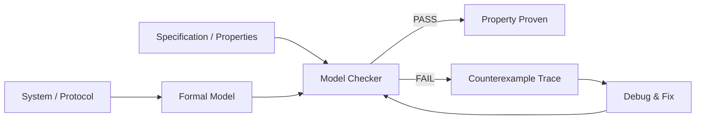
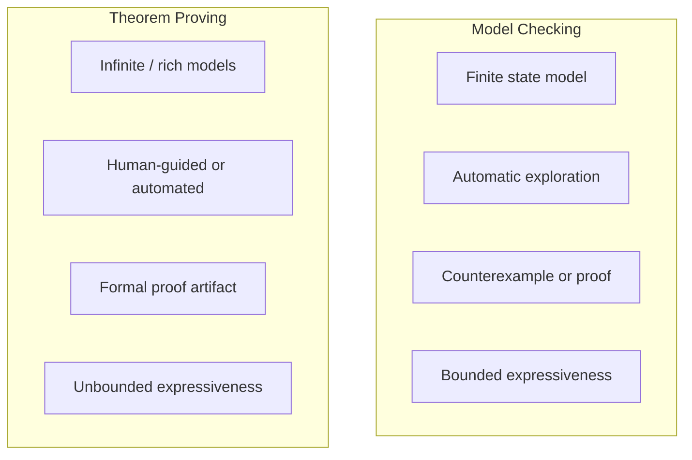

# Model Checking

## Overview

Model checking is an automated verification technique that exhaustively explores the state space of a system to determine whether it satisfies a given specification. Unlike testing, which only checks a finite set of inputs, model checking provides **mathematical guarantees** — if a property holds in all reachable states, it is proven correct. If a property is violated, model checking produces a concrete counterexample trace showing exactly how the bug can be triggered. This makes it one of the most impactful formal methods in industry, used to verify Amazon DynamoDB, Azure Cosmos DB, and the TLS 1.3 protocol.

## The Model Checking Pipeline



The process involves three inputs: a model of the system (typically expressed as a Kripke structure, labeled transition system, or process algebra), a specification (usually in temporal logic), and the model checker engine. The checker performs an exhaustive state-space exploration, and either confirms the property holds in all reachable states or returns a violating execution path.

## Kripke Structures

A Kripke structure is the mathematical foundation of most model checkers. It is defined as `M = (S, S₀, R, AP, L)` where:

- **S** is a finite set of states
- **S₀ ⊆ S** is the set of initial states
- **R ⊆ S × S** is the transition relation
- **AP** is a set of atomic propositions
- **L: S → 2^AP** labels each state with the propositions true in that state

```
State 0: {ready}          State 1: {locked}
    ┌─────────┐               ┌─────────┐
    │  ready  │────lock()───→│  locked  │
    │  cnt=0  │←──unlock()──│  cnt>0   │
    └─────────┘               └─────────┘
```

The key insight is that properties are checked over **all possible executions** starting from any initial state. For finite-state systems, this exploration always terminates (though state explosion is the central challenge).

## Explicit-State Model Checking

### How It Works

Explicit-state model checkers enumerate every reachable state of the model individually, storing each state in a hash table. The checker performs a breadth-first or depth-first search through the state graph, checking the specification at each state.

- **SPIN** (Simple Promela Interpreter) is the most widely used explicit-state model checker. Models are written in **Promela** (Process Meta Language), which supports asynchronous message passing via channels, shared variables, and non-deterministic choice.
- **State storage**: Uses a hashed compact state representation where each state is encoded as a hash value, enabling memory-efficient exploration of large state spaces.

### SPIN Example: Mutual Exclusion

```promela
byte state = 0;  // 0 = unlocked, 1 = locked

active proctype process_A() {
    do
    :: true ->
        if
        :: state == 0 -> state = 1;
           /* critical section */
           state = 0;
        :: else -> skip;
        fi
    od
}

active proctype process_B() {
    do
    :: true ->
        if
        :: state == 0 -> state = 1;
           /* critical section */
           state = 0;
        :: else -> skip;
        fi
    od
}

ltl mutual_exclusion {
    []( !(process_A.cs && process_B.cs) )
}
```

The LTL property asserts that both processes are never in their critical sections simultaneously. SPIN will either prove this or produce a counterexample trace.

### Strengths and Limitations

| Aspect | Strengths | Limitations |
|--------|-----------|-------------|
| **Expressiveness** | Handles concurrency, message passing, non-determinism | Requires abstracting away data (e.g., integers become bounded) |
| **Automation** | Fully automatic, no user guidance needed | State explosion for large models (10^100+ states) |
| **Debugging** | Counterexample traces are highly actionable | Traces may not map cleanly to source code |
| **Performance** | Fast per-state exploration with hashing | Memory-bound: can only explore ~10^8 states in RAM |

## Symbolic Model Checking

### BDD-Based Approach

Symbolic model checking, pioneered by McMillan (1993), represents sets of states and transition relations symbolically using **Binary Decision Diagrams (BDDs)** or their extensions. Instead of enumerating individual states, it manipulates Boolean formulas that encode entire state sets.

- **Ordered BDDs** (OBDDs) provide canonical forms for Boolean functions, enabling efficient set operations (union, intersection, complement) on state sets.
- **Image computation**: Given a set of states S, compute the set of successor states `post(S)` by composing the transition relation with S using BDD conjunction and existential quantification.
- **Reachability**: Iteratively compute `Reach = S₀ ∪ post(Reach)` until a fixpoint is reached. This is the core algorithm for verifying safety properties.

The key advantage is that BDDs can compactly represent exponentially large state sets. A model with 2^30 states might have a transition relation representable by a BDD with only 10^4 nodes. However, BDD variable ordering is critical and can make or break performance.

### Symbolic Model Checking Algorithm (Sketch)

```
function check_safety(M, AG φ):
    // M = Kripke structure, φ = safety property (atomic proposition)
    // Goal: verify φ holds in all reachable states

    Bad := { s ∈ S | φ is false in s }   // states violating φ
    Reach := S₀                             // initial reachable set

    repeat:
        Frontier := post(Reach) \ Reach    // new reachable states
        if Frontier ∩ Bad ≠ ∅:
            return COUNTEREXAMPLE           // found a bug
        Reach := Reach ∪ Frontier
    until Frontier = ∅                      // fixpoint reached

    return PROVEN                            // property holds
```

## SAT-Based Model Checking

### Bounded Model Checking (BMC)

BMC unrolls the transition relation for k steps and encodes the search for a violation within k steps as a **SAT problem**. If the SAT solver finds a satisfying assignment, it corresponds to a counterexample of length at most k.

```
BMC formula: S₀ ∧ T(S₀,S₁) ∧ T(S₁,S₂) ∧ ... ∧ T(S_{k-1},S_k) ∧ ¬φ(S_k)
```

Where `T(Sᵢ, Sᵢ₊₁)` encodes the transition from state i to i+1, and `¬φ(S_k)` means the property is violated at step k. Tools like **CBMC** use this approach for verifying C programs.

- **Completeness**: BMC is incomplete for k < diameter of the state graph. However, increasing k eventually finds any bug (and k-induction can prove correctness).
- **Tools**: CBMC (C bounded model checker), ESBMC, LLBMC. NuSAT and CryptoMiniSat are commonly used SAT backends.

### k-Induction

k-induction strengthens BMC to prove correctness. The base case checks that the property holds for all paths of length k. The inductive step checks: if the property holds for k consecutive states, does it hold for the (k+1)-th state? If both hold, the property is proven for all paths.

```
Base case:    S₀ ∧ T(S₀,S₁) ∧ ... ∧ T(S_{k-1},S_k) → φ(S₀) ∧ ... ∧ φ(S_k)
Inductive:    T(S₀,S₁) ∧ ... ∧ T(S_{k-1},S_k) ∧ φ(S₀) ∧ ... ∧ φ(S_k) → φ(S_{k+1})
```

## SMT-Based Model Checking

Satisfiability Modulo Theories (SMT) extends SAT with background theories: linear arithmetic, bit-vectors, arrays, uninterpreted functions. SMT-based model checking handles richer models than pure SAT.

- **Z3** (Microsoft Research) is the dominant SMT solver. It supports the SMT-LIB standard and is integrated into numerous verification tools.
- **IC3/PDR** (Incremental Construction of Inductive Clauses for Indubitable Correctness / Property Directed Reachability) is a powerful SMT-based algorithm for model checking that avoids BDDs entirely.
- **Tools**: NuSMV (symbolic with BDDs or SAT), nuXmv (evolution of NuSMV), Salamander.

### Z3 Example: Arithmetic Reasoning

```python
from z3 import *

# Prove: if x > 0 and y > 0, then x + y > 1
x, y = Ints('x y')
solver = Solver()
solver.add(x > 0, y > 0, Not(x + y > 1))
if solver.check() == unsat:
    print("PROVEN: x > 0 ∧ y > 0 → x + y > 1")
else:
    print("COUNTEREXAMPLE:", solver.model())
```

## Theorem Proving vs Model Checking



| Dimension | Model Checking | Theorem Proving |
|-----------|---------------|-----------------|
| **Automation** | Fully automatic | Semi-automatic (interactive provers) or automated (SMT) |
| **Expressiveness** | Finite-state systems, temporal properties | Arbitrary mathematical structures |
| **User effort** | Write model + spec; checker does the rest | Guide proof construction (Coq/Lean) or write lemmas |
| **Output** | Counterexample trace or pass | Machine-checked proof term |
| **Scalability** | State explosion | Proof complexity, automation ceiling |
| **Best for** | Protocols, controllers, concurrent systems | Data structures, algorithms, compilers |

## Interactive Theorem Proving

Interactive theorem provers (also called proof assistants) allow users to construct proofs step-by-step with the machine checking each step. They provide the highest level of assurance because the entire proof is machine-checked.

### Coq

Coq is based on the **Calculus of Inductive Constructions** (CIC), a dependent type theory. It supports program extraction (writing verified programs by proving their correctness) and is used in the CompCert verified compiler and the MathComp mathematical library.

```coq
(* Proving that addition is commutative *)
Lemma plus_comm : forall n m : nat, n + m = m + n.
Proof.
  intros n m. revert n.
  induction m as [| m' IHm'].
  - simpl. intros n. rewrite Nat.add_0_r. reflexivity.
  - intros n. simpl. rewrite IHm'. rewrite Nat.add_succ_r. reflexivity.
Qed.
```

### Lean 4

Lean 4 is a modern proof assistant and programming language developed by Leonardo de Moura at Microsoft Research. It features a powerful tactic framework, a fast elaboration engine, and serves as the foundation for **Mathlib** (one of the largest formalized mathematics libraries) and **Lean4's own metaprogramming**.

```lean
-- Proving that list reverse is involutive
theorem List.reverse_reverse (α : Type) (l : List α) :
    List.reverse (List.reverse l) = l := by
  induction l with
  | nil => rfl
  | cons x xs ih =>
    simp [List.reverse_cons, List.reverse_append]
    exact ih
```

Lean 4 is gaining rapid adoption because it doubles as both a proof assistant and a general-purpose programming language, with a powerful macro system and efficient compiled code generation.

### Isabelle/HOL

Isabelle/HOL is a generic proof assistant based on higher-order logic, developed at TU Munich and Cambridge. It is widely used in formal verification research and was used to verify the seL4 microkernel. Isabelle's Isar language provides structured, readable proofs.

```isabelle
lemma "rev (rev xs) = xs"
  apply (induction xs)
   apply auto
  done
```

### Alloy

Alloy is a lightweight modeling language based on first-order relational logic. It uses SAT solving for automated analysis. Alloy is particularly effective for exploring bounded instances of relational structures and has been used to model file systems, security protocols, and metamodels.

```
sig Filesystem {
    root: Dir,
    files: set File,
    dirs: set Dir
}
sig Dir extends Node {
    contents: set Node
}
sig File extends Node {}
```

## Comparison of Major Tools

| Tool | Type | Input Language | Best For | Automation |
|------|------|---------------|----------|------------|
| **SPIN** | Explicit-state MC | Promela | Concurrency, protocols | Full |
| **NuSMV** | Symbolic MC | SMV language | Hardware, protocols | Full |
| **CBMC** | Bounded MC | C programs | C/C++ verification | Full |
| **TLA+ Toolbox** | Model checker | TLA+ | Distributed systems | Full |
| **Z3** | SMT solver | SMT-LIB / APIs | Arithmetic, arrays | Full |
| **Coq** | Proof assistant | Gallina (Coq) | Program verification | Interactive |
| **Lean 4** | Proof assistant + lang | Lean | Math + verification | Interactive + auto |
| **Isabelle** | Proof assistant | Isabelle/Isar | Security, OS kernels | Interactive |
| **Alloy** | SAT-based analysis | Alloy | Relational models | Full |

## State Explosion Mitigation

The central challenge of model checking is that the state space grows exponentially with the number of concurrent components or variables. Several techniques mitigate this:

| Technique | Description | Example |
|-----------|-------------|---------|
| **Partial-order reduction** | Explore only interleavings that affect the property (POR, stubborn sets) | SPIN's default search |
| **Symmetry reduction** | Identify symmetric states and explore one representative | Process symmetry in protocols |
| **Abstraction** | Replace concrete data with abstract domains (predicate abstraction) | SLAM, Blast |
| **Compositional reasoning** | Verify components separately, compose results | Assume-guarantee reasoning |
| **Bounded model checking** | Check for bugs within k steps; increase k gradually | CBMC |
| **IC3/PDR** | Build inductive clauses incrementally, avoids explicit reachability | nuXmv |

> **Interview Angle**: "How does Amazon use model checking?" — Amazon has verified DynamoDB, S3, and EBS with TLA+. The TLA+ spec for DynamoDB was ~700 lines, found 3 bugs before deployment, and the model checker explored 10^30+ reachable states through partial-order reduction and abstraction.

## Interview Questions

### Q1: What is the difference between model checking and testing?

Testing explores a finite subset of executions with concrete inputs. Model checking exhaustively explores **all** reachable states of a finite model. Testing can only find bugs (it cannot prove correctness), while model checking can prove properties hold for all executions.

### Q2: Explain state explosion and how to handle it.

State explosion occurs because the number of states grows exponentially with the number of concurrent components or variables. Mitigations include: partial-order reduction (explore only relevant interleavings), abstraction (replace concrete data with abstract domains), symmetry reduction (merge symmetric states), and bounded model checking (check within k steps then increase k).

### Q3: When would you choose Coq over SPIN?

Choose Coq when you need to reason about infinite data structures (lists, trees with unbounded size), prove mathematical theorems about algorithms, or extract verified code. Choose SPIN when verifying finite-state concurrent systems (protocols, controllers) where full automation is more important than expressive power.

### Q4: What is a counterexample trace and why is it valuable?

A counterexample trace is a concrete execution path from an initial state to a state violating the specification. It shows exactly the sequence of transitions that trigger the bug. This is extremely valuable for debugging because it provides a minimal, reproducible scenario that engineers can use to locate and fix the defect.

### Q5: How does SAT-based BMC differ from BDD-based model checking?

SAT-based BMC unrolls the transition relation for k steps and encodes it as a Boolean satisfiability problem. It leverages modern SAT solvers' efficiency but only checks properties within bounded depth k. BDD-based methods represent entire state sets symbolically and can prove properties for all depths, but depend heavily on variable ordering and may not scale as well.

## Related Topics

- [Temporal Logic](./temporal-logic.md) — The specification languages for model checkers
- [Program Verification](./program-verification.md) — Hoare logic, symbolic execution, abstract interpretation
- [Verified Systems](./verified-systems.md) — CompCert, seL4, real-world formal verification projects
- [Distributed Verification](./distributed-verification.md) — Protocol verification with TLA+ and Ivy
