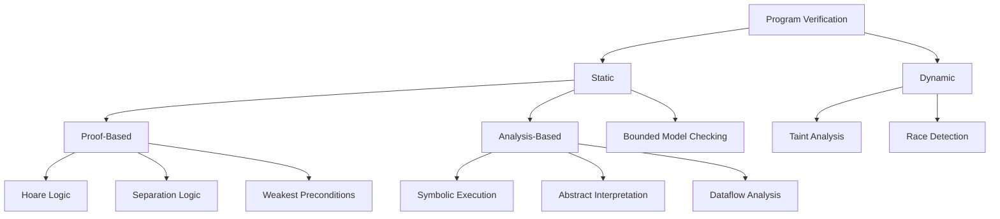
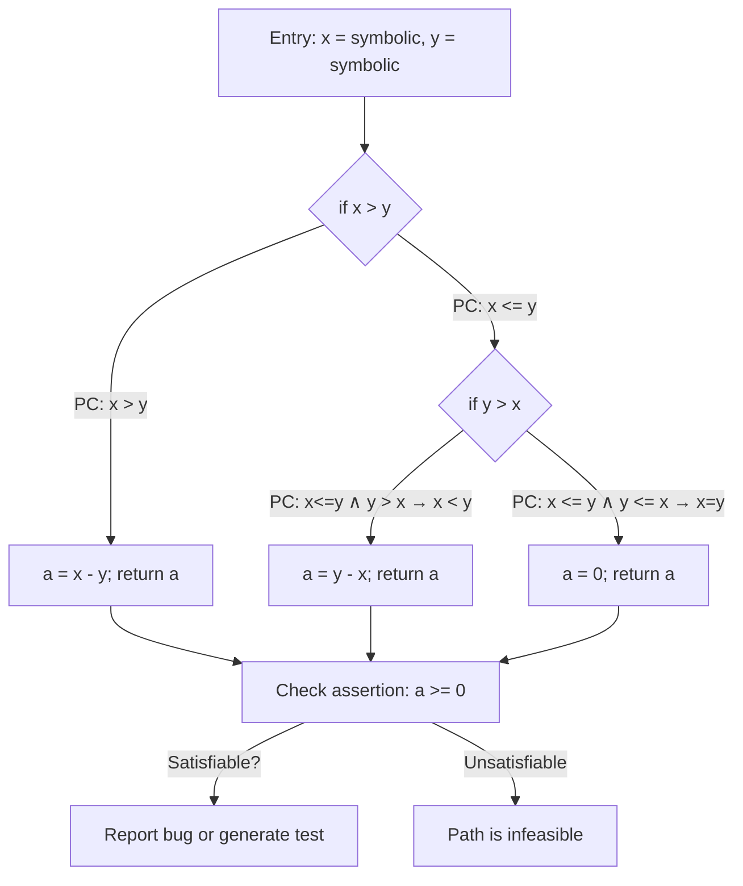
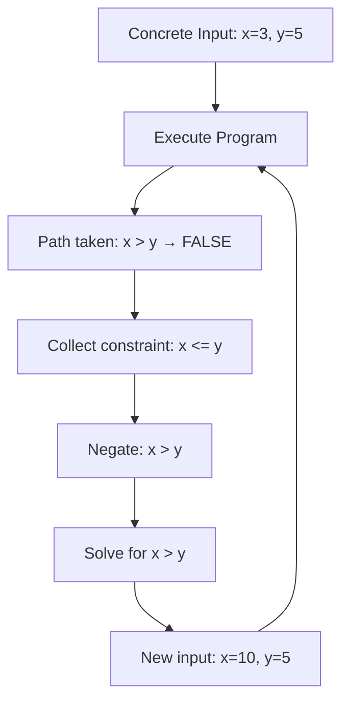
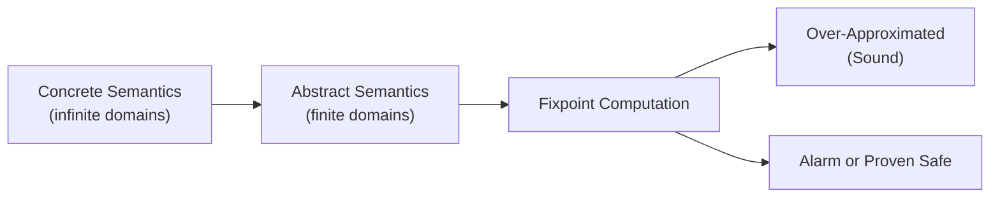
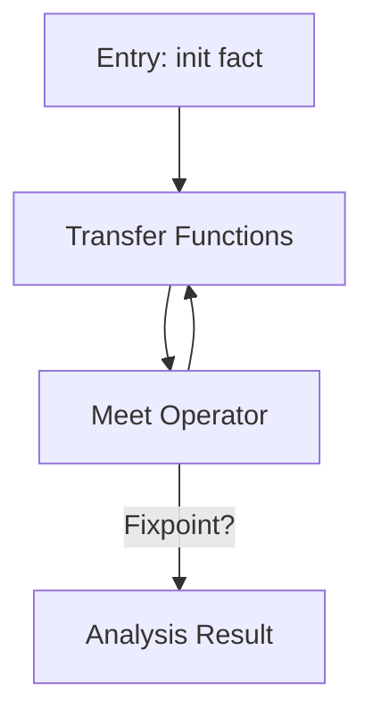

# Program Verification

## Overview

Program verification is the discipline of proving that a program satisfies a formal specification. It encompasses a broad spectrum of techniques ranging from fully automated static analysis to manually guided interactive proofs. Unlike model checking (which operates on abstract finite models), program verification reasons directly about the **source code** or binary of actual programs, making it directly applicable to software engineering. This chapter covers Hoare logic, separation logic, weakest preconditions, symbolic execution, abstract interpretation, static analysis, dataflow analysis, taint analysis, race detection, deadlock detection, bounded model checking, equivalence checking, refinement, and refinement types.

## Verification Techniques Landscape



## Hoare Logic

### The Hoare Triple

Hoare logic, introduced by C.A.R. Hoare in 1969, is the foundational logic for reasoning about imperative program correctness. A **Hoare triple** `{P} C {Q}` asserts that if precondition `P` holds before executing command `C`, then postcondition `Q` holds after `C` terminates (if it terminates).

```
{P} C {Q}     (partial correctness: if C terminates, Q holds)
[P] C [Q]     (total correctness: C terminates and Q holds)
```

### Hoare Logic Axioms and Rules

```
// Skip rule
{P} skip {P}

// Assignment axiom
{Q[x ← e]} x := e {Q}     // backward substitution

// Sequential composition
{P} C₁ {R}    {R} C₂ {Q}
─────────────────────────
     {P} C₁; C₂ {Q}

// Conditional
{P ∧ b} C₁ {Q}    {P ∧ ¬b} C₂ {Q}
─────────────────────────────────
     {P} if b then C₁ else C₂ {Q}

// While loop (with invariant I)
{I ∧ b} C {I}
───────────────────────────  (partial correctness)
  {I} while b do C {I ∧ ¬b}

// Consequence rule
P' → P    {P} C {Q}    Q → Q'
─────────────────────────────
        {P'} C {Q'}
```

### Example: Swapping Two Variables

```
// We want to prove: {x = a ∧ y = b} swap {x = b ∧ y = a}

swap:
    temp := x;
    x := y;
    y := temp;

// Proof (backward substitution):
// After y := temp:   y = temp ∧ x = b   (from x = b)
// After x := y:      x = b              (from y = b)
// After temp := x:   temp = a            (from x = a)
//
// Final triple: {x = a ∧ y = b} swap {x = b ∧ y = a} ✓
```

### Loop Invariant Construction

The hardest part of Hoare logic is finding loop invariants. A loop invariant I must satisfy:

1. **Initialization**: `I` holds before the first iteration (`P → I`)
2. **Maintenance**: `I` is preserved by the loop body (`I ∧ b → wp(C, I)`)
3. **Termination**: `I ∧ ¬b` implies the desired postcondition

```
// Sum of array elements
{0 ≤ n ≤ len(a) ∧ sum = 0}
i := 0;
while i < n do
    sum := sum + a[i];
    i := i + 1
{sum = Σ_{j=0}^{n-1} a[j]}

// Invariant: 0 ≤ i ≤ n ∧ sum = Σ_{j=0}^{i-1} a[j]
// Init:       i=0, sum=0 → sum = Σ_{j=0}^{-1} = 0 ✓
// Maintain:   sum + a[i] = Σ_{j=0}^{i-1} + a[i] = Σ_{j=0}^{i} ✓
// Terminate:  i = n → sum = Σ_{j=0}^{n-1} a[j] ✓
```

## Weakest Preconditions

### The wp Calculus

Dijkstra's weakest precondition calculus computes the **weakest (most general) precondition** that guarantees a command produces a given postcondition. For a command C and postcondition Q, `wp(C, Q)` is the weakest condition P such that `{P} C {Q}`.

| Command | Weakest Precondition |
|---------|---------------------|
| `skip` | `Q` |
| `x := e` | `Q[x ← e]` (substitute e for x in Q) |
| `C₁; C₂` | `wp(C₁, wp(C₂, Q))` |
| `if b then C₁ else C₂` | `(b → wp(C₁, Q)) ∧ (¬b → wp(C₂, Q))` |
| `while b do C` | Largest fixed point of: `X = (b → wp(C, X)) ∧ (¬b → Q)` |
| `assert b` | `b ∧ Q` |
| ` havoc x` | `∀x. Q` |

### Practical Usage

The wp calculus is the foundation of tools like **Frama-C/WP** and **Dafny**. Given a program with annotations, these tools compute weakest preconditions and discharge them via SMT solvers.

```c
/* Frama-C annotated C program */
/*@ requires n >= 0;
    ensures \result == n * (n + 1) / 2;
    assigns \nothing;
*/
int triangular(int n) {
    int sum = 0;
    /*@ loop invariant 0 <= i <= n && sum == i * (i + 1) / 2;
        loop assigns i, sum;
        loop variant n - i;
    */
    for (int i = 0; i < n; i++) {
        sum += i + 1;
    }
    return sum;
}
```

## Separation Logic

### Motivation

Standard Hoare logic struggles with **pointer aliasing** — when multiple pointers reference the same heap cell. Separation logic (Reynolds, 2002; O'Hearn, 2001) extends Hoare logic with spatial connectives that reason about **heap partitions**, enabling modular reasoning about mutable data structures.

### Spatial Connectives

| Connective | Symbol | Meaning |
|-----------|--------|---------|
| Points-to | `x ↦ v` | Heap cell x contains value v |
| Separating conjunction | `P * Q` | P and Q hold on **disjoint** heap partitions |
| Separating implication | `P -* Q` | If we extend the heap with a disjoint partition satisfying P, then Q holds |
| Magic wand | `P ⟹∗ Q` | Same as separating implication |
| Empirical heap | `emp` | The heap is empty |

### Spatial vs Classical Logic

| Classical | Separation | Difference |
|-----------|-----------|------------|
| `P ∧ Q` | `P * Q` | Conjunction: may share heap. Separating: disjoint heaps |
| `P ⇒ Q` | `P -* Q` | Implication vs. separating implication (frame) |
| N/A | `emp` | Empty heap predicate |

### Frame Rule

The **frame rule** is the key axiom enabling modular reasoning:

```
{P} C {Q}    P' disjoint from footprint of C
───────────────────────────────────────────────
{P * P'} C {Q * P'}
```

This means: if C works correctly with heap satisfying P and producing Q, it also works when additional heap satisfying P' is present (as long as C doesn't touch P').

### Example: Linked List Reversal

```
// Predicate: list(h, α) means h points to a linked list with values α
// list(h, []) ≡ h = null ∧ emp
// list(h, v::α) ≡ ∃k. h ↦ (v, k) * list(k, α)

// Reverse specification:
{list(head, α) ∧ list(acc, β)}
reverse(head, acc)
{list(head, β) ∧ list(acc, α)}
```

### Tools Using Separation Logic

| Tool | Language | Automation |
|------|----------|------------|
| **VeriFast** | C, Java | Fully automatic for pointer programs |
| **Dafny** | Dafny (C#-like) | Boogie backend, automatic |
| **Iris** | Coq | Higher-order, concurrent separation logic |
| **Viper** | Viper (Silver) | Automatic verification via Z3 |
| **CH2O** | C | Symbolic heap analysis |

## Symbolic Execution

### Core Idea

Symbolic execution explores program paths by executing the program with **symbolic values** instead of concrete inputs. At each branch point, the tool forks execution, accumulating a **path constraint** (a conjunction of branch conditions). When a path reaches an error state or an assertion, the solver checks whether the path constraint is satisfiable — if so, a concrete input triggering the bug has been found.



### Symbolic Execution Engine (Sketch)

```
function symbolic_execute(function, entry):
    worklist = [(entry_state, True)]
    for each (state, PC) in worklist:
        if state is error:
            if SAT(PC): return CONCRETE_INPUT(PC)  // bug found
            continue
        if state is return:
            continue
        if state is branch(b):
            // Fork: one path assumes b true, other assumes b false
            worklist.append((state.next_true, PC ∧ b))
            worklist.append((state.next_false, PC ∧ ¬b))
        else:
            // Linear statement: update symbolic state
            worklist.append((execute(state), PC))
```

### Tools

| Tool | Language | Key Feature |
|------|----------|-------------|
| **KLEE** | LLVM IR | Symbolic execution of unmodified C/C++ binaries |
| **Angr** | Binary | Symbolic + concrete execution, binary analysis |
| **Symbolic Pathfinder** | Java bytecode | Built into NASA's Java PathFinder |
| **SAGE** | x86 binary | Microsoft's white-box fuzzing engine |
| **CBMC** | C | Bounded model checking via SAT/SMT |
| **Fuzzolic** | LLVM IR | Hybrid fuzzing + symbolic execution |

### Path Explosion

The main limitation of symbolic execution is **path explosion**: the number of paths grows exponentially with the number of branches. Mitigations include:

- **Path merging**: Merge symbolic states at join points (e.g., KLEE's constraint independence)
- **Constraint solving optimizations**: Caching, reuse, and simplification
- **Concolic execution**: Use concrete execution to guide which paths to explore
- **Function summaries**: Summarize functions to avoid re-analyzing them

## Concolic Execution

Concolic (concrete + symbolic) execution runs the program on **concrete inputs** while simultaneously maintaining a **symbolic trace**. When a branch decision depends on symbolic values, the tool collects the path constraint and uses an SMT solver to generate new inputs that explore alternative branches. This combines the speed of concrete execution with the coverage of symbolic execution.



**Tools**: Dart (Microsoft), CREST, SAGE, BitBlaze, Jalangi2 (JavaScript).

## Abstract Interpretation

### Core Idea

Abstract interpretation, developed by Cousot and Cousot (1977), computes **sound over-approximations** of program behavior. Instead of executing all paths, it abstracts the program's state space into a simpler domain (e.g., intervals for numeric values) and computes a fixpoint.



### Galois Connection

Abstract interpretation is formalized via **Galois connections** between concrete and abstract domains:

```
α : Concrete → Abstract    (abstraction)
γ : Abstract → Concrete    (concretization)

α(a) ⊑ A ⟺ a ∈ γ(A)       (soundness condition)
```

### Common Abstract Domains

| Domain | Tracks | Precision | Use Case |
|--------|--------|-----------|----------|
| **Intervals** | [lo, hi] for each variable | Low | Range analysis, overflow detection |
| **Octagons** | `±x ± y ≤ c` constraints | Medium | Relational analysis of numeric vars |
| **Polyhedra** | `Σ aᵢxᵢ ≤ c` half-space unions | High (expensive) | Precise numerical analysis |
| **Powerset** | Sets of values | High | Constant propagation |
| **Congruences** | `ax + b mod c` | Medium | Loop variable patterns |

### Interval Analysis Example

```
// Concrete: after x = 5, x ∈ {5}
// Abstract: x ∈ [5, 5]

// After x = x + 1:
// Abstract: x ∈ [6, 6]

// After if (x > 3) (true branch):
// Abstract: x ∈ [6, +∞]

// After while (x < 100) { x = x + 1; }
// Widening: x ∈ [6, +∞] (stable after one iteration)
```

### Tools

| Tool | Domain | Language | Purpose |
|------|--------|----------|---------|
| **Infer** (Meta) | Separation, biabduction | C/C++, Java, Obj-C | Memory safety, null pointer |
| **Astrée** | Hybrid (intervals, octagones, etc.) | C | DO-178C certified for Airbus |
| **Polyspace** | Polyhedra + abstract | MATLAB/C | Embedded systems |
| **CodeSonar** | Value-set analysis | C/C++ | Static analysis for defects |
| **Frama-C/Eva** | Intervals, octagons | C | Value analysis plugin |

## Static Analysis & Dataflow Analysis

### Dataflow Analysis Framework

Dataflow analysis computes properties of programs by propagating information along control flow edges. The classic framework is based on a lattice of dataflow facts and transfer functions for each program point.



| Analysis | Direction | Meet | Lattice |
|----------|-----------|------|---------|
| **Reaching Definitions** | Forward | Union | Sets of (variable, definition) pairs |
| **Live Variables** | Backward | Union | Sets of variables |
| **Available Expressions** | Forward | Intersection | Sets of expressions |
| **Very Busy Expressions** | Backward | Intersection | Sets of expressions |
| **Constant Propagation** | Forward | Meet of values | Lattice of constants ⊤/⊥ |

### Taint Analysis

Taint analysis tracks whether user-controlled (untrusted) data can flow into security-sensitive operations without proper sanitization. It is a specialized dataflow analysis used extensively in web security and mobile app security.

```
Sources (untrusted inputs):
  - HTTP parameters, cookies, headers
  - User file uploads
  - Environment variables
  - Database query results from user input

Sinks (sensitive operations):
  - SQL queries, OS command execution
  - File system operations
  - Network connections
  - Dynamic code evaluation

Sanitizers:
  - Parameterized queries (prepared statements)
  - Input validation / whitelist filtering
  - Output encoding (HTML escaping)
```

**Tools**: Semgrep (supply chain taint), CodeQL (GitHub), Bandit (Python), Soot/FlowDroid (Android).

### Race Detection

Race conditions occur when two threads access shared data concurrently and at least one access is a write, without proper synchronization. Static race detection analyzes the program to identify potential data races without executing it.

| Approach | Description | Tools |
|----------|-------------|-------|
| **Lockset analysis** | Tracks which locks are held at each shared variable access | Chord, RacerD (Infer) |
| **Happens-before** | Checks that conflicting accesses are ordered by synchronization | Relay |
| **Type-based** | Uses ownership types or effect systems | Jade, checklock |
| **Dynamic** | Instruments code to detect actual races at runtime | ThreadSanitizer, Helgrind |

**ThreadSanitizer (TSan)** is the most widely used dynamic race detector. It instruments memory accesses and records synchronization events to detect happens-before violations at runtime.

### Deadlock Detection

Deadlocks occur when a set of processes are each waiting for resources held by other processes in the set, forming a **circular wait**. Detection techniques include:

- **Lock ordering analysis**: Statically verify that locks are always acquired in a consistent global order
- **Wait-for graph analysis**: Dynamically build a graph of "thread A waits for lock held by thread B" and check for cycles
- **ABBA pattern detection**: Detect the classic deadlock pattern where thread 1 holds lock A and waits for lock B while thread 2 holds lock B and waits for lock A

**Tools**: Helgrind, DRD (Valgrind), Go's race detector (-race), deadlock_fuzzer.

## Bounded Model Checking for Programs

### CBMC

CBMC (C Bounded Model Checker) is the most prominent tool for bounded model checking of C and C++ programs. It unrolls loops up to a user-specified bound `k`, encodes the program and assertions as SAT/SMT constraints, and checks for satisfiability.

```c
#include <assert.h>

void example(int n) {
    int sum = 0;
    for (int i = 0; i < n; i++) {  // unrolled k times
        sum += i;
    }
    assert(sum >= 0);  // always true for n >= 0
}

// Run: cbmc example.c --unwind 10 --bounds-check
```

CBMC can verify:
- **Assertions** in the code
- **Array bounds checking** (out-of-bounds access)
- **Overflow checking** (signed/unsigned integer overflow)
- **Pointer safety** (null dereference, dangling pointers)
- **Memory safety** (leaks, double-free)

## Equivalence Checking

Equivalence checking proves that two programs (or two versions of a program) produce the same observable behavior. This is crucial for:

- **Compiler validation**: Proving that an optimized program is equivalent to the original
- **Refactoring verification**: Confirming that a refactored program preserves behavior
- **Patch equivalence**: Verifying that a bug fix doesn't change unintended behavior

| Approach | Technique | Example |
|----------|-----------|---------|
| **Symbolic simulation** | Execute both programs symbolically and compare outputs | Proving loop optimizations correct |
| **Relational analysis** | Analyze two programs simultaneously, tracking a relation between states | Pairs of inputs → pairs of outputs |
| **Simulation relations** | Show that every step of the optimized program is simulated by the original | Compiler correctness proofs |

## Refinement and Refinement Types

### Refinement

Refinement is a formal relationship between a specification (abstract) and an implementation (concrete). System A **refines** system B if every behavior of A is also a behavior of B. Formally, the traces of A are a subset of the traces of B.

```
Refinement:  traces(Implementation) ⊆ traces(Specification)
```

This means the implementation may be more deterministic than the specification (a subset of traces), but it cannot exhibit behaviors disallowed by the spec. Refinement is the basis for **stepwise refinement** development methodology.

### Refinement Types

Refinement types restrict the range of a type with a predicate, enabling lightweight verification within a programming language's type system.

```rust
// Liquid Haskell: refinement types
{-@ type NonNeg = {v:Int | v >= 0} @-}

{-@ square :: NonNeg -> NonNeg @-}
square :: Int -> Int
square x = x * x

{-@ insert :: Ord a => a -> xs:[a] -> {ys:[a] | sorted ys} @-}
insert :: (Ord a) => a -> [a] -> [a]
```

```typescript
// TypeScript: branded types as lightweight refinement
type Positive = number & { __brand: 'Positive' };
type NonEmpty = readonly unknown[] & { __brand: 'NonEmpty' };

function makePositive(n: number): Positive {
    if (n <= 0) throw new Error('Must be positive');
    return n as Positive;
}

function head(arr: NonEmpty): unknown {
    return arr[0]; // Safe: guaranteed non-empty
}
```

| System | Language | Automation | Strength |
|--------|----------|------------|-----------|
| **Liquid Haskell** | Haskell | Automatic (SMT) | Proves properties on data types |
| **F* (F-Star)** | F* | Semi-automatic | Microsoft Verified Azure |
| **Refined TypeScript** | TypeScript | Manual branding | Lightweight, no solver |
| **Spectro** | Scala | Automatic | Refinement types for Scala |

## Tool Comparison Matrix

| Tool | Technique | Language | Automation | Best For |
|------|-----------|----------|------------|----------|
| **CBMC** | Bounded MC | C/C++ | Full | Embedded, security-critical C |
| **Frama-C/WP** | Weakest preconditions | C | Semi-auto (SMT) | Aerospace, automotive |
| **Dafny** | Hoare + wp | Dafny | Full | Algorithm verification |
| **Infer** | Separation + abstract interp | C/Java/Obj-C | Full | Mobile app analysis |
| **Astrée** | Abstract interpretation | C | Full | DO-178C certified |
| **VeriFast** | Separation logic | C/Java | Full | Pointer programs |
| **KLEE** | Symbolic execution | C/LLVM | Full | Bug finding, test gen |
| **CodeQL** | Dataflow/taint | Many languages | Semi-auto | Security vulnerabilities |
| **Liquid Haskell** | Refinement types | Haskell | Full | Functional correctness |

## Interview Questions

### Q1: What is a loop invariant and how do you find one?

A loop invariant is a condition that is true before the loop starts, preserved by each iteration, and (combined with the loop exit condition) implies the desired postcondition. To find one, analyze what the loop body computes in terms of the loop counter, then generalize to an arbitrary iteration. For `sum += a[i]; i++` the invariant involves the partial sum computed so far.

### Q2: How does symbolic execution differ from normal execution?

Normal execution uses concrete input values. Symbolic execution uses symbolic variables and tracks constraints on those variables at each branch. At each branch, it forks execution and adds the branch condition to the path constraint. When it finds an error, it queries an SMT solver to find concrete inputs satisfying the path constraint.

### Q3: What is path explosion in symbolic execution and how do you mitigate it?

Path explosion is the exponential growth in the number of execution paths with the number of conditional branches. Mitigations include: (1) path merging at join points, (2) constraint solving optimizations like caching and simplification, (3) concolic execution that uses concrete values to guide exploration, (4) function summarization to avoid re-analyzing called functions, and (5) heuristics for prioritizing interesting paths.

### Q4: Explain the frame rule in separation logic.

The frame rule states: if `{P} C {Q}` holds, then `{P * R} C {Q * R}` also holds for any heap predicate R that is disjoint from the heap accessed by C. This enables modular reasoning: you can verify a function using only the heap it needs, and the result automatically extends to any larger heap context.

### Q5: How does abstract interpretation guarantee soundness?

Abstract interpretation uses Galois connections between concrete and abstract domains, ensuring that the abstract result is always an over-approximation of the concrete behavior. The fixpoint computation is guaranteed to terminate because the abstract domain has finite height (or uses widening to accelerate convergence). Therefore, if the analysis says "no error," it is proven sound — but it may report false alarms for infeasible paths.

## Related Topics

- [Model Checking](./model-checking.md) — Automated verification of finite-state models
- [Temporal Logic](./temporal-logic.md) — Specification languages for temporal properties
- [Testing + Formal Methods](./testing-formal.md) — Fuzzing, property-based testing, concolic execution
- [Security](../security/README.md) — Taint analysis, security verification
