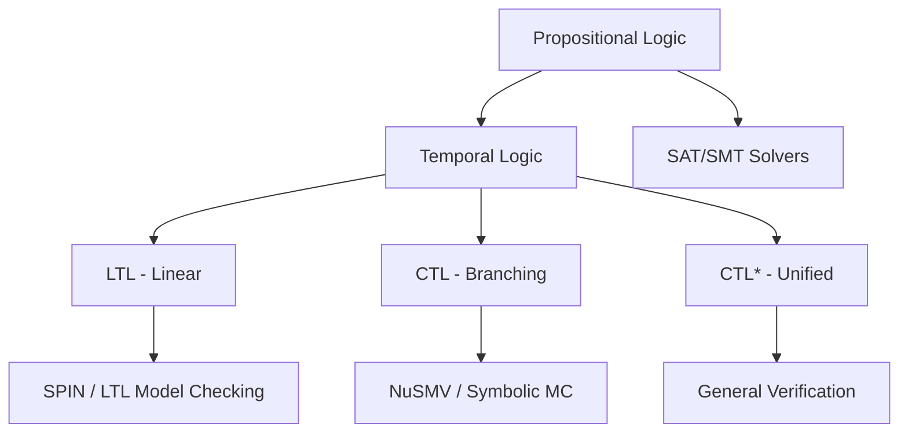
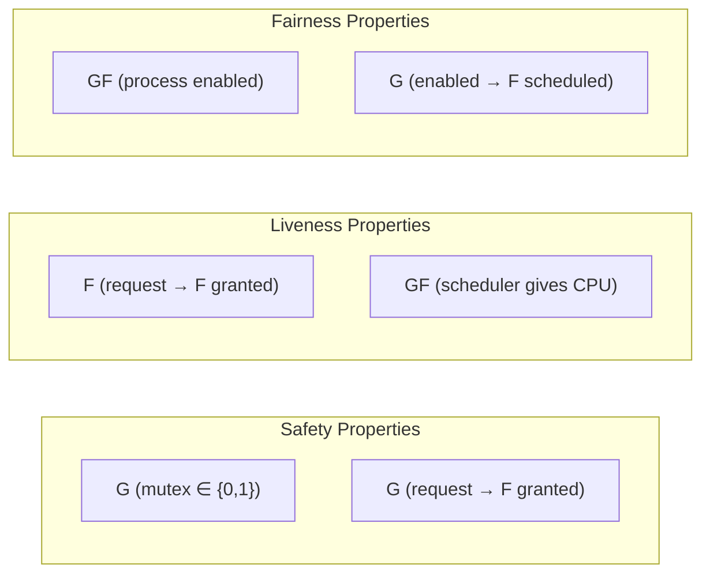
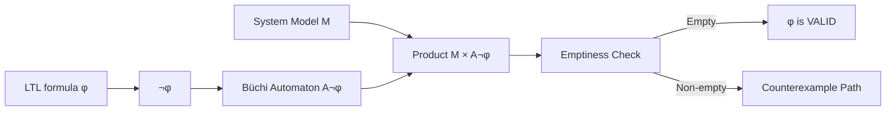
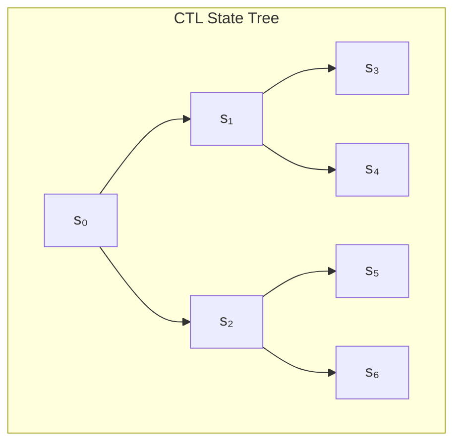
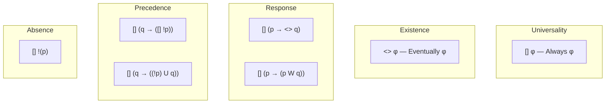
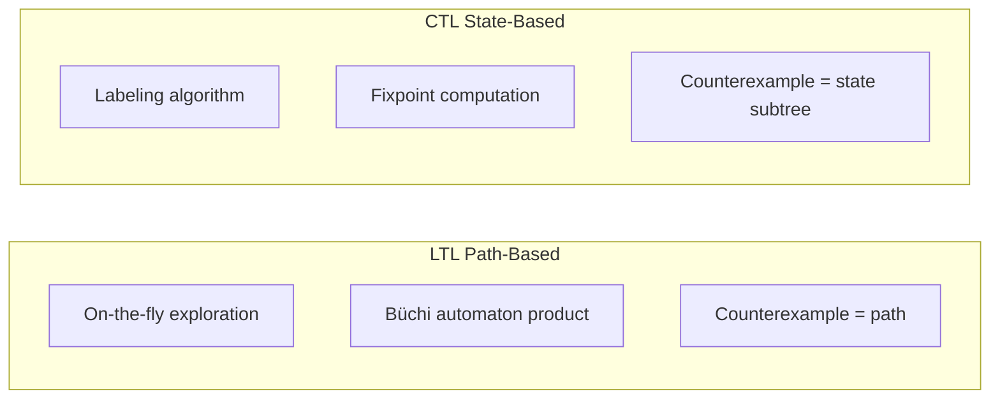

# Temporal Logic

## Overview

Temporal logic extends classical logic with operators for reasoning about the **ordering of events over time**. While propositional logic reasons about truth in a single state, temporal logic reasons about truth across sequences of states — enabling specification of properties like "every request eventually receives a response" or "the mutex is never held by two processes simultaneously." Temporal logic is the specification language of choice for model checking and has been used to verify hardware designs, communication protocols, distributed systems, and concurrent software.

## Why Temporal Logic?

Classical logical operators (AND, OR, NOT, IMPLIES) operate within a single state. System correctness, however, depends on behavior over time: liveness (something good eventually happens), safety (something bad never happens), and fairness (no component is starved). Temporal logic provides precise, unambiguous notation for these temporal properties.



## Linear Temporal Logic (LTL)

### Syntax

LTL formulas are built from atomic propositions using classical connectives and temporal operators. LTL reasons about individual execution paths (linear time).

**Temporal operators:**

| Operator | Symbol | Meaning | Natural Language |
|----------|--------|---------|-----------------|
| Next | **X** φ | φ holds in the next state | "In the next state, φ is true" |
| Globally | **G** φ | φ holds in all states (now and forever) | "φ is always true" |
| Eventually | **F** φ | φ holds in some future state | "φ will eventually be true" |
| Until | **φ U ψ** | φ holds until ψ becomes true (and ψ eventually holds) | "φ is true until ψ happens" |
| Release | **φ R ψ** | ψ holds until φ becomes true (and ψ may hold forever) | "ψ holds until and unless φ releases it" |

**Derived operators:**
- `F φ` ≡ `true U φ` — φ is eventually true
- `G φ` ≡ `¬F¬φ` — φ is always true
- `φ W ψ` ≡ `(φ U ψ) ∨ G φ` — "weak until": φ holds until ψ or forever

### Semantics

LTL formulas are evaluated over infinite sequences of states `π = s₀, s₁, s₂, ...` (called ω-words). The semantics define when a formula is satisfied by a path:

- `(π, i) ⊨ X φ` iff `(π, i+1) ⊨ φ` — φ holds at the next position
- `(π, i) ⊨ G φ` iff for all `j ≥ i`, `(π, j) ⊨ φ` — φ holds at all future positions
- `(π, i) ⊨ F φ` iff there exists `j ≥ i` such that `(π, j) ⊨ φ` — φ holds at some future position
- `(π, i) ⊨ φ U ψ` iff there exists `j ≥ i` such that `(π, j) ⊨ ψ` and for all `k` with `i ≤ k < j`, `(π, k) ⊨ φ`

### Common LTL Patterns



| Pattern | LTL Formula | Meaning |
|---------|------------|---------|
| **Absence of deadlock** | `G F (progress)` | Infinitely often, progress occurs |
| **Mutual exclusion** | `G ¬(cs₁ ∧ cs₂)` | Two processes never in critical section together |
| **Every request gets a response** | `G (request → F response)` | Whenever a request is made, a response eventually follows |
| **No starvation** | `G F (process_scheduled)` | The process is scheduled infinitely often |
| **Exactly once delivery** | `G (sent → X sent ∨ delivered)` | A sent message is either re-sent or delivered next step |
| **Invariance** | `G φ` | φ always holds |
| **Response** | `G (p → F q)` | Every p is eventually followed by q |
| **Precedence** | `G (q → (¬p S q))` | q must precede p (strictly before) |
| **Correlation** | `G (p → (X q ∨ X X q))` | p is followed by q within 2 steps |

### LTL Model Checking via Büchi Automata

The standard algorithm for LTL model checking converts the negation of the LTL formula into a **Büchi automaton**, then checks the product of this automaton with the system model for emptiness.



1. **Negate** the LTL property `φ` to get `¬φ`
2. **Translate** `¬φ` to a Büchi automaton that accepts exactly the paths satisfying `¬φ`
3. **Compute the product** of the system model M and the Büchi automaton
4. **Check emptiness**: if the product has no accepting cycle, `φ` holds in all paths of M
5. If non-empty, extract a counterexample from the accepting cycle

### SPIN and LTL

SPIN (Simple Promela Interpreter) is the most widely used LTL model checker. It translates Promela models to Büchi automata and performs on-the-fly verification. The LTL-to-Büchi translation is done by the `ltl2ba` or `ltl2tgba` tools.

```promela
/* Mutual exclusion with weak fairness */
bool turn = 0;
bool want[2] = [false, false];

active proctype p0() {
    do
    :: atomic { want[0] = true; turn = 1;
                (want[1] == false || turn == 0) ->
                /* critical section */
                want[0] = false; }
    od
}

active proctype p1() {
    do
    :: atomic { want[1] = true; turn = 0;
                (want[0] == false || turn == 1) ->
                /* critical section */
                want[1] = false; }
    od
}

ltl safety { [] !(want[0] && want[1]) }
ltl liveness { [] (want[0] -> <> !want[0]) }
ltl liveness2 { [] (want[1] -> <> !want[1]) }
```

## Computation Tree Logic (CTL)

### Key Difference from LTL

While LTL quantifies over paths implicitly (all paths, for each path), CTL makes the path quantifier **explicit**. CTL formulas use path quantifiers `A` (for all paths) and `E` (there exists a path) paired with temporal operators.



| Quantifier | Meaning |
|-----------|---------|
| **A** φ | φ holds on **all** paths from the current state |
| **E** φ | φ holds on **some** path from the current state |

### CTL Syntax

CTL formulas combine path quantifiers with temporal operators:

| Operator | Symbol | Meaning |
|----------|--------|---------|
| AX φ | `A X φ` | On all next states, φ holds |
| EX φ | `E X φ` | There exists a next state where φ holds |
| AG φ | `A G φ` | On all paths, φ holds globally |
| EG φ | `E G φ` | On some path, φ holds globally |
| AF φ | `A F φ` | On all paths, φ eventually holds |
| EF φ | `E F φ` | On some path, φ eventually holds |
| A[φ U ψ] | `A (φ U ψ)` | On all paths, φ holds until ψ |
| E[φ U ψ] | `E (φ U ψ)` | On some path, φ holds until ψ |

### Important: LTL and CTL Are Incomparable

Neither LTL nor CTL is a subset of the other:

- **AF p** (on all paths, p eventually holds) cannot be expressed in LTL
- **F G p** (eventually p holds forever) cannot be expressed in CTL

This motivates **CTL\***, which subsumes both.

### CTL Model Checking Algorithm

CTL model checking uses a **labeling algorithm** that computes the set of states satisfying each subformula, starting from atomic propositions and working up. This avoids Büchi automata construction entirely.

```
// Fixpoint computation for AG φ:
// AG φ holds in states from which all paths forever satisfy φ
// Algorithm: AG φ = states not in EF ¬φ
label(AG φ):
    Sat = S  // all states
    changed = true
    while changed:
        changed = false
        for each s in Sat:
            if NOT (φ(s) AND all successors of s are in Sat):
                remove s from Sat
                changed = true
    return Sat
```

## CTL*: The Unified Logic

CTL* allows arbitrary nesting of path quantifiers and temporal operators, unifying LTL and CTL. Every LTL and CTL formula is a CTL* formula.

```
CTL* Syntax:
State formulas:  φ ::= p | ¬φ | φ ∧ φ | E ψ | A ψ
Path formulas:   ψ ::= φ | X ψ | F ψ | G ψ | φ U ψ

LTL = { A ψ | ψ is a path formula }  (implicit universal quantification)
CTL = { path quantifier immediately followed by temporal operator }
```

| Logic | Expressiveness | Model Checking Complexity | Key Tools |
|-------|---------------|-------------------------|-----------|
| **CTL** | Strict subset of CTL* | PSPACE-complete | NuSMV, nuXmv |
| **LTL** | Incomparable with CTL (subset of CTL*) | PSPACE-complete | SPIN, Plato |
| **CTL*** | Most expressive | 2EXPTIME-complete | NuSMV (limited) |

## Specification Patterns

Dwyer, Avrunin, and Corbett (1998) identified a catalog of recurring specification patterns commonly used in practice:



| Scope | LTL Pattern | CTL Pattern | Usage |
|-------|------------|-------------|-------|
| **Globally** | `G φ` | `AG φ` | Invariant — φ always holds |
| **Before** | `G (p → ¬φ U q)` | `AG (p → A[¬φ U q])` | φ doesn't happen before q when p holds |
| **After** | `G (q → G φ)` | `AG (q → AG φ)` | After q, φ always holds |
| **Between** | `G (p → (¬φ W q)) ∧ G (q → (¬φ W p))` | Complex CTL | φ doesn't happen between p and q |
| **After-until** | `G (p → (¬φ W (q ∧ G φ)))` | Complex CTL | After p, φ holds until q, then forever |

## Expressing Properties: Practical Examples

### Dining Philosophers (Deadlock Freedom)

```
// LTL: No deadlock — at least one philosopher eventually eats
ltl no_deadlock { <> (philosopher_eating) }

// CTL: In every reachable state, at least one philosopher can eventually eat
AG EF philosopher_eating

// LTL: Every philosopher eats infinitely often
ltl fairness { [] <> (p1_eats) && [] <> (p2_eats) && [] <> (p3_eats) }
```

### Producer-Consumer (Bounded Buffer)

```
// LTL: The buffer never overflows
ltl no_overflow { [] (count <= N) }

// LTL: Every produced item is eventually consumed
ltl delivery { [] (produce(x) -> <> consume(x)) }

// LTL: The consumer never reads from an empty buffer
ltl no_empty_read { [] (read -> count > 0) }
```

### Two-Phase Commit (Atomicity)

```
// LTL: If a participant votes commit, it eventually decides
ltl commit_liveness { [] (vote_commit -> <> decided) }

// LTL: If one participant aborts, all eventually abort
ltl atomic_abort { [] (abort -> <> all_abort) }

// CTL: It is possible for all participants to commit
EF AG all_committed
```

## Practical Considerations

### Weak vs Strong Fairness

Fairness assumptions control which paths are considered during verification:

| Fairness Type | Definition | Effect |
|---------------|-----------|--------|
| **Unconditional** (no fairness) | Consider all paths | May report spurious violations of liveness |
| **Weak fairness** | If a transition is continuously enabled, it is eventually taken | Rules out starvation from continuous scheduling |
| **Strong fairness** | If a transition is infinitely often enabled, it is eventually taken | Rules out starvation even with intermittent scheduling |

Weak fairness is often sufficient for modeling schedulers that don't intentionally starve processes. Strong fairness is needed for modeling systems where processes compete for shared resources and may be preempted.

### Model Checking Temporal Properties: LTL vs CTL



| Feature | LTL | CTL |
|---------|-----|-----|
| **Philosophy** | Linear paths | Branching computation tree |
| **Algorithm** | Büchi automata + emptiness | Fixpoint labeling |
| **Memory** | Path-based, can be on-the-fly | Requires storing state labels |
| **Counterexample** | Single execution trace | Tree of states showing the bug |
| **Tool support** | SPIN, Plato | NuSMV, nuXmv, Cadence SMV |

## Interview Questions

### Q1: What is the difference between safety and liveness properties?

Safety properties state that "something bad never happens" and can be refuted by a finite prefix of an execution (e.g., mutual exclusion). Liveness properties state that "something good eventually happens" and can only be refuted by examining infinite executions (e.g., every request gets a response). Formally, safety corresponds to `G ¬bad` and liveness to `F good` (or `G F good` for strong liveness).

### Q2: How do you model check an LTL property?

The standard approach: negate the LTL formula, translate it to a Büchi automaton, compute the synchronous product of this automaton with the system model, and check the product for accepting cycles. If no accepting cycle exists, the original property holds. If an accepting cycle exists, extract a counterexample trace from it.

### Q3: Why are LTL and CTL incomparable? Give examples.

`AF p` (on all computation paths, p eventually holds) is expressible in CTL but not LTL, because LTL implicitly quantifies over a single path. `F G p` (eventually p holds forever) is expressible in LTL but not CTL, because CTL requires each temporal operator to be immediately preceded by a path quantifier. CTL* unifies both.

### Q4: What is weak fairness and when is it needed?

Weak fairness assumes that if a transition is continuously enabled, it will eventually be taken. Without fairness assumptions, a model checker may find spurious counterexamples where a process is "starved" because the scheduler never selects it. Weak fairness is the minimum needed to prove meaningful liveness properties in concurrent systems.

## Related Topics

- [Model Checking](./model-checking.md) — The verification technique that uses temporal logic
- [Distributed Verification](./distributed-verification.md) — TLA+ specifications for distributed protocols
- [Concurrency](../concurrency/overview.md) — Race conditions, deadlock — the bugs temporal logic catches
