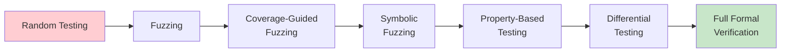
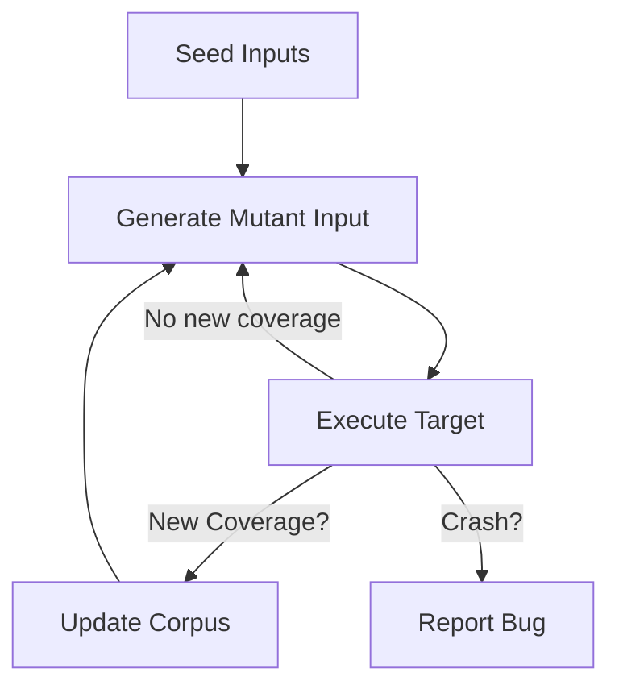
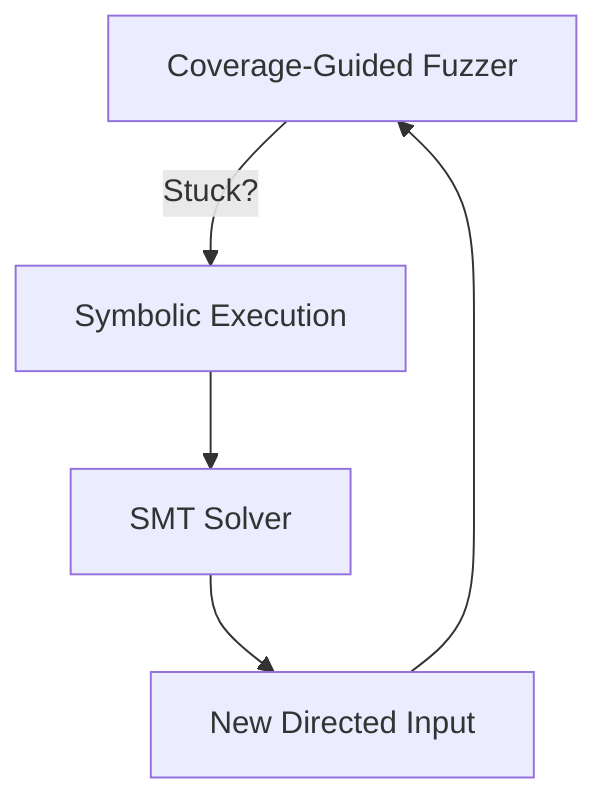
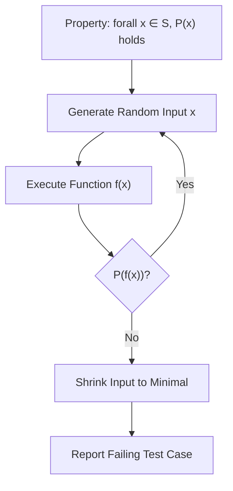
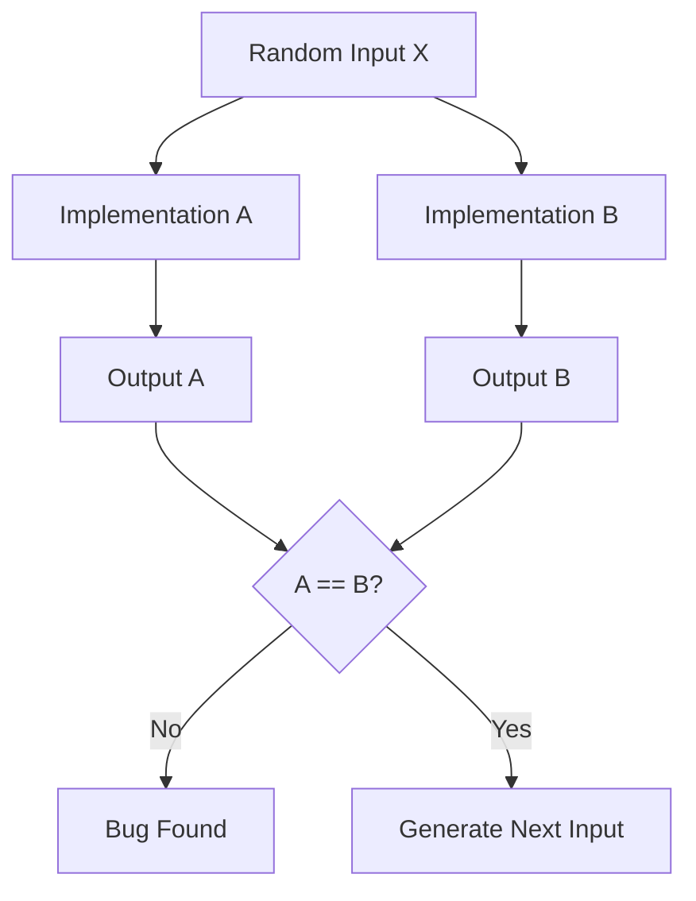
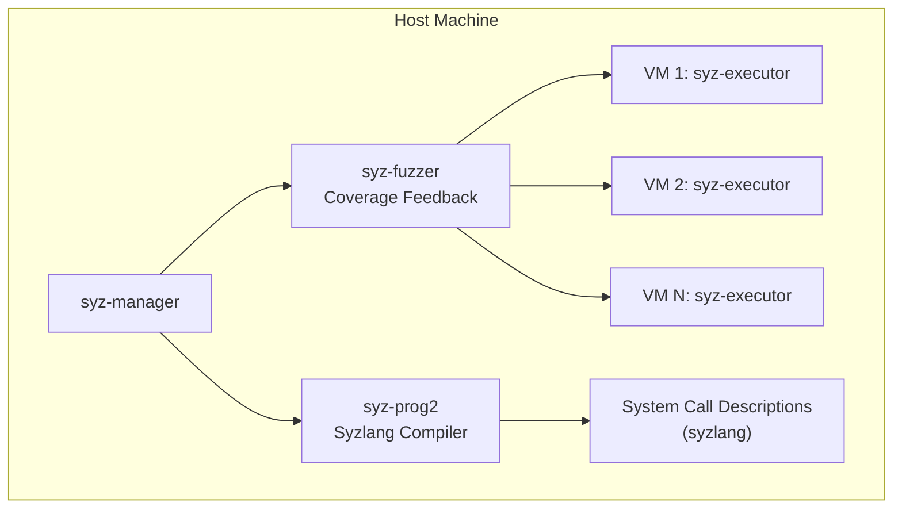

# Testing + Formal Methods

## Overview

The boundary between testing and formal methods is increasingly blurred. Modern approaches combine the efficiency and practicality of testing with the rigor of formal specifications, producing hybrid techniques that offer the best of both worlds. This chapter covers fuzzing with formal methods, differential testing, metamorphic testing, property-based testing, QuickCheck, grammar-based fuzzing, coverage-guided fuzzing, symbolic fuzzing, kernel fuzzing with syzkaller, and how these techniques leverage formal specifications to find bugs that conventional testing misses.

## The Testing Spectrum: From Random to Formal



| Approach | Specification Required | Automation | Bug Finding vs Proof | Cost |
|----------|----------------------|------------|---------------------|------|
| **Random testing** | None | Full | Bug finding only | Low |
| **Coverage-guided fuzzing** | Minimal (crashes) | Full | Bug finding only | Low-Medium |
| **Symbolic fuzzing** | Preconditions | Semi | Bug finding + reachability | Medium |
| **Property-based testing** | Properties (formal-ish) | Semi-auto | Bug finding + some proof | Medium |
| **Differential testing** | Reference implementation | Semi-auto | Semantic equivalence bugs | Medium |
| **Formal verification** | Full specification | Manual/Semi | Proof of correctness | High |

## Coverage-Guided Fuzzing

### Core Mechanism

Coverage-guided fuzzing (CGF) is the dominant fuzzing technique in industry. It instruments the target program to track code coverage, then uses evolutionary algorithms to generate inputs that maximize coverage. Inputs that discover new code paths are prioritized for mutation and further exploration.



### Mutation Strategies

| Mutation Type | Description | Example |
|---------------|-------------|---------|
| **Bit/byte flip** | Flip individual bits or bytes | Change byte at offset 7 from 0x41 to 0x40 |
| **Arithmetic** | Add/subtract small constants to integers | Increment/decrement integers by 1, -1, etc. |
| **Dictionary insertion** | Insert known-interesting values | `MAX_INT`, `NULL`, `"Content-Type"` |
| **Splice** | Combine parts of different corpus inputs | Take first half of input A, second half of input B |
| **Havoc** | Random overwrite of byte regions | Replace bytes at offsets 3-5 with random values |

### Instrumentation

Coverage-guided fuzzers track coverage using SanitizerCoverage (Sancov), which provides several coverage modes:

| Coverage Mode | Granularity | Performance | Effectiveness |
|--------------|-------------|-------------|---------------|
| **Edge coverage** | Branch transitions (A→B) | Good | Most common, highly effective |
| **Basic block coverage** | Blocks executed | Best | Less precise than edge |
| **Comparison coverage** | Tracked comparison operands | Moderate | Finds magic numbers |
| **Function coverage** | Functions called | Best | Too coarse |

### Major Tools

| Tool | Language | Key Innovation | Used By |
|------|----------|---------------|---------|
| **AFL (American Fuzzy Lop)** | Binary | Fork-server, compile-time instrumentation | Broad adoption |
| **LibFuzzer** | LLVM | In-process fuzzing, sanitizers integration | Google, LLVM ecosystem |
| **Honggfuzz** | Binary | Hardware-based feedback ( Perf, PT) | Security researchers |
| **Jazzer** | Java | LibFuzzer-compatible for JVM | Google |
| **Atheris** | Python | Coverage-guided fuzzing for CPython | Google |

### LibFuzzer Example

```cpp
// target.cc
#include <stdint.h>
#include <stddef.h>

extern "C" int LLVMFuzzerTestOneInput(const uint8_t *data, size_t size) {
    if (size < 4) return 0;  // too short

    int32_t magic = *(int32_t *)data;
    if (magic == 0xDEADBEEF) {
        // Bug: buffer underflow when magic value matches
        if (size >= 100) {
            char buf[10];
            memcpy(buf, data + 90, 10);  // potential OOB if size < 100
        }
    }
    return 0;
}

// Build: clang++ -fsanitize=fuzzer,address target.cc -o fuzzer
// Run:   ./fuzzer -max_len=1024 -timeout=10
```

## Symbolic Fuzzing

### Combining Fuzzing with Symbolic Execution

Symbolic fuzzing (also called hybrid fuzzing or smart fuzzing) combines the speed of coverage-guided fuzzing with the analytical power of symbolic execution. When the fuzzer gets stuck (unable to discover new coverage through mutation), it invokes a symbolic execution engine to solve for inputs that would take uncovered branches.



### Tools

| Tool | Technique | Strength |
|------|-----------|----------|
| **SAGE** (Microsoft) | Dynamic symbolic execution + directed fuzzing | White-box fuzzing at scale |
| **Driller** (DARPA CGC) | Combines AFL + angr | Won DARPA CGC |
| **KLEE-based fuzzer** | KLEE + coverage feedback | Academic hybrid |
| **Fuzzolic** | LLVM-based, QF_BV solver | Efficient bit-vector solving |

## Grammar-Based Fuzzing

### Motivation

Many input formats have complex syntactic structure (JSON, XML, SQL, programming languages). Blind byte-level mutation (as in AFL/LibFuzzer) is inefficient for these formats because most random mutations produce syntactically invalid inputs that are rejected by the parser before reaching interesting code.

Grammar-based fuzzing uses a **context-free grammar** to generate syntactically valid inputs, focusing mutations on semantic content rather than syntactic structure.

### Grammar-Guided Generation

```ebnf
<!-- Grammar for a simple HTTP request -->
request     ::= method SP uri SP version CRLF headers CRLF body
method      ::= "GET" | "POST" | "PUT" | "DELETE"
uri         ::= "/" path
path        ::= segment ("/" segment)*
segment     ::= alpha (alpha | digit)*
headers     ::= header (CRLF header)* CRLF
header      ::= name ":" SP value
body        ::= string | empty
```

Instead of randomly mutating bytes, the fuzzer mutuates the grammar's non-terminals — generating diverse but syntactically valid requests that explore the parser and request handler logic.

### Tools

| Tool | Grammar Format | Target | Key Feature |
|------|---------------|--------|-------------|
| **GramFuzzer** | EBNF | Any format | Automatic grammar inference from seeds |
| **FuzzedDataProvider** | Manual rules | C++ (LibFuzzer) | Google's structured input generation |
| **protobuf mutator** | Protocol Buffers | Protocol-based APIs | Structure-aware fuzzing |
| **Jazzer.js** | JSON Schema | JavaScript | Grammar-based JS fuzzing |
| **Nautilus** | CFG | Any | Deep (coverage-guided) grammar fuzzing |

## Property-Based Testing

### Concept

Property-based testing (PBT) specifies the expected behavior of a function as **properties** that should hold for all valid inputs, rather than testing specific input-output pairs. The testing framework automatically generates random inputs and checks the properties. When a property fails, the framework automatically **shrinks** the failing input to a minimal counterexample.



### PBT vs Unit Testing

| Dimension | Unit Testing | Property-Based Testing |
|-----------|-------------|----------------------|
| **Input** | Hand-chosen examples | Automatically generated (random) |
| **Scope** | Tests specific cases | Tests all (random sample of) valid inputs |
| **Specification** | Expected output per input | Properties that must always hold |
| **Bug detection** | Only catches known failure modes | Can find unexpected edge cases |
| **Maintenance** | Add new tests for new bugs | Properties often catch future bugs automatically |

### QuickCheck (Haskell)

QuickCheck, developed by Koen Claessen and John Hughes (1999), is the original property-based testing framework. It is built on the idea of defining testable properties and automatically generating random inputs.

```haskell
import Test.QuickCheck

-- Property: reverse is involutive
prop_reverse_involution :: [Int] -> Bool
prop_reverse_involution xs = reverse (reverse xs) == xs

-- Property: sort is idempotent
prop_sort_idempotent :: [Int] -> Bool
prop_sort_idempotent xs = sort (sort xs) == sort xs

-- Property: length of reverse equals length of original
prop_reverse_length :: [Int] -> Bool
prop_reverse_length xs = length (reverse xs) == length xs

-- Property: map distributes over composition
prop_map_compose :: (Int -> Int) -> (Int -> Int) -> [Int] -> Bool
prop_map_compose f g xs = map (f . g) xs == map f (map g xs)

-- Run: quickCheck prop_reverse_involution
-- If it fails, QuickCheck shrinks the failing input automatically
```

### QuickCheck in Other Languages

| Language | Framework | Key Feature |
|----------|-----------|-------------|
| **Haskell** | QuickCheck | Original, most mature shrinking |
| **Erlang** | QuickCheck (Quviq) | Stateful property-based testing |
| **Scala** | ScalaCheck | Port of QuickCheck |
| **Python** | Hypothesis | Advanced shrinking, state machine testing |
| **JavaScript** | fast-check | Property-based testing for JS/TS |
| **Rust** | Proptest | Strategy-based generation + shrinking |
| **Java** | jqwik | JUnit 5 integration |
| **C/C++** | rapidcheck | Header-only, integrates with test frameworks |
| **Go** | rapid | QuickCheck-like for Go testing |

### Hypothesis (Python) Example

```python
from hypothesis import given, strategies as st, assume

# Property: sorted list contains same elements as original
@given(st.lists(st.integers()))
def test_sort_preserves_elements(lst):
    assert sorted(lst) == sorted(lst)  # trivial; better:
    assert multiset(sorted(lst)) == multiset(lst)

# Property: string round-trip through JSON
@given(st.dictionaries(
    keys=st.text(min_size=1),
    values=st.integers()
))
def test_json_roundtrip(data):
    import json
    serialized = json.dumps(data)
    deserialized = json.loads(serialized)
    assert deserialized == data

# Property: BST invariant after insertions
@given(st.lists(st.integers()))
def test_bst_invariant(values):
    bst = BST()
    for v in values:
        bst.insert(v)
    # Verify BST property: left < root < right for all nodes
    assert bst.is_valid_bst()
```

### Common Property Patterns

| Pattern | Property | Example |
|---------|----------|---------|
| **Round-trip** | `decode(encode(x)) == x` | JSON serialize/deserialize |
| **Involution** | `f(f(x)) == x` | `reverse(reverse(x)) == x` |
| **Idempotence** | `f(f(x)) == f(x)` | `sort(sort(x)) == sort(x)` |
| **Equivalence** | `f_imperative(x) == f_functional(x)` | Two implementations agree |
| **Monotonicity** | `x ≤ y → f(x) ≤ f(y)` | Monotone functions |
| **Consistency** | `f(x, y) == g(y, x)` | Commutative operations |
| **Distributivity** | `f(g(x), g(y)) == g(f(x, y))` | Map over composition |

## Differential Testing

### Concept

Differential testing finds bugs by comparing the outputs of two or more implementations of the same specification. If the outputs differ for the same input, at least one implementation has a bug. This technique is powerful because it requires no formal specification — the reference implementation itself serves as the oracle.



### Famous Applications

| Project | What Was Tested | Implementation |
|---------|---------------|-----------------|
| **MySQL fuzzing** (2016) | SQL query engine | MySQL vs PostgreSQL |
| **PHP fuzzer** (2015) | PHP interpreter | PHP 5 vs HHVM |
| **JavaScript engines** | JS semantics | V8 vs SpiderMonkey vs JavaScriptCore |
| **SQLite differential** | SQL engine | SQLite vs PostgreSQL |
| **Nginx vs Apache** | HTTP server behavior | Nginx vs Apache responses |

SQLite's differential testing infrastructure (led by Richard Hipp) uses 600+ million generated SQL queries to compare SQLite against PostgreSQL, MySQL, and Oracle. This has found dozens of bugs over the years.

## Metamorphic Testing

### Concept

Metamorphic testing (MT) is used when the **oracle problem** makes it hard to determine the correct output for a given input. Instead of checking f(x) == expected, MT checks that a **metamorphic relation** holds between the outputs of related inputs.

```
Metamorphic relation: if x₁ → y₁ and x₂ = transform(x₁), then y₂ = transform(y₁)
```

This is especially useful for:
- **Machine learning** (no deterministic "correct" output)
- **Scientific computing** (numerical precision issues)
- **Search engines** (no single "correct" ranking)
- **Compilers** (optimizations should preserve semantics)

### Common Metamorphic Relations

| Pattern | Input Relation | Expected Output Relation |
|---------|---------------|--------------------------|
| **Additive** | `f(x + Δ) = f(x) + Δ` | `f(x+1) = f(x) + 1` |
| **Multiplicative** | `f(kx) = k·f(x)` | `f(2x) = 2·f(x)` |
| **Permutative** | `f(permute(x)) = permute(f(x))` | Sort is order-independent |
| **Commutative** | `f(x, y) = f(y, x)` | Addition is commutative |
| **Incremental** | `f(x₁) then f(x₁ ∪ x₂) = f(x₁ ∪ x₂)` | Insert-then-lookup |
| **Inverse** | `f(f⁻¹(x)) = x` | Compress then decompress |

### Example: Testing a Search Function

```python
# Metamorphic relation: adding a document to a corpus
# should not change results for queries that don't match the new doc

def test_search_add_document():
    query = "quantum computing"
    results_before = search(corpus, query)
    corpus.add_document("A recipe for chocolate cake")
    results_after = search(corpus, query)
    # The irrelevant document should not affect results
    assert set(results_before) == set(results_after)
```

## Kernel Fuzzing: Syzkaller

### Overview

syzkaller is Google's unsupervised coverage-guided kernel fuzzer. It generates system calls that exercise the Linux kernel, finding crashes, memory corruptions, and security vulnerabilities. Since its introduction, syzkaller has found hundreds of bugs in the Linux kernel, Android, and other OS kernels.

### Architecture



### syzlang: Describing System Calls

```
// syzlang description for socket operations
resource sock[int32]

socket$inet_tcp(domain const[AF_INET], type const[SOCK_STREAM], proto const[IPPROTO_TCP]) sock
bind$inet(fd sock, addr ptr[in, sockaddr_in], addrlen const[32]) int32
listen(fd sock, backlog int16) int32
accept4(fd sock, addr ptr[out, sockaddr_in], addrlen ptr[inout, int32], flags const[0]) sock

connect$inet(fd sock, addr ptr[in, sockaddr_in], addrlen const[32]) int32
send(fd sock, buf ptr[in, array[int8, 1000]], len int32[0:1000], flags const[0]) int32
```

### Why Kernel Fuzzing is Different

| Aspect | User-Space Fuzzing | Kernel Fuzzing |
|--------|-------------------|---------------|
| **Crash handling** | Process crashes, core dump | Kernel panic/oops, system hangs |
| **Isolation** | Sandbox prevents damage | Must use VMs for isolation |
| **State complexity** | Per-process state | Global kernel state (devices, filesystems, networking) |
| **Reproducibility** | Deterministic replay | Requires C repro (crash reproduction tool) |
| **Interface** | Function/API boundary | System calls (hundreds of parameters) |

### Syzkaller Achievements

syzkaller has discovered:
- **Hundreds** of Linux kernel vulnerabilities (CVEs)
- Bugs in Android kernel ( Binder, ION, filesystem drivers)
- Bugs in network drivers (eBPF, TCP/IP stack)
- Bugs in filesystems (ext4, Btrfs, FUSE)
- Use-after-free and double-free bugs in kernel memory management

### Other Kernel Fuzzers

| Tool | Target | Approach |
|------|--------|----------|
| **kAFL** | Linux kernel | KVM-based, hardware coverage feedback |
| **Trinity** | Linux syscalls | Random syscall generation |
| **PerFuzzer** | Linux perf subsystem | Grammar-based perf event fuzzing |
| **Bochs-fuzzer** | x86 emulation | Fuzzing of x86 instruction handling |

## Fuzzing + Formal Methods Integration

### Formal Specifications as Fuzzing Oracles

The most powerful integration of fuzzing and formal methods uses formal specifications as **test oracles** for fuzzers:

```
// Instead of checking for crashes:
// fuzz_input → execute → check crash?

// With formal oracle:
// fuzz_input → execute → formal_oracle(input, output) → pass/fail?
```

| Integration | Description | Example |
|------------|-------------|---------|
| **Spec-based fuzzing** | Generate inputs satisfying a formal precondition, check postcondition | CBMC as fuzzer oracle |
| **Protocol fuzzing** | Use TLA+ / Alloy specs to generate valid protocol messages | FormalEthereum |
| **API fuzzing** | Use type schemas / contracts to generate valid API sequences | RESTler, Propy |
| **Compiler fuzzing** | Compare optimized vs unoptimized output | CSmith, Csmith + alive |

### CSmith: C Program Fuzzer

CSmith generates random but syntactically valid C programs designed to stress-test compiler optimizations. The generated programs are guaranteed to be well-defined (no undefined behavior), so any difference between two compilers is a compiler bug.

```
CSmith pipeline:
Generate random C program → Compile with GCC → Compile with Clang
→ Run both binaries → Compare outputs
→ If different: compiler bug!
```

## Comparison of Fuzzing Approaches

| Technique | Automation | Coverage | Oracle | Bug Types Found |
|-----------|------------|----------|--------|----------------|
| **Random fuzzing** | Full | Low | Crashes | Memory corruption |
| **Coverage-guided (AFL)** | Full | High | Crashes | Memory, logic bugs |
| **Symbolic fuzzing** | Full | Highest | Crashes + reachability | Deep bugs in complex logic |
| **Grammar-based** | Full | Medium | Crashes | Parser/handler bugs |
| **Property-based (PBT)** | Semi | Medium | Formal properties | Semantic/logic bugs |
| **Differential** | Semi | Medium | Reference implementation | Semantic divergence |
| **Metamorphic** | Semi | Medium | Metamorphic relations | Oracle-hard domains |
| **Kernel fuzzing (syzkaller)** | Full | High | Kernel panics | Kernel memory, UAF |

## Interview Questions

### Q1: How does coverage-guided fuzzing work?

Coverage-guided fuzzing instruments the target program to track code coverage (typically edge coverage). It maintains a corpus of seed inputs and generates new inputs by mutating existing ones. Inputs that discover new coverage edges are added to the corpus. Over time, this evolutionary process drives exploration toward uncovered code, finding bugs in rarely exercised paths.

### Q2: What is property-based testing and when is it better than unit tests?

Property-based testing specifies general properties that should hold for all valid inputs (e.g., `sort(sort(x)) == sort(x)`), rather than testing specific input-output pairs. It is better when: (1) the input space is too large for hand-written tests, (2) edge cases are hard to anticipate, (3) you want to verify algebraic properties, or (4) the framework provides automatic shrinking for minimal counterexamples.

### Q3: How does differential testing find compiler bugs?

Differential testing compiles the same source program with multiple compilers (e.g., GCC and Clang) and compares the outputs. If the same well-defined program produces different outputs from different compilers, at least one has a bug. CSmith generates random C programs guaranteed to be well-defined, making output differences clear compiler bugs rather than undefined behavior.

### Q4: What makes kernel fuzzing harder than user-space fuzzing?

Kernel fuzzing is harder because: (1) kernel crashes affect the entire system, requiring VM isolation; (2) the kernel has complex global state (devices, networking, processes); (3) the interface is system calls with hundreds of parameters and complex state machines; (4) state persists across calls, requiring long sequences of syscalls to reach deep code; (5) crashes may be unreproducible due to timing-dependent behavior.

### Q5: What is the oracle problem and how does metamorphic testing address it?

The oracle problem occurs when there is no clear way to determine the correct output for a given input (common in ML, scientific computing, search). Metamorphic testing addresses this by defining relations between the outputs of related inputs instead of comparing against an expected output. For example, if `f(x+1) - f(x) = 1` should hold, testing this relation doesn't require knowing the exact value of `f(x)`.

## Related Topics

- [Program Verification](./program-verification.md) — Symbolic execution, formal analysis
- [Verified Systems](./verified-systems.md) — Complementary to testing: proof vs testing
- [Distributed Verification](./distributed-verification.md) — Protocol fuzzing and verification
- [Security](../security/README.md) — Fuzzing for security vulnerabilities
- [Software Engineering](../software-engineering/testing.md) — General testing practices
