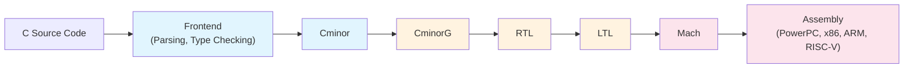
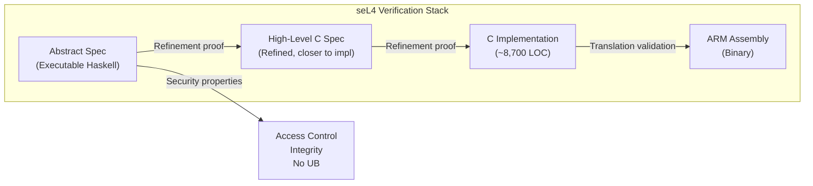
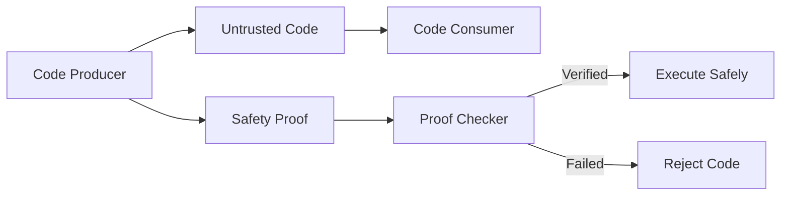
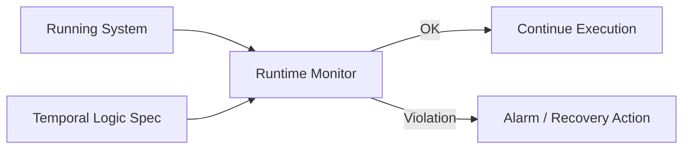
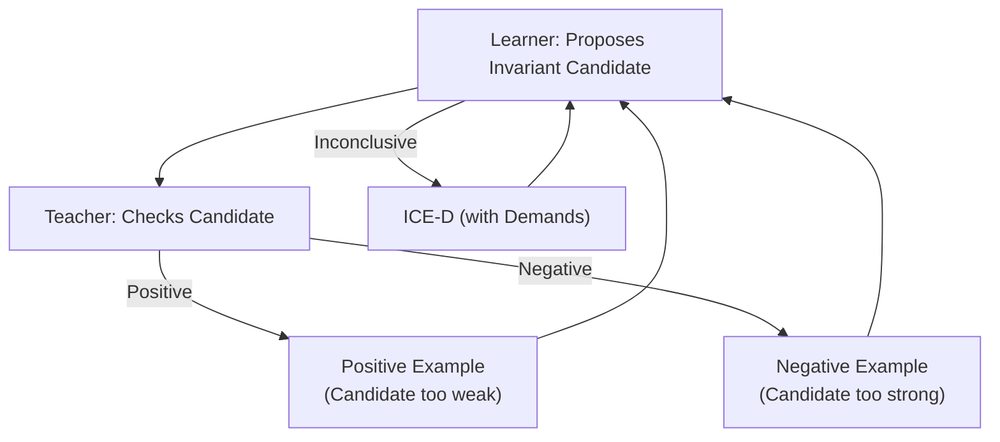
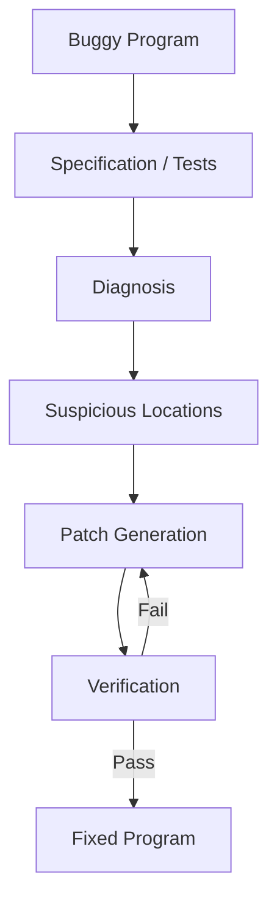

# Verified Systems

## Overview

Verified systems are software or hardware artifacts that have been formally proven to satisfy their specifications, often with machine-checked proofs. These represent the gold standard of software assurance: unlike testing (which can only find bugs) or even automated model checking (which may have modeling gaps), verified systems carry a mathematical proof of correctness that has been independently checked by a proof assistant. This chapter covers the landmark achievements in verified systems — CompCert (verified compiler), seL4 (verified microkernel), verified cryptography, proof-carrying code, runtime verification, specification mining, invariant inference, and automated program repair.

## Verified Compilers: CompCert

### The Problem

Compiler bugs are particularly insidious because they silently transform correct source code into incorrect machine code. Traditional compiler testing cannot guarantee absence of bugs because the set of possible programs is infinite. CompCert addresses this by proving that the compiler **preserves the semantics** of the source program.

### What CompCert Proves

CompCert is a verified optimizing C compiler developed by Xavier Leroy at INRIA. It is written and verified in Coq and proves the following theorem:

```
Theorem (comp correctness):
  If source program s compiles to target code t (without error),
  and s produces observable behavior v on input i,
  then t produces the same observable behavior v on input i.
```

In other words: **CompCert preserves the semantics of the source program**. If your C program works correctly, the compiled binary will too (modulo the formally specified subset of C that CompCert supports).



### CompCert's Passes and Proofs

Each compilation pass has a separate correctness proof:

| Pass | Transformation | Proof Size |
|------|---------------|-------------|
| **C → Cminor** | Remove complex control flow, simplify expressions | ~6,000 lines Coq |
| **Cminor → CminorG** | Introduce goto-based control flow | ~3,000 lines |
| **CminorG → RTL** | Instruction selection, register allocation | ~12,000 lines |
| **RTL → LTL** | Register scheduling, instruction scheduling | ~8,000 lines |
| **LTL → Mach** | Instruction selection, addressing modes | ~10,000 lines |
| **Mach → Assembly** | Code emission, fixup resolution | ~5,000 lines |

The entire proof is approximately **150,000 lines of Coq**. CompCert has been validated by finding real bugs in unverified compilers: it found bugs in GCC and LLVM that produced miscompiled code. CompCert itself has been tested extensively and no miscompilation bugs have been found in its verified passes.

> **Interview Angle**: "Has a verified compiler ever found bugs in mainstream compilers?" — Yes. CompCert's testing found miscompilation bugs in both GCC and LLVM. The CompCert team uses differential testing against GCC and Clang, and discrepancies revealed bugs in the unverified compilers.

### Other Verified Compilers

| Project | Language | Prover | Status |
|---------|----------|--------|--------|
| **CompCert** | C (large subset) | Coq | Production quality, used in industry |
| **CakeML** | ML (call-by-value) | HOL4 | Complete, formally verified |
| **Vellvm** | LLVM IR | Coq | Verified LLVM transformations |
| **Bedrock** | C (low-level) | Coq | Verified C programs + compiler |
| **Sail** | ISA specification | Isabelle/HOL, Coq | ARM, RISC-V ISA formal specs |

## Verified OS: seL4

### The seL4 Microkernel

seL4 is a high-performance microkernel for embedded and security-critical systems, developed at UNSW and Data61 (CSIRO). It is the **first general-purpose OS kernel with a machine-checked proof of implementation correctness**.

### What seL4 Proves

The seL4 verification establishes:

```
Theorem (seL4 correctness):
  1. Implementation correctness: The C implementation of seL4 correctly
     implements its abstract specification (high-level design).
  2. Access control: No process can access memory or capabilities
     it is not authorized to access.
  3. Integrity: A process cannot modify memory belonging to
     another process without explicit authorization.
  4. No undefined behavior: The C code has no buffer overflows,
     null pointer dereferences, or other undefined behavior.
```



### seL4 Verification Metrics

| Metric | Value |
|--------|-------|
| **Lines of C kernel code** | ~8,700 |
| **Lines of Isabelle proof** | ~200,000 |
| **Person-years of effort** | ~20 |
| **Formal proof effort** | ~8 person-years |
| **Performance overhead** | < 10% vs unverified L4 |
| **Supported architectures** | ARM, RISC-V, x86 |
| **Formalization tool** | Isabelle/HOL |

### Impact and Deployments

seL4 is used in:
- **Defense systems** (Australian Defence Force)
- **Autonomous vehicles** (Autocore with seL4)
- **DARPA SSITH** (Secure processor research)
- **Digital avionics** (certified to DO-178C assurance levels)

The formal proof was extended to prove **functional correctness of the kernel** (all system calls behave as specified) and **information flow security** (no covert channels through kernel-controlled resources).

## Verified Cryptography

### Why Verify Crypto?

Cryptographic implementations are notoriously difficult to get right. Side-channel attacks, constant-time requirements, and subtle mathematical properties make informal testing insufficient. Formal verification of cryptography has produced landmark results.

### HACL*: Verified Cryptographic Library

HACL* (High-Assurance Cryptographic Library) is a verified cryptographic library written in F* (F-Star), a language designed by Microsoft Research for verification. It includes verified implementations of:

| Algorithm Category | Algorithms |
|--------------------|-----------|
| **Symmetric** | AES-GCM, ChaCha20-Poly1305, SHA-256, SHA-512 |
| **Asymmetric** | Curve25519, Ed25519, P-256, RSA |
| **MAC** | HMAC-SHA256, Poly1305 |
| **KDF** | HKDF |

Each implementation is verified for:
- **Functional correctness**: The output matches the mathematical specification
- **Memory safety**: No buffer overflows or out-of-bounds reads
- **Secret independence**: Verified to execute in constant-time (no secret-dependent branches or memory accesses)
- **Side-channel resistance**: Proven absence of timing leaks

HACL* is deployed in **Microsoft Azure**, **Firefox**, and the **WireGuard** VPN implementation (via the Zinc library).

### Fiat-Crypto

Fiat-Crypto (based on work by Erbsen et al.) uses Coq to synthesize cryptographic primitive implementations from high-level specifications. Rather than hand-writing and verifying code, Fiat-Crypto **generates** correct-by-construction code for elliptic curve arithmetic, field operations, and number-theoretic functions.

```
// Fiat-Crypto pipeline:
Specification (Coq) → Proof of correctness → C/assembly extraction → Verified implementation
```

### Other Verified Crypto Projects

| Project | What It Verifies | Tool |
|---------|-----------------|------|
| **EverCrypt** | Cross-platform crypto dispatch (HACL* + OpenSSL + BoringSSL) | F* |
| **mlkem** | ML-KEM (Kyber) post-quantum KEM | Coq + Jasmin |
| **hs-to-coq** | Verification of Haskell crypto (monte-carlo rejection) | Coq |

## Proof-Carrying Code (PCC)

### Concept

Proof-Carrying Code (PCC), introduced by George Necula and Peter Lee (1996), is a mechanism for a code consumer (e.g., a host system) to verify that untrusted code is safe before executing it. The code producer attaches a **machine-checkable proof** that the code satisfies a safety policy. The consumer's proof checker verifies the proof — which is much faster than re-analyzing the code.



### PCC Architecture

| Component | Role |
|-----------|------|
| **Safety policy** | Formal specification of what constitutes safe code (e.g., no out-of-bounds access) |
| **Verification condition generator (VCG)** | Transforms code + annotations into logical obligations |
| **Proof** | Machine-checkable proof that the VCG obligations are satisfied |
| **Proof checker** | Simple, trusted verifier that checks the proof |
| **Code consumer** | Only needs to trust the proof checker (tiny TCB) |

### Foundational Proof-Carrying Code (FPCC)

FPCC extends PCC with a **foundational proof** that the proof checker itself is correct, eliminating the need to trust even the proof checker. The entire verification chain from machine code to safety property is proven within a single logic.

## Runtime Verification

### Concept

Runtime verification (RV) monitors a running system against a formal specification (often expressed in temporal logic) and detects violations at runtime. Unlike static verification (which proves correctness before deployment), RV provides guarantees during execution. It complements static methods by handling properties that depend on the runtime environment or that are impractical to verify statically.



### Monitorable Properties

| Property Class | Example | Monitoring Complexity |
|---------------|---------|----------------------|
| **Safety** | `G ¬(balance < 0)` | Finite memory, detects on violation |
| **Liveness** | `F (request → F response)` | Requires fairness assumption |
| **Response** | `G (lock → F unlock)` | Timeout-based approximation |
| **Invariance** | `G (state ∈ valid_states)` | Constant per-state check |

### Tools

| Tool | Specification Language | Integration | Use Case |
|------|----------------------|-------------|----------|
| **Rover** | JavaMOP / RV-LTL | Java bytecode instrumentation | Java application monitoring |
| **Larva** | ERE temporal logic | AspectJ weaving | Real-time systems |
| **LoLa** | Metric temporal logic | C library | Embedded systems |
| **Lynx** | Past-time LTL | Python | Web services |
| **TraceChecker** | TLA+ traces | CLI | Distributed systems post-mortem |

## Specification Mining

### Concept

Specification mining automatically extracts formal specifications from existing code or execution traces. This is useful for legacy code without documentation, for reverse-engineering APIs, and for generating test oracles.

### Approaches

| Approach | Input | Output | Technique |
|----------|-------|--------|-----------|
| **Dynamic mining** | Execution traces | Temporal logic formulas | Frequent itemset mining |
| **Static mining** | Source code | Pre/post conditions | Static analysis patterns |
| **Hybrid mining** | Code + traces | Precise specs | Combined analysis |

**Daikon** (Ernst et al.) is the most well-known dynamic specification miner. It infers program invariants (pre/post conditions, loop invariants) by running instrumented programs on a suite of test inputs and looking for properties that hold across all observed runs.

```
// Daikon might infer:
// Before foo(x): x != null && x.size() >= 0
// After  foo(x): \result != null && \result.size() == x.size()
```

**Mining specifications from traces:**

```
Traces observed:
  lock() → write() → unlock()
  lock() → read() → unlock()

Extracted specification:
  G (lock() → (write() U unlock()) ∨ (read() U unlock()))
  "After acquiring a lock, the next operation is either read or write, followed by unlock"
```

## Invariant Inference

Invariant inference is the process of automatically discovering loop invariants, data structure invariants, or protocol invariants without human guidance. This is one of the most challenging problems in program verification because invariants are not explicit in the code.

| Tool | Technique | What It Infers |
|------|-----------|---------------|
| **Daikon** | Dynamic observation | Pre/post conditions, object invariants |
| **InvGen** | Static analysis + CEGAR | Loop invariants via templates |
| **ICE** (Inference with Counterexamples) | Machine learning + SMT | Non-linear invariants |
| **Houdini** | Assume-guarantee inference | Method pre/post conditions |
| **Stellar** | Abstract interpretation | Precise numeric invariants |

### The ICE Learning Framework

The ICE (Incremental Correctness Engine) framework, developed by Garg et al., automates invariant inference through an interaction between a learner and a teacher:



The learner proposes invariant candidates, the teacher (verification tool) tests them against the program. If the candidate is too weak (positive counterexample: candidate holds but violates property) or too strong (negative counterexample: candidate doesn't hold but property is true), the learner refines. This continues until a valid invariant is found.

## Automated Program Repair

### Concept

Automated program repair (APR) combines verification techniques with code generation to automatically fix bugs. Given a program with a failing test suite or a violated specification, APR generates patches that satisfy the specification and pass the tests.



### APR Approaches

| Approach | Technique | Automation | Example Tools |
|----------|-----------|------------|---------------|
| **GenProg** | Genetic programming (mutation + crossover) | Fully automatic | GenProg |
| **SemFix** | Constraint-based (SMT) | Semi-automatic | SemFix, Angelix |
| **DirectFix** | Symbolic execution + synthesis | Semi-automatic | DirectFix |
| **Nopol** | Condition synthesis (SMT) | Semi-automatic | Nopol |
| **Prophet** | Learning-based patch prediction | Semi-automatic | Prophet |
| **Verified repair** | Proof-carrying patches | Manual + verified | Toccata |

### Example: Constraint-Based Repair

```
// Buggy code:
if (a > b) max = a;  else max = b;
// Bug: should be >= not >

// Repair process:
// 1. Generate constraint: find condition C such that
//    for all test inputs, the corrected code satisfies the spec
// 2. Express C as: α*a + β*b + γ >= 0
// 3. Use SMT solver to find α, β, γ that satisfy all test cases
// 4. Result: C = "a >= b" (α=1, β=-1, γ=0)
```

## Comparison of Verified Systems

| System | What is Verified | Proof Size | Tool | Impact |
|--------|------------------|------------|------|--------|
| **CompCert** | C compiler (17 passes) | ~150K LOC Coq | Coq | Found GCC/LLVM bugs, used in aerospace |
| **seL4** | Microkernel (8.7K LOC C) | ~200K LOC Isabelle | Isabelle/HOL | Deployed in defense, DARPA SSITH |
| **HACL*** | Crypto library | ~100K LOC F* | F* | Used in Azure, Firefox, WireGuard |
| **CakeML** | ML compiler + runtime | ~230K LOC HOL4 | HOL4 | Complete verified ML |
| **Quarantine** | Rust type system (for unsafe) | ~50K LOC Coq | Coq | Verified Rust memory safety |
| **FSCQ** | File system (C) | ~32K LOC Coq | Coq | Crash-consistent FS |

## Interview Questions

### Q1: What does CompCert prove and why does it matter?

CompCert proves that its compiled binary preserves the observable behavior of the source C program. This means if your C program is correct, the compiled code is guaranteed to be correct too — no silent miscompilation. This matters because compiler bugs are invisible to traditional testing and can introduce subtle security vulnerabilities.

### Q2: Why is seL4 significant?

seL4 is the first general-purpose OS kernel with a complete, machine-checked correctness proof. It proves that the C implementation matches its high-level specification, that access control is enforced, and that the code has no undefined behavior. This provides unprecedented assurance for security-critical applications like defense systems and autonomous vehicles.

### Q3: What is proof-carrying code?

Proof-carrying code is a mechanism where the code producer attaches a machine-checkable proof that the code satisfies a safety policy. The consumer only needs a small, trusted proof checker to verify the proof. This shifts the burden of verification to the code producer and minimizes the consumer's trusted computing base.

### Q4: How does runtime verification complement static verification?

Static verification happens before deployment and proves properties about all executions, but it can't verify properties that depend on the runtime environment (e.g., timing, available resources). Runtime verification monitors actual executions and detects violations at runtime. Together, static verification catches design errors and runtime verification catches deployment-specific violations.

### Q5: What is the difference between testing and verification?

Testing executes the program on specific inputs and checks outputs. It can find bugs but never prove their absence. Verification (formal methods) uses mathematical reasoning to prove that the program satisfies its specification for all possible inputs. Verification provides stronger guarantees but requires more effort and is limited by what can be formally specified.

## Related Topics

- [Model Checking](./model-checking.md) — Automated verification techniques
- [Program Verification](./program-verification.md) — Hoare logic, separation logic, symbolic execution
- [Testing + Formal Methods](./testing-formal.md) — Fuzzing, property-based testing
- [Distributed Verification](./distributed-verification.md) — Protocol verification
- [Security](../security/README.md) — Verified cryptography, secure systems
