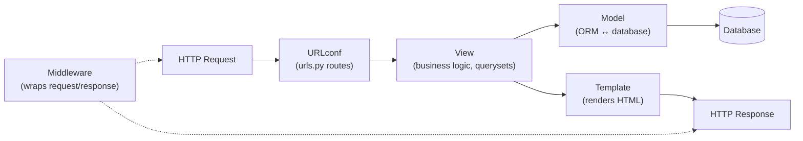
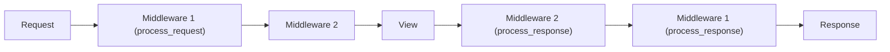

# Django

## Overview

Django is a **high-level, batteries-included Python web framework** (created 2003–2005, open-sourced 2005, maintained by the Django Software Foundation). Its philosophy: "the framework for perfectionists with deadlines" — it ships the full toolkit for a typical web app (ORM, admin, auth, forms, templating, migrations) rather than leaving you to assemble micro-libraries.

Django powers Instagram (heavily customized Django at scale), Disqus, Mozilla, Pinterest (historically), and countless internal tools and content platforms. It's a frequent interview topic for Python/backend roles, especially the **ORM**, **middleware**, and **MVC/MTV** architecture.

## Django's Architecture (MTV)

Django calls itself **MTV — Model, Template, View** (a flavor of MVC):



| Layer | Role |
|---|---|
| **Model** | Python classes mapping to DB tables (Django ORM) |
| **View** | Function or class handling a request; returns a response |
| **Template** | HTML with Django template language (Django's own, not Jinja2 by default) |
| **URLconf** | Central routing table mapping URLs → views |
| **Middleware** | Request/response hooks (auth, sessions, security headers, CSRF) |
| **Admin** | Auto-generated CRUD UI from models — a Django killer feature |

## The ORM

The ORM is Django's most distinctive feature: models are Python classes; schema comes from `makemigrations`/`migrate`; queries are lazy `QuerySet`s.

```python
from django.db import models

class Author(models.Model):
    name = models.CharField(max_length=100)

class Book(models.Model):
    title = models.CharField(max_length=200)
    author = models.ForeignKey(Author, on_delete=models.CASCADE, related_name="books")
    price = models.DecimalField(max_digits=6, decimal_places=2)

# Lazy querysets — evaluated only when iterated/consumed
books = Book.objects.filter(price__lt=20).select_related("author")
for book in books:                     # one query with JOIN, not N+1
    print(book.title, book.author.name)
```

### Lazy evaluation & the N+1 problem

`QuerySet`s are **lazy** — building a queryset runs no SQL; the DB is hit on iteration, slicing, `list()`, `len()`, `bool()`, or `exists()`. Each `QuerySet` is **cached** once evaluated.

The classic pitfall: accessing a related object per row causes **N+1 queries**. Fixes:

- `select_related()` — for `ForeignKey`/`OneToOne` (SQL JOIN, one query).
- `prefetch_related()` — for `ManyToMany`/reverse relations (separate queries, then Python-side joining).
- `values()`/`values_list()`, `annotate()`/`aggregate()` to push work into SQL.
- `only()`/`defer()` to avoid loading unused columns.

### Async ORM (Django 5.x, stable)

Django 4.1 added async queryset methods; Django 5.x stabilized them across backends:

```python
async def product_list(request):
    # filter() is lazy (no DB hit), so it has no async variant.
    # Filter synchronously, then iterate asynchronously:
    qs = Product.objects.filter(active=True)
    products = [p async for p in qs]
    return JsonResponse({"products": products})
```

`aget()`, `acreate()`, `aupdate()`, `adelete()`, `acount()`, `aexists()` — and `sync_to_async` when you must call sync ORM from async views. Note: `filter()` does NOT have an `afilter()` counterpart because it is lazy (returns a QuerySet without executing a query).

## Middleware

Middleware is a pipeline around request/response processing:



Built-in middleware: `SecurityMiddleware` (HTTPS/HSTS), `SessionMiddleware`, `CommonMiddleware`, `CsrfViewMiddleware`, `AuthenticationMiddleware`, `MessageMiddleware`, `GZipMiddleware`. Custom middleware can run code on `__call__` (get_response) — before the view, on the way out, and handle exceptions via `process_exception`.

## Authentication, Sessions, CSRF

- **Auth**: users, groups, permissions, password hashing (PBKDF2 default, bcrypt/argon2 options), pluggable backends.
- **Sessions**: stored server-side (DB, cache, file), referenced by a signed cookie — not JWT by default.
- **CSRF protection**: enabled by default via `CsrfViewMiddleware`; Django validates the `csrftoken` for unsafe methods (POST/PUT/DELETE) — a frequent interview question.
- **`LoginRequiredMiddleware`** (Django 5.1+) inverts the security posture: opt-out instead of opt-in per view.

## Security (Django is famous for this)

| Protection | Mechanism |
|---|---|
| **SQL injection** | ORM parameterization by default; raw SQL is opt-in |
| **XSS** | Auto-escaping in templates |
| **CSRF** | `CsrfViewMiddleware` + token |
| **Clickjacking** | `X-Frame-Options` header |
| **HSTS / HTTPS** | `SecurityMiddleware` |
| **Secrets** | `SECRET_KEY` never committed; use env vars |
| **Mass assignment** | Explicit `fields`/`forms.ModelForm` whitelist |

The Django security model's core idea: **safe by default** — you must explicitly opt out.

## Django REST Framework (DRF)

The de facto standard for JSON APIs: serializers, viewsets, routers, authentication (session/token/JWT via `djangorestframework-simplejwt`), permissions, throttling, and browsable API docs. Typical stack: Django + DRF + PostgreSQL + Redis cache + Celery for background jobs.

## Deployment & Ecosystem

| Piece | Role |
|---|---|
| **Gunicorn / uWSGI** | WSGI server (sync apps) |
| **Uvicorn / Daphne** | ASGI server (async apps, WebSockets) |
| **PostgreSQL** | Primary supported DB (with MySQL, SQLite, Oracle) |
| **Celery + Redis/RabbitMQ** | Background tasks (see [Celery](../../concurrency/overview.md)) |
| **WhiteNoise** | Static file serving |
| **Django Debug Toolbar** | Dev query/inspection tool |

## Interview Questions

### Q: What is the Django ORM and how does lazy evaluation work?

The ORM maps Python classes to DB tables and generates SQL. Querysets are lazy: building/filtering them issues no SQL; the query runs when the result is consumed (iteration, slicing, `list()`, `bool()`, etc.). This lets you compose filters efficiently, but you must know when evaluation happens to avoid N+1 query problems.

### Q: How do you fix the N+1 query problem in Django?

Use `select_related()` to JOIN `ForeignKey`/`OneToOne` relations into one query, and `prefetch_related()` for `ManyToMany`/reverse relations (fetched in separate queries, joined in Python). Where possible, push aggregation into SQL with `annotate()`/`aggregate()` and select only needed columns.

### Q: How does Django protect against SQL injection, XSS, and CSRF?

SQL injection: the ORM parameterizes all queries; raw SQL is an explicit, rare opt-in. XSS: templates auto-escape output. CSRF: `CsrfViewMiddleware` requires a valid token for unsafe methods, validated against the session. Django's philosophy is safe-by-default — protections are on unless you disable them.

### Q: Django vs Flask vs FastAPI — when would you choose each?

Django: large, opinionated apps needing auth, admin, ORM, and structure out of the box; the fastest path for CRUD-heavy products. Flask: minimal microframework, maximum flexibility for small/medium apps. FastAPI: async-first, OpenAPI/docs generation, strong typing — ideal for high-concurrency APIs and modern async workloads. There's overlap; the choice is about how much structure vs flexibility you want.

### Q: What is the difference between Django's MTV and classic MVC?

Django's "view" plays the controller role (handles requests, orchestrates logic) while templates are the view. The model is the same. So MTV ≈ MVC with different names — the URLconf is the router, views are controllers, templates are views.

## References

- Django official documentation — https://docs.djangoproject.com/
- Django 5.2 release notes (LTS) — https://docs.djangoproject.com/en/5.2/releases/5.2/
- Django security documentation — https://docs.djangoproject.com/en/stable/topics/security/
- Django REST Framework — https://www.django-rest-framework.org/
- *Django, The Web Framework for Perfectionists with Deadlines* — https://www.djangoproject.com/

## Related Topics

- [FastAPI](../fastapi/README.md) — the async-first alternative
- [Express](../express/README.md) — the Node equivalent
- [Python Overview](../../languages/python/README.md) — the language
- [SQL and Relational Model](../../dbms/sql/README.md) — what the ORM generates
- [Backend Engineering](../../backend/README.md) — REST, auth, caching in context
- [Sessions and Cookies](../../backend/auth/session-management.md) — how Django sessions compare to JWT
