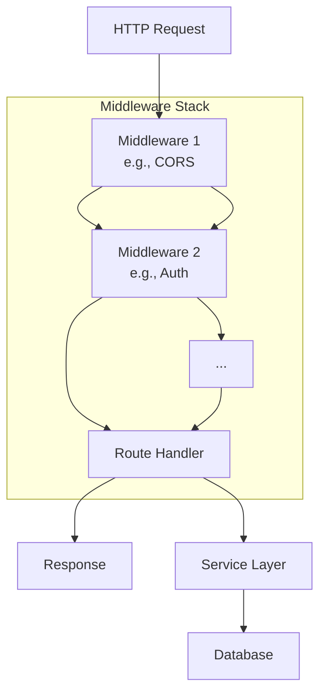
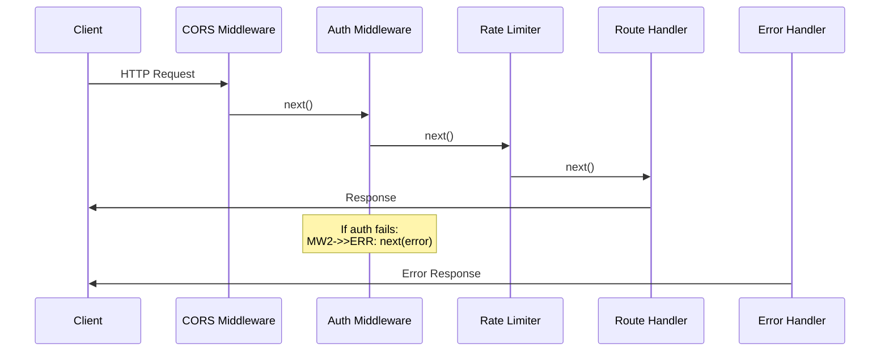
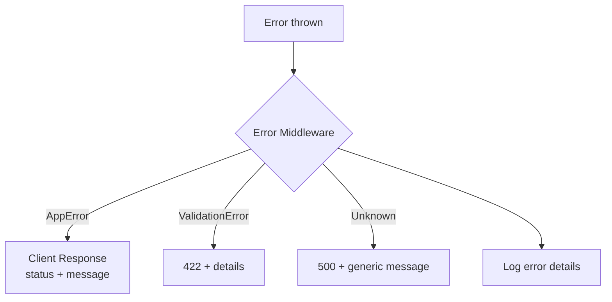
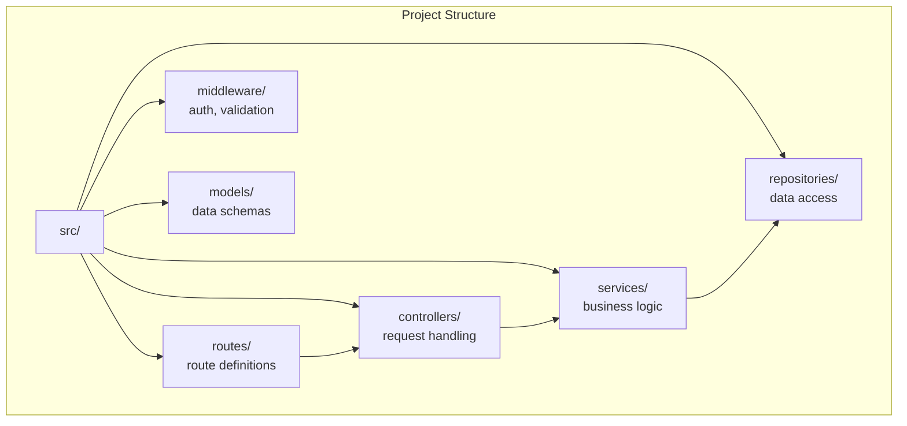

# Express.js

## Overview

Express.js is the most popular Node.js web framework. It's minimal, flexible, and provides a robust set of features for building web and mobile applications. Express is the foundation for many other frameworks (NestJS, Sails, Loopback).

## Architecture



## Core Concepts

### Routing

```javascript
const express = require('express');
const app = express();

// Basic routes
app.get('/users', listUsers);
app.get('/users/:id', getUser);
app.post('/users', createUser);
app.put('/users/:id', updateUser);
app.delete('/users/:id', deleteUser);

// Router (modular)
const router = express.Router();
router.get('/', listUsers);
router.get('/:id', getUser);
app.use('/api/users', router);

// Route parameters
app.get('/users/:id', (req, res) => {
    const { id } = req.params;
    const { include } = req.query; // ?include=posts
    res.json({ id, include });
});
```

### Advanced Routing Patterns

```javascript
// Route parameters with regex
app.get('/users/:id(\\d+)', getUser);  // Only numeric IDs

// Multiple route handlers
app.get('/users/:id',
    authenticate,           // Middleware 1
    authorize('read'),      // Middleware 2
    getUser                 // Handler
);

// Router-level middleware
const userRouter = express.Router();
userRouter.use(authenticate);          // All user routes need auth
userRouter.get('/', listUsers);
userRouter.get('/:id', getUser);
userRouter.post('/', authorize('admin'), createUser);

// Nested routers
const apiRouter = express.Router();
apiRouter.use('/users', userRouter);
apiRouter.use('/posts', postRouter);
app.use('/api/v1', apiRouter);

// Route prefixing with versioning
app.use('/api/v1', v1Router);
app.use('/api/v2', v2Router);
```

### Middleware Chain Deep Dive



```javascript
// Middleware is a function with (req, res, next) signature
const requestLogger = (req, res, next) => {
    const start = Date.now();
    console.log(`→ ${req.method} ${req.url}`);

    // Hook into response finish
    res.on('finish', () => {
        const duration = Date.now() - start;
        console.log(`← ${res.statusCode} (${duration}ms)`);
    });

    next();  // Pass to next middleware
};

// Conditional middleware
const conditionalMiddleware = (req, res, next) => {
    if (req.headers['x-debug']) {
        req.debug = true;
    }
    next();
};

// Middleware that modifies response
const addCorsHeaders = (req, res, next) => {
    res.header('Access-Control-Allow-Origin', '*');
    res.header('Access-Control-Allow-Methods', 'GET, POST, PUT, DELETE');
    next();
};

app.use(requestLogger);
app.use(addCorsHeaders);
app.use(conditionalMiddleware);
```

### Built-in and Common Middleware

```javascript
// Body parsing
app.use(express.json({ limit: '10mb' }));
app.use(express.urlencoded({ extended: true }));

// Security
app.use(helmet());                    // Security headers
app.use(cors({ origin: '*' }));       // CORS
app.use(rateLimit({ windowMs: 15 * 60 * 1000, max: 100 }));  // Rate limiting

// Logging
app.use(morgan('combined'));          // HTTP request logging

// Compression
app.use(compression());               // Gzip responses

// Static files
app.use(express.static('public'));

// Cookie parsing
app.use(cookieParser());
```

### Request/Response

```javascript
// Request object
app.post('/users', (req, res) => {
    console.log(req.body);        // Parsed body
    console.log(req.params);      // Route params
    console.log(req.query);       // Query string
    console.log(req.headers);     // Headers
    console.log(req.ip);          // Client IP
    console.log(req.cookies);     // Cookies (with cookie-parser)
});

// Response object
app.get('/users', (req, res) => {
    res.status(200).json(users);           // JSON response
    res.status(201).location('/users/1').send(user); // Created
    res.status(204).send();                // No content
    res.redirect('/login');                // Redirect
    res.sendFile('/path/to/file');         // Static file
    res.cookie('token', jwt);             // Set cookie
});
```

### Error Handling

```javascript
// Async error wrapper
const asyncHandler = (fn) => (req, res, next) => {
    Promise.resolve(fn(req, res, next)).catch(next);
};

app.get('/users/:id', asyncHandler(async (req, res) => {
    const user = await User.findById(req.params.id);
    if (!user) throw new AppError('User not found', 404);
    res.json(user);
}));

// Custom error class
class AppError extends Error {
    constructor(message, status, code) {
        super(message);
        this.status = status;
        this.code = code;
    }
}
```

### Centralized Error Handling



```javascript
// Error handling middleware (must have 4 parameters)
app.use((err, req, res, next) => {
    // Log the error
    console.error(`[${new Date().toISOString()}] Error:`, {
        message: err.message,
        stack: err.stack,
        url: req.url,
        method: req.method,
    });

    // Known errors
    if (err instanceof AppError) {
        return res.status(err.status).json({
            error: err.message,
            code: err.code,
        });
    }

    // Validation errors (e.g., from Joi)
    if (err.isJoi) {
        return res.status(422).json({
            error: 'Validation failed',
            details: err.details.map(d => d.message),
        });
    }

    // Unknown errors — don't leak internals
    res.status(500).json({
        error: 'Internal Server Error',
    });
});

// 404 handler (after all routes)
app.use((req, res) => {
    res.status(404).json({ error: 'Not found' });
});
```

### Validation with Joi

```javascript
const Joi = require('joi');

const userSchema = Joi.object({
    name: Joi.string().min(2).max(100).required(),
    email: Joi.string().email().required(),
    age: Joi.number().integer().min(0).max(150),
    role: Joi.string().valid('user', 'admin').default('user'),
});

// Validation middleware factory
const validate = (schema, property = 'body') => {
    return (req, res, next) => {
        const { error, value } = schema.validate(req[property], {
            abortEarly: false,  // Collect all errors
            stripUnknown: true, // Remove unknown fields
        });
        if (error) {
            return res.status(422).json({
                error: 'Validation failed',
                details: error.details.map(d => ({
                    field: d.path.join('.'),
                    message: d.message,
                })),
            });
        }
        req[property] = value;
        next();
    };
};

app.post('/users', validate(userSchema), createUser);
```

### Structuring Express Applications



```javascript
// routes/users.js
const router = require('express').Router();
const ctrl = require('../controllers/users');
const { validate } = require('../middleware/validation');
const { authenticate } = require('../middleware/auth');

router.get('/', ctrl.list);
router.get('/:id', ctrl.getById);
router.post('/', validate(createSchema), ctrl.create);
router.put('/:id', authenticate, validate(updateSchema), ctrl.update);
router.delete('/:id', authenticate, ctrl.delete);

module.exports = router;

// controllers/users.js
exports.create = asyncHandler(async (req, res) => {
    const user = await userService.create(req.body);
    res.status(201).json(user);
});

// services/users.js
class UserService {
    constructor(userRepo) {
        this.userRepo = userRepo;
    }
    async create(data) {
        // Business logic here
        return this.userRepo.create(data);
    }
}
```

## Express vs Fastify vs NestJS

| Feature | Express | Fastify | NestJS |
|---------|---------|---------|--------|
| **Performance** | Moderate | Fast | Moderate |
| **Architecture** | Minimal | Minimal | Opinionated |
| **TypeScript** | Manual | Built-in | Built-in |
| **Validation** | Manual (Joi) | Built-in | Built-in (class-validator) |
| **DI** | Manual | Manual | Built-in |
| **Learning curve** | Low | Low | Medium |

## Interview Questions

1. **What is middleware?** — Functions that have access to req, res, next; process request before route handler
2. **How does Express handle errors?** — Error middleware with 4 args (err, req, res, next); async errors need explicit catching
3. **Express vs Koa vs Fastify?** — Express is mature, minimal; Koa is modern, async-first; Fastify is performance-focused
4. **How to structure Express app?** — Routes → Controllers → Services → Repositories; separate concerns
5. **What is `next()`?** — Passes control to next middleware in stack; `next(err)` skips to error handler
6. **How to secure Express?** — helmet, cors, rate-limit, express-validator, parameter sanitization
7. **Session vs JWT?** — Sessions: server-side, stateful; JWT: client-side, stateless, scalable
8. **How to test Express?** — supertest for integration tests; jest/mocha for unit tests
9. **What is the middleware chain?** — Ordered sequence of functions; each can modify req/res or terminate the chain
10. **How to handle async errors?** — Wrap with asyncHandler or use express-async-errors; unhandled rejections crash the process

## References

- [Express.js Official Documentation](https://expressjs.com/)
- [Express.js Guide](https://expressjs.com/en/guide/routing.html)
- [Node.js Best Practices](https://github.com/goldbergyoni/nodebestpractices)
- [Joi Validation](https://joi.dev/)
- [Helmet.js Security](https://helmetjs.github.io/)

## Related Topics

- [Node.js](../../languages/javascript/nodejs.md) — Runtime environment
- [REST API Design](../../backend/api/rest.md) — REST principles
- [Authentication](../../backend/auth/) — JWT, OAuth
- [Docker](../../backend/containers/docker.md) — Containerization
