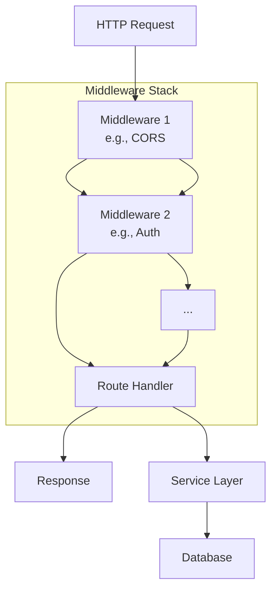

# Express.js

## Overview

Express.js is the most popular Node.js web framework. It's minimal, flexible, and provides a robust set of features for building web and mobile applications. Express is the foundation for many other frameworks (NestJS, Sails, Loopback).

## Architecture



## Core Concepts

### Routing

```javascript
const express = require('express');
const app = express();

// Basic routes
app.get('/users', listUsers);
app.get('/users/:id', getUser);
app.post('/users', createUser);
app.put('/users/:id', updateUser);
app.delete('/users/:id', deleteUser);

// Router (modular)
const router = express.Router();
router.get('/', listUsers);
router.get('/:id', getUser);
app.use('/api/users', router);

// Route parameters
app.get('/users/:id', (req, res) => {
    const { id } = req.params;
    const { include } = req.query; // ?include=posts
    res.json({ id, include });
});
```

### Middleware

```javascript
// Application-level
app.use(express.json());
app.use(express.urlencoded({ extended: true }));
app.use(cors());
app.use(helmet());

// Custom middleware
const authMiddleware = (req, res, next) => {
    const token = req.headers.authorization?.split(' ')[1];
    if (!token) return res.status(401).json({ error: 'No token' });
    
    try {
        req.user = jwt.verify(token, SECRET);
        next();
    } catch (err) {
        res.status(401).json({ error: 'Invalid token' });
    }
};

// Apply to specific routes
app.get('/protected', authMiddleware, (req, res) => {
    res.json({ user: req.user });
});

// Error-handling middleware (4 args)
app.use((err, req, res, next) => {
    console.error(err.stack);
    res.status(err.status || 500).json({
        error: err.message || 'Internal Server Error'
    });
});
```

### Request/Response

```javascript
// Request object
app.post('/users', (req, res) => {
    console.log(req.body);        // Parsed body
    console.log(req.params);      // Route params
    console.log(req.query);       // Query string
    console.log(req.headers);     // Headers
    console.log(req.ip);          // Client IP
    console.log(req.cookies);     // Cookies (with cookie-parser)
});

// Response object
app.get('/users', (req, res) => {
    res.status(200).json(users);           // JSON response
    res.status(201).location('/users/1').send(user); // Created
    res.status(204).send();                // No content
    res.redirect('/login');                // Redirect
    res.sendFile('/path/to/file');         // Static file
    res.cookie('token', jwt);             // Set cookie
});
```

### Error Handling

```javascript
// Async error wrapper
const asyncHandler = (fn) => (req, res, next) => {
    Promise.resolve(fn(req, res, next)).catch(next);
};

app.get('/users/:id', asyncHandler(async (req, res) => {
    const user = await User.findById(req.params.id);
    if (!user) throw new AppError('User not found', 404);
    res.json(user);
}));

// Custom error class
class AppError extends Error {
    constructor(message, status) {
        super(message);
        this.status = status;
    }
}
```

## Express vs Fastify vs NestJS

| Feature | Express | Fastify | NestJS |
|---------|---------|---------|--------|
| **Performance** | Moderate | Fast | Moderate |
| **Architecture** | Minimal | Minimal | Opinionated |
| **TypeScript** | Manual | Built-in | Built-in |
| **Validation** | Manual (Joi) | Built-in | Built-in (class-validator) |
| **DI** | Manual | Manual | Built-in |
| **Learning curve** | Low | Low | Medium |

## Interview Questions

1. **What is middleware?** — Functions that have access to req, res, next; process request before route handler
2. **How does Express handle errors?** — Error middleware with 4 args (err, req, res, next); async errors need explicit catching
3. **Express vs Koa vs Fastify?** — Express is mature, minimal; Koa is modern, async-first; Fastify is performance-focused
4. **How to structure Express app?** — Routes → Controllers → Services → Repositories; separate concerns
5. **What is `next()`?** — Passes control to next middleware in stack; `next(err)` skips to error handler
6. **How to secure Express?** — helmet, cors, rate-limit, express-validator, parameter sanitization
7. **Session vs JWT?** — Sessions: server-side, stateful; JWT: client-side, stateless, scalable
8. **How to test Express?** — supertest for integration tests; jest/mocha for unit tests

## Related Topics

- [Node.js](../../languages/javascript/nodejs.md) — Runtime environment
- [REST API Design](../../backend/api/rest.md) — REST principles
- [Authentication](../../backend/auth/) — JWT, OAuth
- [Docker](../../backend/containers/docker.md) — Containerization
