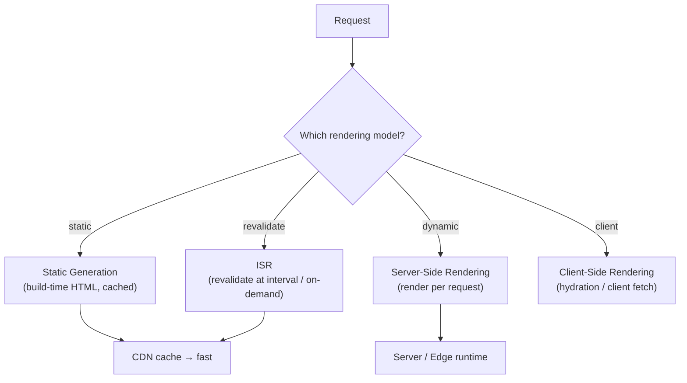

# Next.js

## Overview

Next.js is the most popular **React framework** (by Vercel, first release 2016). It turns React into a full-stack framework: file-based routing, server-side rendering (SSR), static generation (SSG), incremental static regeneration (ISR), API routes, Server Components, Server Actions, and image/font optimization — with **Turbopack** (Rust-based bundler) as the default since Next.js 16.

It answers the questions React alone leaves open: *how do I render on the server, how do I split code, how do I fetch data, how do I deploy?*

## Rendering Models



| Model | When | Pros | Cons |
|---|---|---|---|
| **SSG** (static) | Content rarely changes (blog, docs, marketing) | Fastest, CDN-cacheable, zero server cost | Stale unless rebuilt |
| **ISR** | Content changes periodically (products, news) | Static speed + freshness | Revalidation delay |
| **SSR** | Personalized / auth-dependent pages | Fresh per request, SEO | Server cost + latency per request |
| **CSR** | Highly interactive dashboards | Cheap server | Slow initial load, worse SEO |

Next.js 15+ made **fetch caching opt-in** (no implicit `force-cache`); Next.js 16 introduces **Cache Components** (`use cache` directive) — an explicit, opt-in caching model with **Partial Pre-Rendering (PPR)** so a page can mix cached and dynamic parts.

## The App Router (Next.js 13+)

- File-based routing under `app/`: `page.tsx`, `layout.tsx`, `loading.tsx`, `error.tsx`, `route.ts`, `not-found.tsx`.
- Components are **Server Components by default** (render on the server, ship no client JS); add `"use client"` to opt into client interactivity.
- **Layouts** persist across navigations and deduplicate shared UI.
- **Route Handlers** (`route.ts`) replace the old `pages/api` API routes.

```tsx
// app/products/[id]/page.tsx — a Server Component
import { notFound } from "next/navigation";

export default async function ProductPage({ params }: { params: { id: string } }) {
  const product = await getProduct(params.id);   // direct DB/API access — runs on server
  if (!product) notFound();
  return <main>{product.name}: ${product.price}</main>;
}
```

## Data Fetching and Caching

- **Server Components** can `await fetch()` or call the DB directly — no client round-trip, no waterfall.
- **`revalidatePath` / `revalidateTag`** — on-demand cache invalidation for ISR.
- **`generateStaticParams`** — pre-render dynamic routes at build time.
- Next.js 16: **`use cache`** directive + `cacheComponents: true` for explicit fine-grained caching; dynamic code runs at request time by default unless you cache it.

## Server Actions (mutations)

Server Actions are async functions that run **on the server**, callable directly from client components and forms:

```tsx
"use server";

export async function updateProfile(formData: FormData) {
  // validate, write to DB — never ships to the client
  await db.user.update({ id: session.userId, ...formData });
  revalidatePath("/profile");
}
```

They integrate with React 19's `useActionState`, `useFormStatus`, and `useOptimistic` for pending/optimistic UI without hand-rolled loading states.

## Turbopack (Next.js 16 default)

Turbopack is a **Rust-based bundler** that replaces Webpack (default in 16; optional in 15):

- **Unified graph** — one compilation graph for client, server, and edge environments.
- **Incremental computation** — parallelized across cores, cached down to the function level.
- ~2–5× faster production builds, up to 10× faster Fast Refresh (HMR); 16.2 added Server Fast Refresh and a ~400% faster dev startup.

## Middleware → proxy.ts (Next.js 16)

Next.js 15 used `middleware.ts` for edge logic (auth guards, redirects, A/B tests). Next.js 16 introduces **`proxy.ts`** as the new preferred name (middleware.ts still supported) for clearer network-boundary semantics (renamed to reflect that it intercepts at the edge/proxy layer, not inside the request pipeline).

## Ecosystem

| Piece | Role |
|---|---|
| **Vercel** | First-class hosting (edge network, preview deploys) |
| **self-host** | Node server, Docker, or static export (`output: "export"`) |
| **Tailwind CSS** | Default styling in `create-next-app` |
| **Prisma / Drizzle** | Typed DB access for Server Components/Actions |
| **NextAuth (Auth.js)** | Authentication |
| **Vitest + Playwright** | Unit/component + e2e testing |

## Interview Questions

### Q: What is the difference between SSR, SSG, and ISR?

SSR renders the HTML on the server per request (fresh, personalized, but server work per request). SSG pre-renders at build time into static files served from a CDN (fastest, but stale until rebuilt). ISR is SSG plus revalidation — pages are regenerated in the background after a time interval or on-demand (`revalidateTag`), combining static speed with freshness.

### Q: What are Server Components and why do they matter?

Server Components render on the server and send serialized UI to the client; their code and data-fetching never reach the browser, shrinking the JS bundle and allowing direct DB/API access without an extra client round-trip. In Next.js App Router, components are Server Components by default; `"use client"` opts into client interactivity.

### Q: How does Next.js 16's caching work (Cache Components)?

Next.js 16 introduces an explicit caching model via the `use cache` directive (opt-in with `cacheComponents: true`): dynamic code runs at request time by default; you explicitly mark functions/components to cache. This fixes the confusing implicit caching of Next.js 13/14/15 (where behavior depended on which data-fetching API you used). Partial Pre-Rendering lets a page mix cached and dynamic segments.

### Q: When would you choose Next.js over plain React?

When you need SEO, fast first paint, or full-stack data access without a separate backend — Next.js gives SSR/SSG/ISR, Server Components/Actions, file-based routing, and image/font optimization out of the box. Choose plain React (with Vite) for a purely client-side SPA behind your own API.

### Q: How do Server Actions differ from REST API routes?

Server Actions are functions invoked directly from client components — Next.js serializes the call, runs it on the server, and returns the result, without you defining URL routes or HTTP handlers. They suit form mutations and small server operations; REST/GraphQL route handlers are still appropriate for third-party APIs, webhooks, and public endpoints.

## References

- Next.js official docs — https://nextjs.org/docs
- Next.js 15 announcement — https://nextjs.org/blog/next-15
- Next.js 16 announcement (Turbopack default, Cache Components) — https://nextjs.org/blog/next-16
- Vercel blog — https://vercel.com/blog

## Related Topics

- [React](../react/README.md) — the underlying library (Server Components, Actions, Compiler)
- [TypeScript](../../languages/typescript/README.md) — the default language for Next.js apps
- [JavaScript Overview](../../languages/javascript/README.md) — language fundamentals
- [Backend Engineering](../../backend/README.md) — the API/services Next.js consumes
- [CDN](../../networks/cdn/README.md) — how static/ISR pages are served
