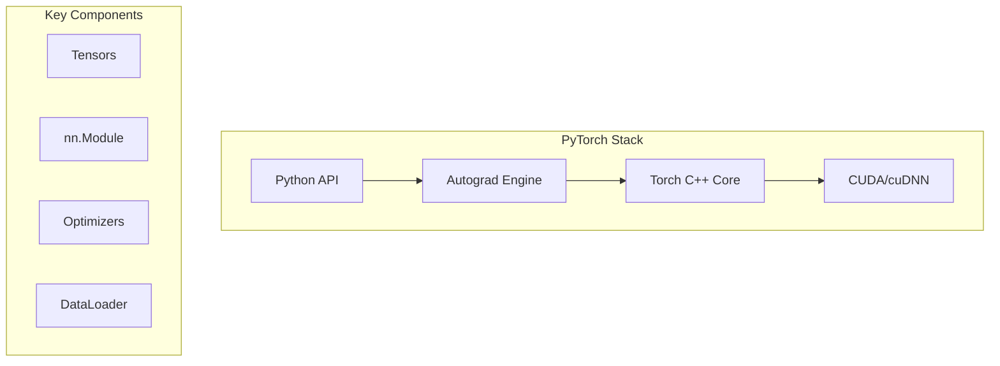

# PyTorch

## Overview

PyTorch is an open-source machine learning framework developed by Meta AI. It provides a flexible, dynamic computational graph and imperative programming style, making it the most popular framework for research and increasingly for production.

## Why PyTorch for Interviews

- **Research standard**: Most ML papers use PyTorch
- **Dynamic graphs**: Pythonic, debuggable, intuitive
- **Production-ready**: TorchServe, TorchScript, ONNX export
- **GPU native**: Seamless CUDA integration

## Architecture



## Core Concepts

### Tensors

```python
import torch

# Creation
x = torch.tensor([1, 2, 3])           # From data
x = torch.zeros(3, 4)                  # Zeros
x = torch.randn(3, 4)                  # Random normal
x = torch.arange(0, 10, 2)            # Range
x = torch.linspace(0, 1, 5)           # Linear space

# Operations
a = torch.randn(3, 4)
b = torch.randn(4, 5)
c = a @ b                              # Matrix multiply
c = torch.matmul(a, b)                 # Same
d = a + b.T                            # Broadcasting

# GPU
device = torch.device('cuda' if torch.cuda.is_available() else 'cpu')
x = x.to(device)                       # Move to GPU

# Reshaping
x = torch.randn(2, 3, 4)
x.view(6, 4)                           # Reshape
x.reshape(6, 4)                        # Same
x.permute(2, 0, 1)                     # Transpose dims
x.unsqueeze(0)                         # Add dimension
```

### Autograd

```python
# Automatic differentiation
x = torch.tensor(2.0, requires_grad=True)
y = x ** 2 + 3 * x + 1
y.backward()
print(x.grad)  # dy/dx = 2x + 3 = 7.0

# Gradient accumulation
x = torch.randn(3, requires_grad=True)
for i in range(10):
    y = (x ** 2).sum()
    y.backward()          # Gradients accumulate!
    x.grad.zero_()        # Reset gradients

# Detaching from graph
with torch.no_grad():
    # No gradient tracking (inference)
    output = model(input)
```

### nn.Module

```python
import torch.nn as nn

class MLP(nn.Module):
    def __init__(self, input_dim, hidden_dim, output_dim):
        super().__init__()
        self.layers = nn.Sequential(
            nn.Linear(input_dim, hidden_dim),
            nn.ReLU(),
            nn.Dropout(0.1),
            nn.Linear(hidden_dim, hidden_dim),
            nn.ReLU(),
            nn.Linear(hidden_dim, output_dim)
        )
    
    def forward(self, x):
        return self.layers(x)

# Model parameters
model = MLP(784, 256, 10)
print(sum(p.numel() for p in model.parameters()))  # Parameter count
```

### Training Loop

```python
model = MLP(784, 256, 10).to(device)
optimizer = torch.optim.Adam(model.parameters(), lr=1e-3)
criterion = nn.CrossEntropyLoss()

for epoch in range(num_epochs):
    model.train()
    for batch_x, batch_y in train_loader:
        batch_x, batch_y = batch_x.to(device), batch_y.to(device)
        
        # Forward pass
        output = model(batch_x)
        loss = criterion(output, batch_y)
        
        # Backward pass
        optimizer.zero_grad()
        loss.backward()
        optimizer.step()
    
    # Validation
    model.eval()
    with torch.no_grad():
        val_loss = evaluate(model, val_loader)
```

### DataLoader

```python
from torch.utils.data import Dataset, DataLoader

class CustomDataset(Dataset):
    def __init__(self, data, labels):
        self.data = data
        self.labels = labels
    
    def __len__(self):
        return len(self.data)
    
    def __getitem__(self, idx):
        return self.data[idx], self.labels[idx]

train_loader = DataLoader(
    dataset,
    batch_size=32,
    shuffle=True,
    num_workers=4,        # Parallel data loading
    pin_memory=True       # Faster GPU transfer
)
```

### Common Layers

| Layer | Description | Use Case |
|-------|-------------|----------|
| `nn.Linear` | Fully connected | MLP |
| `nn.Conv2d` | 2D convolution | Image processing |
| `nn.LSTM` | Long Short-Term Memory | Sequence modeling |
| `nn.Transformer` | Self-attention | NLP, vision |
| `nn.BatchNorm2d` | Batch normalization | Training stability |
| `nn.Dropout` | Regularization | Prevent overfitting |
| `nn.Embedding` | Lookup table | Discrete features |

### Save/Load Models

```python
# Save entire model
torch.save(model, 'model.pt')
model = torch.load('model.pt')

# Save state dict (recommended)
torch.save(model.state_dict(), 'model.pt')
model.load_state_dict(torch.load('model.pt'))

# Checkpoint
torch.save({
    'epoch': epoch,
    'model_state_dict': model.state_dict(),
    'optimizer_state_dict': optimizer.state_dict(),
    'loss': loss,
}, 'checkpoint.pt')
```

## PyTorch vs TensorFlow

| Feature | PyTorch | TensorFlow |
|---------|---------|-----------|
| **Graph** | Dynamic (eager) | Static (tf.function) |
| **Debugging** | Standard Python | tf.debug |
| **API** | Pythonic | More complex |
| **Research** | Dominant | Declining |
| **Production** | TorchServe | TF Serving, TFLite |
| **Mobile** | TorchMobile | TFLite |

## Interview Questions

1. **What is autograd?** — Automatic differentiation engine; records operations on tensors, builds computation graph, computes gradients via backpropagation
2. **`model.train()` vs `model.eval()`?** — Enables/disables dropout and batch normalization training behavior
3. **Why `optimizer.zero_grad()`?** — PyTorch accumulates gradients; must reset before each backward pass
4. **DataLoader `num_workers`?** — Parallel data loading processes; prevents GPU starvation
5. **How to prevent overfitting?** — Dropout, weight decay (L2), data augmentation, early stopping, batch normalization
6. **What is `torch.no_grad()`?** — Disables gradient tracking; saves memory during inference
7. **Mixed precision training?** — Use FP16 for forward/backward, FP32 for weight updates; `torch.cuda.amp` for automatic
8. **Distributed training?** — `DistributedDataParallel` for multi-GPU; `torch.distributed` for multi-node

## Related Topics

- [Machine Learning](../../ml/) — ML fundamentals
- [Transformers](../../ml/transformers/) — Attention mechanism
- [GPU Computing](../../arch/parallelism/gpu.md) — CUDA programming
- [Distributed Training](../../ml/llm/training-pipeline.md) — Multi-GPU training
