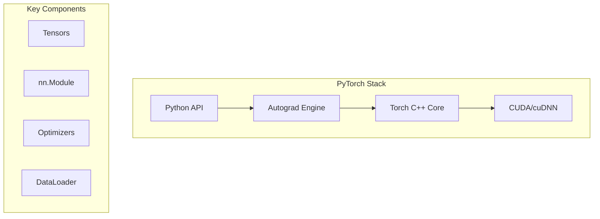
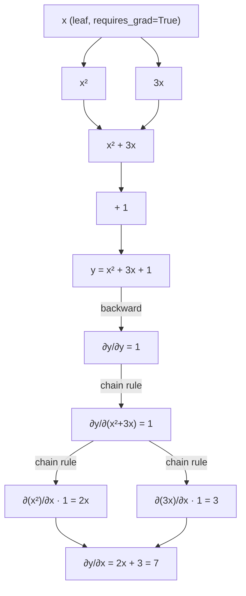
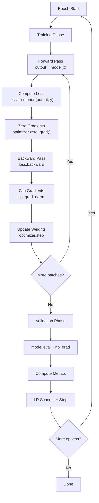

# PyTorch

## Overview

PyTorch is an open-source machine learning framework developed by Meta AI. It provides a flexible, dynamic computational graph and imperative programming style, making it the most popular framework for research and increasingly for production.

## Why PyTorch for Interviews

- **Research standard**: Most ML papers use PyTorch
- **Dynamic graphs**: Pythonic, debuggable, intuitive
- **Production-ready**: TorchServe, TorchScript, ONNX export
- **GPU native**: Seamless CUDA integration

## Architecture



## Core Concepts

### Tensors

```python
import torch

# Creation
x = torch.tensor([1, 2, 3])           # From data
x = torch.zeros(3, 4)                  # Zeros
x = torch.randn(3, 4)                  # Random normal
x = torch.arange(0, 10, 2)            # Range
x = torch.linspace(0, 1, 5)           # Linear space

# Operations
a = torch.randn(3, 4)
b = torch.randn(4, 5)
c = a @ b                              # Matrix multiply
c = torch.matmul(a, b)                 # Same
d = a + b.T                            # Broadcasting

# GPU
device = torch.device('cuda' if torch.cuda.is_available() else 'cpu')
x = x.to(device)                       # Move to GPU

# Reshaping
x = torch.randn(2, 3, 4)
x.view(6, 4)                           # Reshape (contiguous)
x.reshape(6, 4)                        # Reshape (any)
x.permute(2, 0, 1)                     # Transpose dims
x.unsqueeze(0)                         # Add dimension
x.squeeze()                            # Remove size-1 dims
```

### Tensor Operations Deep Dive

```python
# Broadcasting rules:
# 1. If tensors have different ndim, prepend 1s to smaller shape
# 2. Dimensions of size 1 are stretched to match
# 3. Error if shapes are incompatible
a = torch.randn(3, 1)      # (3, 1)
b = torch.randn(1, 4)      # (1, 4)
c = a + b                   # (3, 4) — broadcast

# Reduction operations
x = torch.randn(3, 4)
x.sum()                     # scalar
x.sum(dim=0)                # (4,) — sum over rows
x.sum(dim=1, keepdim=True)  # (3, 1) — keep dimension
x.mean(dim=0)
x.max(dim=1)                # returns (values, indices)
x.argmax(dim=1)             # indices only

# Indexing and slicing
x = torch.randn(3, 4)
x[0, :]                     # First row
x[:, 1]                     # Second column
x[x > 0]                    # Boolean masking
x[[0, 2], [1, 3]]           # Advanced indexing

# In-place operations (suffix _)
x.add_(1)                   # x += 1
x.zero_()                   # Fill with zeros
```

### Autograd

```python
# Automatic differentiation
x = torch.tensor(2.0, requires_grad=True)
y = x ** 2 + 3 * x + 1
y.backward()
print(x.grad)  # dy/dx = 2x + 3 = 7.0

# Gradient accumulation
x = torch.randn(3, requires_grad=True)
for i in range(10):
    y = (x ** 2).sum()
    y.backward()          # Gradients accumulate!
    x.grad.zero_()        # Reset gradients

# Detaching from graph
with torch.no_grad():
    # No gradient tracking (inference)
    output = model(input)
```

### Computation Graph and Backpropagation



```python
# Controlling gradient flow
x = torch.randn(3, requires_grad=True)

# Stop gradient
y = x.detach()  # New tensor, no grad history

# Prevent gradient computation
for param in model.parameters():
    param.requires_grad = False  # Freeze layer

# Gradient of non-scalar outputs
x = torch.randn(3, requires_grad=True)
y = x * 2  # Vector output
y.backward(gradient=torch.tensor([1.0, 1.0, 1.0]))  # Provide upstream grad
```

### nn.Module

```python
import torch.nn as nn

class MLP(nn.Module):
    def __init__(self, input_dim, hidden_dim, output_dim):
        super().__init__()
        self.layers = nn.Sequential(
            nn.Linear(input_dim, hidden_dim),
            nn.ReLU(),
            nn.Dropout(0.1),
            nn.Linear(hidden_dim, hidden_dim),
            nn.ReLU(),
            nn.Linear(hidden_dim, output_dim)
        )

    def forward(self, x):
        return self.layers(x)

# Model parameters
model = MLP(784, 256, 10)
print(sum(p.numel() for p in model.parameters()))  # Parameter count
```

### Custom nn.Module Patterns

```python
class ResidualBlock(nn.Module):
    def __init__(self, dim):
        super().__init__()
        self.block = nn.Sequential(
            nn.Linear(dim, dim),
            nn.BatchNorm1d(dim),
            nn.ReLU(),
            nn.Linear(dim, dim),
        )
        self.relu = nn.ReLU()

    def forward(self, x):
        return self.relu(x + self.block(x))  # Skip connection

class MultiHeadAttention(nn.Module):
    def __init__(self, d_model, n_heads):
        super().__init__()
        self.n_heads = n_heads
        self.d_k = d_model // n_heads
        self.qkv = nn.Linear(d_model, 3 * d_model)
        self.proj = nn.Linear(d_model, d_model)

    def forward(self, x):
        B, T, C = x.shape
        qkv = self.qkv(x).reshape(B, T, 3, self.n_heads, self.d_k)
        q, k, v = qkv.permute(2, 0, 3, 1, 4).unbind(0)
        attn = (q @ k.transpose(-2, -1)) / (self.d_k ** 0.5)
        attn = attn.softmax(dim=-1)
        out = (attn @ v).transpose(1, 2).reshape(B, T, C)
        return self.proj(out)
```

### Training Loop

```python
model = MLP(784, 256, 10).to(device)
optimizer = torch.optim.Adam(model.parameters(), lr=1e-3)
criterion = nn.CrossEntropyLoss()
scheduler = torch.optim.lr_scheduler.CosineAnnealingLR(optimizer, T_max=num_epochs)

for epoch in range(num_epochs):
    model.train()
    total_loss = 0
    for batch_x, batch_y in train_loader:
        batch_x, batch_y = batch_x.to(device), batch_y.to(device)

        # Forward pass
        output = model(batch_x)
        loss = criterion(output, batch_y)

        # Backward pass
        optimizer.zero_grad()
        loss.backward()
        torch.nn.utils.clip_grad_norm_(model.parameters(), max_norm=1.0)
        optimizer.step()

        total_loss += loss.item()

    scheduler.step()

    # Validation
    model.eval()
    correct, total = 0, 0
    with torch.no_grad():
        for batch_x, batch_y in val_loader:
            batch_x, batch_y = batch_x.to(device), batch_y.to(device)
            output = model(batch_x)
            correct += (output.argmax(1) == batch_y).sum().item()
            total += batch_y.size(0)
    print(f"Epoch {epoch}: loss={total_loss:.4f}, acc={correct/total:.4f}")
```

### Training Loop Flow



### DataLoader

```python
from torch.utils.data import Dataset, DataLoader

class CustomDataset(Dataset):
    def __init__(self, data, labels, transform=None):
        self.data = data
        self.labels = labels
        self.transform = transform

    def __len__(self):
        return len(self.data)

    def __getitem__(self, idx):
        x, y = self.data[idx], self.labels[idx]
        if self.transform:
            x = self.transform(x)
        return x, y

train_loader = DataLoader(
    dataset,
    batch_size=32,
    shuffle=True,
    num_workers=4,        # Parallel data loading
    pin_memory=True,      # Faster GPU transfer
    drop_last=True,       # Drop incomplete last batch
    collate_fn=None,      # Custom batching logic
)
```

### Optimizers

```python
# SGD with momentum
optimizer = torch.optim.SGD(model.parameters(), lr=0.01, momentum=0.9, weight_decay=1e-4)

# Adam (most common)
optimizer = torch.optim.Adam(model.parameters(), lr=1e-3, betas=(0.9, 0.999))

# AdamW (decoupled weight decay — preferred for transformers)
optimizer = torch.optim.AdamW(model.parameters(), lr=1e-3, weight_decay=0.01)

# Learning rate schedulers
scheduler = torch.optim.lr_scheduler.StepLR(optimizer, step_size=30, gamma=0.1)
scheduler = torch.optim.lr_scheduler.CosineAnnealingLR(optimizer, T_max=100)
scheduler = torch.optim.lr_scheduler.ReduceLROnPlateau(optimizer, patience=5)
```

### Common Layers

| Layer | Description | Use Case |
|-------|-------------|----------|
| `nn.Linear` | Fully connected | MLP |
| `nn.Conv2d` | 2D convolution | Image processing |
| `nn.LSTM` | Long Short-Term Memory | Sequence modeling |
| `nn.Transformer` | Self-attention | NLP, vision |
| `nn.BatchNorm2d` | Batch normalization | Training stability |
| `nn.Dropout` | Regularization | Prevent overfitting |
| `nn.Embedding` | Lookup table | Discrete features |

### Save/Load Models

```python
# Save entire model
torch.save(model, 'model.pt')
model = torch.load('model.pt')

# Save state dict (recommended)
torch.save(model.state_dict(), 'model.pt')
model.load_state_dict(torch.load('model.pt'))

# Checkpoint
torch.save({
    'epoch': epoch,
    'model_state_dict': model.state_dict(),
    'optimizer_state_dict': optimizer.state_dict(),
    'loss': loss,
}, 'checkpoint.pt')

# Load checkpoint
checkpoint = torch.load('checkpoint.pt')
model.load_state_dict(checkpoint['model_state_dict'])
optimizer.load_state_dict(checkpoint['optimizer_state_dict'])
epoch = checkpoint['epoch']
```

## PyTorch vs TensorFlow

| Feature | PyTorch | TensorFlow |
|---------|---------|-----------|
| **Graph** | Dynamic (eager) | Static (tf.function) |
| **Debugging** | Standard Python | tf.debug |
| **API** | Pythonic | More complex |
| **Research** | Dominant | Declining |
| **Production** | TorchServe | TF Serving, TFLite |
| **Mobile** | TorchMobile | TFLite |

## Interview Questions

1. **What is autograd?** — Automatic differentiation engine; records operations on tensors, builds computation graph, computes gradients via backpropagation
2. **`model.train()` vs `model.eval()`?** — Enables/disables dropout and batch normalization training behavior
3. **Why `optimizer.zero_grad()`?** — PyTorch accumulates gradients; must reset before each backward pass
4. **DataLoader `num_workers`?** — Parallel data loading processes; prevents GPU starvation
5. **How to prevent overfitting?** — Dropout, weight decay (L2), data augmentation, early stopping, batch normalization
6. **What is `torch.no_grad()`?** — Disables gradient tracking; saves memory during inference
7. **Mixed precision training?** — Use FP16 for forward/backward, FP32 for weight updates; `torch.cuda.amp` for automatic
8. **Distributed training?** — `DistributedDataParallel` for multi-GPU; `torch.distributed` for multi-node
9. **Why `clip_grad_norm_`?** — Prevents exploding gradients; clips gradient vector to max norm
10. **Adam vs SGD?** — Adam: adaptive LR per parameter, faster convergence; SGD+momentum: better generalization sometimes, needs LR tuning

## References

- [PyTorch Official Documentation](https://pytorch.org/docs/stable/)
- [PyTorch Tutorials](https://pytorch.org/tutorials/)
- [Deep Learning with PyTorch (Book)](https://pytorch.org/deep-learning-with-pytorch)
- [PyTorch Lightning](https://lightning.ai/docs/pytorch/)
- [Papers With Code (PyTorch implementations)](https://paperswithcode.com/)

## Related Topics

- [Machine Learning](../../ml/) — ML fundamentals
- [Transformers](../../ml/transformers/) — Attention mechanism
- [GPU Computing](../../arch/parallelism/gpu.md) — CUDA programming
- [Distributed Training](../../ml/llm/training-pipeline.md) — Multi-GPU training
