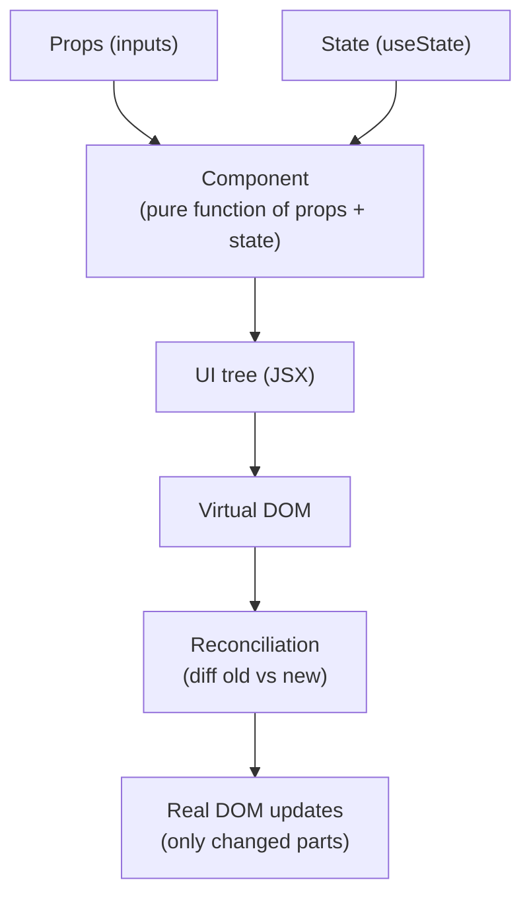
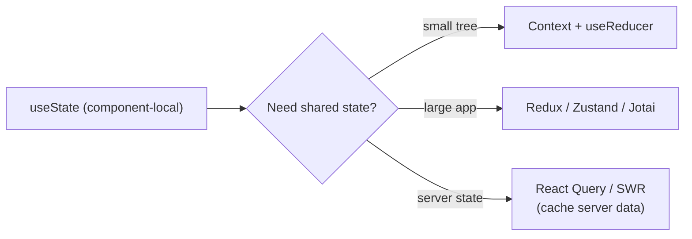

# React

## Overview

React is a JavaScript library (by Meta, 2013) for building user interfaces from **components** — functions that return declarative UI. Its core ideas: a **virtual DOM** with **reconciliation**, **unidirectional data flow**, and **hooks** for state and effects. React 18 added concurrent rendering; React 19 (Dec 2024) stabilized Server Components, Actions, and the React Compiler (1.0, Oct 2025) which auto-memoizes components.

React is the dominant frontend library, and its mental model (re-renders, keys, effects, memoization) is a staple of frontend interviews. See [JavaScript Overview](../../languages/javascript/README.md) and [V8 Engine](../../languages/javascript/v8.md) for the runtime underneath.

## Component Model



- **Components** are pure-ish functions: same props + state → same output.
- **JSX** is a syntax extension compiled to `React.createElement` calls.
- The **virtual DOM** is a lightweight description of the UI; when state changes, React re-renders, diffs the new virtual tree against the old one (**reconciliation**), and applies minimal real-DOM mutations.

## Rendering and Reconciliation

- **Re-render**: a state change in a component re-runs that component (and children by default).
- **Keys**: stable, unique `key` props let React match children across renders — index keys cause state mix-ups when lists reorder.
- **Batching**: state updates are batched (React 18+ batches in all contexts, including promises).
- **Memoization**: `memo`, `useMemo`, `useCallback` prevent unnecessary re-renders — but React Compiler 1.0 now does this automatically at build time for most code.

```jsx
function Counter() {
  const [count, setCount] = useState(0);
  return <button onClick={() => setCount(c => c + 1)}>{count}</button>;
}
```

## Hooks (the essentials)

| Hook | Purpose |
|---|---|
| `useState` | Local state |
| `useEffect` | Side effects (subscriptions, fetches, timers) — runs after render; cleanup function on unmount |
| `useRef` | Mutable value that survives renders without triggering re-render; DOM refs |
| `useMemo` | Cache expensive computed values (by dependencies) |
| `useCallback` | Cache function identity (for memoized children / effect deps) |
| `useContext` | Read context from nearest provider |
| `useReducer` | State with a reducer (complex transitions) |
| `useTransition` | Mark updates as non-urgent (concurrent) |
| `useOptimistic` | Optimistic UI with rollback (React 19) |
| `useActionState` / `useFormStatus` | Form actions and pending state (React 19) |
| `use` | Read promises/context in render (React 19) |

**Rules of hooks**: hooks must be called at the top level, unconditionally, and only from React functions — order must be stable across renders.

## State Management



- **Lifting state up** — share state by moving it to a common ancestor.
- **Context** — for "provide once, read deep" (theme, auth, i18n); avoid for high-frequency updates.
- **Redux** — global store with actions/reducers, middleware; **Zustand/Jotai** — lighter alternatives.
- **Server state** (data from APIs) — React Query/SWR manage caching, refetch, and invalidation better than hand-rolled `useEffect` fetches.

## React 19: Server Components, Actions, Compiler

- **Server Components**: components that run on the server only — no client JS bundle for them; can read DBs/APIs directly. Stable in React 19.
- **Server Actions**: functions that run on the server, callable from client components (form actions).
- **Actions**: async transitions with automatic pending/error state (`useActionState`, `useOptimistic`).
- **Document metadata**: `<title>`, `<meta>` renderable from components directly.
- **React Compiler** (1.0, Oct 2025): compile-time automatic memoization — most hand-written `useMemo`/`memo` becomes unnecessary.

## Performance

- **Code splitting**: `React.lazy` + `Suspense` (or framework routing) to split bundles.
- **Avoid re-render cascades**: memoize, keep context narrow, prefer colocation.
- **Virtualization**: `react-window` / `react-virtualized` for huge lists.
- **Concurrent features**: `startTransition`, `useDeferredValue` keep UI responsive during big updates.
- **Measure**: React DevTools Profiler, `why-did-you-render`.

## Testing

- **Vitest / Jest** + **React Testing Library (RTL)** — render components, query like a user, assert behavior.
- RTL guidance: test what users see/do, not implementation details; use `screen.getByRole`, `userEvent`.
- **Playwright / Cypress** for end-to-end flows.

## Ecosystem

| Piece | Role |
|---|---|
| **Next.js** | Full-stack framework (App Router, SSR, Server Components, Server Actions, Turbopack); Next 15+ targets React 19 |
| **Vite** | Fast dev server + bundler (increasingly default) |
| **React Router / TanStack Router** | Client routing |
| **React Query (TanStack Query)** | Server-state cache |
| **Redux / Zustand / Jotai** | Client state |
| **Tailwind / CSS Modules / styled-components** | Styling |

## Interview Questions

### Q: How does React's reconciliation work and why are keys important?

When state changes, React builds a new virtual tree and diffs it against the previous one. It compares element type, props, and children; for lists it uses `key` to match items across renders. Stable keys let React move/update items in place; index keys break this when items reorder or are inserted — causing wrong element reuse and stale state.

### Q: What is the difference between `useMemo` and `useCallback`?

`useMemo` caches a **value** computed by a function; `useCallback` caches a **function reference**. Both take a dependency array and re-run only when deps change. Use them to avoid recomputation and to keep memoized children/effects from re-running. (With React Compiler 1.0, most of this is automatic.)

### Q: Why do effects run twice in development (React 18 Strict Mode)?

StrictMode intentionally mounts, unmounts, and remounts components in development to surface missing cleanup. Your `useEffect` setup/cleanup must be idempotent — this catches subscriptions that leak and fetches with stale results. It does not run in production.

### Q: What are Server Components and why do they matter?

Server Components render on the server and send serialized UI to the client — their code (and data-fetching) never ships to the browser. That shrinks the JS bundle and lets components read the database/APIs directly. They're stable in React 19 and the basis of Next.js App Router data loading.

### Q: How do you share state across components without prop drilling?

Lift state to a common ancestor and pass props; use **Context** for broad, low-frequency data; use **useReducer** for complex transitions. For large apps, a store (Redux/Zustand) centralizes state with selectors; for server data, React Query/SWR handle cache and invalidation.

## References

- React official docs — https://react.dev/
- React blog: *React 19* release notes — https://react.dev/blog/2024/12/05/react-19
- React blog: *React Compiler* — https://react.dev/blog/2024/10/21/react-compiler
- React blog: *React 19.2* — https://react.dev/blog/2025/10/01/react-19-2
- Next.js blog: *Next.js 15* — https://nextjs.org/blog/next-15
- React Testing Library — https://testing-library.com/react

## Related Topics

- [JavaScript Overview](../../languages/javascript/README.md) — the language React is built on
- [V8 Engine](../../languages/javascript/v8.md) — how the browser executes React apps
- [Node.js](../../languages/javascript/nodejs.md) — the runtime Next.js builds on
- [Next.js](./nextjs/README.md) — the full-stack React framework built on React
- [Backend Engineering](../../backend/README.md) — the APIs React apps consume
- [System Design: Frontend](../../interview/system-design/README.md) — scaling web apps
