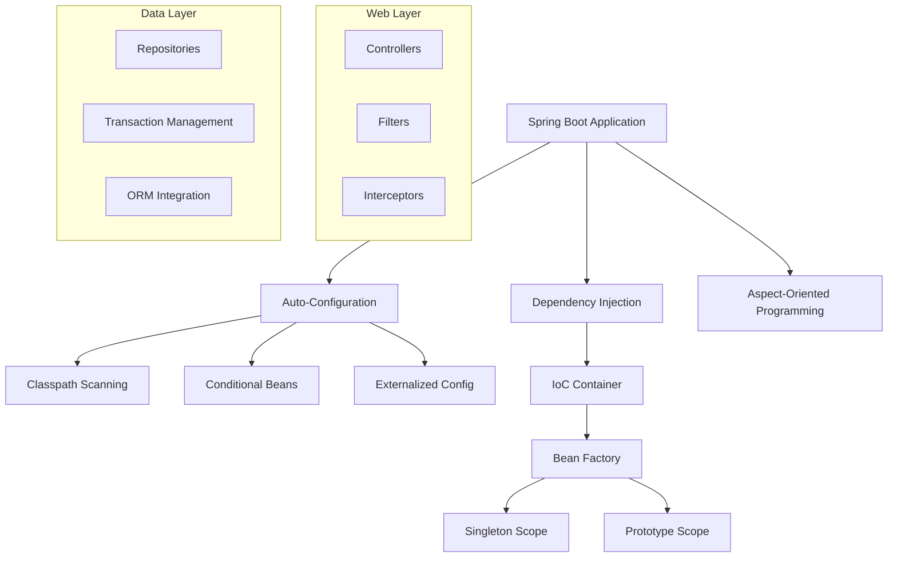
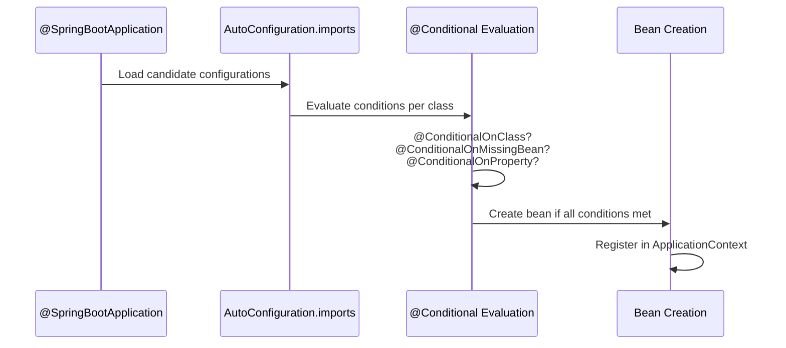
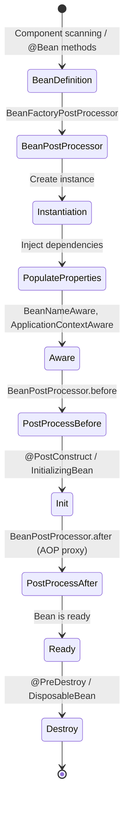
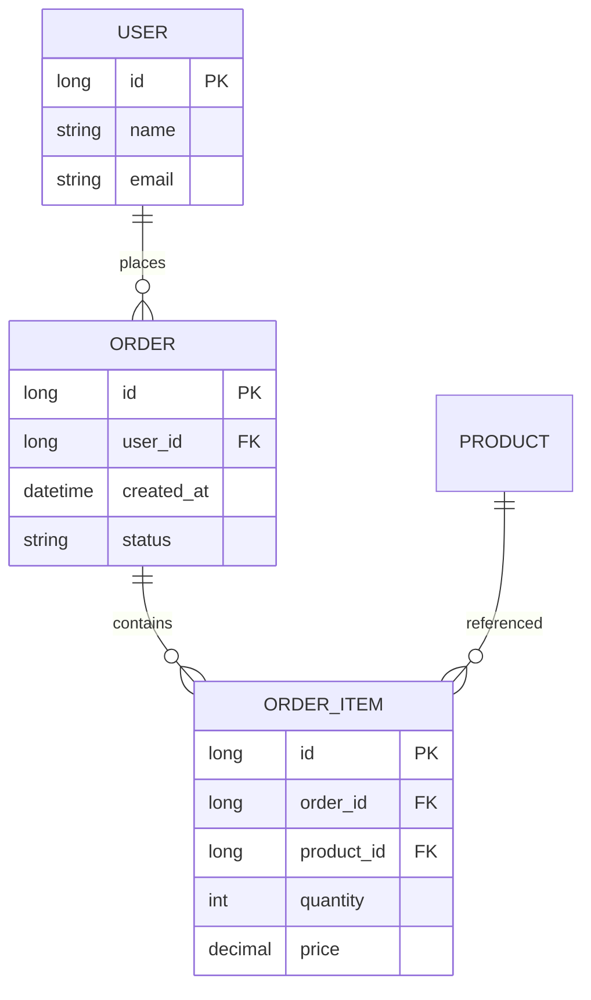

# Spring Boot

## Overview

Spring Boot is an opinionated framework for building production-ready Spring applications quickly. It eliminates boilerplate configuration, provides embedded servers, and offers auto-configuration based on classpath dependencies.

## Why Spring Boot for Interviews

- **Enterprise standard**: Most Java backend jobs require Spring Boot
- **Dependency Injection**: Core concept tested in interviews
- **Microservices**: Spring Cloud ecosystem for distributed systems
- **Auto-configuration**: Understanding how it works under the hood

## Architecture



## Core Concepts

### Dependency Injection

```java
// Constructor injection (recommended)
@Service
public class UserService {
    private final UserRepository repo;
    private final EmailService emailService;

    // Spring auto-injects dependencies
    public UserService(UserRepository repo, EmailService emailService) {
        this.repo = repo;
        this.emailService = emailService;
    }
}

// Field injection (not recommended)
@Service
public class UserService {
    @Autowired private UserRepository repo;
}

// Configuration classes
@Configuration
public class AppConfig {
    @Bean
    public PasswordEncoder passwordEncoder() {
        return new BCryptPasswordEncoder();
    }
}
```

### Auto-Configuration

```java
// @SpringBootApplication = @Configuration + @EnableAutoConfiguration + @ComponentScan
@SpringBootApplication
public class Application {
    public static void main(String[] args) {
        SpringApplication.run(Application.class, args);
    }
}

// Auto-configuration works by:
// 1. Scanning META-INF/spring/org.springframework.boot.autoconfigure.AutoConfiguration.imports
// 2. Evaluating @Conditional annotations
// 3. Creating beans only if conditions are met

// Example: DataSource auto-configuration
// If H2 is on classpath + no other DataSource → auto-creates H2 DataSource
// If spring.datasource.url is set → auto-creates connection pool
```

### REST Controllers

```java
@RestController
@RequestMapping("/api/users")
public class UserController {
    private final UserService userService;

    @GetMapping("/{id}")
    public ResponseEntity<User> getUser(@PathVariable Long id) {
        return ResponseEntity.ok(userService.findById(id));
    }

    @PostMapping
    public ResponseEntity<User> createUser(@Valid @RequestBody CreateUserRequest req) {
        User user = userService.create(req);
        URI location = URI.create("/api/users/" + user.getId());
        return ResponseEntity.created(location).body(user);
    }

    @PatchMapping("/{id}")
    public ResponseEntity<User> updateUser(
            @PathVariable Long id,
            @RequestBody UpdateUserRequest req) {
        return ResponseEntity.ok(userService.update(id, req));
    }

    @DeleteMapping("/{id}")
    @ResponseStatus(HttpStatus.NO_CONTENT)
    public void deleteUser(@PathVariable Long id) {
        userService.delete(id);
    }
}
```

### Data Access (Spring Data JPA)

```java
// Repository interface
@Repository
public interface UserRepository extends JpaRepository<User, Long> {
    Optional<User> findByEmail(String email);
    List<User> findByNameContainingIgnoreCase(String name);

    @Query("SELECT u FROM User u WHERE u.active = true")
    List<User> findAllActive();
}

// Entity
@Entity
@Table(name = "users")
public class User {
    @Id
    @GeneratedValue(strategy = GenerationType.IDENTITY)
    private Long id;

    @Column(nullable = false)
    private String name;

    @Column(unique = true)
    private String email;

    @OneToMany(mappedBy = "user", cascade = CascadeType.ALL)
    private List<Order> orders;
}

// Transaction management
@Service
@Transactional
public class UserService {
    @Transactional(readOnly = true)
    public User findById(Long id) {
        return repo.findById(id).orElseThrow();
    }
}
```

### Exception Handling

```java
@RestControllerAdvice
public class GlobalExceptionHandler {

    @ExceptionHandler(ResourceNotFoundException.class)
    public ResponseEntity<ErrorResponse> handleNotFound(ResourceNotFoundException ex) {
        return ResponseEntity.status(404)
            .body(new ErrorResponse("NOT_FOUND", ex.getMessage()));
    }

    @ExceptionHandler(MethodArgumentNotValidException.class)
    public ResponseEntity<ErrorResponse> handleValidation(MethodArgumentNotValidException ex) {
        Map<String, String> errors = new HashMap<>();
        ex.getBindingResult().getFieldErrors()
            .forEach(e -> errors.put(e.getField(), e.getDefaultMessage()));
        return ResponseEntity.badRequest()
            .body(new ErrorResponse("VALIDATION_ERROR", errors));
    }
}
```

## Auto-Configuration Deep Dive

### How Auto-Configuration Works



```java
// Auto-configuration class example
@AutoConfiguration
@ConditionalOnClass(DataSource.class)
@ConditionalOnProperty(prefix = "spring.datasource", name = "url")
@EnableConfigurationProperties(DataSourceProperties.class)
public class DataSourceAutoConfiguration {

    @Bean
    @ConditionalOnMissingBean
    public DataSource dataSource(DataSourceProperties props) {
        HikariDataSource ds = new HikariDataSource();
        ds.setJdbcUrl(props.getUrl());
        ds.setUsername(props.getUsername());
        ds.setPassword(props.getPassword());
        return ds;
    }
}
```

Key conditional annotations:

| Annotation | Condition |
|---|---|
| `@ConditionalOnClass` | Class exists on classpath |
| `@ConditionalOnMissingBean` | No bean of type registered |
| `@ConditionalOnProperty` | Property has specific value |
| `@ConditionalOnWebApplication` | Running in web context |
| `@ConditionalOnExpression` | SpEL expression is true |

### Custom Starter

```java
// 1. Define properties
@ConfigurationProperties(prefix = "app.greeting")
public class GreetingProperties {
    private String prefix = "Hello";
    private String suffix = "!";
    // getters/setters
}

// 2. Auto-configuration
@AutoConfiguration
@ConditionalOnClass(GreetingService.class)
@EnableConfigurationProperties(GreetingProperties.class)
public class GreetingAutoConfiguration {

    @Bean
    @ConditionalOnMissingBean
    public GreetingService greetingService(GreetingProperties props) {
        return new GreetingService(props.getPrefix(), props.getSuffix());
    }
}

// 3. Register in META-INF/spring/org.springframework.boot.autoconfigure.AutoConfiguration.imports
// com.example.GreetingAutoConfiguration
```

## Dependency Injection Container Lifecycle



```java
@Component
public class LifecycleBean implements InitializingBean, DisposableBean {

    @Autowired
    private SomeDependency dep;  // Property injection

    @PostConstruct
    public void init() {
        // After dependency injection
    }

    @Override
    public void afterPropertiesSet() {
        // InitializingBean callback
    }

    @PreDestroy
    public void cleanup() {
        // Before destruction
    }

    @Override
    public void destroy() {
        // DisposableBean callback
    }
}
```

## REST API Best Practices

### Validation with Bean Validation

```java
public record CreateUserRequest(
    @NotBlank @Size(min = 2, max = 100) String name,
    @NotBlank @Email String email,
    @NotNull @Min(0) @Max(150) Integer age,
    @Pattern(regexp = "^\\+?[0-9]{10,15}$") String phone
) {}

// Custom validator
@Target(ElementType.FIELD)
@Retention(RetentionPolicy.RUNTIME)
@Constraint(validatedBy = NoWhitespaceValidator.class)
public @interface NoWhitespace {
    String message() default "must not contain whitespace";
    Class<?>[] groups() default {};
    Class<? extends Payload>[] payload() default {};
}
```

### Pagination and Sorting

```java
@GetMapping
public Page<UserResponse> listUsers(
        @RequestParam(defaultValue = "0") int page,
        @RequestParam(defaultValue = "20") int size,
        @RequestParam(defaultValue = "name") String sortBy) {
    Pageable pageable = PageRequest.of(page, size, Sort.by(sortBy));
    return repo.findAll(pageable).map(UserResponse::from);
}
```

### HATEOAS

```java
@GetMapping("/{id}")
public EntityModel<User> getUser(@PathVariable Long id) {
    User user = service.findById(id);
    return EntityModel.of(user,
        linkTo(methodOn(UserController.class).getUser(id)).withSelfRel(),
        linkTo(methodOn(UserController.class).listUsers(0, 20, "name")).withRel("users"));
}
```

## JPA Deep Dive

### Entity Relationships



```java
@Entity
public class Order {
    @Id @GeneratedValue(strategy = GenerationType.IDENTITY)
    private Long id;

    @ManyToOne(fetch = FetchType.LAZY)
    @JoinColumn(name = "user_id")
    private User user;

    @OneToMany(mappedBy = "order", cascade = CascadeType.ALL, orphanRemoval = true)
    @OrderBy("id ASC")
    private List<OrderItem> items = new ArrayList<>();

    @Enumerated(EnumType.STRING)
    private OrderStatus status;

    @Version  // Optimistic locking
    private Long version;
}
```

### N+1 Problem and Solutions

```java
// BAD: N+1 queries (1 for orders, N for each user)
@Query("SELECT o FROM Order o")
List<Order> findAllOrders();  // Each order.user triggers lazy load

// GOOD: Join fetch (single query)
@Query("SELECT o FROM Order o JOIN FETCH o.user")
List<Order> findAllOrdersWithUser();

// GOOD: @EntityGraph
@EntityGraph(attributePaths = {"user", "items"})
@Query("SELECT o FROM Order o")
List<Order> findAllOrdersWithDetails();
```

### Custom Queries

```java
@Repository
public interface OrderRepository extends JpaRepository<Order, Long> {

    // Derived query
    List<Order> findByStatusAndUserEmail(OrderStatus status, String email);

    // JPQL
    @Query("SELECT o FROM Order o WHERE o.createdAt >= :since")
    Page<Order> findRecentOrders(@Param("since") LocalDateTime since, Pageable pageable);

    // Native SQL
    @Query(value = "SELECT * FROM orders WHERE total > :min", nativeQuery = true)
    List<Order> findHighValueOrders(@Param("min") BigDecimal min);

    // Modifying
    @Modifying
    @Query("UPDATE Order o SET o.status = :status WHERE o.id = :id")
    int updateStatus(@Param("id") Long id, @Param("status") OrderStatus status);
}
```

## Key Annotations Reference

| Annotation | Layer | Purpose |
|---|---|---|
| `@SpringBootApplication` | Main | Entry point, enables auto-config |
| `@RestController` | Web | REST controller (returns JSON) |
| `@Service` | Business | Service layer stereotype |
| `@Repository` | Data | DAO with exception translation |
| `@Component` | Any | Generic Spring-managed bean |
| `@Configuration` | Config | Defines @Bean methods |
| `@Autowired` | Any | Dependency injection |
| `@Value` | Any | Inject property values |
| `@Transactional` | Business | Declarative transaction management |
| `@Cacheable` | Business | Method-level caching |
| `@Async` | Business | Async method execution |
| `@Scheduled` | Business | Cron-like scheduling |
| `@Profile` | Config | Bean active only for specific profile |
| `@Qualifier` | Any | Disambiguate when multiple beans of same type |

## Testing

```java
@SpringBootTest
@AutoConfigureMockMvc
class UserControllerTest {
    @Autowired private MockMvc mockMvc;
    @MockBean private UserService userService;

    @Test
    void shouldReturnUser() throws Exception {
        when(userService.findById(1L))
            .thenReturn(new User(1L, "Alice", "alice@example.com"));

        mockMvc.perform(get("/api/users/1"))
            .andExpect(status().isOk())
            .andExpect(jsonPath("$.name").value("Alice"));
    }
}

// Integration test with @DataJpaTest
@DataJpaTest
class UserRepositoryTest {
    @Autowired private UserRepository repo;

    @Test
    void shouldFindByEmail() {
        repo.save(new User("Alice", "alice@example.com"));
        assertThat(repo.findByEmail("alice@example.com")).isPresent();
    }
}
```

## Interview Questions

1. **What is IoC?** — Inversion of Control: the framework manages object creation and lifecycle
2. **DI vs Service Locator?** — DI is explicit, testable; SL is implicit, harder to test
3. **Bean scopes?** — Singleton (default), Prototype, Request, Session, Application
4. **@Component vs @Service vs @Repository?** — All are @Component stereotypes; @Repository adds exception translation; @Service is semantic
5. **How does auto-configuration work?** — Conditional beans based on classpath, properties, and other beans
6. **@Transactional propagation?** — REQUIRED (default), REQUIRES_NEW, NESTED, SUPPORTS, NOT_SUPPORTED, MANDATORY, NEVER
7. **How to handle distributed transactions?** — Saga pattern, event-driven, 2PC (rarely)
8. **Spring AOP?** — Proxy-based; JDK dynamic proxies for interfaces, CGLIB for classes
9. **What is the N+1 problem?** — Lazy loading causes 1 query for parent + N queries for children; solve with JOIN FETCH or @EntityGraph
10. **Optimistic vs pessimistic locking?** — Optimistic uses @Version, fails on conflict; pessimistic uses SELECT FOR UPDATE, blocks others

## References

- [Spring Boot Official Documentation](https://spring.io/projects/spring-boot)
- [Spring Framework Reference](https://docs.spring.io/spring-framework/reference/)
- [Spring Data JPA Reference](https://spring.io/projects/spring-data-jpa)
- [Baeldung Spring Boot Tutorials](https://www.baeldung.com/spring-boot)
- [Spring Boot Auto-Configuration Deep Dive](https://docs.spring.io/spring-boot/reference/using/auto-configuration.html)

## Related Topics

- [Java](../../languages/java/) — Java language fundamentals
- [JVM Internals](../../languages/java/jvm.md) — How Spring runs on JVM
- [Backend Engineering](../../backend/) — API design, microservices
- [System Design](../../interview/system-design/) — Distributed systems
