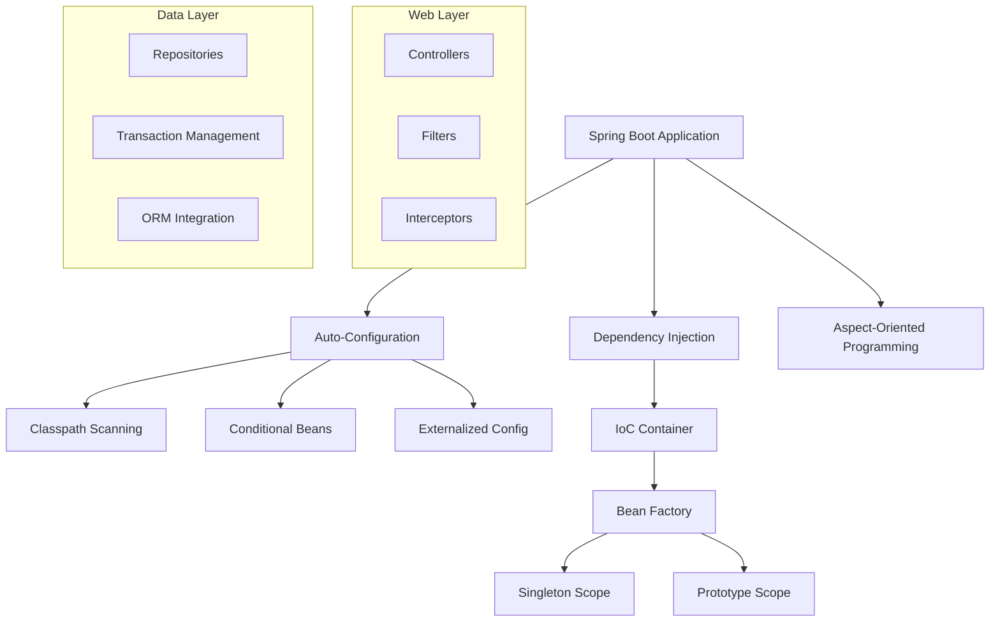

# Spring Boot

## Overview

Spring Boot is an opinionated framework for building production-ready Spring applications quickly. It eliminates boilerplate configuration, provides embedded servers, and offers auto-configuration based on classpath dependencies.

## Why Spring Boot for Interviews

- **Enterprise standard**: Most Java backend jobs require Spring Boot
- **Dependency Injection**: Core concept tested in interviews
- **Microservices**: Spring Cloud ecosystem for distributed systems
- **Auto-configuration**: Understanding how it works under the hood

## Architecture



## Core Concepts

### Dependency Injection

```java
// Constructor injection (recommended)
@Service
public class UserService {
    private final UserRepository repo;
    private final EmailService emailService;
    
    // Spring auto-injects dependencies
    public UserService(UserRepository repo, EmailService emailService) {
        this.repo = repo;
        this.emailService = emailService;
    }
}

// Field injection (not recommended)
@Service
public class UserService {
    @Autowired private UserRepository repo;
}

// Configuration classes
@Configuration
public class AppConfig {
    @Bean
    public PasswordEncoder passwordEncoder() {
        return new BCryptPasswordEncoder();
    }
}
```

### Auto-Configuration

```java
// @SpringBootApplication = @Configuration + @EnableAutoConfiguration + @ComponentScan
@SpringBootApplication
public class Application {
    public static void main(String[] args) {
        SpringApplication.run(Application.class, args);
    }
}

// Auto-configuration works by:
// 1. Scanning META-INF/spring/org.springframework.boot.autoconfigure.AutoConfiguration.imports
// 2. Evaluating @Conditional annotations
// 3. Creating beans only if conditions are met

// Example: DataSource auto-configuration
// If H2 is on classpath + no other DataSource → auto-creates H2 DataSource
// If spring.datasource.url is set → auto-creates connection pool
```

### REST Controllers

```java
@RestController
@RequestMapping("/api/users")
public class UserController {
    private final UserService userService;
    
    @GetMapping("/{id}")
    public ResponseEntity<User> getUser(@PathVariable Long id) {
        return ResponseEntity.ok(userService.findById(id));
    }
    
    @PostMapping
    public ResponseEntity<User> createUser(@Valid @RequestBody CreateUserRequest req) {
        User user = userService.create(req);
        URI location = URI.create("/api/users/" + user.getId());
        return ResponseEntity.created(location).body(user);
    }
    
    @PatchMapping("/{id}")
    public ResponseEntity<User> updateUser(
            @PathVariable Long id,
            @RequestBody UpdateUserRequest req) {
        return ResponseEntity.ok(userService.update(id, req));
    }
    
    @DeleteMapping("/{id}")
    @ResponseStatus(HttpStatus.NO_CONTENT)
    public void deleteUser(@PathVariable Long id) {
        userService.delete(id);
    }
}
```

### Data Access (Spring Data JPA)

```java
// Repository interface
@Repository
public interface UserRepository extends JpaRepository<User, Long> {
    Optional<User> findByEmail(String email);
    List<User> findByNameContainingIgnoreCase(String name);
    
    @Query("SELECT u FROM User u WHERE u.active = true")
    List<User> findAllActive();
}

// Entity
@Entity
@Table(name = "users")
public class User {
    @Id
    @GeneratedValue(strategy = GenerationType.IDENTITY)
    private Long id;
    
    @Column(nullable = false)
    private String name;
    
    @Column(unique = true)
    private String email;
    
    @OneToMany(mappedBy = "user", cascade = CascadeType.ALL)
    private List<Order> orders;
}

// Transaction management
@Service
@Transactional
public class UserService {
    @Transactional(readOnly = true)
    public User findById(Long id) {
        return repo.findById(id).orElseThrow();
    }
}
```

### Exception Handling

```java
@RestControllerAdvice
public class GlobalExceptionHandler {
    
    @ExceptionHandler(ResourceNotFoundException.class)
    public ResponseEntity<ErrorResponse> handleNotFound(ResourceNotFoundException ex) {
        return ResponseEntity.status(404)
            .body(new ErrorResponse("NOT_FOUND", ex.getMessage()));
    }
    
    @ExceptionHandler(MethodArgumentNotValidException.class)
    public ResponseEntity<ErrorResponse> handleValidation(MethodArgumentNotValidException ex) {
        Map<String, String> errors = new HashMap<>();
        ex.getBindingResult().getFieldErrors()
            .forEach(e -> errors.put(e.getField(), e.getDefaultMessage()));
        return ResponseEntity.badRequest()
            .body(new ErrorResponse("VALIDATION_ERROR", errors));
    }
}
```

## Testing

```java
@SpringBootTest
@AutoConfigureMockMvc
class UserControllerTest {
    @Autowired private MockMvc mockMvc;
    @MockBean private UserService userService;
    
    @Test
    void shouldReturnUser() throws Exception {
        when(userService.findById(1L))
            .thenReturn(new User(1L, "Alice", "alice@example.com"));
        
        mockMvc.perform(get("/api/users/1"))
            .andExpect(status().isOk())
            .andExpect(jsonPath("$.name").value("Alice"));
    }
}

// Integration test with @DataJpaTest
@DataJpaTest
class UserRepositoryTest {
    @Autowired private UserRepository repo;
    
    @Test
    void shouldFindByEmail() {
        repo.save(new User("Alice", "alice@example.com"));
        assertThat(repo.findByEmail("alice@example.com")).isPresent();
    }
}
```

## Interview Questions

1. **What is IoC?** — Inversion of Control: the framework manages object creation and lifecycle
2. **DI vs Service Locator?** — DI is explicit, testable; SL is implicit, harder to test
3. **Bean scopes?** — Singleton (default), Prototype, Request, Session, Application
4. **@Component vs @Service vs @Repository?** — All are @Component stereotypes; @Repository adds exception translation; @Service is semantic
5. **How does auto-configuration work?** — Conditional beans based on classpath, properties, and other beans
6. **@Transactional propagation?** — REQUIRED (default), REQUIRES_NEW, NESTED, SUPPORTS, NOT_SUPPORTED, MANDATORY, NEVER
7. **How to handle distributed transactions?** — Saga pattern, event-driven, 2PC (rarely)
8. **Spring AOP?** — Proxy-based; JDK dynamic proxies for interfaces, CGLIB for classes

## Related Topics

- [Java](../../languages/java/) — Java language fundamentals
- [JVM Internals](../../languages/java/jvm.md) — How Spring runs on JVM
- [Backend Engineering](../../backend/) — API design, microservices
- [System Design](../../interview/system-design/) — Distributed systems
